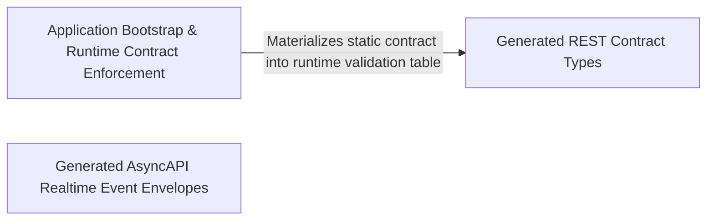

---
tags:
  - 2brain
  - 2brain/arch
  - project/boilerplate-vue-frontend
type: architecture
component: Application_Bootstrap
---

## Details

The app entry point that boots the Vue application and carries the generated contract surface (AsyncAPI realtime envelopes, REST route table) plus the HTTP response-schema validation that enforces those contracts at runtime.

### Generated REST Contract Types
The complete static type surface of the REST API, generated from openapi.yaml. Contains every request body type, every response envelope, and the generated route table (ROUTES) that maps method + URL pattern to schema name. These types are the compile-time contract that stores, views, and the runtime validator all reference. They are read-only, derived artifacts — never hand-edited.

**Related Classes/Methods**:

- `contracts.rest.index.AbilitiesEnvelope`:218-223
- `contracts.rest.index.AddCartItemRequest`:2969-2972
- `contracts.rest.index.AddressesEnvelope`:1937-1942

**Source Files:**

- `contracts/rest/index.ts`
  - `contracts.rest.index.PaginationMeta` (L93-L100) - Interface
  - `contracts.rest.index.MessageResponse` (L108-L112) - Interface
  - `contracts.rest.index.ErrorItem` (L119-L126) - Interface
  - `contracts.rest.index.ErrorResponse` (L128-L138) - Interface
  - `contracts.rest.index.ValidationErrorResponse` (L140-L150) - Interface
  - `contracts.rest.index.Abilities` (L183-L216) - Interface
  - `contracts.rest.index.AbilitiesEnvelope` (L218-L223) - Interface
  - `contracts.rest.index.User` (L225-L245) - Interface
  - `contracts.rest.index.UserEnvelope` (L247-L252) - Interface
  - `contracts.rest.index.Product` (L281-L322) - Interface
  - `contracts.rest.index.CartItem` (L324-L328) - Interface
  - `contracts.rest.index.OrderAddress` (L330-L337) - Interface
  - `contracts.rest.index.OrderTransferInstructions` (L339-L346) - Interface
  - `contracts.rest.index.OrderLineProduct` (L348-L375) - Interface
  - `contracts.rest.index.OrderLineCurrent` (L377-L380) - Interface
  - `contracts.rest.index.OrderItem` (L382-L399) - Interface
  - `contracts.rest.index.OrderActions` (L466-L489) - Interface
  - `contracts.rest.index.OrderTaxSummaryRow` (L491-L506) - Interface
  - `contracts.rest.index.Order` (L508-L575) - Interface
  - `contracts.rest.index.ExportInvoiceDocument` (L594-L601) - Interface
  - `contracts.rest.index.Address` (L608-L619) - Interface
  - `contracts.rest.index.ApiKey` (L621-L636) - Interface
  - `contracts.rest.index.Refund` (L663-L679) - Interface
  - `contracts.rest.index.ExportPayment` (L692-L706) - Interface
  - `contracts.rest.index.ExportShipment` (L715-L723) - Interface
  - `contracts.rest.index.ExportSession` (L731-L736) - Interface
  - `contracts.rest.index.ExportAuditEntry` (L777-L796) - Interface
  - `contracts.rest.index.ExportFeedbackTicket` (L798-L807) - Interface
  - `contracts.rest.index.ExportReturn` (L841-L849) - Interface
  - `contracts.rest.index.AccountExportResponse` (L851-L868) - Interface
  - `contracts.rest.index.AccountExportEnvelope` (L870-L875) - Interface
  - `contracts.rest.index.HardDeleteRequest` (L877-L879) - Interface
  - `contracts.rest.index.HealthPing` (L890-L893) - Interface
  - `contracts.rest.index.HealthPingEnvelope` (L895-L900) - Interface
  - `contracts.rest.index.LocaleCapability` (L944-L960) - Interface
  - `contracts.rest.index.LocaleCapabilities` (L965-L970) - Interface
  - `contracts.rest.index.LocaleCapabilitiesEnvelope` (L972-L977) - Interface
  - `contracts.rest.index.CreateLocaleRequest` (L979-L987) - Interface
  - `contracts.rest.index.Language` (L992-L1011) - Interface
  - `contracts.rest.index.LanguageEnvelope` (L1013-L1018) - Interface
  - `contracts.rest.index.LocaleTenantDescriptor` (L1033-L1038) - Interface
  - `contracts.rest.index.LocaleTenants` (L1040-L1043) - Interface
  - `contracts.rest.index.LocaleTenantsEnvelope` (L1045-L1050) - Interface
  - `contracts.rest.index.LocaleDictionary` (L1060-L1064) - Interface
  - `contracts.rest.index.LocaleDictionaryEnvelope` (L1066-L1071) - Interface
  - `contracts.rest.index.ReplaceLocaleRequest` (L1073-L1080) - Interface
  - `contracts.rest.index.UpdateLocaleRequest` (L1085-L1092) - Interface
  - `contracts.rest.index.LocaleMessages` (L1102-L1108) - Interface
  - `contracts.rest.index.LocaleMessagesEnvelope` (L1110-L1115) - Interface
  - `contracts.rest.index.LocaleEntry` (L1121-L1130) - Interface
  - `contracts.rest.index.LocaleEntriesResponse` (L1132-L1135) - Interface
  - `contracts.rest.index.LocaleEntriesResponseEnvelope` (L1137-L1142) - Interface
  - `contracts.rest.index.LocaleEntryInput` (L1149-L1153) - Interface
  - `contracts.rest.index.ReplaceLocaleEntriesRequest` (L1159-L1161) - Interface
  - `contracts.rest.index.LocaleImportResult` (L1166-L1175) - Interface
  - `contracts.rest.index.LocaleImportResultEnvelope` (L1177-L1182) - Interface
  - `contracts.rest.index.CreateLocaleEntryRequest` (L1184-L1188) - Interface
  - `contracts.rest.index.LocaleEntryEnvelope` (L1190-L1195) - Interface
  - `contracts.rest.index.MergeLocaleEntriesRequest` (L1200-L1203) - Interface
  - `contracts.rest.index.UpdateLocaleEntryRequest` (L1205-L1207) - Interface
  - `contracts.rest.index.Translation` (L1233-L1247) - Interface
  - `contracts.rest.index.EntityTranslations` (L1252-L1258) - Interface
  - `contracts.rest.index.EntityTranslationsEnvelope` (L1260-L1265) - Interface
  - `contracts.rest.index.UpsertTranslationRequest` (L1275-L1279) - Interface
  - `contracts.rest.index.UpsertTranslationsRequest` (L1284-L1286) - Interface
  - `contracts.rest.index.MergeTranslationRequest` (L1296-L1300) - Interface
  - `contracts.rest.index.MergeTranslationsRequest` (L1305-L1307) - Interface
  - `contracts.rest.index.ObservabilityDependency` (L1322-L1324) - Interface
  - `contracts.rest.index.ObservabilityHealthDependencies` (L1329-L1333) - Interface
  - `contracts.rest.index.ObservabilityHealthTelemetry` (L1354-L1360) - Interface
  - `contracts.rest.index.ProcessMemory` (L1366-L1375) - Interface
  - `contracts.rest.index.ObservabilityHealthSystem` (L1377-L1381) - Interface
  - `contracts.rest.index.ObservabilityHealthJob` (L1387-L1393) - Interface
  - `contracts.rest.index.ObservabilityHealthQueue` (L1398-L1403) - Interface
  - `contracts.rest.index.ObservabilityHealth` (L1417-L1438) - Interface
  - `contracts.rest.index.ObservabilityHealthResponseEnvelope` (L1440-L1445) - Interface
  - `contracts.rest.index.ObservabilityMetricsLatency` (L1447-L1452) - Interface
  - `contracts.rest.index.ObservabilityMetricsSummary` (L1503-L1510) - Interface
  - `contracts.rest.index.ObservabilityMetricsSummaryResponseEnvelope` (L1512-L1517) - Interface
  - `contracts.rest.index.AuditEventItem` (L1557-L1576) - Interface
  - `contracts.rest.index.AuditLogsPage` (L1578-L1581) - Interface
  - `contracts.rest.index.AuditLogsResponseEnvelope` (L1583-L1588) - Interface
  - `contracts.rest.index.AuditEntryItem` (L1628-L1647) - Interface
  - `contracts.rest.index.AuditEntryList` (L1649-L1652) - Interface
  - `contracts.rest.index.AuditEntryListResponseEnvelope` (L1654-L1659) - Interface
  - `contracts.rest.index.AntibotRungs` (L1676-L1681) - Interface
  - `contracts.rest.index.AntibotConfig` (L1688-L1694) - Interface
  - `contracts.rest.index.AntibotConfigEnvelope` (L1696-L1701) - Interface
  - `contracts.rest.index.AntibotChallengeParameters` (L1706-L1720) - Interface
  - `contracts.rest.index.AntibotChallenge` (L1725-L1729) - Interface
  - `contracts.rest.index.AntibotChallengeEnvelope` (L1731-L1736) - Interface
  - `contracts.rest.index.ReplaceAccountRequest` (L1738-L1756) - Interface
  - `contracts.rest.index.ReplaceAccountRequestMultipart` (L1758-L1770) - Interface
  - `contracts.rest.index.UpdateAccountRequest` (L1772-L1790) - Interface
  - `contracts.rest.index.UpdateAccountRequestMultipart` (L1792-L1804) - Interface
  - `contracts.rest.index.ChangePasswordRequest` (L1806-L1810) - Interface
  - `contracts.rest.index.AuthTokens` (L1812-L1819) - Interface
  - `contracts.rest.index.ChangePasswordResponseEnvelope` (L1821-L1826) - Interface
  - `contracts.rest.index.PasswordCheckRequest` (L1828-L1834) - Interface
  - `contracts.rest.index.PasswordCheck` (L1836-L1844) - Interface
  - `contracts.rest.index.PasswordCheckEnvelope` (L1846-L1851) - Interface
  - `contracts.rest.index.ReauthMethods` (L1863-L1866) - Interface
  - `contracts.rest.index.ReauthMethodsEnvelope` (L1868-L1873) - Interface
  - `contracts.rest.index.ReauthPasswordRequest` (L1882-L1885) - Interface
  - `contracts.rest.index.ReauthEmailRequest` (L1894-L1901) - Interface
  - `contracts.rest.index.AuthTokensEnvelope` (L1905-L1910) - Interface
  - `contracts.rest.index.Session` (L1912-L1920) - Interface
  - `contracts.rest.index.SessionsResponse` (L1922-L1924) - Interface
  - `contracts.rest.index.SessionsEnvelope` (L1926-L1931) - Interface
  - `contracts.rest.index.AddressesResponse` (L1933-L1935) - Interface
  - `contracts.rest.index.AddressesEnvelope` (L1937-L1942) - Interface
  - `contracts.rest.index.AddressInput` (L1944-L1959) - Interface
  - `contracts.rest.index.AddressEnvelope` (L1961-L1966) - Interface
  - `contracts.rest.index.ReplaceAddressRequest` (L1968-L1988) - Interface
  - `contracts.rest.index.UpdateAddressRequest` (L1990-L2010) - Interface
  - `contracts.rest.index.EmailVerificationRequested` (L2012-L2015) - Interface
  - `contracts.rest.index.EmailVerificationRequestedEnvelope` (L2017-L2022) - Interface
  - `contracts.rest.index.VerifyEmailConfirmRequest` (L2024-L2030) - Interface
  - `contracts.rest.index.AccountDeleteConfirmRequest` (L2032-L2038) - Interface
  - `contracts.rest.index.LoginRequest` (L2051-L2055) - Interface
  - `contracts.rest.index.TwoFactorMethodSummary` (L2057-L2072) - Interface
  - `contracts.rest.index.MfaChallenge` (L2074-L2085) - Interface
  - `contracts.rest.index.LoginResponseEnvelope` (L2092-L2097) - Interface
  - `contracts.rest.index.SignupRequest` (L2099-L2107) - Interface
  - `contracts.rest.index.PasswordResetRequest` (L2109-L2111) - Interface
  - `contracts.rest.index.PasswordResetConfirmRequest` (L2113-L2121) - Interface
  - `contracts.rest.index.RefreshTokenResponse` (L2123-L2130) - Interface
  - `contracts.rest.index.RefreshTokenEnvelope` (L2132-L2137) - Interface
  - `contracts.rest.index.LoginTwoFactorRequest` (L2139-L2148) - Interface
  - `contracts.rest.index.TwoFactorSendRequest` (L2150-L2158) - Interface
  - `contracts.rest.index.TwoFactorDelivery` (L2160-L2169) - Interface
  - `contracts.rest.index.TwoFactorDeliveryEnvelope` (L2171-L2176) - Interface
  - `contracts.rest.index.TwoFactorStatus` (L2178-L2187) - Interface
  - `contracts.rest.index.TwoFactorStatusEnvelope` (L2189-L2194) - Interface
  - `contracts.rest.index.TwoFactorCodeRequest` (L2196-L2199) - Interface
  - `contracts.rest.index.TwoFactorSetupRequest` (L2201-L2204) - Interface
  - `contracts.rest.index.TwoFactorSetup` (L2206-L2221) - Interface
  - `contracts.rest.index.TwoFactorSetupEnvelope` (L2223-L2228) - Interface
  - `contracts.rest.index.TwoFactorConfirmRequest` (L2230-L2233) - Interface
  - `contracts.rest.index.TwoFactorConfirmed` (L2235-L2242) - Interface
  - `contracts.rest.index.TwoFactorConfirmEnvelope` (L2244-L2249) - Interface
  - `contracts.rest.index.TwoFactorBackupCodesRegenerated` (L2251-L2256) - Interface
  - `contracts.rest.index.TwoFactorBackupCodesRegeneratedEnvelope` (L2258-L2263) - Interface
  - `contracts.rest.index.OAuthProviders` (L2265-L2268) - Interface
  - `contracts.rest.index.OAuthProvidersEnvelope` (L2270-L2275) - Interface
  - `contracts.rest.index.UsersResponse` (L2294-L2297) - Interface
  - `contracts.rest.index.UsersResponseEnvelope` (L2299-L2304) - Interface
  - `contracts.rest.index.CreateUserRequest` (L2306-L2317) - Interface
  - `contracts.rest.index.CreateUserRequestMultipart` (L2319-L2331) - Interface
  - `contracts.rest.index.DeleteUserRequest` (L2333-L2336) - Interface
  - `contracts.rest.index.ReplaceUserByIdRequest` (L2338-L2359) - Interface
  - `contracts.rest.index.ReplaceUserByIdRequestMultipart` (L2361-L2376) - Interface
  - `contracts.rest.index.UpdateUserByIdRequest` (L2378-L2399) - Interface
  - `contracts.rest.index.UpdateUserByIdRequestMultipart` (L2401-L2416) - Interface
  - `contracts.rest.index.SearchUsersRequest` (L2418-L2432) - Interface
  - `contracts.rest.index.CreateFeedbackRequest` (L2434-L2450) - Interface
  - `contracts.rest.index.FeedbackRequest` (L2462-L2473) - Interface
  - `contracts.rest.index.FeedbackRequestEnvelope` (L2475-L2480) - Interface
  - `contracts.rest.index.FeedbackRequestsResponse` (L2500-L2503) - Interface
  - `contracts.rest.index.FeedbackRequestsResponseEnvelope` (L2505-L2510) - Interface
  - `contracts.rest.index.SearchFeedbackRequestsRequest` (L2512-L2519) - Interface
  - `contracts.rest.index.ReplaceFeedbackRequestStatusRequest` (L2521-L2529) - Interface
  - `contracts.rest.index.UpdateFeedbackRequestStatusRequest` (L2531-L2539) - Interface
  - `contracts.rest.index.ProductsResponse` (L2558-L2561) - Interface
  - `contracts.rest.index.ProductsResponseEnvelope` (L2563-L2568) - Interface
  - `contracts.rest.index.ProductTranslationFieldsWrite` (L2570-L2574) - Interface
  - `contracts.rest.index.ProductTranslationsWrite` (L2579-L2581) - Interface
  - `contracts.rest.index.CreateProductRequest` (L2583-L2608) - Interface
  - `contracts.rest.index.CreateProductRequestMultipart` (L2610-L2637) - Interface
  - `contracts.rest.index.ProductEnvelope` (L2639-L2644) - Interface
  - `contracts.rest.index.DeleteProductRequest` (L2646-L2649) - Interface
  - `contracts.rest.index.FacetCount` (L2651-L2655) - Interface
  - `contracts.rest.index.CatalogueFacetsResponse` (L2657-L2660) - Interface
  - `contracts.rest.index.CatalogueFacetsEnvelope` (L2662-L2667) - Interface
  - `contracts.rest.index.ProductSettingsResponse` (L2669-L2672) - Interface
  - `contracts.rest.index.ProductSettingsEnvelope` (L2674-L2679) - Interface
  - `contracts.rest.index.ReplaceProductRequest` (L2681-L2708) - Interface
  - `contracts.rest.index.ReplaceProductRequestMultipart` (L2710-L2735) - Interface
  - `contracts.rest.index.ProductTranslationFieldsPatch` (L2737-L2746) - Interface
  - `contracts.rest.index.ProductTranslationsPatch` (L2751-L2753) - Interface
  - `contracts.rest.index.UpdateProductRequest` (L2755-L2782) - Interface
  - `contracts.rest.index.UpdateProductRequestMultipart` (L2784-L2809) - Interface
  - `contracts.rest.index.ProductTranslationFields` (L2811-L2814) - Interface
  - `contracts.rest.index.ProductAdmin` (L2821-L2857) - Interface
  - `contracts.rest.index.ProductAdminEnvelope` (L2859-L2864) - Interface
  - `contracts.rest.index.SearchProductsRequest` (L2866-L2885) - Interface
  - `contracts.rest.index.CartSummaryResponse` (L2887-L2915) - Interface
  - `contracts.rest.index.CartShippingOption` (L2920-L2932) - Interface
  - `contracts.rest.index.CartShipping` (L2937-L2947) - Interface
  - `contracts.rest.index.CartResponse` (L2949-L2953) - Interface
  - `contracts.rest.index.CartResponseEnvelope` (L2955-L2960) - Interface
  - `contracts.rest.index.AddCartItemRequest` (L2969-L2972) - Interface
  - `contracts.rest.index.RemoveCartItemRequest` (L2974-L2976) - Interface
  - `contracts.rest.index.UpdateCartItemByIdRequest` (L2978-L2980) - Interface
  - `contracts.rest.index.SetCartShippingMethodRequest` (L2982-L2989) - Interface
  - `contracts.rest.index.CartSummaryResponseEnvelope` (L2991-L2996) - Interface
  - `contracts.rest.index.CheckoutRequest` (L2998-L3010) - Interface
  - `contracts.rest.index.CheckoutResponseEnvelope` (L3012-L3017) - Interface
  - `contracts.rest.index.WishlistItem` (L3019-L3021) - Interface
  - `contracts.rest.index.WishlistResponse` (L3023-L3025) - Interface
  - `contracts.rest.index.WishlistResponseEnvelope` (L3027-L3032) - Interface
  - `contracts.rest.index.OrdersResponse` (L3051-L3054) - Interface
  - `contracts.rest.index.OrdersResponseEnvelope` (L3056-L3061) - Interface
  - `contracts.rest.index.CreateOrderRequest` (L3066-L3071) - Interface
  - `contracts.rest.index.OrderEnvelope` (L3073-L3078) - Interface
  - `contracts.rest.index.DeleteOrderRequest` (L3080-L3083) - Interface
  - `contracts.rest.index.SearchOrdersRequest` (L3085-L3101) - Interface
  - `contracts.rest.index.ReplaceOrderByIdRequest` (L3103-L3105) - Interface
  - `contracts.rest.index.UpdateOrderByIdRequest` (L3107-L3109) - Interface
  - `contracts.rest.index.CancelOrderRequest` (L3114-L3117) - Interface
  - `contracts.rest.index.StatusOverrideRequest` (L3119-L3127) - Interface
  - `contracts.rest.index.CreditNoteSummary` (L3129-L3142) - Interface
  - `contracts.rest.index.CreditNoteListEnvelope` (L3144-L3149) - Interface
  - `contracts.rest.index.PaymentMethodOption` (L3151-L3158) - Interface
  - `contracts.rest.index.PaymentMethodsResponse` (L3160-L3162) - Interface
  - `contracts.rest.index.PaymentMethodsResponseEnvelope` (L3164-L3169) - Interface
  - `contracts.rest.index.CreatePaymentIntentRequest` (L3171-L3173) - Interface
  - `contracts.rest.index.PaymentActions` (L3178-L3183) - Interface
  - `contracts.rest.index.Payment` (L3211-L3251) - Interface
  - `contracts.rest.index.PaymentEnvelope` (L3253-L3258) - Interface
  - `contracts.rest.index.OrderByReferenceResponseEnvelope` (L3260-L3265) - Interface
  - `contracts.rest.index.RefundPaymentRequest` (L3267-L3275) - Interface
  - `contracts.rest.index.RecordOfflinePaymentRequest` (L3289-L3300) - Interface
  - `contracts.rest.index.ConfirmPaymentRequest` (L3302-L3310) - Interface
  - `contracts.rest.index.PaymentWebhookEvent` (L3329-L3338) - Interface
  - `contracts.rest.index.ShippingMethod` (L3340-L3374) - Interface
  - `contracts.rest.index.ReturnAddress` (L3379-L3386) - Interface
  - `contracts.rest.index.ShippingMethodsResponse` (L3388-L3393) - Interface
  - `contracts.rest.index.ShippingMethodsResponseEnvelope` (L3395-L3400) - Interface
  - `contracts.rest.index.Shipment` (L3412-L3422) - Interface
  - `contracts.rest.index.ShipmentEnvelope` (L3424-L3429) - Interface
  - `contracts.rest.index.ShipOrderRequest` (L3431-L3444) - Interface
  - `contracts.rest.index.DeliverOrderRequest` (L3446-L3454) - Interface
  - `contracts.rest.index.ReturnLine` (L3459-L3470) - Interface
  - `contracts.rest.index.ReturnActions` (L3475-L3482) - Interface
  - `contracts.rest.index.Return` (L3494-L3532) - Interface
  - `contracts.rest.index.ReturnsResponse` (L3534-L3537) - Interface
  - `contracts.rest.index.ReturnsResponseEnvelope` (L3539-L3544) - Interface
  - `contracts.rest.index.CreateReturnRequest` (L3552-L3565) - Interface
  - `contracts.rest.index.ReturnEnvelope` (L3567-L3572) - Interface
  - `contracts.rest.index.DeclineReturnRequest` (L3574-L3581) - Interface
  - `contracts.rest.index.ReceiveReturnRequest` (L3583-L3589) - Interface
  - `contracts.rest.index.InventoryLevel` (L3591-L3601) - Interface
  - `contracts.rest.index.InventoryLevelsResponse` (L3603-L3606) - Interface
  - `contracts.rest.index.InventoryLevelsResponseEnvelope` (L3608-L3613) - Interface
  - `contracts.rest.index.StockMovement` (L3636-L3648) - Interface
  - `contracts.rest.index.StockMovementsResponse` (L3650-L3653) - Interface
  - `contracts.rest.index.StockMovementsResponseEnvelope` (L3655-L3660) - Interface
  - `contracts.rest.index.ReceiptRequest` (L3662-L3674) - Interface
  - `contracts.rest.index.InventoryLevelEnvelope` (L3676-L3681) - Interface
  - `contracts.rest.index.AdjustmentRequest` (L3683-L3692) - Interface
  - `contracts.rest.index.ReservationSweepResponse` (L3694-L3700) - Interface
  - `contracts.rest.index.ReservationSweepEnvelope` (L3702-L3707) - Interface
  - `contracts.rest.index.WebhookSubscription` (L3709-L3728) - Interface
  - `contracts.rest.index.WebhookSubscriptionsResponse` (L3730-L3733) - Interface
  - `contracts.rest.index.WebhookSubscriptionsResponseEnvelope` (L3735-L3740) - Interface
  - `contracts.rest.index.CreateWebhookSubscriptionRequest` (L3742-L3755) - Interface
  - `contracts.rest.index.WebhookSubscriptionCreated` (L3757-L3775) - Interface
  - `contracts.rest.index.WebhookSubscriptionCreatedEnvelope` (L3777-L3782) - Interface
  - `contracts.rest.index.ReplaceWebhookSubscriptionRequest` (L3784-L3802) - Interface
  - `contracts.rest.index.WebhookSubscriptionEnvelope` (L3804-L3809) - Interface
  - `contracts.rest.index.UpdateWebhookSubscriptionRequest` (L3811-L3829) - Interface
  - `contracts.rest.index.WebhookDelivery` (L3841-L3855) - Interface
  - `contracts.rest.index.WebhookDeliveriesResponse` (L3857-L3860) - Interface
  - `contracts.rest.index.WebhookDeliveriesResponseEnvelope` (L3862-L3867) - Interface
  - `contracts.rest.index.WebhookDeliveryEnvelope` (L3869-L3874) - Interface
  - `contracts.rest.index.WebhookEventCatalogueEntry` (L3876-L3879) - Interface
  - `contracts.rest.index.WebhookEventCatalogueResponseEnvelope` (L3881-L3886) - Interface
  - `contracts.rest.index.ApiKeysResponse` (L3888-L3891) - Interface
  - `contracts.rest.index.ApiKeysResponseEnvelope` (L3893-L3898) - Interface
  - `contracts.rest.index.MintApiKeyRequest` (L3900-L3914) - Interface
  - `contracts.rest.index.ApiKeyCreated` (L3916-L3929) - Interface
  - `contracts.rest.index.ApiKeyCreatedEnvelope` (L3931-L3936) - Interface
  - `contracts.rest.index.createProductWithMultipart` (L6515-L6570) - Class
  - `contracts.rest.index.createProductWithMultipart.createProductRequestMultipart.categories.forEach() callback` (L6553-L6554) - Function
  - `contracts.rest.index.createProductWithMultipart.createProductRequestMultipart.tags.forEach() callback` (L6558-L6558) - Function
  - `contracts.rest.index.replaceProductByIdWithMultipart` (L6668-L6710) - Class
  - `contracts.rest.index.replaceProductByIdWithMultipart.replaceProductRequestMultipart.categories.forEach() callback` (L6696-L6697) - Function
  - `contracts.rest.index.replaceProductByIdWithMultipart.replaceProductRequestMultipart.tags.forEach() callback` (L6699-L6699) - Function
  - `contracts.rest.index.updateProductByIdWithMultipart` (L6804-L6861) - Class
  - `contracts.rest.index.updateProductByIdWithMultipart.updateProductRequestMultipart.categories.forEach() callback` (L6844-L6845) - Function
  - `contracts.rest.index.updateProductByIdWithMultipart.updateProductRequestMultipart.tags.forEach() callback` (L6849-L6849) - Function
- `contracts/rest/routes.ts`
  - `contracts.rest.routes.GeneratedRoute` (L13-L19) - Interface
- `src/app/components/app-nav-item.ts`
  - `src.app.components.app-nav-item.AppNavItem` (L15-L44) - Interface
- `src/i18n/language-label.ts`
  - `src.i18n.language-label.Translator` (L12-L15) - Interface
- `src/infrastructure/http/index.ts`
  - `src.infrastructure.http.index.send` (L39-L43) - Class
  - `src.infrastructure.http.index.send.then() callback` (L40-L43) - Function
  - `src.infrastructure.http.index.orvalMutator` (L64-L80) - Class
  - `src.infrastructure.http.index.orvalMutator.then() callback` (L78-L78) - Function
- `src/modules/demo/module.ts`
  - `src.modules.demo.module.'@/infrastructure/utils/logger.ts'.LogScopes` (L18-L20) - Interface
- `src/modules/demo/provided.ts`
  - `src.modules.demo.provided.ProvidedVariableContext` (L31-L34) - Interface
- `src/modules/webhooks/types.ts`
  - `src.modules.webhooks.types.WebhookDeliveryFilters` (L12-L19) - Interface
- `src/ui/composables/use-axios-upload-progress.ts`
  - `src.ui.composables.use-axios-upload-progress.AxiosUploadProgress` (L15-L33) - Interface
- `src/ui/composables/use-query-synced-filters.ts`
  - `src.ui.composables.use-query-synced-filters.QuerySyncedFilters` (L15-L28) - Interface

### Application Bootstrap & Runtime Contract Enforcement
The composition root and the runtime enforcement mechanism. bootstrapApplication sequences Pinia activation, remote-locale merge, Vue app creation/mount, lazy Zod-schema loading, shop-currency fetch, and observability init. The module registry defines the AppModule manifest and provides aggregation functions that turn the enabled-module list into a wired application. The response-schema-map builds the method+URL→Zod-schema table from the generated route table and module contributions. The validator parses every HTTP response through the resolved schema, with profile-aware report-only vs. throw semantics.

**Related Classes/Methods**:

- `src.main.bootstrapApplication`:68-165
- `src.kernel.registry.collectModuleResponseSchemas`:339-344
- `src.infrastructure.http.response-schema-map.loadResponseSchemas`:206-217
- `src.kernel.registry.AppModule`:137-188

**Source Files:**

- `src/infrastructure/http/response-schema-map.ts`
  - `src.infrastructure.http.response-schema-map.ResponseSchemaRoute` (L44-L63) - Interface
  - `src.infrastructure.http.response-schema-map.routesForModules` (L126-L135) - Class
  - `src.infrastructure.http.response-schema-map.routesForModules.ROUTES.filter() callback` (L131-L134) - Function
  - `src.infrastructure.http.response-schema-map.routesForModules.map() callback` (L135-L135) - Function
  - `src.infrastructure.http.response-schema-map.buildCoreRouteSchemas` (L148-L154) - Class
  - `src.infrastructure.http.response-schema-map.buildCoreRouteSchemas.ROUTES.filter() callback` (L150-L153) - Function
  - `src.infrastructure.http.response-schema-map.buildCoreRouteSchemas.map() callback` (L154-L154) - Function
  - `src.infrastructure.http.response-schema-map.loadResponseSchemas` (L206-L217) - Class
  - `src.infrastructure.http.response-schema-map.loadResponseSchemas.moduleResponseSchemaLoaders.map() callback` (L211-L211) - Function
  - `src.infrastructure.http.response-schema-map.then() callback` (L211-L212) - Function
  - `src.infrastructure.http.response-schema-map.loadResponseSchemas.then() callback` (L214-L217) - Function
  - `src.infrastructure.http.response-schema-map.findRoute` (L225-L234) - Class
  - `src.infrastructure.http.response-schema-map.findRoute.routeSchemas.find() callback` (L232-L232) - Function
- `src/infrastructure/http/validate.ts`
  - `src.infrastructure.http.validate.validateResponseAgainstContract.issues` (L116-L118) - Class
  - `src.infrastructure.http.validate.validateResponseAgainstContract.issues.result.error.issues.map() callback` (L117-L117) - Function
  - `src.infrastructure.http.validate.validateRequestAgainstContract.issues` (L170-L172) - Class
  - `src.infrastructure.http.validate.validateRequestAgainstContract.issues.result.error.issues.map() callback` (L171-L171) - Function
- `src/infrastructure/shop-currency.ts`
  - `src.infrastructure.shop-currency.loadShopCurrency` (L37-L49) - Class
  - `src.infrastructure.shop-currency.loadShopCurrency.then() callback` (L39-L42) - Function
  - `src.infrastructure.shop-currency.loadShopCurrency.catch() callback` (L43-L47) - Function
- `src/kernel/registry.ts`
  - `src.kernel.registry.AppNavigationEntry` (L53-L125) - Interface
  - `src.kernel.registry.AppModule` (L137-L188) - Interface
  - `src.kernel.registry.routeIdentitiesOf` (L221-L231) - Class
  - `src.kernel.registry.routeIdentitiesOf.routes.flatMap() callback` (L225-L231) - Function
  - `src.kernel.registry.collectModuleRoutes.routes` (L273-L273) - Class
  - `src.kernel.registry.collectModuleRoutes.routes.appModules.flatMap() callback` (L273-L273) - Function
  - `src.kernel.registry.collectModuleNavigation` (L290-L291) - Class
  - `src.kernel.registry.collectModuleNavigation.appModules.flatMap() callback` (L291-L291) - Function
  - `src.kernel.registry.sortNavigation` (L301-L306) - Class
  - `src.kernel.registry.sortNavigation.entries.toSorted() callback` (L304-L305) - Function
  - `src.kernel.registry.collectModuleResponseSchemas` (L339-L344) - Class
  - `src.kernel.registry.collectModuleResponseSchemas.appModules.map() callback` (L343-L343) - Function
  - `src.kernel.registry.collectModuleResponseSchemas.filter() callback` (L344-L344) - Function
  - `src.kernel.registry.collectModuleLoadingKeys` (L365-L366) - Class
  - `src.kernel.registry.collectModuleLoadingKeys.appModules.flatMap() callback` (L366-L366) - Function
- `src/main.ts`
  - `src.main.bootstrapApplication` (L68-L165) - Class
  - `src.main.then() callback` (L70-L99) - Function
  - `src.main.then() callback.then() callback` (L98-L98) - Function
  - `src.main.bootstrapApplication.then() callback` (L100-L165) - Function
  - `src.main.bootstrapApplication.then() callback.catch() callback` (L135-L140) - Function
  - `src.main.bootstrapApplication.then() callback.then() callback` (L160-L164) - Function
  - `src.main.catch() callback` (L167-L169) - Function

### Generated AsyncAPI Realtime Event Envelopes
The typed event-envelope surface for the SSE/realtime channel, generated from asyncapi.yaml. Defines the wire format for every server-pushed event: order lifecycle, payment events, return events, and observability metrics. Each envelope carries a discriminant type string, a timestamp, and a typed data payload. These are the compile-time types the realtime store and event handlers consume.

**Related Classes/Methods**:

- `contracts.asyncapi.generated.OrderCreatedEnvelope`:28-32
- `contracts.asyncapi.generated.PaymentSucceededEnvelope`:59-63
- `contracts.asyncapi.generated.ReturnRequestedEnvelope`:88-92
- `contracts.asyncapi.generated.ObservabilityMetricsPayload`:8-14

**Source Files:**

- `contracts/asyncapi.generated.ts`
  - `contracts.asyncapi.generated.ObservabilityMetricsPayload` (L8-L14) - Interface
  - `contracts.asyncapi.generated.MemoryUsage` (L15-L20) - Interface
  - `contracts.asyncapi.generated.HttpMetrics` (L21-L24) - Interface
  - `contracts.asyncapi.generated.RealtimeMetrics` (L25-L27) - Interface
  - `contracts.asyncapi.generated.OrderCreatedEnvelope` (L28-L32) - Interface
  - `contracts.asyncapi.generated.OrderIdPayload` (L34-L36) - Interface
  - `contracts.asyncapi.generated.OrderPaidEnvelope` (L37-L41) - Interface
  - `contracts.asyncapi.generated.OrderShippedEnvelope` (L43-L47) - Interface
  - `contracts.asyncapi.generated.OrderCancelledEnvelope` (L49-L53) - Interface
  - `contracts.asyncapi.generated.OrderCancelledPayload` (L55-L58) - Interface
  - `contracts.asyncapi.generated.PaymentSucceededEnvelope` (L59-L63) - Interface
  - `contracts.asyncapi.generated.PaymentEventPayload` (L65-L68) - Interface
  - `contracts.asyncapi.generated.PaymentFailedEnvelope` (L69-L73) - Interface
  - `contracts.asyncapi.generated.PaymentRefundedEnvelope` (L75-L79) - Interface
  - `contracts.asyncapi.generated.PaymentRefundedPayload` (L81-L87) - Interface
  - `contracts.asyncapi.generated.ReturnRequestedEnvelope` (L88-L92) - Interface
  - `contracts.asyncapi.generated.ReturnRequestedPayload` (L94-L98) - Interface
  - `contracts.asyncapi.generated.ReturnReceivedEnvelope` (L99-L103) - Interface
  - `contracts.asyncapi.generated.ReturnReceivedPayload` (L105-L108) - Interface
  - `contracts.asyncapi.generated.ReturnClosedEnvelope` (L109-L113) - Interface
  - `contracts.asyncapi.generated.ReturnClosedPayload` (L115-L120) - Interface
  - `contracts.asyncapi.generated.SseEventPayloadMap` (L185-L189) - Interface
