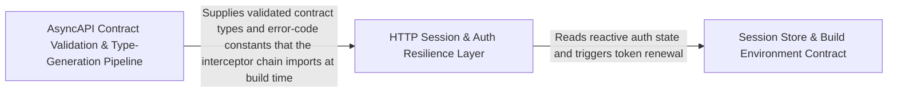

---
tags:
  - 2brain
  - 2brain/arch
  - project/boilerplate-vue-frontend
type: architecture
component: AsyncAPI_Contract_Validation_Type_Generation_Pipeline
---

## Details

This is the entry-point and spec-level correctness sub-component. It owns the full lifecycle of the AsyncAPI contract: parsing the spec, running structural validation (isInvalid), generating TypeScript model types (generate-asyncapi-types), and comparing spec identity across shared files (SpecComparison, normalise). It also hosts the demo backend runner (run-backend.boot), which boots a mock server to exercise the validated contract at runtime. The readAliases helper bridges into the reference-checking layer by extracting alias tables that downstream claim resolution consumes. This group is architecturally central because every other sub-component in the subsystem depends on the spec being validated and types being generated before documentation facts can be checked.

### HTTP Session & Auth Resilience Layer
The transport-level auth machinery that every Axios request traverses. It owns the API error envelope shape (ApiErrorItem), the single-flight deduplication primitive that prevents thundering-herd token refreshes, the step-up reauth prompt store (a reactive 'is a step-up pending?' flag consumed by the UI), and the two Axios response-reject interceptors (onResponseRejectWithRefresh, onResponseRejectWithStepUp) that transparently retry or escalate. requestFreshSession is the terminal escalation path when both refresh and step-up fail. This layer is the runtime contract between the generated HTTP client and the browser's auth state.

**Related Classes/Methods**:

- `src.infrastructure.http.single-flight.singleFlight`:15-23
- `src.infrastructure.http.refresh.onResponseRejectWithRefresh`:58-82
- `src.infrastructure.http.step-up.onResponseRejectWithStepUp`:47-69
- `src.infrastructure.http.reauth-prompt.useReauthPromptStore`:36-79

**Source Files:**

- `src/infrastructure/http/envelope.ts`
  - `src.infrastructure.http.envelope.ApiErrorItem` (L17-L22) - Interface
- `src/infrastructure/http/reauth-prompt.ts`
  - `src.infrastructure.http.reauth-prompt.PendingStepUp` (L17-L27) - Interface
  - `src.infrastructure.http.reauth-prompt.useReauthPromptStore` (L36-L79) - Class
  - `src.infrastructure.http.reauth-prompt.useReauthPromptStore.defineStore('reauthPrompt') callback` (L36-L79) - Function
  - `src.infrastructure.http.reauth-prompt.defineStore('reauthPrompt') callback.isOpen` (L45-L45) - Class
  - `src.infrastructure.http.reauth-prompt.useReauthPromptStore.defineStore('reauthPrompt') callback.isOpen.computed() callback` (L45-L45) - Function
  - `src.infrastructure.http.reauth-prompt.defineStore('reauthPrompt') callback.requestStepUp` (L53-L56) - Class
  - `src.infrastructure.http.reauth-prompt.useReauthPromptStore.defineStore('reauthPrompt') callback.requestStepUp.<function>` (L54-L56) - Function
- `src/infrastructure/http/refresh.ts`
  - `src.infrastructure.http.refresh.onResponseRejectWithRefresh` (L58-L82) - Class
  - `src.infrastructure.http.refresh.onResponseRejectWithRefresh.then() callback` (L72-L80) - Function
- `src/infrastructure/http/single-flight.ts`
  - `src.infrastructure.http.single-flight.singleFlight` (L15-L23) - Class
  - `src.infrastructure.http.single-flight.singleFlight.<function>` (L17-L22) - Function
  - `src.infrastructure.http.single-flight.singleFlight.<function>.finally() callback` (L18-L20) - Function
- `src/infrastructure/http/step-up.ts`
  - `src.infrastructure.http.step-up.requestFreshSession.singleFlight() callback` (L35-L36) - Function
  - `src.infrastructure.http.step-up.requestFreshSession` (L35-L37) - Class
  - `src.infrastructure.http.step-up.onResponseRejectWithStepUp` (L47-L69) - Class
  - `src.infrastructure.http.step-up.onResponseRejectWithStepUp.then() callback` (L60-L64) - Function
  - `src.infrastructure.http.step-up.onResponseRejectWithStepUp.catch() callback` (L66-L66) - Function
- `src/infrastructure/session.ts`
  - `src.infrastructure.session.SessionViewer` (L104-L146) - Interface
  - `src.infrastructure.session.useSessionStore` (L217-L685) - Class
  - `src.infrastructure.session.useSessionStore.defineStore('session') callback` (L217-L685) - Function
  - `src.infrastructure.session.useSessionStore.defineStore('session') callback.isAuth.computed() callback` (L234-L234) - Function
  - `src.infrastructure.session.useSessionStore.defineStore('session') callback.setViewer.then() callback` (L403-L405) - Function
  - `src.infrastructure.session.useSessionStore.defineStore('session') callback.setViewer.catch() callback` (L406-L406) - Function
  - `src.infrastructure.session.useSessionStore.defineStore('session') callback.refreshToken.then() callback` (L438-L442) - Function
  - `src.infrastructure.session.useSessionStore.defineStore('session') callback.refreshToken.catch() callback` (L443-L447) - Function
  - `src.infrastructure.session.useSessionStore.defineStore('session') callback.refreshToken.finally() callback` (L448-L450) - Function
  - `src.infrastructure.session.useSessionStore.defineStore('session') callback.loadViewer.then() callback` (L461-L485) - Function
  - `src.infrastructure.session.useSessionStore.defineStore('session') callback.loadViewer.then() callback.then() callback` (L484-L484) - Function
  - `src.infrastructure.session.useSessionStore.defineStore('session') callback.persistLocalePreference.then() callback` (L510-L510) - Function
  - `src.infrastructure.session.useSessionStore.defineStore('session') callback.persistLocalePreference.catch() callback` (L511-L511) - Function
  - `src.infrastructure.session.useSessionStore.defineStore('session') callback.onScopeDispose() callback` (L546-L546) - Function
  - `src.infrastructure.session.useSessionStore.defineStore('session') callback.reauth.then() callback` (L590-L592) - Function
  - `src.infrastructure.session.useSessionStore.defineStore('session') callback.reauth.finally() callback` (L593-L595) - Function
  - `src.infrastructure.session.useSessionStore.defineStore('session') callback.reauthMethods.then() callback` (L607-L607) - Function
  - `src.infrastructure.session.useSessionStore.defineStore('session') callback.sendReauthCode.then() callback` (L618-L618) - Function
  - `src.infrastructure.session.useSessionStore.defineStore('session') callback.requestEmailVerification.then() callback` (L630-L630) - Function
  - `src.infrastructure.session.useSessionStore.defineStore('session') callback.logout.then() callback` (L649-L649) - Function
  - `src.infrastructure.session.useSessionStore.defineStore('session') callback.logoutAll.then() callback` (L659-L659) - Function

### Session Store & Build Environment Contract
The declarative auth-state surface and the build-time environment type contract. The Pinia session store (defined via defineStore('session')) is the single source of truth for viewer identity, auth status, token lifecycle (refreshToken, reauth, sendReauthCode, requestEmailVerification), locale persistence, and logout semantics (logout, logoutAll). It is the consumer of the resilience layer above and the provider of auth context to every domain module store. vite-env.d.ts extends ImportMetaEnv and ViteTypeOptions so that build-time configuration (API base URL, feature flags, observability endpoints) is typed at the boundary between the Vite build and the application runtime. Together these two files define the 'what the app knows about the user and the environment' contract.

**Related Classes/Methods**:

- `src.vite-env.d.ImportMetaEnv`:24-46
- `src.vite-env.d.ViteTypeOptions`:14-16

**Source Files:**

- `src/infrastructure/session.ts`
  - `src.infrastructure.session.defineStore('session') callback.isAuth` (L234-L234) - Class
  - `src.infrastructure.session.defineStore('session') callback.setViewer` (L394-L407) - Class
  - `src.infrastructure.session.defineStore('session') callback.refreshToken` (L430-L453) - Class
  - `src.infrastructure.session.defineStore('session') callback.loadViewer` (L460-L485) - Class
  - `src.infrastructure.session.defineStore('session') callback.persistLocalePreference` (L505-L512) - Class
  - `src.infrastructure.session.defineStore('session') callback.reauth` (L587-L596) - Class
  - `src.infrastructure.session.defineStore('session') callback.reauthMethods` (L605-L608) - Class
  - `src.infrastructure.session.defineStore('session') callback.sendReauthCode` (L616-L619) - Class
  - `src.infrastructure.session.defineStore('session') callback.requestEmailVerification` (L628-L631) - Class
  - `src.infrastructure.session.defineStore('session') callback.logout` (L648-L649) - Class
  - `src.infrastructure.session.defineStore('session') callback.logoutAll` (L658-L659) - Class
- `src/vite-env.d.ts`
  - `src.vite-env.d.ViteTypeOptions` (L14-L16) - Interface
  - `src.vite-env.d.ImportMetaEnv` (L24-L46) - Interface

### AsyncAPI Contract Validation & Type-Generation Pipeline
The spec-level correctness and runtime-exercise pipeline. It owns the full AsyncAPI lifecycle: (a) structural validation — isInvalid runs the @asyncapi/parser default ruleset and gates CI on error-severity diagnostics; (b) TypeScript type generation — generate-asyncapi-types uses @asyncapi/modelina to emit payload interfaces, channel constants, SSE event maps, and inlined JSON-Schema validators into contracts/asyncapi.generated.ts, with a --check mode that fails on drift; (c) cross-repo spec identity — SpecComparison / normalise / SharedFile compare the shared contract files between this checkout and the paired backend to catch silent forks; (d) demo backend boot — boot spawns the paired backend's demo profile on a pinned port with a scratch directory, wiring the webhook sink and antibot env, so the validated contract is exercised end-to-end; (e) reference & fact checking — readAliases extracts the tsconfig path-alias table for downstream claim resolution, and document-facts / check-references verify that every npm run script, dependency, and @api import named in the docs actually exists. This group is architecturally central: every other sub-component depends on the spec being validated and types being generated before documentation facts can be checked.

**Related Classes/Methods**:

- `scripts.contracts.validate-asyncapi.isInvalid`:32-37
- `scripts.demo.run-backend.boot`:50-95
- `scripts.pairing.spec-identity.SpecComparison`:97-107
- `scripts.docs.check-references.readAliases`:191-200
- `scripts.docs.document-facts.exportedNames`:183-190

**Source Files:**

- `scripts/contracts/generate-asyncapi-types.ts`
  - `scripts.contracts.generate-asyncapi-types.renderLiteralArray.lines` (L236-L236) - Class
  - `scripts.contracts.generate-asyncapi-types.renderLiteralArray.lines.values.map() callback` (L236-L236) - Function
  - `scripts.contracts.generate-asyncapi-types.renderPayloadMap.rows` (L251-L255) - Class
  - `scripts.contracts.generate-asyncapi-types.renderPayloadMap.rows.entries.map() callback` (L253-L253) - Function
- `scripts/contracts/validate-asyncapi.ts`
  - `scripts.contracts.validate-asyncapi.isInvalid` (L32-L37) - Class
  - `scripts.contracts.validate-asyncapi.isInvalid.diagnostics.some() callback` (L34-L36) - Function
  - `scripts.contracts.validate-asyncapi.files.map() callback` (L44-L54) - Function
  - `scripts.contracts.validate-asyncapi.files.map() callback.then() callback` (L45-L54) - Function
  - `scripts.contracts.validate-asyncapi.then() callback` (L57-L61) - Function
  - `scripts.contracts.validate-asyncapi.catch() callback` (L62-L65) - Function
- `scripts/demo/demo-remove.ts`
  - `scripts.demo.demo-remove.stripModuleRegistry.after` (L53-L57) - Class
  - `scripts.demo.demo-remove.after.filter() callback` (L55-L55) - Function
  - `scripts.demo.demo-remove.stripModuleRegistry.after.filter() callback` (L56-L56) - Function
- `scripts/demo/run-backend.ts`
  - `scripts.demo.run-backend.boot` (L50-L95) - Class
  - `scripts.demo.run-backend.boot.process.on() callback` (L86-L88) - Function
  - `scripts.demo.run-backend.boot.child.on('close') callback` (L90-L94) - Function
  - `scripts.demo.run-backend.setInterval() callback` (L111-L111) - Function
- `scripts/docs/check-references.ts`
  - `scripts.docs.check-references.readAliases` (L191-L200) - Class
  - `scripts.docs.check-references.readAliases.map() callback` (L196-L199) - Function
  - `scripts.docs.check-references.run.pages` (L502-L508) - Class
  - `scripts.docs.check-references.run.pages.filter() callback` (L508-L508) - Function
- `scripts/docs/document-facts.ts`
  - `scripts.docs.document-facts.fencedContractImports.fences` (L136-L136) - Class
  - `scripts.docs.document-facts.fencedContractImports.fences.map() callback` (L136-L136) - Function
  - `scripts.docs.document-facts.fencedContractImports.fences.flatMap() callback` (L137-L152) - Function
  - `scripts.docs.document-facts.fencedContractImports.fences.flatMap() callback.flatMap() callback` (L140-L151) - Function
  - `scripts.docs.document-facts.fencedContractImports.fences.flatMap() callback.flatMap() callback.map() callback` (L151-L151) - Function
  - `scripts.docs.document-facts.exportedNames` (L183-L190) - Class
  - `scripts.docs.document-facts.exportedNames.map() callback` (L189-L189) - Function
- `scripts/mutation/baseline.ts`
  - `scripts.mutation.baseline.scoresFromReport.scored` (L94-L94) - Class
  - `scripts.mutation.baseline.scoresFromReport.scored.mutants.filter() callback` (L94-L94) - Function
  - `scripts.mutation.baseline.formatUnrecorded.lines` (L215-L215) - Class
  - `scripts.mutation.baseline.formatUnrecorded.lines.unrecorded.map() callback` (L215-L215) - Function
- `scripts/pairing/spec-identity.ts`
  - `scripts.pairing.spec-identity.SharedFile` (L29-L34) - Interface
  - `scripts.pairing.spec-identity.SpecComparison` (L97-L107) - Interface
  - `scripts.pairing.spec-identity.normalise` (L128-L140) - Class
  - `scripts.pairing.spec-identity.normalise.value.map() callback` (L129-L129) - Function
