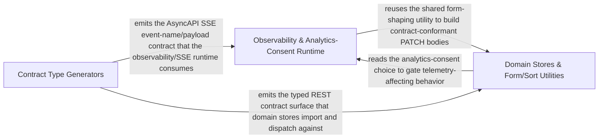

---
tags:
  - 2brain
  - 2brain/arch
  - project/boilerplate-vue-frontend
type: architecture
component: Contract_Type_Generation
---

## Details

Generators that derive the typed contract surface — AsyncAPI message/channel types, error codes, operation modules, and permission actions — with the observability config/store as a secondary concern.

### Observability & Analytics-Consent Runtime [[Expand]](./Observability_Analytics_Consent_Runtime.md)
The secondary runtime concern that consumes the generated contract surface for telemetry and consent. It owns the Faro/Umami configuration readers (FaroConfig, UmamiConfig, readFaroConfig, readUmamiConfig, readUmamiRequireConsent, origin→regex helpers), the observability Pinia store (ApiRejectEnvelope, UmamiTracker), and the analytics-consent store (useAnalyticsConsentStore with its promptOpen callback). It also carries the account auth/profile stores and the orders/products/users stores plus the use-order-actions-refetch / reorder / use-any-filter-choice composables that wire domain actions to the generated API types.

**Related Classes/Methods**:

- `src.infrastructure.observability.config.readFaroConfig`:120-155
- `src.infrastructure.observability.config.readUmamiConfig`:66-83
- `src.infrastructure.analytics-consent.useAnalyticsConsentStore`:70-124

**Source Files:**

- `src/infrastructure/analytics-consent.ts`
  - `src.infrastructure.analytics-consent.useAnalyticsConsentStore` (L70-L124) - Class
  - `src.infrastructure.analytics-consent.useAnalyticsConsentStore.defineStore('analyticsConsent') callback` (L70-L124) - Function
  - `src.infrastructure.analytics-consent.defineStore('analyticsConsent') callback.promptOpen` (L86-L86) - Class
  - `src.infrastructure.analytics-consent.useAnalyticsConsentStore.defineStore('analyticsConsent') callback.promptOpen.computed() callback` (L86-L86) - Function
- `src/infrastructure/observability/config.ts`
  - `src.infrastructure.observability.config.FaroConfig` (L14-L33) - Interface
  - `src.infrastructure.observability.config.UmamiConfig` (L38-L47) - Interface
  - `src.infrastructure.observability.config.originToRegExp` (L55-L58) - Function
  - `src.infrastructure.observability.config.readUmamiConfig` (L66-L83) - Function
  - `src.infrastructure.observability.config.readUmamiRequireConsent` (L92-L96) - Function
  - `src.infrastructure.observability.config.umamiOriginPattern` (L108-L112) - Function
  - `src.infrastructure.observability.config.readFaroConfig` (L120-L155) - Function
- `src/infrastructure/observability/store.ts`
  - `src.infrastructure.observability.store.ApiRejectEnvelope` (L84-L92) - Interface
  - `src.infrastructure.observability.store.describeApiRejectError` (L115-L118) - Class
  - `src.infrastructure.observability.store.describeApiRejectError.filter() callback` (L117-L117) - Function
  - `src.infrastructure.observability.store.UmamiTracker` (L129-L131) - Interface
  - `src.infrastructure.observability.store.useObservabilityStore` (L166-L427) - Class
  - `src.infrastructure.observability.store.useObservabilityStore.defineStore('observability') callback` (L166-L427) - Function
  - `src.infrastructure.observability.store.defineStore('observability') callback.initFaro` (L206-L270) - Class
  - `src.infrastructure.observability.store.useObservabilityStore.defineStore('observability') callback.initFaro.then() callback` (L218-L254) - Function
  - `src.infrastructure.observability.store.useObservabilityStore.defineStore('observability') callback.initFaro.catch() callback` (L255-L267) - Function
  - `src.infrastructure.observability.store.normalizeContext` (L435-L437) - Function
  - `src.infrastructure.observability.store.normalizeContext.mapValues() callback` (L436-L436) - Function
- `src/modules/account/stores/auth.ts`
  - `src.modules.account.stores.auth.useAuthStore` (L54-L274) - Class
  - `src.modules.account.stores.auth.useAuthStore.defineStore('accountAuth') callback` (L54-L274) - Function
  - `src.modules.account.stores.auth.defineStore('accountAuth') callback.login` (L89-L124) - Class
  - `src.modules.account.stores.auth.useAuthStore.defineStore('accountAuth') callback.login.fetchAny() callback` (L95-L120) - Function
  - `src.modules.account.stores.auth.useAuthStore.defineStore('accountAuth') callback.login.fetchAny() callback.then() callback` (L103-L120) - Function
  - `src.modules.account.stores.auth.useAuthStore.defineStore('accountAuth') callback.login.fetchAny() callback.then() callback.then() callback` (L119-L119) - Function
  - `src.modules.account.stores.auth.useAuthStore.defineStore('accountAuth') callback.login.then() callback` (L121-L124) - Function
  - `src.modules.account.stores.auth.defineStore('accountAuth') callback.signup` (L151-L189) - Class
  - `src.modules.account.stores.auth.useAuthStore.defineStore('accountAuth') callback.signup.fetchAny() callback` (L169-L188) - Function
  - `src.modules.account.stores.auth.useAuthStore.defineStore('accountAuth') callback.signup.fetchAny() callback.then() callback` (L181-L184) - Function
  - `src.modules.account.stores.auth.useAuthStore.defineStore('accountAuth') callback.signup.fetchAny() callback.catch() callback` (L185-L188) - Function
  - `src.modules.account.stores.auth.defineStore('accountAuth') callback.setAvatarAfterSignup` (L203-L209) - Class
  - `src.modules.account.stores.auth.defineStore('accountAuth') callback.setAvatarAfterSignup.then() callback` (L207-L207) - Function
  - `src.modules.account.stores.auth.useAuthStore.defineStore('accountAuth') callback.setAvatarAfterSignup.then() callback` (L208-L208) - Function
  - `src.modules.account.stores.auth.defineStore('accountAuth') callback.requestPasswordReset` (L220-L221) - Class
  - `src.modules.account.stores.auth.useAuthStore.defineStore('accountAuth') callback.requestPasswordReset.fetchAny() callback` (L221-L221) - Function
  - `src.modules.account.stores.auth.defineStore('accountAuth') callback.confirmPasswordReset` (L231-L232) - Class
  - `src.modules.account.stores.auth.useAuthStore.defineStore('accountAuth') callback.confirmPasswordReset.fetchAny() callback` (L232-L232) - Function
  - `src.modules.account.stores.auth.defineStore('accountAuth') callback.logout` (L242-L250) - Class
  - `src.modules.account.stores.auth.useAuthStore.defineStore('accountAuth') callback.logout.then() callback` (L245-L249) - Function
  - `src.modules.account.stores.auth.defineStore('accountAuth') callback.logoutEverywhere` (L257-L263) - Class
  - `src.modules.account.stores.auth.useAuthStore.defineStore('accountAuth') callback.logoutEverywhere.then() callback` (L259-L262) - Function
- `src/modules/account/stores/profile.ts`
  - `src.modules.account.stores.profile.useProfileStore` (L65-L499) - Class
  - `src.modules.account.stores.profile.useProfileStore.defineStore('accountProfile') callback` (L65-L499) - Function
  - `src.modules.account.stores.profile.defineStore('accountProfile') callback.fetchProfile` (L132-L162) - Class
  - `src.modules.account.stores.profile.useProfileStore.defineStore('accountProfile') callback.fetchProfile.fetchTarget() callback` (L134-L151) - Function
  - `src.modules.account.stores.profile.useProfileStore.defineStore('accountProfile') callback.fetchProfile.fetchTarget() callback.then() callback` (L135-L151) - Function
  - `src.modules.account.stores.profile.useProfileStore.defineStore('accountProfile') callback.fetchProfile.fetchTarget() callback.then() callback.then() callback` (L150-L150) - Function
  - `src.modules.account.stores.profile.useProfileStore.defineStore('accountProfile') callback.fetchProfile.then() callback` (L154-L161) - Function
  - `src.modules.account.stores.profile.useProfileStore.defineStore('accountProfile') callback.fetchProfile.then() callback.then() callback` (L160-L160) - Function
  - `src.modules.account.stores.profile.defineStore('accountProfile') callback.updateProfile` (L228-L283) - Class
  - `src.modules.account.stores.profile.useProfileStore.defineStore('accountProfile') callback.updateProfile.updateTarget() callback` (L250-L265) - Function
  - `src.modules.account.stores.profile.defineStore('accountProfile') callback.updateProfile.updateTarget() callback.uploadThenClear() callback` (L255-L256) - Function
  - `src.modules.account.stores.profile.useProfileStore.defineStore('accountProfile') callback.updateProfile.updateTarget() callback.uploadThenClear() callback` (L257-L257) - Function
  - `src.modules.account.stores.profile.useProfileStore.defineStore('accountProfile') callback.updateProfile.updateTarget() callback.then() callback` (L260-L265) - Function
  - `src.modules.account.stores.profile.useProfileStore.defineStore('accountProfile') callback.updateProfile.updateTarget() callback.then() callback.then() callback` (L264-L264) - Function
  - `src.modules.account.stores.profile.useProfileStore.defineStore('accountProfile') callback.updateProfile.then() callback` (L275-L281) - Function
  - `src.modules.account.stores.profile.useProfileStore.defineStore('accountProfile') callback.updateProfile.then() callback.then() callback` (L281-L281) - Function
  - `src.modules.account.stores.profile.defineStore('accountProfile') callback.cancelPendingEmailChange` (L316-L319) - Class
  - `src.modules.account.stores.profile.useProfileStore.defineStore('accountProfile') callback.cancelPendingEmailChange.fetchAny() callback` (L317-L318) - Function
  - `src.modules.account.stores.profile.useProfileStore.defineStore('accountProfile') callback.cancelPendingEmailChange.fetchAny() callback.then() callback.then() callback` (L318-L318) - Function
  - `src.modules.account.stores.profile.defineStore('accountProfile') callback.updateOwnRole` (L348-L354) - Class
  - `src.modules.account.stores.profile.useProfileStore.defineStore('accountProfile') callback.updateOwnRole.fetchAny() callback` (L353-L353) - Function
  - `src.modules.account.stores.profile.useProfileStore.defineStore('accountProfile') callback.updateOwnRole.fetchAny() callback.then() callback` (L353-L353) - Function
  - `src.modules.account.stores.profile.defineStore('accountProfile') callback.changePassword` (L371-L376) - Class
  - `src.modules.account.stores.profile.useProfileStore.defineStore('accountProfile') callback.changePassword.fetchAny() callback` (L372-L375) - Function
  - `src.modules.account.stores.profile.useProfileStore.defineStore('accountProfile') callback.changePassword.fetchAny() callback.then() callback` (L373-L375) - Function
  - `src.modules.account.stores.profile.defineStore('accountProfile') callback.confirmEmailVerification` (L386-L391) - Class
  - `src.modules.account.stores.profile.useProfileStore.defineStore('accountProfile') callback.confirmEmailVerification.fetchAny() callback` (L387-L390) - Function
  - `src.modules.account.stores.profile.useProfileStore.defineStore('accountProfile') callback.confirmEmailVerification.fetchAny() callback.then() callback` (L388-L389) - Function
  - `src.modules.account.stores.profile.useProfileStore.defineStore('accountProfile') callback.confirmEmailVerification.fetchAny() callback.then() callback.then() callback` (L389-L389) - Function
  - `src.modules.account.stores.profile.defineStore('accountProfile') callback.confirmEmailChange` (L402-L407) - Class
  - `src.modules.account.stores.profile.useProfileStore.defineStore('accountProfile') callback.confirmEmailChange.fetchAny() callback` (L403-L406) - Function
  - `src.modules.account.stores.profile.useProfileStore.defineStore('accountProfile') callback.confirmEmailChange.fetchAny() callback.then() callback` (L404-L405) - Function
  - `src.modules.account.stores.profile.useProfileStore.defineStore('accountProfile') callback.confirmEmailChange.fetchAny() callback.then() callback.then() callback` (L405-L405) - Function
  - `src.modules.account.stores.profile.defineStore('accountProfile') callback.watch() callback` (L412-L412) - Function
  - `src.modules.account.stores.profile.useProfileStore.defineStore('accountProfile') callback.watch() callback` (L413-L415) - Function
  - `src.modules.account.stores.profile.defineStore('accountProfile') callback.requestAccountDelete` (L433-L433) - Class
  - `src.modules.account.stores.profile.useProfileStore.defineStore('accountProfile') callback.requestAccountDelete.fetchAny() callback` (L433-L433) - Function
  - `src.modules.account.stores.profile.defineStore('accountProfile') callback.exportAccountData` (L446-L451) - Class
  - `src.modules.account.stores.profile.useProfileStore.defineStore('accountProfile') callback.exportAccountData.fetchAny() callback` (L447-L450) - Function
  - `src.modules.account.stores.profile.useProfileStore.defineStore('accountProfile') callback.exportAccountData.fetchAny() callback.then() callback` (L448-L449) - Function
  - `src.modules.account.stores.profile.defineStore('accountProfile') callback.confirmAccountDelete` (L460-L470) - Class
  - `src.modules.account.stores.profile.useProfileStore.defineStore('accountProfile') callback.confirmAccountDelete.fetchAny() callback` (L461-L469) - Function
  - `src.modules.account.stores.profile.useProfileStore.defineStore('accountProfile') callback.confirmAccountDelete.fetchAny() callback.then() callback` (L462-L469) - Function
  - `src.modules.account.stores.profile.defineStore('accountProfile') callback.uploadingAvatar` (L475-L475) - Class
  - `src.modules.account.stores.profile.useProfileStore.defineStore('accountProfile') callback.uploadingAvatar.computed() callback` (L475-L475) - Function
  - `src.modules.account.stores.profile.defineStore('accountProfile') callback.removingAvatar` (L480-L480) - Class
  - `src.modules.account.stores.profile.useProfileStore.defineStore('accountProfile') callback.removingAvatar.computed() callback` (L480-L480) - Function
- `src/modules/orders/composables/use-order-actions-refetch.ts`
  - `src.modules.orders.composables.use-order-actions-refetch.useOrderActionsRefetch` (L23-L48) - Class
  - `src.modules.orders.composables.use-order-actions-refetch.useOrderActionsRefetch.watch() callback` (L35-L45) - Function
- `src/modules/orders/domain/reorder.ts`
  - `src.modules.orders.domain.reorder.ReorderedOrderLine` (L12-L15) - Interface
  - `src.modules.orders.domain.reorder.leftOutByReorder` (L26-L32) - Class
  - `src.modules.orders.domain.reorder.leftOutByReorder.orderLines.filter() callback` (L31-L31) - Function
  - `src.modules.orders.domain.reorder.leftOutByReorder.map() callback` (L32-L32) - Function
- `src/ui/composables/use-any-filter-choice.ts`
  - `src.ui.composables.use-any-filter-choice.useAnyFilterChoice` (L23-L30) - Class
  - `src.ui.composables.use-any-filter-choice.useAnyFilterChoice.get` (L28-L28) - Method
  - `src.ui.composables.use-any-filter-choice.useAnyFilterChoice.set` (L29-L29) - Method
- `src/ui/composables/use-deleted-filter-options.ts`
  - `src.ui.composables.use-deleted-filter-options.DeletedFilterOption` (L14-L19) - Interface
  - `src.ui.composables.use-deleted-filter-options.useDeletedFilterOptions` (L26-L33) - Class
  - `src.ui.composables.use-deleted-filter-options.useDeletedFilterOptions.computed() callback` (L28-L32) - Function
- `src/ui/composables/use-list-url-state.ts`
  - `src.ui.composables.use-list-url-state.ListUrlStateOptions` (L25-L34) - Interface
  - `src.ui.composables.use-list-url-state.ListUrlState` (L39-L45) - Interface
  - `src.ui.composables.use-list-url-state.useListUrlState.hydrate.present` (L112-L114) - Class
  - `src.ui.composables.use-list-url-state.useListUrlState.hydrate.present.some() callback` (L113-L113) - Function
  - `src.ui.composables.use-list-url-state.useListUrlState.sync.foreign` (L147-L151) - Class
  - `src.ui.composables.use-list-url-state.useListUrlState.sync.foreign.filter() callback` (L149-L149) - Function
- `src/ui/composables/use-return-focus.ts`
  - `src.ui.composables.use-return-focus.useReturnFocus` (L17-L40) - Class
  - `src.ui.composables.use-return-focus.useReturnFocus.watch() callback` (L26-L39) - Function
  - `src.ui.composables.use-return-focus.useReturnFocus.watch() callback.nextTick() callback` (L38-L38) - Function
- `src/ui/composables/use-server-sort.ts`
  - `src.ui.composables.use-server-sort.ServerSortOptions` (L15-L20) - Interface
  - `src.ui.composables.use-server-sort.ServerSort` (L25-L30) - Interface
  - `src.ui.composables.use-server-sort.useServerSort.choice.get` (L59-L59) - Method
  - `src.ui.composables.use-server-sort.useServerSort.choice.set` (L60-L60) - Method
- `src/ui/composables/use-touch-friendly-size.ts`
  - `src.ui.composables.use-touch-friendly-size.useTouchFriendlySize` (L17-L20) - Class
  - `src.ui.composables.use-touch-friendly-size.useTouchFriendlySize.computed() callback` (L19-L19) - Function

### Domain Stores & Form/Sort Utilities [[Expand]](./Domain_Stores_Form_Sort_Utilities.md)
The domain-state and request-shaping layer that turns user input into contract-conformant request bodies and reads generated response types. It owns the form utilities (filter, omitNulls, shapeObject, toRequestBody, uploadThenClear) and the sort helpers (SingleSort, sortFieldsOf), the orders/products/users Pinia stores (listCreditNotes, idBatches, useUsersStore), and the products translation composables (translation-tab-errors, translations-body, use-active-locales, use-product-lines, use-translated-entity-form) that drive the localized entity editing surface.

**Related Classes/Methods**:

- `src.infrastructure.utils.forms.toRequestBody`:169-179
- `src.infrastructure.utils.forms.shapeObject`:108-121
- `src.infrastructure.utils.sort.sortFieldsOf`:100-102
- `src.modules.products.store.useProductsStore`:101-404
- `src.modules.users.store.useUsersStore`:65-261

**Source Files:**

- `src/infrastructure/utils/forms.ts`
  - `src.infrastructure.utils.forms.shapeObject` (L108-L121) - Class
  - `src.infrastructure.utils.forms.filter() callback` (L115-L115) - Function
  - `src.infrastructure.utils.forms.shapeObject.map() callback` (L117-L118) - Function
  - `src.infrastructure.utils.forms.shapeObject.filter() callback` (L120-L120) - Function
  - `src.infrastructure.utils.forms.toRequestBody` (L169-L179) - Class
  - `src.infrastructure.utils.forms.toRequestBody.then() callback` (L175-L178) - Function
  - `src.infrastructure.utils.forms.uploadThenClear` (L204-L221) - Class
  - `src.infrastructure.utils.forms.uploadThenClear.clears` (L212-L214) - Class
  - `src.infrastructure.utils.forms.uploadThenClear.clears.entries.filter() callback` (L213-L213) - Function
  - `src.infrastructure.utils.forms.uploadThenClear.rest` (L215-L217) - Class
  - `src.infrastructure.utils.forms.uploadThenClear.rest.entries.filter() callback` (L216-L216) - Function
  - `src.infrastructure.utils.forms.uploadThenClear.then() callback` (L218-L219) - Function
  - `src.infrastructure.utils.forms.omitNulls` (L232-L238) - Class
  - `src.infrastructure.utils.forms.omitNulls.keys.filter() callback` (L237-L237) - Function
  - `src.infrastructure.utils.forms.omitNulls.map() callback` (L237-L237) - Function
- `src/infrastructure/utils/sort.ts`
  - `src.infrastructure.utils.sort.SingleSort` (L17-L22) - Interface
  - `src.infrastructure.utils.sort.sortTokensOf.tokens` (L86-L89) - Class
  - `src.infrastructure.utils.sort.sortTokensOf.tokens.map() callback` (L88-L88) - Function
  - `src.infrastructure.utils.sort.sortTokensOf.tokens.filter() callback` (L89-L89) - Function
  - `src.infrastructure.utils.sort.sortTokensOf.valid` (L90-L90) - Class
  - `src.infrastructure.utils.sort.sortTokensOf.valid.tokens.filter() callback` (L90-L90) - Function
  - `src.infrastructure.utils.sort.sortFieldsOf` (L100-L102) - Class
  - `src.infrastructure.utils.sort.sortFieldsOf.map() callback` (L101-L101) - Function
- `src/modules/orders/store.ts`
  - `src.modules.orders.store.listCreditNotes` (L61-L62) - Class
  - `src.modules.orders.store.listCreditNotes.then() callback` (L62-L62) - Function
  - `src.modules.orders.store.useOrdersStore` (L74-L294) - Class
  - `src.modules.orders.store.useOrdersStore.defineStore('orders') callback` (L74-L294) - Function
  - `src.modules.orders.store.defineStore('orders') callback.hardDeleteOrder` (L183-L184) - Class
  - `src.modules.orders.store.useOrdersStore.defineStore('orders') callback.hardDeleteOrder.deleteTarget() callback` (L184-L184) - Function
  - `src.modules.orders.store.defineStore('orders') callback.restoreOrder` (L193-L198) - Class
  - `src.modules.orders.store.useOrdersStore.defineStore('orders') callback.restoreOrder.updateTarget() callback` (L195-L195) - Function
  - `src.modules.orders.store.useOrdersStore.defineStore('orders') callback.restoreOrder.updateTarget() callback.then() callback` (L195-L195) - Function
  - `src.modules.orders.store.defineStore('orders') callback.cancelOrder` (L215-L223) - Class
  - `src.modules.orders.store.useOrdersStore.defineStore('orders') callback.cancelOrder.updateTarget() callback` (L217-L220) - Function
  - `src.modules.orders.store.useOrdersStore.defineStore('orders') callback.cancelOrder.updateTarget() callback.then() callback` (L219-L219) - Function
  - `src.modules.orders.store.defineStore('orders') callback.overrideStatus` (L237-L242) - Class
  - `src.modules.orders.store.useOrdersStore.defineStore('orders') callback.overrideStatus.updateTarget() callback` (L239-L239) - Function
  - `src.modules.orders.store.useOrdersStore.defineStore('orders') callback.overrideStatus.updateTarget() callback.then() callback` (L239-L239) - Function
  - `src.modules.orders.store.defineStore('orders') callback.fetchInvoice` (L251-L251) - Class
  - `src.modules.orders.store.useOrdersStore.defineStore('orders') callback.fetchInvoice.fetchAny() callback` (L251-L251) - Function
  - `src.modules.orders.store.defineStore('orders') callback.fetchCreditNote` (L261-L262) - Class
  - `src.modules.orders.store.useOrdersStore.defineStore('orders') callback.fetchCreditNote.fetchAny() callback` (L262-L262) - Function
- `src/modules/products/composables/translation-tab-errors.ts`
  - `src.modules.products.composables.translation-tab-errors.TranslationIssue` (L16-L19) - Interface
  - `src.modules.products.composables.translation-tab-errors.translationTabErrorCountsFromServerError.container` (L92-L99) - Class
  - `src.modules.products.composables.translation-tab-errors.translationTabErrorCountsFromServerError.container.find() callback` (L97-L98) - Function
  - `src.modules.products.composables.translation-tab-errors.translationTabErrorCountsFromServerError.issues` (L103-L113) - Class
  - `src.modules.products.composables.translation-tab-errors.translationTabErrorCountsFromServerError.issues.items.flatMap() callback` (L103-L113) - Function
- `src/modules/products/composables/translations-body.ts`
  - `src.modules.products.composables.translations-body.toCreateTranslations` (L25-L44) - Class
  - `src.modules.products.composables.translations-body.toCreateTranslations.flatMap() callback` (L29-L42) - Function
  - `src.modules.products.composables.translations-body.toPatchTranslations` (L53-L66) - Class
  - `src.modules.products.composables.translations-body.toPatchTranslations.map() callback` (L57-L65) - Function
- `src/modules/products/composables/use-active-locales.ts`
  - `src.modules.products.composables.use-active-locales.useActiveLocales.fetchActiveLocales.then() callback` (L76-L79) - Function
  - `src.modules.products.composables.use-active-locales.useActiveLocales.fetchActiveLocales.catch() callback` (L80-L84) - Function
  - `src.modules.products.composables.use-active-locales.useActiveLocales.fetchActiveLocales.finally() callback` (L85-L87) - Function
- `src/modules/products/composables/use-product-lines.ts`
  - `src.modules.products.composables.use-product-lines.ProductLines` (L15-L40) - Interface
  - `src.modules.products.composables.use-product-lines.useProductLines` (L47-L61) - Class
  - `src.modules.products.composables.use-product-lines.useProductLines.loadProducts` (L55-L56) - Method
  - `src.modules.products.composables.use-product-lines.useProductLines.titleOf` (L58-L59) - Method
- `src/modules/products/composables/use-translated-entity-form.ts`
  - `src.modules.products.composables.use-translated-entity-form.TranslatedForm` (L27-L32) - Interface
  - `src.modules.products.composables.use-translated-entity-form.TranslatedEntityFormOptions` (L37-L73) - Interface
  - `src.modules.products.composables.use-translated-entity-form.useTranslatedEntityForm` (L87-L225) - Class
  - `src.modules.products.composables.use-translated-entity-form.useTranslatedEntityForm.validation` (L104-L109) - Class
  - `src.modules.products.composables.use-translated-entity-form.useTranslatedEntityForm.validation.onInvalid` (L108-L108) - Method
  - `src.modules.products.composables.use-translated-entity-form.openTags` (L117-L117) - Class
  - `src.modules.products.composables.use-translated-entity-form.useTranslatedEntityForm.openTags.useTranslationTabOrder() callback` (L117-L117) - Function
  - `src.modules.products.composables.use-translated-entity-form.watch() callback` (L127-L129) - Function
  - `src.modules.products.composables.use-translated-entity-form.useTranslatedEntityForm.watch() callback` (L189-L198) - Function
  - `src.modules.products.composables.use-translated-entity-form.handleSubmitFailure` (L208-L214) - Class
  - `src.modules.products.composables.use-translated-entity-form.useTranslatedEntityForm.handleSubmitFailure.onUnmapped` (L213-L213) - Method
- `src/modules/products/store.ts`
  - `src.modules.products.store.idBatches` (L90-L93) - Class
  - `src.modules.products.store.idBatches.Array.from() callback` (L91-L92) - Function
  - `src.modules.products.store.useProductsStore` (L101-L404) - Class
  - `src.modules.products.store.useProductsStore.defineStore('products') callback` (L101-L404) - Function
  - `src.modules.products.store.defineStore('products') callback.hardDeleteProduct` (L293-L294) - Class
  - `src.modules.products.store.useProductsStore.defineStore('products') callback.hardDeleteProduct.deleteTarget() callback` (L294-L294) - Function
  - `src.modules.products.store.defineStore('products') callback.restoreProduct` (L303-L309) - Class
  - `src.modules.products.store.useProductsStore.defineStore('products') callback.restoreProduct.fetchAny() callback` (L304-L308) - Function
  - `src.modules.products.store.useProductsStore.defineStore('products') callback.restoreProduct.fetchAny() callback.then() callback` (L305-L308) - Function
  - `src.modules.products.store.defineStore('products') callback.fetchProductAdmin` (L322-L323) - Class
  - `src.modules.products.store.useProductsStore.defineStore('products') callback.fetchProductAdmin.fetchAny() callback` (L323-L323) - Function
  - `src.modules.products.store.useProductsStore.defineStore('products') callback.fetchProductAdmin.fetchAny() callback.then() callback` (L323-L323) - Function
  - `src.modules.products.store.defineStore('products') callback.fetchProductsByIds` (L338-L350) - Class
  - `src.modules.products.store.useProductsStore.defineStore('products') callback.fetchProductsByIds.fetchMultiple() callback` (L340-L347) - Function
  - `src.modules.products.store.useProductsStore.defineStore('products') callback.fetchProductsByIds.fetchMultiple() callback.map() callback` (L342-L345) - Function
  - `src.modules.products.store.useProductsStore.defineStore('products') callback.fetchProductsByIds.fetchMultiple() callback.map() callback.then() callback` (L344-L344) - Function
  - `src.modules.products.store.useProductsStore.defineStore('products') callback.fetchProductsByIds.fetchMultiple() callback.then() callback` (L347-L347) - Function
  - `src.modules.products.store.defineStore('products') callback.fetchFacets` (L367-L373) - Class
  - `src.modules.products.store.useProductsStore.defineStore('products') callback.fetchFacets.fetchAny() callback` (L368-L372) - Function
  - `src.modules.products.store.useProductsStore.defineStore('products') callback.fetchFacets.fetchAny() callback.then() callback` (L369-L372) - Function
- `src/modules/users/composables/use-user-access-dialog.ts`
  - `src.modules.users.composables.use-user-access-dialog.UserAccessDialogTarget` (L16-L21) - Interface
  - `src.modules.users.composables.use-user-access-dialog.UserAccessDialogRequestOptions` (L28-L32) - Interface
  - `src.modules.users.composables.use-user-access-dialog.UserAccessDialogResult` (L38-L41) - Interface
  - `src.modules.users.composables.use-user-access-dialog.useUserAccessDialog` (L49-L109) - Class
  - `src.modules.users.composables.use-user-access-dialog.useUserAccessDialog.confirm` (L106-L106) - Method
  - `src.modules.users.composables.use-user-access-dialog.useUserAccessDialog.cancel` (L107-L107) - Method
- `src/modules/users/domain/roles.ts`
  - `src.modules.users.domain.roles.userRoleOptions` (L29-L29) - Class
  - `src.modules.users.domain.roles.userRoleOptions.USER_ROLES.map() callback` (L29-L29) - Function
- `src/modules/users/store.ts`
  - `src.modules.users.store.useUsersStore` (L65-L261) - Class
  - `src.modules.users.store.useUsersStore.defineStore('users') callback` (L65-L261) - Function
  - `src.modules.users.store.defineStore('users') callback.hardDeleteUser` (L192-L193) - Class
  - `src.modules.users.store.useUsersStore.defineStore('users') callback.hardDeleteUser.deleteTarget() callback` (L193-L193) - Function
  - `src.modules.users.store.defineStore('users') callback.restoreUser` (L202-L208) - Class
  - `src.modules.users.store.useUsersStore.defineStore('users') callback.restoreUser.fetchAny() callback` (L203-L207) - Function
  - `src.modules.users.store.useUsersStore.defineStore('users') callback.restoreUser.fetchAny() callback.then() callback` (L204-L207) - Function
  - `src.modules.users.store.defineStore('users') callback.adminDisableTwoFactor` (L230-L233) - Class
  - `src.modules.users.store.useUsersStore.defineStore('users') callback.adminDisableTwoFactor.fetchAny() callback` (L231-L232) - Function
  - `src.modules.users.store.useUsersStore.defineStore('users') callback.adminDisableTwoFactor.fetchAny() callback.then() callback` (L232-L232) - Function
- `src/ui/composables/use-list-search.ts`
  - `src.ui.composables.use-list-search.ListSearchOptions` (L11-L25) - Interface
  - `src.ui.composables.use-list-search.ListSearchHandlers` (L30-L35) - Interface
  - `src.ui.composables.use-list-search.useListSearch` (L43-L58) - Class
  - `src.ui.composables.use-list-search.useListSearch.handleSearch` (L46-L50) - Method
  - `src.ui.composables.use-list-search.useListSearch.handleReset` (L51-L57) - Method
- `src/ui/composables/use-server-sort.ts`
  - `src.ui.composables.use-server-sort.useServerSort.sortBy.get` (L55-L55) - Method
  - `src.ui.composables.use-server-sort.useServerSort.sortBy.set` (L56-L56) - Method
- `src/ui/composables/use-translation-tab-order.ts`
  - `src.ui.composables.use-translation-tab-order.useTranslationTabOrder` (L23-L34) - Class
  - `src.ui.composables.use-translation-tab-order.useTranslationTabOrder.computed() callback` (L27-L34) - Function
  - `src.ui.composables.use-translation-tab-order.computed() callback.tags.filter() callback` (L30-L30) - Function
  - `src.ui.composables.use-translation-tab-order.useTranslationTabOrder.computed() callback.tags` (L30-L30) - Class
  - `src.ui.composables.use-translation-tab-order.useTranslationTabOrder.computed() callback.tags.filter() callback` (L32-L32) - Function

### Contract Type Generators
The heart of the subsystem — a set of pure, byte-identical generator scripts that parse the shared contract documents and render the typed contract surface. generate-asyncapi-types.ts uses a JSON-Schema TypeScriptGenerator to emit model interfaces, message-type aliases, channel-namespace constants, SSE event-name/payload maps, and inlined payload schemas. generate-error-codes.ts renders the ERROR_CODES const object and ErrorCode union from x-error-codes. generate-operation-modules.ts builds the OPERATION_MODULES function-name→module map from x-module stamps. permission-actions-render.ts provides the pure read/render half of the permission-action generator. All share the --out/--check CLI contract.

**Related Classes/Methods**:

- `scripts.contracts.generate-asyncapi-types.collectChannelMessageEntries`:159-176
- `scripts.contracts.generate-asyncapi-types.messageTypeBlocks`:362-370
- `scripts.contracts.generate-asyncapi-types.inlineReferences`:186-198
- `scripts.contracts.permission-actions-render.readPermissionActions`:17-27

**Source Files:**

- `scripts/contracts/generate-asyncapi-types.ts`
  - `scripts.contracts.generate-asyncapi-types.AsyncApiChannel` (L36-L46) - Interface
  - `scripts.contracts.generate-asyncapi-types.AsyncApiMessage` (L48-L50) - Interface
  - `scripts.contracts.generate-asyncapi-types.JsonSchema` (L52-L63) - Interface
  - `scripts.contracts.generate-asyncapi-types.AsyncApiDocument` (L65-L71) - Interface
  - `scripts.contracts.generate-asyncapi-types.toPascalCase` (L102-L109) - Class
  - `scripts.contracts.generate-asyncapi-types.toPascalCase.map() callback` (L108-L108) - Function
  - `scripts.contracts.generate-asyncapi-types.collectChannelMessageEntries` (L159-L176) - Class
  - `scripts.contracts.generate-asyncapi-types.collectChannelMessageEntries.filter() callback` (L165-L165) - Function
  - `scripts.contracts.generate-asyncapi-types.collectChannelMessageEntries.map() callback` (L166-L175) - Function
  - `scripts.contracts.generate-asyncapi-types.collectChannelMessageEntries.toSorted() callback` (L176-L176) - Function
  - `scripts.contracts.generate-asyncapi-types.inlineReferences` (L186-L198) - Class
  - `scripts.contracts.generate-asyncapi-types.inlineReferences.schema.map() callback` (L187-L187) - Function
  - `scripts.contracts.generate-asyncapi-types.inlineReferences.map() callback` (L196-L196) - Function
  - `scripts.contracts.generate-asyncapi-types.renderPayloadSchemas.rows` (L215-L222) - Class
  - `scripts.contracts.generate-asyncapi-types.renderPayloadSchemas.rows.entries.map() callback` (L216-L221) - Function
  - `scripts.contracts.generate-asyncapi-types.renderChannelNamespace.entries` (L286-L288) - Class
  - `scripts.contracts.generate-asyncapi-types.renderChannelNamespace.entries.channelNames.map() callback` (L287-L287) - Function
  - `scripts.contracts.generate-asyncapi-types.modelNameConstraints` (L318-L320) - Class
  - `scripts.contracts.generate-asyncapi-types.modelNameConstraints.NAMING_FORMATTER` (L319-L319) - Method
  - `scripts.contracts.generate-asyncapi-types.sseMessageNames` (L347-L356) - Class
  - `scripts.contracts.generate-asyncapi-types.sseMessageNames.filter() callback` (L348-L348) - Function
  - `scripts.contracts.generate-asyncapi-types.sseMessageNames.map() callback` (L349-L355) - Function
  - `scripts.contracts.generate-asyncapi-types.sseMessageNames.toSorted() callback` (L356-L356) - Function
  - `scripts.contracts.generate-asyncapi-types.channelNamespaceBlocks` (L358-L360) - Class
  - `scripts.contracts.generate-asyncapi-types.channelNamespaceBlocks.map() callback` (L359-L359) - Function
  - `scripts.contracts.generate-asyncapi-types.messageTypeBlocks` (L362-L370) - Class
  - `scripts.contracts.generate-asyncapi-types.messageTypeBlocks.map() callback` (L363-L369) - Function
  - `scripts.contracts.generate-asyncapi-types.buildOutput.sections` (L379-L408) - Class
  - `scripts.contracts.generate-asyncapi-types.buildOutput.sections.sseEntries.map() callback` (L396-L396) - Function
  - `scripts.contracts.generate-asyncapi-types.then() callback` (L418-L443) - Function
  - `scripts.contracts.generate-asyncapi-types.catch() callback` (L444-L447) - Function
- `scripts/contracts/generate-error-codes.ts`
  - `scripts.contracts.generate-error-codes.ErrorCodeEntry` (L28-L31) - Interface
  - `scripts.contracts.generate-error-codes.OpenApiDocument` (L33-L35) - Interface
  - `scripts.contracts.generate-error-codes.rows` (L86-L86) - Class
  - `scripts.contracts.generate-error-codes.rows.codes.map() callback` (L86-L86) - Function
- `scripts/contracts/generate-operation-modules.ts`
  - `scripts.contracts.generate-operation-modules.OpenApiOperation` (L29-L33) - Interface
  - `scripts.contracts.generate-operation-modules.OpenApiDocument` (L35-L37) - Interface
  - `scripts.contracts.generate-operation-modules.entries.sort() callback` (L103-L103) - Function
  - `scripts.contracts.generate-operation-modules.rows` (L105-L107) - Class
  - `scripts.contracts.generate-operation-modules.rows.entries.map() callback` (L106-L106) - Function
- `scripts/contracts/permission-actions-render.ts`
  - `scripts.contracts.permission-actions-render.readPermissionActions` (L17-L27) - Class
  - `scripts.contracts.permission-actions-render.readPermissionActions.actions.every() callback` (L22-L22) - Function
- `scripts/mutation/run-tests.ts`
  - `scripts.mutation.run-tests.strykerArguments` (L114-L120) - Class
  - `scripts.mutation.run-tests.strykerArguments.passthrough.some() callback` (L116-L116) - Function
  - `scripts.mutation.run-tests.main` (L138-L183) - Class
  - `scripts.mutation.run-tests.main.stryker.stdout.on('data') callback` (L158-L178) - Function
  - `scripts.mutation.run-tests.main.stryker.on('exit') callback` (L180-L182) - Function
