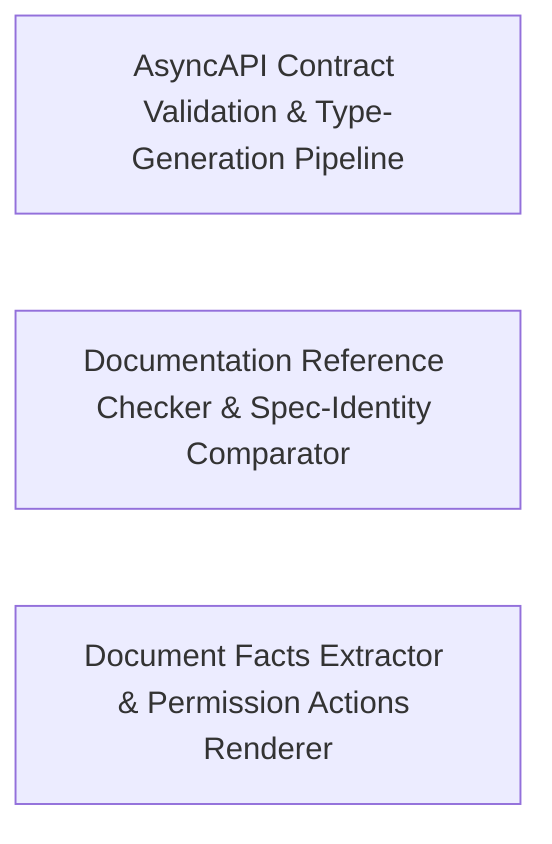

---
tags:
  - 2brain
  - 2brain/arch
  - project/boilerplate-vue-frontend
type: architecture
component: Contract_Validation
---

## Details

Verification tooling that validates the AsyncAPI contract and checks documentation references/facts, with the demo backend runner as a secondary concern.

### AsyncAPI Contract Validation & Type-Generation Pipeline [[Expand]](./AsyncAPI_Contract_Validation_Type_Generation_Pipeline.md)
This is the entry-point and spec-level correctness sub-component. It owns the full lifecycle of the AsyncAPI contract: parsing the spec, running structural validation (isInvalid), generating TypeScript model types (generate-asyncapi-types), and comparing spec identity across shared files (SpecComparison, normalise). It also hosts the demo backend runner (run-backend.boot), which boots a mock server to exercise the validated contract at runtime. The readAliases helper bridges into the reference-checking layer by extracting alias tables that downstream claim resolution consumes. This group is architecturally central because every other sub-component in the subsystem depends on the spec being validated and types being generated before documentation facts can be checked.

**Related Classes/Methods**:

- `scripts.contracts.validate-asyncapi.isInvalid`:32-37
- `scripts.demo.run-backend.boot`:50-95
- `scripts.docs.check-references.readAliases`:191-200

**Source Files:**

- `scripts/contracts/generate-asyncapi-types.ts`
  - `scripts.contracts.generate-asyncapi-types.renderLiteralArray.lines` (L236-L236) - Class
  - `scripts.contracts.generate-asyncapi-types.renderLiteralArray.lines.values.map() callback` (L236-L236) - Function
  - `scripts.contracts.generate-asyncapi-types.renderPayloadMap.rows` (L251-L255) - Class
  - `scripts.contracts.generate-asyncapi-types.renderPayloadMap.rows.entries.map() callback` (L253-L253) - Function
- `scripts/contracts/validate-asyncapi.ts`
  - `scripts.contracts.validate-asyncapi.isInvalid` (L32-L37) - Class
  - `scripts.contracts.validate-asyncapi.isInvalid.diagnostics.some() callback` (L34-L36) - Function
  - `scripts.contracts.validate-asyncapi.files.map() callback` (L44-L54) - Function
  - `scripts.contracts.validate-asyncapi.files.map() callback.then() callback` (L45-L54) - Function
  - `scripts.contracts.validate-asyncapi.then() callback` (L57-L61) - Function
  - `scripts.contracts.validate-asyncapi.catch() callback` (L62-L65) - Function
- `scripts/demo/demo-remove.ts`
  - `scripts.demo.demo-remove.stripModuleRegistry.after` (L53-L57) - Class
  - `scripts.demo.demo-remove.after.filter() callback` (L55-L55) - Function
  - `scripts.demo.demo-remove.stripModuleRegistry.after.filter() callback` (L56-L56) - Function
- `scripts/demo/run-backend.ts`
  - `scripts.demo.run-backend.boot` (L50-L95) - Class
  - `scripts.demo.run-backend.boot.process.on() callback` (L86-L88) - Function
  - `scripts.demo.run-backend.boot.child.on('close') callback` (L90-L94) - Function
  - `scripts.demo.run-backend.setInterval() callback` (L111-L111) - Function
- `scripts/docs/check-references.ts`
  - `scripts.docs.check-references.readAliases` (L191-L200) - Class
  - `scripts.docs.check-references.readAliases.map() callback` (L196-L199) - Function
  - `scripts.docs.check-references.run.pages` (L502-L508) - Class
  - `scripts.docs.check-references.run.pages.filter() callback` (L508-L508) - Function
- `scripts/docs/document-facts.ts`
  - `scripts.docs.document-facts.fencedContractImports.fences` (L136-L136) - Class
  - `scripts.docs.document-facts.fencedContractImports.fences.map() callback` (L136-L136) - Function
  - `scripts.docs.document-facts.fencedContractImports.fences.flatMap() callback` (L137-L152) - Function
  - `scripts.docs.document-facts.fencedContractImports.fences.flatMap() callback.flatMap() callback` (L140-L151) - Function
  - `scripts.docs.document-facts.fencedContractImports.fences.flatMap() callback.flatMap() callback.map() callback` (L151-L151) - Function
  - `scripts.docs.document-facts.exportedNames` (L183-L190) - Class
  - `scripts.docs.document-facts.exportedNames.map() callback` (L189-L189) - Function
- `scripts/mutation/baseline.ts`
  - `scripts.mutation.baseline.scoresFromReport.scored` (L94-L94) - Class
  - `scripts.mutation.baseline.scoresFromReport.scored.mutants.filter() callback` (L94-L94) - Function
  - `scripts.mutation.baseline.formatUnrecorded.lines` (L215-L215) - Class
  - `scripts.mutation.baseline.formatUnrecorded.lines.unrecorded.map() callback` (L215-L215) - Function
- `scripts/pairing/spec-identity.ts`
  - `scripts.pairing.spec-identity.SharedFile` (L29-L34) - Interface
  - `scripts.pairing.spec-identity.SpecComparison` (L97-L107) - Interface
  - `scripts.pairing.spec-identity.normalise` (L128-L140) - Class
  - `scripts.pairing.spec-identity.normalise.value.map() callback` (L129-L129) - Function
- `src/infrastructure/http/envelope.ts`
  - `src.infrastructure.http.envelope.ApiErrorItem` (L17-L22) - Interface
- `src/infrastructure/http/reauth-prompt.ts`
  - `src.infrastructure.http.reauth-prompt.PendingStepUp` (L17-L27) - Interface
  - `src.infrastructure.http.reauth-prompt.useReauthPromptStore` (L36-L79) - Class
  - `src.infrastructure.http.reauth-prompt.useReauthPromptStore.defineStore('reauthPrompt') callback` (L36-L79) - Function
  - `src.infrastructure.http.reauth-prompt.defineStore('reauthPrompt') callback.isOpen` (L45-L45) - Class
  - `src.infrastructure.http.reauth-prompt.useReauthPromptStore.defineStore('reauthPrompt') callback.isOpen.computed() callback` (L45-L45) - Function
  - `src.infrastructure.http.reauth-prompt.defineStore('reauthPrompt') callback.requestStepUp` (L53-L56) - Class
  - `src.infrastructure.http.reauth-prompt.useReauthPromptStore.defineStore('reauthPrompt') callback.requestStepUp.<function>` (L54-L56) - Function
- `src/infrastructure/http/refresh.ts`
  - `src.infrastructure.http.refresh.onResponseRejectWithRefresh` (L58-L82) - Class
  - `src.infrastructure.http.refresh.onResponseRejectWithRefresh.then() callback` (L72-L80) - Function
- `src/infrastructure/http/single-flight.ts`
  - `src.infrastructure.http.single-flight.singleFlight` (L15-L23) - Class
  - `src.infrastructure.http.single-flight.singleFlight.<function>` (L17-L22) - Function
  - `src.infrastructure.http.single-flight.singleFlight.<function>.finally() callback` (L18-L20) - Function
- `src/infrastructure/http/step-up.ts`
  - `src.infrastructure.http.step-up.requestFreshSession.singleFlight() callback` (L35-L36) - Function
  - `src.infrastructure.http.step-up.requestFreshSession` (L35-L37) - Class
  - `src.infrastructure.http.step-up.onResponseRejectWithStepUp` (L47-L69) - Class
  - `src.infrastructure.http.step-up.onResponseRejectWithStepUp.then() callback` (L60-L64) - Function
  - `src.infrastructure.http.step-up.onResponseRejectWithStepUp.catch() callback` (L66-L66) - Function
- `src/infrastructure/session.ts`
  - `src.infrastructure.session.SessionViewer` (L104-L146) - Interface
  - `src.infrastructure.session.useSessionStore` (L217-L685) - Class
  - `src.infrastructure.session.useSessionStore.defineStore('session') callback` (L217-L685) - Function
  - `src.infrastructure.session.defineStore('session') callback.isAuth` (L234-L234) - Class
  - `src.infrastructure.session.useSessionStore.defineStore('session') callback.isAuth.computed() callback` (L234-L234) - Function
  - `src.infrastructure.session.defineStore('session') callback.setViewer` (L394-L407) - Class
  - `src.infrastructure.session.useSessionStore.defineStore('session') callback.setViewer.then() callback` (L403-L405) - Function
  - `src.infrastructure.session.useSessionStore.defineStore('session') callback.setViewer.catch() callback` (L406-L406) - Function
  - `src.infrastructure.session.defineStore('session') callback.refreshToken` (L430-L453) - Class
  - `src.infrastructure.session.useSessionStore.defineStore('session') callback.refreshToken.then() callback` (L438-L442) - Function
  - `src.infrastructure.session.useSessionStore.defineStore('session') callback.refreshToken.catch() callback` (L443-L447) - Function
  - `src.infrastructure.session.useSessionStore.defineStore('session') callback.refreshToken.finally() callback` (L448-L450) - Function
  - `src.infrastructure.session.defineStore('session') callback.loadViewer` (L460-L485) - Class
  - `src.infrastructure.session.useSessionStore.defineStore('session') callback.loadViewer.then() callback` (L461-L485) - Function
  - `src.infrastructure.session.useSessionStore.defineStore('session') callback.loadViewer.then() callback.then() callback` (L484-L484) - Function
  - `src.infrastructure.session.defineStore('session') callback.persistLocalePreference` (L505-L512) - Class
  - `src.infrastructure.session.useSessionStore.defineStore('session') callback.persistLocalePreference.then() callback` (L510-L510) - Function
  - `src.infrastructure.session.useSessionStore.defineStore('session') callback.persistLocalePreference.catch() callback` (L511-L511) - Function
  - `src.infrastructure.session.useSessionStore.defineStore('session') callback.onScopeDispose() callback` (L546-L546) - Function
  - `src.infrastructure.session.defineStore('session') callback.reauth` (L587-L596) - Class
  - `src.infrastructure.session.useSessionStore.defineStore('session') callback.reauth.then() callback` (L590-L592) - Function
  - `src.infrastructure.session.useSessionStore.defineStore('session') callback.reauth.finally() callback` (L593-L595) - Function
  - `src.infrastructure.session.defineStore('session') callback.reauthMethods` (L605-L608) - Class
  - `src.infrastructure.session.useSessionStore.defineStore('session') callback.reauthMethods.then() callback` (L607-L607) - Function
  - `src.infrastructure.session.defineStore('session') callback.sendReauthCode` (L616-L619) - Class
  - `src.infrastructure.session.useSessionStore.defineStore('session') callback.sendReauthCode.then() callback` (L618-L618) - Function
  - `src.infrastructure.session.defineStore('session') callback.requestEmailVerification` (L628-L631) - Class
  - `src.infrastructure.session.useSessionStore.defineStore('session') callback.requestEmailVerification.then() callback` (L630-L630) - Function
  - `src.infrastructure.session.defineStore('session') callback.logout` (L648-L649) - Class
  - `src.infrastructure.session.useSessionStore.defineStore('session') callback.logout.then() callback` (L649-L649) - Function
  - `src.infrastructure.session.defineStore('session') callback.logoutAll` (L658-L659) - Class
  - `src.infrastructure.session.useSessionStore.defineStore('session') callback.logoutAll.then() callback` (L659-L659) - Function
- `src/vite-env.d.ts`
  - `src.vite-env.d.ViteTypeOptions` (L14-L16) - Interface
  - `src.vite-env.d.ImportMetaEnv` (L24-L46) - Interface

### Documentation Reference Checker & Spec-Identity Comparator
This sub-component is the claim-resolution and cross-file consistency engine. It models the core data structures of the reference-checking pipeline — Claim (a documented assertion), Finding (the resolution outcome), and Scan (the traversal context) — and implements the resolves function that maps each claim to a concrete source location or flags it as broken. The allowed predicate and ALLOWED list gate which references are considered valid. The compareSharedFiles and sharedFileProblems functions in spec-identity.ts enforce that shared spec files remain structurally consistent with each other. The mutation baseline helpers (formatRegressions, formatUnrecorded) track whether validation results have regressed against a recorded baseline, enabling CI gate enforcement. This group is the decision core of the subsystem: it transforms raw documentation text into pass/fail verdicts with actionable findings.

**Related Classes/Methods**:

- `scripts.docs.check-references.resolves`:333-334
- `scripts.pairing.spec-identity.compareSharedFiles`:176-206

**Source Files:**

- `scripts/contracts/generate-asyncapi-types.ts`
  - `scripts.contracts.generate-asyncapi-types.then() callback.modelBlocks` (L419-L422) - Class
  - `scripts.contracts.generate-asyncapi-types.then() callback.modelBlocks.models.map() callback` (L420-L421) - Function
- `scripts/docs/check-references.ts`
  - `scripts.docs.check-references.Finding` (L119-L122) - Interface
  - `scripts.docs.check-references.allowed` (L177-L183) - Class
  - `scripts.docs.check-references.allowed.ALLOWED.some() callback` (L179-L182) - Function
  - `scripts.docs.check-references.trackedTargets.roots.files.map() callback` (L237-L237) - Function
  - `scripts.docs.check-references.resolves` (L333-L334) - Class
  - `scripts.docs.check-references.resolves.SPELLINGS.some() callback` (L334-L334) - Function
  - `scripts.docs.check-references.Scan` (L337-L340) - Interface
  - `scripts.docs.check-references.Claim` (L343-L346) - Interface
  - `scripts.docs.check-references.run.roots` (L494-L494) - Class
  - `scripts.docs.check-references.run.roots.ALLOWED.map() callback` (L494-L494) - Function
- `scripts/mutation/baseline.ts`
  - `scripts.mutation.baseline.formatUnrecorded.unrecorded` (L212-L212) - Class
  - `scripts.mutation.baseline.formatUnrecorded.unrecorded.comparisons.filter() callback` (L212-L212) - Function
  - `scripts.mutation.baseline.formatRegressions.lines` (L231-L234) - Class
  - `scripts.mutation.baseline.formatRegressions.lines.regressed.map() callback` (L232-L233) - Function
- `scripts/pairing/spec-identity.ts`
  - `scripts.pairing.spec-identity.compareSharedFiles` (L176-L206) - Class
  - `scripts.pairing.spec-identity.compareSharedFiles.SHARED_FILES.map() callback` (L181-L206) - Function
  - `scripts.pairing.spec-identity.sharedFileProblems` (L209-L210) - Class
  - `scripts.pairing.spec-identity.sharedFileProblems.comparisons.filter() callback` (L210-L210) - Function
- `src/modules/account/composables/use-countdown.ts`
  - `src.modules.account.composables.use-countdown.useCountdown` (L21-L74) - Class
  - `src.modules.account.composables.use-countdown.useCountdown.watch() callback` (L47-L54) - Function
  - `src.modules.account.composables.use-countdown.useCountdown.watch() callback.setInterval() callback` (L51-L53) - Function
  - `src.modules.account.composables.use-countdown.secondsLeft` (L63-L71) - Class
  - `src.modules.account.composables.use-countdown.useCountdown.secondsLeft.computed() callback` (L63-L71) - Function
  - `src.modules.account.composables.use-countdown.useExpiryCountdown` (L83-L84) - Class
  - `src.modules.account.composables.use-countdown.useExpiryCountdown.computed() callback` (L84-L84) - Function
  - `src.modules.account.composables.use-countdown.useCountdownAnnouncement` (L118-L146) - Class
  - `src.modules.account.composables.use-countdown.useCountdownAnnouncement.watch() callback` (L135-L141) - Function
  - `src.modules.account.composables.use-countdown.useCountdownAnnouncement.watch() callback.threshold` (L136-L136) - Class
  - `src.modules.account.composables.use-countdown.useCountdownAnnouncement.watch() callback.threshold.ANNOUNCEMENT_THRESHOLDS.find() callback` (L136-L136) - Function
- `src/modules/account/composables/use-password-breach-check.ts`
  - `src.modules.account.composables.use-password-breach-check.usePasswordBreachCheck` (L23-L83) - Class
  - `src.modules.account.composables.use-password-breach-check.usePasswordBreachCheck.send` (L45-L60) - Class
  - `src.modules.account.composables.use-password-breach-check.usePasswordBreachCheck.send.debounce() callback` (L45-L60) - Function
  - `src.modules.account.composables.use-password-breach-check.usePasswordBreachCheck.send.debounce() callback.then() callback` (L49-L52) - Function
  - `src.modules.account.composables.use-password-breach-check.usePasswordBreachCheck.send.debounce() callback.catch() callback` (L53-L56) - Function
  - `src.modules.account.composables.use-password-breach-check.usePasswordBreachCheck.send.debounce() callback.finally() callback` (L57-L59) - Function
  - `src.modules.account.composables.use-password-breach-check.usePasswordBreachCheck.onScopeDispose() callback` (L80-L80) - Function
- `src/modules/account/composables/use-password-strength.ts`
  - `src.modules.account.composables.use-password-strength.loadZxcvbn` (L20-L44) - Class
  - `src.modules.account.composables.use-password-strength.loadZxcvbn.then() callback` (L27-L35) - Function
  - `src.modules.account.composables.use-password-strength.loadZxcvbn.catch() callback` (L39-L42) - Function
  - `src.modules.account.composables.use-password-strength.usePasswordStrength` (L55-L79) - Class
  - `src.modules.account.composables.use-password-strength.usePasswordStrength.watch() callback` (L60-L74) - Function
  - `src.modules.account.composables.use-password-strength.usePasswordStrength.watch() callback.then() callback` (L69-L72) - Function
  - `src.modules.account.composables.use-password-strength.usePasswordStrength.watch() callback.catch() callback` (L73-L73) - Function
- `src/modules/account/stores/two-factor.ts`
  - `src.modules.account.stores.two-factor.LoginChallenge` (L54-L60) - Interface
  - `src.modules.account.stores.two-factor.useTwoFactorStore` (L70-L447) - Class
  - `src.modules.account.stores.two-factor.useTwoFactorStore.defineStore('accountTwoFactor') callback` (L70-L447) - Function
  - `src.modules.account.stores.two-factor.defineStore('accountTwoFactor') callback.fetchStatus` (L147-L153) - Class
  - `src.modules.account.stores.two-factor.useTwoFactorStore.defineStore('accountTwoFactor') callback.fetchStatus.fetchAny() callback` (L148-L152) - Function
  - `src.modules.account.stores.two-factor.useTwoFactorStore.defineStore('accountTwoFactor') callback.fetchStatus.fetchAny() callback.then() callback` (L149-L152) - Function
  - `src.modules.account.stores.two-factor.defineStore('accountTwoFactor') callback.setupMethod` (L170-L192) - Class
  - `src.modules.account.stores.two-factor.useTwoFactorStore.defineStore('accountTwoFactor') callback.setupMethod.fetchAny() callback` (L173-L189) - Function
  - `src.modules.account.stores.two-factor.useTwoFactorStore.defineStore('accountTwoFactor') callback.setupMethod.fetchAny() callback.then() callback` (L174-L189) - Function
  - `src.modules.account.stores.two-factor.defineStore('accountTwoFactor') callback.sendMethodCode` (L202-L213) - Class
  - `src.modules.account.stores.two-factor.useTwoFactorStore.defineStore('accountTwoFactor') callback.sendMethodCode.fetchAny() callback` (L205-L210) - Function
  - `src.modules.account.stores.two-factor.useTwoFactorStore.defineStore('accountTwoFactor') callback.sendMethodCode.fetchAny() callback.then() callback` (L206-L210) - Function
  - `src.modules.account.stores.two-factor.defineStore('accountTwoFactor') callback.confirmMethod` (L225-L234) - Class
  - `src.modules.account.stores.two-factor.useTwoFactorStore.defineStore('accountTwoFactor') callback.confirmMethod.fetchAny() callback` (L227-L232) - Function
  - `src.modules.account.stores.two-factor.useTwoFactorStore.defineStore('accountTwoFactor') callback.confirmMethod.fetchAny() callback.then() callback` (L228-L232) - Function
  - `src.modules.account.stores.two-factor.useTwoFactorStore.defineStore('accountTwoFactor') callback.confirmMethod.fetchAny() callback.then() callback.then() callback` (L231-L231) - Function
  - `src.modules.account.stores.two-factor.defineStore('accountTwoFactor') callback.removeMethod` (L244-L248) - Class
  - `src.modules.account.stores.two-factor.useTwoFactorStore.defineStore('accountTwoFactor') callback.removeMethod.fetchAny() callback` (L245-L245) - Function
  - `src.modules.account.stores.two-factor.useTwoFactorStore.defineStore('accountTwoFactor') callback.removeMethod.fetchAny() callback.then() callback` (L245-L245) - Function
  - `src.modules.account.stores.two-factor.defineStore('accountTwoFactor') callback.disableAll` (L256-L260) - Class
  - `src.modules.account.stores.two-factor.useTwoFactorStore.defineStore('accountTwoFactor') callback.disableAll.fetchAny() callback` (L257-L257) - Function
  - `src.modules.account.stores.two-factor.useTwoFactorStore.defineStore('accountTwoFactor') callback.disableAll.fetchAny() callback.then() callback` (L257-L257) - Function
  - `src.modules.account.stores.two-factor.defineStore('accountTwoFactor') callback.regenerateBackupCodes` (L272-L280) - Class
  - `src.modules.account.stores.two-factor.useTwoFactorStore.defineStore('accountTwoFactor') callback.regenerateBackupCodes.fetchAny() callback` (L274-L278) - Function
  - `src.modules.account.stores.two-factor.useTwoFactorStore.defineStore('accountTwoFactor') callback.regenerateBackupCodes.fetchAny() callback.then() callback` (L275-L278) - Function
  - `src.modules.account.stores.two-factor.useTwoFactorStore.defineStore('accountTwoFactor') callback.regenerateBackupCodes.fetchAny() callback.then() callback.then() callback` (L277-L277) - Function
  - `src.modules.account.stores.two-factor.defineStore('accountTwoFactor') callback.sendingCode` (L287-L287) - Class
  - `src.modules.account.stores.two-factor.useTwoFactorStore.defineStore('accountTwoFactor') callback.sendingCode.computed() callback` (L287-L287) - Function
  - `src.modules.account.stores.two-factor.defineStore('accountTwoFactor') callback.confirmingCode` (L292-L292) - Class
  - `src.modules.account.stores.two-factor.useTwoFactorStore.defineStore('accountTwoFactor') callback.confirmingCode.computed() callback` (L292-L292) - Function
  - `src.modules.account.stores.two-factor.defineStore('accountTwoFactor') callback.mutatingWithCode` (L298-L300) - Class
  - `src.modules.account.stores.two-factor.useTwoFactorStore.defineStore('accountTwoFactor') callback.mutatingWithCode.computed() callback` (L299-L299) - Function
  - `src.modules.account.stores.two-factor.defineStore('accountTwoFactor') callback.sendLoginCode` (L378-L390) - Class
  - `src.modules.account.stores.two-factor.useTwoFactorStore.defineStore('accountTwoFactor') callback.sendLoginCode.fetchAny() callback` (L382-L387) - Function
  - `src.modules.account.stores.two-factor.useTwoFactorStore.defineStore('accountTwoFactor') callback.sendLoginCode.fetchAny() callback.then() callback` (L383-L387) - Function
  - `src.modules.account.stores.two-factor.defineStore('accountTwoFactor') callback.submitLoginCode` (L400-L419) - Class
  - `src.modules.account.stores.two-factor.useTwoFactorStore.defineStore('accountTwoFactor') callback.submitLoginCode.fetchAny() callback` (L403-L417) - Function
  - `src.modules.account.stores.two-factor.useTwoFactorStore.defineStore('accountTwoFactor') callback.submitLoginCode.fetchAny() callback.then() callback` (L410-L417) - Function
  - `src.modules.account.stores.two-factor.useTwoFactorStore.defineStore('accountTwoFactor') callback.submitLoginCode.fetchAny() callback.then() callback.then() callback` (L414-L416) - Function

### Document Facts Extractor & Permission Actions Renderer
This sub-component is the page-level fact extraction and structured output layer. DocumentPage models a single documentation page and its extracted facts; PackageFacts captures the ground-truth state of the package (exported names, npm scripts, dependency listings) against which facts are verified. The extraction pipeline produces FactFinding records for categories such as missingScripts, staleListings, unknownContractImports, fencedContractImports, codeSpans, and unnamedOn. The factFindings.byPath index aggregates findings per file path for reporting. The renderPermissionActions function converts the contract's permission-action definitions into a structured table, ensuring the documented permission matrix matches the spec. This group is the output and reporting sub-component: it turns raw extraction data into human- and machine-readable findings that feed CI reports and developer feedback.

**Related Classes/Methods**:

- `scripts.docs.check-references.factFindings.byPath`

**Source Files:**

- `scripts/contracts/permission-actions-render.ts`
  - `scripts.contracts.permission-actions-render.renderPermissionActions.rows` (L36-L36) - Class
  - `scripts.contracts.permission-actions-render.renderPermissionActions.rows.actions.map() callback` (L36-L36) - Function
- `scripts/docs/check-references.ts`
  - `scripts.docs.check-references.throughAliases.alias.aliases.find() callback` (L314-L315) - Function
  - `scripts.docs.check-references.throughAliases.alias` (L314-L316) - Class
  - `scripts.docs.check-references.factFindings.byPath` (L467-L467) - Class
  - `scripts.docs.check-references.factFindings.byPath.pages.map() callback` (L467-L467) - Function
  - `scripts.docs.check-references.run.documentPages` (L525-L528) - Class
  - `scripts.docs.check-references.run.documentPages.pages.map() callback` (L525-L528) - Function
- `scripts/docs/document-facts.ts`
  - `scripts.docs.document-facts.DocumentPage` (L20-L25) - Interface
  - `scripts.docs.document-facts.PackageFacts` (L30-L37) - Interface
  - `scripts.docs.document-facts.FactFinding` (L42-L47) - Interface
  - `scripts.docs.document-facts.npmScriptsCited` (L56-L58) - Class
  - `scripts.docs.document-facts.npmScriptsCited.map() callback` (L57-L57) - Function
  - `scripts.docs.document-facts.missingScripts` (L67-L72) - Class
  - `scripts.docs.document-facts.missingScripts.pages.flatMap() callback` (L68-L71) - Function
  - `scripts.docs.document-facts.missingScripts.pages.flatMap() callback.filter() callback` (L70-L70) - Function
  - `scripts.docs.document-facts.missingScripts.pages.flatMap() callback.map() callback` (L71-L71) - Function
  - `scripts.docs.document-facts.codeSpans` (L81-L82) - Class
  - `scripts.docs.document-facts.codeSpans.flatMap() callback` (L82-L82) - Function
  - `scripts.docs.document-facts.unnamedOn` (L92-L97) - Class
  - `scripts.docs.document-facts.unnamedOn.names.filter() callback` (L95-L95) - Function
  - `scripts.docs.document-facts.unnamedOn.map() callback` (L96-L96) - Function
  - `scripts.docs.document-facts.staleListings` (L124-L127) - Class
  - `scripts.docs.document-facts.staleListings.filter() callback` (L126-L126) - Function
  - `scripts.docs.document-facts.staleListings.map() callback` (L127-L127) - Function
  - `scripts.docs.document-facts.fencedContractImports` (L135-L154) - Class
  - `scripts.docs.document-facts.fences.flatMap() callback.flatMap() callback.map() callback` (L144-L148) - Function
  - `scripts.docs.document-facts.unknownContractImports` (L163-L174) - Class
  - `scripts.docs.document-facts.unknownContractImports.pages.flatMap() callback` (L167-L173) - Function
  - `scripts.docs.document-facts.unknownContractImports.pages.flatMap() callback.filter() callback` (L169-L169) - Function
  - `scripts.docs.document-facts.unknownContractImports.pages.flatMap() callback.map() callback` (L170-L173) - Function
- `scripts/mutation/baseline.ts`
  - `scripts.mutation.baseline.scoresFromReport.killed` (L102-L102) - Class
  - `scripts.mutation.baseline.scoresFromReport.killed.scored.filter() callback` (L102-L102) - Function
  - `scripts.mutation.baseline.formatRegressions.regressed` (L228-L228) - Class
  - `scripts.mutation.baseline.formatRegressions.regressed.comparisons.filter() callback` (L228-L228) - Function
- `scripts/pairing/spec-identity.ts`
  - `scripts.pairing.spec-identity.formatSharedFileProblems.lines` (L227-L243) - Class
  - `scripts.pairing.spec-identity.formatSharedFileProblems.lines.problems.map() callback` (L227-L243) - Function
- `src/app/components/use-focus-tooltip.ts`
  - `src.app.components.use-focus-tooltip.FocusTooltip` (L12-L25) - Interface
  - `src.app.components.use-focus-tooltip.useFocusTooltip` (L44-L62) - Class
  - `src.app.components.use-focus-tooltip.useFocusTooltip.openTooltipOnRealFocus` (L52-L54) - Method
  - `src.app.components.use-focus-tooltip.useFocusTooltip.closeTooltip` (L55-L60) - Method
  - `src.app.components.use-focus-tooltip.useFocusTooltip.closeTooltip.setTimeout() callback` (L57-L59) - Function
- `src/modules/account/stores/addresses.ts`
  - `src.modules.account.stores.addresses.useAddressesStore` (L32-L129) - Class
  - `src.modules.account.stores.addresses.useAddressesStore.defineStore('accountAddresses') callback` (L32-L129) - Function
  - `src.modules.account.stores.addresses.defineStore('accountAddresses') callback.fetchAddresses` (L68-L69) - Class
  - `src.modules.account.stores.addresses.useAddressesStore.defineStore('accountAddresses') callback.fetchAddresses.fetchAny() callback` (L69-L69) - Function
  - `src.modules.account.stores.addresses.useAddressesStore.defineStore('accountAddresses') callback.fetchAddresses.fetchAny() callback.then() callback` (L69-L69) - Function
  - `src.modules.account.stores.addresses.useAddressesStore.defineStore('accountAddresses') callback.reloadBook` (L77-L77) - Class
  - `src.modules.account.stores.addresses.useAddressesStore.defineStore('accountAddresses') callback.reloadBook.then() callback` (L77-L77) - Function
  - `src.modules.account.stores.addresses.defineStore('accountAddresses') callback.addAddress` (L87-L88) - Class
  - `src.modules.account.stores.addresses.useAddressesStore.defineStore('accountAddresses') callback.addAddress.fetchAny() callback` (L88-L88) - Function
  - `src.modules.account.stores.addresses.useAddressesStore.defineStore('accountAddresses') callback.addAddress.fetchAny() callback.then() callback` (L88-L88) - Function
  - `src.modules.account.stores.addresses.defineStore('accountAddresses') callback.updateAddress` (L98-L99) - Class
  - `src.modules.account.stores.addresses.useAddressesStore.defineStore('accountAddresses') callback.updateAddress.fetchAny() callback` (L99-L99) - Function
  - `src.modules.account.stores.addresses.useAddressesStore.defineStore('accountAddresses') callback.updateAddress.fetchAny() callback.then() callback` (L99-L99) - Function
  - `src.modules.account.stores.addresses.defineStore('accountAddresses') callback.setDefaultAddress` (L108-L109) - Class
  - `src.modules.account.stores.addresses.useAddressesStore.defineStore('accountAddresses') callback.setDefaultAddress.fetchAny() callback` (L109-L109) - Function
  - `src.modules.account.stores.addresses.useAddressesStore.defineStore('accountAddresses') callback.setDefaultAddress.fetchAny() callback.then() callback` (L109-L109) - Function
  - `src.modules.account.stores.addresses.defineStore('accountAddresses') callback.removeAddress` (L117-L118) - Class
  - `src.modules.account.stores.addresses.useAddressesStore.defineStore('accountAddresses') callback.removeAddress.fetchAny() callback` (L118-L118) - Function
  - `src.modules.account.stores.addresses.useAddressesStore.defineStore('accountAddresses') callback.removeAddress.fetchAny() callback.then() callback` (L118-L118) - Function
- `src/modules/account/stores/oauth.ts`
  - `src.modules.account.stores.oauth.oauthStartUrl.parameters` (L64-L68) - Class
  - `src.modules.account.stores.oauth.oauthStartUrl.parameters.filter() callback` (L65-L66) - Function
  - `src.modules.account.stores.oauth.useOAuthProvidersStore` (L77-L126) - Class
  - `src.modules.account.stores.oauth.useOAuthProvidersStore.defineStore('accountOAuthProviders') callback` (L77-L126) - Function
  - `src.modules.account.stores.oauth.defineStore('accountOAuthProviders') callback.fetchProviders` (L109-L119) - Class
  - `src.modules.account.stores.oauth.useOAuthProvidersStore.defineStore('accountOAuthProviders') callback.fetchProviders.fetchAny() callback` (L111-L117) - Function
  - `src.modules.account.stores.oauth.useOAuthProvidersStore.defineStore('accountOAuthProviders') callback.fetchProviders.fetchAny() callback.then() callback` (L112-L117) - Function
  - `src.modules.account.stores.oauth.useOAuthProvidersStore.defineStore('accountOAuthProviders') callback.fetchProviders.catch() callback` (L118-L118) - Function
- `src/modules/account/stores/sessions.ts`
  - `src.modules.account.stores.sessions.useAccountSessionsStore` (L20-L67) - Class
  - `src.modules.account.stores.sessions.useAccountSessionsStore.defineStore('accountSessions') callback` (L20-L67) - Function
  - `src.modules.account.stores.sessions.defineStore('accountSessions') callback.fetchSessions` (L42-L49) - Class
  - `src.modules.account.stores.sessions.useAccountSessionsStore.defineStore('accountSessions') callback.fetchSessions.fetchAny() callback` (L43-L48) - Function
  - `src.modules.account.stores.sessions.useAccountSessionsStore.defineStore('accountSessions') callback.fetchSessions.fetchAny() callback.then() callback` (L44-L48) - Function
  - `src.modules.account.stores.sessions.defineStore('accountSessions') callback.revokeSession` (L58-L59) - Class
  - `src.modules.account.stores.sessions.useAccountSessionsStore.defineStore('accountSessions') callback.revokeSession.fetchAny() callback` (L59-L59) - Function
  - `src.modules.account.stores.sessions.useAccountSessionsStore.defineStore('accountSessions') callback.revokeSession.fetchAny() callback.then() callback` (L59-L59) - Function
- `src/modules/account/stores/two-factor.ts`
  - `src.modules.account.stores.two-factor.useTwoFactorStore.defineStore('accountTwoFactor') callback.applyResendCooldown` (L134-L139) - Class
  - `src.modules.account.stores.two-factor.useTwoFactorStore.defineStore('accountTwoFactor') callback.applyResendCooldown.promise.catch() callback` (L135-L139) - Function
