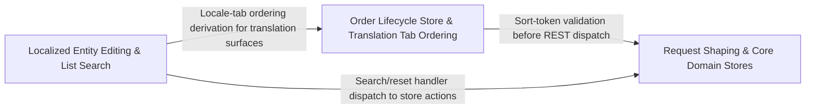

---
tags:
  - 2brain
  - 2brain/arch
  - project/boilerplate-vue-frontend
type: architecture
component: Domain_Stores_Form_Sort_Utilities
---

## Details

The domain-state and request-shaping layer that turns user input into contract-conformant request bodies and reads generated response types. It owns the form utilities (filter, omitNulls, shapeObject, toRequestBody, uploadThenClear) and the sort helpers (SingleSort, sortFieldsOf), the orders/products/users Pinia stores (listCreditNotes, idBatches, useUsersStore), and the products translation composables (translation-tab-errors, translations-body, use-active-locales, use-product-lines, use-translated-entity-form) that drive the localized entity editing surface.

### Request Shaping & Core Domain Stores
This is the foundational request-shaping and state-management backbone of the subsystem. It owns the form utility pipeline (filter → omitNulls → shapeObject → toRequestBody → uploadThenClear) that converts raw form model values into the exact JSON body the OpenAPI contract expects, stripping nulls, reshaping nested objects, and handling file-upload-then-clear semantics. The sort helpers (SingleSort, sortFieldsOf) translate user-facing sort selections into the sort query-parameter format the API requires. The two core Pinia stores — useProductsStore (101–404 lines, the largest store in the subsystem) and useUsersStore (65–261 lines) — encapsulate all CRUD and list-fetching state for their respective domains, consuming the generated client and the form/sort utilities above. Supporting composables (use-active-locales, use-product-lines) and the user-access dialog / roles helpers round out the products and users editing surfaces. This group is the entry point for every domain mutation: no store action reaches the network without passing through the form-shaping pipeline.

**Related Classes/Methods**:

- `src.infrastructure.utils.forms.toRequestBody`:169-179
- `src.infrastructure.utils.forms.shapeObject`:108-121
- `src.infrastructure.utils.sort.sortFieldsOf`:100-102
- `src.modules.products.store.useProductsStore`:101-404
- `src.modules.users.store.useUsersStore`:65-261

**Source Files:**

- `src/infrastructure/utils/forms.ts`
  - `src.infrastructure.utils.forms.shapeObject` (L108-L121) - Class
  - `src.infrastructure.utils.forms.filter() callback` (L115-L115) - Function
  - `src.infrastructure.utils.forms.shapeObject.map() callback` (L117-L118) - Function
  - `src.infrastructure.utils.forms.shapeObject.filter() callback` (L120-L120) - Function
  - `src.infrastructure.utils.forms.toRequestBody` (L169-L179) - Class
  - `src.infrastructure.utils.forms.toRequestBody.then() callback` (L175-L178) - Function
  - `src.infrastructure.utils.forms.uploadThenClear` (L204-L221) - Class
  - `src.infrastructure.utils.forms.uploadThenClear.clears` (L212-L214) - Class
  - `src.infrastructure.utils.forms.uploadThenClear.clears.entries.filter() callback` (L213-L213) - Function
  - `src.infrastructure.utils.forms.uploadThenClear.rest` (L215-L217) - Class
  - `src.infrastructure.utils.forms.uploadThenClear.rest.entries.filter() callback` (L216-L216) - Function
  - `src.infrastructure.utils.forms.uploadThenClear.then() callback` (L218-L219) - Function
  - `src.infrastructure.utils.forms.omitNulls` (L232-L238) - Class
  - `src.infrastructure.utils.forms.omitNulls.keys.filter() callback` (L237-L237) - Function
  - `src.infrastructure.utils.forms.omitNulls.map() callback` (L237-L237) - Function
- `src/infrastructure/utils/sort.ts`
  - `src.infrastructure.utils.sort.SingleSort` (L17-L22) - Interface
  - `src.infrastructure.utils.sort.sortTokensOf.tokens` (L86-L89) - Class
  - `src.infrastructure.utils.sort.sortTokensOf.tokens.map() callback` (L88-L88) - Function
  - `src.infrastructure.utils.sort.sortTokensOf.tokens.filter() callback` (L89-L89) - Function
  - `src.infrastructure.utils.sort.sortTokensOf.valid` (L90-L90) - Class
  - `src.infrastructure.utils.sort.sortTokensOf.valid.tokens.filter() callback` (L90-L90) - Function
  - `src.infrastructure.utils.sort.sortFieldsOf` (L100-L102) - Class
  - `src.infrastructure.utils.sort.sortFieldsOf.map() callback` (L101-L101) - Function
- `src/modules/products/composables/use-active-locales.ts`
  - `src.modules.products.composables.use-active-locales.useActiveLocales.fetchActiveLocales.then() callback` (L76-L79) - Function
  - `src.modules.products.composables.use-active-locales.useActiveLocales.fetchActiveLocales.catch() callback` (L80-L84) - Function
  - `src.modules.products.composables.use-active-locales.useActiveLocales.fetchActiveLocales.finally() callback` (L85-L87) - Function
- `src/modules/products/composables/use-product-lines.ts`
  - `src.modules.products.composables.use-product-lines.ProductLines` (L15-L40) - Interface
  - `src.modules.products.composables.use-product-lines.useProductLines` (L47-L61) - Class
  - `src.modules.products.composables.use-product-lines.useProductLines.loadProducts` (L55-L56) - Method
  - `src.modules.products.composables.use-product-lines.useProductLines.titleOf` (L58-L59) - Method
- `src/modules/products/store.ts`
  - `src.modules.products.store.useProductsStore` (L101-L404) - Class
  - `src.modules.products.store.useProductsStore.defineStore('products') callback` (L101-L404) - Function
  - `src.modules.products.store.defineStore('products') callback.hardDeleteProduct` (L293-L294) - Class
  - `src.modules.products.store.useProductsStore.defineStore('products') callback.hardDeleteProduct.deleteTarget() callback` (L294-L294) - Function
  - `src.modules.products.store.defineStore('products') callback.restoreProduct` (L303-L309) - Class
  - `src.modules.products.store.useProductsStore.defineStore('products') callback.restoreProduct.fetchAny() callback` (L304-L308) - Function
  - `src.modules.products.store.useProductsStore.defineStore('products') callback.restoreProduct.fetchAny() callback.then() callback` (L305-L308) - Function
  - `src.modules.products.store.defineStore('products') callback.fetchProductAdmin` (L322-L323) - Class
  - `src.modules.products.store.useProductsStore.defineStore('products') callback.fetchProductAdmin.fetchAny() callback` (L323-L323) - Function
  - `src.modules.products.store.useProductsStore.defineStore('products') callback.fetchProductAdmin.fetchAny() callback.then() callback` (L323-L323) - Function
  - `src.modules.products.store.defineStore('products') callback.fetchProductsByIds` (L338-L350) - Class
  - `src.modules.products.store.useProductsStore.defineStore('products') callback.fetchProductsByIds.fetchMultiple() callback` (L340-L347) - Function
  - `src.modules.products.store.useProductsStore.defineStore('products') callback.fetchProductsByIds.fetchMultiple() callback.map() callback` (L342-L345) - Function
  - `src.modules.products.store.useProductsStore.defineStore('products') callback.fetchProductsByIds.fetchMultiple() callback.map() callback.then() callback` (L344-L344) - Function
  - `src.modules.products.store.useProductsStore.defineStore('products') callback.fetchProductsByIds.fetchMultiple() callback.then() callback` (L347-L347) - Function
  - `src.modules.products.store.defineStore('products') callback.fetchFacets` (L367-L373) - Class
  - `src.modules.products.store.useProductsStore.defineStore('products') callback.fetchFacets.fetchAny() callback` (L368-L372) - Function
  - `src.modules.products.store.useProductsStore.defineStore('products') callback.fetchFacets.fetchAny() callback.then() callback` (L369-L372) - Function
- `src/modules/users/composables/use-user-access-dialog.ts`
  - `src.modules.users.composables.use-user-access-dialog.UserAccessDialogTarget` (L16-L21) - Interface
  - `src.modules.users.composables.use-user-access-dialog.UserAccessDialogRequestOptions` (L28-L32) - Interface
  - `src.modules.users.composables.use-user-access-dialog.UserAccessDialogResult` (L38-L41) - Interface
  - `src.modules.users.composables.use-user-access-dialog.useUserAccessDialog` (L49-L109) - Class
  - `src.modules.users.composables.use-user-access-dialog.useUserAccessDialog.confirm` (L106-L106) - Method
  - `src.modules.users.composables.use-user-access-dialog.useUserAccessDialog.cancel` (L107-L107) - Method
- `src/modules/users/domain/roles.ts`
  - `src.modules.users.domain.roles.userRoleOptions` (L29-L29) - Class
  - `src.modules.users.domain.roles.userRoleOptions.USER_ROLES.map() callback` (L29-L29) - Function
- `src/modules/users/store.ts`
  - `src.modules.users.store.useUsersStore` (L65-L261) - Class
  - `src.modules.users.store.useUsersStore.defineStore('users') callback` (L65-L261) - Function
  - `src.modules.users.store.defineStore('users') callback.hardDeleteUser` (L192-L193) - Class
  - `src.modules.users.store.useUsersStore.defineStore('users') callback.hardDeleteUser.deleteTarget() callback` (L193-L193) - Function
  - `src.modules.users.store.defineStore('users') callback.restoreUser` (L202-L208) - Class
  - `src.modules.users.store.useUsersStore.defineStore('users') callback.restoreUser.fetchAny() callback` (L203-L207) - Function
  - `src.modules.users.store.useUsersStore.defineStore('users') callback.restoreUser.fetchAny() callback.then() callback` (L204-L207) - Function
  - `src.modules.users.store.defineStore('users') callback.adminDisableTwoFactor` (L230-L233) - Class
  - `src.modules.users.store.useUsersStore.defineStore('users') callback.adminDisableTwoFactor.fetchAny() callback` (L231-L232) - Function
  - `src.modules.users.store.useUsersStore.defineStore('users') callback.adminDisableTwoFactor.fetchAny() callback.then() callback` (L232-L232) - Function
- `src/ui/composables/use-server-sort.ts`
  - `src.ui.composables.use-server-sort.useServerSort.sortBy.get` (L55-L55) - Method
  - `src.ui.composables.use-server-sort.useServerSort.sortBy.set` (L56-L56) - Method

### Order Lifecycle Store & Translation Tab Ordering
This sub-component owns the orders domain store and its full lifecycle operation set: cancelOrder, restoreOrder, hardDeleteOrder, overrideStatus, fetchCreditNote, fetchInvoice, and listCreditNotes. Unlike the products/users stores (which are CRUD-centric), the orders store models a state-machine workflow — orders transition through statuses, can be soft-deleted and restored, and have associated financial artifacts (credit notes, invoices) fetched on demand. The listCreditNotes function is a standalone exported helper that batches credit-note retrieval. The second half of this group is the translation tab ordering composable (useTranslationTabOrder), which computes the display order of locale tabs in the translation editing UI by filtering and sorting the tags array — a shared UI concern that the orders store's detail view and the products translation surface both consume. This group is architecturally distinct because it introduces asynchronous lifecycle operations (cancel → confirm → status change) and financial sub-resource fetching that have no parallel in the products/users stores.

**Related Classes/Methods**:

- `src.modules.orders.store.useOrdersStore`:74-294
- `src.modules.orders.store.listCreditNotes`:61-62

**Source Files:**

- `src/modules/orders/store.ts`
  - `src.modules.orders.store.listCreditNotes` (L61-L62) - Class
  - `src.modules.orders.store.listCreditNotes.then() callback` (L62-L62) - Function
  - `src.modules.orders.store.useOrdersStore` (L74-L294) - Class
  - `src.modules.orders.store.useOrdersStore.defineStore('orders') callback` (L74-L294) - Function
  - `src.modules.orders.store.defineStore('orders') callback.hardDeleteOrder` (L183-L184) - Class
  - `src.modules.orders.store.useOrdersStore.defineStore('orders') callback.hardDeleteOrder.deleteTarget() callback` (L184-L184) - Function
  - `src.modules.orders.store.defineStore('orders') callback.restoreOrder` (L193-L198) - Class
  - `src.modules.orders.store.useOrdersStore.defineStore('orders') callback.restoreOrder.updateTarget() callback` (L195-L195) - Function
  - `src.modules.orders.store.useOrdersStore.defineStore('orders') callback.restoreOrder.updateTarget() callback.then() callback` (L195-L195) - Function
  - `src.modules.orders.store.defineStore('orders') callback.cancelOrder` (L215-L223) - Class
  - `src.modules.orders.store.useOrdersStore.defineStore('orders') callback.cancelOrder.updateTarget() callback` (L217-L220) - Function
  - `src.modules.orders.store.useOrdersStore.defineStore('orders') callback.cancelOrder.updateTarget() callback.then() callback` (L219-L219) - Function
  - `src.modules.orders.store.defineStore('orders') callback.overrideStatus` (L237-L242) - Class
  - `src.modules.orders.store.useOrdersStore.defineStore('orders') callback.overrideStatus.updateTarget() callback` (L239-L239) - Function
  - `src.modules.orders.store.useOrdersStore.defineStore('orders') callback.overrideStatus.updateTarget() callback.then() callback` (L239-L239) - Function
  - `src.modules.orders.store.defineStore('orders') callback.fetchInvoice` (L251-L251) - Class
  - `src.modules.orders.store.useOrdersStore.defineStore('orders') callback.fetchInvoice.fetchAny() callback` (L251-L251) - Function
  - `src.modules.orders.store.defineStore('orders') callback.fetchCreditNote` (L261-L262) - Class
  - `src.modules.orders.store.useOrdersStore.defineStore('orders') callback.fetchCreditNote.fetchAny() callback` (L262-L262) - Function
- `src/ui/composables/use-translation-tab-order.ts`
  - `src.ui.composables.use-translation-tab-order.computed() callback.tags.filter() callback` (L30-L30) - Function
  - `src.ui.composables.use-translation-tab-order.useTranslationTabOrder.computed() callback.tags` (L30-L30) - Class
  - `src.ui.composables.use-translation-tab-order.useTranslationTabOrder.computed() callback.tags.filter() callback` (L32-L32) - Function

### Localized Entity Editing & List Search
This sub-component is the localized entity editing surface — the composables and helpers that drive multi-locale content editing for products (and by extension any translatable entity). useTranslatedEntityForm is the central composable: it manages the TranslatedForm reactive state, handles handleSubmitFailure (mapping API errors back to per-locale form fields), tracks openTags (which locale tabs are expanded), and exposes TranslatedEntityFormOptions for configuration. translations-body provides toCreateTranslations and toPatchTranslations — the request-body shapers that convert the form's per-locale field map into the nested translations object the OpenAPI contract expects. translation-tab-errors defines the TranslationIssue type and the error-mapping logic that surfaces per-locale validation failures. idBatches in the products store manages batch ID tracking for bulk translation operations. The useListSearch composable (with ListSearchOptions and ListSearchHandlers) provides the shared list-filtering/search state that the products list view and other list views consume, bridging user search input to the query parameters the generated client expects. This group is the presentation-logic layer for the most complex editing surface in the application.

**Related Classes/Methods**:

- `src.modules.products.composables.use-translated-entity-form.useTranslatedEntityForm`:87-225
- `src.modules.products.composables.translations-body.toCreateTranslations`:25-44
- `src.ui.composables.use-list-search.useListSearch`:43-58
- `src.modules.products.store.idBatches`:90-93

**Source Files:**

- `src/modules/products/composables/translation-tab-errors.ts`
  - `src.modules.products.composables.translation-tab-errors.TranslationIssue` (L16-L19) - Interface
  - `src.modules.products.composables.translation-tab-errors.translationTabErrorCountsFromServerError.container` (L92-L99) - Class
  - `src.modules.products.composables.translation-tab-errors.translationTabErrorCountsFromServerError.container.find() callback` (L97-L98) - Function
  - `src.modules.products.composables.translation-tab-errors.translationTabErrorCountsFromServerError.issues` (L103-L113) - Class
  - `src.modules.products.composables.translation-tab-errors.translationTabErrorCountsFromServerError.issues.items.flatMap() callback` (L103-L113) - Function
- `src/modules/products/composables/translations-body.ts`
  - `src.modules.products.composables.translations-body.toCreateTranslations` (L25-L44) - Class
  - `src.modules.products.composables.translations-body.toCreateTranslations.flatMap() callback` (L29-L42) - Function
  - `src.modules.products.composables.translations-body.toPatchTranslations` (L53-L66) - Class
  - `src.modules.products.composables.translations-body.toPatchTranslations.map() callback` (L57-L65) - Function
- `src/modules/products/composables/use-translated-entity-form.ts`
  - `src.modules.products.composables.use-translated-entity-form.TranslatedForm` (L27-L32) - Interface
  - `src.modules.products.composables.use-translated-entity-form.TranslatedEntityFormOptions` (L37-L73) - Interface
  - `src.modules.products.composables.use-translated-entity-form.useTranslatedEntityForm` (L87-L225) - Class
  - `src.modules.products.composables.use-translated-entity-form.useTranslatedEntityForm.validation` (L104-L109) - Class
  - `src.modules.products.composables.use-translated-entity-form.useTranslatedEntityForm.validation.onInvalid` (L108-L108) - Method
  - `src.modules.products.composables.use-translated-entity-form.openTags` (L117-L117) - Class
  - `src.modules.products.composables.use-translated-entity-form.useTranslatedEntityForm.openTags.useTranslationTabOrder() callback` (L117-L117) - Function
  - `src.modules.products.composables.use-translated-entity-form.watch() callback` (L127-L129) - Function
  - `src.modules.products.composables.use-translated-entity-form.useTranslatedEntityForm.watch() callback` (L189-L198) - Function
  - `src.modules.products.composables.use-translated-entity-form.handleSubmitFailure` (L208-L214) - Class
  - `src.modules.products.composables.use-translated-entity-form.useTranslatedEntityForm.handleSubmitFailure.onUnmapped` (L213-L213) - Method
- `src/modules/products/store.ts`
  - `src.modules.products.store.idBatches` (L90-L93) - Class
  - `src.modules.products.store.idBatches.Array.from() callback` (L91-L92) - Function
- `src/ui/composables/use-list-search.ts`
  - `src.ui.composables.use-list-search.ListSearchOptions` (L11-L25) - Interface
  - `src.ui.composables.use-list-search.ListSearchHandlers` (L30-L35) - Interface
  - `src.ui.composables.use-list-search.useListSearch` (L43-L58) - Class
  - `src.ui.composables.use-list-search.useListSearch.handleSearch` (L46-L50) - Method
  - `src.ui.composables.use-list-search.useListSearch.handleReset` (L51-L57) - Method
- `src/ui/composables/use-translation-tab-order.ts`
  - `src.ui.composables.use-translation-tab-order.useTranslationTabOrder` (L23-L34) - Class
  - `src.ui.composables.use-translation-tab-order.useTranslationTabOrder.computed() callback` (L27-L34) - Function
