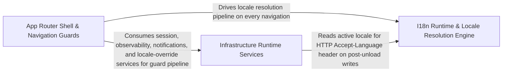

---
tags:
  - 2brain
  - 2brain/arch
  - project/boilerplate-vue-frontend
type: architecture
component: I18n_Runtime_Router_Guard
---

## Details

The core i18n runtime and its app-shell integration. Owns the vue-i18n instance lifecycle: loading bundled locale JSON files, merging module-contributed dictionaries, registering messages via setLocaleMessage, switching the active locale, ensuring the fallback locale is loaded, and keeping <html lang>/<html dir> in sync. The router guard (locale-choice) is the primary entry point that triggers locale loading on navigation; the authentication guard (authentications) restores the session before route access is enforced. The router announcer publishes the resolved page title to a visually-hidden role="status" live region and manages one-shot focus transfer to <v-main>.

### I18n Runtime & Locale Resolution Engine
The core i18n engine and its navigation-triggered locale resolution pipeline. Owns the vue-i18n instance lifecycle: discovering bundled locale JSON files at build time, extending the supported-language list from the API manifest at boot, loading per-locale dictionaries (bundled + module-contributed + API overrides), deep-merging them with correct precedence (caller messages > module dictionaries), registering via setLocaleMessage, switching the active locale, ensuring the fallback locale is loaded, and keeping <html lang>/<html dir> in sync. The localeChoice router guard is the primary entry point that triggers this pipeline on every navigation: it reads the :locale route param, checks whether the locale is already loaded, fetches and merges the dictionary if not, and activates it (with a race-guard for concurrent navigations). The routerLinkI18n helper rewrites any router location to carry the current locale. The locale-overrides fetch layer retrieves the runtime-editable half of dictionaries from the API, always resolving (never rejecting) so the offline-bundled files remain the rendering floor.

**Related Classes/Methods**:

- `src.i18n.index.changeLanguage`:391-393
- `src.i18n.index._updateLocale`:286-306
- `src.app.guards.locale-choice.localeChoice`:92-129
- `src.i18n.index._ensureFallbackLoaded`:331-348
- `src.i18n.router-link.routerLinkI18n`:41-57

**Source Files:**

- `src/app/guards/locale-choice.ts`
  - `src.app.guards.locale-choice.fetchLanguageApi` (L37-L57) - Class
  - `src.app.guards.locale-choice.then() callback` (L50-L50) - Function
  - `src.app.guards.locale-choice.fetchLanguageApi.catch() callback` (L53-L53) - Function
  - `src.app.guards.locale-choice.fetchLanguageApi.then() callback` (L55-L55) - Function
  - `src.app.guards.locale-choice.localeChoice` (L92-L129) - Class
  - `src.app.guards.locale-choice.localeChoice.then() callback.then() callback` (L113-L113) - Function
  - `src.app.guards.locale-choice.localeChoice.then() callback` (L115-L115) - Function
- `src/app/router/index.ts`
  - `src.app.router.index.localeLessRedirects.map() callback.redirect` (L122-L122) - Method
  - `src.app.router.index.routes.redirect` (L155-L160) - Method
  - `src.app.router.index.router.routes.redirect` (L212-L219) - Method
- `src/i18n/index.ts`
  - `src.i18n.index.I18nRuntimeConfig` (L26-L29) - Interface
  - `src.i18n.index.runtimeLocaleValue` (L38-L42) - Function
  - `src.i18n.index.TranslationDictionaries` (L48-L55) - Interface
  - `src.i18n.index.bundledLocales.map() callback` (L73-L74) - Function
  - `src.i18n.index.bundledLocales` (L73-L75) - Class
  - `src.i18n.index.i18n.modifiers.customSnakeCase` (L157-L157) - Method
  - `src.i18n.index._loadLocale` (L186-L206) - Function
  - `src.i18n.index._loadLocale.then() callback` (L196-L200) - Function
  - `src.i18n.index._loadLocale.then() callback.then() callback` (L198-L199) - Function
  - `src.i18n.index._loadLocale.catch() callback` (L202-L202) - Function
  - `src.i18n.index.mergeDictionaries` (L218-L224) - Class
  - `src.i18n.index.mergeDictionaries.mergeWith() callback` (L222-L223) - Function
  - `src.i18n.index.loadBundledDictionary` (L240-L253) - Function
  - `src.i18n.index.loadBundledDictionary.catch() callback` (L246-L246) - Function
  - `src.i18n.index.loadBundledDictionary.map() callback` (L247-L247) - Function
  - `src.i18n.index.loadBundledDictionary.then() callback` (L248-L252) - Function
  - `src.i18n.index.loadLocale` (L261-L263) - Function
  - `src.i18n.index._updateLocale` (L286-L306) - Function
  - `src.i18n.index._updateLocale.map() callback` (L292-L292) - Function
  - `src.i18n.index._updateLocale.then() callback` (L293-L304) - Function
  - `src.i18n.index.updateLocale` (L315-L317) - Function
  - `src.i18n.index._ensureFallbackLoaded` (L331-L348) - Function
  - `src.i18n.index._ensureFallbackLoaded.then() callback` (L342-L343) - Function
  - `src.i18n.index._ensureFallbackLoaded.catch() callback` (L346-L346) - Function
  - `src.i18n.index.applyHtmlLocaleAttributes` (L359-L363) - Function
  - `src.i18n.index._changeLanguage` (L373-L383) - Function
  - `src.i18n.index.then() callback` (L379-L379) - Function
  - `src.i18n.index._changeLanguage.then() callback` (L382-L382) - Function
  - `src.i18n.index.changeLanguage` (L391-L393) - Function
  - `src.i18n.index.getDefaultLocale` (L403-L416) - Function
- `src/i18n/router-link.ts`
  - `src.i18n.router-link.prefixLocalePath` (L24-L28) - Function
  - `src.i18n.router-link.routerLinkI18n` (L41-L57) - Function
- `src/infrastructure/locale-overrides.ts`
  - `src.infrastructure.locale-overrides.fetchRemoteLocales` (L92-L107) - Class
  - `src.infrastructure.locale-overrides.fetchRemoteLocales.then() callback` (L94-L105) - Function
  - `src.infrastructure.locale-overrides.fetchRemoteLocales.then() callback.response.data.locales.filter() callback` (L97-L99) - Function
  - `src.infrastructure.locale-overrides.fetchRemoteLocales.then() callback.map() callback` (L101-L105) - Function
  - `src.infrastructure.locale-overrides.fetchRemoteLocales.catch() callback` (L107-L107) - Function
  - `src.infrastructure.locale-overrides.fetchLocaleOverrides` (L118-L121) - Class
  - `src.infrastructure.locale-overrides.fetchLocaleOverrides.then() callback` (L120-L120) - Function
  - `src.infrastructure.locale-overrides.fetchLocaleOverrides.catch() callback` (L121-L121) - Function
  - `src.infrastructure.locale-overrides.mergeRemoteLocales` (L135-L142) - Class
  - `src.infrastructure.locale-overrides.mergeRemoteLocales.then() callback` (L136-L142) - Function
  - `src.infrastructure.locale-overrides.mergeRemoteLocales.then() callback.added` (L137-L137) - Class
  - `src.infrastructure.locale-overrides.mergeRemoteLocales.then() callback.added.discovered.filter() callback` (L137-L137) - Function
  - `src.infrastructure.locale-overrides.withLocaleOverrides` (L151-L155) - Class
  - `src.infrastructure.locale-overrides.withLocaleOverrides.then() callback` (L155-L155) - Function
  - `src.infrastructure.locale-overrides.refreshRunningLocale` (L174-L178) - Class
  - `src.infrastructure.locale-overrides.refreshRunningLocale.then() callback` (L177-L177) - Function
  - `src.infrastructure.locale-overrides.refreshRunningLocale.catch() callback` (L178-L178) - Function
- `src/modules/cart/composables/use-checkout-draft.ts`
  - `src.modules.cart.composables.use-checkout-draft.CheckoutDraft` (L11-L18) - Interface
- `src/modules/locales/composables/use-dictionary-aggregation.ts`
  - `src.modules.locales.composables.use-dictionary-aggregation.useDictionaryAggregation` (L27-L219) - Function
  - `src.modules.locales.composables.use-dictionary-aggregation.tenantKind` (L35-L37) - Class
  - `src.modules.locales.composables.use-dictionary-aggregation.hasBaseline` (L42-L45) - Class
  - `src.modules.locales.composables.use-dictionary-aggregation.languages` (L53-L55) - Class
  - `src.modules.locales.composables.use-dictionary-aggregation.tenantOptions` (L60-L62) - Class
  - `src.modules.locales.composables.use-dictionary-aggregation.allKeys` (L138-L145) - Class
  - `src.modules.locales.composables.use-dictionary-aggregation.missingByTag` (L150-L157) - Class
  - `src.modules.locales.composables.use-dictionary-aggregation.loadLanguage` (L162-L171) - Class
  - `src.modules.locales.composables.use-dictionary-aggregation.loadBoard` (L176-L179) - Class
- `src/modules/locales/schemas.ts`
  - `src.modules.locales.schemas.tag.error` (L41-L41) - Method
  - `src.modules.locales.schemas.localesLanguageSchema.tag.error` (L42-L42) - Method
  - `src.modules.locales.schemas.localesLanguageSchema.name.error` (L43-L43) - Method
  - `src.modules.locales.schemas.localesLanguageSchema.nativeName.error` (L44-L44) - Method
  - `src.modules.locales.schemas.localesEntrySchema.tenant.error` (L70-L70) - Method
  - `src.modules.locales.schemas.localesEntrySchema.key.error` (L71-L71) - Method
  - `src.modules.locales.schemas.localesEntrySchema.value.error` (L72-L72) - Method
- `src/modules/products/composables/use-active-locales.ts`
  - `src.modules.products.composables.use-active-locales.fetchActiveLocales` (L73-L88) - Class
  - `src.modules.products.composables.use-active-locales.useActiveLocales.fetchActiveLocales.then() callback.response.data.locales.filter() callback` (L77-L77) - Function

### App Router Shell & Navigation Guards
The router definition and its guard/announcer pipeline. Owns the Vue Router instance, the route table (shell child routes, locale-less redirects), the authentication guard (authentications) that restores the session token before route access is enforced, and the route announcer that publishes the resolved page title to a visually-hidden role="status" live region and manages one-shot focus transfer to <v-main> after a real page change. Also includes the stale-deploy recovery mechanism (detecting a version mismatch between the loaded bundle and the server's current build, then triggering a full reload) and the static-page utilities (FAQ, About, Privacy, Terms content) and error-message classification that the router's error views consume.

**Related Classes/Methods**:

- `src.app.router.index.router`:129-222
- `src.app.guards.authentications.tryRestoreAuth`:140-156
- `src.app.router.announcer.announceRouteChange`:31-36
- `src.app.router.stale-deploy.registerStaleDeployRecovery`:51-56

**Source Files:**

- `src/app/guards/authentications.ts`
  - `src.app.guards.authentications.'vue-router'.RouteMeta` (L56-L82) - Interface
  - `src.app.guards.authentications.restoreTokenIfNeeded` (L125-L129) - Class
  - `src.app.guards.authentications.restoreTokenIfNeeded.catch() callback` (L128-L128) - Function
  - `src.app.guards.authentications.tryRestoreAuth` (L140-L156) - Class
  - `src.app.guards.authentications.then() callback` (L144-L151) - Function
  - `src.app.guards.authentications.tryRestoreAuth.then() callback` (L153-L153) - Function
  - `src.app.guards.authentications.tryRestoreAuth.catch() callback` (L154-L154) - Function
- `src/app/router/announcer.ts`
  - `src.app.router.announcer.announceRouteChange` (L31-L36) - Class
  - `src.app.router.announcer.announceRouteChange.nextTick() callback` (L33-L35) - Function
- `src/app/router/index.ts`
  - `src.app.router.index.shellChildRoutes` (L44-L90) - Class
  - `src.app.router.index.shellChildRoutes.component` (L87-L87) - Method
  - `src.app.router.index.localeLessRedirects` (L114-L123) - Class
  - `src.app.router.index.map() callback` (L117-L117) - Function
  - `src.app.router.index.localeLessRedirects.filter() callback` (L118-L118) - Function
  - `src.app.router.index.localeLessRedirects.map() callback` (L120-L123) - Function
  - `src.app.router.index.router` (L129-L222) - Class
  - `src.app.router.index.router.scrollBehavior` (L145-L151) - Method
  - `src.app.router.index.router.routes.children.component` (L189-L189) - Method
  - `src.app.router.index.router.routes.children.children.redirect` (L196-L203) - Method
  - `src.app.router.index.router.onError() callback` (L248-L302) - Function
  - `src.app.router.index.router.onError() callback.recoverFromStaleDeploy() callback` (L261-L261) - Function
  - `src.app.router.index.router.beforeEach() callback` (L317-L322) - Function
  - `src.app.router.index.router.beforeEach() callback.then() callback` (L321-L321) - Function
  - `src.app.router.index.router.afterEach() callback` (L350-L365) - Function
- `src/app/router/stale-deploy.ts`
  - `src.app.router.stale-deploy.PreloadErrorSource` (L33-L38) - Interface
  - `src.app.router.stale-deploy.registerStaleDeployRecovery` (L51-L56) - Class
  - `src.app.router.stale-deploy.registerStaleDeployRecovery.target.addEventListener('vite:preloadError') callback` (L52-L55) - Function
- `src/app/utils/error-messages.ts`
  - `src.app.utils.error-messages.isKnownErrorMessage` (L28-L29) - Class
  - `src.app.utils.error-messages.isKnownErrorMessage.KNOWN_ERROR_MESSAGE_PREFIXES.some() callback` (L29-L29) - Function
- `src/app/utils/static-pages.ts`
  - `src.app.utils.static-pages.staticPageParagraphs` (L37-L44) - Class
  - `src.app.utils.static-pages.staticPageParagraphs.messages.map() callback` (L43-L43) - Function

### Infrastructure Runtime Services
The cross-cutting runtime primitives that the i18n and router layers depend on. Provides the runtime configuration resolver (runtimeValue) that reads deployment-specific values (locale defaults, tenant IDs) from the server-injected config with build-time env fallbacks. Owns the SSE client factory (contract-validated server-sent-events connection for realtime updates), the HTTP keepalive mechanism (periodic pings to prevent proxy timeouts on long-lived sessions), and the image upload utility (Zod-validated multipart upload with contract conformance checks). These services are the plumbing that makes the i18n runtime's runtimeLocaleValue calls, the router's stale-deploy detection, and the app's realtime/long-polling features functional.

**Related Classes/Methods**:

- `src.infrastructure.runtime-config.runtimeValue`:45-49
- `src.infrastructure.http.keepalive.sendKeepalive`:22-43
- `src.infrastructure.utils.uploads.imageUploadSchema`:83-89

**Source Files:**

- `src/infrastructure/create-sse-client.ts`
  - `src.infrastructure.create-sse-client.passesContract.issues` (L95-L97) - Class
  - `src.infrastructure.create-sse-client.passesContract.issues.result.error.issues.map() callback` (L96-L96) - Function
- `src/infrastructure/http/keepalive.ts`
  - `src.infrastructure.http.keepalive.sendKeepalive` (L22-L43) - Class
  - `src.infrastructure.http.keepalive.sendKeepalive.catch() callback` (L42-L42) - Function
- `src/infrastructure/runtime-config.ts`
  - `src.infrastructure.runtime-config.RuntimeConfig` (L14-L34) - Interface
  - `src.infrastructure.runtime-config.runtimeValue` (L45-L49) - Function
- `src/infrastructure/utils/logger.ts`
  - `src.infrastructure.utils.logger.LogScopes` (L47-L51) - Interface
  - `src.infrastructure.utils.logger.resolveScopes` (L78-L89) - Class
  - `src.infrastructure.utils.logger.resolveScopes.map() callback` (L86-L86) - Function
- `src/infrastructure/utils/uploads.ts`
  - `src.infrastructure.utils.uploads.imageUploadSchema` (L83-L89) - Class
  - `src.infrastructure.utils.uploads.error` (L84-L84) - Method
  - `src.infrastructure.utils.uploads.imageUploadSchema.error` (L87-L87) - Method
