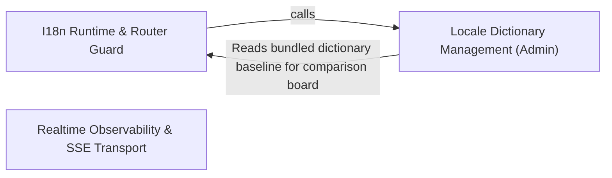

---
tags:
  - 2brain
  - 2brain/arch
  - project/boilerplate-vue-frontend
type: architecture
component: Internationalization
---

## Details

Locale management and i18n runtime (dictionary loading, language switching, HTML locale attributes), with the app-shell router guards (authentication, locale choice) and the router announcer as its secondary concern.

### I18n Runtime & Router Guard [[Expand]](./I18n_Runtime_Router_Guard.md)
The core i18n runtime and its app-shell integration. Owns the vue-i18n instance lifecycle: loading bundled locale JSON files, merging module-contributed dictionaries, registering messages via setLocaleMessage, switching the active locale, ensuring the fallback locale is loaded, and keeping <html lang>/<html dir> in sync. The router guard (locale-choice) is the primary entry point that triggers locale loading on navigation; the authentication guard (authentications) restores the session before route access is enforced. The router announcer publishes the resolved page title to a visually-hidden role="status" live region and manages one-shot focus transfer to <v-main>.

**Related Classes/Methods**:

- `src.i18n.index.changeLanguage`:391-393
- `src.i18n.index._updateLocale`:286-306
- `src.i18n.index.loadBundledDictionary`:240-253
- `src.app.guards.locale-choice.localeChoice`:92-129
- `src.app.router.announcer.announceRouteChange`:31-36

**Source Files:**

- `src/app/guards/authentications.ts`
  - `src.app.guards.authentications.'vue-router'.RouteMeta` (L56-L82) - Interface
  - `src.app.guards.authentications.restoreTokenIfNeeded` (L125-L129) - Class
  - `src.app.guards.authentications.restoreTokenIfNeeded.catch() callback` (L128-L128) - Function
  - `src.app.guards.authentications.tryRestoreAuth` (L140-L156) - Class
  - `src.app.guards.authentications.then() callback` (L144-L151) - Function
  - `src.app.guards.authentications.tryRestoreAuth.then() callback` (L153-L153) - Function
  - `src.app.guards.authentications.tryRestoreAuth.catch() callback` (L154-L154) - Function
- `src/app/guards/locale-choice.ts`
  - `src.app.guards.locale-choice.fetchLanguageApi` (L37-L57) - Class
  - `src.app.guards.locale-choice.then() callback` (L50-L50) - Function
  - `src.app.guards.locale-choice.fetchLanguageApi.catch() callback` (L53-L53) - Function
  - `src.app.guards.locale-choice.fetchLanguageApi.then() callback` (L55-L55) - Function
  - `src.app.guards.locale-choice.localeChoice` (L92-L129) - Class
  - `src.app.guards.locale-choice.localeChoice.then() callback.then() callback` (L113-L113) - Function
  - `src.app.guards.locale-choice.localeChoice.then() callback` (L115-L115) - Function
- `src/app/router/announcer.ts`
  - `src.app.router.announcer.announceRouteChange` (L31-L36) - Class
  - `src.app.router.announcer.announceRouteChange.nextTick() callback` (L33-L35) - Function
- `src/app/router/index.ts`
  - `src.app.router.index.shellChildRoutes` (L44-L90) - Class
  - `src.app.router.index.shellChildRoutes.component` (L87-L87) - Method
  - `src.app.router.index.localeLessRedirects` (L114-L123) - Class
  - `src.app.router.index.map() callback` (L117-L117) - Function
  - `src.app.router.index.localeLessRedirects.filter() callback` (L118-L118) - Function
  - `src.app.router.index.localeLessRedirects.map() callback` (L120-L123) - Function
  - `src.app.router.index.localeLessRedirects.map() callback.redirect` (L122-L122) - Method
  - `src.app.router.index.router` (L129-L222) - Class
  - `src.app.router.index.router.scrollBehavior` (L145-L151) - Method
  - `src.app.router.index.routes.redirect` (L155-L160) - Method
  - `src.app.router.index.router.routes.children.component` (L189-L189) - Method
  - `src.app.router.index.router.routes.children.children.redirect` (L196-L203) - Method
  - `src.app.router.index.router.routes.redirect` (L212-L219) - Method
  - `src.app.router.index.router.onError() callback` (L248-L302) - Function
  - `src.app.router.index.router.onError() callback.recoverFromStaleDeploy() callback` (L261-L261) - Function
  - `src.app.router.index.router.beforeEach() callback` (L317-L322) - Function
  - `src.app.router.index.router.beforeEach() callback.then() callback` (L321-L321) - Function
  - `src.app.router.index.router.afterEach() callback` (L350-L365) - Function
- `src/app/router/stale-deploy.ts`
  - `src.app.router.stale-deploy.PreloadErrorSource` (L33-L38) - Interface
  - `src.app.router.stale-deploy.registerStaleDeployRecovery` (L51-L56) - Class
  - `src.app.router.stale-deploy.registerStaleDeployRecovery.target.addEventListener('vite:preloadError') callback` (L52-L55) - Function
- `src/app/utils/error-messages.ts`
  - `src.app.utils.error-messages.isKnownErrorMessage` (L28-L29) - Class
  - `src.app.utils.error-messages.isKnownErrorMessage.KNOWN_ERROR_MESSAGE_PREFIXES.some() callback` (L29-L29) - Function
- `src/app/utils/static-pages.ts`
  - `src.app.utils.static-pages.staticPageParagraphs` (L37-L44) - Class
  - `src.app.utils.static-pages.staticPageParagraphs.messages.map() callback` (L43-L43) - Function
- `src/i18n/index.ts`
  - `src.i18n.index.I18nRuntimeConfig` (L26-L29) - Interface
  - `src.i18n.index.runtimeLocaleValue` (L38-L42) - Function
  - `src.i18n.index.TranslationDictionaries` (L48-L55) - Interface
  - `src.i18n.index.bundledLocales.map() callback` (L73-L74) - Function
  - `src.i18n.index.bundledLocales` (L73-L75) - Class
  - `src.i18n.index.i18n.modifiers.customSnakeCase` (L157-L157) - Method
  - `src.i18n.index._loadLocale` (L186-L206) - Function
  - `src.i18n.index._loadLocale.then() callback` (L196-L200) - Function
  - `src.i18n.index._loadLocale.then() callback.then() callback` (L198-L199) - Function
  - `src.i18n.index._loadLocale.catch() callback` (L202-L202) - Function
  - `src.i18n.index.mergeDictionaries` (L218-L224) - Class
  - `src.i18n.index.mergeDictionaries.mergeWith() callback` (L222-L223) - Function
  - `src.i18n.index.loadBundledDictionary` (L240-L253) - Function
  - `src.i18n.index.loadBundledDictionary.catch() callback` (L246-L246) - Function
  - `src.i18n.index.loadBundledDictionary.map() callback` (L247-L247) - Function
  - `src.i18n.index.loadBundledDictionary.then() callback` (L248-L252) - Function
  - `src.i18n.index.loadLocale` (L261-L263) - Function
  - `src.i18n.index._updateLocale` (L286-L306) - Function
  - `src.i18n.index._updateLocale.map() callback` (L292-L292) - Function
  - `src.i18n.index._updateLocale.then() callback` (L293-L304) - Function
  - `src.i18n.index.updateLocale` (L315-L317) - Function
  - `src.i18n.index._ensureFallbackLoaded` (L331-L348) - Function
  - `src.i18n.index._ensureFallbackLoaded.then() callback` (L342-L343) - Function
  - `src.i18n.index._ensureFallbackLoaded.catch() callback` (L346-L346) - Function
  - `src.i18n.index.applyHtmlLocaleAttributes` (L359-L363) - Function
  - `src.i18n.index._changeLanguage` (L373-L383) - Function
  - `src.i18n.index.then() callback` (L379-L379) - Function
  - `src.i18n.index._changeLanguage.then() callback` (L382-L382) - Function
  - `src.i18n.index.changeLanguage` (L391-L393) - Function
  - `src.i18n.index.getDefaultLocale` (L403-L416) - Function
- `src/i18n/router-link.ts`
  - `src.i18n.router-link.prefixLocalePath` (L24-L28) - Function
  - `src.i18n.router-link.routerLinkI18n` (L41-L57) - Function
- `src/infrastructure/create-sse-client.ts`
  - `src.infrastructure.create-sse-client.passesContract.issues` (L95-L97) - Class
  - `src.infrastructure.create-sse-client.passesContract.issues.result.error.issues.map() callback` (L96-L96) - Function
- `src/infrastructure/http/keepalive.ts`
  - `src.infrastructure.http.keepalive.sendKeepalive` (L22-L43) - Class
  - `src.infrastructure.http.keepalive.sendKeepalive.catch() callback` (L42-L42) - Function
- `src/infrastructure/locale-overrides.ts`
  - `src.infrastructure.locale-overrides.fetchRemoteLocales` (L92-L107) - Class
  - `src.infrastructure.locale-overrides.fetchRemoteLocales.then() callback` (L94-L105) - Function
  - `src.infrastructure.locale-overrides.fetchRemoteLocales.then() callback.response.data.locales.filter() callback` (L97-L99) - Function
  - `src.infrastructure.locale-overrides.fetchRemoteLocales.then() callback.map() callback` (L101-L105) - Function
  - `src.infrastructure.locale-overrides.fetchRemoteLocales.catch() callback` (L107-L107) - Function
  - `src.infrastructure.locale-overrides.fetchLocaleOverrides` (L118-L121) - Class
  - `src.infrastructure.locale-overrides.fetchLocaleOverrides.then() callback` (L120-L120) - Function
  - `src.infrastructure.locale-overrides.fetchLocaleOverrides.catch() callback` (L121-L121) - Function
  - `src.infrastructure.locale-overrides.mergeRemoteLocales` (L135-L142) - Class
  - `src.infrastructure.locale-overrides.mergeRemoteLocales.then() callback` (L136-L142) - Function
  - `src.infrastructure.locale-overrides.mergeRemoteLocales.then() callback.added` (L137-L137) - Class
  - `src.infrastructure.locale-overrides.mergeRemoteLocales.then() callback.added.discovered.filter() callback` (L137-L137) - Function
  - `src.infrastructure.locale-overrides.withLocaleOverrides` (L151-L155) - Class
  - `src.infrastructure.locale-overrides.withLocaleOverrides.then() callback` (L155-L155) - Function
  - `src.infrastructure.locale-overrides.refreshRunningLocale` (L174-L178) - Class
  - `src.infrastructure.locale-overrides.refreshRunningLocale.then() callback` (L177-L177) - Function
  - `src.infrastructure.locale-overrides.refreshRunningLocale.catch() callback` (L178-L178) - Function
- `src/infrastructure/runtime-config.ts`
  - `src.infrastructure.runtime-config.RuntimeConfig` (L14-L34) - Interface
  - `src.infrastructure.runtime-config.runtimeValue` (L45-L49) - Function
- `src/infrastructure/utils/logger.ts`
  - `src.infrastructure.utils.logger.LogScopes` (L47-L51) - Interface
  - `src.infrastructure.utils.logger.resolveScopes` (L78-L89) - Class
  - `src.infrastructure.utils.logger.resolveScopes.map() callback` (L86-L86) - Function
- `src/infrastructure/utils/uploads.ts`
  - `src.infrastructure.utils.uploads.imageUploadSchema` (L83-L89) - Class
  - `src.infrastructure.utils.uploads.error` (L84-L84) - Method
  - `src.infrastructure.utils.uploads.imageUploadSchema.error` (L87-L87) - Method
- `src/modules/cart/composables/use-checkout-draft.ts`
  - `src.modules.cart.composables.use-checkout-draft.CheckoutDraft` (L11-L18) - Interface
- `src/modules/locales/composables/use-dictionary-aggregation.ts`
  - `src.modules.locales.composables.use-dictionary-aggregation.useDictionaryAggregation` (L27-L219) - Function
  - `src.modules.locales.composables.use-dictionary-aggregation.tenantKind` (L35-L37) - Class
  - `src.modules.locales.composables.use-dictionary-aggregation.hasBaseline` (L42-L45) - Class
  - `src.modules.locales.composables.use-dictionary-aggregation.languages` (L53-L55) - Class
  - `src.modules.locales.composables.use-dictionary-aggregation.tenantOptions` (L60-L62) - Class
  - `src.modules.locales.composables.use-dictionary-aggregation.allKeys` (L138-L145) - Class
  - `src.modules.locales.composables.use-dictionary-aggregation.missingByTag` (L150-L157) - Class
  - `src.modules.locales.composables.use-dictionary-aggregation.loadLanguage` (L162-L171) - Class
  - `src.modules.locales.composables.use-dictionary-aggregation.loadBoard` (L176-L179) - Class
- `src/modules/locales/schemas.ts`
  - `src.modules.locales.schemas.tag.error` (L41-L41) - Method
  - `src.modules.locales.schemas.localesLanguageSchema.tag.error` (L42-L42) - Method
  - `src.modules.locales.schemas.localesLanguageSchema.name.error` (L43-L43) - Method
  - `src.modules.locales.schemas.localesLanguageSchema.nativeName.error` (L44-L44) - Method
  - `src.modules.locales.schemas.localesEntrySchema.tenant.error` (L70-L70) - Method
  - `src.modules.locales.schemas.localesEntrySchema.key.error` (L71-L71) - Method
  - `src.modules.locales.schemas.localesEntrySchema.value.error` (L72-L72) - Method
- `src/modules/products/composables/use-active-locales.ts`
  - `src.modules.products.composables.use-active-locales.fetchActiveLocales` (L73-L88) - Class
  - `src.modules.products.composables.use-active-locales.useActiveLocales.fetchActiveLocales.then() callback.response.data.locales.filter() callback` (L77-L77) - Function

### Locale Dictionary Management (Admin)
The translation-admin surface: a Pinia store that manages locale capabilities (the merged manifest of bundled + dynamic tiers) and one language's flat dotted-key entries (paginated CRUD via the generated API client). The pure dictionary-conversion utilities (flattenDictionary, expandEntries, foldNumericNodes) bridge the API's flat-row shape and the nested shape vue-i18n consumes, enabling round-trip import/export of bundled locale files. The store fetches both the API's deployed dictionary and the frontend's bundled dictionary for side-by-side comparison in the translation board. Schemas from the users, webhooks, and observability modules are co-located here because they define the Zod validation contracts that the locales admin's entry editor and the broader admin forms depend on.

**Related Classes/Methods**:

- `src.modules.locales.store.useLocalesStore`:112-451
- `src.modules.locales.dictionaries.flattenDictionary`:31-39
- `src.modules.locales.store.fetchApiDictionary`:72-81
- `src.modules.locales.store.fetchBundledDictionary`:90-93

**Source Files:**

- `src/modules/api-keys/store.ts`
  - `src.modules.api-keys.store.defineStore('api-keys') callback.mintCredential` (L70-L77) - Class
  - `src.modules.api-keys.store.defineStore('api-keys') callback.revokeCredential` (L91-L94) - Class
- `src/modules/cart/composables/use-line-quantity.ts`
  - `src.modules.cart.composables.use-line-quantity.useLineQuantity.senderFor.send.debounce() callback.request` (L92-L111) - Class
  - `src.modules.cart.composables.use-line-quantity.useLineQuantity.senderFor.send.debounce() callback.request.then() callback` (L95-L95) - Function
  - `src.modules.cart.composables.use-line-quantity.useLineQuantity.senderFor.send.debounce() callback.request.catch() callback` (L96-L99) - Function
  - `src.modules.cart.composables.use-line-quantity.useLineQuantity.senderFor.send.debounce() callback.request.finally() callback` (L100-L111) - Function
- `src/modules/locales/dictionaries.ts`
  - `src.modules.locales.dictionaries.flattenDictionary` (L31-L39) - Class
  - `src.modules.locales.dictionaries.flattenDictionary.flatMap() callback` (L35-L39) - Function
  - `src.modules.locales.dictionaries.foldNumericNodes` (L95-L111) - Class
  - `src.modules.locales.dictionaries.foldNumericNodes.folded` (L99-L104) - Class
  - `src.modules.locales.dictionaries.foldNumericNodes.folded.map() callback` (L100-L103) - Function
  - `src.modules.locales.dictionaries.foldNumericNodes.keys.every() callback` (L106-L106) - Function
  - `src.modules.locales.dictionaries.foldNumericNodes.keys.toSorted() callback` (L108-L108) - Function
  - `src.modules.locales.dictionaries.foldNumericNodes.map() callback` (L109-L109) - Function
- `src/modules/locales/store.ts`
  - `src.modules.locales.store.LocaleEntriesFilters` (L52-L56) - Interface
  - `src.modules.locales.store.fetchApiDictionary` (L72-L81) - Class
  - `src.modules.locales.store.fetchApiDictionary.then() callback` (L74-L79) - Function
  - `src.modules.locales.store.fetchApiDictionary.then() callback.map() callback` (L77-L77) - Function
  - `src.modules.locales.store.fetchApiDictionary.catch() callback` (L81-L81) - Function
  - `src.modules.locales.store.fetchBundledDictionary` (L90-L93) - Class
  - `src.modules.locales.store.fetchBundledDictionary.then() callback` (L91-L92) - Function
  - `src.modules.locales.store.fetchBundledDictionary.then() callback.map() callback` (L92-L92) - Function
  - `src.modules.locales.store.useLocalesStore` (L112-L451) - Class
  - `src.modules.locales.store.useLocalesStore.defineStore('locales') callback` (L112-L451) - Function
  - `src.modules.locales.store.useLocalesStore.defineStore('locales') callback.backendTenant.computed() callback` (L184-L184) - Function
  - `src.modules.locales.store.useLocalesStore.defineStore('locales') callback.backendTenant.computed() callback.tenants.value.find() callback` (L184-L184) - Function
  - `src.modules.locales.store.useLocalesStore.defineStore('locales') callback.tenantLabel.tenants.value.find() callback` (L195-L195) - Function
  - `src.modules.locales.store.useLocalesStore.defineStore('locales') callback.fetchTenants.fetchAny() callback` (L203-L207) - Function
  - `src.modules.locales.store.useLocalesStore.defineStore('locales') callback.fetchTenants.fetchAny() callback.then() callback` (L204-L207) - Function
  - `src.modules.locales.store.useLocalesStore.defineStore('locales') callback.fetchLanguages.fetchAny() callback` (L226-L232) - Function
  - `src.modules.locales.store.useLocalesStore.defineStore('locales') callback.fetchLanguages.fetchAny() callback.then() callback` (L227-L232) - Function
  - `src.modules.locales.store.useLocalesStore.defineStore('locales') callback.createLanguage.fetchAny() callback` (L242-L243) - Function
  - `src.modules.locales.store.useLocalesStore.defineStore('locales') callback.createLanguage.fetchAny() callback.then() callback.then() callback` (L243-L243) - Function
  - `src.modules.locales.store.useLocalesStore.defineStore('locales') callback.editLanguage.fetchAny() callback` (L256-L259) - Function
  - `src.modules.locales.store.useLocalesStore.defineStore('locales') callback.editLanguage.fetchAny() callback.then() callback` (L257-L258) - Function
  - `src.modules.locales.store.useLocalesStore.defineStore('locales') callback.editLanguage.fetchAny() callback.then() callback.then() callback` (L258-L258) - Function
  - `src.modules.locales.store.useLocalesStore.defineStore('locales') callback.removeLanguage.fetchAny() callback` (L272-L275) - Function
  - `src.modules.locales.store.useLocalesStore.defineStore('locales') callback.removeLanguage.fetchAny() callback.then() callback` (L275-L275) - Function
  - `src.modules.locales.store.useLocalesStore.defineStore('locales') callback.addEntry.fetchAny() callback` (L290-L296) - Function
  - `src.modules.locales.store.useLocalesStore.defineStore('locales') callback.addEntry.fetchAny() callback.then() callback` (L291-L296) - Function
  - `src.modules.locales.store.useLocalesStore.defineStore('locales') callback.editEntry.fetchAny() callback` (L308-L312) - Function
  - `src.modules.locales.store.useLocalesStore.defineStore('locales') callback.editEntry.fetchAny() callback.then() callback` (L309-L312) - Function
  - `src.modules.locales.store.useLocalesStore.defineStore('locales') callback.removeEntry.deleteTarget() callback` (L323-L323) - Function
  - `src.modules.locales.store.useLocalesStore.defineStore('locales') callback.importEntries.fetchAny() callback` (L344-L352) - Function
  - `src.modules.locales.store.useLocalesStore.defineStore('locales') callback.importEntries.fetchAny() callback.then() callback` (L348-L352) - Function
  - `src.modules.locales.store.useLocalesStore.defineStore('locales') callback.fetchAllEntries.fetchAny() callback` (L368-L377) - Function
  - `src.modules.locales.store.useLocalesStore.defineStore('locales') callback.fetchAllEntries.fetchAny() callback.collect` (L370-L375) - Class
  - `src.modules.locales.store.useLocalesStore.defineStore('locales') callback.fetchAllEntries.fetchAny() callback.collect.then() callback` (L371-L375) - Function
  - `src.modules.locales.store.useLocalesStore.defineStore('locales') callback.fetchEntityTranslations.fetchAny() callback` (L395-L396) - Function
  - `src.modules.locales.store.useLocalesStore.defineStore('locales') callback.fetchEntityTranslations.fetchAny() callback.then() callback` (L396-L396) - Function
  - `src.modules.locales.store.useLocalesStore.defineStore('locales') callback.saveEntityTranslations.fetchAny() callback` (L414-L417) - Function
  - `src.modules.locales.store.useLocalesStore.defineStore('locales') callback.saveEntityTranslations.fetchAny() callback.then() callback` (L416-L416) - Function
- `src/modules/observability/composables/use-admin-observability.ts`
  - `src.modules.observability.composables.use-admin-observability.UseAdminObservabilityReturn` (L20-L65) - Interface
  - `src.modules.observability.composables.use-admin-observability.fetchHealth` (L112-L112) - Class
  - `src.modules.observability.composables.use-admin-observability.fetchMetrics` (L117-L117) - Class
  - `src.modules.observability.composables.use-admin-observability.fetchAll` (L124-L124) - Class
  - `src.modules.observability.composables.use-admin-observability.clearExpiredTokens` (L147-L154) - Class
- `src/modules/observability/store.ts`
  - `src.modules.observability.store.useRealtimeObservabilityStore` (L16-L117) - Class
  - `src.modules.observability.store.useRealtimeObservabilityStore.defineStore('realtime-observability') callback` (L16-L117) - Function
- `src/modules/users/schemas.ts`
  - `src.modules.users.schemas.usersEmailSchema` (L13-L13) - Class
  - `src.modules.users.schemas.usersEmailSchema.error` (L13-L13) - Method
  - `src.modules.users.schemas.usersUsernameSchema` (L18-L20) - Class
  - `src.modules.users.schemas.usersUsernameSchema.error` (L20-L20) - Method
  - `src.modules.users.schemas.usersPasswordSchema` (L26-L40) - Class
  - `src.modules.users.schemas.refine() callback` (L29-L29) - Function
  - `src.modules.users.schemas.usersPasswordSchema.refine() callback` (L38-L38) - Function
  - `src.modules.users.schemas.usersPasswordSchema.error` (L39-L39) - Method
- `src/modules/webhooks/schemas.ts`
  - `src.modules.webhooks.schemas.webhookUrlSchema` (L21-L25) - Class
  - `src.modules.webhooks.schemas.webhookUrlSchema.error` (L24-L24) - Method
  - `src.modules.webhooks.schemas.webhookEventTypesSchema` (L31-L33) - Class
  - `src.modules.webhooks.schemas.webhookEventTypesSchema.error` (L33-L33) - Method
- `src/modules/webhooks/store.ts`
  - `src.modules.webhooks.store.defineStore('webhooks') callback.watchSubscription` (L125-L133) - Class
  - `src.modules.webhooks.store.defineStore('webhooks') callback.createSubscription` (L152-L159) - Class
  - `src.modules.webhooks.store.defineStore('webhooks') callback.rotateSecret` (L172-L179) - Class
  - `src.modules.webhooks.store.defineStore('webhooks') callback.removeSecret` (L191-L197) - Class
  - `src.modules.webhooks.store.defineStore('webhooks') callback.replayDelivery` (L242-L243) - Class
  - `src.modules.webhooks.store.defineStore('webhooks') callback.eventCatalogue` (L262-L262) - Class
  - `src.modules.webhooks.store.defineStore('webhooks') callback.fetchEventCatalogue` (L267-L267) - Class

### Realtime Observability & SSE Transport [[Expand]](./Realtime_Observability_SSE_Transport.md)
The SSE (Server-Sent Events) client infrastructure and the admin-facing observability module that consumes it. The SSE client (createSseClient) is a reusable, callback-based transport that opens an EventSource, handles reconnection, and dispatches typed events to registered callbacks. The observability module's store (useRealtimeObservabilityStore) and composable (useRealtimeObservability) subscribe to the SSE stream to render live KPI cards, audit-trail entries, and realtime metrics on the admin dashboard. The API-keys module (schemas + store) and the demo store are co-located because they share the same admin-facing, non-visitor audience and the same SSE-driven refresh pattern.

**Related Classes/Methods**:

- `src.infrastructure.create-sse-client.createSseClient`:117-146
- `src.infrastructure.create-sse-client.SseClientCallbacks`:17-34
- `src.modules.observability.types.RealtimeMetricsEntry`:54-71
- `src.modules.api-keys.store.useApiKeysStore`:23-112

**Source Files:**

- `src/infrastructure/create-sse-client.ts`
  - `src.infrastructure.create-sse-client.SseClientCallbacks` (L17-L34) - Interface
  - `src.infrastructure.create-sse-client.SseClient` (L39-L41) - Interface
  - `src.infrastructure.create-sse-client.createSseClient` (L117-L146) - Class
  - `src.infrastructure.create-sse-client.createSseClient.eventSource.addEventListener('open') callback` (L124-L124) - Function
  - `src.infrastructure.create-sse-client.createSseClient.eventSource.addEventListener('error') callback` (L125-L125) - Function
  - `src.infrastructure.create-sse-client.createSseClient.eventSource.addEventListener() callback` (L129-L137) - Function
  - `src.infrastructure.create-sse-client.createSseClient.close` (L144-L144) - Method
- `src/modules/api-keys/schemas.ts`
  - `src.modules.api-keys.schemas.apiKeyNameSchema` (L15-L18) - Class
  - `src.modules.api-keys.schemas.apiKeyNameSchema.error` (L18-L18) - Method
  - `src.modules.api-keys.schemas.apiKeyPermissionsSchema` (L24-L26) - Class
  - `src.modules.api-keys.schemas.apiKeyPermissionsSchema.error` (L26-L26) - Method
  - `src.modules.api-keys.schemas.apiKeyExpiresAtSchema` (L33-L38) - Class
  - `src.modules.api-keys.schemas.apiKeyExpiresAtSchema.refine() callback` (L36-L36) - Function
  - `src.modules.api-keys.schemas.apiKeyExpiresAtSchema.error` (L37-L37) - Method
- `src/modules/api-keys/store.ts`
  - `src.modules.api-keys.store.useApiKeysStore` (L23-L112) - Class
  - `src.modules.api-keys.store.useApiKeysStore.defineStore('api-keys') callback` (L23-L112) - Function
  - `src.modules.api-keys.store.useApiKeysStore.defineStore('api-keys') callback.mintCredential.fetchAny() callback` (L71-L76) - Function
  - `src.modules.api-keys.store.useApiKeysStore.defineStore('api-keys') callback.mintCredential.fetchAny() callback.then() callback` (L72-L76) - Function
  - `src.modules.api-keys.store.useApiKeysStore.defineStore('api-keys') callback.revokeCredential.fetchAny() callback` (L92-L92) - Function
  - `src.modules.api-keys.store.useApiKeysStore.defineStore('api-keys') callback.revokeCredential.then() callback` (L92-L94) - Function
- `src/modules/cart/composables/use-line-quantity.ts`
  - `src.modules.cart.composables.use-line-quantity.useLineQuantity.senderFor.send` (L89-L113) - Class
  - `src.modules.cart.composables.use-line-quantity.useLineQuantity.senderFor.send.debounce() callback` (L89-L113) - Function
  - `src.modules.cart.composables.use-line-quantity.settle` (L198-L204) - Class
  - `src.modules.cart.composables.use-line-quantity.useLineQuantity.settle.then() callback` (L200-L203) - Function
  - `src.modules.cart.composables.use-line-quantity.useLineQuantity.settle.then() callback.results.some() callback` (L201-L201) - Function
- `src/modules/demo/store.ts`
  - `src.modules.demo.store.useDemoStore` (L13-L51) - Class
  - `src.modules.demo.store.useDemoStore.defineStore('counter') callback` (L13-L51) - Function
  - `src.modules.demo.store.defineStore('counter') callback.doubleCount` (L22-L22) - Class
  - `src.modules.demo.store.useDemoStore.defineStore('counter') callback.doubleCount.computed() callback` (L22-L22) - Function
  - `src.modules.demo.store.defineStore('counter') callback.increment` (L27-L29) - Function
  - `src.modules.demo.store.defineStore('counter') callback.incrementDelayed` (L36-L43) - Function
  - `src.modules.demo.store.useDemoStore.defineStore('counter') callback.incrementDelayed.<function>` (L37-L42) - Function
  - `src.modules.demo.store.useDemoStore.defineStore('counter') callback.incrementDelayed.<function>.setTimeout() callback` (L38-L41) - Function
- `src/modules/locales/store.ts`
  - `src.modules.locales.store.defineStore('locales') callback.backendTenant` (L183-L185) - Class
  - `src.modules.locales.store.defineStore('locales') callback.tenantLabel` (L194-L195) - Class
  - `src.modules.locales.store.defineStore('locales') callback.fetchTenants` (L202-L208) - Class
  - `src.modules.locales.store.defineStore('locales') callback.fetchLanguages` (L225-L233) - Class
  - `src.modules.locales.store.defineStore('locales') callback.createLanguage` (L241-L244) - Class
  - `src.modules.locales.store.defineStore('locales') callback.editLanguage` (L255-L260) - Class
  - `src.modules.locales.store.defineStore('locales') callback.removeLanguage` (L271-L276) - Class
  - `src.modules.locales.store.defineStore('locales') callback.removeLanguage.fetchAny() callback.then() callback` (L274-L274) - Function
  - `src.modules.locales.store.defineStore('locales') callback.addEntry` (L289-L297) - Class
  - `src.modules.locales.store.defineStore('locales') callback.editEntry` (L307-L313) - Class
  - `src.modules.locales.store.defineStore('locales') callback.removeEntry` (L322-L323) - Class
  - `src.modules.locales.store.defineStore('locales') callback.importEntries` (L338-L353) - Class
  - `src.modules.locales.store.defineStore('locales') callback.fetchAllEntries` (L367-L377) - Class
  - `src.modules.locales.store.defineStore('locales') callback.fetchEntityTranslations` (L391-L397) - Class
  - `src.modules.locales.store.defineStore('locales') callback.saveEntityTranslations` (L409-L418) - Class
- `src/modules/observability/composables/use-admin-observability.ts`
  - `src.modules.observability.composables.use-admin-observability.useAdminObservability.fetchHealth.then() callback` (L112-L112) - Function
  - `src.modules.observability.composables.use-admin-observability.useAdminObservability.fetchMetrics.then() callback` (L117-L117) - Function
  - `src.modules.observability.composables.use-admin-observability.useAdminObservability.fetchAll.then() callback` (L124-L124) - Function
  - `src.modules.observability.composables.use-admin-observability.useAdminObservability.clearExpiredTokens.then() callback` (L150-L150) - Function
  - `src.modules.observability.composables.use-admin-observability.useAdminObservability.clearExpiredTokens.finally() callback` (L151-L153) - Function
- `src/modules/observability/composables/use-audit-trail.ts`
  - `src.modules.observability.composables.use-audit-trail.UseAuditTrailReturn` (L33-L46) - Interface
  - `src.modules.observability.composables.use-audit-trail.entries` (L91-L91) - Class
  - `src.modules.observability.composables.use-audit-trail.useAuditTrail.entries.computed() callback` (L91-L91) - Function
  - `src.modules.observability.composables.use-audit-trail.total` (L96-L96) - Class
  - `src.modules.observability.composables.use-audit-trail.useAuditTrail.total.computed() callback` (L96-L96) - Function
  - `src.modules.observability.composables.use-audit-trail.pages` (L101-L101) - Class
  - `src.modules.observability.composables.use-audit-trail.useAuditTrail.pages.computed() callback` (L101-L101) - Function
  - `src.modules.observability.composables.use-audit-trail.fetchPage` (L110-L110) - Class
  - `src.modules.observability.composables.use-audit-trail.useAuditTrail.fetchPage.then() callback` (L110-L110) - Function
- `src/modules/observability/types.ts`
  - `src.modules.observability.types.AdminKpiCard` (L21-L30) - Interface
  - `src.modules.observability.types.AdminAuditFilters` (L35-L48) - Interface
  - `src.modules.observability.types.RealtimeMetricsEntry` (L54-L71) - Interface
- `src/modules/observability/use-realtime-observability.ts`
  - `src.modules.observability.use-realtime-observability.connect` (L65-L108) - Class
  - `src.modules.observability.use-realtime-observability.useRealtimeObservability.connect.onOpen` (L71-L71) - Method
  - `src.modules.observability.use-realtime-observability.useRealtimeObservability.connect.onError` (L72-L75) - Method
  - `src.modules.observability.use-realtime-observability.useRealtimeObservability.connect.onEvent` (L76-L106) - Method
- `src/modules/orders/schemas.ts`
  - `src.modules.orders.schemas.ordersStatusSchema` (L18-L20) - Class
  - `src.modules.orders.schemas.ordersStatusSchema.error` (L19-L19) - Method
  - `src.modules.orders.schemas.ordersSchema.email.error` (L29-L29) - Method
- `src/modules/products/schemas.ts`
  - `src.modules.products.schemas.productsTitleSchema` (L37-L39) - Class
  - `src.modules.products.schemas.productsTitleSchema.error` (L39-L39) - Method
  - `src.modules.products.schemas.productsPriceSchema` (L44-L46) - Class
  - `src.modules.products.schemas.productsPriceSchema.error` (L46-L46) - Method
- `src/modules/webhooks/store.ts`
  - `src.modules.webhooks.store.SubscriptionFilters` (L40-L42) - Interface
  - `src.modules.webhooks.store.DeliveryFilters` (L45-L48) - Interface
  - `src.modules.webhooks.store.useWebhooksStore` (L64-L310) - Class
  - `src.modules.webhooks.store.useWebhooksStore.defineStore('webhooks') callback` (L64-L310) - Function
  - `src.modules.webhooks.store.useWebhooksStore.defineStore('webhooks') callback.watchSubscription.watch() callback` (L128-L131) - Function
  - `src.modules.webhooks.store.useWebhooksStore.defineStore('webhooks') callback.createSubscription.fetchAnySubscriptions() callback` (L153-L158) - Function
  - `src.modules.webhooks.store.useWebhooksStore.defineStore('webhooks') callback.createSubscription.fetchAnySubscriptions() callback.then() callback` (L154-L158) - Function
  - `src.modules.webhooks.store.useWebhooksStore.defineStore('webhooks') callback.rotateSecret.fetchAnySubscriptions() callback` (L173-L178) - Function
  - `src.modules.webhooks.store.useWebhooksStore.defineStore('webhooks') callback.rotateSecret.fetchAnySubscriptions() callback.then() callback` (L174-L178) - Function
  - `src.modules.webhooks.store.useWebhooksStore.defineStore('webhooks') callback.removeSecret.fetchAnySubscriptions() callback` (L192-L196) - Function
  - `src.modules.webhooks.store.useWebhooksStore.defineStore('webhooks') callback.removeSecret.fetchAnySubscriptions() callback.then() callback` (L193-L196) - Function
  - `src.modules.webhooks.store.useWebhooksStore.defineStore('webhooks') callback.replayDelivery.updateTargetDelivery() callback` (L243-L243) - Function
  - `src.modules.webhooks.store.useWebhooksStore.defineStore('webhooks') callback.replayDelivery.updateTargetDelivery() callback.then() callback` (L243-L243) - Function
  - `src.modules.webhooks.store.useWebhooksStore.defineStore('webhooks') callback.eventCatalogue.computed() callback` (L262-L262) - Function
  - `src.modules.webhooks.store.useWebhooksStore.defineStore('webhooks') callback.fetchEventCatalogue.then() callback` (L267-L267) - Function
