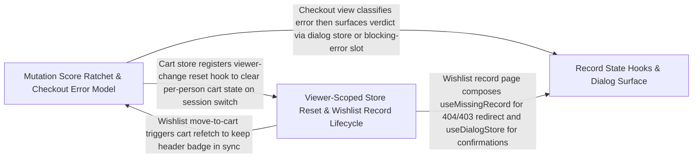

---
tags:
  - 2brain
  - 2brain/arch
  - project/boilerplate-vue-frontend
type: architecture
component: Mutation_Ratchet_Checkout_Record_Utilities
---

## Details

The per-file mutation-score ratchet (compare a Stryker report against mutation-baseline.json, refuse partial runs, lock in improvements) plus the checkout view's data-lifecycle utilities — blocking-error, missing-record, stale-record, reset-on-viewer-change, and clear-query-on-mount hooks — and the checkout error model and dialog store that surface those states. This is the test-quality gate and the checkout record-handling band.

### Mutation Score Ratchet & Checkout Error Model
The test-quality gate and the checkout domain's error-classification core. The mutation ratchet (check-baseline.ts) reads the Stryker JSON report, compares per-file scores against mutation-baseline.json, refuses to record a partial run, and locks in improvements by keeping the higher of baseline vs. current on --update. The checkout error model (checkout-errors.ts) is a pure classifier that reads error.errors[0] from the wire envelope, narrows the payload with runtime type guards, and returns a discriminated-union CheckoutErrorVerdict. The cart store (store.ts) is the consumer — its checkout() action throws the envelope, and the view calls classifyCheckoutError to decide which dialog or inline alert to render.

**Related Classes/Methods**:

- `src.modules.cart.domain.checkout-errors.CheckoutShortfallLine`:16-21
- `src.modules.cart.store.useCartStore`:48-355

**Source Files:**

- `scripts/mutation/check-baseline.ts`
  - `scripts.mutation.check-baseline.map() callback` (L64-L64) - Function
  - `scripts.mutation.check-baseline.counts.held.comparisons.filter() callback` (L75-L75) - Function
  - `scripts.mutation.check-baseline.counts.improved.comparisons.filter() callback` (L76-L76) - Function
  - `scripts.mutation.check-baseline.counts.added.comparisons.filter() callback` (L77-L77) - Function
  - `scripts.mutation.check-baseline.counts.removed.comparisons.filter() callback` (L78-L78) - Function
  - `scripts.mutation.check-baseline.comparisons.filter() callback` (L98-L98) - Function
- `src/modules/cart/domain/checkout-errors.ts`
  - `src.modules.cart.domain.checkout-errors.CheckoutShortfallLine` (L16-L21) - Interface
  - `src.modules.cart.domain.checkout-errors.UnavailableCartLine` (L28-L31) - Interface
  - `src.modules.cart.domain.checkout-errors.lines` (L123-L125) - Class
  - `src.modules.cart.domain.checkout-errors.lines.filter() callback` (L124-L124) - Function
  - `src.modules.cart.domain.checkout-errors.lines.rawLines.map() callback` (L124-L124) - Function
  - `src.modules.cart.domain.checkout-errors.classifyCheckoutError.lines.filter() callback` (L131-L131) - Function
  - `src.modules.cart.domain.checkout-errors.classifyCheckoutError.lines.rawLines.map() callback` (L131-L131) - Function
- `src/modules/cart/store.ts`
  - `src.modules.cart.store.useCartStore` (L48-L355) - Class
  - `src.modules.cart.store.useCartStore.defineStore('cart') callback` (L48-L355) - Function
  - `src.modules.cart.store.defineStore('cart') callback.cartItems` (L66-L66) - Class
  - `src.modules.cart.store.useCartStore.defineStore('cart') callback.cartItems.computed() callback` (L66-L66) - Function
  - `src.modules.cart.store.defineStore('cart') callback.cartSummary` (L71-L71) - Class
  - `src.modules.cart.store.useCartStore.defineStore('cart') callback.cartSummary.computed() callback` (L71-L71) - Function
  - `src.modules.cart.store.defineStore('cart') callback.cartShipping` (L77-L77) - Class
  - `src.modules.cart.store.useCartStore.defineStore('cart') callback.cartShipping.computed() callback` (L77-L77) - Function
  - `src.modules.cart.store.useCartStore.defineStore('cart') callback.liveSummary` (L89-L89) - Class
  - `src.modules.cart.store.useCartStore.defineStore('cart') callback.liveSummary.computed() callback` (L89-L89) - Function
  - `src.modules.cart.store.defineStore('cart') callback.badgeQuantity` (L95-L95) - Class
  - `src.modules.cart.store.useCartStore.defineStore('cart') callback.badgeQuantity.computed() callback` (L95-L95) - Function
  - `src.modules.cart.store.useCartStore.defineStore('cart') callback.badgeMoney.computed() callback` (L102-L105) - Function
  - `src.modules.cart.store.defineStore('cart') callback.badgeMoney` (L102-L106) - Class
  - `src.modules.cart.store.useCartStore.defineStore('cart') callback.useResetOnViewerChange() callback` (L130-L134) - Function
  - `src.modules.cart.store.defineStore('cart') callback.fetchSummary` (L142-L154) - Class
  - `src.modules.cart.store.useCartStore.defineStore('cart') callback.fetchSummary.then() callback` (L144-L147) - Function
  - `src.modules.cart.store.useCartStore.defineStore('cart') callback.fetchSummary.catch() callback` (L148-L154) - Function
  - `src.modules.cart.store.defineStore('cart') callback.fetchCart` (L161-L167) - Class
  - `src.modules.cart.store.useCartStore.defineStore('cart') callback.fetchCart.fetchAny() callback` (L162-L166) - Function
  - `src.modules.cart.store.useCartStore.defineStore('cart') callback.fetchCart.fetchAny() callback.then() callback` (L163-L166) - Function
  - `src.modules.cart.store.useCartStore.defineStore('cart') callback.addCartItemAction` (L178-L186) - Class
  - `src.modules.cart.store.useCartStore.defineStore('cart') callback.addCartItemAction.fetchAny() callback` (L179-L185) - Function
  - `src.modules.cart.store.useCartStore.defineStore('cart') callback.addCartItemAction.fetchAny() callback.then() callback` (L180-L185) - Function
  - `src.modules.cart.store.defineStore('cart') callback.updateCartItem` (L195-L203) - Class
  - `src.modules.cart.store.useCartStore.defineStore('cart') callback.updateCartItem.fetchAny() callback` (L196-L202) - Function
  - `src.modules.cart.store.useCartStore.defineStore('cart') callback.updateCartItem.fetchAny() callback.then() callback` (L197-L202) - Function
  - `src.modules.cart.store.defineStore('cart') callback.setShippingMethod` (L214-L223) - Class
  - `src.modules.cart.store.useCartStore.defineStore('cart') callback.setShippingMethod.fetchAny() callback` (L215-L222) - Function
  - `src.modules.cart.store.useCartStore.defineStore('cart') callback.setShippingMethod.fetchAny() callback.then() callback` (L216-L222) - Function
  - `src.modules.cart.store.useCartStore.defineStore('cart') callback.removeCartItemAction` (L231-L239) - Class
  - `src.modules.cart.store.useCartStore.defineStore('cart') callback.removeCartItemAction.fetchAny() callback` (L232-L238) - Function
  - `src.modules.cart.store.useCartStore.defineStore('cart') callback.removeCartItemAction.fetchAny() callback.then() callback` (L233-L238) - Function
  - `src.modules.cart.store.useCartStore.defineStore('cart') callback.clearCartAction` (L247-L255) - Class
  - `src.modules.cart.store.useCartStore.defineStore('cart') callback.clearCartAction.fetchAny() callback` (L248-L254) - Function
  - `src.modules.cart.store.useCartStore.defineStore('cart') callback.clearCartAction.fetchAny() callback.then() callback` (L249-L254) - Function
  - `src.modules.cart.store.defineStore('cart') callback.checkout` (L292-L316) - Class
  - `src.modules.cart.store.useCartStore.defineStore('cart') callback.checkout.fetchAny() callback` (L293-L315) - Function
  - `src.modules.cart.store.useCartStore.defineStore('cart') callback.checkout.fetchAny() callback.then() callback` (L297-L307) - Function
  - `src.modules.cart.store.useCartStore.defineStore('cart') callback.checkout.fetchAny() callback.catch() callback` (L308-L315) - Function
  - `src.modules.cart.store.defineStore('cart') callback.reorder` (L326-L334) - Class
  - `src.modules.cart.store.useCartStore.defineStore('cart') callback.reorder.fetchAny() callback` (L327-L333) - Function
  - `src.modules.cart.store.useCartStore.defineStore('cart') callback.reorder.fetchAny() callback.then() callback` (L328-L333) - Function

### Record State Hooks & Dialog Surface
The composable hook band that manages the full record-page state machine and the dialog store that surfaces user-facing confirmations. useBlockingError provides the inline error slot for a workflow that cannot proceed. useStaleRecord layers on top to handle 412 Precondition Failed with a warning and reload-latest option. useClearQueryOnMount is a one-shot security hook that strips one-time email tokens from the URL after mount. useMissingRecord handles 404/403 by redirecting to the shell's Error page. The dialog store (src/ui/dialog.ts) is the reactive queue that views push DialogRequest entries into and DialogHost renders.

**Related Classes/Methods**:

- `src.infrastructure.utils.use-blocking-error.useBlockingError`:58-85
- `src.infrastructure.utils.use-stale-record.useStaleRecord`:48-74
- `src.infrastructure.utils.use-clear-query-on-mount.useClearQueryOnMount`:22-29
- `src.ui.dialog.useDialogStore`:76-109

**Source Files:**

- `src/infrastructure/utils/use-blocking-error.ts`
  - `src.infrastructure.utils.use-blocking-error.UseBlockingErrorReturn` (L18-L49) - Interface
  - `src.infrastructure.utils.use-blocking-error.useBlockingError` (L58-L85) - Class
  - `src.infrastructure.utils.use-blocking-error.useBlockingError.report` (L72-L76) - Method
  - `src.infrastructure.utils.use-blocking-error.useBlockingError.warn` (L77-L80) - Method
  - `src.infrastructure.utils.use-blocking-error.useBlockingError.clear` (L81-L83) - Method
- `src/infrastructure/utils/use-clear-query-on-mount.ts`
  - `src.infrastructure.utils.use-clear-query-on-mount.useClearQueryOnMount` (L22-L29) - Class
  - `src.infrastructure.utils.use-clear-query-on-mount.useClearQueryOnMount.onMounted() callback` (L26-L28) - Function
- `src/infrastructure/utils/use-missing-record.ts`
  - `src.infrastructure.utils.use-missing-record.useMissingRecord.<function>.status` (L35-L35) - Class
  - `src.infrastructure.utils.use-missing-record.useMissingRecord.<function>.status.find() callback` (L35-L35) - Function
- `src/infrastructure/utils/use-stale-record.ts`
  - `src.infrastructure.utils.use-stale-record.UseStaleRecordReturn` (L17-L39) - Interface
  - `src.infrastructure.utils.use-stale-record.useStaleRecord` (L48-L74) - Class
  - `src.infrastructure.utils.use-stale-record.useStaleRecord.handle` (L59-L64) - Method
  - `src.infrastructure.utils.use-stale-record.useStaleRecord.reloadLatest` (L65-L69) - Method
  - `src.infrastructure.utils.use-stale-record.useStaleRecord.clear` (L70-L72) - Method
- `src/modules/locales/composables/use-dictionary-cell-editor.ts`
  - `src.modules.locales.composables.use-dictionary-cell-editor.useDictionaryCellEditor` (L38-L251) - Function
  - `src.modules.locales.composables.use-dictionary-cell-editor.useDictionaryCellEditor.markSaved` (L93-L98) - Class
  - `src.modules.locales.composables.use-dictionary-cell-editor.useDictionaryCellEditor.markSaved.setTimeout() callback` (L95-L97) - Function
  - `src.modules.locales.composables.use-dictionary-cell-editor.useDictionaryCellEditor.settleWrite` (L109-L123) - Class
  - `src.modules.locales.composables.use-dictionary-cell-editor.useDictionaryCellEditor.settleWrite.request.then() callback` (L111-L114) - Function
  - `src.modules.locales.composables.use-dictionary-cell-editor.useDictionaryCellEditor.settleWrite.catch() callback` (L115-L123) - Function
  - `src.modules.locales.composables.use-dictionary-cell-editor.handleCellBlur` (L139-L156) - Class
  - `src.modules.locales.composables.use-dictionary-cell-editor.useDictionaryCellEditor.handleCellBlur.request.then() callback` (L154-L154) - Function
  - `src.modules.locales.composables.use-dictionary-cell-editor.handleCellClear` (L170-L205) - Class
  - `src.modules.locales.composables.use-dictionary-cell-editor.useDictionaryCellEditor.handleCellClear.then() callback` (L186-L204) - Function
  - `src.modules.locales.composables.use-dictionary-cell-editor.useDictionaryCellEditor.handleCellClear.then() callback.then() callback` (L195-L201) - Function
- `src/ui/dialog.ts`
  - `src.ui.dialog.DialogRequest` (L16-L44) - Interface
  - `src.ui.dialog.DialogEntry` (L49-L58) - Interface
  - `src.ui.dialog.useDialogStore` (L76-L109) - Class
  - `src.ui.dialog.useDialogStore.defineStore('dialog') callback` (L76-L109) - Function
  - `src.ui.dialog.defineStore('dialog') callback.confirm` (L93-L96) - Class
  - `src.ui.dialog.useDialogStore.defineStore('dialog') callback.confirm.<function>` (L94-L96) - Function

### Viewer-Scoped Store Reset & Wishlist Record Lifecycle
The per-person data-lifecycle guard and its primary consumer, the wishlist store. useResetOnViewerChange watches session.viewer?.id and calls the store's reset() whenever the signed-in person changes or leaves, preventing one visitor's cart or wishlist from showing through to the next visitor. useMissingRecord provides the onError handler that a record page's watch or forced refetch hands to it: a 404 or 403 redirects to the shell's Error page while any other failure is toasted. The wishlist store is the concrete embodiment — its fetchWishlist, addToWishlist, removeFromWishlist, moveToCart, and ensureWishlist actions are all wrapped with these hooks, demonstrating the full hook composition pattern.

**Related Classes/Methods**:

- `src.infrastructure.utils.use-reset-on-viewer-change.useResetOnViewerChange`:22-32
- `src.infrastructure.utils.use-missing-record.useMissingRecord`:30-50
- `src.modules.wishlist.store.useWishlistStore`:24-153

**Source Files:**

- `src/infrastructure/utils/use-missing-record.ts`
  - `src.infrastructure.utils.use-missing-record.useMissingRecord` (L30-L50) - Class
  - `src.infrastructure.utils.use-missing-record.useMissingRecord.<function>` (L34-L49) - Function
- `src/infrastructure/utils/use-reset-on-viewer-change.ts`
  - `src.infrastructure.utils.use-reset-on-viewer-change.useResetOnViewerChange` (L22-L32) - Class
  - `src.infrastructure.utils.use-reset-on-viewer-change.watch() callback` (L27-L27) - Function
  - `src.infrastructure.utils.use-reset-on-viewer-change.useResetOnViewerChange.watch() callback` (L28-L30) - Function
- `src/modules/wishlist/store.ts`
  - `src.modules.wishlist.store.useWishlistStore` (L24-L153) - Class
  - `src.modules.wishlist.store.useWishlistStore.defineStore('wishlist') callback` (L24-L153) - Function
  - `src.modules.wishlist.store.useWishlistStore.defineStore('wishlist') callback.savedProductIds` (L49-L49) - Class
  - `src.modules.wishlist.store.useWishlistStore.defineStore('wishlist') callback.savedProductIds.computed() callback` (L49-L49) - Function
  - `src.modules.wishlist.store.useWishlistStore.defineStore('wishlist') callback.savedProductIds.computed() callback.items.value.map() callback` (L49-L49) - Function
  - `src.modules.wishlist.store.defineStore('wishlist') callback.fetchWishlist` (L64-L70) - Class
  - `src.modules.wishlist.store.useWishlistStore.defineStore('wishlist') callback.fetchWishlist.fetchAny() callback` (L65-L69) - Function
  - `src.modules.wishlist.store.useWishlistStore.defineStore('wishlist') callback.fetchWishlist.fetchAny() callback.then() callback` (L66-L69) - Function
  - `src.modules.wishlist.store.defineStore('wishlist') callback.ensureWishlist` (L78-L84) - Class
  - `src.modules.wishlist.store.useWishlistStore.defineStore('wishlist') callback.ensureWishlist.catch() callback` (L79-L82) - Function
  - `src.modules.wishlist.store.defineStore('wishlist') callback.addToWishlist` (L93-L99) - Class
  - `src.modules.wishlist.store.useWishlistStore.defineStore('wishlist') callback.addToWishlist.fetchAny() callback` (L94-L98) - Function
  - `src.modules.wishlist.store.useWishlistStore.defineStore('wishlist') callback.addToWishlist.fetchAny() callback.then() callback` (L95-L98) - Function
  - `src.modules.wishlist.store.defineStore('wishlist') callback.removeFromWishlist` (L107-L113) - Class
  - `src.modules.wishlist.store.useWishlistStore.defineStore('wishlist') callback.removeFromWishlist.fetchAny() callback` (L108-L112) - Function
  - `src.modules.wishlist.store.useWishlistStore.defineStore('wishlist') callback.removeFromWishlist.fetchAny() callback.then() callback` (L109-L112) - Function
  - `src.modules.wishlist.store.defineStore('wishlist') callback.moveToCart` (L123-L131) - Class
  - `src.modules.wishlist.store.useWishlistStore.defineStore('wishlist') callback.moveToCart.fetchAny() callback` (L124-L130) - Function
  - `src.modules.wishlist.store.useWishlistStore.defineStore('wishlist') callback.moveToCart.fetchAny() callback.then() callback` (L125-L130) - Function
  - `src.modules.wishlist.store.useWishlistStore.defineStore('wishlist') callback.moveToCart.fetchAny() callback.then() callback.then() callback` (L129-L129) - Function
  - `src.modules.wishlist.store.useWishlistStore.defineStore('wishlist') callback.useResetOnViewerChange() callback` (L137-L140) - Function
