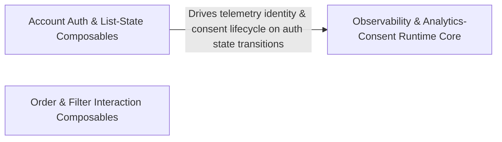

---
tags:
  - 2brain
  - 2brain/arch
  - project/boilerplate-vue-frontend
type: architecture
component: Observability_Analytics_Consent_Runtime
---

## Details

The secondary runtime concern that consumes the generated contract surface for telemetry and consent. It owns the Faro/Umami configuration readers (FaroConfig, UmamiConfig, readFaroConfig, readUmamiConfig, readUmamiRequireConsent, origin→regex helpers), the observability Pinia store (ApiRejectEnvelope, UmamiTracker), and the analytics-consent store (useAnalyticsConsentStore with its promptOpen callback). It also carries the account auth/profile stores and the orders/products/users stores plus the use-order-actions-refetch / reorder / use-any-filter-choice composables that wire domain actions to the generated API types.

### Observability & Analytics-Consent Runtime Core
The heart of the subsystem. Owns the Faro/Umami configuration readers and origin-to-regex helpers, the observability Pinia store that wraps both telemetry SDKs (Faro tracing/errors + Umami pageviews) with sensitive-URL redaction and the setUmamiConsent gate, and the analytics-consent store that manages the visitor's consent choice, cookie persistence, and the promptOpen banner callback. Per the cluster membership it also carries the account auth/profile stores that feed the consent/tracker lifecycle. This is the primary flow node: config → store init → consent decision → tracker on/off.

**Related Classes/Methods**:

- `src.infrastructure.observability.config.readFaroConfig`:120-155
- `src.infrastructure.observability.config.readUmamiConfig`:66-83
- `src.infrastructure.observability.store.useObservabilityStore`:166-427
- `src.infrastructure.analytics-consent.useAnalyticsConsentStore`:70-124

**Source Files:**

- `src/infrastructure/analytics-consent.ts`
  - `src.infrastructure.analytics-consent.useAnalyticsConsentStore` (L70-L124) - Class
  - `src.infrastructure.analytics-consent.useAnalyticsConsentStore.defineStore('analyticsConsent') callback` (L70-L124) - Function
  - `src.infrastructure.analytics-consent.defineStore('analyticsConsent') callback.promptOpen` (L86-L86) - Class
  - `src.infrastructure.analytics-consent.useAnalyticsConsentStore.defineStore('analyticsConsent') callback.promptOpen.computed() callback` (L86-L86) - Function
- `src/infrastructure/observability/config.ts`
  - `src.infrastructure.observability.config.FaroConfig` (L14-L33) - Interface
  - `src.infrastructure.observability.config.UmamiConfig` (L38-L47) - Interface
  - `src.infrastructure.observability.config.originToRegExp` (L55-L58) - Function
  - `src.infrastructure.observability.config.readUmamiConfig` (L66-L83) - Function
  - `src.infrastructure.observability.config.readUmamiRequireConsent` (L92-L96) - Function
  - `src.infrastructure.observability.config.umamiOriginPattern` (L108-L112) - Function
  - `src.infrastructure.observability.config.readFaroConfig` (L120-L155) - Function
- `src/infrastructure/observability/store.ts`
  - `src.infrastructure.observability.store.ApiRejectEnvelope` (L84-L92) - Interface
  - `src.infrastructure.observability.store.describeApiRejectError` (L115-L118) - Class
  - `src.infrastructure.observability.store.describeApiRejectError.filter() callback` (L117-L117) - Function
  - `src.infrastructure.observability.store.UmamiTracker` (L129-L131) - Interface
  - `src.infrastructure.observability.store.useObservabilityStore` (L166-L427) - Class
  - `src.infrastructure.observability.store.useObservabilityStore.defineStore('observability') callback` (L166-L427) - Function
  - `src.infrastructure.observability.store.defineStore('observability') callback.initFaro` (L206-L270) - Class
  - `src.infrastructure.observability.store.useObservabilityStore.defineStore('observability') callback.initFaro.then() callback` (L218-L254) - Function
  - `src.infrastructure.observability.store.useObservabilityStore.defineStore('observability') callback.initFaro.catch() callback` (L255-L267) - Function
  - `src.infrastructure.observability.store.normalizeContext` (L435-L437) - Function
  - `src.infrastructure.observability.store.normalizeContext.mapValues() callback` (L436-L436) - Function
- `src/modules/account/stores/auth.ts`
  - `src.modules.account.stores.auth.defineStore('accountAuth') callback.login` (L89-L124) - Class
  - `src.modules.account.stores.auth.defineStore('accountAuth') callback.signup` (L151-L189) - Class
  - `src.modules.account.stores.auth.defineStore('accountAuth') callback.setAvatarAfterSignup` (L203-L209) - Class
  - `src.modules.account.stores.auth.defineStore('accountAuth') callback.setAvatarAfterSignup.then() callback` (L207-L207) - Function
  - `src.modules.account.stores.auth.defineStore('accountAuth') callback.requestPasswordReset` (L220-L221) - Class
  - `src.modules.account.stores.auth.defineStore('accountAuth') callback.confirmPasswordReset` (L231-L232) - Class
  - `src.modules.account.stores.auth.defineStore('accountAuth') callback.logout` (L242-L250) - Class
  - `src.modules.account.stores.auth.defineStore('accountAuth') callback.logoutEverywhere` (L257-L263) - Class
- `src/modules/account/stores/profile.ts`
  - `src.modules.account.stores.profile.useProfileStore` (L65-L499) - Class
  - `src.modules.account.stores.profile.useProfileStore.defineStore('accountProfile') callback` (L65-L499) - Function
  - `src.modules.account.stores.profile.defineStore('accountProfile') callback.fetchProfile` (L132-L162) - Class
  - `src.modules.account.stores.profile.useProfileStore.defineStore('accountProfile') callback.fetchProfile.fetchTarget() callback` (L134-L151) - Function
  - `src.modules.account.stores.profile.useProfileStore.defineStore('accountProfile') callback.fetchProfile.fetchTarget() callback.then() callback` (L135-L151) - Function
  - `src.modules.account.stores.profile.useProfileStore.defineStore('accountProfile') callback.fetchProfile.fetchTarget() callback.then() callback.then() callback` (L150-L150) - Function
  - `src.modules.account.stores.profile.useProfileStore.defineStore('accountProfile') callback.fetchProfile.then() callback` (L154-L161) - Function
  - `src.modules.account.stores.profile.useProfileStore.defineStore('accountProfile') callback.fetchProfile.then() callback.then() callback` (L160-L160) - Function
  - `src.modules.account.stores.profile.defineStore('accountProfile') callback.updateProfile` (L228-L283) - Class
  - `src.modules.account.stores.profile.useProfileStore.defineStore('accountProfile') callback.updateProfile.updateTarget() callback` (L250-L265) - Function
  - `src.modules.account.stores.profile.defineStore('accountProfile') callback.updateProfile.updateTarget() callback.uploadThenClear() callback` (L255-L256) - Function
  - `src.modules.account.stores.profile.useProfileStore.defineStore('accountProfile') callback.updateProfile.updateTarget() callback.uploadThenClear() callback` (L257-L257) - Function
  - `src.modules.account.stores.profile.useProfileStore.defineStore('accountProfile') callback.updateProfile.updateTarget() callback.then() callback` (L260-L265) - Function
  - `src.modules.account.stores.profile.useProfileStore.defineStore('accountProfile') callback.updateProfile.updateTarget() callback.then() callback.then() callback` (L264-L264) - Function
  - `src.modules.account.stores.profile.useProfileStore.defineStore('accountProfile') callback.updateProfile.then() callback` (L275-L281) - Function
  - `src.modules.account.stores.profile.useProfileStore.defineStore('accountProfile') callback.updateProfile.then() callback.then() callback` (L281-L281) - Function
  - `src.modules.account.stores.profile.defineStore('accountProfile') callback.cancelPendingEmailChange` (L316-L319) - Class
  - `src.modules.account.stores.profile.useProfileStore.defineStore('accountProfile') callback.cancelPendingEmailChange.fetchAny() callback` (L317-L318) - Function
  - `src.modules.account.stores.profile.useProfileStore.defineStore('accountProfile') callback.cancelPendingEmailChange.fetchAny() callback.then() callback.then() callback` (L318-L318) - Function
  - `src.modules.account.stores.profile.defineStore('accountProfile') callback.updateOwnRole` (L348-L354) - Class
  - `src.modules.account.stores.profile.useProfileStore.defineStore('accountProfile') callback.updateOwnRole.fetchAny() callback` (L353-L353) - Function
  - `src.modules.account.stores.profile.useProfileStore.defineStore('accountProfile') callback.updateOwnRole.fetchAny() callback.then() callback` (L353-L353) - Function
  - `src.modules.account.stores.profile.defineStore('accountProfile') callback.changePassword` (L371-L376) - Class
  - `src.modules.account.stores.profile.useProfileStore.defineStore('accountProfile') callback.changePassword.fetchAny() callback` (L372-L375) - Function
  - `src.modules.account.stores.profile.useProfileStore.defineStore('accountProfile') callback.changePassword.fetchAny() callback.then() callback` (L373-L375) - Function
  - `src.modules.account.stores.profile.defineStore('accountProfile') callback.confirmEmailVerification` (L386-L391) - Class
  - `src.modules.account.stores.profile.useProfileStore.defineStore('accountProfile') callback.confirmEmailVerification.fetchAny() callback` (L387-L390) - Function
  - `src.modules.account.stores.profile.useProfileStore.defineStore('accountProfile') callback.confirmEmailVerification.fetchAny() callback.then() callback` (L388-L389) - Function
  - `src.modules.account.stores.profile.useProfileStore.defineStore('accountProfile') callback.confirmEmailVerification.fetchAny() callback.then() callback.then() callback` (L389-L389) - Function
  - `src.modules.account.stores.profile.defineStore('accountProfile') callback.confirmEmailChange` (L402-L407) - Class
  - `src.modules.account.stores.profile.useProfileStore.defineStore('accountProfile') callback.confirmEmailChange.fetchAny() callback` (L403-L406) - Function
  - `src.modules.account.stores.profile.useProfileStore.defineStore('accountProfile') callback.confirmEmailChange.fetchAny() callback.then() callback` (L404-L405) - Function
  - `src.modules.account.stores.profile.useProfileStore.defineStore('accountProfile') callback.confirmEmailChange.fetchAny() callback.then() callback.then() callback` (L405-L405) - Function
  - `src.modules.account.stores.profile.defineStore('accountProfile') callback.watch() callback` (L412-L412) - Function
  - `src.modules.account.stores.profile.useProfileStore.defineStore('accountProfile') callback.watch() callback` (L413-L415) - Function
  - `src.modules.account.stores.profile.defineStore('accountProfile') callback.requestAccountDelete` (L433-L433) - Class
  - `src.modules.account.stores.profile.useProfileStore.defineStore('accountProfile') callback.requestAccountDelete.fetchAny() callback` (L433-L433) - Function
  - `src.modules.account.stores.profile.defineStore('accountProfile') callback.exportAccountData` (L446-L451) - Class
  - `src.modules.account.stores.profile.useProfileStore.defineStore('accountProfile') callback.exportAccountData.fetchAny() callback` (L447-L450) - Function
  - `src.modules.account.stores.profile.useProfileStore.defineStore('accountProfile') callback.exportAccountData.fetchAny() callback.then() callback` (L448-L449) - Function
  - `src.modules.account.stores.profile.defineStore('accountProfile') callback.confirmAccountDelete` (L460-L470) - Class
  - `src.modules.account.stores.profile.useProfileStore.defineStore('accountProfile') callback.confirmAccountDelete.fetchAny() callback` (L461-L469) - Function
  - `src.modules.account.stores.profile.useProfileStore.defineStore('accountProfile') callback.confirmAccountDelete.fetchAny() callback.then() callback` (L462-L469) - Function
  - `src.modules.account.stores.profile.defineStore('accountProfile') callback.uploadingAvatar` (L475-L475) - Class
  - `src.modules.account.stores.profile.useProfileStore.defineStore('accountProfile') callback.uploadingAvatar.computed() callback` (L475-L475) - Function
  - `src.modules.account.stores.profile.defineStore('accountProfile') callback.removingAvatar` (L480-L480) - Class
  - `src.modules.account.stores.profile.useProfileStore.defineStore('accountProfile') callback.removingAvatar.computed() callback` (L480-L480) - Function

### Account Auth & List-State Composables
Bridges the account domain to the generated API and to list-view state. Owns the account auth store (useAuthStore) whose login/logout/confirmPasswordReset actions call the generated fetchAny client, plus the useListUrlState and useServerSort composables that keep filter/sort choices in sync with the URL and the server-side sort contract. This group represents the user action → generated API call → list state flow for the account/list surface.

**Related Classes/Methods**:

- `src.modules.account.stores.auth.useAuthStore`:54-274

**Source Files:**

- `src/modules/account/stores/auth.ts`
  - `src.modules.account.stores.auth.useAuthStore` (L54-L274) - Class
  - `src.modules.account.stores.auth.useAuthStore.defineStore('accountAuth') callback` (L54-L274) - Function
  - `src.modules.account.stores.auth.useAuthStore.defineStore('accountAuth') callback.login.fetchAny() callback` (L95-L120) - Function
  - `src.modules.account.stores.auth.useAuthStore.defineStore('accountAuth') callback.login.fetchAny() callback.then() callback` (L103-L120) - Function
  - `src.modules.account.stores.auth.useAuthStore.defineStore('accountAuth') callback.login.fetchAny() callback.then() callback.then() callback` (L119-L119) - Function
  - `src.modules.account.stores.auth.useAuthStore.defineStore('accountAuth') callback.login.then() callback` (L121-L124) - Function
  - `src.modules.account.stores.auth.useAuthStore.defineStore('accountAuth') callback.signup.fetchAny() callback` (L169-L188) - Function
  - `src.modules.account.stores.auth.useAuthStore.defineStore('accountAuth') callback.signup.fetchAny() callback.then() callback` (L181-L184) - Function
  - `src.modules.account.stores.auth.useAuthStore.defineStore('accountAuth') callback.signup.fetchAny() callback.catch() callback` (L185-L188) - Function
  - `src.modules.account.stores.auth.useAuthStore.defineStore('accountAuth') callback.setAvatarAfterSignup.then() callback` (L208-L208) - Function
  - `src.modules.account.stores.auth.useAuthStore.defineStore('accountAuth') callback.requestPasswordReset.fetchAny() callback` (L221-L221) - Function
  - `src.modules.account.stores.auth.useAuthStore.defineStore('accountAuth') callback.confirmPasswordReset.fetchAny() callback` (L232-L232) - Function
  - `src.modules.account.stores.auth.useAuthStore.defineStore('accountAuth') callback.logout.then() callback` (L245-L249) - Function
  - `src.modules.account.stores.auth.useAuthStore.defineStore('accountAuth') callback.logoutEverywhere.then() callback` (L259-L262) - Function
- `src/ui/composables/use-list-url-state.ts`
  - `src.ui.composables.use-list-url-state.ListUrlStateOptions` (L25-L34) - Interface
  - `src.ui.composables.use-list-url-state.ListUrlState` (L39-L45) - Interface
  - `src.ui.composables.use-list-url-state.useListUrlState.sync.foreign` (L147-L151) - Class
  - `src.ui.composables.use-list-url-state.useListUrlState.sync.foreign.filter() callback` (L149-L149) - Function
- `src/ui/composables/use-server-sort.ts`
  - `src.ui.composables.use-server-sort.useServerSort.choice.get` (L59-L59) - Method
  - `src.ui.composables.use-server-sort.useServerSort.choice.set` (L60-L60) - Method

### Order & Filter Interaction Composables
The domain-action layer that wires order and product interactions to the generated API types. Owns useOrderActionsRefetch (refetching order state after an action), the reorder domain logic (ReorderedOrderLine, leftOutByReorder), and the shared filter/UX composables useAnyFilterChoice, useDeletedFilterOptions, useReturnFocus, useServerSort, and useTouchFriendlySize. This group represents the order/filter interaction → generated API → refetch flow.

**Related Classes/Methods**:

- `src.modules.orders.composables.use-order-actions-refetch.useOrderActionsRefetch`:23-48
- `src.ui.composables.use-any-filter-choice.useAnyFilterChoice`:23-30
- `src.ui.composables.use-deleted-filter-options.useDeletedFilterOptions`:26-33

**Source Files:**

- `src/modules/orders/composables/use-order-actions-refetch.ts`
  - `src.modules.orders.composables.use-order-actions-refetch.useOrderActionsRefetch` (L23-L48) - Class
  - `src.modules.orders.composables.use-order-actions-refetch.useOrderActionsRefetch.watch() callback` (L35-L45) - Function
- `src/modules/orders/domain/reorder.ts`
  - `src.modules.orders.domain.reorder.ReorderedOrderLine` (L12-L15) - Interface
  - `src.modules.orders.domain.reorder.leftOutByReorder` (L26-L32) - Class
  - `src.modules.orders.domain.reorder.leftOutByReorder.orderLines.filter() callback` (L31-L31) - Function
  - `src.modules.orders.domain.reorder.leftOutByReorder.map() callback` (L32-L32) - Function
- `src/ui/composables/use-any-filter-choice.ts`
  - `src.ui.composables.use-any-filter-choice.useAnyFilterChoice` (L23-L30) - Class
  - `src.ui.composables.use-any-filter-choice.useAnyFilterChoice.get` (L28-L28) - Method
  - `src.ui.composables.use-any-filter-choice.useAnyFilterChoice.set` (L29-L29) - Method
- `src/ui/composables/use-deleted-filter-options.ts`
  - `src.ui.composables.use-deleted-filter-options.DeletedFilterOption` (L14-L19) - Interface
  - `src.ui.composables.use-deleted-filter-options.useDeletedFilterOptions` (L26-L33) - Class
  - `src.ui.composables.use-deleted-filter-options.useDeletedFilterOptions.computed() callback` (L28-L32) - Function
- `src/ui/composables/use-list-url-state.ts`
  - `src.ui.composables.use-list-url-state.useListUrlState.hydrate.present` (L112-L114) - Class
  - `src.ui.composables.use-list-url-state.useListUrlState.hydrate.present.some() callback` (L113-L113) - Function
- `src/ui/composables/use-return-focus.ts`
  - `src.ui.composables.use-return-focus.useReturnFocus` (L17-L40) - Class
  - `src.ui.composables.use-return-focus.useReturnFocus.watch() callback` (L26-L39) - Function
  - `src.ui.composables.use-return-focus.useReturnFocus.watch() callback.nextTick() callback` (L38-L38) - Function
- `src/ui/composables/use-server-sort.ts`
  - `src.ui.composables.use-server-sort.ServerSortOptions` (L15-L20) - Interface
  - `src.ui.composables.use-server-sort.ServerSort` (L25-L30) - Interface
- `src/ui/composables/use-touch-friendly-size.ts`
  - `src.ui.composables.use-touch-friendly-size.useTouchFriendlySize` (L17-L20) - Class
  - `src.ui.composables.use-touch-friendly-size.useTouchFriendlySize.computed() callback` (L19-L19) - Function
