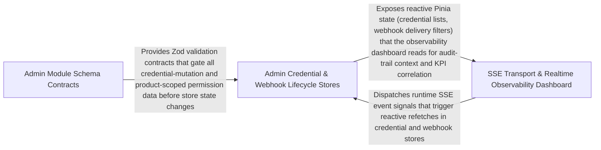

---
tags:
  - 2brain
  - 2brain/arch
  - project/boilerplate-vue-frontend
type: architecture
component: Realtime_Observability_SSE_Transport
---

## Details

The SSE (Server-Sent Events) client infrastructure and the admin-facing observability module that consumes it. The SSE client (createSseClient) is a reusable, callback-based transport that opens an EventSource, handles reconnection, and dispatches typed events to registered callbacks. The observability module's store (useRealtimeObservabilityStore) and composable (useRealtimeObservability) subscribe to the SSE stream to render live KPI cards, audit-trail entries, and realtime metrics on the admin dashboard. The API-keys module (schemas + store) and the demo store are co-located because they share the same admin-facing, non-visitor audience and the same SSE-driven refresh pattern.

### Admin Module Schema Contracts
This sub-component owns the Zod validation schemas that define the data contracts for every admin-facing domain module. It includes the API-key credential schemas (apiKeyNameSchema, apiKeyPermissionsSchema, apiKeyExpiresAtSchema with a .refine() callback for expiry validation), the orders status schema, the cart line-quantity composable (settle action that clamps and validates quantity transitions), and the locales store's entry-creation and tenant-binding logic. These schemas are the single source of truth for what shape of data the stores accept and what the SSE-driven refresh must conform to. They sit at the bottom of the subsystem's dependency chain: every store and composable above them validates against these contracts before mutating state.

**Related Classes/Methods**:

- `src.modules.api-keys.schemas.apiKeyPermissionsSchema`:24-26
- `src.modules.api-keys.schemas.apiKeyExpiresAtSchema`:33-38

**Source Files:**

- `src/modules/api-keys/schemas.ts`
  - `src.modules.api-keys.schemas.apiKeyNameSchema` (L15-L18) - Class
  - `src.modules.api-keys.schemas.apiKeyNameSchema.error` (L18-L18) - Method
  - `src.modules.api-keys.schemas.apiKeyPermissionsSchema` (L24-L26) - Class
  - `src.modules.api-keys.schemas.apiKeyPermissionsSchema.error` (L26-L26) - Method
  - `src.modules.api-keys.schemas.apiKeyExpiresAtSchema` (L33-L38) - Class
  - `src.modules.api-keys.schemas.apiKeyExpiresAtSchema.refine() callback` (L36-L36) - Function
  - `src.modules.api-keys.schemas.apiKeyExpiresAtSchema.error` (L37-L37) - Method
- `src/modules/cart/composables/use-line-quantity.ts`
  - `src.modules.cart.composables.use-line-quantity.useLineQuantity.senderFor.send` (L89-L113) - Class
  - `src.modules.cart.composables.use-line-quantity.useLineQuantity.senderFor.send.debounce() callback` (L89-L113) - Function
  - `src.modules.cart.composables.use-line-quantity.settle` (L198-L204) - Class
  - `src.modules.cart.composables.use-line-quantity.useLineQuantity.settle.then() callback` (L200-L203) - Function
  - `src.modules.cart.composables.use-line-quantity.useLineQuantity.settle.then() callback.results.some() callback` (L201-L201) - Function
- `src/modules/locales/store.ts`
  - `src.modules.locales.store.defineStore('locales') callback.backendTenant` (L183-L185) - Class
  - `src.modules.locales.store.defineStore('locales') callback.tenantLabel` (L194-L195) - Class
  - `src.modules.locales.store.defineStore('locales') callback.fetchTenants` (L202-L208) - Class
  - `src.modules.locales.store.defineStore('locales') callback.fetchLanguages` (L225-L233) - Class
  - `src.modules.locales.store.defineStore('locales') callback.createLanguage` (L241-L244) - Class
  - `src.modules.locales.store.defineStore('locales') callback.editLanguage` (L255-L260) - Class
  - `src.modules.locales.store.defineStore('locales') callback.removeLanguage` (L271-L276) - Class
  - `src.modules.locales.store.defineStore('locales') callback.removeLanguage.fetchAny() callback.then() callback` (L274-L274) - Function
  - `src.modules.locales.store.defineStore('locales') callback.addEntry` (L289-L297) - Class
  - `src.modules.locales.store.defineStore('locales') callback.editEntry` (L307-L313) - Class
  - `src.modules.locales.store.defineStore('locales') callback.removeEntry` (L322-L323) - Class
  - `src.modules.locales.store.defineStore('locales') callback.importEntries` (L338-L353) - Class
  - `src.modules.locales.store.defineStore('locales') callback.fetchAllEntries` (L367-L377) - Class
  - `src.modules.locales.store.defineStore('locales') callback.fetchEntityTranslations` (L391-L397) - Class
  - `src.modules.locales.store.defineStore('locales') callback.saveEntityTranslations` (L409-L418) - Class
- `src/modules/orders/schemas.ts`
  - `src.modules.orders.schemas.ordersStatusSchema` (L18-L20) - Class
  - `src.modules.orders.schemas.ordersStatusSchema.error` (L19-L19) - Method
  - `src.modules.orders.schemas.ordersSchema.email.error` (L29-L29) - Method

### Admin Credential & Webhook Lifecycle Stores
This sub-component owns the Pinia stores that manage the lifecycle of admin credentials and webhook subscriptions. The useApiKeysStore exposes mintCredential (fetches a new API key via the generated client, validates it against the Group 1 schemas, and inserts it into reactive state) and revokeCredential (deletes the key server-side and removes it locally). The useWebhooksStore manages DeliveryFilters and SubscriptionFilters — the reactive filter state that scopes which webhook events the admin sees. The products schemas (productsPriceSchema, productsTitleSchema) provide the validation contracts for product data that these stores reference when cross-referencing credentials with product-scoped permissions. Together, these stores form the state-management layer that sits between the schema contracts below and the SSE-driven refresh above.

**Related Classes/Methods**:

- `src.modules.api-keys.store.useApiKeysStore`:23-112
- `src.modules.webhooks.store.useWebhooksStore`:64-310
- `src.modules.webhooks.store.DeliveryFilters`:45-48
- `src.modules.products.schemas.productsPriceSchema`:44-46

**Source Files:**

- `src/modules/api-keys/store.ts`
  - `src.modules.api-keys.store.useApiKeysStore` (L23-L112) - Class
  - `src.modules.api-keys.store.useApiKeysStore.defineStore('api-keys') callback` (L23-L112) - Function
  - `src.modules.api-keys.store.useApiKeysStore.defineStore('api-keys') callback.mintCredential.fetchAny() callback` (L71-L76) - Function
  - `src.modules.api-keys.store.useApiKeysStore.defineStore('api-keys') callback.mintCredential.fetchAny() callback.then() callback` (L72-L76) - Function
  - `src.modules.api-keys.store.useApiKeysStore.defineStore('api-keys') callback.revokeCredential.fetchAny() callback` (L92-L92) - Function
  - `src.modules.api-keys.store.useApiKeysStore.defineStore('api-keys') callback.revokeCredential.then() callback` (L92-L94) - Function
- `src/modules/products/schemas.ts`
  - `src.modules.products.schemas.productsTitleSchema` (L37-L39) - Class
  - `src.modules.products.schemas.productsTitleSchema.error` (L39-L39) - Method
  - `src.modules.products.schemas.productsPriceSchema` (L44-L46) - Class
  - `src.modules.products.schemas.productsPriceSchema.error` (L46-L46) - Method
- `src/modules/webhooks/store.ts`
  - `src.modules.webhooks.store.SubscriptionFilters` (L40-L42) - Interface
  - `src.modules.webhooks.store.DeliveryFilters` (L45-L48) - Interface
  - `src.modules.webhooks.store.useWebhooksStore` (L64-L310) - Class
  - `src.modules.webhooks.store.useWebhooksStore.defineStore('webhooks') callback` (L64-L310) - Function
  - `src.modules.webhooks.store.useWebhooksStore.defineStore('webhooks') callback.watchSubscription.watch() callback` (L128-L131) - Function
  - `src.modules.webhooks.store.useWebhooksStore.defineStore('webhooks') callback.createSubscription.fetchAnySubscriptions() callback` (L153-L158) - Function
  - `src.modules.webhooks.store.useWebhooksStore.defineStore('webhooks') callback.createSubscription.fetchAnySubscriptions() callback.then() callback` (L154-L158) - Function
  - `src.modules.webhooks.store.useWebhooksStore.defineStore('webhooks') callback.rotateSecret.fetchAnySubscriptions() callback` (L173-L178) - Function
  - `src.modules.webhooks.store.useWebhooksStore.defineStore('webhooks') callback.rotateSecret.fetchAnySubscriptions() callback.then() callback` (L174-L178) - Function
  - `src.modules.webhooks.store.useWebhooksStore.defineStore('webhooks') callback.removeSecret.fetchAnySubscriptions() callback` (L192-L196) - Function
  - `src.modules.webhooks.store.useWebhooksStore.defineStore('webhooks') callback.removeSecret.fetchAnySubscriptions() callback.then() callback` (L193-L196) - Function
  - `src.modules.webhooks.store.useWebhooksStore.defineStore('webhooks') callback.replayDelivery.updateTargetDelivery() callback` (L243-L243) - Function
  - `src.modules.webhooks.store.useWebhooksStore.defineStore('webhooks') callback.replayDelivery.updateTargetDelivery() callback.then() callback` (L243-L243) - Function
  - `src.modules.webhooks.store.useWebhooksStore.defineStore('webhooks') callback.eventCatalogue.computed() callback` (L262-L262) - Function
  - `src.modules.webhooks.store.useWebhooksStore.defineStore('webhooks') callback.fetchEventCatalogue.then() callback` (L267-L267) - Function

### SSE Transport & Realtime Observability Dashboard
This is the core realtime pipeline of the subsystem. createSseClient is a reusable, callback-based transport factory that opens an EventSource, wires up open/error/named-event listeners, handles reconnection with backoff, and dispatches typed events to the SseClientCallbacks interface. The observability module consumes this transport through three composables: use-realtime-observability (the connect action that subscribes to the SSE stream and projects RealtimeMetricsEntry objects into reactive KPI state), use-admin-observability (renders AdminKpiCard and AdminAuditFilters for the admin dashboard), and use-audit-trail (streams audit-trail entries into a scrollable log). The useDemoStore is co-located here because it drives the same SSE refresh pattern for the demo mode. The types file defines the event payload contracts that the SSE client deserializes and the composables render. This sub-component is the top of the flow: it receives raw SSE bytes, deserializes them into typed entries, and projects them into the reactive state that the admin UI reads.

**Related Classes/Methods**:

- `src.infrastructure.create-sse-client.createSseClient`:117-146
- `src.infrastructure.create-sse-client.SseClientCallbacks`:17-34
- `src.modules.observability.types.RealtimeMetricsEntry`:54-71
- `src.modules.demo.store.useDemoStore`:13-51

**Source Files:**

- `src/infrastructure/create-sse-client.ts`
  - `src.infrastructure.create-sse-client.SseClientCallbacks` (L17-L34) - Interface
  - `src.infrastructure.create-sse-client.SseClient` (L39-L41) - Interface
  - `src.infrastructure.create-sse-client.createSseClient` (L117-L146) - Class
  - `src.infrastructure.create-sse-client.createSseClient.eventSource.addEventListener('open') callback` (L124-L124) - Function
  - `src.infrastructure.create-sse-client.createSseClient.eventSource.addEventListener('error') callback` (L125-L125) - Function
  - `src.infrastructure.create-sse-client.createSseClient.eventSource.addEventListener() callback` (L129-L137) - Function
  - `src.infrastructure.create-sse-client.createSseClient.close` (L144-L144) - Method
- `src/modules/demo/store.ts`
  - `src.modules.demo.store.useDemoStore` (L13-L51) - Class
  - `src.modules.demo.store.useDemoStore.defineStore('counter') callback` (L13-L51) - Function
  - `src.modules.demo.store.defineStore('counter') callback.doubleCount` (L22-L22) - Class
  - `src.modules.demo.store.useDemoStore.defineStore('counter') callback.doubleCount.computed() callback` (L22-L22) - Function
  - `src.modules.demo.store.defineStore('counter') callback.increment` (L27-L29) - Function
  - `src.modules.demo.store.defineStore('counter') callback.incrementDelayed` (L36-L43) - Function
  - `src.modules.demo.store.useDemoStore.defineStore('counter') callback.incrementDelayed.<function>` (L37-L42) - Function
  - `src.modules.demo.store.useDemoStore.defineStore('counter') callback.incrementDelayed.<function>.setTimeout() callback` (L38-L41) - Function
- `src/modules/observability/composables/use-admin-observability.ts`
  - `src.modules.observability.composables.use-admin-observability.useAdminObservability.fetchHealth.then() callback` (L112-L112) - Function
  - `src.modules.observability.composables.use-admin-observability.useAdminObservability.fetchMetrics.then() callback` (L117-L117) - Function
  - `src.modules.observability.composables.use-admin-observability.useAdminObservability.fetchAll.then() callback` (L124-L124) - Function
  - `src.modules.observability.composables.use-admin-observability.useAdminObservability.clearExpiredTokens.then() callback` (L150-L150) - Function
  - `src.modules.observability.composables.use-admin-observability.useAdminObservability.clearExpiredTokens.finally() callback` (L151-L153) - Function
- `src/modules/observability/composables/use-audit-trail.ts`
  - `src.modules.observability.composables.use-audit-trail.UseAuditTrailReturn` (L33-L46) - Interface
  - `src.modules.observability.composables.use-audit-trail.entries` (L91-L91) - Class
  - `src.modules.observability.composables.use-audit-trail.useAuditTrail.entries.computed() callback` (L91-L91) - Function
  - `src.modules.observability.composables.use-audit-trail.total` (L96-L96) - Class
  - `src.modules.observability.composables.use-audit-trail.useAuditTrail.total.computed() callback` (L96-L96) - Function
  - `src.modules.observability.composables.use-audit-trail.pages` (L101-L101) - Class
  - `src.modules.observability.composables.use-audit-trail.useAuditTrail.pages.computed() callback` (L101-L101) - Function
  - `src.modules.observability.composables.use-audit-trail.fetchPage` (L110-L110) - Class
  - `src.modules.observability.composables.use-audit-trail.useAuditTrail.fetchPage.then() callback` (L110-L110) - Function
- `src/modules/observability/types.ts`
  - `src.modules.observability.types.AdminKpiCard` (L21-L30) - Interface
  - `src.modules.observability.types.AdminAuditFilters` (L35-L48) - Interface
  - `src.modules.observability.types.RealtimeMetricsEntry` (L54-L71) - Interface
- `src/modules/observability/use-realtime-observability.ts`
  - `src.modules.observability.use-realtime-observability.connect` (L65-L108) - Class
  - `src.modules.observability.use-realtime-observability.useRealtimeObservability.connect.onOpen` (L71-L71) - Method
  - `src.modules.observability.use-realtime-observability.useRealtimeObservability.connect.onError` (L72-L75) - Method
  - `src.modules.observability.use-realtime-observability.useRealtimeObservability.connect.onEvent` (L76-L106) - Method
