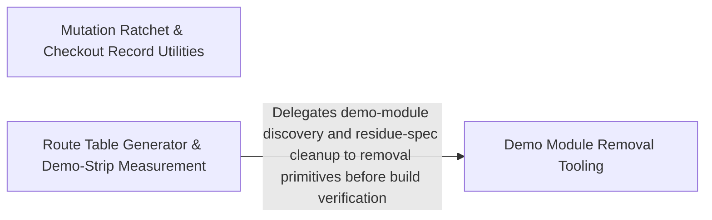

---
tags:
  - 2brain
  - 2brain/arch
  - project/boilerplate-vue-frontend
type: architecture
component: Route_Table_Generation
---

## Details

Build tooling that generates the REST route table from the OpenAPI document, alongside the demo-strip tooling that removes demo modules and measures the resulting footprint.

### Mutation Ratchet & Checkout Record Utilities [[Expand]](./Mutation_Ratchet_Checkout_Record_Utilities.md)
The per-file mutation-score ratchet (compare a Stryker report against mutation-baseline.json, refuse partial runs, lock in improvements) plus the checkout view's data-lifecycle utilities — blocking-error, missing-record, stale-record, reset-on-viewer-change, and clear-query-on-mount hooks — and the checkout error model and dialog store that surface those states. This is the test-quality gate and the checkout record-handling band.

**Related Classes/Methods**:

- `src.infrastructure.utils.use-blocking-error.useBlockingError`:58-85
- `src.infrastructure.utils.use-stale-record.useStaleRecord`:48-74

**Source Files:**

- `scripts/mutation/check-baseline.ts`
  - `scripts.mutation.check-baseline.map() callback` (L64-L64) - Function
  - `scripts.mutation.check-baseline.counts.held.comparisons.filter() callback` (L75-L75) - Function
  - `scripts.mutation.check-baseline.counts.improved.comparisons.filter() callback` (L76-L76) - Function
  - `scripts.mutation.check-baseline.counts.added.comparisons.filter() callback` (L77-L77) - Function
  - `scripts.mutation.check-baseline.counts.removed.comparisons.filter() callback` (L78-L78) - Function
  - `scripts.mutation.check-baseline.comparisons.filter() callback` (L98-L98) - Function
- `src/infrastructure/utils/use-blocking-error.ts`
  - `src.infrastructure.utils.use-blocking-error.UseBlockingErrorReturn` (L18-L49) - Interface
  - `src.infrastructure.utils.use-blocking-error.useBlockingError` (L58-L85) - Class
  - `src.infrastructure.utils.use-blocking-error.useBlockingError.report` (L72-L76) - Method
  - `src.infrastructure.utils.use-blocking-error.useBlockingError.warn` (L77-L80) - Method
  - `src.infrastructure.utils.use-blocking-error.useBlockingError.clear` (L81-L83) - Method
- `src/infrastructure/utils/use-clear-query-on-mount.ts`
  - `src.infrastructure.utils.use-clear-query-on-mount.useClearQueryOnMount` (L22-L29) - Class
  - `src.infrastructure.utils.use-clear-query-on-mount.useClearQueryOnMount.onMounted() callback` (L26-L28) - Function
- `src/infrastructure/utils/use-missing-record.ts`
  - `src.infrastructure.utils.use-missing-record.useMissingRecord` (L30-L50) - Class
  - `src.infrastructure.utils.use-missing-record.useMissingRecord.<function>` (L34-L49) - Function
  - `src.infrastructure.utils.use-missing-record.useMissingRecord.<function>.status` (L35-L35) - Class
  - `src.infrastructure.utils.use-missing-record.useMissingRecord.<function>.status.find() callback` (L35-L35) - Function
- `src/infrastructure/utils/use-reset-on-viewer-change.ts`
  - `src.infrastructure.utils.use-reset-on-viewer-change.useResetOnViewerChange` (L22-L32) - Class
  - `src.infrastructure.utils.use-reset-on-viewer-change.watch() callback` (L27-L27) - Function
  - `src.infrastructure.utils.use-reset-on-viewer-change.useResetOnViewerChange.watch() callback` (L28-L30) - Function
- `src/infrastructure/utils/use-stale-record.ts`
  - `src.infrastructure.utils.use-stale-record.UseStaleRecordReturn` (L17-L39) - Interface
  - `src.infrastructure.utils.use-stale-record.useStaleRecord` (L48-L74) - Class
  - `src.infrastructure.utils.use-stale-record.useStaleRecord.handle` (L59-L64) - Method
  - `src.infrastructure.utils.use-stale-record.useStaleRecord.reloadLatest` (L65-L69) - Method
  - `src.infrastructure.utils.use-stale-record.useStaleRecord.clear` (L70-L72) - Method
- `src/modules/cart/domain/checkout-errors.ts`
  - `src.modules.cart.domain.checkout-errors.CheckoutShortfallLine` (L16-L21) - Interface
  - `src.modules.cart.domain.checkout-errors.UnavailableCartLine` (L28-L31) - Interface
  - `src.modules.cart.domain.checkout-errors.lines` (L123-L125) - Class
  - `src.modules.cart.domain.checkout-errors.lines.filter() callback` (L124-L124) - Function
  - `src.modules.cart.domain.checkout-errors.lines.rawLines.map() callback` (L124-L124) - Function
  - `src.modules.cart.domain.checkout-errors.classifyCheckoutError.lines.filter() callback` (L131-L131) - Function
  - `src.modules.cart.domain.checkout-errors.classifyCheckoutError.lines.rawLines.map() callback` (L131-L131) - Function
- `src/modules/cart/store.ts`
  - `src.modules.cart.store.useCartStore` (L48-L355) - Class
  - `src.modules.cart.store.useCartStore.defineStore('cart') callback` (L48-L355) - Function
  - `src.modules.cart.store.defineStore('cart') callback.cartItems` (L66-L66) - Class
  - `src.modules.cart.store.useCartStore.defineStore('cart') callback.cartItems.computed() callback` (L66-L66) - Function
  - `src.modules.cart.store.defineStore('cart') callback.cartSummary` (L71-L71) - Class
  - `src.modules.cart.store.useCartStore.defineStore('cart') callback.cartSummary.computed() callback` (L71-L71) - Function
  - `src.modules.cart.store.defineStore('cart') callback.cartShipping` (L77-L77) - Class
  - `src.modules.cart.store.useCartStore.defineStore('cart') callback.cartShipping.computed() callback` (L77-L77) - Function
  - `src.modules.cart.store.useCartStore.defineStore('cart') callback.liveSummary` (L89-L89) - Class
  - `src.modules.cart.store.useCartStore.defineStore('cart') callback.liveSummary.computed() callback` (L89-L89) - Function
  - `src.modules.cart.store.defineStore('cart') callback.badgeQuantity` (L95-L95) - Class
  - `src.modules.cart.store.useCartStore.defineStore('cart') callback.badgeQuantity.computed() callback` (L95-L95) - Function
  - `src.modules.cart.store.useCartStore.defineStore('cart') callback.badgeMoney.computed() callback` (L102-L105) - Function
  - `src.modules.cart.store.defineStore('cart') callback.badgeMoney` (L102-L106) - Class
  - `src.modules.cart.store.useCartStore.defineStore('cart') callback.useResetOnViewerChange() callback` (L130-L134) - Function
  - `src.modules.cart.store.defineStore('cart') callback.fetchSummary` (L142-L154) - Class
  - `src.modules.cart.store.useCartStore.defineStore('cart') callback.fetchSummary.then() callback` (L144-L147) - Function
  - `src.modules.cart.store.useCartStore.defineStore('cart') callback.fetchSummary.catch() callback` (L148-L154) - Function
  - `src.modules.cart.store.defineStore('cart') callback.fetchCart` (L161-L167) - Class
  - `src.modules.cart.store.useCartStore.defineStore('cart') callback.fetchCart.fetchAny() callback` (L162-L166) - Function
  - `src.modules.cart.store.useCartStore.defineStore('cart') callback.fetchCart.fetchAny() callback.then() callback` (L163-L166) - Function
  - `src.modules.cart.store.useCartStore.defineStore('cart') callback.addCartItemAction` (L178-L186) - Class
  - `src.modules.cart.store.useCartStore.defineStore('cart') callback.addCartItemAction.fetchAny() callback` (L179-L185) - Function
  - `src.modules.cart.store.useCartStore.defineStore('cart') callback.addCartItemAction.fetchAny() callback.then() callback` (L180-L185) - Function
  - `src.modules.cart.store.defineStore('cart') callback.updateCartItem` (L195-L203) - Class
  - `src.modules.cart.store.useCartStore.defineStore('cart') callback.updateCartItem.fetchAny() callback` (L196-L202) - Function
  - `src.modules.cart.store.useCartStore.defineStore('cart') callback.updateCartItem.fetchAny() callback.then() callback` (L197-L202) - Function
  - `src.modules.cart.store.defineStore('cart') callback.setShippingMethod` (L214-L223) - Class
  - `src.modules.cart.store.useCartStore.defineStore('cart') callback.setShippingMethod.fetchAny() callback` (L215-L222) - Function
  - `src.modules.cart.store.useCartStore.defineStore('cart') callback.setShippingMethod.fetchAny() callback.then() callback` (L216-L222) - Function
  - `src.modules.cart.store.useCartStore.defineStore('cart') callback.removeCartItemAction` (L231-L239) - Class
  - `src.modules.cart.store.useCartStore.defineStore('cart') callback.removeCartItemAction.fetchAny() callback` (L232-L238) - Function
  - `src.modules.cart.store.useCartStore.defineStore('cart') callback.removeCartItemAction.fetchAny() callback.then() callback` (L233-L238) - Function
  - `src.modules.cart.store.useCartStore.defineStore('cart') callback.clearCartAction` (L247-L255) - Class
  - `src.modules.cart.store.useCartStore.defineStore('cart') callback.clearCartAction.fetchAny() callback` (L248-L254) - Function
  - `src.modules.cart.store.useCartStore.defineStore('cart') callback.clearCartAction.fetchAny() callback.then() callback` (L249-L254) - Function
  - `src.modules.cart.store.defineStore('cart') callback.checkout` (L292-L316) - Class
  - `src.modules.cart.store.useCartStore.defineStore('cart') callback.checkout.fetchAny() callback` (L293-L315) - Function
  - `src.modules.cart.store.useCartStore.defineStore('cart') callback.checkout.fetchAny() callback.then() callback` (L297-L307) - Function
  - `src.modules.cart.store.useCartStore.defineStore('cart') callback.checkout.fetchAny() callback.catch() callback` (L308-L315) - Function
  - `src.modules.cart.store.defineStore('cart') callback.reorder` (L326-L334) - Class
  - `src.modules.cart.store.useCartStore.defineStore('cart') callback.reorder.fetchAny() callback` (L327-L333) - Function
  - `src.modules.cart.store.useCartStore.defineStore('cart') callback.reorder.fetchAny() callback.then() callback` (L328-L333) - Function
- `src/modules/locales/composables/use-dictionary-cell-editor.ts`
  - `src.modules.locales.composables.use-dictionary-cell-editor.useDictionaryCellEditor` (L38-L251) - Function
  - `src.modules.locales.composables.use-dictionary-cell-editor.useDictionaryCellEditor.markSaved` (L93-L98) - Class
  - `src.modules.locales.composables.use-dictionary-cell-editor.useDictionaryCellEditor.markSaved.setTimeout() callback` (L95-L97) - Function
  - `src.modules.locales.composables.use-dictionary-cell-editor.useDictionaryCellEditor.settleWrite` (L109-L123) - Class
  - `src.modules.locales.composables.use-dictionary-cell-editor.useDictionaryCellEditor.settleWrite.request.then() callback` (L111-L114) - Function
  - `src.modules.locales.composables.use-dictionary-cell-editor.useDictionaryCellEditor.settleWrite.catch() callback` (L115-L123) - Function
  - `src.modules.locales.composables.use-dictionary-cell-editor.handleCellBlur` (L139-L156) - Class
  - `src.modules.locales.composables.use-dictionary-cell-editor.useDictionaryCellEditor.handleCellBlur.request.then() callback` (L154-L154) - Function
  - `src.modules.locales.composables.use-dictionary-cell-editor.handleCellClear` (L170-L205) - Class
  - `src.modules.locales.composables.use-dictionary-cell-editor.useDictionaryCellEditor.handleCellClear.then() callback` (L186-L204) - Function
  - `src.modules.locales.composables.use-dictionary-cell-editor.useDictionaryCellEditor.handleCellClear.then() callback.then() callback` (L195-L201) - Function
- `src/modules/wishlist/store.ts`
  - `src.modules.wishlist.store.useWishlistStore` (L24-L153) - Class
  - `src.modules.wishlist.store.useWishlistStore.defineStore('wishlist') callback` (L24-L153) - Function
  - `src.modules.wishlist.store.useWishlistStore.defineStore('wishlist') callback.savedProductIds` (L49-L49) - Class
  - `src.modules.wishlist.store.useWishlistStore.defineStore('wishlist') callback.savedProductIds.computed() callback` (L49-L49) - Function
  - `src.modules.wishlist.store.useWishlistStore.defineStore('wishlist') callback.savedProductIds.computed() callback.items.value.map() callback` (L49-L49) - Function
  - `src.modules.wishlist.store.defineStore('wishlist') callback.fetchWishlist` (L64-L70) - Class
  - `src.modules.wishlist.store.useWishlistStore.defineStore('wishlist') callback.fetchWishlist.fetchAny() callback` (L65-L69) - Function
  - `src.modules.wishlist.store.useWishlistStore.defineStore('wishlist') callback.fetchWishlist.fetchAny() callback.then() callback` (L66-L69) - Function
  - `src.modules.wishlist.store.defineStore('wishlist') callback.ensureWishlist` (L78-L84) - Class
  - `src.modules.wishlist.store.useWishlistStore.defineStore('wishlist') callback.ensureWishlist.catch() callback` (L79-L82) - Function
  - `src.modules.wishlist.store.defineStore('wishlist') callback.addToWishlist` (L93-L99) - Class
  - `src.modules.wishlist.store.useWishlistStore.defineStore('wishlist') callback.addToWishlist.fetchAny() callback` (L94-L98) - Function
  - `src.modules.wishlist.store.useWishlistStore.defineStore('wishlist') callback.addToWishlist.fetchAny() callback.then() callback` (L95-L98) - Function
  - `src.modules.wishlist.store.defineStore('wishlist') callback.removeFromWishlist` (L107-L113) - Class
  - `src.modules.wishlist.store.useWishlistStore.defineStore('wishlist') callback.removeFromWishlist.fetchAny() callback` (L108-L112) - Function
  - `src.modules.wishlist.store.useWishlistStore.defineStore('wishlist') callback.removeFromWishlist.fetchAny() callback.then() callback` (L109-L112) - Function
  - `src.modules.wishlist.store.defineStore('wishlist') callback.moveToCart` (L123-L131) - Class
  - `src.modules.wishlist.store.useWishlistStore.defineStore('wishlist') callback.moveToCart.fetchAny() callback` (L124-L130) - Function
  - `src.modules.wishlist.store.useWishlistStore.defineStore('wishlist') callback.moveToCart.fetchAny() callback.then() callback` (L125-L130) - Function
  - `src.modules.wishlist.store.useWishlistStore.defineStore('wishlist') callback.moveToCart.fetchAny() callback.then() callback.then() callback` (L129-L129) - Function
  - `src.modules.wishlist.store.useWishlistStore.defineStore('wishlist') callback.useResetOnViewerChange() callback` (L137-L140) - Function
- `src/ui/dialog.ts`
  - `src.ui.dialog.DialogRequest` (L16-L44) - Interface
  - `src.ui.dialog.DialogEntry` (L49-L58) - Interface
  - `src.ui.dialog.useDialogStore` (L76-L109) - Class
  - `src.ui.dialog.useDialogStore.defineStore('dialog') callback` (L76-L109) - Function
  - `src.ui.dialog.defineStore('dialog') callback.confirm` (L93-L96) - Class
  - `src.ui.dialog.useDialogStore.defineStore('dialog') callback.confirm.<function>` (L94-L96) - Function

### Demo Module Removal Tooling
The live-checkout demo removal flow: reads the demo module manifest, deletes each demo module's folder, strips the module registry, and removes cross-module specs that require or import a removed module (via requires-module headers and import detection). Also carries the idempotency key keeper and product-picker/deactivate-then-delete helpers that the removal path touches. This is the destructive demo:remove side, distinct from the report-only measure.

**Related Classes/Methods**:

- `scripts.demo.demo-module-names.readDemoModuleNames`:23-30
- `scripts.demo.demo-remove-tests.removeResidueSpecs`:77-91
- `scripts.demo.demo-remove-tests.headerProblems`:104-117
- `scripts.demo.demo-remove-tests.requiredModules`:36-44
- `src.infrastructure.http.idempotency.IdempotencyKeyKeeper`:18-35

**Source Files:**

- `scripts/demo/demo-module-names.ts`
  - `scripts.demo.demo-module-names.readDemoModuleNames` (L23-L30) - Class
  - `scripts.demo.demo-module-names.readDemoModuleNames.map() callback` (L29-L29) - Function
- `scripts/demo/demo-remove-tests.ts`
  - `scripts.demo.demo-remove-tests.RemovalNote` (L17-L22) - Interface
  - `scripts.demo.demo-remove-tests.requiredModules` (L36-L44) - Class
  - `scripts.demo.demo-remove-tests.requiredModules.map() callback` (L42-L42) - Function
  - `scripts.demo.demo-remove-tests.requiredModules.filter() callback` (L43-L43) - Function
  - `scripts.demo.demo-remove-tests.walkTypeScript` (L47-L54) - Class
  - `scripts.demo.demo-remove-tests.walkTypeScript.flatMap() callback` (L49-L53) - Function
  - `scripts.demo.demo-remove-tests.removeResidueSpecs` (L77-L91) - Class
  - `scripts.demo.demo-remove-tests.removeResidueSpecs.deleted.filter() callback.needs` (L80-L80) - Class
  - `scripts.demo.demo-remove-tests.removeResidueSpecs.deleted.filter() callback.needs.find() callback` (L80-L80) - Function
  - `scripts.demo.demo-remove-tests.headerProblems` (L104-L117) - Class
  - `scripts.demo.demo-remove-tests.headerProblems.flatMap() callback` (L105-L117) - Function
  - `scripts.demo.demo-remove-tests.headerProblems.flatMap() callback.required.filter() callback` (L115-L115) - Function
  - `scripts.demo.demo-remove-tests.headerProblems.flatMap() callback.map() callback` (L116-L116) - Function
- `src/infrastructure/http/idempotency.ts`
  - `src.infrastructure.http.idempotency.IdempotencyKeyKeeper` (L18-L35) - Interface
  - `src.infrastructure.http.idempotency.useIdempotencyKey` (L44-L61) - Class
  - `src.infrastructure.http.idempotency.useIdempotencyKey.withKey` (L52-L56) - Method
  - `src.infrastructure.http.idempotency.useIdempotencyKey.settle` (L57-L59) - Method
- `src/modules/delivery/store.ts`
  - `src.modules.delivery.store.defineStore('delivery') callback.fetchMethods` (L62-L69) - Class
  - `src.modules.delivery.store.defineStore('delivery') callback.fetchShipmentForOrder` (L77-L91) - Class
  - `src.modules.delivery.store.defineStore('delivery') callback.start` (L102-L103) - Class
  - `src.modules.delivery.store.defineStore('delivery') callback.ship` (L115-L124) - Class
  - `src.modules.delivery.store.defineStore('delivery') callback.deliver` (L135-L141) - Class
  - `src.modules.delivery.store.defineStore('delivery') callback.fulfill` (L152-L153) - Class
- `src/modules/feedback/store.ts`
  - `src.modules.feedback.store.useFeedbackStore` (L43-L143) - Class
  - `src.modules.feedback.store.useFeedbackStore.defineStore('feedback') callback` (L43-L143) - Function
  - `src.modules.feedback.store.defineStore('feedback') callback.submitContact` (L113-L124) - Class
  - `src.modules.feedback.store.useFeedbackStore.defineStore('feedback') callback.submitContact.fetchAny() callback` (L114-L123) - Function
  - `src.modules.feedback.store.useFeedbackStore.defineStore('feedback') callback.submitContact.fetchAny() callback.then() callback` (L116-L119) - Function
  - `src.modules.feedback.store.useFeedbackStore.defineStore('feedback') callback.submitContact.fetchAny() callback.catch() callback` (L120-L123) - Function
- `src/modules/inventory/composables/use-product-picker.ts`
  - `src.modules.inventory.composables.use-product-picker.ProductPickerOption` (L15-L18) - Interface
  - `src.modules.inventory.composables.use-product-picker.useProductPicker` (L38-L97) - Class
  - `src.modules.inventory.composables.use-product-picker.useProductPicker.runSearch` (L51-L59) - Class
  - `src.modules.inventory.composables.use-product-picker.useProductPicker.runSearch.debounce() callback` (L51-L59) - Function
  - `src.modules.inventory.composables.use-product-picker.useProductPicker.runSearch.debounce() callback.then() callback` (L53-L55) - Function
  - `src.modules.inventory.composables.use-product-picker.useProductPicker.runSearch.debounce() callback.catch() callback` (L58-L58) - Function
  - `src.modules.inventory.composables.use-product-picker.useProductPicker.watch() callback` (L61-L61) - Function
  - `src.modules.inventory.composables.use-product-picker.options` (L67-L73) - Class
  - `src.modules.inventory.composables.use-product-picker.useProductPicker.options.computed() callback` (L67-L73) - Function
  - `src.modules.inventory.composables.use-product-picker.useProductPicker.options.computed() callback.products` (L68-L71) - Class
  - `src.modules.inventory.composables.use-product-picker.useProductPicker.options.computed() callback.products.results.value.some() callback` (L69-L69) - Function
  - `src.modules.inventory.composables.use-product-picker.useProductPicker.options.computed() callback.products.map() callback` (L72-L72) - Function
  - `src.modules.inventory.composables.use-product-picker.pin` (L81-L94) - Class
  - `src.modules.inventory.composables.use-product-picker.useProductPicker.pin.results.value.some() callback` (L82-L82) - Function
  - `src.modules.inventory.composables.use-product-picker.useProductPicker.pin.then() callback` (L88-L90) - Function
  - `src.modules.inventory.composables.use-product-picker.useProductPicker.pin.catch() callback` (L93-L93) - Function
- `src/modules/inventory/store.ts`
  - `src.modules.inventory.store.useInventoryStore` (L48-L216) - Class
  - `src.modules.inventory.store.useInventoryStore.defineStore('inventory') callback` (L48-L216) - Function
  - `src.modules.inventory.store.defineStore('inventory') callback.fetchMovements` (L107-L115) - Class
  - `src.modules.inventory.store.useInventoryStore.defineStore('inventory') callback.fetchMovements.fetchAny() callback` (L108-L115) - Function
  - `src.modules.inventory.store.useInventoryStore.defineStore('inventory') callback.fetchMovements.fetchAny() callback.then() callback` (L110-L114) - Function
  - `src.modules.inventory.store.defineStore('inventory') callback.fetchLevels` (L124-L132) - Class
  - `src.modules.inventory.store.useInventoryStore.defineStore('inventory') callback.fetchLevels.fetchAny() callback` (L125-L132) - Function
  - `src.modules.inventory.store.useInventoryStore.defineStore('inventory') callback.fetchLevels.fetchAny() callback.then() callback` (L127-L131) - Function
  - `src.modules.inventory.store.defineStore('inventory') callback.receive` (L142-L153) - Class
  - `src.modules.inventory.store.useInventoryStore.defineStore('inventory') callback.receive.fetchAny() callback` (L143-L152) - Function
  - `src.modules.inventory.store.useInventoryStore.defineStore('inventory') callback.receive.fetchAny() callback.then() callback` (L145-L148) - Function
  - `src.modules.inventory.store.useInventoryStore.defineStore('inventory') callback.receive.fetchAny() callback.catch() callback` (L149-L152) - Function
  - `src.modules.inventory.store.defineStore('inventory') callback.adjust` (L163-L174) - Class
  - `src.modules.inventory.store.useInventoryStore.defineStore('inventory') callback.adjust.fetchAny() callback` (L164-L173) - Function
  - `src.modules.inventory.store.useInventoryStore.defineStore('inventory') callback.adjust.fetchAny() callback.then() callback` (L166-L169) - Function
  - `src.modules.inventory.store.useInventoryStore.defineStore('inventory') callback.adjust.fetchAny() callback.catch() callback` (L170-L173) - Function
  - `src.modules.inventory.store.defineStore('inventory') callback.sweep` (L181-L188) - Class
  - `src.modules.inventory.store.useInventoryStore.defineStore('inventory') callback.sweep.fetchAny() callback` (L182-L187) - Function
  - `src.modules.inventory.store.useInventoryStore.defineStore('inventory') callback.sweep.fetchAny() callback.then() callback` (L183-L186) - Function
  - `src.modules.inventory.store.defineStore('inventory') callback.sweep.fetchAny() callback.then() callback.then() callback` (L185-L185) - Function
  - `src.modules.inventory.store.useInventoryStore.defineStore('inventory') callback.sweep.fetchAny() callback.then() callback.then() callback` (L186-L186) - Function
  - `src.modules.inventory.store.useInventoryStore.defineStore('inventory') callback.reloadAfterWrite` (L199-L202) - Class
  - `src.modules.inventory.store.defineStore('inventory') callback.reloadAfterWrite.then() callback` (L201-L201) - Function
  - `src.modules.inventory.store.useInventoryStore.defineStore('inventory') callback.reloadAfterWrite.then() callback` (L202-L202) - Function
- `src/modules/locales/domain/deactivate-then-delete.ts`
  - `src.modules.locales.domain.deactivate-then-delete.deactivateThenDelete` (L19-L39) - Function
  - `src.modules.locales.domain.deactivate-then-delete.deactivateThenDelete.deactivated.then() callback` (L27-L37) - Function
  - `src.modules.locales.domain.deactivate-then-delete.deactivateThenDelete.deactivated.then() callback.then() callback` (L29-L29) - Function
  - `src.modules.locales.domain.deactivate-then-delete.deactivateThenDelete.deactivated.then() callback.catch() callback` (L30-L37) - Function
- `src/modules/returns/domain/returnable-lines.ts`
  - `src.modules.returns.domain.returnable-lines.ReturnableLine` (L12-L21) - Interface
  - `src.modules.returns.domain.returnable-lines.returnableLines.held` (L64-L70) - Class
  - `src.modules.returns.domain.returnable-lines.returnableLines.held.returns.filter() callback` (L66-L66) - Function
  - `src.modules.returns.domain.returnable-lines.returnableLines.held.flatMap() callback` (L67-L68) - Function
  - `src.modules.returns.domain.returnable-lines.returnableLines.held.flatMap() callback.lines.map() callback` (L68-L68) - Function
  - `src.modules.returns.domain.returnable-lines.returnableLines.eligible` (L71-L71) - Class
  - `src.modules.returns.domain.returnable-lines.returnableLines.eligible.items.filter() callback` (L71-L71) - Function
  - `src.modules.returns.domain.returnable-lines.returnableLines.ordered.eligible.map() callback` (L72-L72) - Function
- `src/modules/returns/store.ts`
  - `src.modules.returns.store.useReturnsStore` (L46-L215) - Class
  - `src.modules.returns.store.useReturnsStore.defineStore('returns') callback` (L46-L215) - Function
  - `src.modules.returns.store.defineStore('returns') callback.openReturn` (L111-L129) - Class
  - `src.modules.returns.store.useReturnsStore.defineStore('returns') callback.openReturn.fetchAny() callback` (L112-L121) - Function
  - `src.modules.returns.store.useReturnsStore.defineStore('returns') callback.openReturn.fetchAny() callback.then() callback` (L114-L117) - Function
  - `src.modules.returns.store.useReturnsStore.defineStore('returns') callback.openReturn.fetchAny() callback.catch() callback` (L118-L121) - Function
  - `src.modules.returns.store.useReturnsStore.defineStore('returns') callback.openReturn.then() callback` (L122-L129) - Function
  - `src.modules.returns.store.defineStore('returns') callback.fetchOrderReturns` (L139-L144) - Class
  - `src.modules.returns.store.useReturnsStore.defineStore('returns') callback.fetchOrderReturns.fetchAny() callback` (L140-L140) - Function
  - `src.modules.returns.store.useReturnsStore.defineStore('returns') callback.fetchOrderReturns.then() callback` (L140-L144) - Function
  - `src.modules.returns.store.defineStore('returns') callback.approve` (L152-L153) - Class
  - `src.modules.returns.store.useReturnsStore.defineStore('returns') callback.approve.updateTarget() callback` (L153-L153) - Function
  - `src.modules.returns.store.useReturnsStore.defineStore('returns') callback.approve.updateTarget() callback.then() callback` (L153-L153) - Function
  - `src.modules.returns.store.defineStore('returns') callback.decline` (L162-L167) - Class
  - `src.modules.returns.store.useReturnsStore.defineStore('returns') callback.decline.updateTarget() callback` (L164-L164) - Function
  - `src.modules.returns.store.useReturnsStore.defineStore('returns') callback.decline.updateTarget() callback.then() callback` (L164-L164) - Function
  - `src.modules.returns.store.defineStore('returns') callback.receive` (L177-L191) - Class
  - `src.modules.returns.store.useReturnsStore.defineStore('returns') callback.receive.updateTarget() callback` (L179-L188) - Function
  - `src.modules.returns.store.useReturnsStore.defineStore('returns') callback.receive.updateTarget() callback.then() callback` (L181-L184) - Function
  - `src.modules.returns.store.useReturnsStore.defineStore('returns') callback.receive.updateTarget() callback.catch() callback` (L185-L188) - Function
- `src/ui/organisms/data-table-headers.ts`
  - `src.ui.organisms.data-table-headers.CoreDataTableFieldHeader` (L17-L24) - Interface
  - `src.ui.organisms.data-table-headers.CoreDataTableSyntheticHeader` (L33-L41) - Interface

### Route Table Generator & Demo-Strip Measurement [[Expand]](./Route_Table_Generator_Demo_Strip_Measurement.md)
The core of this subsystem. The route-table generator parses openapi.yaml, derives each operation's anchored path pattern, response/body schema names, and x-module stamp, sorts rows for a stable diff, and emits the generated ROUTES table (with a check-only mode). Paired with it is the report-only demo-strip measurement: assemble a scratch copy (symlinking node_modules, never copying .git), strip the demo modules, and run type-check-only/lint/build-only to measure whether the demo shop is removable. This is the contract→generated backbone edge plus the FE-D4 measure gate.

**Related Classes/Methods**:

- `scripts.contracts.generate-route-table.output`:173-193
- `scripts.contracts.generate-route-table.bodySchemaNameFor`:123-128
- `scripts.contracts.generate-route-table.pathToPatternSource`:98-102
- `scripts.demo.measure-demo-strip.assembleScratchCopy`:50-62
- `scripts.demo.measure-demo-strip.allPassed`

**Source Files:**

- `scripts/contracts/generate-route-table.ts`
  - `scripts.contracts.generate-route-table.OpenApiOperation` (L34-L38) - Interface
  - `scripts.contracts.generate-route-table.OpenApiDocument` (L40-L42) - Interface
  - `scripts.contracts.generate-route-table.pathToPatternSource` (L98-L102) - Class
  - `scripts.contracts.generate-route-table.pathToPatternSource.map() callback` (L101-L101) - Function
  - `scripts.contracts.generate-route-table.bodySchemaNameFor` (L123-L128) - Class
  - `scripts.contracts.generate-route-table.bodySchemaNameFor.contentTypes.some() callback` (L125-L125) - Function
  - `scripts.contracts.generate-route-table.Row` (L131-L138) - Interface
  - `scripts.contracts.generate-route-table.paramCount.filter() callback` (L151-L151) - Function
  - `scripts.contracts.generate-route-table.rows.sort() callback` (L164-L167) - Function
  - `scripts.contracts.generate-route-table.output` (L173-L193) - Class
  - `scripts.contracts.generate-route-table.output.rows.map() callback` (L193-L193) - Function
- `scripts/demo/demo-remove-tests.ts`
  - `scripts.demo.demo-remove-tests.removeResidueSpecs.deleted` (L78-L85) - Class
  - `scripts.demo.demo-remove-tests.removeResidueSpecs.deleted.filter() callback` (L78-L85) - Function
  - `scripts.demo.demo-remove-tests.removeResidueSpecs.deleted.map() callback` (L87-L90) - Function
- `scripts/demo/demo-remove.ts`
  - `scripts.demo.demo-remove.findResidueTests` (L79-L95) - Class
  - `scripts.demo.demo-remove.findResidueTests.pattern` (L80-L80) - Class
  - `scripts.demo.demo-remove.findResidueTests.pattern.names.map() callback` (L80-L80) - Function
  - `scripts.demo.demo-remove.findResidueTests.filter() callback` (L89-L89) - Function
- `scripts/demo/measure-demo-strip.ts`
  - `scripts.demo.measure-demo-strip.Check` (L36-L40) - Interface
  - `scripts.demo.measure-demo-strip.assembleScratchCopy` (L50-L62) - Class
  - `scripts.demo.measure-demo-strip.assembleScratchCopy.filter` (L56-L56) - Method
  - `scripts.demo.measure-demo-strip.results` (L89-L89) - Class
  - `scripts.demo.measure-demo-strip.results.CHECKS.map() callback` (L89-L89) - Function
  - `scripts.demo.measure-demo-strip.allPassed` (L95-L95) - Class
  - `scripts.demo.measure-demo-strip.allPassed.results.every() callback` (L95-L95) - Function
- `scripts/mutation/baseline.ts`
  - `scripts.mutation.baseline.MutationReport` (L58-L60) - Interface
  - `scripts.mutation.baseline.MutationBaseline` (L62-L67) - Interface
  - `scripts.mutation.baseline.FileComparison` (L71-L76) - Interface
  - `scripts.mutation.baseline.compareToBaseline` (L140-L159) - Class
  - `scripts.mutation.baseline.compareToBaseline.files.map() callback` (L147-L158) - Function
  - `scripts.mutation.baseline.missingFromReport` (L173-L179) - Class
  - `scripts.mutation.baseline.missingFromReport.filter() callback` (L178-L178) - Function
- `src/modules/delivery/store.ts`
  - `src.modules.delivery.store.useDeliveryStore` (L30-L167) - Class
  - `src.modules.delivery.store.useDeliveryStore.defineStore('delivery') callback` (L30-L167) - Function
  - `src.modules.delivery.store.useDeliveryStore.defineStore('delivery') callback.fetchMethods.fetchAny() callback` (L63-L68) - Function
  - `src.modules.delivery.store.useDeliveryStore.defineStore('delivery') callback.fetchMethods.fetchAny() callback.then() callback` (L64-L68) - Function
  - `src.modules.delivery.store.useDeliveryStore.defineStore('delivery') callback.fetchShipmentForOrder.fetchAny() callback` (L78-L90) - Function
  - `src.modules.delivery.store.useDeliveryStore.defineStore('delivery') callback.fetchShipmentForOrder.fetchAny() callback.then() callback` (L80-L83) - Function
  - `src.modules.delivery.store.useDeliveryStore.defineStore('delivery') callback.fetchShipmentForOrder.fetchAny() callback.catch() callback` (L84-L90) - Function
  - `src.modules.delivery.store.useDeliveryStore.defineStore('delivery') callback.start.fetchAny() callback` (L103-L103) - Function
  - `src.modules.delivery.store.useDeliveryStore.defineStore('delivery') callback.start.fetchAny() callback.then() callback` (L103-L103) - Function
  - `src.modules.delivery.store.useDeliveryStore.defineStore('delivery') callback.ship.fetchAny() callback` (L116-L123) - Function
  - `src.modules.delivery.store.useDeliveryStore.defineStore('delivery') callback.ship.fetchAny() callback.then() callback` (L120-L123) - Function
  - `src.modules.delivery.store.useDeliveryStore.defineStore('delivery') callback.deliver.fetchAny() callback` (L136-L140) - Function
  - `src.modules.delivery.store.useDeliveryStore.defineStore('delivery') callback.deliver.fetchAny() callback.then() callback` (L137-L140) - Function
  - `src.modules.delivery.store.useDeliveryStore.defineStore('delivery') callback.fulfill.fetchAny() callback` (L153-L153) - Function
  - `src.modules.delivery.store.useDeliveryStore.defineStore('delivery') callback.fulfill.fetchAny() callback.then() callback` (L153-L153) - Function
- `src/modules/locales/composables/use-dictionary-aggregation.ts`
  - `src.modules.locales.composables.use-dictionary-aggregation.useDictionaryAggregation.tenantKind.computed() callback` (L36-L36) - Function
  - `src.modules.locales.composables.use-dictionary-aggregation.useDictionaryAggregation.tenantKind.computed() callback.tenants.value.find() callback` (L36-L36) - Function
  - `src.modules.locales.composables.use-dictionary-aggregation.useDictionaryAggregation.hasBaseline.computed() callback` (L43-L44) - Function
  - `src.modules.locales.composables.use-dictionary-aggregation.useDictionaryAggregation.languages.computed() callback` (L53-L54) - Function
  - `src.modules.locales.composables.use-dictionary-aggregation.useDictionaryAggregation.languages.computed() callback.capabilities.value.filter() callback` (L54-L54) - Function
  - `src.modules.locales.composables.use-dictionary-aggregation.useDictionaryAggregation.tenantOptions.computed() callback` (L60-L61) - Function
  - `src.modules.locales.composables.use-dictionary-aggregation.useDictionaryAggregation.tenantOptions.computed() callback.tenants.value.map() callback` (L61-L61) - Function
  - `src.modules.locales.composables.use-dictionary-aggregation.useDictionaryAggregation.entriesIndex` (L87-L96) - Class
  - `src.modules.locales.composables.use-dictionary-aggregation.useDictionaryAggregation.entriesIndex.computed() callback` (L87-L96) - Function
  - `src.modules.locales.composables.use-dictionary-aggregation.useDictionaryAggregation.entriesIndex.computed() callback.filter() callback` (L92-L92) - Function
  - `src.modules.locales.composables.use-dictionary-aggregation.useDictionaryAggregation.entriesIndex.computed() callback.map() callback` (L93-L93) - Function
  - `src.modules.locales.composables.use-dictionary-aggregation.useDictionaryAggregation.baselines` (L101-L105) - Class
  - `src.modules.locales.composables.use-dictionary-aggregation.useDictionaryAggregation.baselines.computed() callback` (L101-L105) - Function
  - `src.modules.locales.composables.use-dictionary-aggregation.useDictionaryAggregation.allKeys.computed() callback` (L138-L145) - Function
  - `src.modules.locales.composables.use-dictionary-aggregation.useDictionaryAggregation.missingByTag.computed() callback` (L150-L156) - Function
  - `src.modules.locales.composables.use-dictionary-aggregation.useDictionaryAggregation.missingByTag.computed() callback.languages.value.map() callback` (L152-L155) - Function
  - `src.modules.locales.composables.use-dictionary-aggregation.useDictionaryAggregation.missingByTag.computed() callback.languages.value.map() callback.allKeys.value.filter() callback` (L154-L154) - Function
  - `src.modules.locales.composables.use-dictionary-aggregation.useDictionaryAggregation.loadLanguage.then() callback` (L167-L171) - Function
  - `src.modules.locales.composables.use-dictionary-aggregation.useDictionaryAggregation.loadBoard.then() callback` (L178-L178) - Function
  - `src.modules.locales.composables.use-dictionary-aggregation.useDictionaryAggregation.loadBoard.then() callback.languages.value.map() callback` (L178-L178) - Function
  - `src.modules.locales.composables.use-dictionary-aggregation.useDictionaryAggregation.loadBoard.catch() callback` (L179-L179) - Function
- `src/modules/locales/domain/deactivate-then-delete.ts`
  - `src.modules.locales.domain.deactivate-then-delete.deactivateThenDelete.deactivated.then() callback.catch() callback.restored` (L31-L33) - Class
  - `src.modules.locales.domain.deactivate-then-delete.deactivateThenDelete.deactivated.then() callback.catch() callback.restored.catch() callback` (L32-L32) - Function
  - `src.modules.locales.domain.deactivate-then-delete.deactivateThenDelete.deactivated.then() callback.catch() callback.restored.then() callback` (L34-L36) - Function
- `src/modules/payments/composables/use-order-refund.ts`
  - `src.modules.payments.composables.use-order-refund.useOrderRefund` (L25-L82) - Class
  - `src.modules.payments.composables.use-order-refund.useOrderRefund.watch() callback` (L41-L43) - Function
  - `src.modules.payments.composables.use-order-refund.useOrderRefund.canRefund.computed() callback` (L51-L51) - Function
  - `src.modules.payments.composables.use-order-refund.useOrderRefund.refund` (L65-L68) - Method
  - `src.modules.payments.composables.use-order-refund.useOrderRefund.refund.then() callback` (L67-L67) - Function
  - `src.modules.payments.composables.use-order-refund.useOrderRefund.refreshPayment` (L77-L80) - Method
  - `src.modules.payments.composables.use-order-refund.useOrderRefund.refreshPayment.then() callback` (L79-L79) - Function
- `src/modules/payments/composables/use-record-offline-payment.ts`
  - `src.modules.payments.composables.use-record-offline-payment.useRecordOfflinePayment` (L20-L39) - Class
  - `src.modules.payments.composables.use-record-offline-payment.useRecordOfflinePayment.recordOfflinePayment` (L34-L37) - Method
  - `src.modules.payments.composables.use-record-offline-payment.useRecordOfflinePayment.recordOfflinePayment.then() callback` (L36-L36) - Function
- `src/modules/payments/domain/payment-errors.ts`
  - `src.modules.payments.domain.payment-errors.UnavailableOrderLine` (L16-L19) - Interface
  - `src.modules.payments.domain.payment-errors.lines` (L71-L73) - Class
  - `src.modules.payments.domain.payment-errors.classifyPaymentError.lines.filter() callback` (L72-L72) - Function
  - `src.modules.payments.domain.payment-errors.classifyPaymentError.lines.rawLines.map() callback` (L72-L72) - Function
- `src/modules/payments/store.ts`
  - `src.modules.payments.store.usePaymentsStore` (L35-L271) - Class
  - `src.modules.payments.store.usePaymentsStore.defineStore('payments') callback` (L35-L271) - Function
  - `src.modules.payments.store.defineStore('payments') callback.fetchMethods` (L85-L91) - Class
  - `src.modules.payments.store.usePaymentsStore.defineStore('payments') callback.fetchMethods.fetchAny() callback` (L86-L90) - Function
  - `src.modules.payments.store.usePaymentsStore.defineStore('payments') callback.fetchMethods.fetchAny() callback.then() callback` (L87-L90) - Function
  - `src.modules.payments.store.defineStore('payments') callback.fetchPaymentForOrder` (L100-L114) - Class
  - `src.modules.payments.store.usePaymentsStore.defineStore('payments') callback.fetchPaymentForOrder.fetchAny() callback` (L101-L113) - Function
  - `src.modules.payments.store.usePaymentsStore.defineStore('payments') callback.fetchPaymentForOrder.fetchAny() callback.then() callback` (L103-L106) - Function
  - `src.modules.payments.store.usePaymentsStore.defineStore('payments') callback.fetchPaymentForOrder.fetchAny() callback.catch() callback` (L107-L113) - Function
  - `src.modules.payments.store.defineStore('payments') callback.payForOrder` (L135-L160) - Class
  - `src.modules.payments.store.usePaymentsStore.defineStore('payments') callback.payForOrder.fetchAny() callback` (L140-L159) - Function
  - `src.modules.payments.store.defineStore('payments') callback.payForOrder.fetchAny() callback.then() callback` (L142-L147) - Function
  - `src.modules.payments.store.usePaymentsStore.defineStore('payments') callback.payForOrder.fetchAny() callback.then() callback` (L149-L154) - Function
  - `src.modules.payments.store.usePaymentsStore.defineStore('payments') callback.payForOrder.fetchAny() callback.catch() callback` (L155-L159) - Function
  - `src.modules.payments.store.defineStore('payments') callback.finishAtProvider` (L172-L178) - Class
  - `src.modules.payments.store.usePaymentsStore.defineStore('payments') callback.finishAtProvider.fetchAny() callback` (L173-L177) - Function
  - `src.modules.payments.store.usePaymentsStore.defineStore('payments') callback.finishAtProvider.fetchAny() callback.then() callback` (L174-L177) - Function
  - `src.modules.payments.store.defineStore('payments') callback.refundForOrder` (L192-L208) - Class
  - `src.modules.payments.store.usePaymentsStore.defineStore('payments') callback.refundForOrder.fetchAny() callback` (L193-L207) - Function
  - `src.modules.payments.store.usePaymentsStore.defineStore('payments') callback.refundForOrder.fetchAny() callback.then() callback` (L199-L203) - Function
  - `src.modules.payments.store.usePaymentsStore.defineStore('payments') callback.refundForOrder.fetchAny() callback.catch() callback` (L204-L207) - Function
  - `src.modules.payments.store.defineStore('payments') callback.recordOfflinePayment` (L222-L234) - Class
  - `src.modules.payments.store.usePaymentsStore.defineStore('payments') callback.recordOfflinePayment.fetchAny() callback` (L223-L233) - Function
  - `src.modules.payments.store.usePaymentsStore.defineStore('payments') callback.recordOfflinePayment.fetchAny() callback.then() callback` (L225-L229) - Function
  - `src.modules.payments.store.usePaymentsStore.defineStore('payments') callback.recordOfflinePayment.fetchAny() callback.catch() callback` (L230-L233) - Function
  - `src.modules.payments.store.defineStore('payments') callback.findOrderByReference` (L248-L257) - Class
  - `src.modules.payments.store.usePaymentsStore.defineStore('payments') callback.findOrderByReference.fetchAny() callback` (L249-L256) - Function
  - `src.modules.payments.store.usePaymentsStore.defineStore('payments') callback.findOrderByReference.fetchAny() callback.then() callback` (L251-L251) - Function
  - `src.modules.payments.store.usePaymentsStore.defineStore('payments') callback.findOrderByReference.fetchAny() callback.catch() callback` (L252-L256) - Function
- `src/ui/vuetify/icons.ts`
  - `src.ui.vuetify.icons.lucideIconSet` (L121-L132) - Class
  - `src.ui.vuetify.icons.lucideIconSet.component` (L131-L131) - Method
