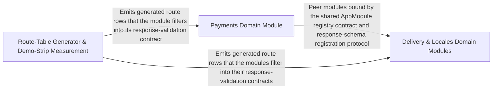

---
tags:
  - 2brain
  - 2brain/arch
  - project/boilerplate-vue-frontend
type: architecture
component: Route_Table_Generator_Demo_Strip_Measurement
---

## Details

The core of this subsystem. The route-table generator parses openapi.yaml, derives each operation's anchored path pattern, response/body schema names, and x-module stamp, sorts rows for a stable diff, and emits the generated ROUTES table (with a check-only mode). Paired with it is the report-only demo-strip measurement: assemble a scratch copy (symlinking node_modules, never copying .git), strip the demo modules, and run type-check-only/lint/build-only to measure whether the demo shop is removable. This is the contract→generated backbone edge plus the FE-D4 measure gate.

### Payments Domain Module
First-class domain module that consumes the generated ROUTES table via the HTTP response-schema map for response validation. It is a subject of the demo-strip measurement (its src/modules/payments/ folder is stripped to verify removability). Contains Pinia stores for payments, order refunds, and offline record handling.

**Related Classes/Methods**:

- `src.modules.payments.store.usePaymentsStore`:35-271
- `src.modules.payments.composables.use-order-refund.useOrderRefund`:25-82

**Source Files:**

- `src/modules/payments/composables/use-order-refund.ts`
  - `src.modules.payments.composables.use-order-refund.useOrderRefund` (L25-L82) - Class
  - `src.modules.payments.composables.use-order-refund.useOrderRefund.watch() callback` (L41-L43) - Function
  - `src.modules.payments.composables.use-order-refund.useOrderRefund.canRefund.computed() callback` (L51-L51) - Function
  - `src.modules.payments.composables.use-order-refund.useOrderRefund.refund` (L65-L68) - Method
  - `src.modules.payments.composables.use-order-refund.useOrderRefund.refund.then() callback` (L67-L67) - Function
  - `src.modules.payments.composables.use-order-refund.useOrderRefund.refreshPayment` (L77-L80) - Method
  - `src.modules.payments.composables.use-order-refund.useOrderRefund.refreshPayment.then() callback` (L79-L79) - Function
- `src/modules/payments/composables/use-record-offline-payment.ts`
  - `src.modules.payments.composables.use-record-offline-payment.useRecordOfflinePayment` (L20-L39) - Class
  - `src.modules.payments.composables.use-record-offline-payment.useRecordOfflinePayment.recordOfflinePayment` (L34-L37) - Method
  - `src.modules.payments.composables.use-record-offline-payment.useRecordOfflinePayment.recordOfflinePayment.then() callback` (L36-L36) - Function
- `src/modules/payments/domain/payment-errors.ts`
  - `src.modules.payments.domain.payment-errors.UnavailableOrderLine` (L16-L19) - Interface
  - `src.modules.payments.domain.payment-errors.lines` (L71-L73) - Class
  - `src.modules.payments.domain.payment-errors.classifyPaymentError.lines.filter() callback` (L72-L72) - Function
  - `src.modules.payments.domain.payment-errors.classifyPaymentError.lines.rawLines.map() callback` (L72-L72) - Function
- `src/modules/payments/store.ts`
  - `src.modules.payments.store.usePaymentsStore` (L35-L271) - Class
  - `src.modules.payments.store.usePaymentsStore.defineStore('payments') callback` (L35-L271) - Function
  - `src.modules.payments.store.defineStore('payments') callback.fetchMethods` (L85-L91) - Class
  - `src.modules.payments.store.usePaymentsStore.defineStore('payments') callback.fetchMethods.fetchAny() callback` (L86-L90) - Function
  - `src.modules.payments.store.usePaymentsStore.defineStore('payments') callback.fetchMethods.fetchAny() callback.then() callback` (L87-L90) - Function
  - `src.modules.payments.store.defineStore('payments') callback.fetchPaymentForOrder` (L100-L114) - Class
  - `src.modules.payments.store.usePaymentsStore.defineStore('payments') callback.fetchPaymentForOrder.fetchAny() callback` (L101-L113) - Function
  - `src.modules.payments.store.usePaymentsStore.defineStore('payments') callback.fetchPaymentForOrder.fetchAny() callback.then() callback` (L103-L106) - Function
  - `src.modules.payments.store.usePaymentsStore.defineStore('payments') callback.fetchPaymentForOrder.fetchAny() callback.catch() callback` (L107-L113) - Function
  - `src.modules.payments.store.defineStore('payments') callback.payForOrder` (L135-L160) - Class
  - `src.modules.payments.store.usePaymentsStore.defineStore('payments') callback.payForOrder.fetchAny() callback` (L140-L159) - Function
  - `src.modules.payments.store.defineStore('payments') callback.payForOrder.fetchAny() callback.then() callback` (L142-L147) - Function
  - `src.modules.payments.store.usePaymentsStore.defineStore('payments') callback.payForOrder.fetchAny() callback.then() callback` (L149-L154) - Function
  - `src.modules.payments.store.usePaymentsStore.defineStore('payments') callback.payForOrder.fetchAny() callback.catch() callback` (L155-L159) - Function
  - `src.modules.payments.store.defineStore('payments') callback.finishAtProvider` (L172-L178) - Class
  - `src.modules.payments.store.usePaymentsStore.defineStore('payments') callback.finishAtProvider.fetchAny() callback` (L173-L177) - Function
  - `src.modules.payments.store.usePaymentsStore.defineStore('payments') callback.finishAtProvider.fetchAny() callback.then() callback` (L174-L177) - Function
  - `src.modules.payments.store.defineStore('payments') callback.refundForOrder` (L192-L208) - Class
  - `src.modules.payments.store.usePaymentsStore.defineStore('payments') callback.refundForOrder.fetchAny() callback` (L193-L207) - Function
  - `src.modules.payments.store.usePaymentsStore.defineStore('payments') callback.refundForOrder.fetchAny() callback.then() callback` (L199-L203) - Function
  - `src.modules.payments.store.usePaymentsStore.defineStore('payments') callback.refundForOrder.fetchAny() callback.catch() callback` (L204-L207) - Function
  - `src.modules.payments.store.defineStore('payments') callback.recordOfflinePayment` (L222-L234) - Class
  - `src.modules.payments.store.usePaymentsStore.defineStore('payments') callback.recordOfflinePayment.fetchAny() callback` (L223-L233) - Function
  - `src.modules.payments.store.usePaymentsStore.defineStore('payments') callback.recordOfflinePayment.fetchAny() callback.then() callback` (L225-L229) - Function
  - `src.modules.payments.store.usePaymentsStore.defineStore('payments') callback.recordOfflinePayment.fetchAny() callback.catch() callback` (L230-L233) - Function
  - `src.modules.payments.store.defineStore('payments') callback.findOrderByReference` (L248-L257) - Class
  - `src.modules.payments.store.usePaymentsStore.defineStore('payments') callback.findOrderByReference.fetchAny() callback` (L249-L256) - Function
  - `src.modules.payments.store.usePaymentsStore.defineStore('payments') callback.findOrderByReference.fetchAny() callback.then() callback` (L251-L251) - Function
  - `src.modules.payments.store.usePaymentsStore.defineStore('payments') callback.findOrderByReference.fetchAny() callback.catch() callback` (L252-L256) - Function

### Delivery & Locales Domain Modules
First-class peer domain modules that consume the generated ROUTES table via the HTTP response-schema map for response validation. They are subjects of the demo-strip measurement (their src/modules/<name>/ folders are stripped to verify removability). Contains Pinia stores for delivery, dictionary aggregation, and locale icon sets.

**Related Classes/Methods**:

- `src.modules.delivery.store.useDeliveryStore`:30-167
- `src.ui.vuetify.icons.lucideIconSet`:121-132

**Source Files:**

- `src/modules/delivery/store.ts`
  - `src.modules.delivery.store.useDeliveryStore` (L30-L167) - Class
  - `src.modules.delivery.store.useDeliveryStore.defineStore('delivery') callback` (L30-L167) - Function
  - `src.modules.delivery.store.useDeliveryStore.defineStore('delivery') callback.fetchMethods.fetchAny() callback` (L63-L68) - Function
  - `src.modules.delivery.store.useDeliveryStore.defineStore('delivery') callback.fetchMethods.fetchAny() callback.then() callback` (L64-L68) - Function
  - `src.modules.delivery.store.useDeliveryStore.defineStore('delivery') callback.fetchShipmentForOrder.fetchAny() callback` (L78-L90) - Function
  - `src.modules.delivery.store.useDeliveryStore.defineStore('delivery') callback.fetchShipmentForOrder.fetchAny() callback.then() callback` (L80-L83) - Function
  - `src.modules.delivery.store.useDeliveryStore.defineStore('delivery') callback.fetchShipmentForOrder.fetchAny() callback.catch() callback` (L84-L90) - Function
  - `src.modules.delivery.store.useDeliveryStore.defineStore('delivery') callback.start.fetchAny() callback` (L103-L103) - Function
  - `src.modules.delivery.store.useDeliveryStore.defineStore('delivery') callback.start.fetchAny() callback.then() callback` (L103-L103) - Function
  - `src.modules.delivery.store.useDeliveryStore.defineStore('delivery') callback.ship.fetchAny() callback` (L116-L123) - Function
  - `src.modules.delivery.store.useDeliveryStore.defineStore('delivery') callback.ship.fetchAny() callback.then() callback` (L120-L123) - Function
  - `src.modules.delivery.store.useDeliveryStore.defineStore('delivery') callback.deliver.fetchAny() callback` (L136-L140) - Function
  - `src.modules.delivery.store.useDeliveryStore.defineStore('delivery') callback.deliver.fetchAny() callback.then() callback` (L137-L140) - Function
  - `src.modules.delivery.store.useDeliveryStore.defineStore('delivery') callback.fulfill.fetchAny() callback` (L153-L153) - Function
  - `src.modules.delivery.store.useDeliveryStore.defineStore('delivery') callback.fulfill.fetchAny() callback.then() callback` (L153-L153) - Function
- `src/modules/locales/composables/use-dictionary-aggregation.ts`
  - `src.modules.locales.composables.use-dictionary-aggregation.useDictionaryAggregation.tenantKind.computed() callback` (L36-L36) - Function
  - `src.modules.locales.composables.use-dictionary-aggregation.useDictionaryAggregation.tenantKind.computed() callback.tenants.value.find() callback` (L36-L36) - Function
  - `src.modules.locales.composables.use-dictionary-aggregation.useDictionaryAggregation.hasBaseline.computed() callback` (L43-L44) - Function
  - `src.modules.locales.composables.use-dictionary-aggregation.useDictionaryAggregation.languages.computed() callback` (L53-L54) - Function
  - `src.modules.locales.composables.use-dictionary-aggregation.useDictionaryAggregation.languages.computed() callback.capabilities.value.filter() callback` (L54-L54) - Function
  - `src.modules.locales.composables.use-dictionary-aggregation.useDictionaryAggregation.tenantOptions.computed() callback` (L60-L61) - Function
  - `src.modules.locales.composables.use-dictionary-aggregation.useDictionaryAggregation.tenantOptions.computed() callback.tenants.value.map() callback` (L61-L61) - Function
  - `src.modules.locales.composables.use-dictionary-aggregation.useDictionaryAggregation.entriesIndex` (L87-L96) - Class
  - `src.modules.locales.composables.use-dictionary-aggregation.useDictionaryAggregation.entriesIndex.computed() callback` (L87-L96) - Function
  - `src.modules.locales.composables.use-dictionary-aggregation.useDictionaryAggregation.entriesIndex.computed() callback.filter() callback` (L92-L92) - Function
  - `src.modules.locales.composables.use-dictionary-aggregation.useDictionaryAggregation.entriesIndex.computed() callback.map() callback` (L93-L93) - Function
  - `src.modules.locales.composables.use-dictionary-aggregation.useDictionaryAggregation.baselines` (L101-L105) - Class
  - `src.modules.locales.composables.use-dictionary-aggregation.useDictionaryAggregation.baselines.computed() callback` (L101-L105) - Function
  - `src.modules.locales.composables.use-dictionary-aggregation.useDictionaryAggregation.allKeys.computed() callback` (L138-L145) - Function
  - `src.modules.locales.composables.use-dictionary-aggregation.useDictionaryAggregation.missingByTag.computed() callback` (L150-L156) - Function
  - `src.modules.locales.composables.use-dictionary-aggregation.useDictionaryAggregation.missingByTag.computed() callback.languages.value.map() callback` (L152-L155) - Function
  - `src.modules.locales.composables.use-dictionary-aggregation.useDictionaryAggregation.missingByTag.computed() callback.languages.value.map() callback.allKeys.value.filter() callback` (L154-L154) - Function
  - `src.modules.locales.composables.use-dictionary-aggregation.useDictionaryAggregation.loadLanguage.then() callback` (L167-L171) - Function
  - `src.modules.locales.composables.use-dictionary-aggregation.useDictionaryAggregation.loadBoard.then() callback` (L178-L178) - Function
  - `src.modules.locales.composables.use-dictionary-aggregation.useDictionaryAggregation.loadBoard.then() callback.languages.value.map() callback` (L178-L178) - Function
  - `src.modules.locales.composables.use-dictionary-aggregation.useDictionaryAggregation.loadBoard.catch() callback` (L179-L179) - Function
- `src/modules/locales/domain/deactivate-then-delete.ts`
  - `src.modules.locales.domain.deactivate-then-delete.deactivateThenDelete.deactivated.then() callback.catch() callback.restored` (L31-L33) - Class
  - `src.modules.locales.domain.deactivate-then-delete.deactivateThenDelete.deactivated.then() callback.catch() callback.restored.catch() callback` (L32-L32) - Function
  - `src.modules.locales.domain.deactivate-then-delete.deactivateThenDelete.deactivated.then() callback.catch() callback.restored.then() callback` (L34-L36) - Function
- `src/ui/vuetify/icons.ts`
  - `src.ui.vuetify.icons.lucideIconSet` (L121-L132) - Class
  - `src.ui.vuetify.icons.lucideIconSet.component` (L131-L131) - Method

### Route-Table Generator & Demo-Strip Measurement
The architectural spine of the project. The route-table generator parses openapi.yaml x-module stamps to emit a generated ROUTES table (pathToPatternSource, schemaNameFor, bodySchemaNameFor, sorted by paramCount/pattern/method) with a check-only CI gate. The demo-strip measurement assembles a scratch copy, strips domain module folders, and runs type-check/lint/build gates to verify the modular/removable claim. A paired destructive twin (demo-remove.ts) and a mutation ratchet (baseline.ts with FileComparison and scoresFrom) lock in test quality on the contract-to-generated edge.

**Related Classes/Methods**:

- `scripts.contracts.generate-route-table.output`:173-193
- `scripts.contracts.generate-route-table.bodySchemaNameFor`:123-128
- `scripts.contracts.generate-route-table.pathToPatternSource`:98-102
- `scripts.demo.measure-demo-strip.assembleScratchCopy`:50-62
- `scripts.demo.measure-demo-strip.allPassed`

**Source Files:**

- `scripts/contracts/generate-route-table.ts`
  - `scripts.contracts.generate-route-table.OpenApiOperation` (L34-L38) - Interface
  - `scripts.contracts.generate-route-table.OpenApiDocument` (L40-L42) - Interface
  - `scripts.contracts.generate-route-table.pathToPatternSource` (L98-L102) - Class
  - `scripts.contracts.generate-route-table.pathToPatternSource.map() callback` (L101-L101) - Function
  - `scripts.contracts.generate-route-table.bodySchemaNameFor` (L123-L128) - Class
  - `scripts.contracts.generate-route-table.bodySchemaNameFor.contentTypes.some() callback` (L125-L125) - Function
  - `scripts.contracts.generate-route-table.Row` (L131-L138) - Interface
  - `scripts.contracts.generate-route-table.paramCount.filter() callback` (L151-L151) - Function
  - `scripts.contracts.generate-route-table.rows.sort() callback` (L164-L167) - Function
  - `scripts.contracts.generate-route-table.output` (L173-L193) - Class
  - `scripts.contracts.generate-route-table.output.rows.map() callback` (L193-L193) - Function
- `scripts/demo/demo-remove-tests.ts`
  - `scripts.demo.demo-remove-tests.removeResidueSpecs.deleted` (L78-L85) - Class
  - `scripts.demo.demo-remove-tests.removeResidueSpecs.deleted.filter() callback` (L78-L85) - Function
  - `scripts.demo.demo-remove-tests.removeResidueSpecs.deleted.map() callback` (L87-L90) - Function
- `scripts/demo/demo-remove.ts`
  - `scripts.demo.demo-remove.findResidueTests` (L79-L95) - Class
  - `scripts.demo.demo-remove.findResidueTests.pattern` (L80-L80) - Class
  - `scripts.demo.demo-remove.findResidueTests.pattern.names.map() callback` (L80-L80) - Function
  - `scripts.demo.demo-remove.findResidueTests.filter() callback` (L89-L89) - Function
- `scripts/demo/measure-demo-strip.ts`
  - `scripts.demo.measure-demo-strip.Check` (L36-L40) - Interface
  - `scripts.demo.measure-demo-strip.assembleScratchCopy` (L50-L62) - Class
  - `scripts.demo.measure-demo-strip.assembleScratchCopy.filter` (L56-L56) - Method
  - `scripts.demo.measure-demo-strip.results` (L89-L89) - Class
  - `scripts.demo.measure-demo-strip.results.CHECKS.map() callback` (L89-L89) - Function
  - `scripts.demo.measure-demo-strip.allPassed` (L95-L95) - Class
  - `scripts.demo.measure-demo-strip.allPassed.results.every() callback` (L95-L95) - Function
- `scripts/mutation/baseline.ts`
  - `scripts.mutation.baseline.MutationReport` (L58-L60) - Interface
  - `scripts.mutation.baseline.MutationBaseline` (L62-L67) - Interface
  - `scripts.mutation.baseline.FileComparison` (L71-L76) - Interface
  - `scripts.mutation.baseline.compareToBaseline` (L140-L159) - Class
  - `scripts.mutation.baseline.compareToBaseline.files.map() callback` (L147-L158) - Function
  - `scripts.mutation.baseline.missingFromReport` (L173-L179) - Class
  - `scripts.mutation.baseline.missingFromReport.filter() callback` (L178-L178) - Function
