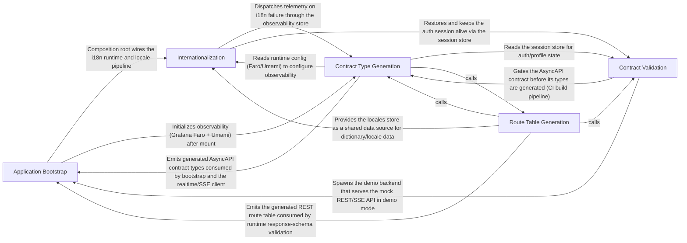

---
tags:
  - 2brain
  - 2brain/arch
  - project/boilerplate-vue-frontend
type: architecture
component: overview
---

## Details

This is a contract-first, modular Vue 3 + TypeScript e-commerce storefront. The architectural backbone runs from the contract layer (OpenAPI/AsyncAPI specs) through code-generation scripts that emit typed artifacts (AsyncAPI message types, REST route tables, error codes, operation modules, permission actions), into the runtime app where the application bootstrap wires the generated contract types and HTTP response validation into the Vue shell, and the i18n layer drives locale-aware navigation and guards. A parallel validation/verification band (AsyncAPI validation, docs reference checking, demo backend runner) keeps the contracts and documentation honest, while the demo-strip tooling produces a reduced demo profile. In short: contracts are the source of truth, generation scripts derive the typed surface, and the app shell + i18n + observability consume that surface at runtime.

### Application Bootstrap [[Expand]](./Application_Bootstrap.md)
The app entry point that boots the Vue application and carries the generated contract surface (AsyncAPI realtime envelopes, REST route table) plus the HTTP response-schema validation that enforces those contracts at runtime.

**Related Classes/Methods**:

- `src.main.bootstrapApplication`:68-165
- `contracts.asyncapi.generated.OrderCreatedEnvelope`:28-32
- `src.kernel.registry.collectModuleRoutes.routes`

**Source Files:**

- `contracts/asyncapi.generated.ts`
  - `contracts.asyncapi.generated.ObservabilityMetricsPayload` (L8-L14) - Interface
  - `contracts.asyncapi.generated.MemoryUsage` (L15-L20) - Interface
  - `contracts.asyncapi.generated.HttpMetrics` (L21-L24) - Interface
  - `contracts.asyncapi.generated.RealtimeMetrics` (L25-L27) - Interface
  - `contracts.asyncapi.generated.OrderCreatedEnvelope` (L28-L32) - Interface
  - `contracts.asyncapi.generated.OrderIdPayload` (L34-L36) - Interface
  - `contracts.asyncapi.generated.OrderPaidEnvelope` (L37-L41) - Interface
  - `contracts.asyncapi.generated.OrderShippedEnvelope` (L43-L47) - Interface
  - `contracts.asyncapi.generated.OrderCancelledEnvelope` (L49-L53) - Interface
  - `contracts.asyncapi.generated.OrderCancelledPayload` (L55-L58) - Interface
  - `contracts.asyncapi.generated.PaymentSucceededEnvelope` (L59-L63) - Interface
  - `contracts.asyncapi.generated.PaymentEventPayload` (L65-L68) - Interface
  - `contracts.asyncapi.generated.PaymentFailedEnvelope` (L69-L73) - Interface
  - `contracts.asyncapi.generated.PaymentRefundedEnvelope` (L75-L79) - Interface
  - `contracts.asyncapi.generated.PaymentRefundedPayload` (L81-L87) - Interface
  - `contracts.asyncapi.generated.ReturnRequestedEnvelope` (L88-L92) - Interface
  - `contracts.asyncapi.generated.ReturnRequestedPayload` (L94-L98) - Interface
  - `contracts.asyncapi.generated.ReturnReceivedEnvelope` (L99-L103) - Interface
  - `contracts.asyncapi.generated.ReturnReceivedPayload` (L105-L108) - Interface
  - `contracts.asyncapi.generated.ReturnClosedEnvelope` (L109-L113) - Interface
  - `contracts.asyncapi.generated.ReturnClosedPayload` (L115-L120) - Interface
  - `contracts.asyncapi.generated.SseEventPayloadMap` (L185-L189) - Interface
- `contracts/rest/index.ts`
  - `contracts.rest.index.PaginationMeta` (L93-L100) - Interface
  - `contracts.rest.index.MessageResponse` (L108-L112) - Interface
  - `contracts.rest.index.ErrorItem` (L119-L126) - Interface
  - `contracts.rest.index.ErrorResponse` (L128-L138) - Interface
  - `contracts.rest.index.ValidationErrorResponse` (L140-L150) - Interface
  - `contracts.rest.index.Abilities` (L183-L216) - Interface
  - `contracts.rest.index.AbilitiesEnvelope` (L218-L223) - Interface
  - `contracts.rest.index.User` (L225-L245) - Interface
  - `contracts.rest.index.UserEnvelope` (L247-L252) - Interface
  - `contracts.rest.index.Product` (L281-L322) - Interface
  - `contracts.rest.index.CartItem` (L324-L328) - Interface
  - `contracts.rest.index.OrderAddress` (L330-L337) - Interface
  - `contracts.rest.index.OrderTransferInstructions` (L339-L346) - Interface
  - `contracts.rest.index.OrderLineProduct` (L348-L375) - Interface
  - `contracts.rest.index.OrderLineCurrent` (L377-L380) - Interface
  - `contracts.rest.index.OrderItem` (L382-L399) - Interface
  - `contracts.rest.index.OrderActions` (L466-L489) - Interface
  - `contracts.rest.index.OrderTaxSummaryRow` (L491-L506) - Interface
  - `contracts.rest.index.Order` (L508-L575) - Interface
  - `contracts.rest.index.ExportInvoiceDocument` (L594-L601) - Interface
  - `contracts.rest.index.Address` (L608-L619) - Interface
  - `contracts.rest.index.ApiKey` (L621-L636) - Interface
  - `contracts.rest.index.Refund` (L663-L679) - Interface
  - `contracts.rest.index.ExportPayment` (L692-L706) - Interface
  - `contracts.rest.index.ExportShipment` (L715-L723) - Interface
  - `contracts.rest.index.ExportSession` (L731-L736) - Interface
  - `contracts.rest.index.ExportAuditEntry` (L777-L796) - Interface
  - `contracts.rest.index.ExportFeedbackTicket` (L798-L807) - Interface
  - `contracts.rest.index.ExportReturn` (L841-L849) - Interface
  - `contracts.rest.index.AccountExportResponse` (L851-L868) - Interface
  - `contracts.rest.index.AccountExportEnvelope` (L870-L875) - Interface
  - `contracts.rest.index.HardDeleteRequest` (L877-L879) - Interface
  - `contracts.rest.index.HealthPing` (L890-L893) - Interface
  - `contracts.rest.index.HealthPingEnvelope` (L895-L900) - Interface
  - `contracts.rest.index.LocaleCapability` (L944-L960) - Interface
  - `contracts.rest.index.LocaleCapabilities` (L965-L970) - Interface
  - `contracts.rest.index.LocaleCapabilitiesEnvelope` (L972-L977) - Interface
  - `contracts.rest.index.CreateLocaleRequest` (L979-L987) - Interface
  - `contracts.rest.index.Language` (L992-L1011) - Interface
  - `contracts.rest.index.LanguageEnvelope` (L1013-L1018) - Interface
  - `contracts.rest.index.LocaleTenantDescriptor` (L1033-L1038) - Interface
  - `contracts.rest.index.LocaleTenants` (L1040-L1043) - Interface
  - `contracts.rest.index.LocaleTenantsEnvelope` (L1045-L1050) - Interface
  - `contracts.rest.index.LocaleDictionary` (L1060-L1064) - Interface
  - `contracts.rest.index.LocaleDictionaryEnvelope` (L1066-L1071) - Interface
  - `contracts.rest.index.ReplaceLocaleRequest` (L1073-L1080) - Interface
  - `contracts.rest.index.UpdateLocaleRequest` (L1085-L1092) - Interface
  - `contracts.rest.index.LocaleMessages` (L1102-L1108) - Interface
  - `contracts.rest.index.LocaleMessagesEnvelope` (L1110-L1115) - Interface
  - `contracts.rest.index.LocaleEntry` (L1121-L1130) - Interface
  - `contracts.rest.index.LocaleEntriesResponse` (L1132-L1135) - Interface
  - `contracts.rest.index.LocaleEntriesResponseEnvelope` (L1137-L1142) - Interface
  - `contracts.rest.index.LocaleEntryInput` (L1149-L1153) - Interface
  - `contracts.rest.index.ReplaceLocaleEntriesRequest` (L1159-L1161) - Interface
  - `contracts.rest.index.LocaleImportResult` (L1166-L1175) - Interface
  - `contracts.rest.index.LocaleImportResultEnvelope` (L1177-L1182) - Interface
  - `contracts.rest.index.CreateLocaleEntryRequest` (L1184-L1188) - Interface
  - `contracts.rest.index.LocaleEntryEnvelope` (L1190-L1195) - Interface
  - `contracts.rest.index.MergeLocaleEntriesRequest` (L1200-L1203) - Interface
  - `contracts.rest.index.UpdateLocaleEntryRequest` (L1205-L1207) - Interface
  - `contracts.rest.index.Translation` (L1233-L1247) - Interface
  - `contracts.rest.index.EntityTranslations` (L1252-L1258) - Interface
  - `contracts.rest.index.EntityTranslationsEnvelope` (L1260-L1265) - Interface
  - `contracts.rest.index.UpsertTranslationRequest` (L1275-L1279) - Interface
  - `contracts.rest.index.UpsertTranslationsRequest` (L1284-L1286) - Interface
  - `contracts.rest.index.MergeTranslationRequest` (L1296-L1300) - Interface
  - `contracts.rest.index.MergeTranslationsRequest` (L1305-L1307) - Interface
  - `contracts.rest.index.ObservabilityDependency` (L1322-L1324) - Interface
  - `contracts.rest.index.ObservabilityHealthDependencies` (L1329-L1333) - Interface
  - `contracts.rest.index.ObservabilityHealthTelemetry` (L1354-L1360) - Interface
  - `contracts.rest.index.ProcessMemory` (L1366-L1375) - Interface
  - `contracts.rest.index.ObservabilityHealthSystem` (L1377-L1381) - Interface
  - `contracts.rest.index.ObservabilityHealthJob` (L1387-L1393) - Interface
  - `contracts.rest.index.ObservabilityHealthQueue` (L1398-L1403) - Interface
  - `contracts.rest.index.ObservabilityHealth` (L1417-L1438) - Interface
  - `contracts.rest.index.ObservabilityHealthResponseEnvelope` (L1440-L1445) - Interface
  - `contracts.rest.index.ObservabilityMetricsLatency` (L1447-L1452) - Interface
  - `contracts.rest.index.ObservabilityMetricsSummary` (L1503-L1510) - Interface
  - `contracts.rest.index.ObservabilityMetricsSummaryResponseEnvelope` (L1512-L1517) - Interface
  - `contracts.rest.index.AuditEventItem` (L1557-L1576) - Interface
  - `contracts.rest.index.AuditLogsPage` (L1578-L1581) - Interface
  - `contracts.rest.index.AuditLogsResponseEnvelope` (L1583-L1588) - Interface
  - `contracts.rest.index.AuditEntryItem` (L1628-L1647) - Interface
  - `contracts.rest.index.AuditEntryList` (L1649-L1652) - Interface
  - `contracts.rest.index.AuditEntryListResponseEnvelope` (L1654-L1659) - Interface
  - `contracts.rest.index.AntibotRungs` (L1676-L1681) - Interface
  - `contracts.rest.index.AntibotConfig` (L1688-L1694) - Interface
  - `contracts.rest.index.AntibotConfigEnvelope` (L1696-L1701) - Interface
  - `contracts.rest.index.AntibotChallengeParameters` (L1706-L1720) - Interface
  - `contracts.rest.index.AntibotChallenge` (L1725-L1729) - Interface
  - `contracts.rest.index.AntibotChallengeEnvelope` (L1731-L1736) - Interface
  - `contracts.rest.index.ReplaceAccountRequest` (L1738-L1756) - Interface
  - `contracts.rest.index.ReplaceAccountRequestMultipart` (L1758-L1770) - Interface
  - `contracts.rest.index.UpdateAccountRequest` (L1772-L1790) - Interface
  - `contracts.rest.index.UpdateAccountRequestMultipart` (L1792-L1804) - Interface
  - `contracts.rest.index.ChangePasswordRequest` (L1806-L1810) - Interface
  - `contracts.rest.index.AuthTokens` (L1812-L1819) - Interface
  - `contracts.rest.index.ChangePasswordResponseEnvelope` (L1821-L1826) - Interface
  - `contracts.rest.index.PasswordCheckRequest` (L1828-L1834) - Interface
  - `contracts.rest.index.PasswordCheck` (L1836-L1844) - Interface
  - `contracts.rest.index.PasswordCheckEnvelope` (L1846-L1851) - Interface
  - `contracts.rest.index.ReauthMethods` (L1863-L1866) - Interface
  - `contracts.rest.index.ReauthMethodsEnvelope` (L1868-L1873) - Interface
  - `contracts.rest.index.ReauthPasswordRequest` (L1882-L1885) - Interface
  - `contracts.rest.index.ReauthEmailRequest` (L1894-L1901) - Interface
  - `contracts.rest.index.AuthTokensEnvelope` (L1905-L1910) - Interface
  - `contracts.rest.index.Session` (L1912-L1920) - Interface
  - `contracts.rest.index.SessionsResponse` (L1922-L1924) - Interface
  - `contracts.rest.index.SessionsEnvelope` (L1926-L1931) - Interface
  - `contracts.rest.index.AddressesResponse` (L1933-L1935) - Interface
  - `contracts.rest.index.AddressesEnvelope` (L1937-L1942) - Interface
  - `contracts.rest.index.AddressInput` (L1944-L1959) - Interface
  - `contracts.rest.index.AddressEnvelope` (L1961-L1966) - Interface
  - `contracts.rest.index.ReplaceAddressRequest` (L1968-L1988) - Interface
  - `contracts.rest.index.UpdateAddressRequest` (L1990-L2010) - Interface
  - `contracts.rest.index.EmailVerificationRequested` (L2012-L2015) - Interface
  - `contracts.rest.index.EmailVerificationRequestedEnvelope` (L2017-L2022) - Interface
  - `contracts.rest.index.VerifyEmailConfirmRequest` (L2024-L2030) - Interface
  - `contracts.rest.index.AccountDeleteConfirmRequest` (L2032-L2038) - Interface
  - `contracts.rest.index.LoginRequest` (L2051-L2055) - Interface
  - `contracts.rest.index.TwoFactorMethodSummary` (L2057-L2072) - Interface
  - `contracts.rest.index.MfaChallenge` (L2074-L2085) - Interface
  - `contracts.rest.index.LoginResponseEnvelope` (L2092-L2097) - Interface
  - `contracts.rest.index.SignupRequest` (L2099-L2107) - Interface
  - `contracts.rest.index.PasswordResetRequest` (L2109-L2111) - Interface
  - `contracts.rest.index.PasswordResetConfirmRequest` (L2113-L2121) - Interface
  - `contracts.rest.index.RefreshTokenResponse` (L2123-L2130) - Interface
  - `contracts.rest.index.RefreshTokenEnvelope` (L2132-L2137) - Interface
  - `contracts.rest.index.LoginTwoFactorRequest` (L2139-L2148) - Interface
  - `contracts.rest.index.TwoFactorSendRequest` (L2150-L2158) - Interface
  - `contracts.rest.index.TwoFactorDelivery` (L2160-L2169) - Interface
  - `contracts.rest.index.TwoFactorDeliveryEnvelope` (L2171-L2176) - Interface
  - `contracts.rest.index.TwoFactorStatus` (L2178-L2187) - Interface
  - `contracts.rest.index.TwoFactorStatusEnvelope` (L2189-L2194) - Interface
  - `contracts.rest.index.TwoFactorCodeRequest` (L2196-L2199) - Interface
  - `contracts.rest.index.TwoFactorSetupRequest` (L2201-L2204) - Interface
  - `contracts.rest.index.TwoFactorSetup` (L2206-L2221) - Interface
  - `contracts.rest.index.TwoFactorSetupEnvelope` (L2223-L2228) - Interface
  - `contracts.rest.index.TwoFactorConfirmRequest` (L2230-L2233) - Interface
  - `contracts.rest.index.TwoFactorConfirmed` (L2235-L2242) - Interface
  - `contracts.rest.index.TwoFactorConfirmEnvelope` (L2244-L2249) - Interface
  - `contracts.rest.index.TwoFactorBackupCodesRegenerated` (L2251-L2256) - Interface
  - `contracts.rest.index.TwoFactorBackupCodesRegeneratedEnvelope` (L2258-L2263) - Interface
  - `contracts.rest.index.OAuthProviders` (L2265-L2268) - Interface
  - `contracts.rest.index.OAuthProvidersEnvelope` (L2270-L2275) - Interface
  - `contracts.rest.index.UsersResponse` (L2294-L2297) - Interface
  - `contracts.rest.index.UsersResponseEnvelope` (L2299-L2304) - Interface
  - `contracts.rest.index.CreateUserRequest` (L2306-L2317) - Interface
  - `contracts.rest.index.CreateUserRequestMultipart` (L2319-L2331) - Interface
  - `contracts.rest.index.DeleteUserRequest` (L2333-L2336) - Interface
  - `contracts.rest.index.ReplaceUserByIdRequest` (L2338-L2359) - Interface
  - `contracts.rest.index.ReplaceUserByIdRequestMultipart` (L2361-L2376) - Interface
  - `contracts.rest.index.UpdateUserByIdRequest` (L2378-L2399) - Interface
  - `contracts.rest.index.UpdateUserByIdRequestMultipart` (L2401-L2416) - Interface
  - `contracts.rest.index.SearchUsersRequest` (L2418-L2432) - Interface
  - `contracts.rest.index.CreateFeedbackRequest` (L2434-L2450) - Interface
  - `contracts.rest.index.FeedbackRequest` (L2462-L2473) - Interface
  - `contracts.rest.index.FeedbackRequestEnvelope` (L2475-L2480) - Interface
  - `contracts.rest.index.FeedbackRequestsResponse` (L2500-L2503) - Interface
  - `contracts.rest.index.FeedbackRequestsResponseEnvelope` (L2505-L2510) - Interface
  - `contracts.rest.index.SearchFeedbackRequestsRequest` (L2512-L2519) - Interface
  - `contracts.rest.index.ReplaceFeedbackRequestStatusRequest` (L2521-L2529) - Interface
  - `contracts.rest.index.UpdateFeedbackRequestStatusRequest` (L2531-L2539) - Interface
  - `contracts.rest.index.ProductsResponse` (L2558-L2561) - Interface
  - `contracts.rest.index.ProductsResponseEnvelope` (L2563-L2568) - Interface
  - `contracts.rest.index.ProductTranslationFieldsWrite` (L2570-L2574) - Interface
  - `contracts.rest.index.ProductTranslationsWrite` (L2579-L2581) - Interface
  - `contracts.rest.index.CreateProductRequest` (L2583-L2608) - Interface
  - `contracts.rest.index.CreateProductRequestMultipart` (L2610-L2637) - Interface
  - `contracts.rest.index.ProductEnvelope` (L2639-L2644) - Interface
  - `contracts.rest.index.DeleteProductRequest` (L2646-L2649) - Interface
  - `contracts.rest.index.FacetCount` (L2651-L2655) - Interface
  - `contracts.rest.index.CatalogueFacetsResponse` (L2657-L2660) - Interface
  - `contracts.rest.index.CatalogueFacetsEnvelope` (L2662-L2667) - Interface
  - `contracts.rest.index.ProductSettingsResponse` (L2669-L2672) - Interface
  - `contracts.rest.index.ProductSettingsEnvelope` (L2674-L2679) - Interface
  - `contracts.rest.index.ReplaceProductRequest` (L2681-L2708) - Interface
  - `contracts.rest.index.ReplaceProductRequestMultipart` (L2710-L2735) - Interface
  - `contracts.rest.index.ProductTranslationFieldsPatch` (L2737-L2746) - Interface
  - `contracts.rest.index.ProductTranslationsPatch` (L2751-L2753) - Interface
  - `contracts.rest.index.UpdateProductRequest` (L2755-L2782) - Interface
  - `contracts.rest.index.UpdateProductRequestMultipart` (L2784-L2809) - Interface
  - `contracts.rest.index.ProductTranslationFields` (L2811-L2814) - Interface
  - `contracts.rest.index.ProductAdmin` (L2821-L2857) - Interface
  - `contracts.rest.index.ProductAdminEnvelope` (L2859-L2864) - Interface
  - `contracts.rest.index.SearchProductsRequest` (L2866-L2885) - Interface
  - `contracts.rest.index.CartSummaryResponse` (L2887-L2915) - Interface
  - `contracts.rest.index.CartShippingOption` (L2920-L2932) - Interface
  - `contracts.rest.index.CartShipping` (L2937-L2947) - Interface
  - `contracts.rest.index.CartResponse` (L2949-L2953) - Interface
  - `contracts.rest.index.CartResponseEnvelope` (L2955-L2960) - Interface
  - `contracts.rest.index.AddCartItemRequest` (L2969-L2972) - Interface
  - `contracts.rest.index.RemoveCartItemRequest` (L2974-L2976) - Interface
  - `contracts.rest.index.UpdateCartItemByIdRequest` (L2978-L2980) - Interface
  - `contracts.rest.index.SetCartShippingMethodRequest` (L2982-L2989) - Interface
  - `contracts.rest.index.CartSummaryResponseEnvelope` (L2991-L2996) - Interface
  - `contracts.rest.index.CheckoutRequest` (L2998-L3010) - Interface
  - `contracts.rest.index.CheckoutResponseEnvelope` (L3012-L3017) - Interface
  - `contracts.rest.index.WishlistItem` (L3019-L3021) - Interface
  - `contracts.rest.index.WishlistResponse` (L3023-L3025) - Interface
  - `contracts.rest.index.WishlistResponseEnvelope` (L3027-L3032) - Interface
  - `contracts.rest.index.OrdersResponse` (L3051-L3054) - Interface
  - `contracts.rest.index.OrdersResponseEnvelope` (L3056-L3061) - Interface
  - `contracts.rest.index.CreateOrderRequest` (L3066-L3071) - Interface
  - `contracts.rest.index.OrderEnvelope` (L3073-L3078) - Interface
  - `contracts.rest.index.DeleteOrderRequest` (L3080-L3083) - Interface
  - `contracts.rest.index.SearchOrdersRequest` (L3085-L3101) - Interface
  - `contracts.rest.index.ReplaceOrderByIdRequest` (L3103-L3105) - Interface
  - `contracts.rest.index.UpdateOrderByIdRequest` (L3107-L3109) - Interface
  - `contracts.rest.index.CancelOrderRequest` (L3114-L3117) - Interface
  - `contracts.rest.index.StatusOverrideRequest` (L3119-L3127) - Interface
  - `contracts.rest.index.CreditNoteSummary` (L3129-L3142) - Interface
  - `contracts.rest.index.CreditNoteListEnvelope` (L3144-L3149) - Interface
  - `contracts.rest.index.PaymentMethodOption` (L3151-L3158) - Interface
  - `contracts.rest.index.PaymentMethodsResponse` (L3160-L3162) - Interface
  - `contracts.rest.index.PaymentMethodsResponseEnvelope` (L3164-L3169) - Interface
  - `contracts.rest.index.CreatePaymentIntentRequest` (L3171-L3173) - Interface
  - `contracts.rest.index.PaymentActions` (L3178-L3183) - Interface
  - `contracts.rest.index.Payment` (L3211-L3251) - Interface
  - `contracts.rest.index.PaymentEnvelope` (L3253-L3258) - Interface
  - `contracts.rest.index.OrderByReferenceResponseEnvelope` (L3260-L3265) - Interface
  - `contracts.rest.index.RefundPaymentRequest` (L3267-L3275) - Interface
  - `contracts.rest.index.RecordOfflinePaymentRequest` (L3289-L3300) - Interface
  - `contracts.rest.index.ConfirmPaymentRequest` (L3302-L3310) - Interface
  - `contracts.rest.index.PaymentWebhookEvent` (L3329-L3338) - Interface
  - `contracts.rest.index.ShippingMethod` (L3340-L3374) - Interface
  - `contracts.rest.index.ReturnAddress` (L3379-L3386) - Interface
  - `contracts.rest.index.ShippingMethodsResponse` (L3388-L3393) - Interface
  - `contracts.rest.index.ShippingMethodsResponseEnvelope` (L3395-L3400) - Interface
  - `contracts.rest.index.Shipment` (L3412-L3422) - Interface
  - `contracts.rest.index.ShipmentEnvelope` (L3424-L3429) - Interface
  - `contracts.rest.index.ShipOrderRequest` (L3431-L3444) - Interface
  - `contracts.rest.index.DeliverOrderRequest` (L3446-L3454) - Interface
  - `contracts.rest.index.ReturnLine` (L3459-L3470) - Interface
  - `contracts.rest.index.ReturnActions` (L3475-L3482) - Interface
  - `contracts.rest.index.Return` (L3494-L3532) - Interface
  - `contracts.rest.index.ReturnsResponse` (L3534-L3537) - Interface
  - `contracts.rest.index.ReturnsResponseEnvelope` (L3539-L3544) - Interface
  - `contracts.rest.index.CreateReturnRequest` (L3552-L3565) - Interface
  - `contracts.rest.index.ReturnEnvelope` (L3567-L3572) - Interface
  - `contracts.rest.index.DeclineReturnRequest` (L3574-L3581) - Interface
  - `contracts.rest.index.ReceiveReturnRequest` (L3583-L3589) - Interface
  - `contracts.rest.index.InventoryLevel` (L3591-L3601) - Interface
  - `contracts.rest.index.InventoryLevelsResponse` (L3603-L3606) - Interface
  - `contracts.rest.index.InventoryLevelsResponseEnvelope` (L3608-L3613) - Interface
  - `contracts.rest.index.StockMovement` (L3636-L3648) - Interface
  - `contracts.rest.index.StockMovementsResponse` (L3650-L3653) - Interface
  - `contracts.rest.index.StockMovementsResponseEnvelope` (L3655-L3660) - Interface
  - `contracts.rest.index.ReceiptRequest` (L3662-L3674) - Interface
  - `contracts.rest.index.InventoryLevelEnvelope` (L3676-L3681) - Interface
  - `contracts.rest.index.AdjustmentRequest` (L3683-L3692) - Interface
  - `contracts.rest.index.ReservationSweepResponse` (L3694-L3700) - Interface
  - `contracts.rest.index.ReservationSweepEnvelope` (L3702-L3707) - Interface
  - `contracts.rest.index.WebhookSubscription` (L3709-L3728) - Interface
  - `contracts.rest.index.WebhookSubscriptionsResponse` (L3730-L3733) - Interface
  - `contracts.rest.index.WebhookSubscriptionsResponseEnvelope` (L3735-L3740) - Interface
  - `contracts.rest.index.CreateWebhookSubscriptionRequest` (L3742-L3755) - Interface
  - `contracts.rest.index.WebhookSubscriptionCreated` (L3757-L3775) - Interface
  - `contracts.rest.index.WebhookSubscriptionCreatedEnvelope` (L3777-L3782) - Interface
  - `contracts.rest.index.ReplaceWebhookSubscriptionRequest` (L3784-L3802) - Interface
  - `contracts.rest.index.WebhookSubscriptionEnvelope` (L3804-L3809) - Interface
  - `contracts.rest.index.UpdateWebhookSubscriptionRequest` (L3811-L3829) - Interface
  - `contracts.rest.index.WebhookDelivery` (L3841-L3855) - Interface
  - `contracts.rest.index.WebhookDeliveriesResponse` (L3857-L3860) - Interface
  - `contracts.rest.index.WebhookDeliveriesResponseEnvelope` (L3862-L3867) - Interface
  - `contracts.rest.index.WebhookDeliveryEnvelope` (L3869-L3874) - Interface
  - `contracts.rest.index.WebhookEventCatalogueEntry` (L3876-L3879) - Interface
  - `contracts.rest.index.WebhookEventCatalogueResponseEnvelope` (L3881-L3886) - Interface
  - `contracts.rest.index.ApiKeysResponse` (L3888-L3891) - Interface
  - `contracts.rest.index.ApiKeysResponseEnvelope` (L3893-L3898) - Interface
  - `contracts.rest.index.MintApiKeyRequest` (L3900-L3914) - Interface
  - `contracts.rest.index.ApiKeyCreated` (L3916-L3929) - Interface
  - `contracts.rest.index.ApiKeyCreatedEnvelope` (L3931-L3936) - Interface
  - `contracts.rest.index.createProductWithMultipart` (L6515-L6570) - Class
  - `contracts.rest.index.createProductWithMultipart.createProductRequestMultipart.categories.forEach() callback` (L6553-L6554) - Function
  - `contracts.rest.index.createProductWithMultipart.createProductRequestMultipart.tags.forEach() callback` (L6558-L6558) - Function
  - `contracts.rest.index.replaceProductByIdWithMultipart` (L6668-L6710) - Class
  - `contracts.rest.index.replaceProductByIdWithMultipart.replaceProductRequestMultipart.categories.forEach() callback` (L6696-L6697) - Function
  - `contracts.rest.index.replaceProductByIdWithMultipart.replaceProductRequestMultipart.tags.forEach() callback` (L6699-L6699) - Function
  - `contracts.rest.index.updateProductByIdWithMultipart` (L6804-L6861) - Class
  - `contracts.rest.index.updateProductByIdWithMultipart.updateProductRequestMultipart.categories.forEach() callback` (L6844-L6845) - Function
  - `contracts.rest.index.updateProductByIdWithMultipart.updateProductRequestMultipart.tags.forEach() callback` (L6849-L6849) - Function
- `contracts/rest/routes.ts`
  - `contracts.rest.routes.GeneratedRoute` (L13-L19) - Interface
- `src/app/components/app-nav-item.ts`
  - `src.app.components.app-nav-item.AppNavItem` (L15-L44) - Interface
- `src/i18n/language-label.ts`
  - `src.i18n.language-label.Translator` (L12-L15) - Interface
- `src/infrastructure/http/index.ts`
  - `src.infrastructure.http.index.send` (L39-L43) - Class
  - `src.infrastructure.http.index.send.then() callback` (L40-L43) - Function
  - `src.infrastructure.http.index.orvalMutator` (L64-L80) - Class
  - `src.infrastructure.http.index.orvalMutator.then() callback` (L78-L78) - Function
- `src/infrastructure/http/response-schema-map.ts`
  - `src.infrastructure.http.response-schema-map.ResponseSchemaRoute` (L44-L63) - Interface
  - `src.infrastructure.http.response-schema-map.routesForModules` (L126-L135) - Class
  - `src.infrastructure.http.response-schema-map.routesForModules.ROUTES.filter() callback` (L131-L134) - Function
  - `src.infrastructure.http.response-schema-map.routesForModules.map() callback` (L135-L135) - Function
  - `src.infrastructure.http.response-schema-map.buildCoreRouteSchemas` (L148-L154) - Class
  - `src.infrastructure.http.response-schema-map.buildCoreRouteSchemas.ROUTES.filter() callback` (L150-L153) - Function
  - `src.infrastructure.http.response-schema-map.buildCoreRouteSchemas.map() callback` (L154-L154) - Function
  - `src.infrastructure.http.response-schema-map.loadResponseSchemas` (L206-L217) - Class
  - `src.infrastructure.http.response-schema-map.loadResponseSchemas.moduleResponseSchemaLoaders.map() callback` (L211-L211) - Function
  - `src.infrastructure.http.response-schema-map.then() callback` (L211-L212) - Function
  - `src.infrastructure.http.response-schema-map.loadResponseSchemas.then() callback` (L214-L217) - Function
  - `src.infrastructure.http.response-schema-map.findRoute` (L225-L234) - Class
  - `src.infrastructure.http.response-schema-map.findRoute.routeSchemas.find() callback` (L232-L232) - Function
- `src/infrastructure/http/validate.ts`
  - `src.infrastructure.http.validate.validateResponseAgainstContract.issues` (L116-L118) - Class
  - `src.infrastructure.http.validate.validateResponseAgainstContract.issues.result.error.issues.map() callback` (L117-L117) - Function
  - `src.infrastructure.http.validate.validateRequestAgainstContract.issues` (L170-L172) - Class
  - `src.infrastructure.http.validate.validateRequestAgainstContract.issues.result.error.issues.map() callback` (L171-L171) - Function
- `src/infrastructure/shop-currency.ts`
  - `src.infrastructure.shop-currency.loadShopCurrency` (L37-L49) - Class
  - `src.infrastructure.shop-currency.loadShopCurrency.then() callback` (L39-L42) - Function
  - `src.infrastructure.shop-currency.loadShopCurrency.catch() callback` (L43-L47) - Function
- `src/kernel/registry.ts`
  - `src.kernel.registry.AppNavigationEntry` (L53-L125) - Interface
  - `src.kernel.registry.AppModule` (L137-L188) - Interface
  - `src.kernel.registry.routeIdentitiesOf` (L221-L231) - Class
  - `src.kernel.registry.routeIdentitiesOf.routes.flatMap() callback` (L225-L231) - Function
  - `src.kernel.registry.collectModuleRoutes.routes` (L273-L273) - Class
  - `src.kernel.registry.collectModuleRoutes.routes.appModules.flatMap() callback` (L273-L273) - Function
  - `src.kernel.registry.collectModuleNavigation` (L290-L291) - Class
  - `src.kernel.registry.collectModuleNavigation.appModules.flatMap() callback` (L291-L291) - Function
  - `src.kernel.registry.sortNavigation` (L301-L306) - Class
  - `src.kernel.registry.sortNavigation.entries.toSorted() callback` (L304-L305) - Function
  - `src.kernel.registry.collectModuleResponseSchemas` (L339-L344) - Class
  - `src.kernel.registry.collectModuleResponseSchemas.appModules.map() callback` (L343-L343) - Function
  - `src.kernel.registry.collectModuleResponseSchemas.filter() callback` (L344-L344) - Function
  - `src.kernel.registry.collectModuleLoadingKeys` (L365-L366) - Class
  - `src.kernel.registry.collectModuleLoadingKeys.appModules.flatMap() callback` (L366-L366) - Function
- `src/main.ts`
  - `src.main.bootstrapApplication` (L68-L165) - Class
  - `src.main.then() callback` (L70-L99) - Function
  - `src.main.then() callback.then() callback` (L98-L98) - Function
  - `src.main.bootstrapApplication.then() callback` (L100-L165) - Function
  - `src.main.bootstrapApplication.then() callback.catch() callback` (L135-L140) - Function
  - `src.main.bootstrapApplication.then() callback.then() callback` (L160-L164) - Function
  - `src.main.catch() callback` (L167-L169) - Function
- `src/modules/demo/module.ts`
  - `src.modules.demo.module.'@/infrastructure/utils/logger.ts'.LogScopes` (L18-L20) - Interface
- `src/modules/demo/provided.ts`
  - `src.modules.demo.provided.ProvidedVariableContext` (L31-L34) - Interface
- `src/modules/webhooks/types.ts`
  - `src.modules.webhooks.types.WebhookDeliveryFilters` (L12-L19) - Interface
- `src/ui/composables/use-axios-upload-progress.ts`
  - `src.ui.composables.use-axios-upload-progress.AxiosUploadProgress` (L15-L33) - Interface
- `src/ui/composables/use-query-synced-filters.ts`
  - `src.ui.composables.use-query-synced-filters.QuerySyncedFilters` (L15-L28) - Interface

### Internationalization [[Expand]](./Internationalization.md)
Locale management and i18n runtime (dictionary loading, language switching, HTML locale attributes), with the app-shell router guards (authentication, locale choice) and the router announcer as its secondary concern.

**Related Classes/Methods**:

- `src.i18n.index.changeLanguage`:391-393
- `src.i18n.index.loadLocale`:261-263
- `src.i18n.index.I18nRuntimeConfig`:26-29

**Source Files:**

- `src/app/guards/authentications.ts`
  - `src.app.guards.authentications.'vue-router'.RouteMeta` (L56-L82) - Interface
  - `src.app.guards.authentications.restoreTokenIfNeeded` (L125-L129) - Class
  - `src.app.guards.authentications.restoreTokenIfNeeded.catch() callback` (L128-L128) - Function
  - `src.app.guards.authentications.tryRestoreAuth` (L140-L156) - Class
  - `src.app.guards.authentications.then() callback` (L144-L151) - Function
  - `src.app.guards.authentications.tryRestoreAuth.then() callback` (L153-L153) - Function
  - `src.app.guards.authentications.tryRestoreAuth.catch() callback` (L154-L154) - Function
- `src/app/guards/locale-choice.ts`
  - `src.app.guards.locale-choice.fetchLanguageApi` (L37-L57) - Class
  - `src.app.guards.locale-choice.then() callback` (L50-L50) - Function
  - `src.app.guards.locale-choice.fetchLanguageApi.catch() callback` (L53-L53) - Function
  - `src.app.guards.locale-choice.fetchLanguageApi.then() callback` (L55-L55) - Function
  - `src.app.guards.locale-choice.localeChoice` (L92-L129) - Class
  - `src.app.guards.locale-choice.localeChoice.then() callback.then() callback` (L113-L113) - Function
  - `src.app.guards.locale-choice.localeChoice.then() callback` (L115-L115) - Function
- `src/app/router/announcer.ts`
  - `src.app.router.announcer.announceRouteChange` (L31-L36) - Class
  - `src.app.router.announcer.announceRouteChange.nextTick() callback` (L33-L35) - Function
- `src/app/router/index.ts`
  - `src.app.router.index.shellChildRoutes` (L44-L90) - Class
  - `src.app.router.index.shellChildRoutes.component` (L87-L87) - Method
  - `src.app.router.index.localeLessRedirects` (L114-L123) - Class
  - `src.app.router.index.map() callback` (L117-L117) - Function
  - `src.app.router.index.localeLessRedirects.filter() callback` (L118-L118) - Function
  - `src.app.router.index.localeLessRedirects.map() callback` (L120-L123) - Function
  - `src.app.router.index.localeLessRedirects.map() callback.redirect` (L122-L122) - Method
  - `src.app.router.index.router` (L129-L222) - Class
  - `src.app.router.index.router.scrollBehavior` (L145-L151) - Method
  - `src.app.router.index.routes.redirect` (L155-L160) - Method
  - `src.app.router.index.router.routes.children.component` (L189-L189) - Method
  - `src.app.router.index.router.routes.children.children.redirect` (L196-L203) - Method
  - `src.app.router.index.router.routes.redirect` (L212-L219) - Method
  - `src.app.router.index.router.onError() callback` (L248-L302) - Function
  - `src.app.router.index.router.onError() callback.recoverFromStaleDeploy() callback` (L261-L261) - Function
  - `src.app.router.index.router.beforeEach() callback` (L317-L322) - Function
  - `src.app.router.index.router.beforeEach() callback.then() callback` (L321-L321) - Function
  - `src.app.router.index.router.afterEach() callback` (L350-L365) - Function
- `src/app/router/stale-deploy.ts`
  - `src.app.router.stale-deploy.PreloadErrorSource` (L33-L38) - Interface
  - `src.app.router.stale-deploy.registerStaleDeployRecovery` (L51-L56) - Class
  - `src.app.router.stale-deploy.registerStaleDeployRecovery.target.addEventListener('vite:preloadError') callback` (L52-L55) - Function
- `src/app/utils/error-messages.ts`
  - `src.app.utils.error-messages.isKnownErrorMessage` (L28-L29) - Class
  - `src.app.utils.error-messages.isKnownErrorMessage.KNOWN_ERROR_MESSAGE_PREFIXES.some() callback` (L29-L29) - Function
- `src/app/utils/static-pages.ts`
  - `src.app.utils.static-pages.staticPageParagraphs` (L37-L44) - Class
  - `src.app.utils.static-pages.staticPageParagraphs.messages.map() callback` (L43-L43) - Function
- `src/i18n/index.ts`
  - `src.i18n.index.I18nRuntimeConfig` (L26-L29) - Interface
  - `src.i18n.index.runtimeLocaleValue` (L38-L42) - Function
  - `src.i18n.index.TranslationDictionaries` (L48-L55) - Interface
  - `src.i18n.index.bundledLocales.map() callback` (L73-L74) - Function
  - `src.i18n.index.bundledLocales` (L73-L75) - Class
  - `src.i18n.index.i18n.modifiers.customSnakeCase` (L157-L157) - Method
  - `src.i18n.index._loadLocale` (L186-L206) - Function
  - `src.i18n.index._loadLocale.then() callback` (L196-L200) - Function
  - `src.i18n.index._loadLocale.then() callback.then() callback` (L198-L199) - Function
  - `src.i18n.index._loadLocale.catch() callback` (L202-L202) - Function
  - `src.i18n.index.mergeDictionaries` (L218-L224) - Class
  - `src.i18n.index.mergeDictionaries.mergeWith() callback` (L222-L223) - Function
  - `src.i18n.index.loadBundledDictionary` (L240-L253) - Function
  - `src.i18n.index.loadBundledDictionary.catch() callback` (L246-L246) - Function
  - `src.i18n.index.loadBundledDictionary.map() callback` (L247-L247) - Function
  - `src.i18n.index.loadBundledDictionary.then() callback` (L248-L252) - Function
  - `src.i18n.index.loadLocale` (L261-L263) - Function
  - `src.i18n.index._updateLocale` (L286-L306) - Function
  - `src.i18n.index._updateLocale.map() callback` (L292-L292) - Function
  - `src.i18n.index._updateLocale.then() callback` (L293-L304) - Function
  - `src.i18n.index.updateLocale` (L315-L317) - Function
  - `src.i18n.index._ensureFallbackLoaded` (L331-L348) - Function
  - `src.i18n.index._ensureFallbackLoaded.then() callback` (L342-L343) - Function
  - `src.i18n.index._ensureFallbackLoaded.catch() callback` (L346-L346) - Function
  - `src.i18n.index.applyHtmlLocaleAttributes` (L359-L363) - Function
  - `src.i18n.index._changeLanguage` (L373-L383) - Function
  - `src.i18n.index.then() callback` (L379-L379) - Function
  - `src.i18n.index._changeLanguage.then() callback` (L382-L382) - Function
  - `src.i18n.index.changeLanguage` (L391-L393) - Function
  - `src.i18n.index.getDefaultLocale` (L403-L416) - Function
- `src/i18n/router-link.ts`
  - `src.i18n.router-link.prefixLocalePath` (L24-L28) - Function
  - `src.i18n.router-link.routerLinkI18n` (L41-L57) - Function
- `src/infrastructure/create-sse-client.ts`
  - `src.infrastructure.create-sse-client.SseClientCallbacks` (L17-L34) - Interface
  - `src.infrastructure.create-sse-client.SseClient` (L39-L41) - Interface
  - `src.infrastructure.create-sse-client.passesContract.issues` (L95-L97) - Class
  - `src.infrastructure.create-sse-client.passesContract.issues.result.error.issues.map() callback` (L96-L96) - Function
  - `src.infrastructure.create-sse-client.createSseClient` (L117-L146) - Class
  - `src.infrastructure.create-sse-client.createSseClient.eventSource.addEventListener('open') callback` (L124-L124) - Function
  - `src.infrastructure.create-sse-client.createSseClient.eventSource.addEventListener('error') callback` (L125-L125) - Function
  - `src.infrastructure.create-sse-client.createSseClient.eventSource.addEventListener() callback` (L129-L137) - Function
  - `src.infrastructure.create-sse-client.createSseClient.close` (L144-L144) - Method
- `src/infrastructure/http/keepalive.ts`
  - `src.infrastructure.http.keepalive.sendKeepalive` (L22-L43) - Class
  - `src.infrastructure.http.keepalive.sendKeepalive.catch() callback` (L42-L42) - Function
- `src/infrastructure/locale-overrides.ts`
  - `src.infrastructure.locale-overrides.fetchRemoteLocales` (L92-L107) - Class
  - `src.infrastructure.locale-overrides.fetchRemoteLocales.then() callback` (L94-L105) - Function
  - `src.infrastructure.locale-overrides.fetchRemoteLocales.then() callback.response.data.locales.filter() callback` (L97-L99) - Function
  - `src.infrastructure.locale-overrides.fetchRemoteLocales.then() callback.map() callback` (L101-L105) - Function
  - `src.infrastructure.locale-overrides.fetchRemoteLocales.catch() callback` (L107-L107) - Function
  - `src.infrastructure.locale-overrides.fetchLocaleOverrides` (L118-L121) - Class
  - `src.infrastructure.locale-overrides.fetchLocaleOverrides.then() callback` (L120-L120) - Function
  - `src.infrastructure.locale-overrides.fetchLocaleOverrides.catch() callback` (L121-L121) - Function
  - `src.infrastructure.locale-overrides.mergeRemoteLocales` (L135-L142) - Class
  - `src.infrastructure.locale-overrides.mergeRemoteLocales.then() callback` (L136-L142) - Function
  - `src.infrastructure.locale-overrides.mergeRemoteLocales.then() callback.added` (L137-L137) - Class
  - `src.infrastructure.locale-overrides.mergeRemoteLocales.then() callback.added.discovered.filter() callback` (L137-L137) - Function
  - `src.infrastructure.locale-overrides.withLocaleOverrides` (L151-L155) - Class
  - `src.infrastructure.locale-overrides.withLocaleOverrides.then() callback` (L155-L155) - Function
  - `src.infrastructure.locale-overrides.refreshRunningLocale` (L174-L178) - Class
  - `src.infrastructure.locale-overrides.refreshRunningLocale.then() callback` (L177-L177) - Function
  - `src.infrastructure.locale-overrides.refreshRunningLocale.catch() callback` (L178-L178) - Function
- `src/infrastructure/runtime-config.ts`
  - `src.infrastructure.runtime-config.RuntimeConfig` (L14-L34) - Interface
  - `src.infrastructure.runtime-config.runtimeValue` (L45-L49) - Function
- `src/infrastructure/utils/logger.ts`
  - `src.infrastructure.utils.logger.LogScopes` (L47-L51) - Interface
  - `src.infrastructure.utils.logger.resolveScopes` (L78-L89) - Class
  - `src.infrastructure.utils.logger.resolveScopes.map() callback` (L86-L86) - Function
- `src/infrastructure/utils/uploads.ts`
  - `src.infrastructure.utils.uploads.imageUploadSchema` (L83-L89) - Class
  - `src.infrastructure.utils.uploads.error` (L84-L84) - Method
  - `src.infrastructure.utils.uploads.imageUploadSchema.error` (L87-L87) - Method
- `src/modules/api-keys/schemas.ts`
  - `src.modules.api-keys.schemas.apiKeyNameSchema` (L15-L18) - Class
  - `src.modules.api-keys.schemas.apiKeyNameSchema.error` (L18-L18) - Method
  - `src.modules.api-keys.schemas.apiKeyPermissionsSchema` (L24-L26) - Class
  - `src.modules.api-keys.schemas.apiKeyPermissionsSchema.error` (L26-L26) - Method
  - `src.modules.api-keys.schemas.apiKeyExpiresAtSchema` (L33-L38) - Class
  - `src.modules.api-keys.schemas.apiKeyExpiresAtSchema.refine() callback` (L36-L36) - Function
  - `src.modules.api-keys.schemas.apiKeyExpiresAtSchema.error` (L37-L37) - Method
- `src/modules/api-keys/store.ts`
  - `src.modules.api-keys.store.useApiKeysStore` (L23-L112) - Class
  - `src.modules.api-keys.store.useApiKeysStore.defineStore('api-keys') callback` (L23-L112) - Function
  - `src.modules.api-keys.store.defineStore('api-keys') callback.mintCredential` (L70-L77) - Class
  - `src.modules.api-keys.store.useApiKeysStore.defineStore('api-keys') callback.mintCredential.fetchAny() callback` (L71-L76) - Function
  - `src.modules.api-keys.store.useApiKeysStore.defineStore('api-keys') callback.mintCredential.fetchAny() callback.then() callback` (L72-L76) - Function
  - `src.modules.api-keys.store.defineStore('api-keys') callback.revokeCredential` (L91-L94) - Class
  - `src.modules.api-keys.store.useApiKeysStore.defineStore('api-keys') callback.revokeCredential.fetchAny() callback` (L92-L92) - Function
  - `src.modules.api-keys.store.useApiKeysStore.defineStore('api-keys') callback.revokeCredential.then() callback` (L92-L94) - Function
- `src/modules/cart/composables/use-checkout-draft.ts`
  - `src.modules.cart.composables.use-checkout-draft.CheckoutDraft` (L11-L18) - Interface
- `src/modules/cart/composables/use-line-quantity.ts`
  - `src.modules.cart.composables.use-line-quantity.useLineQuantity.senderFor.send` (L89-L113) - Class
  - `src.modules.cart.composables.use-line-quantity.useLineQuantity.senderFor.send.debounce() callback` (L89-L113) - Function
  - `src.modules.cart.composables.use-line-quantity.useLineQuantity.senderFor.send.debounce() callback.request` (L92-L111) - Class
  - `src.modules.cart.composables.use-line-quantity.useLineQuantity.senderFor.send.debounce() callback.request.then() callback` (L95-L95) - Function
  - `src.modules.cart.composables.use-line-quantity.useLineQuantity.senderFor.send.debounce() callback.request.catch() callback` (L96-L99) - Function
  - `src.modules.cart.composables.use-line-quantity.useLineQuantity.senderFor.send.debounce() callback.request.finally() callback` (L100-L111) - Function
  - `src.modules.cart.composables.use-line-quantity.settle` (L198-L204) - Class
  - `src.modules.cart.composables.use-line-quantity.useLineQuantity.settle.then() callback` (L200-L203) - Function
  - `src.modules.cart.composables.use-line-quantity.useLineQuantity.settle.then() callback.results.some() callback` (L201-L201) - Function
- `src/modules/demo/store.ts`
  - `src.modules.demo.store.useDemoStore` (L13-L51) - Class
  - `src.modules.demo.store.useDemoStore.defineStore('counter') callback` (L13-L51) - Function
  - `src.modules.demo.store.defineStore('counter') callback.doubleCount` (L22-L22) - Class
  - `src.modules.demo.store.useDemoStore.defineStore('counter') callback.doubleCount.computed() callback` (L22-L22) - Function
  - `src.modules.demo.store.defineStore('counter') callback.increment` (L27-L29) - Function
  - `src.modules.demo.store.defineStore('counter') callback.incrementDelayed` (L36-L43) - Function
  - `src.modules.demo.store.useDemoStore.defineStore('counter') callback.incrementDelayed.<function>` (L37-L42) - Function
  - `src.modules.demo.store.useDemoStore.defineStore('counter') callback.incrementDelayed.<function>.setTimeout() callback` (L38-L41) - Function
- `src/modules/locales/composables/use-dictionary-aggregation.ts`
  - `src.modules.locales.composables.use-dictionary-aggregation.useDictionaryAggregation` (L27-L219) - Function
  - `src.modules.locales.composables.use-dictionary-aggregation.tenantKind` (L35-L37) - Class
  - `src.modules.locales.composables.use-dictionary-aggregation.hasBaseline` (L42-L45) - Class
  - `src.modules.locales.composables.use-dictionary-aggregation.languages` (L53-L55) - Class
  - `src.modules.locales.composables.use-dictionary-aggregation.tenantOptions` (L60-L62) - Class
  - `src.modules.locales.composables.use-dictionary-aggregation.allKeys` (L138-L145) - Class
  - `src.modules.locales.composables.use-dictionary-aggregation.missingByTag` (L150-L157) - Class
  - `src.modules.locales.composables.use-dictionary-aggregation.loadLanguage` (L162-L171) - Class
  - `src.modules.locales.composables.use-dictionary-aggregation.loadBoard` (L176-L179) - Class
- `src/modules/locales/dictionaries.ts`
  - `src.modules.locales.dictionaries.flattenDictionary` (L31-L39) - Class
  - `src.modules.locales.dictionaries.flattenDictionary.flatMap() callback` (L35-L39) - Function
  - `src.modules.locales.dictionaries.foldNumericNodes` (L95-L111) - Class
  - `src.modules.locales.dictionaries.foldNumericNodes.folded` (L99-L104) - Class
  - `src.modules.locales.dictionaries.foldNumericNodes.folded.map() callback` (L100-L103) - Function
  - `src.modules.locales.dictionaries.foldNumericNodes.keys.every() callback` (L106-L106) - Function
  - `src.modules.locales.dictionaries.foldNumericNodes.keys.toSorted() callback` (L108-L108) - Function
  - `src.modules.locales.dictionaries.foldNumericNodes.map() callback` (L109-L109) - Function
- `src/modules/locales/schemas.ts`
  - `src.modules.locales.schemas.tag.error` (L41-L41) - Method
  - `src.modules.locales.schemas.localesLanguageSchema.tag.error` (L42-L42) - Method
  - `src.modules.locales.schemas.localesLanguageSchema.name.error` (L43-L43) - Method
  - `src.modules.locales.schemas.localesLanguageSchema.nativeName.error` (L44-L44) - Method
  - `src.modules.locales.schemas.localesEntrySchema.tenant.error` (L70-L70) - Method
  - `src.modules.locales.schemas.localesEntrySchema.key.error` (L71-L71) - Method
  - `src.modules.locales.schemas.localesEntrySchema.value.error` (L72-L72) - Method
- `src/modules/locales/store.ts`
  - `src.modules.locales.store.LocaleEntriesFilters` (L52-L56) - Interface
  - `src.modules.locales.store.fetchApiDictionary` (L72-L81) - Class
  - `src.modules.locales.store.fetchApiDictionary.then() callback` (L74-L79) - Function
  - `src.modules.locales.store.fetchApiDictionary.then() callback.map() callback` (L77-L77) - Function
  - `src.modules.locales.store.fetchApiDictionary.catch() callback` (L81-L81) - Function
  - `src.modules.locales.store.fetchBundledDictionary` (L90-L93) - Class
  - `src.modules.locales.store.fetchBundledDictionary.then() callback` (L91-L92) - Function
  - `src.modules.locales.store.fetchBundledDictionary.then() callback.map() callback` (L92-L92) - Function
  - `src.modules.locales.store.useLocalesStore` (L112-L451) - Class
  - `src.modules.locales.store.useLocalesStore.defineStore('locales') callback` (L112-L451) - Function
  - `src.modules.locales.store.defineStore('locales') callback.backendTenant` (L183-L185) - Class
  - `src.modules.locales.store.useLocalesStore.defineStore('locales') callback.backendTenant.computed() callback` (L184-L184) - Function
  - `src.modules.locales.store.useLocalesStore.defineStore('locales') callback.backendTenant.computed() callback.tenants.value.find() callback` (L184-L184) - Function
  - `src.modules.locales.store.defineStore('locales') callback.tenantLabel` (L194-L195) - Class
  - `src.modules.locales.store.useLocalesStore.defineStore('locales') callback.tenantLabel.tenants.value.find() callback` (L195-L195) - Function
  - `src.modules.locales.store.defineStore('locales') callback.fetchTenants` (L202-L208) - Class
  - `src.modules.locales.store.useLocalesStore.defineStore('locales') callback.fetchTenants.fetchAny() callback` (L203-L207) - Function
  - `src.modules.locales.store.useLocalesStore.defineStore('locales') callback.fetchTenants.fetchAny() callback.then() callback` (L204-L207) - Function
  - `src.modules.locales.store.defineStore('locales') callback.fetchLanguages` (L225-L233) - Class
  - `src.modules.locales.store.useLocalesStore.defineStore('locales') callback.fetchLanguages.fetchAny() callback` (L226-L232) - Function
  - `src.modules.locales.store.useLocalesStore.defineStore('locales') callback.fetchLanguages.fetchAny() callback.then() callback` (L227-L232) - Function
  - `src.modules.locales.store.defineStore('locales') callback.createLanguage` (L241-L244) - Class
  - `src.modules.locales.store.useLocalesStore.defineStore('locales') callback.createLanguage.fetchAny() callback` (L242-L243) - Function
  - `src.modules.locales.store.useLocalesStore.defineStore('locales') callback.createLanguage.fetchAny() callback.then() callback.then() callback` (L243-L243) - Function
  - `src.modules.locales.store.defineStore('locales') callback.editLanguage` (L255-L260) - Class
  - `src.modules.locales.store.useLocalesStore.defineStore('locales') callback.editLanguage.fetchAny() callback` (L256-L259) - Function
  - `src.modules.locales.store.useLocalesStore.defineStore('locales') callback.editLanguage.fetchAny() callback.then() callback` (L257-L258) - Function
  - `src.modules.locales.store.useLocalesStore.defineStore('locales') callback.editLanguage.fetchAny() callback.then() callback.then() callback` (L258-L258) - Function
  - `src.modules.locales.store.defineStore('locales') callback.removeLanguage` (L271-L276) - Class
  - `src.modules.locales.store.useLocalesStore.defineStore('locales') callback.removeLanguage.fetchAny() callback` (L272-L275) - Function
  - `src.modules.locales.store.defineStore('locales') callback.removeLanguage.fetchAny() callback.then() callback` (L274-L274) - Function
  - `src.modules.locales.store.useLocalesStore.defineStore('locales') callback.removeLanguage.fetchAny() callback.then() callback` (L275-L275) - Function
  - `src.modules.locales.store.defineStore('locales') callback.addEntry` (L289-L297) - Class
  - `src.modules.locales.store.useLocalesStore.defineStore('locales') callback.addEntry.fetchAny() callback` (L290-L296) - Function
  - `src.modules.locales.store.useLocalesStore.defineStore('locales') callback.addEntry.fetchAny() callback.then() callback` (L291-L296) - Function
  - `src.modules.locales.store.defineStore('locales') callback.editEntry` (L307-L313) - Class
  - `src.modules.locales.store.useLocalesStore.defineStore('locales') callback.editEntry.fetchAny() callback` (L308-L312) - Function
  - `src.modules.locales.store.useLocalesStore.defineStore('locales') callback.editEntry.fetchAny() callback.then() callback` (L309-L312) - Function
  - `src.modules.locales.store.defineStore('locales') callback.removeEntry` (L322-L323) - Class
  - `src.modules.locales.store.useLocalesStore.defineStore('locales') callback.removeEntry.deleteTarget() callback` (L323-L323) - Function
  - `src.modules.locales.store.defineStore('locales') callback.importEntries` (L338-L353) - Class
  - `src.modules.locales.store.useLocalesStore.defineStore('locales') callback.importEntries.fetchAny() callback` (L344-L352) - Function
  - `src.modules.locales.store.useLocalesStore.defineStore('locales') callback.importEntries.fetchAny() callback.then() callback` (L348-L352) - Function
  - `src.modules.locales.store.defineStore('locales') callback.fetchAllEntries` (L367-L377) - Class
  - `src.modules.locales.store.useLocalesStore.defineStore('locales') callback.fetchAllEntries.fetchAny() callback` (L368-L377) - Function
  - `src.modules.locales.store.useLocalesStore.defineStore('locales') callback.fetchAllEntries.fetchAny() callback.collect` (L370-L375) - Class
  - `src.modules.locales.store.useLocalesStore.defineStore('locales') callback.fetchAllEntries.fetchAny() callback.collect.then() callback` (L371-L375) - Function
  - `src.modules.locales.store.defineStore('locales') callback.fetchEntityTranslations` (L391-L397) - Class
  - `src.modules.locales.store.useLocalesStore.defineStore('locales') callback.fetchEntityTranslations.fetchAny() callback` (L395-L396) - Function
  - `src.modules.locales.store.useLocalesStore.defineStore('locales') callback.fetchEntityTranslations.fetchAny() callback.then() callback` (L396-L396) - Function
  - `src.modules.locales.store.defineStore('locales') callback.saveEntityTranslations` (L409-L418) - Class
  - `src.modules.locales.store.useLocalesStore.defineStore('locales') callback.saveEntityTranslations.fetchAny() callback` (L414-L417) - Function
  - `src.modules.locales.store.useLocalesStore.defineStore('locales') callback.saveEntityTranslations.fetchAny() callback.then() callback` (L416-L416) - Function
- `src/modules/observability/composables/use-admin-observability.ts`
  - `src.modules.observability.composables.use-admin-observability.UseAdminObservabilityReturn` (L20-L65) - Interface
  - `src.modules.observability.composables.use-admin-observability.fetchHealth` (L112-L112) - Class
  - `src.modules.observability.composables.use-admin-observability.useAdminObservability.fetchHealth.then() callback` (L112-L112) - Function
  - `src.modules.observability.composables.use-admin-observability.fetchMetrics` (L117-L117) - Class
  - `src.modules.observability.composables.use-admin-observability.useAdminObservability.fetchMetrics.then() callback` (L117-L117) - Function
  - `src.modules.observability.composables.use-admin-observability.fetchAll` (L124-L124) - Class
  - `src.modules.observability.composables.use-admin-observability.useAdminObservability.fetchAll.then() callback` (L124-L124) - Function
  - `src.modules.observability.composables.use-admin-observability.clearExpiredTokens` (L147-L154) - Class
  - `src.modules.observability.composables.use-admin-observability.useAdminObservability.clearExpiredTokens.then() callback` (L150-L150) - Function
  - `src.modules.observability.composables.use-admin-observability.useAdminObservability.clearExpiredTokens.finally() callback` (L151-L153) - Function
- `src/modules/observability/composables/use-audit-trail.ts`
  - `src.modules.observability.composables.use-audit-trail.UseAuditTrailReturn` (L33-L46) - Interface
  - `src.modules.observability.composables.use-audit-trail.entries` (L91-L91) - Class
  - `src.modules.observability.composables.use-audit-trail.useAuditTrail.entries.computed() callback` (L91-L91) - Function
  - `src.modules.observability.composables.use-audit-trail.total` (L96-L96) - Class
  - `src.modules.observability.composables.use-audit-trail.useAuditTrail.total.computed() callback` (L96-L96) - Function
  - `src.modules.observability.composables.use-audit-trail.pages` (L101-L101) - Class
  - `src.modules.observability.composables.use-audit-trail.useAuditTrail.pages.computed() callback` (L101-L101) - Function
  - `src.modules.observability.composables.use-audit-trail.fetchPage` (L110-L110) - Class
  - `src.modules.observability.composables.use-audit-trail.useAuditTrail.fetchPage.then() callback` (L110-L110) - Function
- `src/modules/observability/store.ts`
  - `src.modules.observability.store.useRealtimeObservabilityStore` (L16-L117) - Class
  - `src.modules.observability.store.useRealtimeObservabilityStore.defineStore('realtime-observability') callback` (L16-L117) - Function
- `src/modules/observability/types.ts`
  - `src.modules.observability.types.AdminKpiCard` (L21-L30) - Interface
  - `src.modules.observability.types.AdminAuditFilters` (L35-L48) - Interface
  - `src.modules.observability.types.RealtimeMetricsEntry` (L54-L71) - Interface
- `src/modules/observability/use-realtime-observability.ts`
  - `src.modules.observability.use-realtime-observability.connect` (L65-L108) - Class
  - `src.modules.observability.use-realtime-observability.useRealtimeObservability.connect.onOpen` (L71-L71) - Method
  - `src.modules.observability.use-realtime-observability.useRealtimeObservability.connect.onError` (L72-L75) - Method
  - `src.modules.observability.use-realtime-observability.useRealtimeObservability.connect.onEvent` (L76-L106) - Method
- `src/modules/orders/schemas.ts`
  - `src.modules.orders.schemas.ordersStatusSchema` (L18-L20) - Class
  - `src.modules.orders.schemas.ordersStatusSchema.error` (L19-L19) - Method
  - `src.modules.orders.schemas.ordersSchema.email.error` (L29-L29) - Method
- `src/modules/products/composables/use-active-locales.ts`
  - `src.modules.products.composables.use-active-locales.fetchActiveLocales` (L73-L88) - Class
  - `src.modules.products.composables.use-active-locales.useActiveLocales.fetchActiveLocales.then() callback.response.data.locales.filter() callback` (L77-L77) - Function
- `src/modules/products/schemas.ts`
  - `src.modules.products.schemas.productsTitleSchema` (L37-L39) - Class
  - `src.modules.products.schemas.productsTitleSchema.error` (L39-L39) - Method
  - `src.modules.products.schemas.productsPriceSchema` (L44-L46) - Class
  - `src.modules.products.schemas.productsPriceSchema.error` (L46-L46) - Method
- `src/modules/users/schemas.ts`
  - `src.modules.users.schemas.usersEmailSchema` (L13-L13) - Class
  - `src.modules.users.schemas.usersEmailSchema.error` (L13-L13) - Method
  - `src.modules.users.schemas.usersUsernameSchema` (L18-L20) - Class
  - `src.modules.users.schemas.usersUsernameSchema.error` (L20-L20) - Method
  - `src.modules.users.schemas.usersPasswordSchema` (L26-L40) - Class
  - `src.modules.users.schemas.refine() callback` (L29-L29) - Function
  - `src.modules.users.schemas.usersPasswordSchema.refine() callback` (L38-L38) - Function
  - `src.modules.users.schemas.usersPasswordSchema.error` (L39-L39) - Method
- `src/modules/webhooks/schemas.ts`
  - `src.modules.webhooks.schemas.webhookUrlSchema` (L21-L25) - Class
  - `src.modules.webhooks.schemas.webhookUrlSchema.error` (L24-L24) - Method
  - `src.modules.webhooks.schemas.webhookEventTypesSchema` (L31-L33) - Class
  - `src.modules.webhooks.schemas.webhookEventTypesSchema.error` (L33-L33) - Method
- `src/modules/webhooks/store.ts`
  - `src.modules.webhooks.store.SubscriptionFilters` (L40-L42) - Interface
  - `src.modules.webhooks.store.DeliveryFilters` (L45-L48) - Interface
  - `src.modules.webhooks.store.useWebhooksStore` (L64-L310) - Class
  - `src.modules.webhooks.store.useWebhooksStore.defineStore('webhooks') callback` (L64-L310) - Function
  - `src.modules.webhooks.store.defineStore('webhooks') callback.watchSubscription` (L125-L133) - Class
  - `src.modules.webhooks.store.useWebhooksStore.defineStore('webhooks') callback.watchSubscription.watch() callback` (L128-L131) - Function
  - `src.modules.webhooks.store.defineStore('webhooks') callback.createSubscription` (L152-L159) - Class
  - `src.modules.webhooks.store.useWebhooksStore.defineStore('webhooks') callback.createSubscription.fetchAnySubscriptions() callback` (L153-L158) - Function
  - `src.modules.webhooks.store.useWebhooksStore.defineStore('webhooks') callback.createSubscription.fetchAnySubscriptions() callback.then() callback` (L154-L158) - Function
  - `src.modules.webhooks.store.defineStore('webhooks') callback.rotateSecret` (L172-L179) - Class
  - `src.modules.webhooks.store.useWebhooksStore.defineStore('webhooks') callback.rotateSecret.fetchAnySubscriptions() callback` (L173-L178) - Function
  - `src.modules.webhooks.store.useWebhooksStore.defineStore('webhooks') callback.rotateSecret.fetchAnySubscriptions() callback.then() callback` (L174-L178) - Function
  - `src.modules.webhooks.store.defineStore('webhooks') callback.removeSecret` (L191-L197) - Class
  - `src.modules.webhooks.store.useWebhooksStore.defineStore('webhooks') callback.removeSecret.fetchAnySubscriptions() callback` (L192-L196) - Function
  - `src.modules.webhooks.store.useWebhooksStore.defineStore('webhooks') callback.removeSecret.fetchAnySubscriptions() callback.then() callback` (L193-L196) - Function
  - `src.modules.webhooks.store.defineStore('webhooks') callback.replayDelivery` (L242-L243) - Class
  - `src.modules.webhooks.store.useWebhooksStore.defineStore('webhooks') callback.replayDelivery.updateTargetDelivery() callback` (L243-L243) - Function
  - `src.modules.webhooks.store.useWebhooksStore.defineStore('webhooks') callback.replayDelivery.updateTargetDelivery() callback.then() callback` (L243-L243) - Function
  - `src.modules.webhooks.store.defineStore('webhooks') callback.eventCatalogue` (L262-L262) - Class
  - `src.modules.webhooks.store.useWebhooksStore.defineStore('webhooks') callback.eventCatalogue.computed() callback` (L262-L262) - Function
  - `src.modules.webhooks.store.defineStore('webhooks') callback.fetchEventCatalogue` (L267-L267) - Class
  - `src.modules.webhooks.store.useWebhooksStore.defineStore('webhooks') callback.fetchEventCatalogue.then() callback` (L267-L267) - Function

### Route Table Generation [[Expand]](./Route_Table_Generation.md)
Build tooling that generates the REST route table from the OpenAPI document, alongside the demo-strip tooling that removes demo modules and measures the resulting footprint.

**Related Classes/Methods**:

- `scripts.contracts.generate-route-table.output`:173-193
- `scripts.contracts.generate-route-table.bodySchemaNameFor`:123-128
- `scripts.demo.demo-remove-tests.removeResidueSpecs`:77-91
- `scripts.demo.demo-module-names.readDemoModuleNames`:23-30

**Source Files:**

- `scripts/contracts/generate-route-table.ts`
  - `scripts.contracts.generate-route-table.OpenApiOperation` (L34-L38) - Interface
  - `scripts.contracts.generate-route-table.OpenApiDocument` (L40-L42) - Interface
  - `scripts.contracts.generate-route-table.pathToPatternSource` (L98-L102) - Class
  - `scripts.contracts.generate-route-table.pathToPatternSource.map() callback` (L101-L101) - Function
  - `scripts.contracts.generate-route-table.bodySchemaNameFor` (L123-L128) - Class
  - `scripts.contracts.generate-route-table.bodySchemaNameFor.contentTypes.some() callback` (L125-L125) - Function
  - `scripts.contracts.generate-route-table.Row` (L131-L138) - Interface
  - `scripts.contracts.generate-route-table.paramCount.filter() callback` (L151-L151) - Function
  - `scripts.contracts.generate-route-table.rows.sort() callback` (L164-L167) - Function
  - `scripts.contracts.generate-route-table.output` (L173-L193) - Class
  - `scripts.contracts.generate-route-table.output.rows.map() callback` (L193-L193) - Function
- `scripts/demo/demo-module-names.ts`
  - `scripts.demo.demo-module-names.readDemoModuleNames` (L23-L30) - Class
  - `scripts.demo.demo-module-names.readDemoModuleNames.map() callback` (L29-L29) - Function
- `scripts/demo/demo-remove-tests.ts`
  - `scripts.demo.demo-remove-tests.RemovalNote` (L17-L22) - Interface
  - `scripts.demo.demo-remove-tests.requiredModules` (L36-L44) - Class
  - `scripts.demo.demo-remove-tests.requiredModules.map() callback` (L42-L42) - Function
  - `scripts.demo.demo-remove-tests.requiredModules.filter() callback` (L43-L43) - Function
  - `scripts.demo.demo-remove-tests.walkTypeScript` (L47-L54) - Class
  - `scripts.demo.demo-remove-tests.walkTypeScript.flatMap() callback` (L49-L53) - Function
  - `scripts.demo.demo-remove-tests.removeResidueSpecs` (L77-L91) - Class
  - `scripts.demo.demo-remove-tests.removeResidueSpecs.deleted` (L78-L85) - Class
  - `scripts.demo.demo-remove-tests.removeResidueSpecs.deleted.filter() callback` (L78-L85) - Function
  - `scripts.demo.demo-remove-tests.removeResidueSpecs.deleted.filter() callback.needs` (L80-L80) - Class
  - `scripts.demo.demo-remove-tests.removeResidueSpecs.deleted.filter() callback.needs.find() callback` (L80-L80) - Function
  - `scripts.demo.demo-remove-tests.removeResidueSpecs.deleted.map() callback` (L87-L90) - Function
  - `scripts.demo.demo-remove-tests.headerProblems` (L104-L117) - Class
  - `scripts.demo.demo-remove-tests.headerProblems.flatMap() callback` (L105-L117) - Function
  - `scripts.demo.demo-remove-tests.headerProblems.flatMap() callback.required.filter() callback` (L115-L115) - Function
  - `scripts.demo.demo-remove-tests.headerProblems.flatMap() callback.map() callback` (L116-L116) - Function
- `scripts/demo/demo-remove.ts`
  - `scripts.demo.demo-remove.findResidueTests` (L79-L95) - Class
  - `scripts.demo.demo-remove.findResidueTests.pattern` (L80-L80) - Class
  - `scripts.demo.demo-remove.findResidueTests.pattern.names.map() callback` (L80-L80) - Function
  - `scripts.demo.demo-remove.findResidueTests.filter() callback` (L89-L89) - Function
- `scripts/demo/measure-demo-strip.ts`
  - `scripts.demo.measure-demo-strip.Check` (L36-L40) - Interface
  - `scripts.demo.measure-demo-strip.assembleScratchCopy` (L50-L62) - Class
  - `scripts.demo.measure-demo-strip.assembleScratchCopy.filter` (L56-L56) - Method
  - `scripts.demo.measure-demo-strip.results` (L89-L89) - Class
  - `scripts.demo.measure-demo-strip.results.CHECKS.map() callback` (L89-L89) - Function
  - `scripts.demo.measure-demo-strip.allPassed` (L95-L95) - Class
  - `scripts.demo.measure-demo-strip.allPassed.results.every() callback` (L95-L95) - Function
- `scripts/mutation/baseline.ts`
  - `scripts.mutation.baseline.MutationReport` (L58-L60) - Interface
  - `scripts.mutation.baseline.MutationBaseline` (L62-L67) - Interface
  - `scripts.mutation.baseline.FileComparison` (L71-L76) - Interface
  - `scripts.mutation.baseline.compareToBaseline` (L140-L159) - Class
  - `scripts.mutation.baseline.compareToBaseline.files.map() callback` (L147-L158) - Function
  - `scripts.mutation.baseline.missingFromReport` (L173-L179) - Class
  - `scripts.mutation.baseline.missingFromReport.filter() callback` (L178-L178) - Function
- `scripts/mutation/check-baseline.ts`
  - `scripts.mutation.check-baseline.map() callback` (L64-L64) - Function
  - `scripts.mutation.check-baseline.counts.held.comparisons.filter() callback` (L75-L75) - Function
  - `scripts.mutation.check-baseline.counts.improved.comparisons.filter() callback` (L76-L76) - Function
  - `scripts.mutation.check-baseline.counts.added.comparisons.filter() callback` (L77-L77) - Function
  - `scripts.mutation.check-baseline.counts.removed.comparisons.filter() callback` (L78-L78) - Function
  - `scripts.mutation.check-baseline.comparisons.filter() callback` (L98-L98) - Function
- `src/infrastructure/http/idempotency.ts`
  - `src.infrastructure.http.idempotency.IdempotencyKeyKeeper` (L18-L35) - Interface
  - `src.infrastructure.http.idempotency.useIdempotencyKey` (L44-L61) - Class
  - `src.infrastructure.http.idempotency.useIdempotencyKey.withKey` (L52-L56) - Method
  - `src.infrastructure.http.idempotency.useIdempotencyKey.settle` (L57-L59) - Method
- `src/infrastructure/utils/use-blocking-error.ts`
  - `src.infrastructure.utils.use-blocking-error.UseBlockingErrorReturn` (L18-L49) - Interface
  - `src.infrastructure.utils.use-blocking-error.useBlockingError` (L58-L85) - Class
  - `src.infrastructure.utils.use-blocking-error.useBlockingError.report` (L72-L76) - Method
  - `src.infrastructure.utils.use-blocking-error.useBlockingError.warn` (L77-L80) - Method
  - `src.infrastructure.utils.use-blocking-error.useBlockingError.clear` (L81-L83) - Method
- `src/infrastructure/utils/use-clear-query-on-mount.ts`
  - `src.infrastructure.utils.use-clear-query-on-mount.useClearQueryOnMount` (L22-L29) - Class
  - `src.infrastructure.utils.use-clear-query-on-mount.useClearQueryOnMount.onMounted() callback` (L26-L28) - Function
- `src/infrastructure/utils/use-missing-record.ts`
  - `src.infrastructure.utils.use-missing-record.useMissingRecord` (L30-L50) - Class
  - `src.infrastructure.utils.use-missing-record.useMissingRecord.<function>` (L34-L49) - Function
  - `src.infrastructure.utils.use-missing-record.useMissingRecord.<function>.status` (L35-L35) - Class
  - `src.infrastructure.utils.use-missing-record.useMissingRecord.<function>.status.find() callback` (L35-L35) - Function
- `src/infrastructure/utils/use-reset-on-viewer-change.ts`
  - `src.infrastructure.utils.use-reset-on-viewer-change.useResetOnViewerChange` (L22-L32) - Class
  - `src.infrastructure.utils.use-reset-on-viewer-change.watch() callback` (L27-L27) - Function
  - `src.infrastructure.utils.use-reset-on-viewer-change.useResetOnViewerChange.watch() callback` (L28-L30) - Function
- `src/infrastructure/utils/use-stale-record.ts`
  - `src.infrastructure.utils.use-stale-record.UseStaleRecordReturn` (L17-L39) - Interface
  - `src.infrastructure.utils.use-stale-record.useStaleRecord` (L48-L74) - Class
  - `src.infrastructure.utils.use-stale-record.useStaleRecord.handle` (L59-L64) - Method
  - `src.infrastructure.utils.use-stale-record.useStaleRecord.reloadLatest` (L65-L69) - Method
  - `src.infrastructure.utils.use-stale-record.useStaleRecord.clear` (L70-L72) - Method
- `src/modules/cart/domain/checkout-errors.ts`
  - `src.modules.cart.domain.checkout-errors.CheckoutShortfallLine` (L16-L21) - Interface
  - `src.modules.cart.domain.checkout-errors.UnavailableCartLine` (L28-L31) - Interface
  - `src.modules.cart.domain.checkout-errors.lines` (L123-L125) - Class
  - `src.modules.cart.domain.checkout-errors.lines.filter() callback` (L124-L124) - Function
  - `src.modules.cart.domain.checkout-errors.lines.rawLines.map() callback` (L124-L124) - Function
  - `src.modules.cart.domain.checkout-errors.classifyCheckoutError.lines.filter() callback` (L131-L131) - Function
  - `src.modules.cart.domain.checkout-errors.classifyCheckoutError.lines.rawLines.map() callback` (L131-L131) - Function
- `src/modules/cart/store.ts`
  - `src.modules.cart.store.useCartStore` (L48-L355) - Class
  - `src.modules.cart.store.useCartStore.defineStore('cart') callback` (L48-L355) - Function
  - `src.modules.cart.store.defineStore('cart') callback.cartItems` (L66-L66) - Class
  - `src.modules.cart.store.useCartStore.defineStore('cart') callback.cartItems.computed() callback` (L66-L66) - Function
  - `src.modules.cart.store.defineStore('cart') callback.cartSummary` (L71-L71) - Class
  - `src.modules.cart.store.useCartStore.defineStore('cart') callback.cartSummary.computed() callback` (L71-L71) - Function
  - `src.modules.cart.store.defineStore('cart') callback.cartShipping` (L77-L77) - Class
  - `src.modules.cart.store.useCartStore.defineStore('cart') callback.cartShipping.computed() callback` (L77-L77) - Function
  - `src.modules.cart.store.useCartStore.defineStore('cart') callback.liveSummary` (L89-L89) - Class
  - `src.modules.cart.store.useCartStore.defineStore('cart') callback.liveSummary.computed() callback` (L89-L89) - Function
  - `src.modules.cart.store.defineStore('cart') callback.badgeQuantity` (L95-L95) - Class
  - `src.modules.cart.store.useCartStore.defineStore('cart') callback.badgeQuantity.computed() callback` (L95-L95) - Function
  - `src.modules.cart.store.useCartStore.defineStore('cart') callback.badgeMoney.computed() callback` (L102-L105) - Function
  - `src.modules.cart.store.defineStore('cart') callback.badgeMoney` (L102-L106) - Class
  - `src.modules.cart.store.useCartStore.defineStore('cart') callback.useResetOnViewerChange() callback` (L130-L134) - Function
  - `src.modules.cart.store.defineStore('cart') callback.fetchSummary` (L142-L154) - Class
  - `src.modules.cart.store.useCartStore.defineStore('cart') callback.fetchSummary.then() callback` (L144-L147) - Function
  - `src.modules.cart.store.useCartStore.defineStore('cart') callback.fetchSummary.catch() callback` (L148-L154) - Function
  - `src.modules.cart.store.defineStore('cart') callback.fetchCart` (L161-L167) - Class
  - `src.modules.cart.store.useCartStore.defineStore('cart') callback.fetchCart.fetchAny() callback` (L162-L166) - Function
  - `src.modules.cart.store.useCartStore.defineStore('cart') callback.fetchCart.fetchAny() callback.then() callback` (L163-L166) - Function
  - `src.modules.cart.store.useCartStore.defineStore('cart') callback.addCartItemAction` (L178-L186) - Class
  - `src.modules.cart.store.useCartStore.defineStore('cart') callback.addCartItemAction.fetchAny() callback` (L179-L185) - Function
  - `src.modules.cart.store.useCartStore.defineStore('cart') callback.addCartItemAction.fetchAny() callback.then() callback` (L180-L185) - Function
  - `src.modules.cart.store.defineStore('cart') callback.updateCartItem` (L195-L203) - Class
  - `src.modules.cart.store.useCartStore.defineStore('cart') callback.updateCartItem.fetchAny() callback` (L196-L202) - Function
  - `src.modules.cart.store.useCartStore.defineStore('cart') callback.updateCartItem.fetchAny() callback.then() callback` (L197-L202) - Function
  - `src.modules.cart.store.defineStore('cart') callback.setShippingMethod` (L214-L223) - Class
  - `src.modules.cart.store.useCartStore.defineStore('cart') callback.setShippingMethod.fetchAny() callback` (L215-L222) - Function
  - `src.modules.cart.store.useCartStore.defineStore('cart') callback.setShippingMethod.fetchAny() callback.then() callback` (L216-L222) - Function
  - `src.modules.cart.store.useCartStore.defineStore('cart') callback.removeCartItemAction` (L231-L239) - Class
  - `src.modules.cart.store.useCartStore.defineStore('cart') callback.removeCartItemAction.fetchAny() callback` (L232-L238) - Function
  - `src.modules.cart.store.useCartStore.defineStore('cart') callback.removeCartItemAction.fetchAny() callback.then() callback` (L233-L238) - Function
  - `src.modules.cart.store.useCartStore.defineStore('cart') callback.clearCartAction` (L247-L255) - Class
  - `src.modules.cart.store.useCartStore.defineStore('cart') callback.clearCartAction.fetchAny() callback` (L248-L254) - Function
  - `src.modules.cart.store.useCartStore.defineStore('cart') callback.clearCartAction.fetchAny() callback.then() callback` (L249-L254) - Function
  - `src.modules.cart.store.defineStore('cart') callback.checkout` (L292-L316) - Class
  - `src.modules.cart.store.useCartStore.defineStore('cart') callback.checkout.fetchAny() callback` (L293-L315) - Function
  - `src.modules.cart.store.useCartStore.defineStore('cart') callback.checkout.fetchAny() callback.then() callback` (L297-L307) - Function
  - `src.modules.cart.store.useCartStore.defineStore('cart') callback.checkout.fetchAny() callback.catch() callback` (L308-L315) - Function
  - `src.modules.cart.store.defineStore('cart') callback.reorder` (L326-L334) - Class
  - `src.modules.cart.store.useCartStore.defineStore('cart') callback.reorder.fetchAny() callback` (L327-L333) - Function
  - `src.modules.cart.store.useCartStore.defineStore('cart') callback.reorder.fetchAny() callback.then() callback` (L328-L333) - Function
- `src/modules/delivery/store.ts`
  - `src.modules.delivery.store.useDeliveryStore` (L30-L167) - Class
  - `src.modules.delivery.store.useDeliveryStore.defineStore('delivery') callback` (L30-L167) - Function
  - `src.modules.delivery.store.defineStore('delivery') callback.fetchMethods` (L62-L69) - Class
  - `src.modules.delivery.store.useDeliveryStore.defineStore('delivery') callback.fetchMethods.fetchAny() callback` (L63-L68) - Function
  - `src.modules.delivery.store.useDeliveryStore.defineStore('delivery') callback.fetchMethods.fetchAny() callback.then() callback` (L64-L68) - Function
  - `src.modules.delivery.store.defineStore('delivery') callback.fetchShipmentForOrder` (L77-L91) - Class
  - `src.modules.delivery.store.useDeliveryStore.defineStore('delivery') callback.fetchShipmentForOrder.fetchAny() callback` (L78-L90) - Function
  - `src.modules.delivery.store.useDeliveryStore.defineStore('delivery') callback.fetchShipmentForOrder.fetchAny() callback.then() callback` (L80-L83) - Function
  - `src.modules.delivery.store.useDeliveryStore.defineStore('delivery') callback.fetchShipmentForOrder.fetchAny() callback.catch() callback` (L84-L90) - Function
  - `src.modules.delivery.store.defineStore('delivery') callback.start` (L102-L103) - Class
  - `src.modules.delivery.store.useDeliveryStore.defineStore('delivery') callback.start.fetchAny() callback` (L103-L103) - Function
  - `src.modules.delivery.store.useDeliveryStore.defineStore('delivery') callback.start.fetchAny() callback.then() callback` (L103-L103) - Function
  - `src.modules.delivery.store.defineStore('delivery') callback.ship` (L115-L124) - Class
  - `src.modules.delivery.store.useDeliveryStore.defineStore('delivery') callback.ship.fetchAny() callback` (L116-L123) - Function
  - `src.modules.delivery.store.useDeliveryStore.defineStore('delivery') callback.ship.fetchAny() callback.then() callback` (L120-L123) - Function
  - `src.modules.delivery.store.defineStore('delivery') callback.deliver` (L135-L141) - Class
  - `src.modules.delivery.store.useDeliveryStore.defineStore('delivery') callback.deliver.fetchAny() callback` (L136-L140) - Function
  - `src.modules.delivery.store.useDeliveryStore.defineStore('delivery') callback.deliver.fetchAny() callback.then() callback` (L137-L140) - Function
  - `src.modules.delivery.store.defineStore('delivery') callback.fulfill` (L152-L153) - Class
  - `src.modules.delivery.store.useDeliveryStore.defineStore('delivery') callback.fulfill.fetchAny() callback` (L153-L153) - Function
  - `src.modules.delivery.store.useDeliveryStore.defineStore('delivery') callback.fulfill.fetchAny() callback.then() callback` (L153-L153) - Function
- `src/modules/feedback/store.ts`
  - `src.modules.feedback.store.useFeedbackStore` (L43-L143) - Class
  - `src.modules.feedback.store.useFeedbackStore.defineStore('feedback') callback` (L43-L143) - Function
  - `src.modules.feedback.store.defineStore('feedback') callback.submitContact` (L113-L124) - Class
  - `src.modules.feedback.store.useFeedbackStore.defineStore('feedback') callback.submitContact.fetchAny() callback` (L114-L123) - Function
  - `src.modules.feedback.store.useFeedbackStore.defineStore('feedback') callback.submitContact.fetchAny() callback.then() callback` (L116-L119) - Function
  - `src.modules.feedback.store.useFeedbackStore.defineStore('feedback') callback.submitContact.fetchAny() callback.catch() callback` (L120-L123) - Function
- `src/modules/inventory/composables/use-product-picker.ts`
  - `src.modules.inventory.composables.use-product-picker.ProductPickerOption` (L15-L18) - Interface
  - `src.modules.inventory.composables.use-product-picker.useProductPicker` (L38-L97) - Class
  - `src.modules.inventory.composables.use-product-picker.useProductPicker.runSearch` (L51-L59) - Class
  - `src.modules.inventory.composables.use-product-picker.useProductPicker.runSearch.debounce() callback` (L51-L59) - Function
  - `src.modules.inventory.composables.use-product-picker.useProductPicker.runSearch.debounce() callback.then() callback` (L53-L55) - Function
  - `src.modules.inventory.composables.use-product-picker.useProductPicker.runSearch.debounce() callback.catch() callback` (L58-L58) - Function
  - `src.modules.inventory.composables.use-product-picker.useProductPicker.watch() callback` (L61-L61) - Function
  - `src.modules.inventory.composables.use-product-picker.options` (L67-L73) - Class
  - `src.modules.inventory.composables.use-product-picker.useProductPicker.options.computed() callback` (L67-L73) - Function
  - `src.modules.inventory.composables.use-product-picker.useProductPicker.options.computed() callback.products` (L68-L71) - Class
  - `src.modules.inventory.composables.use-product-picker.useProductPicker.options.computed() callback.products.results.value.some() callback` (L69-L69) - Function
  - `src.modules.inventory.composables.use-product-picker.useProductPicker.options.computed() callback.products.map() callback` (L72-L72) - Function
  - `src.modules.inventory.composables.use-product-picker.pin` (L81-L94) - Class
  - `src.modules.inventory.composables.use-product-picker.useProductPicker.pin.results.value.some() callback` (L82-L82) - Function
  - `src.modules.inventory.composables.use-product-picker.useProductPicker.pin.then() callback` (L88-L90) - Function
  - `src.modules.inventory.composables.use-product-picker.useProductPicker.pin.catch() callback` (L93-L93) - Function
- `src/modules/inventory/store.ts`
  - `src.modules.inventory.store.useInventoryStore` (L48-L216) - Class
  - `src.modules.inventory.store.useInventoryStore.defineStore('inventory') callback` (L48-L216) - Function
  - `src.modules.inventory.store.defineStore('inventory') callback.fetchMovements` (L107-L115) - Class
  - `src.modules.inventory.store.useInventoryStore.defineStore('inventory') callback.fetchMovements.fetchAny() callback` (L108-L115) - Function
  - `src.modules.inventory.store.useInventoryStore.defineStore('inventory') callback.fetchMovements.fetchAny() callback.then() callback` (L110-L114) - Function
  - `src.modules.inventory.store.defineStore('inventory') callback.fetchLevels` (L124-L132) - Class
  - `src.modules.inventory.store.useInventoryStore.defineStore('inventory') callback.fetchLevels.fetchAny() callback` (L125-L132) - Function
  - `src.modules.inventory.store.useInventoryStore.defineStore('inventory') callback.fetchLevels.fetchAny() callback.then() callback` (L127-L131) - Function
  - `src.modules.inventory.store.defineStore('inventory') callback.receive` (L142-L153) - Class
  - `src.modules.inventory.store.useInventoryStore.defineStore('inventory') callback.receive.fetchAny() callback` (L143-L152) - Function
  - `src.modules.inventory.store.useInventoryStore.defineStore('inventory') callback.receive.fetchAny() callback.then() callback` (L145-L148) - Function
  - `src.modules.inventory.store.useInventoryStore.defineStore('inventory') callback.receive.fetchAny() callback.catch() callback` (L149-L152) - Function
  - `src.modules.inventory.store.defineStore('inventory') callback.adjust` (L163-L174) - Class
  - `src.modules.inventory.store.useInventoryStore.defineStore('inventory') callback.adjust.fetchAny() callback` (L164-L173) - Function
  - `src.modules.inventory.store.useInventoryStore.defineStore('inventory') callback.adjust.fetchAny() callback.then() callback` (L166-L169) - Function
  - `src.modules.inventory.store.useInventoryStore.defineStore('inventory') callback.adjust.fetchAny() callback.catch() callback` (L170-L173) - Function
  - `src.modules.inventory.store.defineStore('inventory') callback.sweep` (L181-L188) - Class
  - `src.modules.inventory.store.useInventoryStore.defineStore('inventory') callback.sweep.fetchAny() callback` (L182-L187) - Function
  - `src.modules.inventory.store.useInventoryStore.defineStore('inventory') callback.sweep.fetchAny() callback.then() callback` (L183-L186) - Function
  - `src.modules.inventory.store.defineStore('inventory') callback.sweep.fetchAny() callback.then() callback.then() callback` (L185-L185) - Function
  - `src.modules.inventory.store.useInventoryStore.defineStore('inventory') callback.sweep.fetchAny() callback.then() callback.then() callback` (L186-L186) - Function
  - `src.modules.inventory.store.useInventoryStore.defineStore('inventory') callback.reloadAfterWrite` (L199-L202) - Class
  - `src.modules.inventory.store.defineStore('inventory') callback.reloadAfterWrite.then() callback` (L201-L201) - Function
  - `src.modules.inventory.store.useInventoryStore.defineStore('inventory') callback.reloadAfterWrite.then() callback` (L202-L202) - Function
- `src/modules/locales/composables/use-dictionary-aggregation.ts`
  - `src.modules.locales.composables.use-dictionary-aggregation.useDictionaryAggregation.tenantKind.computed() callback` (L36-L36) - Function
  - `src.modules.locales.composables.use-dictionary-aggregation.useDictionaryAggregation.tenantKind.computed() callback.tenants.value.find() callback` (L36-L36) - Function
  - `src.modules.locales.composables.use-dictionary-aggregation.useDictionaryAggregation.hasBaseline.computed() callback` (L43-L44) - Function
  - `src.modules.locales.composables.use-dictionary-aggregation.useDictionaryAggregation.languages.computed() callback` (L53-L54) - Function
  - `src.modules.locales.composables.use-dictionary-aggregation.useDictionaryAggregation.languages.computed() callback.capabilities.value.filter() callback` (L54-L54) - Function
  - `src.modules.locales.composables.use-dictionary-aggregation.useDictionaryAggregation.tenantOptions.computed() callback` (L60-L61) - Function
  - `src.modules.locales.composables.use-dictionary-aggregation.useDictionaryAggregation.tenantOptions.computed() callback.tenants.value.map() callback` (L61-L61) - Function
  - `src.modules.locales.composables.use-dictionary-aggregation.useDictionaryAggregation.entriesIndex` (L87-L96) - Class
  - `src.modules.locales.composables.use-dictionary-aggregation.useDictionaryAggregation.entriesIndex.computed() callback` (L87-L96) - Function
  - `src.modules.locales.composables.use-dictionary-aggregation.useDictionaryAggregation.entriesIndex.computed() callback.filter() callback` (L92-L92) - Function
  - `src.modules.locales.composables.use-dictionary-aggregation.useDictionaryAggregation.entriesIndex.computed() callback.map() callback` (L93-L93) - Function
  - `src.modules.locales.composables.use-dictionary-aggregation.useDictionaryAggregation.baselines` (L101-L105) - Class
  - `src.modules.locales.composables.use-dictionary-aggregation.useDictionaryAggregation.baselines.computed() callback` (L101-L105) - Function
  - `src.modules.locales.composables.use-dictionary-aggregation.useDictionaryAggregation.allKeys.computed() callback` (L138-L145) - Function
  - `src.modules.locales.composables.use-dictionary-aggregation.useDictionaryAggregation.missingByTag.computed() callback` (L150-L156) - Function
  - `src.modules.locales.composables.use-dictionary-aggregation.useDictionaryAggregation.missingByTag.computed() callback.languages.value.map() callback` (L152-L155) - Function
  - `src.modules.locales.composables.use-dictionary-aggregation.useDictionaryAggregation.missingByTag.computed() callback.languages.value.map() callback.allKeys.value.filter() callback` (L154-L154) - Function
  - `src.modules.locales.composables.use-dictionary-aggregation.useDictionaryAggregation.loadLanguage.then() callback` (L167-L171) - Function
  - `src.modules.locales.composables.use-dictionary-aggregation.useDictionaryAggregation.loadBoard.then() callback` (L178-L178) - Function
  - `src.modules.locales.composables.use-dictionary-aggregation.useDictionaryAggregation.loadBoard.then() callback.languages.value.map() callback` (L178-L178) - Function
  - `src.modules.locales.composables.use-dictionary-aggregation.useDictionaryAggregation.loadBoard.catch() callback` (L179-L179) - Function
- `src/modules/locales/composables/use-dictionary-cell-editor.ts`
  - `src.modules.locales.composables.use-dictionary-cell-editor.useDictionaryCellEditor` (L38-L251) - Function
  - `src.modules.locales.composables.use-dictionary-cell-editor.useDictionaryCellEditor.markSaved` (L93-L98) - Class
  - `src.modules.locales.composables.use-dictionary-cell-editor.useDictionaryCellEditor.markSaved.setTimeout() callback` (L95-L97) - Function
  - `src.modules.locales.composables.use-dictionary-cell-editor.useDictionaryCellEditor.settleWrite` (L109-L123) - Class
  - `src.modules.locales.composables.use-dictionary-cell-editor.useDictionaryCellEditor.settleWrite.request.then() callback` (L111-L114) - Function
  - `src.modules.locales.composables.use-dictionary-cell-editor.useDictionaryCellEditor.settleWrite.catch() callback` (L115-L123) - Function
  - `src.modules.locales.composables.use-dictionary-cell-editor.handleCellBlur` (L139-L156) - Class
  - `src.modules.locales.composables.use-dictionary-cell-editor.useDictionaryCellEditor.handleCellBlur.request.then() callback` (L154-L154) - Function
  - `src.modules.locales.composables.use-dictionary-cell-editor.handleCellClear` (L170-L205) - Class
  - `src.modules.locales.composables.use-dictionary-cell-editor.useDictionaryCellEditor.handleCellClear.then() callback` (L186-L204) - Function
  - `src.modules.locales.composables.use-dictionary-cell-editor.useDictionaryCellEditor.handleCellClear.then() callback.then() callback` (L195-L201) - Function
- `src/modules/locales/domain/deactivate-then-delete.ts`
  - `src.modules.locales.domain.deactivate-then-delete.deactivateThenDelete` (L19-L39) - Function
  - `src.modules.locales.domain.deactivate-then-delete.deactivateThenDelete.deactivated.then() callback` (L27-L37) - Function
  - `src.modules.locales.domain.deactivate-then-delete.deactivateThenDelete.deactivated.then() callback.then() callback` (L29-L29) - Function
  - `src.modules.locales.domain.deactivate-then-delete.deactivateThenDelete.deactivated.then() callback.catch() callback` (L30-L37) - Function
  - `src.modules.locales.domain.deactivate-then-delete.deactivateThenDelete.deactivated.then() callback.catch() callback.restored` (L31-L33) - Class
  - `src.modules.locales.domain.deactivate-then-delete.deactivateThenDelete.deactivated.then() callback.catch() callback.restored.catch() callback` (L32-L32) - Function
  - `src.modules.locales.domain.deactivate-then-delete.deactivateThenDelete.deactivated.then() callback.catch() callback.restored.then() callback` (L34-L36) - Function
- `src/modules/payments/composables/use-order-refund.ts`
  - `src.modules.payments.composables.use-order-refund.useOrderRefund` (L25-L82) - Class
  - `src.modules.payments.composables.use-order-refund.useOrderRefund.watch() callback` (L41-L43) - Function
  - `src.modules.payments.composables.use-order-refund.useOrderRefund.canRefund.computed() callback` (L51-L51) - Function
  - `src.modules.payments.composables.use-order-refund.useOrderRefund.refund` (L65-L68) - Method
  - `src.modules.payments.composables.use-order-refund.useOrderRefund.refund.then() callback` (L67-L67) - Function
  - `src.modules.payments.composables.use-order-refund.useOrderRefund.refreshPayment` (L77-L80) - Method
  - `src.modules.payments.composables.use-order-refund.useOrderRefund.refreshPayment.then() callback` (L79-L79) - Function
- `src/modules/payments/composables/use-record-offline-payment.ts`
  - `src.modules.payments.composables.use-record-offline-payment.useRecordOfflinePayment` (L20-L39) - Class
  - `src.modules.payments.composables.use-record-offline-payment.useRecordOfflinePayment.recordOfflinePayment` (L34-L37) - Method
  - `src.modules.payments.composables.use-record-offline-payment.useRecordOfflinePayment.recordOfflinePayment.then() callback` (L36-L36) - Function
- `src/modules/payments/domain/payment-errors.ts`
  - `src.modules.payments.domain.payment-errors.UnavailableOrderLine` (L16-L19) - Interface
  - `src.modules.payments.domain.payment-errors.lines` (L71-L73) - Class
  - `src.modules.payments.domain.payment-errors.classifyPaymentError.lines.filter() callback` (L72-L72) - Function
  - `src.modules.payments.domain.payment-errors.classifyPaymentError.lines.rawLines.map() callback` (L72-L72) - Function
- `src/modules/payments/store.ts`
  - `src.modules.payments.store.usePaymentsStore` (L35-L271) - Class
  - `src.modules.payments.store.usePaymentsStore.defineStore('payments') callback` (L35-L271) - Function
  - `src.modules.payments.store.defineStore('payments') callback.fetchMethods` (L85-L91) - Class
  - `src.modules.payments.store.usePaymentsStore.defineStore('payments') callback.fetchMethods.fetchAny() callback` (L86-L90) - Function
  - `src.modules.payments.store.usePaymentsStore.defineStore('payments') callback.fetchMethods.fetchAny() callback.then() callback` (L87-L90) - Function
  - `src.modules.payments.store.defineStore('payments') callback.fetchPaymentForOrder` (L100-L114) - Class
  - `src.modules.payments.store.usePaymentsStore.defineStore('payments') callback.fetchPaymentForOrder.fetchAny() callback` (L101-L113) - Function
  - `src.modules.payments.store.usePaymentsStore.defineStore('payments') callback.fetchPaymentForOrder.fetchAny() callback.then() callback` (L103-L106) - Function
  - `src.modules.payments.store.usePaymentsStore.defineStore('payments') callback.fetchPaymentForOrder.fetchAny() callback.catch() callback` (L107-L113) - Function
  - `src.modules.payments.store.defineStore('payments') callback.payForOrder` (L135-L160) - Class
  - `src.modules.payments.store.usePaymentsStore.defineStore('payments') callback.payForOrder.fetchAny() callback` (L140-L159) - Function
  - `src.modules.payments.store.defineStore('payments') callback.payForOrder.fetchAny() callback.then() callback` (L142-L147) - Function
  - `src.modules.payments.store.usePaymentsStore.defineStore('payments') callback.payForOrder.fetchAny() callback.then() callback` (L149-L154) - Function
  - `src.modules.payments.store.usePaymentsStore.defineStore('payments') callback.payForOrder.fetchAny() callback.catch() callback` (L155-L159) - Function
  - `src.modules.payments.store.defineStore('payments') callback.finishAtProvider` (L172-L178) - Class
  - `src.modules.payments.store.usePaymentsStore.defineStore('payments') callback.finishAtProvider.fetchAny() callback` (L173-L177) - Function
  - `src.modules.payments.store.usePaymentsStore.defineStore('payments') callback.finishAtProvider.fetchAny() callback.then() callback` (L174-L177) - Function
  - `src.modules.payments.store.defineStore('payments') callback.refundForOrder` (L192-L208) - Class
  - `src.modules.payments.store.usePaymentsStore.defineStore('payments') callback.refundForOrder.fetchAny() callback` (L193-L207) - Function
  - `src.modules.payments.store.usePaymentsStore.defineStore('payments') callback.refundForOrder.fetchAny() callback.then() callback` (L199-L203) - Function
  - `src.modules.payments.store.usePaymentsStore.defineStore('payments') callback.refundForOrder.fetchAny() callback.catch() callback` (L204-L207) - Function
  - `src.modules.payments.store.defineStore('payments') callback.recordOfflinePayment` (L222-L234) - Class
  - `src.modules.payments.store.usePaymentsStore.defineStore('payments') callback.recordOfflinePayment.fetchAny() callback` (L223-L233) - Function
  - `src.modules.payments.store.usePaymentsStore.defineStore('payments') callback.recordOfflinePayment.fetchAny() callback.then() callback` (L225-L229) - Function
  - `src.modules.payments.store.usePaymentsStore.defineStore('payments') callback.recordOfflinePayment.fetchAny() callback.catch() callback` (L230-L233) - Function
  - `src.modules.payments.store.defineStore('payments') callback.findOrderByReference` (L248-L257) - Class
  - `src.modules.payments.store.usePaymentsStore.defineStore('payments') callback.findOrderByReference.fetchAny() callback` (L249-L256) - Function
  - `src.modules.payments.store.usePaymentsStore.defineStore('payments') callback.findOrderByReference.fetchAny() callback.then() callback` (L251-L251) - Function
  - `src.modules.payments.store.usePaymentsStore.defineStore('payments') callback.findOrderByReference.fetchAny() callback.catch() callback` (L252-L256) - Function
- `src/modules/returns/domain/returnable-lines.ts`
  - `src.modules.returns.domain.returnable-lines.ReturnableLine` (L12-L21) - Interface
  - `src.modules.returns.domain.returnable-lines.returnableLines.held` (L64-L70) - Class
  - `src.modules.returns.domain.returnable-lines.returnableLines.held.returns.filter() callback` (L66-L66) - Function
  - `src.modules.returns.domain.returnable-lines.returnableLines.held.flatMap() callback` (L67-L68) - Function
  - `src.modules.returns.domain.returnable-lines.returnableLines.held.flatMap() callback.lines.map() callback` (L68-L68) - Function
  - `src.modules.returns.domain.returnable-lines.returnableLines.eligible` (L71-L71) - Class
  - `src.modules.returns.domain.returnable-lines.returnableLines.eligible.items.filter() callback` (L71-L71) - Function
  - `src.modules.returns.domain.returnable-lines.returnableLines.ordered.eligible.map() callback` (L72-L72) - Function
- `src/modules/returns/store.ts`
  - `src.modules.returns.store.useReturnsStore` (L46-L215) - Class
  - `src.modules.returns.store.useReturnsStore.defineStore('returns') callback` (L46-L215) - Function
  - `src.modules.returns.store.defineStore('returns') callback.openReturn` (L111-L129) - Class
  - `src.modules.returns.store.useReturnsStore.defineStore('returns') callback.openReturn.fetchAny() callback` (L112-L121) - Function
  - `src.modules.returns.store.useReturnsStore.defineStore('returns') callback.openReturn.fetchAny() callback.then() callback` (L114-L117) - Function
  - `src.modules.returns.store.useReturnsStore.defineStore('returns') callback.openReturn.fetchAny() callback.catch() callback` (L118-L121) - Function
  - `src.modules.returns.store.useReturnsStore.defineStore('returns') callback.openReturn.then() callback` (L122-L129) - Function
  - `src.modules.returns.store.defineStore('returns') callback.fetchOrderReturns` (L139-L144) - Class
  - `src.modules.returns.store.useReturnsStore.defineStore('returns') callback.fetchOrderReturns.fetchAny() callback` (L140-L140) - Function
  - `src.modules.returns.store.useReturnsStore.defineStore('returns') callback.fetchOrderReturns.then() callback` (L140-L144) - Function
  - `src.modules.returns.store.defineStore('returns') callback.approve` (L152-L153) - Class
  - `src.modules.returns.store.useReturnsStore.defineStore('returns') callback.approve.updateTarget() callback` (L153-L153) - Function
  - `src.modules.returns.store.useReturnsStore.defineStore('returns') callback.approve.updateTarget() callback.then() callback` (L153-L153) - Function
  - `src.modules.returns.store.defineStore('returns') callback.decline` (L162-L167) - Class
  - `src.modules.returns.store.useReturnsStore.defineStore('returns') callback.decline.updateTarget() callback` (L164-L164) - Function
  - `src.modules.returns.store.useReturnsStore.defineStore('returns') callback.decline.updateTarget() callback.then() callback` (L164-L164) - Function
  - `src.modules.returns.store.defineStore('returns') callback.receive` (L177-L191) - Class
  - `src.modules.returns.store.useReturnsStore.defineStore('returns') callback.receive.updateTarget() callback` (L179-L188) - Function
  - `src.modules.returns.store.useReturnsStore.defineStore('returns') callback.receive.updateTarget() callback.then() callback` (L181-L184) - Function
  - `src.modules.returns.store.useReturnsStore.defineStore('returns') callback.receive.updateTarget() callback.catch() callback` (L185-L188) - Function
- `src/modules/wishlist/store.ts`
  - `src.modules.wishlist.store.useWishlistStore` (L24-L153) - Class
  - `src.modules.wishlist.store.useWishlistStore.defineStore('wishlist') callback` (L24-L153) - Function
  - `src.modules.wishlist.store.useWishlistStore.defineStore('wishlist') callback.savedProductIds` (L49-L49) - Class
  - `src.modules.wishlist.store.useWishlistStore.defineStore('wishlist') callback.savedProductIds.computed() callback` (L49-L49) - Function
  - `src.modules.wishlist.store.useWishlistStore.defineStore('wishlist') callback.savedProductIds.computed() callback.items.value.map() callback` (L49-L49) - Function
  - `src.modules.wishlist.store.defineStore('wishlist') callback.fetchWishlist` (L64-L70) - Class
  - `src.modules.wishlist.store.useWishlistStore.defineStore('wishlist') callback.fetchWishlist.fetchAny() callback` (L65-L69) - Function
  - `src.modules.wishlist.store.useWishlistStore.defineStore('wishlist') callback.fetchWishlist.fetchAny() callback.then() callback` (L66-L69) - Function
  - `src.modules.wishlist.store.defineStore('wishlist') callback.ensureWishlist` (L78-L84) - Class
  - `src.modules.wishlist.store.useWishlistStore.defineStore('wishlist') callback.ensureWishlist.catch() callback` (L79-L82) - Function
  - `src.modules.wishlist.store.defineStore('wishlist') callback.addToWishlist` (L93-L99) - Class
  - `src.modules.wishlist.store.useWishlistStore.defineStore('wishlist') callback.addToWishlist.fetchAny() callback` (L94-L98) - Function
  - `src.modules.wishlist.store.useWishlistStore.defineStore('wishlist') callback.addToWishlist.fetchAny() callback.then() callback` (L95-L98) - Function
  - `src.modules.wishlist.store.defineStore('wishlist') callback.removeFromWishlist` (L107-L113) - Class
  - `src.modules.wishlist.store.useWishlistStore.defineStore('wishlist') callback.removeFromWishlist.fetchAny() callback` (L108-L112) - Function
  - `src.modules.wishlist.store.useWishlistStore.defineStore('wishlist') callback.removeFromWishlist.fetchAny() callback.then() callback` (L109-L112) - Function
  - `src.modules.wishlist.store.defineStore('wishlist') callback.moveToCart` (L123-L131) - Class
  - `src.modules.wishlist.store.useWishlistStore.defineStore('wishlist') callback.moveToCart.fetchAny() callback` (L124-L130) - Function
  - `src.modules.wishlist.store.useWishlistStore.defineStore('wishlist') callback.moveToCart.fetchAny() callback.then() callback` (L125-L130) - Function
  - `src.modules.wishlist.store.useWishlistStore.defineStore('wishlist') callback.moveToCart.fetchAny() callback.then() callback.then() callback` (L129-L129) - Function
  - `src.modules.wishlist.store.useWishlistStore.defineStore('wishlist') callback.useResetOnViewerChange() callback` (L137-L140) - Function
- `src/ui/dialog.ts`
  - `src.ui.dialog.DialogRequest` (L16-L44) - Interface
  - `src.ui.dialog.DialogEntry` (L49-L58) - Interface
  - `src.ui.dialog.useDialogStore` (L76-L109) - Class
  - `src.ui.dialog.useDialogStore.defineStore('dialog') callback` (L76-L109) - Function
  - `src.ui.dialog.defineStore('dialog') callback.confirm` (L93-L96) - Class
  - `src.ui.dialog.useDialogStore.defineStore('dialog') callback.confirm.<function>` (L94-L96) - Function
- `src/ui/organisms/data-table-headers.ts`
  - `src.ui.organisms.data-table-headers.CoreDataTableFieldHeader` (L17-L24) - Interface
  - `src.ui.organisms.data-table-headers.CoreDataTableSyntheticHeader` (L33-L41) - Interface
- `src/ui/vuetify/icons.ts`
  - `src.ui.vuetify.icons.lucideIconSet` (L121-L132) - Class
  - `src.ui.vuetify.icons.lucideIconSet.component` (L131-L131) - Method

### Contract Type Generation [[Expand]](./Contract_Type_Generation.md)
Generators that derive the typed contract surface — AsyncAPI message/channel types, error codes, operation modules, and permission actions — with the observability config/store as a secondary concern.

**Related Classes/Methods**:

- `scripts.contracts.generate-asyncapi-types.collectChannelMessageEntries`:159-176
- `scripts.contracts.generate-asyncapi-types.messageTypeBlocks`:362-370

**Source Files:**

- `scripts/contracts/generate-asyncapi-types.ts`
  - `scripts.contracts.generate-asyncapi-types.AsyncApiChannel` (L36-L46) - Interface
  - `scripts.contracts.generate-asyncapi-types.AsyncApiMessage` (L48-L50) - Interface
  - `scripts.contracts.generate-asyncapi-types.JsonSchema` (L52-L63) - Interface
  - `scripts.contracts.generate-asyncapi-types.AsyncApiDocument` (L65-L71) - Interface
  - `scripts.contracts.generate-asyncapi-types.toPascalCase` (L102-L109) - Class
  - `scripts.contracts.generate-asyncapi-types.toPascalCase.map() callback` (L108-L108) - Function
  - `scripts.contracts.generate-asyncapi-types.collectChannelMessageEntries` (L159-L176) - Class
  - `scripts.contracts.generate-asyncapi-types.collectChannelMessageEntries.filter() callback` (L165-L165) - Function
  - `scripts.contracts.generate-asyncapi-types.collectChannelMessageEntries.map() callback` (L166-L175) - Function
  - `scripts.contracts.generate-asyncapi-types.collectChannelMessageEntries.toSorted() callback` (L176-L176) - Function
  - `scripts.contracts.generate-asyncapi-types.inlineReferences` (L186-L198) - Class
  - `scripts.contracts.generate-asyncapi-types.inlineReferences.schema.map() callback` (L187-L187) - Function
  - `scripts.contracts.generate-asyncapi-types.inlineReferences.map() callback` (L196-L196) - Function
  - `scripts.contracts.generate-asyncapi-types.renderPayloadSchemas.rows` (L215-L222) - Class
  - `scripts.contracts.generate-asyncapi-types.renderPayloadSchemas.rows.entries.map() callback` (L216-L221) - Function
  - `scripts.contracts.generate-asyncapi-types.renderChannelNamespace.entries` (L286-L288) - Class
  - `scripts.contracts.generate-asyncapi-types.renderChannelNamespace.entries.channelNames.map() callback` (L287-L287) - Function
  - `scripts.contracts.generate-asyncapi-types.modelNameConstraints` (L318-L320) - Class
  - `scripts.contracts.generate-asyncapi-types.modelNameConstraints.NAMING_FORMATTER` (L319-L319) - Method
  - `scripts.contracts.generate-asyncapi-types.sseMessageNames` (L347-L356) - Class
  - `scripts.contracts.generate-asyncapi-types.sseMessageNames.filter() callback` (L348-L348) - Function
  - `scripts.contracts.generate-asyncapi-types.sseMessageNames.map() callback` (L349-L355) - Function
  - `scripts.contracts.generate-asyncapi-types.sseMessageNames.toSorted() callback` (L356-L356) - Function
  - `scripts.contracts.generate-asyncapi-types.channelNamespaceBlocks` (L358-L360) - Class
  - `scripts.contracts.generate-asyncapi-types.channelNamespaceBlocks.map() callback` (L359-L359) - Function
  - `scripts.contracts.generate-asyncapi-types.messageTypeBlocks` (L362-L370) - Class
  - `scripts.contracts.generate-asyncapi-types.messageTypeBlocks.map() callback` (L363-L369) - Function
  - `scripts.contracts.generate-asyncapi-types.buildOutput.sections` (L379-L408) - Class
  - `scripts.contracts.generate-asyncapi-types.buildOutput.sections.sseEntries.map() callback` (L396-L396) - Function
  - `scripts.contracts.generate-asyncapi-types.then() callback` (L418-L443) - Function
  - `scripts.contracts.generate-asyncapi-types.catch() callback` (L444-L447) - Function
- `scripts/contracts/generate-error-codes.ts`
  - `scripts.contracts.generate-error-codes.ErrorCodeEntry` (L28-L31) - Interface
  - `scripts.contracts.generate-error-codes.OpenApiDocument` (L33-L35) - Interface
  - `scripts.contracts.generate-error-codes.rows` (L86-L86) - Class
  - `scripts.contracts.generate-error-codes.rows.codes.map() callback` (L86-L86) - Function
- `scripts/contracts/generate-operation-modules.ts`
  - `scripts.contracts.generate-operation-modules.OpenApiOperation` (L29-L33) - Interface
  - `scripts.contracts.generate-operation-modules.OpenApiDocument` (L35-L37) - Interface
  - `scripts.contracts.generate-operation-modules.entries.sort() callback` (L103-L103) - Function
  - `scripts.contracts.generate-operation-modules.rows` (L105-L107) - Class
  - `scripts.contracts.generate-operation-modules.rows.entries.map() callback` (L106-L106) - Function
- `scripts/contracts/permission-actions-render.ts`
  - `scripts.contracts.permission-actions-render.readPermissionActions` (L17-L27) - Class
  - `scripts.contracts.permission-actions-render.readPermissionActions.actions.every() callback` (L22-L22) - Function
- `scripts/mutation/run-tests.ts`
  - `scripts.mutation.run-tests.strykerArguments` (L114-L120) - Class
  - `scripts.mutation.run-tests.strykerArguments.passthrough.some() callback` (L116-L116) - Function
  - `scripts.mutation.run-tests.main` (L138-L183) - Class
  - `scripts.mutation.run-tests.main.stryker.stdout.on('data') callback` (L158-L178) - Function
  - `scripts.mutation.run-tests.main.stryker.on('exit') callback` (L180-L182) - Function
- `src/infrastructure/analytics-consent.ts`
  - `src.infrastructure.analytics-consent.useAnalyticsConsentStore` (L70-L124) - Class
  - `src.infrastructure.analytics-consent.useAnalyticsConsentStore.defineStore('analyticsConsent') callback` (L70-L124) - Function
  - `src.infrastructure.analytics-consent.defineStore('analyticsConsent') callback.promptOpen` (L86-L86) - Class
  - `src.infrastructure.analytics-consent.useAnalyticsConsentStore.defineStore('analyticsConsent') callback.promptOpen.computed() callback` (L86-L86) - Function
- `src/infrastructure/observability/config.ts`
  - `src.infrastructure.observability.config.FaroConfig` (L14-L33) - Interface
  - `src.infrastructure.observability.config.UmamiConfig` (L38-L47) - Interface
  - `src.infrastructure.observability.config.originToRegExp` (L55-L58) - Function
  - `src.infrastructure.observability.config.readUmamiConfig` (L66-L83) - Function
  - `src.infrastructure.observability.config.readUmamiRequireConsent` (L92-L96) - Function
  - `src.infrastructure.observability.config.umamiOriginPattern` (L108-L112) - Function
  - `src.infrastructure.observability.config.readFaroConfig` (L120-L155) - Function
- `src/infrastructure/observability/store.ts`
  - `src.infrastructure.observability.store.ApiRejectEnvelope` (L84-L92) - Interface
  - `src.infrastructure.observability.store.describeApiRejectError` (L115-L118) - Class
  - `src.infrastructure.observability.store.describeApiRejectError.filter() callback` (L117-L117) - Function
  - `src.infrastructure.observability.store.UmamiTracker` (L129-L131) - Interface
  - `src.infrastructure.observability.store.useObservabilityStore` (L166-L427) - Class
  - `src.infrastructure.observability.store.useObservabilityStore.defineStore('observability') callback` (L166-L427) - Function
  - `src.infrastructure.observability.store.defineStore('observability') callback.initFaro` (L206-L270) - Class
  - `src.infrastructure.observability.store.useObservabilityStore.defineStore('observability') callback.initFaro.then() callback` (L218-L254) - Function
  - `src.infrastructure.observability.store.useObservabilityStore.defineStore('observability') callback.initFaro.catch() callback` (L255-L267) - Function
  - `src.infrastructure.observability.store.normalizeContext` (L435-L437) - Function
  - `src.infrastructure.observability.store.normalizeContext.mapValues() callback` (L436-L436) - Function
- `src/infrastructure/utils/forms.ts`
  - `src.infrastructure.utils.forms.shapeObject` (L108-L121) - Class
  - `src.infrastructure.utils.forms.filter() callback` (L115-L115) - Function
  - `src.infrastructure.utils.forms.shapeObject.map() callback` (L117-L118) - Function
  - `src.infrastructure.utils.forms.shapeObject.filter() callback` (L120-L120) - Function
  - `src.infrastructure.utils.forms.toRequestBody` (L169-L179) - Class
  - `src.infrastructure.utils.forms.toRequestBody.then() callback` (L175-L178) - Function
  - `src.infrastructure.utils.forms.uploadThenClear` (L204-L221) - Class
  - `src.infrastructure.utils.forms.uploadThenClear.clears` (L212-L214) - Class
  - `src.infrastructure.utils.forms.uploadThenClear.clears.entries.filter() callback` (L213-L213) - Function
  - `src.infrastructure.utils.forms.uploadThenClear.rest` (L215-L217) - Class
  - `src.infrastructure.utils.forms.uploadThenClear.rest.entries.filter() callback` (L216-L216) - Function
  - `src.infrastructure.utils.forms.uploadThenClear.then() callback` (L218-L219) - Function
  - `src.infrastructure.utils.forms.omitNulls` (L232-L238) - Class
  - `src.infrastructure.utils.forms.omitNulls.keys.filter() callback` (L237-L237) - Function
  - `src.infrastructure.utils.forms.omitNulls.map() callback` (L237-L237) - Function
- `src/infrastructure/utils/sort.ts`
  - `src.infrastructure.utils.sort.SingleSort` (L17-L22) - Interface
  - `src.infrastructure.utils.sort.sortTokensOf.tokens` (L86-L89) - Class
  - `src.infrastructure.utils.sort.sortTokensOf.tokens.map() callback` (L88-L88) - Function
  - `src.infrastructure.utils.sort.sortTokensOf.tokens.filter() callback` (L89-L89) - Function
  - `src.infrastructure.utils.sort.sortTokensOf.valid` (L90-L90) - Class
  - `src.infrastructure.utils.sort.sortTokensOf.valid.tokens.filter() callback` (L90-L90) - Function
  - `src.infrastructure.utils.sort.sortFieldsOf` (L100-L102) - Class
  - `src.infrastructure.utils.sort.sortFieldsOf.map() callback` (L101-L101) - Function
- `src/modules/account/stores/auth.ts`
  - `src.modules.account.stores.auth.useAuthStore` (L54-L274) - Class
  - `src.modules.account.stores.auth.useAuthStore.defineStore('accountAuth') callback` (L54-L274) - Function
  - `src.modules.account.stores.auth.defineStore('accountAuth') callback.login` (L89-L124) - Class
  - `src.modules.account.stores.auth.useAuthStore.defineStore('accountAuth') callback.login.fetchAny() callback` (L95-L120) - Function
  - `src.modules.account.stores.auth.useAuthStore.defineStore('accountAuth') callback.login.fetchAny() callback.then() callback` (L103-L120) - Function
  - `src.modules.account.stores.auth.useAuthStore.defineStore('accountAuth') callback.login.fetchAny() callback.then() callback.then() callback` (L119-L119) - Function
  - `src.modules.account.stores.auth.useAuthStore.defineStore('accountAuth') callback.login.then() callback` (L121-L124) - Function
  - `src.modules.account.stores.auth.defineStore('accountAuth') callback.signup` (L151-L189) - Class
  - `src.modules.account.stores.auth.useAuthStore.defineStore('accountAuth') callback.signup.fetchAny() callback` (L169-L188) - Function
  - `src.modules.account.stores.auth.useAuthStore.defineStore('accountAuth') callback.signup.fetchAny() callback.then() callback` (L181-L184) - Function
  - `src.modules.account.stores.auth.useAuthStore.defineStore('accountAuth') callback.signup.fetchAny() callback.catch() callback` (L185-L188) - Function
  - `src.modules.account.stores.auth.defineStore('accountAuth') callback.setAvatarAfterSignup` (L203-L209) - Class
  - `src.modules.account.stores.auth.defineStore('accountAuth') callback.setAvatarAfterSignup.then() callback` (L207-L207) - Function
  - `src.modules.account.stores.auth.useAuthStore.defineStore('accountAuth') callback.setAvatarAfterSignup.then() callback` (L208-L208) - Function
  - `src.modules.account.stores.auth.defineStore('accountAuth') callback.requestPasswordReset` (L220-L221) - Class
  - `src.modules.account.stores.auth.useAuthStore.defineStore('accountAuth') callback.requestPasswordReset.fetchAny() callback` (L221-L221) - Function
  - `src.modules.account.stores.auth.defineStore('accountAuth') callback.confirmPasswordReset` (L231-L232) - Class
  - `src.modules.account.stores.auth.useAuthStore.defineStore('accountAuth') callback.confirmPasswordReset.fetchAny() callback` (L232-L232) - Function
  - `src.modules.account.stores.auth.defineStore('accountAuth') callback.logout` (L242-L250) - Class
  - `src.modules.account.stores.auth.useAuthStore.defineStore('accountAuth') callback.logout.then() callback` (L245-L249) - Function
  - `src.modules.account.stores.auth.defineStore('accountAuth') callback.logoutEverywhere` (L257-L263) - Class
  - `src.modules.account.stores.auth.useAuthStore.defineStore('accountAuth') callback.logoutEverywhere.then() callback` (L259-L262) - Function
- `src/modules/account/stores/profile.ts`
  - `src.modules.account.stores.profile.useProfileStore` (L65-L499) - Class
  - `src.modules.account.stores.profile.useProfileStore.defineStore('accountProfile') callback` (L65-L499) - Function
  - `src.modules.account.stores.profile.defineStore('accountProfile') callback.fetchProfile` (L132-L162) - Class
  - `src.modules.account.stores.profile.useProfileStore.defineStore('accountProfile') callback.fetchProfile.fetchTarget() callback` (L134-L151) - Function
  - `src.modules.account.stores.profile.useProfileStore.defineStore('accountProfile') callback.fetchProfile.fetchTarget() callback.then() callback` (L135-L151) - Function
  - `src.modules.account.stores.profile.useProfileStore.defineStore('accountProfile') callback.fetchProfile.fetchTarget() callback.then() callback.then() callback` (L150-L150) - Function
  - `src.modules.account.stores.profile.useProfileStore.defineStore('accountProfile') callback.fetchProfile.then() callback` (L154-L161) - Function
  - `src.modules.account.stores.profile.useProfileStore.defineStore('accountProfile') callback.fetchProfile.then() callback.then() callback` (L160-L160) - Function
  - `src.modules.account.stores.profile.defineStore('accountProfile') callback.updateProfile` (L228-L283) - Class
  - `src.modules.account.stores.profile.useProfileStore.defineStore('accountProfile') callback.updateProfile.updateTarget() callback` (L250-L265) - Function
  - `src.modules.account.stores.profile.defineStore('accountProfile') callback.updateProfile.updateTarget() callback.uploadThenClear() callback` (L255-L256) - Function
  - `src.modules.account.stores.profile.useProfileStore.defineStore('accountProfile') callback.updateProfile.updateTarget() callback.uploadThenClear() callback` (L257-L257) - Function
  - `src.modules.account.stores.profile.useProfileStore.defineStore('accountProfile') callback.updateProfile.updateTarget() callback.then() callback` (L260-L265) - Function
  - `src.modules.account.stores.profile.useProfileStore.defineStore('accountProfile') callback.updateProfile.updateTarget() callback.then() callback.then() callback` (L264-L264) - Function
  - `src.modules.account.stores.profile.useProfileStore.defineStore('accountProfile') callback.updateProfile.then() callback` (L275-L281) - Function
  - `src.modules.account.stores.profile.useProfileStore.defineStore('accountProfile') callback.updateProfile.then() callback.then() callback` (L281-L281) - Function
  - `src.modules.account.stores.profile.defineStore('accountProfile') callback.cancelPendingEmailChange` (L316-L319) - Class
  - `src.modules.account.stores.profile.useProfileStore.defineStore('accountProfile') callback.cancelPendingEmailChange.fetchAny() callback` (L317-L318) - Function
  - `src.modules.account.stores.profile.useProfileStore.defineStore('accountProfile') callback.cancelPendingEmailChange.fetchAny() callback.then() callback.then() callback` (L318-L318) - Function
  - `src.modules.account.stores.profile.defineStore('accountProfile') callback.updateOwnRole` (L348-L354) - Class
  - `src.modules.account.stores.profile.useProfileStore.defineStore('accountProfile') callback.updateOwnRole.fetchAny() callback` (L353-L353) - Function
  - `src.modules.account.stores.profile.useProfileStore.defineStore('accountProfile') callback.updateOwnRole.fetchAny() callback.then() callback` (L353-L353) - Function
  - `src.modules.account.stores.profile.defineStore('accountProfile') callback.changePassword` (L371-L376) - Class
  - `src.modules.account.stores.profile.useProfileStore.defineStore('accountProfile') callback.changePassword.fetchAny() callback` (L372-L375) - Function
  - `src.modules.account.stores.profile.useProfileStore.defineStore('accountProfile') callback.changePassword.fetchAny() callback.then() callback` (L373-L375) - Function
  - `src.modules.account.stores.profile.defineStore('accountProfile') callback.confirmEmailVerification` (L386-L391) - Class
  - `src.modules.account.stores.profile.useProfileStore.defineStore('accountProfile') callback.confirmEmailVerification.fetchAny() callback` (L387-L390) - Function
  - `src.modules.account.stores.profile.useProfileStore.defineStore('accountProfile') callback.confirmEmailVerification.fetchAny() callback.then() callback` (L388-L389) - Function
  - `src.modules.account.stores.profile.useProfileStore.defineStore('accountProfile') callback.confirmEmailVerification.fetchAny() callback.then() callback.then() callback` (L389-L389) - Function
  - `src.modules.account.stores.profile.defineStore('accountProfile') callback.confirmEmailChange` (L402-L407) - Class
  - `src.modules.account.stores.profile.useProfileStore.defineStore('accountProfile') callback.confirmEmailChange.fetchAny() callback` (L403-L406) - Function
  - `src.modules.account.stores.profile.useProfileStore.defineStore('accountProfile') callback.confirmEmailChange.fetchAny() callback.then() callback` (L404-L405) - Function
  - `src.modules.account.stores.profile.useProfileStore.defineStore('accountProfile') callback.confirmEmailChange.fetchAny() callback.then() callback.then() callback` (L405-L405) - Function
  - `src.modules.account.stores.profile.defineStore('accountProfile') callback.watch() callback` (L412-L412) - Function
  - `src.modules.account.stores.profile.useProfileStore.defineStore('accountProfile') callback.watch() callback` (L413-L415) - Function
  - `src.modules.account.stores.profile.defineStore('accountProfile') callback.requestAccountDelete` (L433-L433) - Class
  - `src.modules.account.stores.profile.useProfileStore.defineStore('accountProfile') callback.requestAccountDelete.fetchAny() callback` (L433-L433) - Function
  - `src.modules.account.stores.profile.defineStore('accountProfile') callback.exportAccountData` (L446-L451) - Class
  - `src.modules.account.stores.profile.useProfileStore.defineStore('accountProfile') callback.exportAccountData.fetchAny() callback` (L447-L450) - Function
  - `src.modules.account.stores.profile.useProfileStore.defineStore('accountProfile') callback.exportAccountData.fetchAny() callback.then() callback` (L448-L449) - Function
  - `src.modules.account.stores.profile.defineStore('accountProfile') callback.confirmAccountDelete` (L460-L470) - Class
  - `src.modules.account.stores.profile.useProfileStore.defineStore('accountProfile') callback.confirmAccountDelete.fetchAny() callback` (L461-L469) - Function
  - `src.modules.account.stores.profile.useProfileStore.defineStore('accountProfile') callback.confirmAccountDelete.fetchAny() callback.then() callback` (L462-L469) - Function
  - `src.modules.account.stores.profile.defineStore('accountProfile') callback.uploadingAvatar` (L475-L475) - Class
  - `src.modules.account.stores.profile.useProfileStore.defineStore('accountProfile') callback.uploadingAvatar.computed() callback` (L475-L475) - Function
  - `src.modules.account.stores.profile.defineStore('accountProfile') callback.removingAvatar` (L480-L480) - Class
  - `src.modules.account.stores.profile.useProfileStore.defineStore('accountProfile') callback.removingAvatar.computed() callback` (L480-L480) - Function
- `src/modules/orders/composables/use-order-actions-refetch.ts`
  - `src.modules.orders.composables.use-order-actions-refetch.useOrderActionsRefetch` (L23-L48) - Class
  - `src.modules.orders.composables.use-order-actions-refetch.useOrderActionsRefetch.watch() callback` (L35-L45) - Function
- `src/modules/orders/domain/reorder.ts`
  - `src.modules.orders.domain.reorder.ReorderedOrderLine` (L12-L15) - Interface
  - `src.modules.orders.domain.reorder.leftOutByReorder` (L26-L32) - Class
  - `src.modules.orders.domain.reorder.leftOutByReorder.orderLines.filter() callback` (L31-L31) - Function
  - `src.modules.orders.domain.reorder.leftOutByReorder.map() callback` (L32-L32) - Function
- `src/modules/orders/store.ts`
  - `src.modules.orders.store.listCreditNotes` (L61-L62) - Class
  - `src.modules.orders.store.listCreditNotes.then() callback` (L62-L62) - Function
  - `src.modules.orders.store.useOrdersStore` (L74-L294) - Class
  - `src.modules.orders.store.useOrdersStore.defineStore('orders') callback` (L74-L294) - Function
  - `src.modules.orders.store.defineStore('orders') callback.hardDeleteOrder` (L183-L184) - Class
  - `src.modules.orders.store.useOrdersStore.defineStore('orders') callback.hardDeleteOrder.deleteTarget() callback` (L184-L184) - Function
  - `src.modules.orders.store.defineStore('orders') callback.restoreOrder` (L193-L198) - Class
  - `src.modules.orders.store.useOrdersStore.defineStore('orders') callback.restoreOrder.updateTarget() callback` (L195-L195) - Function
  - `src.modules.orders.store.useOrdersStore.defineStore('orders') callback.restoreOrder.updateTarget() callback.then() callback` (L195-L195) - Function
  - `src.modules.orders.store.defineStore('orders') callback.cancelOrder` (L215-L223) - Class
  - `src.modules.orders.store.useOrdersStore.defineStore('orders') callback.cancelOrder.updateTarget() callback` (L217-L220) - Function
  - `src.modules.orders.store.useOrdersStore.defineStore('orders') callback.cancelOrder.updateTarget() callback.then() callback` (L219-L219) - Function
  - `src.modules.orders.store.defineStore('orders') callback.overrideStatus` (L237-L242) - Class
  - `src.modules.orders.store.useOrdersStore.defineStore('orders') callback.overrideStatus.updateTarget() callback` (L239-L239) - Function
  - `src.modules.orders.store.useOrdersStore.defineStore('orders') callback.overrideStatus.updateTarget() callback.then() callback` (L239-L239) - Function
  - `src.modules.orders.store.defineStore('orders') callback.fetchInvoice` (L251-L251) - Class
  - `src.modules.orders.store.useOrdersStore.defineStore('orders') callback.fetchInvoice.fetchAny() callback` (L251-L251) - Function
  - `src.modules.orders.store.defineStore('orders') callback.fetchCreditNote` (L261-L262) - Class
  - `src.modules.orders.store.useOrdersStore.defineStore('orders') callback.fetchCreditNote.fetchAny() callback` (L262-L262) - Function
- `src/modules/products/composables/translation-tab-errors.ts`
  - `src.modules.products.composables.translation-tab-errors.TranslationIssue` (L16-L19) - Interface
  - `src.modules.products.composables.translation-tab-errors.translationTabErrorCountsFromServerError.container` (L92-L99) - Class
  - `src.modules.products.composables.translation-tab-errors.translationTabErrorCountsFromServerError.container.find() callback` (L97-L98) - Function
  - `src.modules.products.composables.translation-tab-errors.translationTabErrorCountsFromServerError.issues` (L103-L113) - Class
  - `src.modules.products.composables.translation-tab-errors.translationTabErrorCountsFromServerError.issues.items.flatMap() callback` (L103-L113) - Function
- `src/modules/products/composables/translations-body.ts`
  - `src.modules.products.composables.translations-body.toCreateTranslations` (L25-L44) - Class
  - `src.modules.products.composables.translations-body.toCreateTranslations.flatMap() callback` (L29-L42) - Function
  - `src.modules.products.composables.translations-body.toPatchTranslations` (L53-L66) - Class
  - `src.modules.products.composables.translations-body.toPatchTranslations.map() callback` (L57-L65) - Function
- `src/modules/products/composables/use-active-locales.ts`
  - `src.modules.products.composables.use-active-locales.useActiveLocales.fetchActiveLocales.then() callback` (L76-L79) - Function
  - `src.modules.products.composables.use-active-locales.useActiveLocales.fetchActiveLocales.catch() callback` (L80-L84) - Function
  - `src.modules.products.composables.use-active-locales.useActiveLocales.fetchActiveLocales.finally() callback` (L85-L87) - Function
- `src/modules/products/composables/use-product-lines.ts`
  - `src.modules.products.composables.use-product-lines.ProductLines` (L15-L40) - Interface
  - `src.modules.products.composables.use-product-lines.useProductLines` (L47-L61) - Class
  - `src.modules.products.composables.use-product-lines.useProductLines.loadProducts` (L55-L56) - Method
  - `src.modules.products.composables.use-product-lines.useProductLines.titleOf` (L58-L59) - Method
- `src/modules/products/composables/use-translated-entity-form.ts`
  - `src.modules.products.composables.use-translated-entity-form.TranslatedForm` (L27-L32) - Interface
  - `src.modules.products.composables.use-translated-entity-form.TranslatedEntityFormOptions` (L37-L73) - Interface
  - `src.modules.products.composables.use-translated-entity-form.useTranslatedEntityForm` (L87-L225) - Class
  - `src.modules.products.composables.use-translated-entity-form.useTranslatedEntityForm.validation` (L104-L109) - Class
  - `src.modules.products.composables.use-translated-entity-form.useTranslatedEntityForm.validation.onInvalid` (L108-L108) - Method
  - `src.modules.products.composables.use-translated-entity-form.openTags` (L117-L117) - Class
  - `src.modules.products.composables.use-translated-entity-form.useTranslatedEntityForm.openTags.useTranslationTabOrder() callback` (L117-L117) - Function
  - `src.modules.products.composables.use-translated-entity-form.watch() callback` (L127-L129) - Function
  - `src.modules.products.composables.use-translated-entity-form.useTranslatedEntityForm.watch() callback` (L189-L198) - Function
  - `src.modules.products.composables.use-translated-entity-form.handleSubmitFailure` (L208-L214) - Class
  - `src.modules.products.composables.use-translated-entity-form.useTranslatedEntityForm.handleSubmitFailure.onUnmapped` (L213-L213) - Method
- `src/modules/products/store.ts`
  - `src.modules.products.store.idBatches` (L90-L93) - Class
  - `src.modules.products.store.idBatches.Array.from() callback` (L91-L92) - Function
  - `src.modules.products.store.useProductsStore` (L101-L404) - Class
  - `src.modules.products.store.useProductsStore.defineStore('products') callback` (L101-L404) - Function
  - `src.modules.products.store.defineStore('products') callback.hardDeleteProduct` (L293-L294) - Class
  - `src.modules.products.store.useProductsStore.defineStore('products') callback.hardDeleteProduct.deleteTarget() callback` (L294-L294) - Function
  - `src.modules.products.store.defineStore('products') callback.restoreProduct` (L303-L309) - Class
  - `src.modules.products.store.useProductsStore.defineStore('products') callback.restoreProduct.fetchAny() callback` (L304-L308) - Function
  - `src.modules.products.store.useProductsStore.defineStore('products') callback.restoreProduct.fetchAny() callback.then() callback` (L305-L308) - Function
  - `src.modules.products.store.defineStore('products') callback.fetchProductAdmin` (L322-L323) - Class
  - `src.modules.products.store.useProductsStore.defineStore('products') callback.fetchProductAdmin.fetchAny() callback` (L323-L323) - Function
  - `src.modules.products.store.useProductsStore.defineStore('products') callback.fetchProductAdmin.fetchAny() callback.then() callback` (L323-L323) - Function
  - `src.modules.products.store.defineStore('products') callback.fetchProductsByIds` (L338-L350) - Class
  - `src.modules.products.store.useProductsStore.defineStore('products') callback.fetchProductsByIds.fetchMultiple() callback` (L340-L347) - Function
  - `src.modules.products.store.useProductsStore.defineStore('products') callback.fetchProductsByIds.fetchMultiple() callback.map() callback` (L342-L345) - Function
  - `src.modules.products.store.useProductsStore.defineStore('products') callback.fetchProductsByIds.fetchMultiple() callback.map() callback.then() callback` (L344-L344) - Function
  - `src.modules.products.store.useProductsStore.defineStore('products') callback.fetchProductsByIds.fetchMultiple() callback.then() callback` (L347-L347) - Function
  - `src.modules.products.store.defineStore('products') callback.fetchFacets` (L367-L373) - Class
  - `src.modules.products.store.useProductsStore.defineStore('products') callback.fetchFacets.fetchAny() callback` (L368-L372) - Function
  - `src.modules.products.store.useProductsStore.defineStore('products') callback.fetchFacets.fetchAny() callback.then() callback` (L369-L372) - Function
- `src/modules/users/composables/use-user-access-dialog.ts`
  - `src.modules.users.composables.use-user-access-dialog.UserAccessDialogTarget` (L16-L21) - Interface
  - `src.modules.users.composables.use-user-access-dialog.UserAccessDialogRequestOptions` (L28-L32) - Interface
  - `src.modules.users.composables.use-user-access-dialog.UserAccessDialogResult` (L38-L41) - Interface
  - `src.modules.users.composables.use-user-access-dialog.useUserAccessDialog` (L49-L109) - Class
  - `src.modules.users.composables.use-user-access-dialog.useUserAccessDialog.confirm` (L106-L106) - Method
  - `src.modules.users.composables.use-user-access-dialog.useUserAccessDialog.cancel` (L107-L107) - Method
- `src/modules/users/domain/roles.ts`
  - `src.modules.users.domain.roles.userRoleOptions` (L29-L29) - Class
  - `src.modules.users.domain.roles.userRoleOptions.USER_ROLES.map() callback` (L29-L29) - Function
- `src/modules/users/store.ts`
  - `src.modules.users.store.useUsersStore` (L65-L261) - Class
  - `src.modules.users.store.useUsersStore.defineStore('users') callback` (L65-L261) - Function
  - `src.modules.users.store.defineStore('users') callback.hardDeleteUser` (L192-L193) - Class
  - `src.modules.users.store.useUsersStore.defineStore('users') callback.hardDeleteUser.deleteTarget() callback` (L193-L193) - Function
  - `src.modules.users.store.defineStore('users') callback.restoreUser` (L202-L208) - Class
  - `src.modules.users.store.useUsersStore.defineStore('users') callback.restoreUser.fetchAny() callback` (L203-L207) - Function
  - `src.modules.users.store.useUsersStore.defineStore('users') callback.restoreUser.fetchAny() callback.then() callback` (L204-L207) - Function
  - `src.modules.users.store.defineStore('users') callback.adminDisableTwoFactor` (L230-L233) - Class
  - `src.modules.users.store.useUsersStore.defineStore('users') callback.adminDisableTwoFactor.fetchAny() callback` (L231-L232) - Function
  - `src.modules.users.store.useUsersStore.defineStore('users') callback.adminDisableTwoFactor.fetchAny() callback.then() callback` (L232-L232) - Function
- `src/ui/composables/use-any-filter-choice.ts`
  - `src.ui.composables.use-any-filter-choice.useAnyFilterChoice` (L23-L30) - Class
  - `src.ui.composables.use-any-filter-choice.useAnyFilterChoice.get` (L28-L28) - Method
  - `src.ui.composables.use-any-filter-choice.useAnyFilterChoice.set` (L29-L29) - Method
- `src/ui/composables/use-deleted-filter-options.ts`
  - `src.ui.composables.use-deleted-filter-options.DeletedFilterOption` (L14-L19) - Interface
  - `src.ui.composables.use-deleted-filter-options.useDeletedFilterOptions` (L26-L33) - Class
  - `src.ui.composables.use-deleted-filter-options.useDeletedFilterOptions.computed() callback` (L28-L32) - Function
- `src/ui/composables/use-list-search.ts`
  - `src.ui.composables.use-list-search.ListSearchOptions` (L11-L25) - Interface
  - `src.ui.composables.use-list-search.ListSearchHandlers` (L30-L35) - Interface
  - `src.ui.composables.use-list-search.useListSearch` (L43-L58) - Class
  - `src.ui.composables.use-list-search.useListSearch.handleSearch` (L46-L50) - Method
  - `src.ui.composables.use-list-search.useListSearch.handleReset` (L51-L57) - Method
- `src/ui/composables/use-list-url-state.ts`
  - `src.ui.composables.use-list-url-state.ListUrlStateOptions` (L25-L34) - Interface
  - `src.ui.composables.use-list-url-state.ListUrlState` (L39-L45) - Interface
  - `src.ui.composables.use-list-url-state.useListUrlState.hydrate.present` (L112-L114) - Class
  - `src.ui.composables.use-list-url-state.useListUrlState.hydrate.present.some() callback` (L113-L113) - Function
  - `src.ui.composables.use-list-url-state.useListUrlState.sync.foreign` (L147-L151) - Class
  - `src.ui.composables.use-list-url-state.useListUrlState.sync.foreign.filter() callback` (L149-L149) - Function
- `src/ui/composables/use-return-focus.ts`
  - `src.ui.composables.use-return-focus.useReturnFocus` (L17-L40) - Class
  - `src.ui.composables.use-return-focus.useReturnFocus.watch() callback` (L26-L39) - Function
  - `src.ui.composables.use-return-focus.useReturnFocus.watch() callback.nextTick() callback` (L38-L38) - Function
- `src/ui/composables/use-server-sort.ts`
  - `src.ui.composables.use-server-sort.ServerSortOptions` (L15-L20) - Interface
  - `src.ui.composables.use-server-sort.ServerSort` (L25-L30) - Interface
  - `src.ui.composables.use-server-sort.useServerSort.sortBy.get` (L55-L55) - Method
  - `src.ui.composables.use-server-sort.useServerSort.sortBy.set` (L56-L56) - Method
  - `src.ui.composables.use-server-sort.useServerSort.choice.get` (L59-L59) - Method
  - `src.ui.composables.use-server-sort.useServerSort.choice.set` (L60-L60) - Method
- `src/ui/composables/use-touch-friendly-size.ts`
  - `src.ui.composables.use-touch-friendly-size.useTouchFriendlySize` (L17-L20) - Class
  - `src.ui.composables.use-touch-friendly-size.useTouchFriendlySize.computed() callback` (L19-L19) - Function
- `src/ui/composables/use-translation-tab-order.ts`
  - `src.ui.composables.use-translation-tab-order.useTranslationTabOrder` (L23-L34) - Class
  - `src.ui.composables.use-translation-tab-order.useTranslationTabOrder.computed() callback` (L27-L34) - Function
  - `src.ui.composables.use-translation-tab-order.computed() callback.tags.filter() callback` (L30-L30) - Function
  - `src.ui.composables.use-translation-tab-order.useTranslationTabOrder.computed() callback.tags` (L30-L30) - Class
  - `src.ui.composables.use-translation-tab-order.useTranslationTabOrder.computed() callback.tags.filter() callback` (L32-L32) - Function

### Contract Validation [[Expand]](./Contract_Validation.md)
Verification tooling that validates the AsyncAPI contract and checks documentation references/facts, with the demo backend runner as a secondary concern.

**Related Classes/Methods**:

- `scripts.contracts.validate-asyncapi.isInvalid`:32-37
- `scripts.docs.check-references.resolves`:333-334
- `scripts.docs.document-facts.DocumentPage`:20-25
- `scripts.demo.run-backend.boot`:50-95

**Source Files:**

- `scripts/contracts/generate-asyncapi-types.ts`
  - `scripts.contracts.generate-asyncapi-types.renderLiteralArray.lines` (L236-L236) - Class
  - `scripts.contracts.generate-asyncapi-types.renderLiteralArray.lines.values.map() callback` (L236-L236) - Function
  - `scripts.contracts.generate-asyncapi-types.renderPayloadMap.rows` (L251-L255) - Class
  - `scripts.contracts.generate-asyncapi-types.renderPayloadMap.rows.entries.map() callback` (L253-L253) - Function
  - `scripts.contracts.generate-asyncapi-types.then() callback.modelBlocks` (L419-L422) - Class
  - `scripts.contracts.generate-asyncapi-types.then() callback.modelBlocks.models.map() callback` (L420-L421) - Function
- `scripts/contracts/permission-actions-render.ts`
  - `scripts.contracts.permission-actions-render.renderPermissionActions.rows` (L36-L36) - Class
  - `scripts.contracts.permission-actions-render.renderPermissionActions.rows.actions.map() callback` (L36-L36) - Function
- `scripts/contracts/validate-asyncapi.ts`
  - `scripts.contracts.validate-asyncapi.isInvalid` (L32-L37) - Class
  - `scripts.contracts.validate-asyncapi.isInvalid.diagnostics.some() callback` (L34-L36) - Function
  - `scripts.contracts.validate-asyncapi.files.map() callback` (L44-L54) - Function
  - `scripts.contracts.validate-asyncapi.files.map() callback.then() callback` (L45-L54) - Function
  - `scripts.contracts.validate-asyncapi.then() callback` (L57-L61) - Function
  - `scripts.contracts.validate-asyncapi.catch() callback` (L62-L65) - Function
- `scripts/demo/demo-remove.ts`
  - `scripts.demo.demo-remove.stripModuleRegistry.after` (L53-L57) - Class
  - `scripts.demo.demo-remove.after.filter() callback` (L55-L55) - Function
  - `scripts.demo.demo-remove.stripModuleRegistry.after.filter() callback` (L56-L56) - Function
- `scripts/demo/run-backend.ts`
  - `scripts.demo.run-backend.boot` (L50-L95) - Class
  - `scripts.demo.run-backend.boot.process.on() callback` (L86-L88) - Function
  - `scripts.demo.run-backend.boot.child.on('close') callback` (L90-L94) - Function
  - `scripts.demo.run-backend.setInterval() callback` (L111-L111) - Function
- `scripts/docs/check-references.ts`
  - `scripts.docs.check-references.Finding` (L119-L122) - Interface
  - `scripts.docs.check-references.allowed` (L177-L183) - Class
  - `scripts.docs.check-references.allowed.ALLOWED.some() callback` (L179-L182) - Function
  - `scripts.docs.check-references.readAliases` (L191-L200) - Class
  - `scripts.docs.check-references.readAliases.map() callback` (L196-L199) - Function
  - `scripts.docs.check-references.trackedTargets.roots.files.map() callback` (L237-L237) - Function
  - `scripts.docs.check-references.throughAliases.alias.aliases.find() callback` (L314-L315) - Function
  - `scripts.docs.check-references.throughAliases.alias` (L314-L316) - Class
  - `scripts.docs.check-references.resolves` (L333-L334) - Class
  - `scripts.docs.check-references.resolves.SPELLINGS.some() callback` (L334-L334) - Function
  - `scripts.docs.check-references.Scan` (L337-L340) - Interface
  - `scripts.docs.check-references.Claim` (L343-L346) - Interface
  - `scripts.docs.check-references.factFindings.byPath` (L467-L467) - Class
  - `scripts.docs.check-references.factFindings.byPath.pages.map() callback` (L467-L467) - Function
  - `scripts.docs.check-references.run.roots` (L494-L494) - Class
  - `scripts.docs.check-references.run.roots.ALLOWED.map() callback` (L494-L494) - Function
  - `scripts.docs.check-references.run.pages` (L502-L508) - Class
  - `scripts.docs.check-references.run.pages.filter() callback` (L508-L508) - Function
  - `scripts.docs.check-references.run.documentPages` (L525-L528) - Class
  - `scripts.docs.check-references.run.documentPages.pages.map() callback` (L525-L528) - Function
- `scripts/docs/document-facts.ts`
  - `scripts.docs.document-facts.DocumentPage` (L20-L25) - Interface
  - `scripts.docs.document-facts.PackageFacts` (L30-L37) - Interface
  - `scripts.docs.document-facts.FactFinding` (L42-L47) - Interface
  - `scripts.docs.document-facts.npmScriptsCited` (L56-L58) - Class
  - `scripts.docs.document-facts.npmScriptsCited.map() callback` (L57-L57) - Function
  - `scripts.docs.document-facts.missingScripts` (L67-L72) - Class
  - `scripts.docs.document-facts.missingScripts.pages.flatMap() callback` (L68-L71) - Function
  - `scripts.docs.document-facts.missingScripts.pages.flatMap() callback.filter() callback` (L70-L70) - Function
  - `scripts.docs.document-facts.missingScripts.pages.flatMap() callback.map() callback` (L71-L71) - Function
  - `scripts.docs.document-facts.codeSpans` (L81-L82) - Class
  - `scripts.docs.document-facts.codeSpans.flatMap() callback` (L82-L82) - Function
  - `scripts.docs.document-facts.unnamedOn` (L92-L97) - Class
  - `scripts.docs.document-facts.unnamedOn.names.filter() callback` (L95-L95) - Function
  - `scripts.docs.document-facts.unnamedOn.map() callback` (L96-L96) - Function
  - `scripts.docs.document-facts.staleListings` (L124-L127) - Class
  - `scripts.docs.document-facts.staleListings.filter() callback` (L126-L126) - Function
  - `scripts.docs.document-facts.staleListings.map() callback` (L127-L127) - Function
  - `scripts.docs.document-facts.fencedContractImports` (L135-L154) - Class
  - `scripts.docs.document-facts.fencedContractImports.fences` (L136-L136) - Class
  - `scripts.docs.document-facts.fencedContractImports.fences.map() callback` (L136-L136) - Function
  - `scripts.docs.document-facts.fencedContractImports.fences.flatMap() callback` (L137-L152) - Function
  - `scripts.docs.document-facts.fencedContractImports.fences.flatMap() callback.flatMap() callback` (L140-L151) - Function
  - `scripts.docs.document-facts.fences.flatMap() callback.flatMap() callback.map() callback` (L144-L148) - Function
  - `scripts.docs.document-facts.fencedContractImports.fences.flatMap() callback.flatMap() callback.map() callback` (L151-L151) - Function
  - `scripts.docs.document-facts.unknownContractImports` (L163-L174) - Class
  - `scripts.docs.document-facts.unknownContractImports.pages.flatMap() callback` (L167-L173) - Function
  - `scripts.docs.document-facts.unknownContractImports.pages.flatMap() callback.filter() callback` (L169-L169) - Function
  - `scripts.docs.document-facts.unknownContractImports.pages.flatMap() callback.map() callback` (L170-L173) - Function
  - `scripts.docs.document-facts.exportedNames` (L183-L190) - Class
  - `scripts.docs.document-facts.exportedNames.map() callback` (L189-L189) - Function
- `scripts/mutation/baseline.ts`
  - `scripts.mutation.baseline.scoresFromReport.scored` (L94-L94) - Class
  - `scripts.mutation.baseline.scoresFromReport.scored.mutants.filter() callback` (L94-L94) - Function
  - `scripts.mutation.baseline.scoresFromReport.killed` (L102-L102) - Class
  - `scripts.mutation.baseline.scoresFromReport.killed.scored.filter() callback` (L102-L102) - Function
  - `scripts.mutation.baseline.formatUnrecorded.unrecorded` (L212-L212) - Class
  - `scripts.mutation.baseline.formatUnrecorded.unrecorded.comparisons.filter() callback` (L212-L212) - Function
  - `scripts.mutation.baseline.formatUnrecorded.lines` (L215-L215) - Class
  - `scripts.mutation.baseline.formatUnrecorded.lines.unrecorded.map() callback` (L215-L215) - Function
  - `scripts.mutation.baseline.formatRegressions.regressed` (L228-L228) - Class
  - `scripts.mutation.baseline.formatRegressions.regressed.comparisons.filter() callback` (L228-L228) - Function
  - `scripts.mutation.baseline.formatRegressions.lines` (L231-L234) - Class
  - `scripts.mutation.baseline.formatRegressions.lines.regressed.map() callback` (L232-L233) - Function
- `scripts/pairing/spec-identity.ts`
  - `scripts.pairing.spec-identity.SharedFile` (L29-L34) - Interface
  - `scripts.pairing.spec-identity.SpecComparison` (L97-L107) - Interface
  - `scripts.pairing.spec-identity.normalise` (L128-L140) - Class
  - `scripts.pairing.spec-identity.normalise.value.map() callback` (L129-L129) - Function
  - `scripts.pairing.spec-identity.compareSharedFiles` (L176-L206) - Class
  - `scripts.pairing.spec-identity.compareSharedFiles.SHARED_FILES.map() callback` (L181-L206) - Function
  - `scripts.pairing.spec-identity.sharedFileProblems` (L209-L210) - Class
  - `scripts.pairing.spec-identity.sharedFileProblems.comparisons.filter() callback` (L210-L210) - Function
  - `scripts.pairing.spec-identity.formatSharedFileProblems.lines` (L227-L243) - Class
  - `scripts.pairing.spec-identity.formatSharedFileProblems.lines.problems.map() callback` (L227-L243) - Function
- `src/app/components/use-focus-tooltip.ts`
  - `src.app.components.use-focus-tooltip.FocusTooltip` (L12-L25) - Interface
  - `src.app.components.use-focus-tooltip.useFocusTooltip` (L44-L62) - Class
  - `src.app.components.use-focus-tooltip.useFocusTooltip.openTooltipOnRealFocus` (L52-L54) - Method
  - `src.app.components.use-focus-tooltip.useFocusTooltip.closeTooltip` (L55-L60) - Method
  - `src.app.components.use-focus-tooltip.useFocusTooltip.closeTooltip.setTimeout() callback` (L57-L59) - Function
- `src/infrastructure/http/envelope.ts`
  - `src.infrastructure.http.envelope.ApiErrorItem` (L17-L22) - Interface
- `src/infrastructure/http/reauth-prompt.ts`
  - `src.infrastructure.http.reauth-prompt.PendingStepUp` (L17-L27) - Interface
  - `src.infrastructure.http.reauth-prompt.useReauthPromptStore` (L36-L79) - Class
  - `src.infrastructure.http.reauth-prompt.useReauthPromptStore.defineStore('reauthPrompt') callback` (L36-L79) - Function
  - `src.infrastructure.http.reauth-prompt.defineStore('reauthPrompt') callback.isOpen` (L45-L45) - Class
  - `src.infrastructure.http.reauth-prompt.useReauthPromptStore.defineStore('reauthPrompt') callback.isOpen.computed() callback` (L45-L45) - Function
  - `src.infrastructure.http.reauth-prompt.defineStore('reauthPrompt') callback.requestStepUp` (L53-L56) - Class
  - `src.infrastructure.http.reauth-prompt.useReauthPromptStore.defineStore('reauthPrompt') callback.requestStepUp.<function>` (L54-L56) - Function
- `src/infrastructure/http/refresh.ts`
  - `src.infrastructure.http.refresh.onResponseRejectWithRefresh` (L58-L82) - Class
  - `src.infrastructure.http.refresh.onResponseRejectWithRefresh.then() callback` (L72-L80) - Function
- `src/infrastructure/http/single-flight.ts`
  - `src.infrastructure.http.single-flight.singleFlight` (L15-L23) - Class
  - `src.infrastructure.http.single-flight.singleFlight.<function>` (L17-L22) - Function
  - `src.infrastructure.http.single-flight.singleFlight.<function>.finally() callback` (L18-L20) - Function
- `src/infrastructure/http/step-up.ts`
  - `src.infrastructure.http.step-up.requestFreshSession.singleFlight() callback` (L35-L36) - Function
  - `src.infrastructure.http.step-up.requestFreshSession` (L35-L37) - Class
  - `src.infrastructure.http.step-up.onResponseRejectWithStepUp` (L47-L69) - Class
  - `src.infrastructure.http.step-up.onResponseRejectWithStepUp.then() callback` (L60-L64) - Function
  - `src.infrastructure.http.step-up.onResponseRejectWithStepUp.catch() callback` (L66-L66) - Function
- `src/infrastructure/session.ts`
  - `src.infrastructure.session.SessionViewer` (L104-L146) - Interface
  - `src.infrastructure.session.useSessionStore` (L217-L685) - Class
  - `src.infrastructure.session.useSessionStore.defineStore('session') callback` (L217-L685) - Function
  - `src.infrastructure.session.defineStore('session') callback.isAuth` (L234-L234) - Class
  - `src.infrastructure.session.useSessionStore.defineStore('session') callback.isAuth.computed() callback` (L234-L234) - Function
  - `src.infrastructure.session.defineStore('session') callback.setViewer` (L394-L407) - Class
  - `src.infrastructure.session.useSessionStore.defineStore('session') callback.setViewer.then() callback` (L403-L405) - Function
  - `src.infrastructure.session.useSessionStore.defineStore('session') callback.setViewer.catch() callback` (L406-L406) - Function
  - `src.infrastructure.session.defineStore('session') callback.refreshToken` (L430-L453) - Class
  - `src.infrastructure.session.useSessionStore.defineStore('session') callback.refreshToken.then() callback` (L438-L442) - Function
  - `src.infrastructure.session.useSessionStore.defineStore('session') callback.refreshToken.catch() callback` (L443-L447) - Function
  - `src.infrastructure.session.useSessionStore.defineStore('session') callback.refreshToken.finally() callback` (L448-L450) - Function
  - `src.infrastructure.session.defineStore('session') callback.loadViewer` (L460-L485) - Class
  - `src.infrastructure.session.useSessionStore.defineStore('session') callback.loadViewer.then() callback` (L461-L485) - Function
  - `src.infrastructure.session.useSessionStore.defineStore('session') callback.loadViewer.then() callback.then() callback` (L484-L484) - Function
  - `src.infrastructure.session.defineStore('session') callback.persistLocalePreference` (L505-L512) - Class
  - `src.infrastructure.session.useSessionStore.defineStore('session') callback.persistLocalePreference.then() callback` (L510-L510) - Function
  - `src.infrastructure.session.useSessionStore.defineStore('session') callback.persistLocalePreference.catch() callback` (L511-L511) - Function
  - `src.infrastructure.session.useSessionStore.defineStore('session') callback.onScopeDispose() callback` (L546-L546) - Function
  - `src.infrastructure.session.defineStore('session') callback.reauth` (L587-L596) - Class
  - `src.infrastructure.session.useSessionStore.defineStore('session') callback.reauth.then() callback` (L590-L592) - Function
  - `src.infrastructure.session.useSessionStore.defineStore('session') callback.reauth.finally() callback` (L593-L595) - Function
  - `src.infrastructure.session.defineStore('session') callback.reauthMethods` (L605-L608) - Class
  - `src.infrastructure.session.useSessionStore.defineStore('session') callback.reauthMethods.then() callback` (L607-L607) - Function
  - `src.infrastructure.session.defineStore('session') callback.sendReauthCode` (L616-L619) - Class
  - `src.infrastructure.session.useSessionStore.defineStore('session') callback.sendReauthCode.then() callback` (L618-L618) - Function
  - `src.infrastructure.session.defineStore('session') callback.requestEmailVerification` (L628-L631) - Class
  - `src.infrastructure.session.useSessionStore.defineStore('session') callback.requestEmailVerification.then() callback` (L630-L630) - Function
  - `src.infrastructure.session.defineStore('session') callback.logout` (L648-L649) - Class
  - `src.infrastructure.session.useSessionStore.defineStore('session') callback.logout.then() callback` (L649-L649) - Function
  - `src.infrastructure.session.defineStore('session') callback.logoutAll` (L658-L659) - Class
  - `src.infrastructure.session.useSessionStore.defineStore('session') callback.logoutAll.then() callback` (L659-L659) - Function
- `src/modules/account/composables/use-countdown.ts`
  - `src.modules.account.composables.use-countdown.useCountdown` (L21-L74) - Class
  - `src.modules.account.composables.use-countdown.useCountdown.watch() callback` (L47-L54) - Function
  - `src.modules.account.composables.use-countdown.useCountdown.watch() callback.setInterval() callback` (L51-L53) - Function
  - `src.modules.account.composables.use-countdown.secondsLeft` (L63-L71) - Class
  - `src.modules.account.composables.use-countdown.useCountdown.secondsLeft.computed() callback` (L63-L71) - Function
  - `src.modules.account.composables.use-countdown.useExpiryCountdown` (L83-L84) - Class
  - `src.modules.account.composables.use-countdown.useExpiryCountdown.computed() callback` (L84-L84) - Function
  - `src.modules.account.composables.use-countdown.useCountdownAnnouncement` (L118-L146) - Class
  - `src.modules.account.composables.use-countdown.useCountdownAnnouncement.watch() callback` (L135-L141) - Function
  - `src.modules.account.composables.use-countdown.useCountdownAnnouncement.watch() callback.threshold` (L136-L136) - Class
  - `src.modules.account.composables.use-countdown.useCountdownAnnouncement.watch() callback.threshold.ANNOUNCEMENT_THRESHOLDS.find() callback` (L136-L136) - Function
- `src/modules/account/composables/use-password-breach-check.ts`
  - `src.modules.account.composables.use-password-breach-check.usePasswordBreachCheck` (L23-L83) - Class
  - `src.modules.account.composables.use-password-breach-check.usePasswordBreachCheck.send` (L45-L60) - Class
  - `src.modules.account.composables.use-password-breach-check.usePasswordBreachCheck.send.debounce() callback` (L45-L60) - Function
  - `src.modules.account.composables.use-password-breach-check.usePasswordBreachCheck.send.debounce() callback.then() callback` (L49-L52) - Function
  - `src.modules.account.composables.use-password-breach-check.usePasswordBreachCheck.send.debounce() callback.catch() callback` (L53-L56) - Function
  - `src.modules.account.composables.use-password-breach-check.usePasswordBreachCheck.send.debounce() callback.finally() callback` (L57-L59) - Function
  - `src.modules.account.composables.use-password-breach-check.usePasswordBreachCheck.onScopeDispose() callback` (L80-L80) - Function
- `src/modules/account/composables/use-password-strength.ts`
  - `src.modules.account.composables.use-password-strength.loadZxcvbn` (L20-L44) - Class
  - `src.modules.account.composables.use-password-strength.loadZxcvbn.then() callback` (L27-L35) - Function
  - `src.modules.account.composables.use-password-strength.loadZxcvbn.catch() callback` (L39-L42) - Function
  - `src.modules.account.composables.use-password-strength.usePasswordStrength` (L55-L79) - Class
  - `src.modules.account.composables.use-password-strength.usePasswordStrength.watch() callback` (L60-L74) - Function
  - `src.modules.account.composables.use-password-strength.usePasswordStrength.watch() callback.then() callback` (L69-L72) - Function
  - `src.modules.account.composables.use-password-strength.usePasswordStrength.watch() callback.catch() callback` (L73-L73) - Function
- `src/modules/account/stores/addresses.ts`
  - `src.modules.account.stores.addresses.useAddressesStore` (L32-L129) - Class
  - `src.modules.account.stores.addresses.useAddressesStore.defineStore('accountAddresses') callback` (L32-L129) - Function
  - `src.modules.account.stores.addresses.defineStore('accountAddresses') callback.fetchAddresses` (L68-L69) - Class
  - `src.modules.account.stores.addresses.useAddressesStore.defineStore('accountAddresses') callback.fetchAddresses.fetchAny() callback` (L69-L69) - Function
  - `src.modules.account.stores.addresses.useAddressesStore.defineStore('accountAddresses') callback.fetchAddresses.fetchAny() callback.then() callback` (L69-L69) - Function
  - `src.modules.account.stores.addresses.useAddressesStore.defineStore('accountAddresses') callback.reloadBook` (L77-L77) - Class
  - `src.modules.account.stores.addresses.useAddressesStore.defineStore('accountAddresses') callback.reloadBook.then() callback` (L77-L77) - Function
  - `src.modules.account.stores.addresses.defineStore('accountAddresses') callback.addAddress` (L87-L88) - Class
  - `src.modules.account.stores.addresses.useAddressesStore.defineStore('accountAddresses') callback.addAddress.fetchAny() callback` (L88-L88) - Function
  - `src.modules.account.stores.addresses.useAddressesStore.defineStore('accountAddresses') callback.addAddress.fetchAny() callback.then() callback` (L88-L88) - Function
  - `src.modules.account.stores.addresses.defineStore('accountAddresses') callback.updateAddress` (L98-L99) - Class
  - `src.modules.account.stores.addresses.useAddressesStore.defineStore('accountAddresses') callback.updateAddress.fetchAny() callback` (L99-L99) - Function
  - `src.modules.account.stores.addresses.useAddressesStore.defineStore('accountAddresses') callback.updateAddress.fetchAny() callback.then() callback` (L99-L99) - Function
  - `src.modules.account.stores.addresses.defineStore('accountAddresses') callback.setDefaultAddress` (L108-L109) - Class
  - `src.modules.account.stores.addresses.useAddressesStore.defineStore('accountAddresses') callback.setDefaultAddress.fetchAny() callback` (L109-L109) - Function
  - `src.modules.account.stores.addresses.useAddressesStore.defineStore('accountAddresses') callback.setDefaultAddress.fetchAny() callback.then() callback` (L109-L109) - Function
  - `src.modules.account.stores.addresses.defineStore('accountAddresses') callback.removeAddress` (L117-L118) - Class
  - `src.modules.account.stores.addresses.useAddressesStore.defineStore('accountAddresses') callback.removeAddress.fetchAny() callback` (L118-L118) - Function
  - `src.modules.account.stores.addresses.useAddressesStore.defineStore('accountAddresses') callback.removeAddress.fetchAny() callback.then() callback` (L118-L118) - Function
- `src/modules/account/stores/oauth.ts`
  - `src.modules.account.stores.oauth.oauthStartUrl.parameters` (L64-L68) - Class
  - `src.modules.account.stores.oauth.oauthStartUrl.parameters.filter() callback` (L65-L66) - Function
  - `src.modules.account.stores.oauth.useOAuthProvidersStore` (L77-L126) - Class
  - `src.modules.account.stores.oauth.useOAuthProvidersStore.defineStore('accountOAuthProviders') callback` (L77-L126) - Function
  - `src.modules.account.stores.oauth.defineStore('accountOAuthProviders') callback.fetchProviders` (L109-L119) - Class
  - `src.modules.account.stores.oauth.useOAuthProvidersStore.defineStore('accountOAuthProviders') callback.fetchProviders.fetchAny() callback` (L111-L117) - Function
  - `src.modules.account.stores.oauth.useOAuthProvidersStore.defineStore('accountOAuthProviders') callback.fetchProviders.fetchAny() callback.then() callback` (L112-L117) - Function
  - `src.modules.account.stores.oauth.useOAuthProvidersStore.defineStore('accountOAuthProviders') callback.fetchProviders.catch() callback` (L118-L118) - Function
- `src/modules/account/stores/sessions.ts`
  - `src.modules.account.stores.sessions.useAccountSessionsStore` (L20-L67) - Class
  - `src.modules.account.stores.sessions.useAccountSessionsStore.defineStore('accountSessions') callback` (L20-L67) - Function
  - `src.modules.account.stores.sessions.defineStore('accountSessions') callback.fetchSessions` (L42-L49) - Class
  - `src.modules.account.stores.sessions.useAccountSessionsStore.defineStore('accountSessions') callback.fetchSessions.fetchAny() callback` (L43-L48) - Function
  - `src.modules.account.stores.sessions.useAccountSessionsStore.defineStore('accountSessions') callback.fetchSessions.fetchAny() callback.then() callback` (L44-L48) - Function
  - `src.modules.account.stores.sessions.defineStore('accountSessions') callback.revokeSession` (L58-L59) - Class
  - `src.modules.account.stores.sessions.useAccountSessionsStore.defineStore('accountSessions') callback.revokeSession.fetchAny() callback` (L59-L59) - Function
  - `src.modules.account.stores.sessions.useAccountSessionsStore.defineStore('accountSessions') callback.revokeSession.fetchAny() callback.then() callback` (L59-L59) - Function
- `src/modules/account/stores/two-factor.ts`
  - `src.modules.account.stores.two-factor.LoginChallenge` (L54-L60) - Interface
  - `src.modules.account.stores.two-factor.useTwoFactorStore` (L70-L447) - Class
  - `src.modules.account.stores.two-factor.useTwoFactorStore.defineStore('accountTwoFactor') callback` (L70-L447) - Function
  - `src.modules.account.stores.two-factor.useTwoFactorStore.defineStore('accountTwoFactor') callback.applyResendCooldown` (L134-L139) - Class
  - `src.modules.account.stores.two-factor.useTwoFactorStore.defineStore('accountTwoFactor') callback.applyResendCooldown.promise.catch() callback` (L135-L139) - Function
  - `src.modules.account.stores.two-factor.defineStore('accountTwoFactor') callback.fetchStatus` (L147-L153) - Class
  - `src.modules.account.stores.two-factor.useTwoFactorStore.defineStore('accountTwoFactor') callback.fetchStatus.fetchAny() callback` (L148-L152) - Function
  - `src.modules.account.stores.two-factor.useTwoFactorStore.defineStore('accountTwoFactor') callback.fetchStatus.fetchAny() callback.then() callback` (L149-L152) - Function
  - `src.modules.account.stores.two-factor.defineStore('accountTwoFactor') callback.setupMethod` (L170-L192) - Class
  - `src.modules.account.stores.two-factor.useTwoFactorStore.defineStore('accountTwoFactor') callback.setupMethod.fetchAny() callback` (L173-L189) - Function
  - `src.modules.account.stores.two-factor.useTwoFactorStore.defineStore('accountTwoFactor') callback.setupMethod.fetchAny() callback.then() callback` (L174-L189) - Function
  - `src.modules.account.stores.two-factor.defineStore('accountTwoFactor') callback.sendMethodCode` (L202-L213) - Class
  - `src.modules.account.stores.two-factor.useTwoFactorStore.defineStore('accountTwoFactor') callback.sendMethodCode.fetchAny() callback` (L205-L210) - Function
  - `src.modules.account.stores.two-factor.useTwoFactorStore.defineStore('accountTwoFactor') callback.sendMethodCode.fetchAny() callback.then() callback` (L206-L210) - Function
  - `src.modules.account.stores.two-factor.defineStore('accountTwoFactor') callback.confirmMethod` (L225-L234) - Class
  - `src.modules.account.stores.two-factor.useTwoFactorStore.defineStore('accountTwoFactor') callback.confirmMethod.fetchAny() callback` (L227-L232) - Function
  - `src.modules.account.stores.two-factor.useTwoFactorStore.defineStore('accountTwoFactor') callback.confirmMethod.fetchAny() callback.then() callback` (L228-L232) - Function
  - `src.modules.account.stores.two-factor.useTwoFactorStore.defineStore('accountTwoFactor') callback.confirmMethod.fetchAny() callback.then() callback.then() callback` (L231-L231) - Function
  - `src.modules.account.stores.two-factor.defineStore('accountTwoFactor') callback.removeMethod` (L244-L248) - Class
  - `src.modules.account.stores.two-factor.useTwoFactorStore.defineStore('accountTwoFactor') callback.removeMethod.fetchAny() callback` (L245-L245) - Function
  - `src.modules.account.stores.two-factor.useTwoFactorStore.defineStore('accountTwoFactor') callback.removeMethod.fetchAny() callback.then() callback` (L245-L245) - Function
  - `src.modules.account.stores.two-factor.defineStore('accountTwoFactor') callback.disableAll` (L256-L260) - Class
  - `src.modules.account.stores.two-factor.useTwoFactorStore.defineStore('accountTwoFactor') callback.disableAll.fetchAny() callback` (L257-L257) - Function
  - `src.modules.account.stores.two-factor.useTwoFactorStore.defineStore('accountTwoFactor') callback.disableAll.fetchAny() callback.then() callback` (L257-L257) - Function
  - `src.modules.account.stores.two-factor.defineStore('accountTwoFactor') callback.regenerateBackupCodes` (L272-L280) - Class
  - `src.modules.account.stores.two-factor.useTwoFactorStore.defineStore('accountTwoFactor') callback.regenerateBackupCodes.fetchAny() callback` (L274-L278) - Function
  - `src.modules.account.stores.two-factor.useTwoFactorStore.defineStore('accountTwoFactor') callback.regenerateBackupCodes.fetchAny() callback.then() callback` (L275-L278) - Function
  - `src.modules.account.stores.two-factor.useTwoFactorStore.defineStore('accountTwoFactor') callback.regenerateBackupCodes.fetchAny() callback.then() callback.then() callback` (L277-L277) - Function
  - `src.modules.account.stores.two-factor.defineStore('accountTwoFactor') callback.sendingCode` (L287-L287) - Class
  - `src.modules.account.stores.two-factor.useTwoFactorStore.defineStore('accountTwoFactor') callback.sendingCode.computed() callback` (L287-L287) - Function
  - `src.modules.account.stores.two-factor.defineStore('accountTwoFactor') callback.confirmingCode` (L292-L292) - Class
  - `src.modules.account.stores.two-factor.useTwoFactorStore.defineStore('accountTwoFactor') callback.confirmingCode.computed() callback` (L292-L292) - Function
  - `src.modules.account.stores.two-factor.defineStore('accountTwoFactor') callback.mutatingWithCode` (L298-L300) - Class
  - `src.modules.account.stores.two-factor.useTwoFactorStore.defineStore('accountTwoFactor') callback.mutatingWithCode.computed() callback` (L299-L299) - Function
  - `src.modules.account.stores.two-factor.defineStore('accountTwoFactor') callback.sendLoginCode` (L378-L390) - Class
  - `src.modules.account.stores.two-factor.useTwoFactorStore.defineStore('accountTwoFactor') callback.sendLoginCode.fetchAny() callback` (L382-L387) - Function
  - `src.modules.account.stores.two-factor.useTwoFactorStore.defineStore('accountTwoFactor') callback.sendLoginCode.fetchAny() callback.then() callback` (L383-L387) - Function
  - `src.modules.account.stores.two-factor.defineStore('accountTwoFactor') callback.submitLoginCode` (L400-L419) - Class
  - `src.modules.account.stores.two-factor.useTwoFactorStore.defineStore('accountTwoFactor') callback.submitLoginCode.fetchAny() callback` (L403-L417) - Function
  - `src.modules.account.stores.two-factor.useTwoFactorStore.defineStore('accountTwoFactor') callback.submitLoginCode.fetchAny() callback.then() callback` (L410-L417) - Function
  - `src.modules.account.stores.two-factor.useTwoFactorStore.defineStore('accountTwoFactor') callback.submitLoginCode.fetchAny() callback.then() callback.then() callback` (L414-L416) - Function
- `src/vite-env.d.ts`
  - `src.vite-env.d.ViteTypeOptions` (L14-L16) - Interface
  - `src.vite-env.d.ImportMetaEnv` (L24-L46) - Interface
