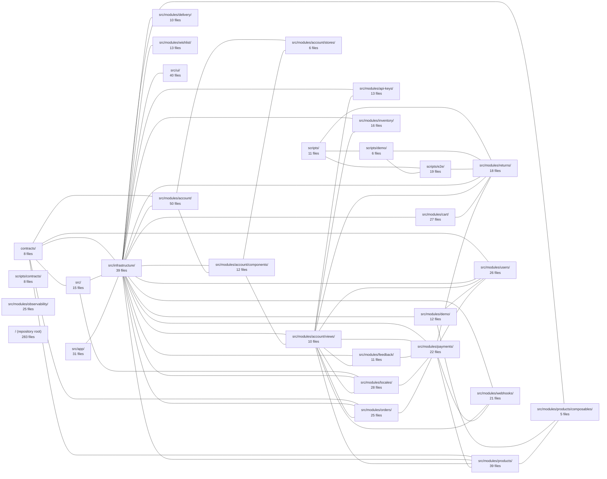

---
tags:
  - 2brain
  - 2brain/index
  - project/boilerplate-vue-frontend
type: index
modules: 30
updated: 2026-10-02T19:32:43.102148+00:00
---

# boilerplate-vue-frontend

`boilerplate-vue-frontend` is a Vue.js application scaffolded as a reusable e-commerce frontend template, shipping a full set of domain modules (products, cart, orders, payments, inventory, delivery, returns, wishlist, account, users, api-keys, webhooks, and others) built atop shared `src/ui/` and `src/infrastructure/` layers. Each feature directory under `src/modules/` is self-contained—combining its own components, views, stores, or composables—while cross-cutting concerns such as localization and observability live in dedicated sibling modules. Supporting material is split across `contracts/` for API type definitions and `scripts/` for build helpers, demo seeding, and end-to-end test tooling.

## Module map

## Modules
- [[boilerplate-vue-frontend_contracts|contracts/]] — 8 files, 7 connected modules
- [[boilerplate-vue-frontend_scripts|scripts/]] — 11 files, 4 connected modules
- [[boilerplate-vue-frontend_scripts_contracts|scripts/contracts/]] — 8 files, 0 connected modules
- [[boilerplate-vue-frontend_scripts_demo|scripts/demo/]] — 6 files, 4 connected modules
- [[boilerplate-vue-frontend_scripts_e2e|scripts/e2e/]] — 19 files, 4 connected modules
- [[boilerplate-vue-frontend_src|src/]] — 15 files, 4 connected modules
- [[boilerplate-vue-frontend_src_app|src/app/]] — 31 files, 1 connected module
- [[boilerplate-vue-frontend_src_infrastructure|src/infrastructure/]] — 39 files, 22 connected modules
- [[boilerplate-vue-frontend_src_modules_account|src/modules/account/]] — 50 files, 5 connected modules
- [[boilerplate-vue-frontend_src_modules_account_components|src/modules/account/components/]] — 12 files, 4 connected modules
- [[boilerplate-vue-frontend_src_modules_account_stores|src/modules/account/stores/]] — 6 files, 2 connected modules
- [[boilerplate-vue-frontend_src_modules_account_views|src/modules/account/views/]] — 10 files, 12 connected modules
- [[boilerplate-vue-frontend_src_modules_api-keys|src/modules/api-keys/]] — 13 files, 3 connected modules
- [[boilerplate-vue-frontend_src_modules_cart|src/modules/cart/]] — 27 files, 3 connected modules
- [[boilerplate-vue-frontend_src_modules_delivery|src/modules/delivery/]] — 10 files, 2 connected modules
- [[boilerplate-vue-frontend_src_modules_demo|src/modules/demo/]] — 12 files, 4 connected modules
- [[boilerplate-vue-frontend_src_modules_feedback|src/modules/feedback/]] — 11 files, 4 connected modules
- [[boilerplate-vue-frontend_src_modules_inventory|src/modules/inventory/]] — 16 files, 3 connected modules
- [[boilerplate-vue-frontend_src_modules_locales|src/modules/locales/]] — 28 files, 5 connected modules
- [[boilerplate-vue-frontend_src_modules_observability|src/modules/observability/]] — 25 files, 1 connected module
- [[boilerplate-vue-frontend_src_modules_orders|src/modules/orders/]] — 25 files, 5 connected modules
- [[boilerplate-vue-frontend_src_modules_payments|src/modules/payments/]] — 22 files, 10 connected modules
- [[boilerplate-vue-frontend_src_modules_products|src/modules/products/]] — 39 files, 6 connected modules
- [[boilerplate-vue-frontend_src_modules_products_composables|src/modules/products/composables/]] — 5 files, 3 connected modules
- [[boilerplate-vue-frontend_src_modules_returns|src/modules/returns/]] — 18 files, 8 connected modules
- [[boilerplate-vue-frontend_src_modules_users|src/modules/users/]] — 26 files, 6 connected modules
- [[boilerplate-vue-frontend_src_modules_webhooks|src/modules/webhooks/]] — 21 files, 4 connected modules
- [[boilerplate-vue-frontend_src_modules_wishlist|src/modules/wishlist/]] — 13 files, 2 connected modules
- [[boilerplate-vue-frontend_src_ui|src/ui/]] — 40 files, 1 connected module
- [[boilerplate-vue-frontend_ROOT|/ (repository root)]] — 283 files, 21 connected modules
