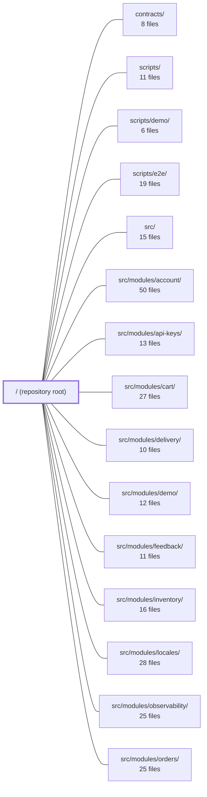

---
tags:
  - 2brain
  - 2brain/module
  - project/boilerplate-vue-frontend
type: module
module: / (repository root)
files: 283
updated: 2026-10-02T19:22:08.307466+00:00
---

# / (repository root)

## Purpose

Repository root for **boilerplate-vue-frontend** (v2.1.0): a Vue 3 + TypeScript e-commerce SPA built contract-first. This level owns project identity, API contract definitions, code-generation wiring, build/deployment configuration, quality gates, and the governance rules that bind every sub-module together. It is not itself an application module—it is the scaffold that `src/`, `contracts/`, and `scripts/` plug into.

## Key parts

- **Project identity & governance** — `package.json` (scripts, deps, engines), `CLAUDE.md` (coding rules, e.g. `unknown` over `any`), `README.md`, `SECURITY.md`, `release-please-config.json` (automated versioning/changelog).
- **API contracts & codegen** — `openapi.yaml` (REST, OpenAPI 3.0.3), `asyncapi.yaml` (SSE/webhook events, AsyncAPI 3.0.0), `orval.config.ts` (generates typed axios client + Zod schemas into `contracts/`), `spectral.yaml` (lints the OpenAPI spec for naming/consistency).
- **Build & deployment** — `index.html` (SPA shell, PWA meta, splash, config-script bootstrap), `docker/Dockerfile.production`, `docker/docker-entrypoint.d/40-generate-runtime-config.sh` (emits `config.js` at container start), `docker/docker-entrypoint.d/41-generate-security-txt.sh`, `docker-compose.yml` (dev: Vite + VitePress), `docker-compose.production.yml` (nginx serving the built bundle).
- **Quality & test orchestration** — `eslint.config.ts` (flat config; encodes architectural layer boundaries via `eslint-plugin-boundaries`), `cypress.config.ts` (e2e suite wiring, tier filter, Node-side `cy.task` registration, env/profile resolution), `stryker.config.json` (mutation testing), `tests/cross-cutting/` (architecture-level specs: module coupling, chunk budgets, a11y coverage, form idioms, etc.).
- **Documentation site** — `docs/.vitepress/config.mts`, `docs/.vitepress/theme/index.ts` (Mermaid zoom), `docs/tools/` (live-e2e, visual-regression guides).
- **Public static assets** — `public/images/` (brand logos, placeholders), `public/favicon/` (browser icons).

## How it connects

- **`contracts/`** is the *output* of the codegen pipeline defined here: `orval.config.ts` reads `openapi.yaml` and emits the typed client + Zod schemas that `src/` modules import.
- **`src/`** is the application source whose build, lint boundaries, and test scaffolding are all configured at this level. The `eslint.config.ts` layer rules directly constrain how `src/modules/*` may import from each other.
- **`src/modules/*`** (account, cart, orders, payments, etc.) are the feature units whose coupling, file-shape, and chunk-budget rules are asserted by the cross-cutting specs under `tests/cross-cutting/`.
- **`scripts/`** implements the npm tasks declared in `package.json`; **`scripts/e2e/`** holds the Cypress support code that `cypress.config.ts` registers; **`scripts/demo/`** powers the demo profile that the e2e and visual-regression docs reference.

## Where to start

1. **`README.md`** — one-paragraph summary of the project's contract-first, modular, backend-optional design; tells you what to expect before diving into code.
2. **`package.json`** — the full script surface (`dev`, `build`, `test`, `lint`, `contracts:bundle`, etc.) is the practical map of every workflow; from there you can trace into `orval.config.ts`, `eslint.config.ts`, or `cypress.config.ts` depending on your task.

## Connected modules

[[boilerplate-vue-frontend_contracts|contracts/]] · [[boilerplate-vue-frontend_scripts|scripts/]] · [[boilerplate-vue-frontend_scripts_demo|scripts/demo/]] · [[boilerplate-vue-frontend_scripts_e2e|scripts/e2e/]] · [[boilerplate-vue-frontend_src|src/]] · [[boilerplate-vue-frontend_src_modules_account|src/modules/account/]] · [[boilerplate-vue-frontend_src_modules_api-keys|src/modules/api-keys/]] · [[boilerplate-vue-frontend_src_modules_cart|src/modules/cart/]] · [[boilerplate-vue-frontend_src_modules_delivery|src/modules/delivery/]] · [[boilerplate-vue-frontend_src_modules_demo|src/modules/demo/]] · [[boilerplate-vue-frontend_src_modules_feedback|src/modules/feedback/]] · [[boilerplate-vue-frontend_src_modules_inventory|src/modules/inventory/]] · [[boilerplate-vue-frontend_src_modules_locales|src/modules/locales/]] · [[boilerplate-vue-frontend_src_modules_observability|src/modules/observability/]] · [[boilerplate-vue-frontend_src_modules_orders|src/modules/orders/]] · … and 6 more

## Files
- `CLAUDE.md` — MUST NOT use `any` — use `unknown` plus type narrowing.
- `README.md` — > Vue 3 + TypeScript SPA. Contract-first, modular, and able to run with no backend at all.
- `SECURITY.md` — Please report security vulnerabilities through GitHub's private
- `asyncapi.yaml` — Bundled AsyncAPI 3.0.0 contract that documents every real-time and event-driven channel in the boilerplate backend — SSE observability streams and outbound webhook events. It is the single generated source of truth for what the backend emits, over which transport, and with which payload, so that consumers (dashboards, subscribers, tooling) can rely on a stable schema without reading runtime code.
- `cypress.config.ts` — Cypress configuration that wires together the e2e suite: it defines viewport, retries, memory settings, the `@cypress/grep` tier filter, and registers every Node-side `cy.task` the browser cannot perform (image diffing, server-side auth, TOTP generation, webhook delivery). It also loads the project `.env` and Vite variables so that the `demo` vs `live` profile branching (driven by `liveProfile`) resolves correctly before any spec executes.
- `docker-compose.production.yml` — Defines the production deployment stack for the frontend: a single nginx container that serves the static Vite bundle. It is the counterpart to `docker-compose.yml` (development), replacing the bind-mounted dev server with a built image. It is intentionally the *only* frontend-side deployment artifact—no API service lives here.
- `docker-compose.yml` — Docker Compose file for the **development** frontend stack. It defines two services — a Vite dev server (`app`) and a VitePress docs site behind Nginx (`docs`) — so the entire frontend can run in containers with the same configuration a developer uses on the host.
- `docker/Dockerfile.production` — Multi-stage Dockerfile that produces the production frontend image: a Vite-bundled static site served by nginx. It is the deployment counterpart to `docker/Dockerfile` (dev), which runs the Vite dev server. The key design goal is a single image that can be promoted across environments with configuration supplied at container start rather than at build time.
- `docker/docker-entrypoint.d/40-generate-runtime-config.sh` — Generates `/usr/share/nginx/html/config.js` at every container start by reading `VITE_*` environment variables and emitting them as a `window.__APP_CONFIG` JS object literal. This makes a config change a simple restart (new env → new file) rather than a full image rebuild. It runs automatically because the official nginx image sources every executable `*.sh` under `/docker-entrypoint.d/` before launching the server.
- `docker/docker-entrypoint.d/41-generate-security-txt.sh` — Container-startup hook that writes `/.well-known/security.txt` (RFC 9116) into the nginx HTML root, sourced entirely from runtime environment variables. It is off by default: without both required variables set, no file is created and nginx's existing `location` block returns 404. Placing the logic at runtime (like `config.js`) ensures a fork never ships a stale or foreign contact address baked into the image.
- `docs/.vitepress/config.mts` — VitePress configuration file for the project's documentation site. It defines the site title, navigation, sidebar structure, local search, Mermaid diagram styling, and social links that render the `docs/` directory as a browsable website.
- `docs/.vitepress/theme/index.ts` — Custom VitePress theme that extends the default theme to add a click-to-zoom overlay for Mermaid diagrams rendered in the documentation. Because VitePress hydrates content after initial render, a `MutationObserver` is used to attach zoom behavior to newly inserted diagram elements.
- `docs/tools/live-e2e.md` — The demo profile ([The demo profile](./demo-profile.md)) runs the same API this one does, minus the infrastructure: in-memory Mongo, cache and queue disabled. What it cannot prove is full-stack behaviour — a real Redis, a real broker, a session cookie crossing a real network — and that gap is closed by running the same Cypress specs against the fully-composed backend instead.
- `docs/tools/visual-regression.md` — Photographing a handful of screens and comparing them, pixel by pixel, against committed baseline images.
- `eslint.config.ts` — Flat ESLint configuration for a Vue + TypeScript monorepo. Beyond standard lint rules, it encodes the entire architectural layer system and module-boundary contract as `eslint-plugin-boundaries` policies, so that a forbidden import, a cycle in the module graph, or a `foundation → shop` dependency fails at `npm run lint` time rather than in review.
- `index.html` — The HTML shell and boot entry point for a Vue 3 storefront SPA. It defines the pre-JavaScript UI (a static splash spinner), wires up favicons and PWA metadata, and loads the runtime-config script followed by the application bundle (`/src/main.ts`).
- `openapi.yaml` — Generated OpenAPI 3.0.3 contract for the "Ecommerce Demo API" (v0.1.0). Produced by `npm run contracts:bundle` from `shared/contracts/openapi.root.yaml` and per-module files under `src/modules/*/openapi.yaml`. Serves as the single source of truth for code generation (client/server stubs, DTOs, SDKs) across multi-language, multi-project consumers.
- `orval.config.ts` — Orval configuration that generates two artifacts from `openapi.yaml`: typed axios request functions (`contracts/rest/index.ts`) and Zod schemas (`contracts/rest/schemas.zod.ts`). It exists so the API client layer is always in lockstep with the OpenAPI spec rather than hand-maintained.
- `package.json` — Manifest for the `boilerplate-vue-frontend` project (v2.1.0, private, AGPL-3.0). Defines the dependency set, all npm scripts (dev, build, test, lint, contract generation, container orchestration, docs), and engine/tooling constraints. Serves as the single entry point for every task in the repo.
- `public/favicon/safari-pinned-tab.svg` — Safari pinned-tab icon (a black-and-white, single-color favicon variant). Browsers use this file to render the site's icon in Safari's pinned tab bar, where color is not supported—hence the solid black fill.
- `public/images/guebbit-logo-colored.svg` — Colored vector logo for the guebbit brand, exported from Adobe Illustrator. Serves as the scalable source asset for the full-color mark used across the site, with a PNG fallback available for contexts that require raster images.
- `public/images/guebbit-logo.svg` — Monochrome (black) SVG logo for the **guebbit** brand. Serves as the primary site logo image, typically referenced in the header or hero section. The `<desc>` block embeds SEO-oriented metadata (brand name, tagline, keywords) within a custom `xmlns:guebbit` namespace.
- `public/images/guebbit-logotype.svg` — Static SVG logotype for the **guebbit** brand (a web development / e-commerce / digital-solutions company). It renders the full wordmark "guebbit" as vector `<path>` elements so it scales without raster artifacts. The file is a self-contained asset meant to be referenced directly by HTML/CSS (e.g. `` or `background-image`), not embedded in a build pipeline.
- `public/images/no-image-placeholder.svg` — Static SVG fallback icon shown when a valid image cannot be displayed. It renders the standard "broken picture" glyph (frame + sun + mountains) in a neutral gray so the UI has a recognizable placeholder instead of a blank or broken-image icon.
- `release-please-config.json` — Configuration file for [release-please](https://github.com/googleapis/release-please), the automated release tooling. It tells release-please how to derive version numbers, where to write the changelog, and how to treat this repository's package layout. It is consumed by the `release-please-action` in the CI workflow.
- `spectral.yaml` — Spectral (OpenAPI linter) configuration that enforces project-specific quality gates and naming conventions on the OpenAPI spec. It layers custom rules on top of the default `spectral:oas` ruleset to keep operation IDs, schema names, and parameter names consistent and codegen-friendly.
- `stryker.config.json`
- `tests/cross-cutting/a11y-coverage.spec.ts`
- `tests/cross-cutting/backend-pairing.spec.ts`
- `tests/cross-cutting/badge-name.spec.ts`
- `tests/cross-cutting/coverage-and-mutate-scope.spec.ts`
- `tests/cross-cutting/destructive-confirm-naming.spec.ts`
- `tests/cross-cutting/entry-chunk-budget.spec.ts`
- `tests/cross-cutting/form-idiom.spec.ts`
- `tests/cross-cutting/journey-headers.spec.ts`
- `tests/cross-cutting/module-coupling.spec.ts`
- `tests/cross-cutting/module-file-shapes.spec.ts`
- `tests/cross-cutting/module-groups.spec.ts`
- `tests/cross-cutting/mutation-safe-imports.spec.ts`
- `tests/cross-cutting/page-window-density.spec.ts`
- `tests/cross-cutting/published-language.spec.ts`
- `tests/cross-cutting/registry.spec.ts`
- `tests/cross-cutting/route-name-coupling.spec.ts`
- `tests/cross-cutting/schemas-i18n.spec.ts`
- `tests/cross-cutting/sitemap-document.spec.ts`
- `tests/cross-cutting/store-location.spec.ts`
- `tests/e2e/fixtures/not-an-image.txt` — not an image, on purpose
- `tests/e2e/specs/a11y.cy.ts`
- `tests/e2e/specs/commerce.cy.ts`
- `tests/e2e/specs/consent.cy.ts`
- `tests/e2e/specs/harness.antibot.cy.ts`
- `tests/e2e/specs/harness.cy.ts`
- `tests/e2e/specs/journey.cy.ts`
- `tests/e2e/specs/journeys/ac1-lost-my-phone.cy.ts`
- `tests/e2e/specs/journeys/ac11-i-moved-house.cy.ts`
- `tests/e2e/specs/journeys/ac13-my-password-start-to-finish.cy.ts`
- `tests/e2e/specs/journeys/ac14-my-details-and-my-picture.cy.ts`
- `tests/e2e/specs/journeys/ac15-provider-account-proves-it-is-me.cy.ts`
- `tests/e2e/specs/journeys/ac16-two-factor-awkward-edges.cy.ts`
- `tests/e2e/specs/journeys/ac17-copied-session-cookie.cy.ts`
- `tests/e2e/specs/journeys/ac2-authenticator-app.cy.ts`
- `tests/e2e/specs/journeys/ac20-the-link-in-my-mail-went-stale.cy.ts`
- `tests/e2e/specs/journeys/ac3-prove-it-is-still-you.cy.ts`
- `tests/e2e/specs/journeys/ac4-my-laptop-was-stolen.cy.ts`
- `tests/e2e/specs/journeys/ac5-changed-my-mind-about-my-email.cy.ts`
- `tests/e2e/specs/journeys/ac6-give-me-my-data.cy.ts`
- `tests/e2e/specs/journeys/ac7-delete-account-with-open-orders.cy.ts`
- `tests/e2e/specs/journeys/at1-launch-a-new-language.cy.ts`
- `tests/e2e/specs/journeys/at2-fix-a-typo-in-the-dictionary.cy.ts`
- `tests/e2e/specs/journeys/at4-housekeeping-on-the-admin-page.cy.ts`
- `tests/e2e/specs/journeys/at5-audit-filters.cy.ts`
- `tests/e2e/specs/journeys/at5-feedback-filters.cy.ts`
- `tests/e2e/specs/journeys/at5-orders-filters.cy.ts`
- `tests/e2e/specs/journeys/at5-products-filters.cy.ts`
- `tests/e2e/specs/journeys/at5-stock-ledger-filters.cy.ts`
- `tests/e2e/specs/journeys/at5-users-filters.cy.ts`
- `tests/e2e/specs/journeys/at5-webhooks-filters.cy.ts`
- `tests/e2e/specs/journeys/at7-staff-accounts.cy.ts`
- `tests/e2e/specs/journeys/cu1-first-purchase.cy.ts`
- `tests/e2e/specs/journeys/cu10-digital-product-alone-and-mixed.cy.ts`
- `tests/e2e/specs/journeys/cu11-cancel-paid-order.cy.ts`
- `tests/e2e/specs/journeys/cu12-buy-again-catalogue-changed.cy.ts`
- `tests/e2e/specs/journeys/cu13-my-order-history.cy.ts`
- `tests/e2e/specs/journeys/cu15-another-address-and-a-note.cy.ts`
- `tests/e2e/specs/journeys/cu16-a-whole-purchase-in-italian.cy.ts`
- `tests/e2e/specs/journeys/cu17-the-cart-does-the-maths.cy.ts`
- `tests/e2e/specs/journeys/cu18-the-wishlist-from-both-doors.cy.ts`
- `tests/e2e/specs/journeys/cu19-transfer-order-paid-by-card.cy.ts`
- `tests/e2e/specs/journeys/cu2-unverified-cannot-buy-yet.cy.ts`
- `tests/e2e/specs/journeys/cu20-too-many-unpaid-transfers.cy.ts`
- `tests/e2e/specs/journeys/cu22-my-returns-page.cy.ts`
- `tests/e2e/specs/journeys/cu23-the-days-run-out.cy.ts`
- `tests/e2e/specs/journeys/cu3-bank-transfer.cy.ts`
- `tests/e2e/specs/journeys/cu4-card-slow-to-settle.cy.ts`
- `tests/e2e/specs/journeys/cu5-price-moves-while-in-cart.cy.ts`
- `tests/e2e/specs/journeys/cu6-out-of-stock-between-wishlist-and-checkout.cy.ts`
- `tests/e2e/specs/journeys/cu7-two-shoppers-one-last-unit.cy.ts`
- `tests/e2e/specs/journeys/cu8-product-pulled-while-buying.cy.ts`
- `tests/e2e/specs/journeys/cu9-shipping-rules-at-the-till.cy.ts`
- `tests/e2e/specs/journeys/fr1-double-click-place-order.cy.ts`
- `tests/e2e/specs/journeys/fr10-i-added-to-cart-as-a-guest.cy.ts`
- `tests/e2e/specs/journeys/fr11-one-device-two-people.cy.ts`
- `tests/e2e/specs/journeys/fr12-keyboard-only-purchase.cy.ts`
- `tests/e2e/specs/journeys/fr13-a-slow-network.cy.ts`
- `tests/e2e/specs/journeys/fr14-a-big-grid-does-not-trip-the-limit.cy.ts`
- `tests/e2e/specs/journeys/fr2-back-button-after-paying.cy.ts`
- `tests/e2e/specs/journeys/fr4-reload-in-the-middle-of-checkout.cy.ts`
- `tests/e2e/specs/journeys/fr5-shopping-on-a-phone.cy.ts`
- `tests/e2e/specs/journeys/fr6-too-many-attempts.cy.ts`
- `tests/e2e/specs/journeys/fr7-the-api-goes-away.cy.ts`
- `tests/e2e/specs/journeys/fr8-session-expired-while-typing.cy.ts`
- `tests/e2e/specs/journeys/fr9-a-link-i-was-sent.cy.ts`
- `tests/e2e/specs/journeys/in1-a-key-does-what-it-was-given.cy.ts`
- `tests/e2e/specs/journeys/in2-banning-the-minter-bans-the-key.cy.ts`
- `tests/e2e/specs/journeys/in3-an-order-fires-a-signed-webhook.cy.ts`
- `tests/e2e/specs/journeys/in4-replay-a-failed-delivery.cy.ts`
- `tests/e2e/specs/journeys/in6-keep-a-webhook-healthy.cy.ts`
- `tests/e2e/specs/journeys/in7-a-key-has-limits.cy.ts`
- `tests/e2e/specs/journeys/n1-withdraw-before-dispatch.cy.ts`
- `tests/e2e/specs/journeys/n2-withdraw-after-delivery.cy.ts`
- `tests/e2e/specs/journeys/n3-two-staff-edit-one-product.cy.ts`
- `tests/e2e/specs/journeys/op1-fulfil-paid-order.cy.ts`
- `tests/e2e/specs/journeys/op10-editors-product-cradle-to-grave.cy.ts`
- `tests/e2e/specs/journeys/op13-each-role-sees-what-it-may.cy.ts`
- `tests/e2e/specs/journeys/op14-audit-trail-follows-the-action.cy.ts`
- `tests/e2e/specs/journeys/op15-order-housekeeping.cy.ts`
- `tests/e2e/specs/journeys/op22-defective-item-comes-back.cy.ts`
- `tests/e2e/specs/journeys/op23-cash-goes-back-by-hand.cy.ts`
- `tests/e2e/specs/journeys/op4-refund-delivered-order.cy.ts`
- `tests/e2e/specs/journeys/op5-cancel-only-or-refund.cy.ts`
- `tests/e2e/specs/journeys/op8-day-in-the-stock-room.cy.ts`
- `tests/e2e/specs/journeys/op9-expired-holds-are-swept.cy.ts`
- `tests/e2e/specs/journeys/vi1-browse-the-catalogue.cy.ts`
- `tests/e2e/specs/journeys/vi2-find-your-way-around.cy.ts`
- `tests/e2e/specs/journeys/vi3-a-guest-writes-to-the-shop.cy.ts`
- `tests/e2e/specs/keyboard.cy.ts`
- `tests/e2e/specs/locale.cy.ts`
- `tests/e2e/specs/resilience.cy.ts`
- `tests/e2e/specs/storefront.cy.ts`
- `tests/e2e/specs/uploads.cy.ts`
- `tests/e2e/visual/visual.cy.ts`
- `tests/support/e2e/a11y-sweep.ts`
- `tests/support/e2e/a11y-task.ts`
- `tests/support/e2e/admin-api-task.ts`
- `tests/support/e2e/commands.ts`
- `tests/support/e2e/e2e.ts`
- `tests/support/e2e/fixtures.ts`
- `tests/support/e2e/harness.ts`
- `tests/support/e2e/images.ts`
- `tests/support/e2e/integrator.ts`
- `tests/support/e2e/journey.ts`
- `tests/support/e2e/resilience.ts`
- `tests/support/e2e/scenario.ts`
- `tests/support/e2e/security-steps.ts`
- `tests/support/e2e/steps.ts`
- `tests/support/e2e/visual-sweep.ts`
- `tests/support/e2e/visual-task.ts`
- `tests/support/stub.ts`
- `tests/support/unit/fixtures.ts`
- `tests/support/unit/jsdom-quiet-css.environment.ts`
- `tests/support/unit/mounted-vm.ts`
- `tests/support/unit/setup.ts`
- `tests/support/unit/watch-handle.ts`
- `tests/support/unit/wire-modules.ts`
- `tests/unit/app/analytics-consent-banner.spec.ts`
- `tests/unit/app/app-navigation.spec.ts`
- `tests/unit/app/branding.spec.ts`
- `tests/unit/app/error-messages.spec.ts`
- `tests/unit/app/error-page.spec.ts`
- `tests/unit/app/guards/authentications-restore.spec.ts`
- `tests/unit/app/guards/authentications.spec.ts`
- `tests/unit/app/guards/locale-choice.spec.ts`
- `tests/unit/app/health-banner.spec.ts`
- `tests/unit/app/language-switcher.spec.ts`
- `tests/unit/app/layout-default.spec.ts`
- `tests/unit/app/oauth-callback.spec.ts`
- `tests/unit/app/reauth-dialog-error-message.spec.ts`
- `tests/unit/app/reauth-dialog.spec.ts`
- `tests/unit/app/router/announcer.spec.ts`
- `tests/unit/app/router/navigation.spec.ts`
- `tests/unit/app/router/router.spec.ts`
- `tests/unit/app/router/stale-deploy.spec.ts`
- `tests/unit/app/use-focus-tooltip.spec.ts`
- `tests/unit/app/verification-banner.spec.ts`
- `tests/unit/app/vue-error-handler.spec.ts`
- `tests/unit/demo-modules.spec.ts`
- `tests/unit/docker/security-txt-entrypoint.spec.ts`
- `tests/unit/i18n/i18n.spec.ts`
- `tests/unit/i18n/language-label.spec.ts`
- `tests/unit/infrastructure/analytics-consent.spec.ts`
- `tests/unit/infrastructure/blank-build-environment.spec.ts`
- `tests/unit/infrastructure/create-sse-client.spec.ts`
- `tests/unit/infrastructure/http/antibot.spec.ts`
- `tests/unit/infrastructure/http/client.spec.ts`
- `tests/unit/infrastructure/http/envelope.spec.ts`
- `tests/unit/infrastructure/http/etag.spec.ts`
- `tests/unit/infrastructure/http/http-etag.spec.ts`
- `tests/unit/infrastructure/http/http-refresh.spec.ts`
- `tests/unit/infrastructure/http/http-request.spec.ts`
- `tests/unit/infrastructure/http/http-validate-requests.spec.ts`
- `tests/unit/infrastructure/http/http-validate-responses.spec.ts`
- `tests/unit/infrastructure/http/http.spec.ts`
- `tests/unit/infrastructure/http/idempotency.spec.ts`
- `tests/unit/infrastructure/http/keepalive.spec.ts`
- `tests/unit/infrastructure/http/orval-fixture-schema.ts`
- `tests/unit/infrastructure/http/orval-mutator.spec.ts`
- `tests/unit/infrastructure/http/response-schema-map.spec.ts`
- `tests/unit/infrastructure/http/single-flight.spec.ts`
- `tests/unit/infrastructure/http/step-up.spec.ts`
- `tests/unit/infrastructure/http/url.spec.ts`
- `tests/unit/infrastructure/locale-overrides.spec.ts`
- `tests/unit/infrastructure/observability.spec.ts`
- `tests/unit/infrastructure/observability/config.spec.ts`
- `tests/unit/infrastructure/observability/store-faro.spec.ts`
- `tests/unit/infrastructure/runtime-config.spec.ts`
- `tests/unit/infrastructure/session.spec.ts`
- `tests/unit/infrastructure/shop-currency.spec.ts`
- `tests/unit/infrastructure/theme-preference.spec.ts`
- `tests/unit/infrastructure/utils/errors.spec.ts`
- `tests/unit/infrastructure/utils/formatters.property.spec.ts`
- `tests/unit/infrastructure/utils/formatters.spec.ts`
- `tests/unit/infrastructure/utils/forms.spec.ts`
- `tests/unit/infrastructure/utils/images.spec.ts`
- `tests/unit/infrastructure/utils/logger.spec.ts`
- `tests/unit/infrastructure/utils/sort.spec.ts`
- `tests/unit/infrastructure/utils/uploads.spec.ts`
- `tests/unit/infrastructure/utils/use-blocking-error.spec.ts`
- `tests/unit/infrastructure/utils/use-missing-record.spec.ts`
- `tests/unit/infrastructure/utils/use-reset-on-viewer-change.spec.ts`
- `tests/unit/infrastructure/utils/use-stale-record.spec.ts`
- `tests/unit/kernel/registry.spec.ts`
- `tests/unit/kernel/route-link.spec.ts`
- `tests/unit/kernel/slots.spec.ts`
- `tests/unit/scripts/demo/demo-remove-tests.spec.ts`
- `tests/unit/scripts/demo/scratch-directory.spec.ts`
- `tests/unit/scripts/document-facts.spec.ts`
- `tests/unit/scripts/e2e/antibot-backend.spec.ts`
- `tests/unit/scripts/e2e/cents.spec.ts`
- `tests/unit/scripts/e2e/cypress-spec-globs.spec.ts`
- `tests/unit/scripts/e2e/device-session.spec.ts`
- `tests/unit/scripts/e2e/flaky-report.spec.ts`
- `tests/unit/scripts/e2e/live-shard.spec.ts`
- `tests/unit/scripts/e2e/mail-message.spec.ts`
- `tests/unit/scripts/e2e/payment-webhook.spec.ts`
- `tests/unit/scripts/e2e/reset-command.spec.ts`
- `tests/unit/scripts/e2e/shard-balancer.spec.ts`
- `tests/unit/scripts/e2e/spec-durations.spec.ts`
- `tests/unit/scripts/e2e/step-prefix.spec.ts`
- `tests/unit/scripts/e2e/totp.spec.ts`
- `tests/unit/scripts/e2e/webhook-sink.spec.ts`
- `tests/unit/scripts/e2e/webhook-tester.spec.ts`
- `tests/unit/scripts/module-edges.spec.ts`
- `tests/unit/scripts/mutation/baseline.spec.ts`
- `tests/unit/scripts/pairing/paired-backend-path.spec.ts`
- `tests/unit/scripts/pairing/spec-identity.spec.ts`
- `tests/unit/scripts/repo-root-resolution.spec.ts`
- `tests/unit/ui/data-table.spec.ts`
- `tests/unit/ui/dialog.spec.ts`
- `tests/unit/ui/form-card.spec.ts`
- `tests/unit/ui/form-counter-input.spec.ts`
- `tests/unit/ui/form-image-upload.spec.ts`
- `tests/unit/ui/human-check.spec.ts`
- `tests/unit/ui/inline-error-alert.spec.ts`
- `tests/unit/ui/lazy-image.spec.ts`
- `tests/unit/ui/list-pagination.spec.ts`
- `tests/unit/ui/page-size-select.spec.ts`
- `tests/unit/ui/secret-reveal-modal.spec.ts`
- `tests/unit/ui/sort-select.spec.ts`
- `tests/unit/ui/translation-tabs.spec.ts`
- `tests/unit/ui/use-axios-upload-progress.spec.ts`
- `tests/unit/ui/use-list-url-state.spec.ts`
- `tests/unit/ui/use-query-synced-filters.spec.ts`
- `tests/unit/ui/use-return-focus.spec.ts`
- `tests/unit/ui/use-server-sort.spec.ts`
- `tests/unit/ui/vuetify-selectors.spec.ts`
- `tsconfig.app.json`
- `tsconfig.cypress.json`
- `tsconfig.json`
- `tsconfig.node.json`
- `tsconfig.vitest.json`
- `vite.config.ts`
- `vitest.config.mutation.ts`
- `vitest.config.ts`

---
[[boilerplate-vue-frontend_INDEX|← boilerplate-vue-frontend index]]
