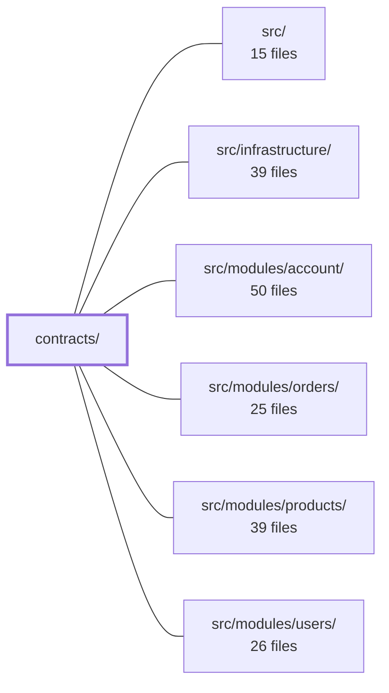

---
tags:
  - 2brain
  - 2brain/module
  - project/boilerplate-vue-frontend
type: module
module: contracts/
files: 8
updated: 2026-10-02T19:22:26.766058+00:00
---

# contracts/

## Purpose

`contracts/` is the generated, single-source-of-truth layer that defines every wire-level agreement in the system: REST request/response types, event-channel and SSE payload shapes, and the full set of authorization permission keys. All files are produced from YAML specs (`openapi.yaml`, `asyncapi.yaml`, per-module `authorization.yaml` fragments) so that server code, client code, and tooling never hand-maintain parallel copies of the same contract.

## Key parts

- **REST contract (`contracts/rest/`)** — `index.ts` provides the full set of TypeScript types and DTOs for the Ecommerce Demo API; `schemas.zod.ts` adds runtime Zod validators for every endpoint's params, body, and response; `error-codes.ts` is the typed registry of every declared error code. Together they let server and client share one definition without importing the OpenAPI document at runtime.
- **REST routing metadata (`contracts/rest/routes.ts`, `operation-modules.ts`)** — Lookup tables mapping HTTP method + path to schema names and to the owning backend module. Consumed by infrastructure components (response-schema resolution, auth scoping, module-coupling tests) instead of re-parsing the spec.
- **Event / SSE contract (`asyncapi.generated.ts`)** — Channel-name constants, TypeScript types, and payload schemas derived from `asyncapi.yaml`. Producers, consumers, and the SSE layer all import from here.
- **Authorization contract (`authorization-keys.yaml`, `permission-actions.ts`)** — The bundled, byte-identical list of every permission key in the system plus the canonical union type of valid action strings. Generated by splicing per-module YAML fragments; a `--check` step fails the build on drift.

## How it connects

- **`src/modules/account/`, `orders/`, `products/`, `users/`** — Each module declares its own `authorization.yaml` fragment and owns a subset of REST operations. Those fragments feed `authorization-keys.yaml`, and `operation-modules.ts` maps each operation back to its owning module for auth scoping and coupling checks.
- **`src/infrastructure/`** — Runtime plumbing (routing, response serialization, validation middleware) imports the generated Zod schemas, route tables, and error-code constants rather than hard-coding strings.
- **`src/`** — General server-side code imports the REST types and permission-action union to stay typed against the contract.
- **`/` (repository root)** — The source-of-truth YAML specs (`openapi.yaml`, `asyncapi.yaml`, root authorization residual) live here; the generation scripts at the root produce every file in this module.

## Where to start

1. **`contracts/rest/index.ts`** — Skimming the exported types gives you the full shape of the API surface (endpoints, payloads, envelopes) in one file.
2. **`contracts/authorization-keys.yaml`** — A flat, human-readable listing of every permission key and action in the system; reading it once makes the auth scoping logic in any module far easier to follow.

## Connected modules

[[boilerplate-vue-frontend_ROOT|/ (repository root)]] · [[boilerplate-vue-frontend_src|src/]] · [[boilerplate-vue-frontend_src_infrastructure|src/infrastructure/]] · [[boilerplate-vue-frontend_src_modules_account|src/modules/account/]] · [[boilerplate-vue-frontend_src_modules_orders|src/modules/orders/]] · [[boilerplate-vue-frontend_src_modules_products|src/modules/products/]] · [[boilerplate-vue-frontend_src_modules_users|src/modules/users/]]

## Files
- `contracts/asyncapi.generated.ts` — Auto-generated TypeScript types, channel-name constants, and SSE payload schemas derived from the project's `asyncapi.yaml` spec. It exists so that event producers, consumers, and the real-time SSE layer share a single source of truth for channel identifiers and payload shapes without hand-maintaining them.
- `contracts/authorization-keys.yaml` — Generated bundle that is the single authoritative list of every permission key in the system. It is produced by `npm run authorization:bundle`, which splices per-module fragments (`src/modules/<name>/authorization.yaml`) together with a root residual for app-level `core` keys. `--check` (wired into `complete`) fails the build if the bundle drifts from the fragments. The file is committed byte-identical in both the Node and PHP backend repos and is excluded from both formatters to prevent silent divergence.
- `contracts/permission-actions.ts` — Auto-generated TypeScript module that exports the canonical set of permission action strings and a corresponding union type. It is derived from the shared `authorization-keys.yaml` (`actions:` block) so that every consumer shares a single source of truth for valid actions.
- `contracts/rest/error-codes.ts` — Generated registry of every error code the REST contract declares. It exists so that both server and client can reference a single typed constant for `errors[].code` values without hard-coding strings. Generated from `openapi.yaml` via `npm run gen:api` — do not edit by hand.
- `contracts/rest/index.ts` — Auto-generated (orval v8.20.0) REST client types and DTOs for the Ecommerce Demo API. It defines every wire-level type — request payloads, response envelopes, pagination metadata, and domain models — so that both the server runtime and any external consumer share a single source of truth for the API contract. The file is committed to the repo and must not be edited by hand.
- `contracts/rest/operation-modules.ts` — Auto-generated lookup table that maps every API operation name to the backend module that owns it. It exists so that tooling (routing, auth scoping, module-coupling tests) can resolve "which module is responsible for this endpoint" without re-parsing the OpenAPI spec at runtime.
- `contracts/rest/routes.ts` — Auto-generated lookup table of every REST operation declared in `openapi.yaml`. It maps each HTTP method + path pattern to the response-schema name, optional request-body schema name, and owning backend module. It exists so runtime components (e.g. `response-schema-map.ts`) can resolve concrete `@api/schemas` types without parsing the OpenAPI document at runtime.
- `contracts/rest/schemas.zod.ts` — Auto-generated (by orval v8.20.0) Zod schema definitions for the Ecommerce Demo API's REST contract. It provides runtime-validation schemas for every endpoint's request body, query/path params, and response shape so client and server code can type-check payloads without importing the full OpenAPI document. The file also carries the API's i18n / locale-management schema surface (locales, tenants, dictionaries).

---
[[boilerplate-vue-frontend_INDEX|← boilerplate-vue-frontend index]]
