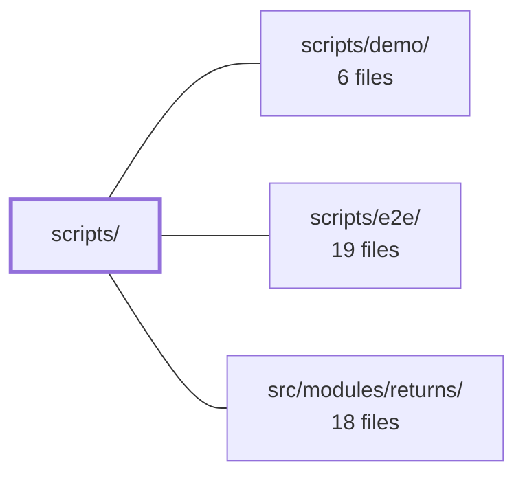

---
tags:
  - 2brain
  - 2brain/module
  - project/boilerplate-vue-frontend
type: module
module: scripts/
files: 11
updated: 2026-10-02T19:22:52.216470+00:00
---

# scripts/

## Purpose

`scripts/` holds the repository's developer-facing tooling and quality gates: documentation fact-checking, per-file mutation-coverage ratcheting, cross-repo contract integrity between the frontend and its paired backend, and the hand-maintained architectural boundary definitions (module groups and allowed edges) that the ESLint import rule and CI enforce on all frontend source.

## Key parts

- **`docs/`** — Two validators that keep the wiki honest. `check-references.ts` walks every inline-code path in doc pages and confirms the file still exists; `document-facts.ts` runs I/O-free text assertions against `package.json` scripts, dependency lists, and the generated `@api` contract.
- **`mutation/`** — A per-file mutation-score ratchet. `run-tests.ts` wraps Stryker with machine-aware resource settings and OOM guards; `check-baseline.ts` is the cheap CI gate that compares the latest report against `mutation-baseline.json`; `baseline.ts` holds the scoring and comparison logic.
- **`pairing/`** — The cross-repo contract gate. `spec-identity.ts` defines which files must be byte-identical between this repo and the paired backend; `check-spec-identity.ts` is the CLI entry point wired to `npm run check:spec-identity`; `paired-backend-path.ts` centralises the `BACKEND_PATH` resolution so the e2e shard runner, demo runner, and spec checker all agree on *which* backend checkout they target.
- **Boundary definitions (root level)** — `module-groups.ts` assigns every frontend module to a `foundation` or `shop` axis; `module-edges.ts` is the allowlist of permitted cross-module imports. Both are the single human-edited source of truth that the ESLint import rule reads.
- **`testing/`** — `report-results.ts` reshapes a flat Jest/Vitest JSON report into a per-module pass/fail/duration table, bridging the gap between the runner's output and the codebase's module organisation.

## How it connects

- **`/` (repository root):** Every script in this module is surfaced as an `npm run` entry point defined in the root `package.json` (e.g. `check:docs-references`, `check:spec-identity`, `test:report`). The root `ci.yml` and pre-commit hook call into these scripts directly.
- **`scripts/demo/`:** The demo runner is a consumer of `pairing/paired-backend-path.ts`, which supplies the resolved backend path and template-substituted demo commands so the demo script need not re-implement the lookup.
- **`scripts/e2e/`:** The e2e shard runner likewise imports `pairing/paired-backend-path.ts` to locate the paired backend and agree on the shard ceiling.
- **`src/modules/returns/`** (and other frontend modules): Governed by the boundary definitions in `module-groups.ts` and `module-edges.ts`. A new import in `returns` that crosses a forbidden edge or violates its assigned group will be rejected by the ESLint rule that reads these two files.

## Where to start

1. **`scripts/module-groups.ts`** — Short, hand-written, and immediately shows the foundation/shop axis that shapes every frontend module's import surface. Reading it first gives you the vocabulary the rest of the scripts enforce.
2. **`scripts/pairing/paired-backend-path.ts`** — The single file that explains how this frontend repo locates and talks to its paired backend; understanding it makes the e2e, demo, and spec-identity scripts straightforward.

## Connected modules

[[boilerplate-vue-frontend_ROOT|/ (repository root)]] · [[boilerplate-vue-frontend_scripts_demo|scripts/demo/]] · [[boilerplate-vue-frontend_scripts_e2e|scripts/e2e/]] · [[boilerplate-vue-frontend_src_modules_returns|src/modules/returns/]]

## Files
- `scripts/docs/check-references.ts` — Validates that every file path cited in inline code spans across the docs actually exists in the repository tree (or the paired backend tree). `docs:build` catches dead *links* between pages; this script catches dead *facts*—a page that lists `models/serialize.ts` as a current property-tested surface. Run via `npm run check:docs-references`.
- `scripts/docs/document-facts.ts` — Pure text-level fact checks that verify what documentation pages claim about `package.json` scripts, dependencies, and the generated `@api` / `@api/schemas` contract. The file is deliberately I/O-free (no git tree, no file reads) so that every rule is a plain function a unit spec can drive with a string fixture.
- `scripts/module-edges.ts` — Hand-maintained allowlist of which frontend modules may reach which backend modules, plus a graph-integrity check. It makes a new cross-module coupling a deliberate edit to this single file rather than an unreviewed one-line import, per the strategic-DDD policy in `docs/theory/strategic-ddd.md` §2.
- `scripts/module-groups.ts` — Hand-maintained map of which `foundation | shop` axis each frontend module belongs to. It is the FE mirror of the paired backend's `module.yaml#group` field and exists to make the foundation/shop boundary explicit so that the ESLint import rule and the cross-cutting spec can enforce it. A new module cannot appear without a human assigning a group — that is the design intent.
- `scripts/mutation/baseline.ts` — Implements a per-file mutation-score ratchet on top of Stryker's global thresholds. Stryker only supports `high` / `low` / `break` gates over the entire `mutate` scope, so a strong file can mask a weak one. This file records each file's score in `mutation-baseline.json`, then enforces that no file may drop below its last recorded value (within a small tolerance), while improvements are locked in. It is the scoring, comparison, and reporting logic; the CLI entry point lives elsewhere.
- `scripts/mutation/check-baseline.ts` — CLI entry point for the per-file mutation-coverage ratchet. It reads the latest Stryker JSON report and a stored baseline, then either **checks** (default) that no file has regressed, or **updates** the baseline (`--update`). It deliberately never invokes Stryker itself so the expensive test run and the cheap gate can be split across CI steps.
- `scripts/mutation/run-tests.ts` — A CLI wrapper around `npx stryker run` that handles three concerns a static `stryker.config.json` cannot: sourcing machine-specific settings (`concurrency`, per-worker heap) from `.env`, clearing Stryker's sandbox directory before the run, and aborting the run early when it detects an OOM-restart loop. It exists so a developer's laptop and a CI runner can disagree on resource usage without either editing a tracked file.
- `scripts/pairing/check-spec-identity.ts` — CLI entry point for the cross-repo contract check (`npm run check:spec-identity`). It locates the paired backend checkout, compares a set of shared contract files between the two repos, and reports whether they have forked. Serves as the gate for `npm run complete` (pre-commit) and is also invoked directly by `ci.yml`.
- `scripts/pairing/paired-backend-path.ts` — Shared resolution logic for locating and interacting with the paired backend checkout from the frontend repo. Centralises the `BACKEND_PATH` fallback chain, template-substituted reset/demo commands, and the shard ceiling so that `cypress.config.ts`, the e2e shard runner, the spec-identity checker, and the demo runner all agree on *which* backend they mean without each re-implementing the lookup.
- `scripts/pairing/spec-identity.ts` — Defines the cross-repo contract identity check: a canonical list of files that must be byte-identical between this frontend and its paired backend, plus the fingerprinting and comparison logic to detect a silent fork. A forked spec is still a valid spec, so neither CI catches it on its own — this module is the explicit gate.
- `scripts/testing/report-results.ts` — CLI script (invoked via `npm run test:report`) that reads a Jest/Vitest JSON test report and prints a human-readable summary: per-module pass/fail/duration table, slowest suites and tests, failure index, and optional per-module line coverage. It exists because the runner's raw log is flat and layer-shaped, while the codebase is organised by module — this script bridges that gap without altering how tests are run.

---
[[boilerplate-vue-frontend_INDEX|← boilerplate-vue-frontend index]]
