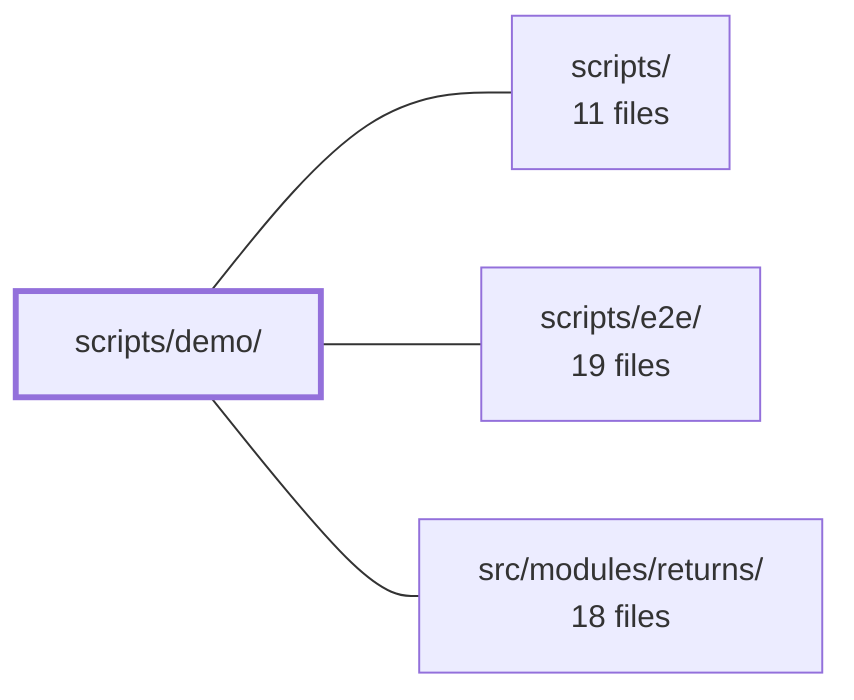

---
tags:
  - 2brain
  - 2brain/module
  - project/boilerplate-vue-frontend
type: module
module: scripts/demo/
files: 6
updated: 2026-10-02T19:23:32.103365+00:00
---

# scripts/demo/

## Purpose

Tooling for the demo-module lifecycle: removing demo modules from the codebase, measuring how cleanly they can be stripped, and spawning/tearing down the throwaway backend instances the demo flow depends on.

## Key parts

- **Demo removal workflow** — `demo-remove.ts` is the entry point (`npm run demo:remove`); it deletes module folders, registry entries, manifests, and cross-module test specs. `demo-remove-tests.ts` handles the test-cleanup slice (removing specs under `tests/e2e/` that reference a deleted module and validating `// requires-module:` headers on survivors). `demo-module-names.ts` is a small shared helper that reads `DEMO_MODULE_NAMES` out of `src/demo-modules.ts` via regex, avoiding a cross-project TypeScript import that would trip `vue-tsc --build`.
- **Removability measurement** — `measure-demo-strip.ts` (FE-D4 step 1) builds a scratch copy of the repo, deletes every listed demo module, then runs type-check, lint, and build against the remainder. It is report-only and non-mutating to the real checkout.
- **Demo backend execution** — `run-backend.ts` is the thin `spawn` wrapper behind `npm run backend:demo`; it resolves the backend command, assembles the environment, and launches the process for `start-server-and-test`. `scratch-directory.ts` gives each spawned backend a per-PID `TMPDIR` under the user cache dir and sweeps abandoned directories on the next creation, bounding `mongodb-memory-server` leak cost.

## How it connects

- **`scripts/e2e/`** — `demo-remove-tests.ts` reads, rewrites, and validates the cross-module E2E spec files and their `// requires-module:` headers, making it the cleanup counterpart to whatever `scripts/e2e/` orchestrates.
- **`src/modules/returns/`** — Appears in the dependency graph as a module whose removal (or cross-references in E2E specs) is exercised by the demo-remove and measurement workflows.
- **`scripts/`** — Parent directory; the `ops/` sibling holds the backend-side counterpart (`scripts/ops/demo-remove-tests.ts`) to this module's frontend-side cleanup.
- **Repository root** — `demo-remove.ts` and `measure-demo-strip.ts` both operate on the full checkout (or a scratch copy of it), touching module folders, registry files, and manifests across the tree.

## Where to start

Read `demo-remove.ts` first to understand the end-to-end removal sequence and what "removing a module" concretely entails in this repo. Then read `demo-module-names.ts` (it's ~20 lines) to see how the shared module list is sourced without breaking project references—a constraint that shapes several other decisions in this directory.

## Connected modules

[[boilerplate-vue-frontend_ROOT|/ (repository root)]] · [[boilerplate-vue-frontend_scripts|scripts/]] · [[boilerplate-vue-frontend_scripts_e2e|scripts/e2e/]] · [[boilerplate-vue-frontend_src_modules_returns|src/modules/returns/]]

## Files
- `scripts/demo/demo-module-names.ts` — Provides a single shared way for the two `scripts/demo/` scripts to obtain the list of names from `DEMO_MODULE_NAMES` in `src/demo-modules.ts`. It reads the value out of the source **text** (via regex) instead of a live `import`, because `scripts/**` and `src/**` belong to separate TypeScript project references and a cross-project import would break `vue-tsc --build` (TS6307).
- `scripts/demo/demo-remove-tests.ts` — Removes cross-module E2E specs (under `tests/e2e/`) that reference a module being deleted, and validates the `// requires-module:` headers on remaining specs. It is the frontend test-cleanup step in the `demo:remove` workflow, paired with the backend's `scripts/ops/demo-remove-tests.ts`.
- `scripts/demo/demo-remove.ts` — Demo script (`npm run demo:remove`) that surgically removes every module listed in `src/demo-modules.ts` from the checkout: their folders, their registry entries, their manifest, and any cross-module test specs that reference them. It runs in-place (not on a scratch copy) and is the frontend counterpart to the backend's `G-D2` removal step.
- `scripts/demo/measure-demo-strip.ts` — A report-only measurement script (FE-D4 step 1) that answers "how far is the demo shop from being removable?" by assembling a scratch copy of the repo, deleting every demo module listed in `src/demo-modules.ts`, and running `type-check-only`, `lint`, and `build-only` against what remains. It explicitly does **not** mutate the real checkout and is not a merge gate — a failing check is a punch-list item, not a blocker.
- `scripts/demo/run-backend.ts` — A thin `spawn` wrapper behind the `npm run backend:demo` script. It resolves which paired backend to run (via `resolveBackendDemoCommand`), assembles the environment a throwaway demo instance needs, and launches it so that `start-server-and-test` (or a human) gets a single ready-to-execute command. It also handles the "no command configured" case by idling so `start-server-and-test` doesn't interpret a clean exit as a crashed server.
- `scripts/demo/scratch-directory.ts` — Provides a disk-backed, per-PID scratch directory for demo backends that this repo spawns. `mongodb-memory-server` writes its data under `TMPDIR` and only deletes it on a graceful `stop()`; a killed backend (SIGTERM, ^C, crash) leaves ~200 MB behind. This module redirects `TMPDIR` to a short path under the user's cache directory and sweeps abandoned directories on the next creation, bounding the cost of a leak to one subsequent run.

---
[[boilerplate-vue-frontend_INDEX|← boilerplate-vue-frontend index]]
