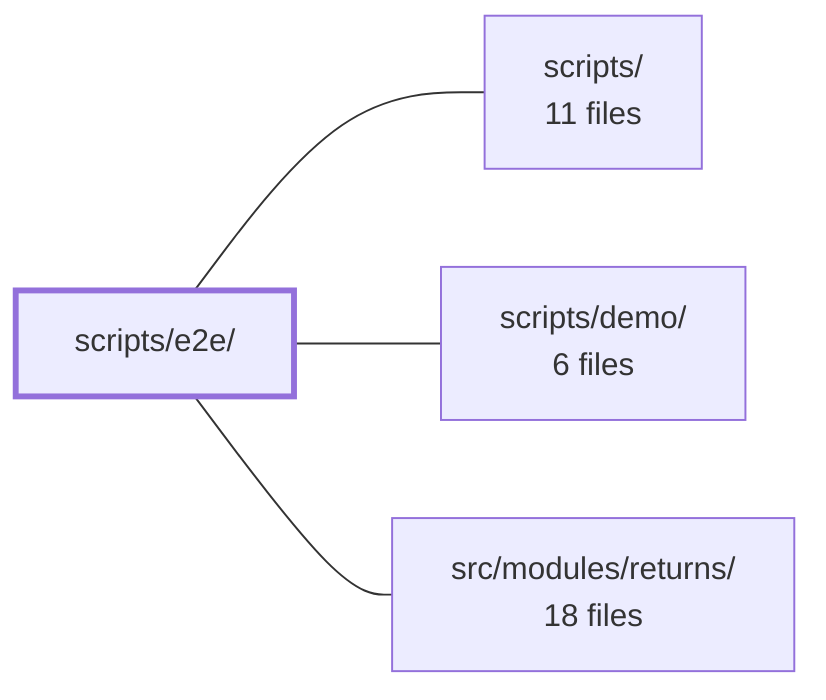

---
tags:
  - 2brain
  - 2brain/module
  - project/boilerplate-vue-frontend
type: module
module: scripts/e2e/
files: 19
updated: 2026-10-02T19:23:52.055949+00:00
---

# scripts/e2e/

## Purpose

`scripts/e2e/` holds the infrastructure and pure-utility code that powers the project's end-to-end test suite. It provides shard scheduling and balancing, multi-device session simulation, webhook delivery and verification, flaky-test reporting, and small browser-free helpers that e2e specs (and the unit suite) import to exercise money parsing, TOTP generation, mail normalisation, and step-label formatting—without requiring a live Cypress browser.

## Key parts

- **Shard scheduling & execution** — `run-shards.ts` orchestrates parallel Cypress shards against a single Vite build; `shard-balancer.ts` contains the pure LPT bin-packing algorithm; `spec-durations.ts` persists per-spec wall-clock times so weights self-improve; `cypress-spec-globs.ts` is the single source of truth for spec-file globs shared by `cypress.config.ts`, ESLint, and the shard runner. `live-shard.ts` and `print-live-shard.ts` compute the disjoint spec slices for the nightly live CI matrix.
- **Webhook & payment simulation** — `webhook-sink.ts` is a loopback HTTP server that records replayed webhook deliveries for the demo profile; `webhook-tester.ts` normalises the live `webhook-tester` container output into the same shape; `webhook-demo-secret.ts` exports the shared HMAC secret for browser-side signature checks; `payment-webhook.ts` crafts HMAC-signed `POST /payments/webhook` requests to trigger provider-side outcomes (late success, duplicate IDs, stale timestamps).
- **Multi-device & session helpers** — `device-session.ts` simulates a second logged-in device with its own cookie jar to prove logout-everywhere and password-reset flows; `antibot-backend.ts` is the shared config that boots the demo backend with the Altcha antibot provider so every entry point starts identically.
- **Flaky-test visibility** — `flaky-report.ts` collects tests that passed only after a retry; `report-flaky.ts` is the thin `tsx` entry-point a CI step invokes when the run does *not* go through `run-shards.ts`.
- **Pure assertion utilities** — `cents.ts` (locale-agnostic money parsing), `mail-message.ts` (Mailpit → `MailedEmail` normalisation), `totp.ts` (TOTP code generation), `step-prefix.ts` (Cypress step-name formatting for failure messages), and `reset-command.ts` (resolving the `{scenario}` placeholder in the live reset command).

## How it connects

- **Repository root (`/`)** — `package.json` scripts (`test:e2e`, `test:e2e:live:spec`, etc.), `cypress.config.ts` (the `after:spec` hook that feeds `spec-durations.ts`, the retry allowance that `flaky-report.ts` visualises), and `eslint.config.ts` all import constants or entry-points defined here.
- **`scripts/`** — The parent directory; `scripts/e2e/` is one sub-module among siblings like `scripts/pairing/` (which provides `paired-backend-path.ts` used by `reset-command.ts`).
- **`scripts/demo/`** — The demo backend whose in-memory server these scripts boot (via `antibot-backend.ts`), pair per shard (via `run-shards.ts`), and drive with webhook replays (`webhook-sink.ts`) and payment webhooks (`payment-webhook.ts`).
- **`src/modules/returns/`** — The application code whose payment and webhook endpoints (`POST /payments/webhook`, delivery/replay logic) the webhook and payment simulation scripts target, making it the system-under-test for those flows.

## Where to start

1. **`run-shards.ts`** — Reading this first shows the full e2e execution model: how shards are created, how each one pairs with its own demo backend, and how the balancer and duration store are wired in. Everything else in the module either feeds into or supports this orchestrator.
2. **`shard-balancer.ts`** — A short, pure, I/O-free file that clarifies the scheduling algorithm (LPT bin-packing) without any process-management noise. Pairs naturally with `spec-durations.ts` to explain how weights evolve over time.

## Connected modules

[[boilerplate-vue-frontend_ROOT|/ (repository root)]] · [[boilerplate-vue-frontend_scripts|scripts/]] · [[boilerplate-vue-frontend_scripts_demo|scripts/demo/]] · [[boilerplate-vue-frontend_src_modules_returns|src/modules/returns/]]

## Files
- `scripts/e2e/antibot-backend.ts` — Shared configuration module that defines how the demo backend is booted with the altcha antibot provider enabled. It exists so that every entry point (shard runner, single-process backend, CI workflow) boots an identical antibot-enabled backend from one source of truth.
- `scripts/e2e/cents.ts` — A pure, browser-free utility that parses a locale-formatted money string into an integer count of cents, so e2e assertions can compare *amounts* without caring how the locale spells them (e.g. `€1,234.50` vs `1.234,50 €`). It lives in `scripts/e2e/` rather than `tests/support/e2e/` so the unit suite can import it without a running browser, mirroring the split used by `mail-message.ts`.
- `scripts/e2e/cypress-spec-globs.ts` — Single source of truth for where Cypress spec files live. Because `cypress.config.ts`, `eslint.config.ts`, `run-shards.ts`, and `package.json` all need the same glob set but cannot import from each other, this module exports the canonical constants so those consumers stay in agreement without duplicating strings.
- `scripts/e2e/device-session.ts` — Simulates a **second device** (server-side) for E2E tests. Because a plain Node `fetch` has no shared cookie jar with the Cypress-controlled page, a login performed here keeps its own refresh cookie and access token without disturbing the page's session. This makes it possible to prove logout-everywhere or password-reset behavior: a subsequent refresh from this device should fail. The module is intentionally stateless and Cypress-free so it can be unit-tested in a plain Node environment.
- `scripts/e2e/flaky-report.ts` — Collects and reports Cypress tests that passed only after a retry (i.e., were flaky). It is the visibility half of the trade made in `cypress.config.ts` (which allows one retry to keep contention from failing a run). The module is deliberately fail-soft: it surfaces flakiness as a warning annotation or plain list, never as a run failure.
- `scripts/e2e/live-shard.ts` — Computes which spec files a single CI matrix job (shard) runs in the nightly live test suite. Because live tests cannot share a database across shards, each job needs a disjoint, balanced slice of specs; this file only decides the slices. It reuses the same balancing logic as the demo shards so all jobs finish at roughly the same time.
- `scripts/e2e/mail-message.ts` — Normalises a Mailpit (SMTP) email into the same `MailedEmail` shape the demo outbox already provides, so e2e specs can assert against both backends without branching. Keeping the parsing pure and outside `tests/support/e2e/` lets the unit suite exercise it without a browser.
- `scripts/e2e/payment-webhook.ts` — Signs and POSTs a payment-provider webhook to the backend's `POST /payments/webhook` endpoint, mimicking what the real provider would send. This lets E2E specs trigger outcomes the browser cannot produce (late `succeeded`, duplicate event IDs, stale timestamps) by crafting a correctly HMAC-signed request.
- `scripts/e2e/print-live-shard.ts` — CLI helper that resolves one nightly live-e2e shard into a comma-separated list of spec files suitable for `cypress run --spec …`. The `e2e-live.yml` GitHub Actions matrix invokes it per job; each job then passes the output to `npm run test:e2e:live:spec`. Two modes: a numeric `index total` pair selects a functional shard, or the keyword `antibot` prints the full antibot spec set.
- `scripts/e2e/report-flaky.ts` — A thin entry-point script (run via `tsx`) that prints which Cypress tests passed only on a retry in the last run. It exists for CI paths that do **not** go through `run-shards.ts` (e.g. a live-profile or single-spec invocation): a CI step invokes this file after Cypress finishes, regardless of pass/fail, to surface flaky tests as a warning.
- `scripts/e2e/reset-command.ts` — Resolves the `{scenario}` placeholder in a `LIVE_RESET_COMMAND` into a concrete shell command string. It exists because the scenario name is a per-call value (chosen at `cy.restore(scenario)` time) while the rest of the command (`{backend}`, `{describeTo}`) is already substituted upstream by `scripts/pairing/paired-backend-path.ts`.
- `scripts/e2e/run-shards.ts` — The worker behind `npm run test:e2e`. It schedules Cypress functional and antibot specs across a configurable number of parallel shards (default 4) against a single `vite preview` build, each shard paired with its own in-memory demo backend. It exists to cut wall-clock from ~13 min sequential to the longest single spec, while preserving per-shard data isolation that would be unsafe under the live profile.
- `scripts/e2e/shard-balancer.ts` — Pure LPT (longest-processing-time) bin-packing logic extracted from `run-e2e-shards.ts` so the scheduling algorithm can be unit-tested in isolation. Contains no I/O or process orchestration—just the duration table, weight resolution, and shard assignment.
- `scripts/e2e/spec-durations.ts` — Stores and retrieves per-spec-file wall-clock durations so the e2e shard balancer can weight specs by their full relative path rather than basename. This fixes FA126, where all 15 `a11y.cy.ts` files shared a single static weight. Durations accumulate across runs via `cypress.config.ts`'s `after:spec` hook, so the balancer's numbers self-improve instead of staying frozen.
- `scripts/e2e/step-prefix.ts` — Pure helper that formats a Cypress failure message by prepending the current step name (`[step: <name>]`) so that error output identifies which step a failure occurred in. Extracted as a standalone module so it can be unit-tested without a live Cypress browser session.
- `scripts/e2e/totp.ts` — Generates a valid TOTP code for a given base32 secret so that e2e (Cypress) journeys can enrol a TOTP factor and immediately sign in with it, without waiting 30 seconds or running a real authenticator app. Kept pure and outside `tests/support/e2e/` so the unit suite can exercise it without a browser.
- `scripts/e2e/webhook-demo-secret.ts` — Exports a single hardcoded signing secret for the seeded demo subscription so that browser-side Cypress journeys can verify webhook signatures without pulling in Node-only dependencies.
- `scripts/e2e/webhook-sink.ts` — A minimal loopback HTTP server that acts as a webhook receiver for the demo profile. The demo backend has no message broker, so nothing delivers webhooks autonomously; instead an admin REPLAYs a delivery, which POSTs synchronously to the seeded subscription URL. This sink listens on a known port, records each request (path, headers, body, signature validity), and lets a Cypress spec assert on what arrived and whether its Standard Webhooks signature verifies.
- `scripts/e2e/webhook-tester.ts` — Normalizes the capture list returned by a live `tarampampam/webhook-tester` container into the same shape that the demo profile's `webhook-sink.ts` produces, so e2e journeys can assert on received webhooks identically regardless of which profile is under test. Kept free of any Cypress import and placed outside `tests/support/e2e/` so the unit suite can exercise it directly.

---
[[boilerplate-vue-frontend_INDEX|← boilerplate-vue-frontend index]]
