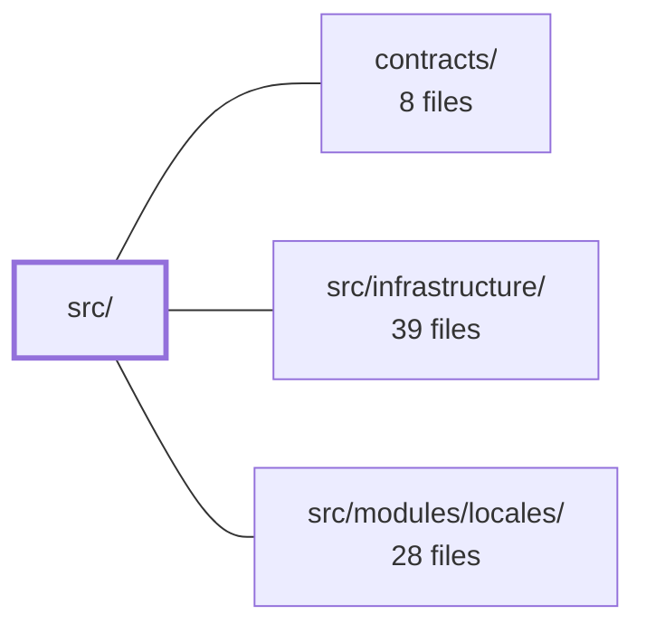

---
tags:
  - 2brain
  - 2brain/module
  - project/boilerplate-vue-frontend
type: module
module: src/
files: 15
updated: 2026-10-02T19:24:11.096646+00:00
---

# src/

## Purpose

`src/` is the application shell and composition root for the demo e-commerce frontend. It owns the boot sequence, the typed module-registry mechanism, the slot-based extension system that lets domain modules contribute UI without importing each other, and the self-contained i18n pipeline. Domain feature code lives in `src/modules/`; everything in this directory is the framework those modules plug into.

## Key parts

- **Composition root** — `main.ts` installs Pinia, router, i18n, Vuetify, and Vue Query in a single sequential promise chain, feeding each with data contributed by enabled modules. `App.vue` is the deliberately thin root component (routed view + one aria-live region).
- **Module registry** — `modules.ts` exports the single `enabledModules` array that defines the build; `demo-modules.ts` mirrors the backend's `shop` group as a plain list for the demo configuration.
- **Kernel (extension mechanism)** — `kernel/registry.ts` defines the `AppModule` contract (routes, nav entries, slots, locale dicts, schema loaders) and boot-time validation. `kernel/slots.ts` implements the owner/contributor slot pattern. `kernel/route-link.ts` provides a safe guard for cross-module route links by name.
- **i18n** — `i18n/index.ts` owns the load → activate → merge pipeline and is designed to lift out as a standalone package. `i18n/router-link.ts` injects the locale into every route location. `i18n/language-label.ts` and `i18n/country-label.ts` are small pure helpers for display names.
- **Types & build glue** — `types/` holds shared enum definitions; `globals.d.ts` and `vite-env.d.ts` declare Vite-inlined constants and ambient module types for the TypeScript compiler.

## How it connects

- **`contracts/`** — The `AppModule` interface in `kernel/registry.ts` and the typed slot/navigation shapes in `kernel/slots.ts` reference contract types defined in this directory, so `src/` is the primary consumer of the shared contract surface.
- **`src/infrastructure/`** — `main.ts` imports and mounts the infrastructure layer (API client, Pinia stores, Vue Query setup) during boot; the kernel's response-schema loaders also reach into it.
- **`src/modules/locales/`** — The i18n pipeline in `i18n/index.ts` resolves and merges locale dictionaries that each enabled module registers under this directory.
- **`/` (repository root)** — `globals.d.ts` and `vite-env.d.ts` depend on Vite `define` values configured at the root level; `demo-modules.ts` parallels the root-level `module.yaml` grouping.

## Where to start

Read **`src/main.ts`** first — its short, sequential boot chain shows the exact order in which infrastructure and module-contributed data come together, giving you the map of everything else. Then open **`src/kernel/registry.ts`** to see the `AppModule` type; it is the single object every domain module must satisfy, so understanding it tells you what a module can contribute and what the shell will wire up for it.

## Connected modules

[[boilerplate-vue-frontend_ROOT|/ (repository root)]] · [[boilerplate-vue-frontend_contracts|contracts/]] · [[boilerplate-vue-frontend_src_infrastructure|src/infrastructure/]] · [[boilerplate-vue-frontend_src_modules_locales|src/modules/locales/]]

## Files
- `src/App.vue` — The root Vue component (composition root) for the application. It is deliberately minimal: it renders the routed view and a single accessibility live region. All global plugins (Pinia, router, i18n, Vuetify) are installed by `src/main.ts`; no domain-specific state or logic is placed here.
- `src/demo-modules.ts` — Declares the canonical list of frontend modules that ship in the demo (pet-supply e-commerce) build. It is the frontend counterpart to the backend's `module.yaml#group: shop` axis, stored as a plain array because the frontend has no per-module manifest file to attach a grouping field to.
- `src/globals.d.ts` — Ambient type declarations for constants that Vite's `define` inlines as literals at build time. Because these identifiers never exist as real runtime variables, they can't be imported—each one must be declared here to satisfy the TypeScript compiler.
- `src/i18n/country-label.ts` — Provides a single utility that turns an ISO 3166-1 alpha-2 country code into a human-readable name localized to the viewer's current language. It exists so the country `<select>` in `AddressFormDialog.vue` can display names in the viewer's language without pulling in a dedicated i18n dependency.
- `src/i18n/index.ts` — Core i18n runtime that owns the full translate pipeline: which languages exist, which are loaded, and the load → activate → merge flow every locale switch goes through. It is deliberately self-contained (FE-D5) so the entire `src/i18n/` folder can be lifted into a standalone package without reaching into the rest of the app.
- `src/i18n/language-label.ts` — Provides a single pure function that resolves a locale code to a human-readable display name for a language picker. It was factored out of `AppLanguageSwitcher.vue` (FA27) so the logic lives as a plain, importable function rather than being embedded in a component.
- `src/i18n/router-link.ts` — Rewrites any `vue-router` location (string, `path`-object, or named route) so it carries the current locale. Because vue-router ignores `params` when a `path` is present, the two location shapes require different treatment — path strings get a locale segment prepended, while named routes get `params.locale` injected.
- `src/kernel/registry.ts` — Defines the contract a domain module uses to declare itself to the application shell. It is the single typed object (`AppModule`) through which a module exposes its routes, navigation entries, slot contributions, loading keys, response-schema loaders, and locale dictionaries. The file also provides boot-time validation (`assertUniqueRoutes`) and a small set of pure helpers for unwrapping locale JSON and normalising route paths. It does not discover modules from the filesystem; `src/modules.ts` supplies the explicit list, and this file turns that list into a running app.
- `src/kernel/route-link.ts` — Provides a guard (`linkIfRouted`) that a module uses to build a route location to a *sibling* module's route by name, safely returning `undefined` when that route is not registered in the current build. It exists because a name-based reach to a sibling's route is invisible to the `MODULE_EDGES` dependency graph, so `vue-router` would throw on an unresolved name without this check. It lives in `kernel` (not `src/app`) so any module can import it without coupling to this app's own route definitions.
- `src/kernel/slots.ts` — Defines the slot-based extension-point mechanism that decouples contributing modules from the modules that render their components. A module **owns** a slot (a fixed place in its view); other modules **contribute** components to it via their manifest. The owner reads the slot and renders whatever arrived, so the owner never imports its contributors — the dependency runs contributor → owner.
- `src/main.ts` — Composition-root entry point. Wires infrastructure (Pinia, router, i18n, Vuetify, Vue Query) to data contributed by enabled modules (locale dictionaries, response schemas, cross-module slots), then boots the application as a single sequential promise chain so that no step can race the next.
- `src/modules.ts` — The domain-module registry for the build. It declares which feature modules are included by exporting a single typed array (`enabledModules`). Adding or removing a domain is a one-line change here plus a folder under `src/modules/`; nothing else should break, and if it does, the coupling is intentional and worth surfacing.
- `src/types/enums.ts`
- `src/types/index.ts`
- `src/vite-env.d.ts`

---
[[boilerplate-vue-frontend_INDEX|← boilerplate-vue-frontend index]]
