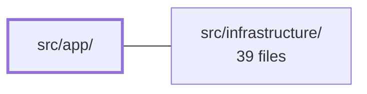

---
tags:
  - 2brain
  - 2brain/module
  - project/boilerplate-vue-frontend
type: module
module: src/app/
files: 31
updated: 2026-10-02T19:24:31.482463+00:00
---

# src/app/

## Purpose

`src/app/` is the application shell: it owns the layout chrome, global navigation, routing assembly, route guards, static content pages, and app-level error handling. It sits above the domain and infrastructure layers, composing them into the single Vue application that the browser loads.

## Key parts

- **Layout & shell** — `layouts/LayoutDefault.vue` is the one-and-only page frame (skip link, banners, nav, `<RouterView />`, footer, dialogs, toasts). Every route under `/:locale` renders inside it.
- **Navigation** — `components/AppNavigation.vue` assembles the desktop bar and mobile drawer from shell entries plus module-contributed entries. Supporting components (`AppNavBarLink`, `AppNavIconButton`, `AppNavPinnedButton`, `AppNavMenu`, `app-nav-item.ts`, `use-focus-tooltip.ts`) provide the individual UI pieces and shared accessibility behavior.
- **Banners & dialogs** — `AppHealthBanner`, `AppVerificationBanner`, `AppAnalyticsConsentBanner`, and `ReauthDialog` are always-mounted or conditionally-shown overlays that communicate system state or require user action.
- **Router** — `router/index.ts` creates the Vue Router, merges module routes via the kernel registry, and wires global guards. `router/announcer.ts`, `router/navigation.ts`, `router/oauth-callback.ts`, and `router/stale-deploy.ts` handle a11y announcements, sign-in redirects, OAuth URL normalisation, and post-deploy recovery respectively.
- **Guards** — `guards/authentications.ts` is the single `canAccess` predicate used by both the router guard and the nav component. `guards/locale-choice.ts` syncs the i18n locale to the `:locale` route param.
- **Static views** — `views/Home.vue`, `views/AboutPage.vue`, `views/FaqPage.vue`, `views/PrivacyPage.vue`, `views/TermsPage.vue`, and `views/Error.vue` are the shell's own pages (no domain-module dependency). `components/StaticPageLinks.vue` renders the shared cross-link strip across the prose pages.
- **Utilities** — `utils/branding.ts` (product name/logo), `utils/error-messages.ts` (safe-to-display message whitelist), and `utils/static-pages.ts` (page-name → route-name map) centralise small cross-cutting values.
- **Error handling** — `vue-error-handler.ts` is the global `app.config.errorHandler` that reports to Faro and surfaces a translated notification.

## How it connects

`src/infrastructure/` provides the low-level services this shell consumes: the HTTP client and its `onRequest` interceptor (read by the consent banner to attach the `X-Analytics-Consent` header), the i18n runtime (activated by `locale-choice.ts` and the language switcher), the session/consent stores (written by `ReauthDialog` and `AppAnalyticsConsentBanner`), the Faro observability pipeline (called by `vue-error-handler.ts`), and the kernel registry / `collectModuleRoutes` API (imported by `router/index.ts` and `AppNavigation.vue` to pull in domain routes and nav entries). The health banner also depends on the infrastructure HTTP layer to probe the API liveness endpoint.

## Where to start

Read `src/app/layouts/LayoutDefault.vue` first to see the full shell composition and where every banner, nav, and dialog slot lives. Then read `src/app/router/index.ts` to understand how routes are assembled, which guards run in what order, and how domain modules plug their routes and nav entries into the shell without the shell naming them directly.

## Connected modules

[[boilerplate-vue-frontend_src_infrastructure|src/infrastructure/]]

## Files
- `src/app/components/AppAnalyticsConsentBanner.vue` — A guest-facing analytics consent banner pinned to the bottom edge of the viewport. It is shown only when Umami is configured **and** the visitor's consent choice is still `unknown` (or has been reopened via the footer's "Privacy choices" link). Accept or Decline persists the choice through the shared consent store, which the HTTP `onRequest` interceptor later reads to decide whether an anonymous request carries the `X-Analytics-Consent` header.
- `src/app/components/AppHealthBanner.vue` — A thin, always-mounted banner that probes the API's liveness endpoint (`GET /`) and conditionally renders a warning bar when the backend is unreachable. It communicates a *degraded* state (not a hard error) because the app still serves cached pages and bundled dictionaries without the API.
- `src/app/components/AppLanguageSwitcher.vue` — A language-switcher dropdown menu. It renders the list of supported locales, lets the user pick one, and then re-navigates the current route under the new `:locale` param. It deliberately does **not** load dictionaries or activate the locale itself—that work is delegated to the i18n runtime via the route param. This file owns only the routing side of the switch and the fire-and-forget persistence of the user's preference.
- `src/app/components/AppNavBarLink.vue` — Desktop navigation-bar entry that renders a text link with a leading Lucide icon and an optional count badge on the glyph. Unlike its icon-only sibling `AppNavIconButton`, the visible label doubles as the accessible name, so no `aria-label` or tooltip is required.
- `src/app/components/AppNavIconButton.vue` — Icon-only navigation button (or router-link) for the desktop nav bar. Because the bar shows glyphs alone, this component guarantees every entry carries a proper accessible name in two places—`aria-label` for screen readers and a visible tooltip for sighted users—using the *same* string so a voice-control user can read the tooltip and speak it (WCAG 2.5.3). All non-prop attributes fall through to the inner `<v-btn>` so a parent can wrap the component as a `v-menu` activator.
- `src/app/components/AppNavMenu.vue` — A generic dropdown-menu shell that wraps `AppNavIconButton` as the activator and renders a list of `AppNavItem` entries as a WAI-ARIA `role="menu"`. It serves both the account menu and the admin menu, providing shared keyboard behavior (via Vuetify's `v-menu`) and an `#after` slot for non-navigation actions like logout.
- `src/app/components/AppNavPinnedButton.vue` — Renders a single "pinned" entry in the app navigation bar: an icon glyph with an optional count badge and an optional live detail string (e.g. a cart total). It exists so that a pinned nav item can show richer information than a plain icon button while keeping one cohesive `aria-label` that reads the same at every viewport width.
- `src/app/components/AppNavigation.vue` — Renders the app shell's navigation bar (desktop) and phone drawer (mobile). It merges the shell's own two entries (Home, About) with navigation entries contributed by enabled modules via the kernel registry, filters every entry through the `canAccess` guard, and presents the result as a flat icon+label bar, account/admin dropdown menus, pinned buttons, and a hamburger-triggered drawer. Deleting a domain module removes its menu entry automatically.
- `src/app/components/AppVerificationBanner.vue` — A persistent "please verify your email" warning banner that mounts in the app shell and rides every page. It exists so an unverified visitor sees the prompt immediately rather than only discovering the `EMAIL_NOT_VERIFIED` rejection at checkout. The banner is visible only when a signed-in viewer exists and their `verified` flag is falsy.
- `src/app/components/ReauthDialog.vue` — A step-up re-authentication prompt rendered as a Vuetify dialog. It is mounted once by `LayoutDefault.vue` alongside `<DialogHost />`, asks the server which authentication method the current account supports (password or mailed code), presents the appropriate form, and on success resolves the interceptor's parked requests via the session store. A failed attempt keeps the dialog open for retry.
- `src/app/components/StaticPageLinks.vue` — Renders the cross-link navigation strip at the bottom of every static prose page (About, FAQ, Terms, Privacy). By sharing a single component across all four pages, it guarantees they always present the same set of sibling links in the same order, preventing drift.
- `src/app/components/app-nav-item.ts` — A type-only module that defines the `AppNavItem` interface — the shape of a single resolved navigation entry (translated, locale-prefixed, counted). It was extracted from `AppNavMenu.vue` (FA95) because TypeScript-ESLint's type-aware rules could not reliably resolve a type exported from a `.vue` SFC, producing `no-unsafe-*` noise in `AppNavigation.vue`. The interface is pure data with no SFC-specific behavior, so it lives in a plain `.ts` file imported by both nav components.
- `src/app/components/use-focus-tooltip.ts` — A small Vue composable that drives the open/close state of a `v-tooltip` from keyboard focus events, replacing Vuetify's built-in `open-on-focus` wiring. It exists to fix two specific problems in that wiring: a 50 ms "reopen lock" that drops rapid Tab-back interactions, and a synchronous-close path that creates a keyboard trap by pulling focus back onto the button. Both the icon button and the pinned button share this behavior.
- `src/app/guards/authentications.ts` — Defines the single source of truth for route access control. It exports `canAccess`, the one predicate that both the router guard and the navigation component call, ensuring "what is reachable" and "what is shown" can never drift apart. It also handles silent session restoration before the access check runs.
- `src/app/guards/locale-choice.ts` — Vue Router `beforeResolve` guard that keeps the active i18n locale in sync with the `:locale` route parameter. On first use of a locale it loads the bundled JSON dictionary plus any remote overrides, registers the messages, and activates the language. If the param is missing or unsupported it redirects to the same route with the default locale injected.
- `src/app/layouts/LayoutDefault.vue` — The single layout shell the router mounts once for every route under `/:locale` (decision FA70). It provides the app chrome — skip link, health/verification/consent banners, navigation, page hero, footer, dialog host, toast stack, and two-tier loading indicators — with `<RouterView />` in the middle. It is intentionally mounted once (not per view), so lifecycle hooks like `onMounted` fire only on the very first navigation.
- `src/app/router/announcer.ts` — Router-owned UI state for accessibility after navigation. Holds the page title to announce in a visually-hidden live region (WCAG 4.1.3) and a one-shot flag that defers focus to `<v-main>` until the new page's content has rendered.
- `src/app/router/index.ts` — Creates the application's Vue Router instance. It assembles locale-prefixed routes (`/:locale/...`), merges domain routes contributed by enabled modules through the kernel registry, and wires up global navigation guards (auth session restore, `meta.access` enforcement, i18n locale sync), scroll behavior, tab-title/a11y announcement, and a stale-deploy recovery path. This file names no domain route itself; all domain routes arrive via `collectModuleRoutes(enabledModules)`.
- `src/app/router/navigation.ts` — Defines sign-in/sign-up route name constants and location-builder helpers used by the app shell to redirect unauthenticated visitors to login while preserving their intended destination. The route names are plain strings (not typed route names) because the account module that declares them may be excluded from a given build.
- `src/app/router/oauth-callback.ts` — Converts the raw query string from a backend OAuth redirect (`/oauth/callback?locale=…&…`) into a localized Vue Router location for the `OAuthCallback` route. It exists because the redirect lands on a locale-less backend URL, so the visitor's language must be re-applied client-side before the callback view renders.
- `src/app/router/stale-deploy.ts` — Recovers from a stale deployed build: when a newer deploy replaces the asset manifest, an already-open tab's next lazily-imported route chunk 404s. Vite surfaces this as a `vite:preloadError` event on `globalThis`. This module intercepts that event and, on the next router error, performs a single full-page reload to the failed route. A `sessionStorage` guard ensures the reload happens at most once per tab session, so a genuinely broken build still reaches the error page rather than reloading in a loop.
- `src/app/utils/branding.ts` — Centralises the two values a derived project needs to rebrand without touching source code: the product name and the logo image path. Both are read from runtime (container-level) configuration first, then Vite env vars, then a hard-coded default, so a rename is purely a deployment concern.
- `src/app/utils/error-messages.ts` — Whitelists which error-page messages are safe to display verbatim (as i18n dictionary keys) versus collapsing into a single generic key. Without this guard, free-form strings (a stale chunk URL, a raw `Error.message`, a fetch failure) would leak implementation details into the rendered page, the URL, and Umami's pageview tracking (FA74). Both `Error.vue` and the router's `onError` hook call the single predicate here, so they can never disagree on what counts as "known".
- `src/app/utils/static-pages.ts` — Centralises the shop's four prose pages (about, FAQ, terms, privacy) and the single formula that maps a page name to its router route name. By living in one place, the router, footer, and any page that cross-links its siblings all share the same source of truth instead of duplicating the mapping.
- `src/app/views/AboutPage.vue` — Static "About" page for the storefront. It renders the shop's self-introduction: a tagline + intro paragraphs, a feature grid ("what you can try"), a tech-stack list ("under the hood"), and a guided walkthrough with conditional CTA buttons. All copy is pulled from the i18n dictionary under `static-pages.about.*`; this file only declares structure, icon mappings, and route guards.
- `src/app/views/Error.vue` — A generic, catch-all error page rendered when the router's `onError` handler redirects an unhandled failure here. It displays the supplied HTTP-like status and a (validated) translated message, and offers a single "Home" action so the user can recover.
- `src/app/views/FaqPage.vue` — Renders the shop's FAQ as a series of topic headings, each with an accordion of question/answer pairs. All copy is pulled from the i18n dictionary under `static-pages.faq.topics.*`; the file itself only declares the topic keys and their order. A contact CTA card appears at the bottom only when a `Contact` route exists in the current build.
- `src/app/views/Home.vue` — Landing page of the application. Renders a static hero with a conditional call-to-action button and a three-card showcase grid. All copy is i18n-driven; the single cross-domain link (to the products list) is guarded at runtime so the page degrades gracefully when the products module is absent from the build.
- `src/app/views/PrivacyPage.vue` — Renders the site's dedicated privacy-policy page. It exists as a standalone component (rather than reusing a shared paragraph renderer) because real policy copy will require headings, lists, and data-category tables that a generic renderer cannot express. Content is currently placeholder Lorem Ipsum, to be replaced before launch.
- `src/app/views/TermsPage.vue` — Dedicated terms-of-service page. It exists as its own component (rather than reusing a shared paragraph renderer) because legal copy requires its own structural elements—headings, lists, numbered clauses—that a generic renderer does not support. All visible text is currently Lorem Ipsum placeholder, to be replaced before launch.
- `src/app/vue-error-handler.ts` — Implements the Vue application's global `app.config.errorHandler` — the last-resort catch for errors thrown inside a component's render/setup/watcher that no local handler intercepts. Reports the error to the Faro observability pipeline and surfaces a translated user-facing notification, so a visitor never sees a blank page with only a console stack trace (FA74).

---
[[boilerplate-vue-frontend_INDEX|← boilerplate-vue-frontend index]]
