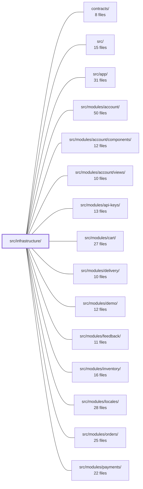

---
tags:
  - 2brain
  - 2brain/module
  - project/boilerplate-vue-frontend
type: module
module: src/infrastructure/
files: 39
updated: 2026-10-02T19:25:03.609034+00:00
---

# src/infrastructure/

## Purpose

`src/infrastructure/` is the application's foundational layer: the HTTP transport pipeline, authentication session state, telemetry wiring, shared singleton state, and low-level utility helpers that every feature module depends on. It contains no domain logic of its own—its job is to make "talking to the API," "knowing who is signed in," and "logging what happened" available to the rest of the codebase in a single, consistent shape.

## Key parts

- **HTTP tier (`http/`)** — The full request/response pipeline. `client.ts` is the bare axios instance; `index.ts` is the composition root that wires interceptors and exports `orvalMutator` (the single dispatch point all generated and hand-written API calls go through). Supporting files handle token refresh (`refresh.ts`), step-up reauth (`step-up.ts`, `reauth-prompt.ts`), ETag conditional writes (`etag.ts`), idempotency keys (`idempotency.ts`), anti-bot challenges (`antibot.ts`), response-envelope type guards (`envelope.ts`), Zod contract validation (`validate.ts`, `response-schema-map.ts`), request coalescing (`single-flight.ts`), and keep-alive writes (`keepalive.ts`).

- **SSE client (`create-sse-client.ts`)** — A typed, single-connection `EventSource` wrapper that JSON-parses frames and optionally validates them against AsyncAPI-derived Zod schemas before forwarding to callers.

- **Auth & consent** — `session.ts` owns the access token, viewer projection, and CASL ability scopes in a Pinia store. `analytics-consent.ts` manages the guest consent choice in a first-party cookie and gates the Umami tracker.

- **Observability (`observability/`)** — `config.ts` reads the opt-in environment variables; `store.ts` is a Pinia store that lazily initialises Grafana Faro and Umami behind a single API, handling consent gating and URL redaction.

- **Shared singletons & runtime config** — `query-client.ts` (one TanStack QueryClient for all stores), `runtime-config.ts` (container-start config with `VITE_*` fallback), `shop-currency.ts`, `theme-preference.ts`.

- **Locale overrides (`locale-overrides.ts`)** — Fetches the API's language manifest and per-locale overrides, merging them over the offline-bundled JSON so edited translations apply without a rebuild.

- **Utilities (`utils/`)** — Cross-cutting helpers: error classification and user-facing messaging (`errors.ts`), locale-bound formatters (`formatters.ts`), form-to-wire translation (`forms.ts`), image URL resolution (`images.ts`), gated logging (`logger.ts`), sort-spec conversions (`sort.ts`), upload validation (`uploads.ts`), ISO country codes (`country-codes.ts`), and a set of Vue composables for blocking errors, stale records, viewer-change resets, missing-record redirects, and query-param cleanup.

## How it connects

- **`contracts/`** — Supplies the Zod schemas (derived from OpenAPI/AsyncAPI) that `http/validate.ts`, `http/response-schema-map.ts`, and `create-sse-client.ts` validate against at runtime.
- **`src/app/`** — Bootstraps the app: imports the shared QueryClient, initialises the session store, and mounts the observability store before feature routes resolve.
- **`src/ui/`** — Consumes the utility composables (`use-blocking-error`, `use-stale-record`, formatters, images) and the theme/consent state; the tier rules in ESLint prevent `ui/` from importing `@api` directly, which is why `antibot.ts` and `locale-overrides.ts` live here.
- **Feature modules** (`products/`, `orders/`, `cart/`, `payments/`, `users/`, `inventory/`, `returns/`, `wishlist/`, `delivery/`, `locales/`, `feedback/`, `demo/`, `api-keys/`, `webhooks/`, `account/`) — Every module's API calls go through `orvalMutator`; every module reads auth from `session.ts`; every list/detail page uses the sort, formatter, and error utilities. No module should bypass this layer to talk to the network or manage its own token state.

## Where to start

1. **`src/infrastructure/http/index.ts`** — This is the public surface of the HTTP tier. Reading it shows you how `orvalMutator` is assembled from the interceptors, where validation plugs in, and why it is the single function every API call passes through. It is the shortest path from "I need to call the API" to "here is exactly what happens."
2. **`src/infrastructure/session.ts`** — The auth store is referenced by interceptors, route guards, the shell, and nearly every composable. Understanding its shape (token + viewer + abilities, and the invariant that *both* must be present) explains a large fraction of the guard and reset logic you will see across the modules.

## Connected modules

[[boilerplate-vue-frontend_contracts|contracts/]] · [[boilerplate-vue-frontend_src|src/]] · [[boilerplate-vue-frontend_src_app|src/app/]] · [[boilerplate-vue-frontend_src_modules_account|src/modules/account/]] · [[boilerplate-vue-frontend_src_modules_account_components|src/modules/account/components/]] · [[boilerplate-vue-frontend_src_modules_account_views|src/modules/account/views/]] · [[boilerplate-vue-frontend_src_modules_api-keys|src/modules/api-keys/]] · [[boilerplate-vue-frontend_src_modules_cart|src/modules/cart/]] · [[boilerplate-vue-frontend_src_modules_delivery|src/modules/delivery/]] · [[boilerplate-vue-frontend_src_modules_demo|src/modules/demo/]] · [[boilerplate-vue-frontend_src_modules_feedback|src/modules/feedback/]] · [[boilerplate-vue-frontend_src_modules_inventory|src/modules/inventory/]] · [[boilerplate-vue-frontend_src_modules_locales|src/modules/locales/]] · [[boilerplate-vue-frontend_src_modules_orders|src/modules/orders/]] · [[boilerplate-vue-frontend_src_modules_payments|src/modules/payments/]] · … and 7 more

## Files
- `src/infrastructure/analytics-consent.ts` — Manages the guest-facing analytics consent choice (unknown / granted / denied) for FA-D5. Persists the answer in a first-party cookie (same mechanism as `session.ts`), exposes a Pinia store the consent banner reads and writes, and gates the Umami tracker so it only loads after an explicit grant.
- `src/infrastructure/create-sse-client.ts` — Provides a typed, one-connection SSE client on top of the browser's `EventSource`. It opens a single persistent stream, registers one listener per declared event name, JSON-parses each incoming frame, and (when `VITE_VALIDATE_RESPONSES` is on) validates the payload against the AsyncAPI-derived Zod schema before forwarding it to the caller. It is the SSE counterpart to `orvalMutator`'s response validation.
- `src/infrastructure/http/antibot.ts` — Front-end utilities for the human-challenge (anti-bot) gate. Because the ESLint `no-restricted-imports` rule forbids `.vue` files from importing `@api` directly, this module re-exports the two `@api` calls (`getAntibotConfig`, `getAntibotChallenge`) that `HumanCheck.vue` needs, and provides helpers to attach a solved challenge token to outgoing requests and to detect the specific 401 that means "show the widget and retry."
- `src/infrastructure/http/client.ts` — Defines and exports the single shared axios instance used by every HTTP client in the app. It is the leaf of the http tier: fully configured (headers, credentials, timeout, base URL) but carries no interceptors and imports nothing else from this application, guaranteeing that importing it can never create a circular dependency back into `index.ts`.
- `src/infrastructure/http/envelope.ts` — Type-guard readers for the two response envelopes the API uses: the `{ data }` success wrapper and the `{ errors: [...] }` rejection list. Everything is narrowed from `unknown` at the boundary — no declared type is trusted past the wire. Lives at the transport layer (not in a store) because the envelope shape is a property of the HTTP API, not of any particular domain.
- `src/infrastructure/http/etag.ts` — Client-side ETag bookkeeping for conditional writes. It remembers the `ETag` each resource last answered with and re-sends it as `If-Match` on subsequent PUT/PATCH/DELETE requests so the server can reject stale edits (412). Wired transparently onto the shared axios instance by `index.ts`, so edit forms get it without explicit code.
- `src/infrastructure/http/idempotency.ts` — Provides a Vue reactive helper for managing a single `Idempotency-Key` header across retries of the same user intent. It mints a UUID at creation, reuses it through retryable failures (transport errors, 5xx), and replaces it after any definitive answer (success or 4xx), so the backend's idempotency middleware can deduplicate exactly the attempts it should.
- `src/infrastructure/http/index.ts` — Composition root of the HTTP tier. Wires all request/response interceptors onto the shared axios instance at import time and exports `orvalMutator`, the single function through which every API call (generated or hand-written) is dispatched. This is the tier's public surface; `orval.config.ts` points all generated clients at `orvalMutator` here.
- `src/infrastructure/http/interceptors.ts` — Axios request/response interceptors that attach authentication, language, and anonymous analytics-consent headers on outbound requests, and normalize every rejection (transport failure, bare proxy error, or API error response) into a single `AxiosResponseErrorData` envelope shape on the way back. Refresh/step-up logic is deliberately excluded — it lives in `refresh.ts` / `step-up.ts`.
- `src/infrastructure/http/keepalive.ts` — Provides a single fire-and-forget helper for sending a JSON write that survives the page's unmount. Because the generated axios client rides XHR (cancelled with the page) and `sendBeacon` cannot carry a bearer header, this file uses `fetch` with `keepalive: true` as the one browser mechanism that lets a request complete after `pagehide`.
- `src/infrastructure/http/reauth-prompt.ts` — Pinia store that tracks the single open/closed state of the step-up (reauth) prompt. It exposes a promise-based API so the HTTP interceptor can block a request until a fresh session is confirmed or the visitor dismisses the dialog. It resolves `void` (not `boolean`) because the semantic is "a new session now exists," not a yes/no answer. Placed in `infrastructure/` rather than `ui/` so that `step-up.ts` can import it without violating the tier rules in `eslint.config.ts`.
- `src/infrastructure/http/refresh.ts` — Axios response-error interceptor that, on a 401 response (excluding auth-credential endpoints), calls the session's `refreshToken` exactly once and replays the original request with the new token. It is deliberately thin: all token-renewal, epoch-guarding, and session-teardown logic lives in `session.ts`; this module only decides *when* to call it and how to handle the result.
- `src/infrastructure/http/response-schema-map.ts` — Route table that maps `method + URL pattern` to Zod response (and optional request-body) schemas, matched at runtime against the request's pathname. It lets the HTTP mutator detect live contract violations without knowing which operation it is serving, and keeps the ~350 KB Zod contract in a single lazy chunk rather than every entry bundle.
- `src/infrastructure/http/single-flight.ts` — Provides a minimal single-flight (request coalescing) wrapper so that concurrent callers of an async operation share one in-flight promise instead of each kicking off a duplicate. It exists to de-duplicate work that must happen at most once at a time—token refresh, reauth prompts—without pulling in a full library.
- `src/infrastructure/http/step-up.ts` — Response interceptor that handles the step-up (re-auth) flow. When the API returns a `REAUTH_REQUIRED` 401, it parks the failed request, shows a single `ReauthDialog` prompt, and replays the request once a fresh session is established. All other 401s are passed through to the standard refresh-and-retry path unchanged. It exists to intercept the step-up error *before* the generic refresh interceptor can "fix" the 401 with a token refresh that would simply produce the same error again.
- `src/infrastructure/http/types.ts` — Shared type aliases for the HTTP tier. Defines the request/response payload shapes and the retry-loop-guard config extension that `interceptors.ts`, `refresh.ts`, and `step-up.ts` all reference, keeping the contract in one place.
- `src/infrastructure/http/url.ts` — Single-source utility that normalises an Axios request URL (absolute or relative) into the pathname the HTTP layer uses for matching. It exists so that every consumer derives the same canonical pathname from a raw URL, preventing mismatches between route-pattern lookup and exclusion filtering.
- `src/infrastructure/http/validate.ts` — Contract-validation gate for the `orvalMutator` HTTP layer. It parses response bodies and outgoing JSON request bodies against the Zod schemas resolved from the OpenAPI spec, deciding per-profile whether a mismatch is fatal (throw) or advisory (report to Faro and continue). Its job is to make the generated envelope types' "every 2xx has `data`" promise actually hold in production, and to surface drift early in dev/e2e.
- `src/infrastructure/locale-overrides.ts` — Fetch layer for the runtime (database-backed) half of the locale dictionaries. It retrieves the API's language manifest and per-locale override messages, then merges them over the offline-bundled JSON files so that edited translations appear without a rebuild. Lives here rather than in `@/i18n` because it depends on the app-specific OpenAPI client (`@api`), which the extractable runtime module must not import.
- `src/infrastructure/observability/config.ts` — Pure environment-variable readers for the two telemetry back-ends (Grafana Faro and Umami analytics). Each reader returns `undefined` when its primary variable is unset, serving as the single opt-in switch the store checks — no configuration, no telemetry code runs at runtime.
- `src/infrastructure/observability/store.ts` — Pinia store that wraps two independently-lazy telemetry SDKs—Grafana Faro (errors, tracing, web-vitals) and Umami (pageview analytics)—behind a single store API. It centralises SDK initialisation, consent gating, and sensitive-URL redaction so any component, store, or router hook can call into observability without importing the SDKs directly.
- `src/infrastructure/query-client.ts` — Exports the app's single shared TanStack `QueryClient` instance. All `useStructureRestApi`, `useStructureSearchApi`, and `useStructureCrudApi` Pinia stores receive this same client, enabling cross-resource cache invalidation scoped by `resourceKey`. It is passed explicitly via each store's `queryClient` option rather than through Vue's injection context, so it works identically in a mounted app, in store unit tests, and in router guards where no component tree exists.
- `src/infrastructure/runtime-config.ts` — Single read-point for values a running container may override after the image is built. In Docker, `config.js` (generated at container start by `docker/docker-entrypoint.d/`, wired in via `docker/nginx.conf`) sets `window.__APP_CONFIG` before the bundle loads. In dev, unit tests, and `vite preview` that script never runs, so every read falls through to `import.meta.env.VITE_*` at the call site. There is no central config object — the fallback is always inline at the consumer.
- `src/infrastructure/session.ts` — Pinia setup-store that owns the app's authentication state: an in-memory access token, a minimal viewer projection (`id`, `email`, `role`, avatar URLs, `verified`), and two CASL ability scopes (`tenant`, `platform`). It exists so that `isAuth` requires **both** token and viewer, preventing a restored-but-unidentified session from being treated as authenticated, and so that route guards and the shell have a single source of truth for "who is signed in" without importing the full `User` domain object.
- `src/infrastructure/shop-currency.ts` — Holds the shop's single ISO 4217 currency code in a module-level Vue `ref`, loaded once from `GET /products/settings`. It exists so that any component that needs to size a price input or label a figure can do so before a per-product `currency` field is available, without each caller issuing its own request.
- `src/infrastructure/theme-preference.ts` — Persists the visitor's explicit light/dark theme pin as a first-party cookie (`themePreference`). It exists so the boot theme can be resolved before first paint (read once by `ui/vuetify/index.ts`) and so the user's toggle in `AppNavigation.vue` survives browser restarts without a separate storage mechanism.
- `src/infrastructure/utils/country-codes.ts` — A static, dependency-free list of all current ISO 3166-1 alpha-2 country codes. It exists as a plain constant so that consumers can enumerate valid codes (e.g., for form dropdowns, validation) without pulling in a runtime library.
- `src/infrastructure/utils/errors.ts` — Shared, app-level error-classification and messaging helpers. It centralises "what message to show the user" (binding the toolkit's `extractErrorMessage` to the app's translated fallback), "what kind of failure happened" (transport vs. answered, retryable vs. final, absent vs. error), and the single toast + Faro-report call that ambient/background failures should make. Keeping all of this here ensures every call site speaks the same language and applies the same status-code semantics.
- `src/infrastructure/utils/formatters.ts` — Locale-bound formatting wrappers that pre-bind the `@guebbit/js-toolkit` pure formatters to this app's active locale and shared empty-value glyph. Call sites invoke these instead of the toolkit directly so they never restate locale or fallback, and can't accidentally pick a different locale than the rest of the page.
- `src/infrastructure/utils/forms.ts` — The single form-to-wire translation boundary. It converts raw form state (where `''`, `null`, and `undefined` are all "empty") into the correct wire spelling dictated by the generated Zod request-body schema, diffing against a loaded record to omit unchanged fields on PATCH. All other code treats form values opaquely; this file is where `''` becomes `''`, `null`, or an omitted key depending on what the schema accepts.
- `src/infrastructure/utils/images.ts` — Resolves API-relative image paths into absolute URLs the browser can fetch, and provides a bundled placeholder for records with no image. It exists because the API returns `uri-reference` paths (e.g. `/images/<hash>.png`) that, if handed to `` unchanged, resolve against the frontend origin and 404 whenever the API lives on a different host.
- `src/infrastructure/utils/logger.ts` — The single module in the app permitted to call `console` (ESLint `no-console` is an error everywhere else). It wraps the four console methods behind a level ceiling plus an opt-in scope filter, both resolved once from environment variables at module load. It exists to give every other file a consistent, gated logging API without any of them touching the global console object.
- `src/infrastructure/utils/sort.ts` — Pure conversion utilities that translate a sort specification between three representations: the JSON:API wire format (`-price,title`), the CSV shape a URL or filter box holds, and Vuetify's `{ key, order }[]` model a table header edits. Every list page imports from here so there is a single, shared reading of the sort grammar.
- `src/infrastructure/utils/uploads.ts` — Client-side mirror of the backend's image-upload limits and a shared Zod validation rule (`imageUploadSchema`). It exists purely as a UX affordance—rejecting bad files before the user waits for a network round-trip—while the backend remains the authoritative gate on `Content-Type` and magic bytes.
- `src/infrastructure/utils/use-blocking-error.ts` — A Vue composable that holds the inline (non-toast) half of blocking-workflow error state — the message a save, delete, refund, or empty-lookup produces that must stay rendered next to the offending form or panel rather than scrolling away in the toast queue. It pairs with `InlineErrorAlert` (`src/ui/molecules/`) the same way `notifyErrorMessages` pairs with a toast: real failures still reach Faro, but the user-facing text is local. It lives in `infrastructure/utils` (not `ui/composables`) because it reaches into the observability store, which the tier-boundary rules in `eslint.config.ts` forbid `ui` from importing.
- `src/infrastructure/utils/use-clear-query-on-mount.ts` — A Vue composable that strips all query parameters from the current URL immediately after mount, using `router.replace` so the entry does not pollute browser history. It exists to remove one-time email credentials (verification, reset, deletion, change) from the URL before any observability tool (Umami, Faro) or the back-button can capture them.
- `src/infrastructure/utils/use-missing-record.ts` — Provides the error handler a record detail page uses when the API responds with 404 or 403. Instead of the page sitting on loading placeholders indefinitely, it redirects the visitor to the shell's single Error page. Any other rejection falls through to an ambient toast, preserving the existing non-record error behavior.
- `src/infrastructure/utils/use-reset-on-viewer-change.ts` — Composable that prevents per-person Pinia store data (cart, wishlist, etc.) from surviving a session change. Because Pinia stores live for the lifetime of the tab, data loaded for one visitor would otherwise be visible to the next person who signs in on the same tab. This hook detects a change in the signed-in user and calls the store's own `reset` to wipe that state.
- `src/infrastructure/utils/use-stale-record.ts` — Vue composable that handles a **412 Precondition Failed** response on an edit-form save. When the server rejects the write because the record changed underneath the user, it displays an inline warning (not an error), exposes a "reload latest" action, and deliberately never re-sends the stale payload on its own. It is the client-side half of the conditional-write (`ETag` / `If-Match`) flow.

---
[[boilerplate-vue-frontend_INDEX|← boilerplate-vue-frontend index]]
