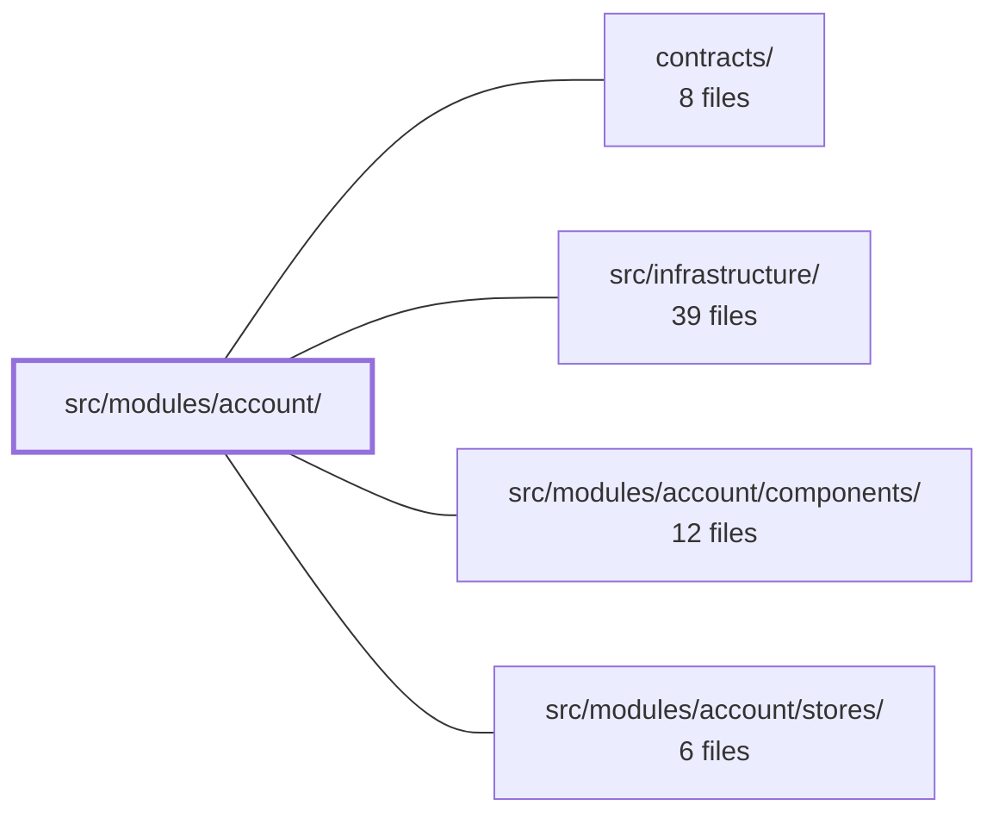

---
tags:
  - 2brain
  - 2brain/module
  - project/boilerplate-vue-frontend
type: module
module: src/modules/account/
files: 50
updated: 2026-10-02T19:25:25.603157+00:00
---

# src/modules/account/

## Purpose

The `account` module owns every frontend concern tied to a user's identity: authentication (login, signup, OAuth, two-factor, password reset, email verification, logout), self-service identity management (profile, avatar, address book, device sessions), and the route guard metadata that decides who may enter which area of the app. It registers itself with the application kernel, declares its contract-validation rows, and exposes a single public component (`AddressPicker`) for other modules such as checkout.

## Key parts

- **Registration & routing** — `module.ts` is the single default export the kernel splices into its registry (activates routes, nav entry, schema/locale loaders). `routes.ts` is the complete `RouteRecordRaw` array covering every auth and identity screen. `index.ts` is the barrel that re-exports `AddressPicker` so sibling modules can mount it without reaching into internal stores or dialogs.
- **Contract validation** — `response-schemas.ts` declares the envelope-validation rows for every `account` and `addresses` REST endpoint; registering them via the module manifest toggles schema checking for the whole domain.
- **Composables** — Five small, focused helpers: `use-countdown` (server-anchored countdown for time-boxed tokens), `use-method-label` (wire-name → i18n label for 2FA methods), `use-password-breach-check` (debounced advisory breach hint), `use-password-strength` (local zxcvbn scoring), and `use-post-login-redirect` (single exit path shared by both login steps, with optional locale switch).
- **Components** (`components/`) — The view layer: `Login`, `Signup`, `Profile`, `AddressPicker`, `AddressFormDialog`, `PasswordStrengthMeter`, `PasswordResetConfirm`, etc.
- **Stores** (`stores/`) — Pinia stores for auth/session, profile, addresses, OAuth providers, and analytics-consent, plus the CASL ability reader they depend on.
- **Tests** (`tests/`) — A large suite spanning unit (store, composable, view, i18n), end-to-end (Cypress: auth, 2FA, OAuth, password-reset, registration, profile, a11y, visual-regression), and integration-level specs. The testing strategy is consistent: mock only the HTTP transport (`orvalMutator`) and let every layer above it run for real.

## How it connects

- **`/` (repository root)** — The kernel at the root reads the module manifest from `module.ts`, splices the route array into the global router, and wires the response-schema and locale loaders into the app shell.
- **`contracts/`** — `response-schemas.ts` references the shared contract definitions that validate REST envelopes for the `account` and `addresses` backend domains.
- **`src/infrastructure/`** — Provides the HTTP transport (`orvalMutator`), generated API client, router utilities, and the i18n runtime that both composables and stores depend on.
- **`src/modules/account/components/`** — The presentational and container views that consume the stores and composables defined in this module and its sibling `stores/` directory.
- **`src/modules/account/stores/`** — The Pinia state layer (auth, profile, addresses, OAuth, sessions) that components call and that the tests exercise end-to-end with only the transport mocked.

## Where to start

1. **`routes.ts`** — Reading the route table gives you an immediate map of every screen the module owns, the `meta.access` values that gate them, and the parent/child nesting. Ten minutes here orients you better than any prose.
2. **`module.ts` + `index.ts`** — Together they show the module's external surface: what the kernel activates and what other modules can import. Everything else is internal detail you can reach when a task pulls you in.

## Connected modules

[[boilerplate-vue-frontend_ROOT|/ (repository root)]] · [[boilerplate-vue-frontend_contracts|contracts/]] · [[boilerplate-vue-frontend_src_infrastructure|src/infrastructure/]] · [[boilerplate-vue-frontend_src_modules_account_components|src/modules/account/components/]] · [[boilerplate-vue-frontend_src_modules_account_stores|src/modules/account/stores/]]

## Files
- `src/modules/account/composables/use-countdown.ts` — Provides a single "seconds remaining" countdown primitive plus two thin wrappers. A `setInterval` ticks a `now` ref while a deadline is active, and `secondsLeft` is derived from the server-provided deadline minus that clock — so the value always reflects the server's own expiry, never a client-guessed duration. The interval is created and torn down reactively, so it exists only while something is actually counting.
- `src/modules/account/composables/use-method-label.ts` — Composable that turns a 2FA method's wire name (e.g. `'email'`, `'totp'`) into a human-readable label via i18n. It deliberately avoids branching on specific method names: if a locale key exists for the name it is used, otherwise the raw wire string is returned as-is, so a method added by a later deployment renders correctly with no code change here.
- `src/modules/account/composables/use-password-breach-check.ts` — Vue composable that wires a debounced advisory password-breach check (via `POST /account/password/check`) into any form that collects a brand-new password. It exists to give the visitor a soft "this password appears in a breach list" hint while typing, without becoming a submit gate — the four password-SET endpoints remain the authoritative check. Shared across `Signup.vue`, `ProfilePasswordChange.vue`, and `PasswordResetConfirm.vue`.
- `src/modules/account/composables/use-password-strength.ts` — Vue composable that scores a password field's strength locally via zxcvbn on every keystroke. It is strictly advisory (never blocks form submission) and is kept as a separate composable from the breach-check so a page that only needs one doesn't load the other's dependencies.
- `src/modules/account/composables/use-post-login-redirect.ts` — Centralizes the post-login navigation so both login steps (plain form and 2FA challenge) share one exit path. Before navigating, it optionally switches to the visitor's saved locale preference. Extracted into its own composable to avoid each login step re-deriving the redirect logic.
- `src/modules/account/index.ts` — Public barrel for the `account` module. It re-exports a single component (`AddressPicker`) so that other modules (notably `cart`'s checkout) can mount the address-choose UI without importing into this module's internal stores or add/edit dialog directly.
- `src/modules/account/module.ts` — Module manifest for the `account` module. Exports a single default object (typed as `AppModule`) that, once spliced into the kernel registry by name, activates the account routes, navigation entry, response-schema loader, and locale loaders. It is the registration point, not the implementation.
- `src/modules/account/response-schemas.ts` — Declares the response-schema contract-validation rows for every REST endpoint attributed to the `account` or `addresses` backend module (the address-book screens have no dedicated frontend module). Registering these rows via the module manifest is what turns envelope validation on or off for the account domain as a whole.
- `src/modules/account/routes.ts` — Defines the complete route table for the account module — a single array of `RouteRecordRaw` entries covering all authentication and identity-management flows (login, signup, 2FA, password reset, email verification, account deletion, OAuth callback, profile, and logout). The array is the sole default export and is spliced into the application router by the kernel via the account module.
- `src/modules/account/tests/address-form-dialog.spec.ts` — Unit tests for the country `<v-autocomplete>` inside `AddressFormDialog.vue`. Covers the two states the dialog can be in — unrestricted (address book) and narrowed to a `shipToCountries` list (checkout) — plus label localization. Deliberately asserts the `items` prop handed to `VAutocomplete` rather than simulating overlay/menu interaction, matching the idiom used in `stock-movement-form.spec.ts`.
- `src/modules/account/tests/address-picker.spec.ts` — Unit-test suite for `AddressPicker.vue` that validates the component's pre-select watcher (default/first-entry fallback, manual-pick preservation, store-reactive re-selection), the add-address-at-checkout flow, isolation between two simultaneously mounted pickers, and the billing-purpose variant (including the "same as shipping" standing choice).
- `src/modules/account/tests/addresses.spec.ts` — Unit tests for the `useAddressesStore` Pinia store. Only the HTTP transport (`orvalMutator`) is mocked so the store's own fetch-after-write orchestration runs for real. Every case pins the same invariant: the local list is **replaced** by the full book response, never patched with the single row a write returns, and exactly one default always exists.
- `src/modules/account/tests/auth-login-mfa.spec.ts` — Unit tests for the `mfa` branch of `useAuthStore().login()`. Verifies that when the login endpoint returns an MFA challenge, the store resolves with the challenge payload and does **not** write to the session store or fetch the profile — the regression this narrowing was introduced to fix (storing `undefined` as a token, causing 401s that locked out every 2FA account). The companion file `auth-session.spec.ts` covers the plain `session` branch; this file only asserts the two are kept apart.
- `src/modules/account/tests/auth-session.spec.ts` — Unit tests for the auth store's session flows (login, logout, logoutEverywhere, password reset). The strategy is to mock **only** the HTTP transport (`orvalMutator`) and let every layer above it—the generated client, the session/profile/observability stores, the CASL ability reader—run for real. This means assertions target the same state the router guards actually read, rather than an isolated store in isolation. `signup` is deliberately excluded and lives in a sibling spec.
- `src/modules/account/tests/auth-signup.spec.ts` — Unit tests that pin the exact HTTP requests produced by `useAuthStore().signup()` and its avatar follow-up (`setAvatarAfterSignup`). They assert request URL, method, body shape (JSON vs. multipart), and forwarded options, without mocking the generated API client itself.
- `src/modules/account/tests/e2e/a11y.cy.ts` — Declares the routes and page-states for the account module's accessibility sweep. It contains no sweep logic itself—only the route names, roles, and `prepare` steps that define *what* to audit. Co-located with the module so that removing the module removes its a11y coverage; a cross-cutting spec (`tests/cross-cutting/a11y-coverage.spec.ts`) enforces that every routed module has one of these files.
- `src/modules/account/tests/e2e/account.visual.cy.ts` — Declares the list of screens to capture in the account module's visual-regression sweep. It contains no snapshot logic itself — that mechanism lives in `visual-sweep.ts`; this file only names routes, readiness selectors, and any per-screen `prepare` / `redact` hooks needed to reach a specific state.
- `src/modules/account/tests/e2e/auth.cy.ts` — Cypress end-to-end suite covering the full authentication surface: login (form, validation, success, remember-me cookie lifetime), signup (validation, unverified-role entry), route guards (`/cart`, `/orders`, `/admin`, `/users`), logout, in-tab user switching, and a live-profile-only session-refresh test that exercises the cross-origin (`:8085 → :3000`) refresh path.
- `src/modules/account/tests/e2e/oauth.cy.ts` — Cypress e2e suite for the OAuth login buttons, exercising the full redirect chain (BE start route → BE callback → cookie set → FE `/oauth/callback`) via the backend's `fake` provider. Real Google/GitHub flows can't run in CI; `fake` skips the consent screen but still round-trips the genuine `state` cookie, making the redirect path authentic. All tests are gated to demo mode.
- `src/modules/account/tests/e2e/password-reset.cy.ts` — Cypress end-to-end test for the full password-reset flow. It verifies that a reset link actually delivered via email (read from the demo outbox or live Mailpit) changes the credential, and that a fabricated token cannot. Both halves of the outcome are asserted at the login form: the old password stops working and the new one works.
- `src/modules/account/tests/e2e/profile.cy.ts` — Cypress e2e spec for the self-service account profile page. Exercises password change, session management, the address book, and email-verification UI against the real API in its demo profile. The tests pin the *page's* honouring of backend invariants (one default address, a `current` session flag, a `pendingEmail` park) rather than the rules themselves, which belong to backend tests.
- `src/modules/account/tests/e2e/registration.cy.ts` — Cypress end-to-end spec covering the full registration arc: a visitor signs up, the session is established immediately (account lands as `unverified` with a banner), the user logs out to simulate a separate device, the emailed verification token is spent as a guest, and the password gate is proven (wrong password refused, correct password accepted). It also verifies that the unverified banner persists on every page until the token is actually consumed.
- `src/modules/account/tests/e2e/two-factor.cy.ts` — Cypress end-to-end spec that exercises the full email-based two-factor authentication lifecycle: enrolling email as a second factor, verifying the challenge page on the next login, accepting a code read from the mailbox, rejecting an incorrect code, regenerating backup codes, and removing the last factor to disable 2FA. It exists because the 2FA flow spans multiple pages, a backend mail template, and mailbox polling, none of which unit tests can cover together.
- `src/modules/account/tests/login-view-i18n.spec.ts` — End-to-end view test that the `Login` component is actually wired to `usersSchema` and vue-i18n's `revalidateOn: locale`. It renders the real view, triggers a validation error, switches locale mid-form, and asserts the on-screen Vuetify message re-translates — with no mocking of the i18n runtime or the schema.
- `src/modules/account/tests/oauth-continue.spec.ts` — Verifies that `Login.vue` and `Signup.vue` forward the page's own `?continue=` query parameter onto every OAuth provider button's `href`, and that the parameter is safely omitted for open-redirect or type-mismatch inputs. It is the view-level counterpart to `oauth.spec.ts`, which pins the `oauthStartUrl` encoding logic in isolation.
- `src/modules/account/tests/oauth.spec.ts` — Unit tests for the OAuth provider Pinia store (`useOAuthProvidersStore`) and its two pure URL/label helpers (`oauthStartUrl`, `providerLabel`). Only the HTTP transport is mocked; responses are keyed by `"METHOD /path"` in a module-level map, mirroring the pattern in `sessions.spec.ts`.
- `src/modules/account/tests/password-breach-hint.spec.ts` — Verifies that the `usePasswordBreachCheck` composable is correctly wired into the three live forms that display a breach warning (`ProfilePasswordChange`, `PasswordResetConfirm`, `Signup`). It proves the integration path—input change → debounced API call → advisory warning render/dismiss—without re-testing the composable's own debounce logic (pinned separately in `use-password-breach-check.spec.ts`).
- `src/modules/account/tests/password-change-sessions-refresh.spec.ts` — Verifies that a successful password change triggers a refetch of the device-sessions list. The server-side `postPasswordChange` endpoint revokes all other sessions, so the UI must re-query after the change; without this refetch the sessions panel would display stale entries until the next page visit.
- `src/modules/account/tests/password-reset-request-view.spec.ts` — Vitest spec for the `PasswordResetRequest.vue` view. Verifies that the "forgot password" form rejects invalid emails client-side, submits the typed address to the auth store, and routes API refusals to the correct place: field-named errors land on the email input, unnamed errors block the form in place.
- `src/modules/account/tests/password-strength-meter.spec.ts` — Unit tests for `PasswordStrengthMeter.vue`. Verifies three behavioral contracts: the component renders nothing for an empty password, displays a bar + label when a strength score is present, and explicitly does **not** render a breach warning (that responsibility belongs to a separate component driven by `use-password-breach-check.ts`).
- `src/modules/account/tests/profile-addresses-default.spec.ts` — Unit tests scoped to the "set as default" checkbox in the add-address dialog (FE_PARITY_0924 A3). Verifies three UI decisions: the checkbox is hidden when the address book is empty (first address is default server-side), hidden again when editing an existing entry, and—when visible and checked—adds only `default: true` to the POST body, never `default: false`. Complements `addresses.spec.ts`, which covers the store's PATCH/POST plumbing.
- `src/modules/account/tests/profile-addresses-view.spec.ts` — Unit test for the save-payload logic that `ProfileAddresses.vue` builds from its dialog fields — specifically the create vs. edit distinction for optional fields (`label`, `phone`). It exists because `addresses.spec.ts` (the store test) does not exercise the component-level payload construction, and AUDIT_0924 D17c requires empty-on-edit to send `null` (not `""`, not omitted) while create must omit the keys entirely.
- `src/modules/account/tests/profile-avatar-panel.spec.ts` — Unit test for the `ProfileAvatar.vue` component's remove-button visibility. It verifies that the remove control is rendered only when the account record carries an `imageUrl`, and is absent when it does not.
- `src/modules/account/tests/profile-avatar.spec.ts` — Unit tests covering the avatar-specific branches of `useProfileStore().updateProfile`: the multipart `imageUpload` path, the plain-JSON `imageUrl: null` removal path, and the per-path loading flags (`uploadingAvatar`, `removingAvatar`) that the two avatar buttons depend on. It is deliberately split out from `profile.spec.ts` so that the picture logic is tested in isolation.
- `src/modules/account/tests/profile-guest-consent-sync.spec.ts` — Vitest spec covering the login-time guest-consent sync (feature FA-D5): when a guest who answered the analytics consent banner authenticates into an account that has no `analyticsConsent` value of its own, the guest's choice is persisted via a single `PATCH /account` call. The spec exercises the real `useAnalyticsConsentStore` and `useProfileStore` logic while mocking only the HTTP transport layer.
- `src/modules/account/tests/profile-page.spec.ts` — Vitest spec that mounts the real `Profile.vue` page (with all sibling panels stubbed) to verify the record-edit form's own HTTP behaviour: what an ordinary save sends to `PATCH /account`, what it deliberately omits, and how the pending-email notice / resend / cancel flow interacts with the same endpoint. Every assertion is made against the raw request config captured on the mocked `orvalMutator`, never against rendered UI beyond button-state checks.
- `src/modules/account/tests/profile-sessions-last-used.spec.ts` — Regression test ensuring the `ProfileSessions` component renders the `lastUsedAt` timestamp on each session row. It exists because the sessions panel previously omitted this field even though the API provided it, leaving users unable to tell which device was most recently active when deciding which to revoke.
- `src/modules/account/tests/profile-stale-record.spec.ts` — Tests the `Profile.vue` page's reaction to a **412 Precondition Failed** response on `PATCH /account` (the record changed on another device/tab). Verifies that the form displays an in-place warning, offers a "reload latest" action, and that pressing it triggers a fresh `GET /account` and clears the warning. Lives in its own file because the sibling `profile-page.spec.ts` mocks `orvalMutator` to answer every PATCH with success.
- `src/modules/account/tests/profile.spec.ts` — Unit tests for the `useProfileStore` covering fetch, update, role change, password rotation, email verification, and account deletion. Only the transport (`orvalMutator`) is mocked and keyed by request URL; every layer above it — generated client, session store, auth store, observability, `useStructureRestApi` — executes for real, so the tests exercise integration behaviour without hitting a network.
- `src/modules/account/tests/routes.spec.ts` — Pins the `meta.access` value declared on every account route by asserting them directly against the module's route records (no resolved router needed). Its job is to guarantee that a route which silently loses `meta.access` is caught immediately, since that would make it indistinguishable from a public route.
- `src/modules/account/tests/sessions.spec.ts` — Unit tests for `useAccountSessionsStore` — verifying that listing sessions and revoking a single entry behave correctly. Only the HTTP transport is mocked; responses are keyed by request URL (same pattern as `profile.spec.ts`).
- `src/modules/account/tests/signup-antibot.spec.ts` — Verifies that the Signup view correctly wires a solved `HumanCheck` token onto the `POST /account/signup` request as the `x-antibot-challenge-token` header. The `HumanCheck` component itself is stubbed with a fixed token (its branching logic is covered in `tests/unit/ui/human-check.spec.ts`), and store-level forwarding is already proven in `auth-signup.spec.ts`; this spec isolates only the view-to-transport wiring.
- `src/modules/account/tests/two-factor-challenge-view.spec.ts` — Vitest spec for the `TwoFactorChallenge.vue` view component. It verifies two accessibility/UX fixes: (1) the visible ticking countdown text is **not** itself a live region — a separate `[role=status]` element handles announcements — and (2) an expired or rate-limited challenge always offers a "Back to login" link rather than leaving the user with only a disabled submit button.
- `src/modules/account/tests/two-factor-enroll-countdown.spec.ts` — Verifies that `TwoFactorEnroll.vue` (accessibility fix FA82) keeps the visible countdown text outside any live region while providing a separate `role="status"` element for screen-reader announcements. It is the enroll-side counterpart to `two-factor-challenge-view.spec.ts`; the shared announcement logic itself is covered by `use-countdown.spec.ts`.
- `src/modules/account/tests/two-factor-store.spec.ts` — Unit tests for the `useTwoFactorStore()` Pinia store, covering the enrollment flow (setup → confirm → backup codes), the login-time challenge (send → submit), the `resendAfter` countdown, and 429 rejection surfacing. Mocks only the HTTP transport layer (`orvalMutator`), following the same pattern as `sessions.spec.ts` and `auth-session.spec.ts`.
- `src/modules/account/tests/two-factor-view.spec.ts` — Integration-level Vitest spec that mounts the real `ProfileTwoFactor.vue` / `TwoFactorEnroll.vue` pair and asserts that sensitive values (TOTP secret, one-time backup codes) render exclusively from component-local refs fed by their respective API responses — never from `useTwoFactorStore()`. It exists to lock in FA14's "never park a secret in a store" invariant against regressions.
- `src/modules/account/tests/use-countdown.spec.ts` — Vitest spec for `useCountdownAnnouncement` (FA82), a screen-reader accessibility helper that announces countdown milestones (60s, 30s, 10s, expired) exactly once per threshold crossing rather than on every tick. The file explicitly does **not** test `useCountdown`'s own ticking logic; that is covered by `two-factor-store.spec.ts`.
- `src/modules/account/tests/use-password-breach-check.spec.ts` — Vitest spec for the `usePasswordBreachCheck` composable. It verifies the debounce logic (one API call per keystroke burst), the reactive `breached` flag, and edge cases like scope disposal, empty input, network failure, and stale-response ordering. Fake timers are used because the 500 ms delay is the subject under test—a real wait would slow the suite and introduce flakiness.
- `src/modules/account/tests/use-password-strength.spec.ts` — Vitest spec for the `usePasswordStrength` composable. Verifies that the composable delegates to zxcvbn for scoring, clears the score (without calling zxcvbn) when the password is emptied, and re-queries zxcvbn when the password value changes.
- `src/modules/account/tests/use-post-login-redirect.spec.ts` — Vitest spec for the `usePostLoginRedirect` composable. It verifies two security/behavioral invariants of `redirectAfterLogin()`: (1) the `?continue=` query param is only honored when it is a single same-origin path, falling back to the `Home` route for arrays, protocol-relative strings (`//evil.example`), and absolute URLs; and (2) a saved language preference is applied exclusively through routing (`params.locale`) and never by calling `changeLanguage` directly (regression FA26).

---
[[boilerplate-vue-frontend_INDEX|← boilerplate-vue-frontend index]]
