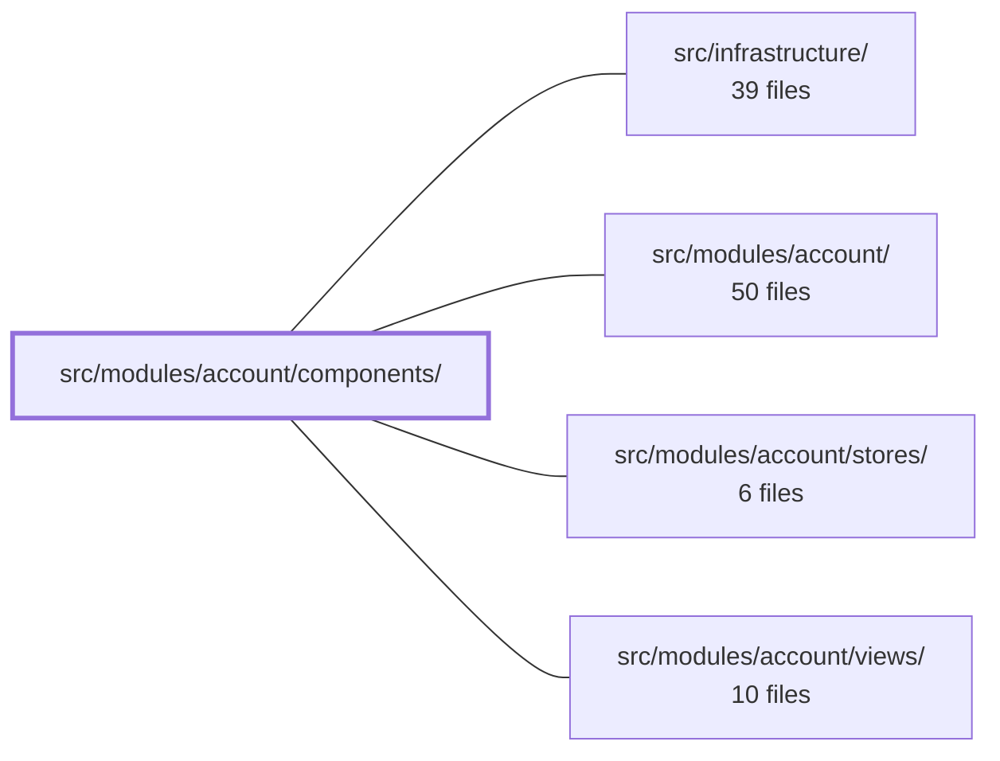

---
tags:
  - 2brain
  - 2brain/module
  - project/boilerplate-vue-frontend
type: module
module: src/modules/account/components/
files: 12
updated: 2026-10-02T19:25:43.091840+00:00
---

# src/modules/account/components/

## Purpose

Vue components that make up the interactive UI of the account/profile feature. Each file is a self-contained panel, dialog, or picker that the profile views and the checkout flow mount to let the visitor manage addresses, credentials, security, and account lifecycle actions.

## Key parts

- **Address management** — `ProfileAddresses.vue` (card-grid list with set-default / edit / remove), `AddressFormDialog.vue` (shared create-or-edit dialog, also reused by checkout), and `AddressPicker.vue` (radio-group selector used by `ShippingSelector` during checkout).
- **Profile panels** — `ProfileAvatar.vue` (upload / remove image), `ProfilePasswordChange.vue` (collapsible change-password form), `ProfileSessions.vue` (live-token list + revoke / log-out-everywhere), `ProfileDeleteAccount.vue` (destructive-action card behind a confirm dialog), `ProfileExportData.vue` (GDPR JSON download).
- **Two-factor authentication** — `ProfileTwoFactor.vue` (method list, enrollment triggers, backup-code management), `TwoFactorEnroll.vue` (single-method enrolment card: QR or code-sent + entry field), `TwoFactorBackupCodes.vue` (one-time code display with mandatory acknowledgement).
- **Utility** — `PasswordStrengthMeter.vue` (advisory zxcvbn-based colour bar; never blocks submission).

## How it connects

- **`src/modules/account/views/`** — The profile page views compose these components into the full page layout (e.g. the profile view mounts `ProfileAddresses`, `ProfileAvatar`, `ProfileTwoFactor`, etc.).
- **`src/modules/account/stores/`** — Components read from and dispatch to the module's Pinia stores (addresses, auth/session, 2FA state) rather than calling the API directly; the stores handle fetch-after-mutate and single-default invariants.
- **`src/modules/account/`** (module root) — Provides composables and shared utilities (e.g. `usePasswordStrength`, confirmation-dialog helpers) that individual components import.
- **`src/infrastructure/`** — Supplies the underlying HTTP client, i18n translations, Zod schema helpers, and any cross-cutting services (step-up auth interceptor) that the components rely on indirectly through the stores and composables above.

## Where to start

1. **`ProfileAddresses.vue`** — It is the clearest example of the module's dominant pattern: a card that lists server-backed entities, wires per-row actions to store mutations, and re-fetches on every write.
2. **`AddressFormDialog.vue`** — Shows how a shared dialog is extracted so both the profile page and the checkout picker can reuse the same fields, validation schema, and save logic without duplication.

Reading those two together gives a newcomer the "list + dialog" idiom and the cross-feature reuse strategy that most other components in this directory follow.

## Connected modules

[[boilerplate-vue-frontend_src_infrastructure|src/infrastructure/]] · [[boilerplate-vue-frontend_src_modules_account|src/modules/account/]] · [[boilerplate-vue-frontend_src_modules_account_stores|src/modules/account/stores/]] · [[boilerplate-vue-frontend_src_modules_account_views|src/modules/account/views/]]

## Files
- `src/modules/account/components/AddressFormDialog.vue` — A shared add/edit address dialog form, extracted from `ProfileAddresses.vue` so that `AddressPicker.vue` (the checkout side) can offer the same "add an address" flow without duplicating the form fields, Zod schema, or save logic. It handles both creating a new address and updating an existing one, with a dialog-level blocking error for save failures.
- `src/modules/account/components/AddressPicker.vue` — Radio-group picker for choosing a saved address during checkout. `ShippingSelector.vue` mounts two instances — one for the shipping address, one for the billing address — and binds each to a `defineModel` slot holding the selected entry's id (or `undefined`). Includes an "add address" button that opens the shared `AddressFormDialog`.
- `src/modules/account/components/PasswordStrengthMeter.vue` — Renders a live, advisory-only five-segment progress bar and a translated label beneath a password input. It scores the candidate password via `usePasswordStrength` and maps the 0–4 zxcvbn score to a color and i18n label. It never blocks form submission; actual validation is delegated to the schema and server-side checks. It renders nothing when the password is empty.
- `src/modules/account/components/ProfileAddresses.vue` — Address-book panel for the profile page. Renders the visitor's saved addresses in a responsive card grid and provides per-entry actions (set default, edit, remove) plus an add button. All writes go through the addresses store, which fetches the full list after each mutation so the UI always reflects the server's single-default invariant.
- `src/modules/account/components/ProfileAvatar.vue` — Self-contained panel for the account profile's avatar image. It handles both uploading a new picture and removing the existing one, acting immediately on selection (no separate save step) — unlike the details form that sits below it in the profile page.
- `src/modules/account/components/ProfileDeleteAccount.vue` — A single-button card that initiates account deletion. It exists to isolate the most destructive action on the profile page into its own card (matching the sibling pattern of `ProfileSessions` and `ProfileAddresses`) and to gate the destructive API call behind a shared confirmation dialog.
- `src/modules/account/components/ProfileExportData.vue` — Self-service GDPR data export widget: a single "Export my data" button that fetches the user's account data from the server and triggers a browser download of a pretty-printed JSON file. It is intentionally minimal — no confirmation dialog (the action is non-destructive), no in-UI rendering of the data, and no manual re-authentication handling (the step-up interceptor covers that transparently).
- `src/modules/account/components/ProfilePasswordChange.vue` — A collapsible form on the profile page that lets the visitor change their password in a single round-trip (proving the current password rather than an email reset). It is hidden behind a toggle so the profile page does not open with three forms visible at once.
- `src/modules/account/components/ProfileSessions.vue` — Device-sessions panel on the profile page. Renders every live refresh token as a row, lets the visitor revoke a single session, and offers a "log out everywhere" action. Revoking the *current* session is treated by the API as a logout, so the component navigates home afterwards.
- `src/modules/account/components/ProfileTwoFactor.vue` — The account's two-factor authentication management panel. It renders the list of armed 2FA methods (each removable, or replaceable if already armed), offers enrollment for methods the server says are still available, and manages backup-code reveal/regeneration. Every mutation that must prove an existing factor funnels through a single shared code-prompt dialog, layered on top of the fresh-auth re-authentication the route already requires.
- `src/modules/account/components/TwoFactorBackupCodes.vue` — Renders the one-time backup-codes screen shown during two-factor enrolment. It displays the `codes` prop in the clear, forces the visitor to acknowledge saving them via a checkbox, and emits `done` only after that confirmation. By design there is no "skip" or "close" path — the codes are never retrievable again.
- `src/modules/account/components/TwoFactorEnroll.vue` — Single-method 2FA enrollment card. On mount it requests a setup payload (or receives one via `initialSetup`), then renders one of two halves — a QR code + manual secret for a device method, or a "code sent to …" prompt with a resend button for a delivered method — plus a shared code-entry field. It is fully method-agnostic: the only branch point is the boolean `delivers` flag from the server.

---
[[boilerplate-vue-frontend_INDEX|← boilerplate-vue-frontend index]]
