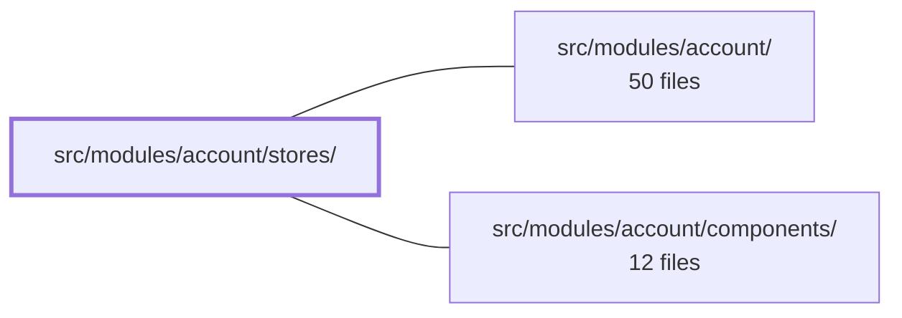

---
tags:
  - 2brain
  - 2brain/module
  - project/boilerplate-vue-frontend
type: module
module: src/modules/account/stores/
files: 6
updated: 2026-10-02T19:25:56.273879+00:00
---

# src/modules/account/stores/

## Purpose

This module is the state layer for the account area. It holds every Pinia store (Composition API) that a logged-in visitor needs: session lifecycle, identity and settings, device sessions, two-factor authentication, address book, and the OAuth provider list. Each store wraps the shared `useStructureRestApi` toolkit so that request, caching, and identifier logic is not duplicated across actions.

## Key parts

- **Session & entry points** — `auth.ts` owns login, signup, password-reset, and both logout variants; it orchestrates transitions between the session and profile stores. `oauth.ts` caches the deployment-level list of enabled OAuth providers and exposes `providerLabel` / `oauthStartUrl` helpers for rendering one button per provider.
- **Identity & settings** — `profile.ts` is the owner of the editable `User` record (fetch, update, avatar, password change, email verification, deletion). `sessions.ts` manages the active device-session list and revocation. `two-factor.ts` consolidates the 2FA status, enrollment flow (setup → confirm → backup codes), and the login-time challenge into a single store because they share the same server resource and resend-cooldown logic.
- **Address book** — `addresses.ts` manages the visitor's addresses. Every mutation re-fetches the full book rather than patching one row, because the "exactly one default" invariant is a list-level property the API may shift on a different row.

## How it connects

- **`src/modules/account/`** (parent) — This stores directory is the state backbone of the account module. The parent's route views and composable hooks read and write through these stores rather than calling the API client directly.
- **`src/modules/account/components/`** (sibling) — UI components such as `Login.vue` and `Signup.vue` consume `auth.ts` for form actions and `oauth.ts` to render provider buttons. Profile, sessions, 2FA, and address components read their respective stores for display and dispatch their mutations through store actions.

## Where to start

Read **`auth.ts`** first — it is the entry point into the account flow and shows how session transitions coordinate with the profile store. Then read **`profile.ts`** to see the canonical pattern for wrapping the `useStructureRestApi` primitives (selectedIdentifier, fetchTarget, updateTarget) around a set of user-record actions; every other store in this directory follows the same shape.

## Connected modules

[[boilerplate-vue-frontend_src_modules_account|src/modules/account/]] · [[boilerplate-vue-frontend_src_modules_account_components|src/modules/account/components/]]

## Files
- `src/modules/account/stores/addresses.ts` — Pinia store (Composition API) managing the visitor's address book. Every mutation (add, update, set-default, remove) re-fetches the entire book rather than patching a single entry, because the invariant that must hold after any write — exactly one default — is a list-level property that can shift a *different* row than the one the API responds with.
- `src/modules/account/stores/auth.ts` — Pinia store (Composition API) that owns the **session lifecycle**: login, signup, password reset, and the two logout variants. It wraps the `@api` client calls via `useStructureRestApi` and coordinates the session and profile stores after each successful transition. It deliberately does **not** hold the editable user record — that lives in `profile.ts`.
- `src/modules/account/stores/oauth.ts` — Pinia store (Composition API form) that holds the list of enabled OAuth providers for a deployment, plus two pure helpers (`providerLabel`, `oauthStartUrl`) used by `Login.vue` and `Signup.vue` to render one button per configured provider. The provider list is a deployment-level fact fetched once and cached, not per-visitor state.
- `src/modules/account/stores/profile.ts` — Pinia store (Composition API) that owns the visitor's own editable `User` record: fetching, updating (including avatar upload/removal), password change, email verification, and account deletion. It wraps the shared `useStructureRestApi` toolkit so every action reuses the same `selectedIdentifier` / `fetchTarget` / `updateTarget` primitives instead of duplicating request and cache logic per action. It is deliberately separate from the session store, which only holds the minimal `{ id, email, role, imageUrl, verified }` projection the shell and route guards need.
- `src/modules/account/stores/sessions.ts` — Pinia store (Composition API) that manages the visitor's device-session list — which refresh tokens are currently active and allows revoking a single session. It uses a plain `ref<Session[]>` rather than the toolkit's record structure because a session has no detail page and the list is always read whole.
- `src/modules/account/stores/two-factor.ts` — Pinia store (Composition API) that centralises every 2FA surface for a single account: the armed/available-method status, the enrollment machine (setup → confirm → backup codes), and the login-time challenge (send code → submit code). It exists as one store rather than three because the enrollment and status endpoints share the same `GET /account/2fa` resource, and the login challenge reuses the same server-driven resend cooldown as enrollment's "send me a code" step.

---
[[boilerplate-vue-frontend_INDEX|← boilerplate-vue-frontend index]]
