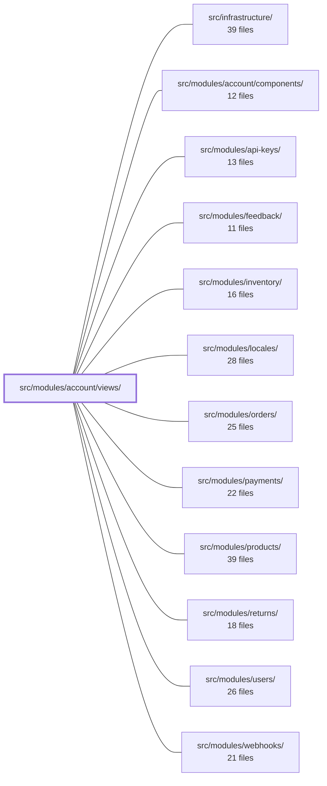

---
tags:
  - 2brain
  - 2brain/module
  - project/boilerplate-vue-frontend
type: module
module: src/modules/account/views/
files: 10
updated: 2026-10-02T19:26:20.200568+00:00
---

# src/modules/account/views/

## Purpose

This module contains the Vue view components for the account and authentication domain. It covers every user-facing page in that domain: the primary login and signup flows, the 2FA and OAuth steps, the authenticated profile page, and the collection of public, token-driven confirmation pages (email verification, email change, password reset, account deletion) that a visitor reaches by clicking an emailed link.

## Key parts

- **Authentication entry & multi-step flows** — `Login.vue` (email/password form, OAuth provider links, 2FA hand-off, anti-bot gate), `TwoFactorChallenge.vue` (2FA / backup-code entry that follows Login), and `OAuthCallback.vue` (landing point after the OAuth redirect; delegates destination to Home, 2FA, or an error card).
- **Account creation** — `Signup.vue` collects and validates the registration form, calls the signup endpoint, optionally uploads an avatar, and honours `?continue=` for post-login routing.
- **Profile & record management** — `Profile.vue` owns the main record-edit form (email, username, locale, phone, etc.), the `PATCH /account` save flow, stale-record (412) recovery, pending-email resend/cancel, and composes six sibling panels (avatar, password, 2FA, sessions, addresses, delete) as separate components.
- **Public token-confirmation pages** — `VerifyEmailConfirm.vue`, `EmailChangeConfirm.vue`, `PasswordResetConfirm.vue`, `PasswordResetRequest.vue`, and `AccountDeleteConfirm.vue`. Each is an unauthenticated, single-purpose page whose sole credential is a one-time token in the URL query string. The confirm-type pages deliberately require an explicit button press so that mail-client prefetching cannot spend the token.

## How it connects

- **`src/modules/account/components/`** — `Profile.vue` imports and composes the six sub-panels (avatar, password, 2FA, sessions, addresses, delete) that live in this sibling directory.
- **`src/modules/users/`** — `Login.vue` validates its form against a Zod schema derived from the shared `usersSchema` defined in the users module.
- **`src/modules/locales/`** — `Profile.vue` exposes a locale field in the record form and performs language re-routing after a successful save.
- **`src/infrastructure/`** — The views depend on the shared auth store (set/reset session), the router's global guard (`tryRestoreAuth`), and the API layer for all HTTP calls (signup, login, password reset, account PATCH, etc.).

## Where to start

1. **`Login.vue`** — It is the primary entry point for all new visitors and shows the three-branch post-authentication flow (redirect → 2FA → anti-bot), making it the best single file for understanding the authentication state machine.
2. **`Profile.vue`** — The richest authenticated view; reading it reveals how the module structures form validation, the save-and-recover cycle, and the composition of the account sub-panels from `account/components/`.

## Connected modules

[[boilerplate-vue-frontend_src_infrastructure|src/infrastructure/]] · [[boilerplate-vue-frontend_src_modules_account_components|src/modules/account/components/]] · [[boilerplate-vue-frontend_src_modules_api-keys|src/modules/api-keys/]] · [[boilerplate-vue-frontend_src_modules_feedback|src/modules/feedback/]] · [[boilerplate-vue-frontend_src_modules_inventory|src/modules/inventory/]] · [[boilerplate-vue-frontend_src_modules_locales|src/modules/locales/]] · [[boilerplate-vue-frontend_src_modules_orders|src/modules/orders/]] · [[boilerplate-vue-frontend_src_modules_payments|src/modules/payments/]] · [[boilerplate-vue-frontend_src_modules_products|src/modules/products/]] · [[boilerplate-vue-frontend_src_modules_returns|src/modules/returns/]] · [[boilerplate-vue-frontend_src_modules_users|src/modules/users/]] · [[boilerplate-vue-frontend_src_modules_webhooks|src/modules/webhooks/]]

## Files
- `src/modules/account/views/AccountDeleteConfirm.vue` — Public, unauthenticated confirmation page that completes an account deletion started by an emailed link. The one-time token carried in the URL query is the sole credential, so the route has no auth guard and the form works for a signed-out visitor.
- `src/modules/account/views/EmailChangeConfirm.vue` — Public confirmation page reached by clicking the email-change link (token delivered in the URL query). It presents the prefilled one-time token with a submit button — deliberately not auto-firing on mount — so that a mail-client prefetch or link scanner cannot spend the token before the user actually arrives. On success it navigates to Home; on failure it surfaces an inline blocking error.
- `src/modules/account/views/Login.vue` — The primary authentication entry point for the application. Renders an email/password form, validates it against a Zod schema derived from the shared `usersSchema`, and dispatches the result through one of three branches: a plain post-login redirect, a hand-off to the `TwoFactorChallenge` view, or an inline anti-bot (HumanCheck) challenge. Also surfaces available OAuth providers as top-level navigation links.
- `src/modules/account/views/OAuthCallback.vue` — Landing view for the OAuth redirect chain. By the time this component mounts, the router's global guard (`tryRestoreAuth`) has already restored the session (or not). This view's sole job is to decide the next destination: navigate to `Home`/`?continue=`, push to `TwoFactorChallenge` when 2FA is required, or render a translated error card with a link back to `/login`.
- `src/modules/account/views/PasswordResetConfirm.vue` — Public, unauthenticated page where a user who clicked the emailed reset link enters a new password. The one-time token (carried as a URL query param) is the sole credential; the page validates the form with Zod, calls the auth store to set the new password, and redirects to `Login` on success.
- `src/modules/account/views/PasswordResetRequest.vue` — Public, unauthenticated page where a visitor enters an email address to request a password-reset token. It always returns the same acknowledgement regardless of whether the address belongs to a real account, preventing username enumeration. The page attaches an antibot (human-challenge) token to the request before it hits the API.
- `src/modules/account/views/Profile.vue` — The account profile page. It renders the main record-edit form (email, username, locale, phone, website, analytics consent) and composes six sibling panels (avatar, password, 2FA, sessions, addresses, delete) as independent components. It owns form validation, the `PATCH /account` save flow, stale-record (412) recovery, pending-email resend/cancel, and post-save language re-routing.
- `src/modules/account/views/Signup.vue` — The account-creation page. It collects email, password (with confirm), terms acceptance, optional analytics consent, and an optional avatar file; validates them client-side with Zod; calls `POST /account/signup` to register **and** log the user in; then optionally uploads the avatar as a follow-up `PATCH /account` and redirects (honouring `?continue=`). It also surfaces OAuth "sign up with" links alongside the form.
- `src/modules/account/views/TwoFactorChallenge.vue` — Second step of the login flow: presents a 2FA code-entry form (or backup-code entry) against the challenge that `Login.vue` opened. The page is a public route — the challenge token itself is the credential, not a session — so arriving here without an active challenge (reload, bookmarked URL) bounces the visitor back to `Login`.
- `src/modules/account/views/VerifyEmailConfirm.vue` — Public, unauthenticated page that confirms an email address using a one-time token delivered by link. The token in the query string is the sole credential; the page requires an explicit button press (not an auto-fire on mount) so that mail-client prefetching or link-scanning cannot consume the token before the user intends to.

---
[[boilerplate-vue-frontend_INDEX|← boilerplate-vue-frontend index]]
