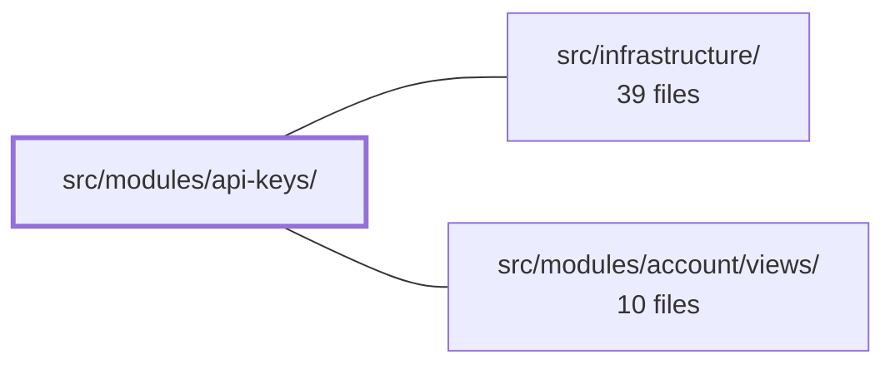

---
tags:
  - 2brain
  - 2brain/module
  - project/boilerplate-vue-frontend
type: module
module: src/modules/api-keys/
files: 13
updated: 2026-10-02T19:26:40.516519+00:00
---

# src/modules/api-keys/

## Purpose

The `api-keys` module manages machine-to-machine API credentials for the platform. It lets an administrator **mint** (create) a new API key with a name, permission set, and optional expiry, and **revoke** existing ones. All key fields are immutable after creation, so there is no edit or detail view — the lifecycle is strictly list → create → reveal one-time secret → revoke.

## Key parts

- **Wiring & contracts** — `module.ts` registers the module's routes, nav entry, response schemas, and locale bundles into the app's central `AppModule` registry. `response-schemas.ts` feeds every `api-keys` endpoint into the shared response-schema validation pipeline.
- **Routes & form schema** — `routes.ts` declares the two route records (list, create). `schemas.ts` defines the Zod validation schema for the creation form with per-field, i18n-thunked error messages.
- **State** — `store.ts` is a Pinia store exposing a paginated search (via the shared `useStructureCrudApi` helper) plus two hand-written actions (`mintCredential`, `revokeCredential`) that bypass the generic CRUD path because their responses are irregular (one-time secret, empty body).
- **Views** — `ApiKeysList.vue` renders a paginated data table with a create link and per-row revoke button. `ApiKeyCreate.vue` presents the mint form, shows the one-time secret in a modal on success, then returns the user to the list.
- **Tests** — Unit specs cover the store (secret-handling invariants), the schema (including i18n resolution), and routes. E2E specs exercise functional flows and an automated accessibility sweep across empty, populated, error, and phone-viewport states.

## How it connects

- **`/` (repository root)** — Provides the shared packages the module imports: `@api/schemas` for the response-envelope definitions, vue-i18n for locale bundles, and Pinia for state management.
- **`src/infrastructure/`** — Supplies the runtime plumbing: the module-registry kernel that reads `module.ts`, the `useStructureCrudApi` helper used by the store's search action, the `orvalMutator` transport layer (mocked in store tests), and the response-schema validation pipeline that `response-schemas.ts` plugs into.
- **`src/modules/account/views/`** — The account module manages the role/permission model; the `admin` role carries the `apikeys.*` permissions that gate access to this module's routes. Navigation from account-related views (e.g., a settings or profile page) links into the api-keys list.

## Where to start

1. **`store.ts`** — Reading the three actions (`search`, `mintCredential`, `revokeCredential`) gives you the full data flow and the reason the mint/revoke paths are hand-written rather than generic CRUD.
2. **`views/ApiKeyCreate.vue`** — Pairs naturally with the store; it shows how the one-time secret is surfaced to the user and why the module has no detail page.

## Connected modules

[[boilerplate-vue-frontend_ROOT|/ (repository root)]] · [[boilerplate-vue-frontend_src_infrastructure|src/infrastructure/]] · [[boilerplate-vue-frontend_src_modules_account_views|src/modules/account/views/]]

## Files
- `src/modules/api-keys/module.ts` — Module manifest that registers the api-keys feature (routes, nav entry, response schemas, locale bundles) into the app's central `AppModule` registry. It is the single wiring point the kernel reads to discover this module's contributions.
- `src/modules/api-keys/response-schemas.ts` — Declares the response-envelope schema registrations for every `api-keys` endpoint. It feeds the shared response-schema validation pipeline so that, when the `api-keys` domain is enabled, all calls made by that module are contract-checked against the schemas defined in `@api/schemas`.
- `src/modules/api-keys/routes.ts` — Defines the two route records (list + create) for the api-keys module and exports them as a typed array consumed by the app's module registry. There is intentionally no edit/detail route: all key fields (name, permissions, expiry) are immutable after minting, so a list row is sufficient.
- `src/modules/api-keys/schemas.ts` — Defines the Zod validation schema for the API-key mint (creation) form. Splits the object into per-field schemas so each can carry its own i18n-thunked error messages, then composes them into a single exported `apiKeyCreateSchema`.
- `src/modules/api-keys/store.ts` — Pinia store managing machine-to-machine API credentials. Exposes a search-only list (via the shared `useStructureCrudApi` helper) plus two hand-written actions (`mintCredential`, `revokeCredential`) that bypass the generic CRUD paths because their responses either contain a one-time plaintext secret or lack an updated record body.
- `src/modules/api-keys/tests/e2e/a11y.cy.ts` — Cypress a11y sweep for the api-keys module. It registers a set of routes and states with the shared `sweepA11y` helper so that automated accessibility audits run against each variant (empty list, populated list, phone viewport, create form, error state) as the `admin` role — the only preset role with `apikeys.*` permissions.
- `src/modules/api-keys/tests/e2e/api-keys.cy.ts`
- `src/modules/api-keys/tests/routes.spec.ts`
- `src/modules/api-keys/tests/schemas-i18n.spec.ts` — Verifies that `apiKeyCreateSchema`'s validation messages actually resolve to the correct strings in the api-keys locale dictionaries (`en.json`, `it.json`) under a real vue-i18n runtime. It complements the cross-cutting spec (`tests/cross-cutting/schemas-i18n.spec.ts`) that proves the *mechanism* of thunked Zod messages re-resolving at parse time; this spec proves *this module's* schema and dictionaries agree.
- `src/modules/api-keys/tests/schemas.spec.ts`
- `src/modules/api-keys/tests/store.spec.ts` — Unit tests for the `useApiKeysStore` Pinia store. The tests mock `orvalMutator` at the transport layer and assert on the raw request config (URL, method, body) plus the store's in-memory state after each action. They cover three store actions — `mintCredential`, `revokeCredential`, and `search` — with particular focus on secret-handling invariants that have no equivalent elsewhere in the codebase.
- `src/modules/api-keys/views/ApiKeyCreate.vue` — The "mint" page for API keys. It presents a form (name, permissions, optional expiry), validates it, calls the store's `mintCredential` action, and—on success—displays the one-time secret in a modal before routing the visitor back to the key list. There is no dedicated detail page, so the flow is create → reveal → done → list.
- `src/modules/api-keys/views/ApiKeysList.vue` — List view for machine-to-machine API credentials. Because `ListApiKeysParams` accepts only `page`/`pageSize`, the page has no filter form — just a paginated `DataTable`, a "Create" link, and a per-row revoke action.

---
[[boilerplate-vue-frontend_INDEX|← boilerplate-vue-frontend index]]
