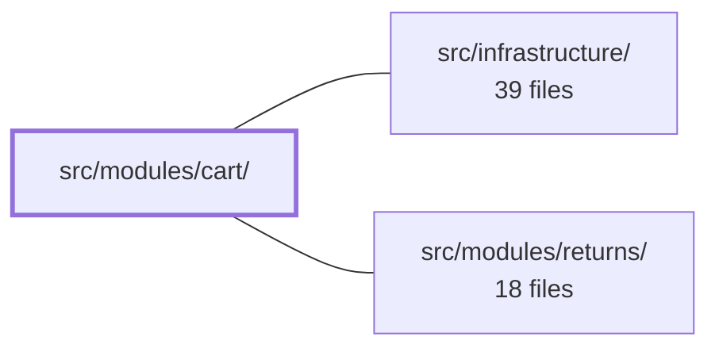

---
tags:
  - 2brain
  - 2brain/module
  - project/boilerplate-vue-frontend
type: module
module: src/modules/cart/
files: 27
updated: 2026-10-02T19:27:08.339048+00:00
---

# src/modules/cart/

## Purpose

The cart module owns the entire shopping-cart experience for a signed-in shopper: adding products to the basket, adjusting line quantities, persisting a transient checkout draft, and driving the "review → ship → pay → confirm" flow on the cart page. It also exposes its single visible surface on the products page (the "Add to Cart" button) and its live count badge in the navigation, all through the app's module-registry contract so no sibling module imports cart internals directly.

## Key parts

- **Entry & manifest** — `index.ts` is the barrel that sibling modules import; `module.ts` registers routes, the nav badge, locale loaders, response schemas, and the `product-actions` slot contribution with the app's `AppModule` registry; `routes.ts` declares the single cart route; `response-schemas.ts` defines the API envelope shapes the module consumes.
- **Domain (pure logic)** — `domain/quantity.ts` holds the zero-guard and clamping rules for line quantities; `domain/checkout-errors.ts` maps a raw checkout rejection into a discriminated-union verdict the view can branch on. Neither file imports Vue, Pinia, or HTTP (enforced by lint).
- **State & persistence** — `store.ts` is the Pinia store that replaces the local cart ref wholesale after every mutating API call, keeping all derived getters consistent with server truth. `composables/use-checkout-draft.ts` persists the browser-only checkout fields (note, payment method, address) to `sessionStorage` keyed per user. `composables/use-line-quantity.ts` debounces stepper clicks into one trailing API call while reflecting the visitor's last click locally.
- **UI** — `views/Cart.vue` renders the full checkout screen (basket, shipping, address, payment, notes, checkout button). `components/AddToCartButton.vue` is the slot-injected button shown on the products page, with its own inline error handling.
- **Tests** — Unit specs cover the store invariants, quantity rules, checkout-error classification, the add-to-cart button, and the checkout-draft composable. E2E specs (`tests/e2e/`) cover the full cart flow, accessibility, a single `cart_item_added` analytics guard, visual regression, and a shell-level resilience sweep.

## How it connects

- **Repository root / app shell** — `module.ts` registers the cart's routes, nav badge, and slot contribution into the shell's `AppModule` registry. The shell merges `routes.ts` into the global router under the cart's base path and renders the `product-actions` slot on the products page. The cart module never imports shell internals; it only publishes data through the registry.
- **`src/infrastructure/`** — Provides the shared HTTP client (axios instance), Pinia setup, Vue Router, and locale tooling that `store.ts`, the composables, and the views consume. The store's actions and the response schemas both depend on this layer for transport and validation.
- **`src/modules/returns/`** — Appears in the dependency graph as a related module. The cart's checkout flow produces the order context that the returns module later reads, but no cart file in this snapshot imports returns code directly; the relationship is mediated through the shared store/registry or the orders module's handoff.

## Where to start

1. **`module.ts`** — Reading this first shows how the cart module plugs into the app: what routes it exposes, what badge it injects, and how the "Add to Cart" button reaches the products page without a cross-module import. It is the single contract you need to understand before touching any internal file.
2. **`store.ts`** — The Pinia store defines the source of truth for every line item, the checkout action, and the derived getters the view and badge both read. Understanding its "fetch-and-replace" pattern (rather than optimistic patching) makes the composable and view code much easier to follow.

## Connected modules

[[boilerplate-vue-frontend_ROOT|/ (repository root)]] · [[boilerplate-vue-frontend_src_infrastructure|src/infrastructure/]] · [[boilerplate-vue-frontend_src_modules_returns|src/modules/returns/]]

## Files
- `src/modules/cart/components/AddToCartButton.vue` — The product-page "add to cart" button, rendered inside the products module's `product-actions` slot via this module's manifest. The products module owns the page and never imports cart code directly; this component is the cart module's only visible surface on that page. A failed request blocks the button in place with an inline alert rather than raising a global toast.
- `src/modules/cart/composables/use-checkout-draft.ts` — Persists the checkout-only fields that exist solely in the browser — the customer's free-text order note, selected payment method, and chosen shipping address — into `sessionStorage` keyed per signed-in user. This gives the draft automatic resilience across page reloads and tab crashes, per-user isolation within a shared tab, and automatic expiry when the tab closes, without any server round-trip.
- `src/modules/cart/composables/use-line-quantity.ts` — Debounces per-product quantity-stepper clicks into a single trailing API call per line, while a local `pending` map immediately reflects the visitor's last click in the UI so the displayed number never lags behind the round trip. Exists to eliminate the race where multiple in-flight `updateCartItem` responses overwrite each other in the store.
- `src/modules/cart/domain/checkout-errors.ts` — Classifies a checkout rejection (the value thrown by `cartStore.checkout()`) into a typed, discriminated-union verdict that the view layer can branch on. The file is pure: it reads the error envelope, narrows wire payloads, and returns a verdict object. It produces no user-facing copy and performs no side effects.
- `src/modules/cart/domain/index.ts` — Barrel (index) file for the cart domain layer. It re-exports the public API of the domain's submodules so callers import from one entry point. The module JSDoc asserts an architectural invariant: this tier contains pure business rules and must not import Vue, Pinia, axios, or any other tier (enforced by lint).
- `src/modules/cart/domain/quantity.ts` — Pure, framework-free rules for computing a cart line's next quantity. It enforces the invariant that a line can never be stepped to zero — reaching zero is a removal operation, not a quantity update — and exists so that clamping logic lives in one testable, side-effect-free location.
- `src/modules/cart/index.ts` — Barrel (public entry point) for the cart module. It defines the single import surface that sibling modules are allowed to consume, preventing them from reaching into internal files directly.
- `src/modules/cart/module.ts` — Module manifest for the cart feature. It registers the cart's routes, navigation entry (with a live count badge and currency total), response schemas, locale loaders, and the `product-actions` slot contribution with the app's `AppModule` registry so the shell can render navigation, load routes, and expose the "Add to Cart" button on the products page without the products module importing cart directly.
- `src/modules/cart/response-schemas.ts`
- `src/modules/cart/routes.ts` — Declares the cart module's single Vue Router route record. The array is consumed by the module registry (`module.ts`) and merged into the app-level router under the module's registered base path.
- `src/modules/cart/store.ts` — Pinia store (`useCartStore`) that owns the authenticated user's shopping cart. Every mutating action fetches the full `CartResponse` from the API and **replaces** the local `cart` ref wholesale, so all derived getters (`cartItems`, `cartSummary`, `cartShipping`, badge values) stay consistent with server truth without client-side patching.
- `src/modules/cart/tests/add-to-cart-button.spec.ts` — Unit tests for the `AddToCartButton` component in isolation — verifying stock gating, guest gating, the add-one-unit contract, stale-cart safety, and the in-flight double-click guard. The hosting product page is deliberately out of scope (lives in the `products` module's tests).
- `src/modules/cart/tests/cart-line-price.spec.ts` — Unit tests for the FA32b cart line-price behavior: verifying that the resolved product's unit price (× quantity) is rendered in the product's currency, and that nothing is rendered before the product lookup completes. Unlike `cart-view.spec.ts`, the product-read path runs for real here—only the `@api.searchProducts` endpoint is mocked—because the price under test is exactly what that lookup resolves.
- `src/modules/cart/tests/cart-view.spec.ts` — Vitest spec that mounts the real `Cart.vue` checkout screen against a real memory-history router and verifies each of the seven documented checkout refusals (from `docs/modules/cart-checkout.md`) produces a distinct, correctly-worded UI response rather than collapsing into a single generic toast. The store's network methods are stubbed so every case controls exactly one rejection.
- `src/modules/cart/tests/checkout-errors.spec.ts` — Vitest suite that verifies `classifyCheckoutError` (from `@/modules/cart/domain`) correctly maps raw checkout API rejections — including malformed or missing `errors` fields that cross a wire boundary untyped — into the verdict objects the cart view consumes. No DOM, Pinia, or HTTP mocks are involved; it is a pure function-in / value-out test.
- `src/modules/cart/tests/e2e/a11y.cy.ts` — Declares the set of cart-module routes that must pass the shared accessibility sweep. It exists as a thin, co-located route list so that removing the cart module automatically removes its a11y coverage—avoiding stale route entries in a central file.
- `src/modules/cart/tests/e2e/analytics.cy.ts` — Cypress e2e spec that proves a single add-to-cart action produces exactly **one** `cart_item_added` row in Umami, guarding against a regression where both the frontend tracker and the backend `POST /cart` handler emit the same-named event independently. It can only run against a live Umami instance (skips under the demo profile) because the bug is invisible from either repo's unit suite.
- `src/modules/cart/tests/e2e/cart.cy.ts` — Cypress end-to-end test suite for the cart page, covering the full user flow: viewing an empty cart, incrementing/decrementing quantities, removing individual items, clearing the cart (with confirm and decline paths), and completing a checkout that redirects to the new order.
- `src/modules/cart/tests/e2e/cart.visual.cy.ts`
- `src/modules/cart/tests/e2e/resilience.cy.ts` — Cart-module contribution to the shell's end-to-end resilience sweep. Verifies that the `/en/cart` route renders without unexpected console errors and fits the viewport — both when the cart is empty and when it holds a single line item. It deliberately avoids asserting on specific values (prices, quantities beyond item count) so it catches rendering/breakage that value-focused specs would miss.
- `src/modules/cart/tests/module-badge.spec.ts` — Tests the cart badge's session watch (defined in `cart/module.ts`): verifying that the checkout draft is cleared when a signed-in visitor logs out, and that it survives a page reload (which momentarily drops the session before restoring it).
- `src/modules/cart/tests/quantity.spec.ts`
- `src/modules/cart/tests/routes.spec.ts` — Verifies that every cart route explicitly declares a `meta.access` value. This matters because a route that silently loses its access declaration becomes indistinguishable from a public one and no other test in the suite would flag the regression. This spec proves the declarations exist; the router spec (elsewhere) proves enforcement is wired up.
- `src/modules/cart/tests/store.spec.ts` — Unit tests for the cart Pinia store (`useCartStore`). The file guards three invariants called out in the module docblock: (1) `clearCart` and `removeCartItem` hit distinct `DELETE` URLs rather than one overloaded endpoint, (2) summary getters must not throw when no cart has been fetched yet, and (3) `checkout` must surface both success and failure envelopes so a backend rejection is not silently treated as an abandoned funnel.
- `src/modules/cart/tests/use-checkout-draft.spec.ts` — Vitest spec for the `use-checkout-draft` composable. It verifies that checkout state (customer note, payment method, chosen address) written to `sessionStorage` survives a page reload, stays isolated per user, and degrades to an empty draft when the stored value is corrupt—so a customer never sees another user's data or a crashed checkout page.
- `src/modules/cart/tests/use-line-quantity.spec.ts` — Test suite for the `useLineQuantity` composable. It validates the debounce that prevents a race where rapid stepper clicks fire multiple cart-update requests and the store ends up with whichever response arrives last. Every assertion is framed against that failure mode ("one request, for the final number") rather than against the debounce mechanism in isolation, and it also covers the two ways a naive debounce silently loses data: swallowing a click made during an in-flight request and cancelling a pending step on unmount.
- `src/modules/cart/views/Cart.vue` — The cart page view. Renders the shopper's basket lines with a debounced quantity stepper, a shipping-method picker, an address picker (billing and/or shipping), a payment-method selector, free-text notes, and the checkout button. It orchestrates the full "review basket → pick shipping → pick address → pay" flow before handing off to the orders module.

---
[[boilerplate-vue-frontend_INDEX|← boilerplate-vue-frontend index]]
