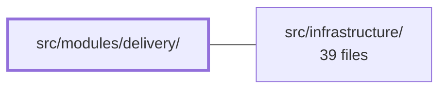

---
tags:
  - 2brain
  - 2brain/module
  - project/boilerplate-vue-frontend
type: module
module: src/modules/delivery/
files: 10
updated: 2026-10-02T19:27:23.698939+00:00
---

# src/modules/delivery/

## Purpose

The delivery module owns all frontend logic and UI for the shipping lifecycle of an order—selecting a shipping method, starting fulfilment, shipping, and marking delivery. It exposes a Pinia store that talks to the backend, a set of Vue components that render the order-page shipping panel, and the response schemas that shape the data flowing between the two.

## Key parts

- **Data layer** — `store.ts` defines the Pinia store (`useDeliveryStore`) with actions `fetchMethods`, `fetchShipmentForOrder`, `start`, `fulfill`, `ship`, and `deliver`; `response-schemas.ts` declares the expected API response shapes consumed by those actions.
- **Components** — `components/ShipmentPanel.vue` renders the five-state shipping panel (not started, digital awaiting fulfilment, not yet shippable, ready to ship, in transit/arrived) and the start/fulfill/ship/deliver controls; `components/ShippingSelector.vue` lets the user pick a shipping method; `components/ShippingMethodName.vue` displays the chosen method's label.
- **Module plumbing** — `module.ts` registers the module with the app; `index.ts` is the public barrel export.
- **Tests** — `tests/shipment-panel.spec.ts`, `tests/shipping-selector.spec.ts`, and `tests/store.spec.ts` cover component rendering branches, selector behaviour, and store action contracts (including 404-vs-other-error distinction) respectively.

## How it connects

- **`src/infrastructure/`** — The store's actions (`fetchMethods`, `start`, `ship`, etc.) rely on the infrastructure layer for HTTP transport and base URL configuration. The `response-schemas.ts` types define the contract that the infrastructure client is expected to satisfy.
- **Repository root (`/`)** — `module.ts` plugs the delivery module into the application's module registration pipeline defined at the project level, making the store and components available to the rest of the app.

## Where to start

Read `store.ts` first: it is the single source of truth for the five delivery actions and the 404 handling rule, and every component ultimately calls into it. Then open `components/ShipmentPanel.vue` to see how the parent's `canStart` / `canFulfill` / `canShip` / `canDeliver` props drive the five visual states and gate the write buttons—this makes the component's contract immediately clear.

## Connected modules

[[boilerplate-vue-frontend_ROOT|/ (repository root)]] · [[boilerplate-vue-frontend_src_infrastructure|src/infrastructure/]]

## Files
- `src/modules/delivery/components/ShipmentPanel.vue` — Vue 3 single-file component that renders the shipping corner of an order page. It displays one of five states (not started, digital awaiting fulfilment, not yet shippable, ready to ship, in transit/arrived) and exposes the write controls (start, fulfill, ship, deliver) for that single order. Every gate is read from the order's own `actions` props supplied by the parent — the component never re-derives permission or status locally.
- `src/modules/delivery/components/ShippingMethodName.vue`
- `src/modules/delivery/components/ShippingSelector.vue`
- `src/modules/delivery/index.ts`
- `src/modules/delivery/module.ts`
- `src/modules/delivery/response-schemas.ts`
- `src/modules/delivery/store.ts`
- `src/modules/delivery/tests/shipment-panel.spec.ts` — Unit test suite for `ShipmentPanel.vue`, the ship/deliver action panel on the order page. It mounts the real component (with Vuetify and i18n) while stubbing the delivery store's fetch actions, then verifies which of the four template branches renders based on the `canStart`/`canFulfill`/`canShip`/`canDeliver`/`override` props (FA36/B3). It deliberately does **not** test the store's `start`/`ship`/`deliver` actions themselves (covered by `delivery/tests/store.spec.ts`) nor the server-side eligibility rules behind those props (covered by the `orders` suites).
- `src/modules/delivery/tests/shipping-selector.spec.ts`
- `src/modules/delivery/tests/store.spec.ts` — Unit tests for the delivery Pinia store (`useDeliveryStore`). Verifies that each store action (`fetchMethods`, `fetchShipmentForOrder`, `start`, `fulfill`, `ship`, `deliver`) mirrors the API contract, correctly distinguishes a 404 ("nothing shipped yet") from any other failure (which must reject), and shapes request payloads as the schema expects.

---
[[boilerplate-vue-frontend_INDEX|← boilerplate-vue-frontend index]]
