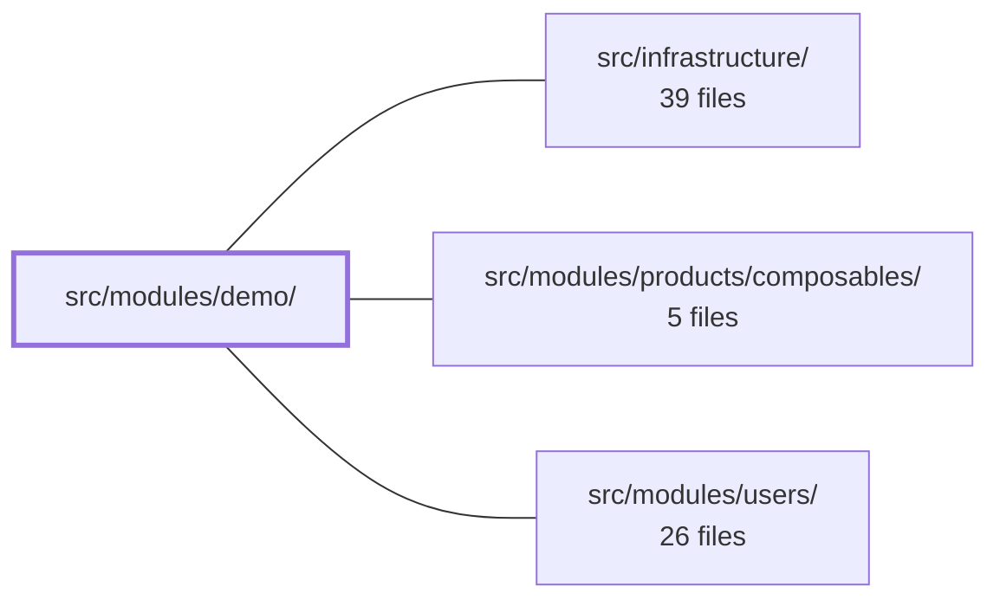

---
tags:
  - 2brain
  - 2brain/module
  - project/boilerplate-vue-frontend
type: module
module: src/modules/demo/
files: 12
updated: 2026-10-02T19:27:43.105649+00:00
---

# src/modules/demo/

## Purpose

`src/modules/demo/` is a self-contained example module that exercises the codebase's core architectural patterns—Vue Router navigation guards, Pinia stores, `provide`/`inject`, and module-level route registration—in a single, low-risk surface. It doubles as a living reference for teams adding new feature modules and as a regression target: the surrounding test suite locks in the behavioral contracts (guard return values, i18n resilience, store availability inside guards) that production modules are expected to honor.

## Key parts

- **`module.ts`** — Entry point that wires the module together (routes, store, provider) and makes it registerable by the application shell.
- **`routes.ts` + `guards.ts`** — Route definitions and a `beforeEnter` guard. The guard is the module's primary architectural lesson: it must return `undefined` on success, must not throw when i18n keys are missing, and may read Pinia stores directly without mocking.
- **`store.ts`** — A small Pinia store scoped to the module, demonstrating the per-module store pattern.
- **`provided.ts` + `components/ProvidedVariableCard.vue`** — A `provide`/`inject` pair showing how module-level data is made available to descendant components.
- **`views/Playground.vue`** — The single page component that ties the above pieces together for visual inspection.
- **`tests/`** — Co-located unit specs (`guards`, `store`, `routes`, `provided`) and an end-to-end accessibility sweep (`e2e/a11y.cy.ts`) registered via the shared `sweepA11y` helper. Removing this directory also removes the a11y coverage, enforced by a cross-cutting spec at the repository root.

## How it connects

- **`/` (repository root)** — The root provides the cross-cutting assertion that every routed module must contain an `e2e/a11y.cy.ts` file, which this module satisfies. Global test setup and shared helpers also originate here.
- **`src/infrastructure/`** — Shared, module-agnostic utilities (likely i18n plumbing, base router configuration, or the `sweepA11y` helper itself) that the demo module consumes so its tests and runtime code stay thin.
- **`src/modules/products/composables/`** — The demo module imports or references product composables to demonstrate how a feature module can depend on another module's public API rather than reaching into its internals.
- **`src/modules/users/`** — Similarly, the demo module touches the users module to illustrate inter-module communication (store reads, composable usage) in a safe, disposable context.

## Where to start

Read **`guards.ts`** first (it is only a handful of lines) and then **`module.ts`** to see how routes, store, and provider are composed. Together they show the full lifecycle of a navigation in this codebase—guard → store access → route render—without needing to understand the rest of the application.

## Connected modules

[[boilerplate-vue-frontend_ROOT|/ (repository root)]] · [[boilerplate-vue-frontend_src_infrastructure|src/infrastructure/]] · [[boilerplate-vue-frontend_src_modules_products_composables|src/modules/products/composables/]] · [[boilerplate-vue-frontend_src_modules_users|src/modules/users/]]

## Files
- `src/modules/demo/components/ProvidedVariableCard.vue`
- `src/modules/demo/guards.ts`
- `src/modules/demo/module.ts`
- `src/modules/demo/provided.ts`
- `src/modules/demo/routes.ts`
- `src/modules/demo/store.ts`
- `src/modules/demo/tests/e2e/a11y.cy.ts` — Registers the demo module's accessibility sweep routes with the shared `sweepA11y` helper. Co-located inside the module tree so that removing the demo module automatically removes its a11y test coverage (a cross-cutting spec asserts every routed module has one of these files).
- `src/modules/demo/tests/guards.spec.ts` — Unit tests for the demo `beforeEnter` guard (`@/modules/demo/guards.ts`). The suite verifies three behavioral contracts: the guard returns `undefined` (not `false` or an object) so Vue Router 4 allows the navigation, the guard does not throw when i18n translations are absent, and Pinia stores are fully functional inside the guard without any mocking.
- `src/modules/demo/tests/provided.spec.ts`
- `src/modules/demo/tests/routes.spec.ts`
- `src/modules/demo/tests/store.spec.ts`
- `src/modules/demo/views/Playground.vue`

---
[[boilerplate-vue-frontend_INDEX|← boilerplate-vue-frontend index]]
