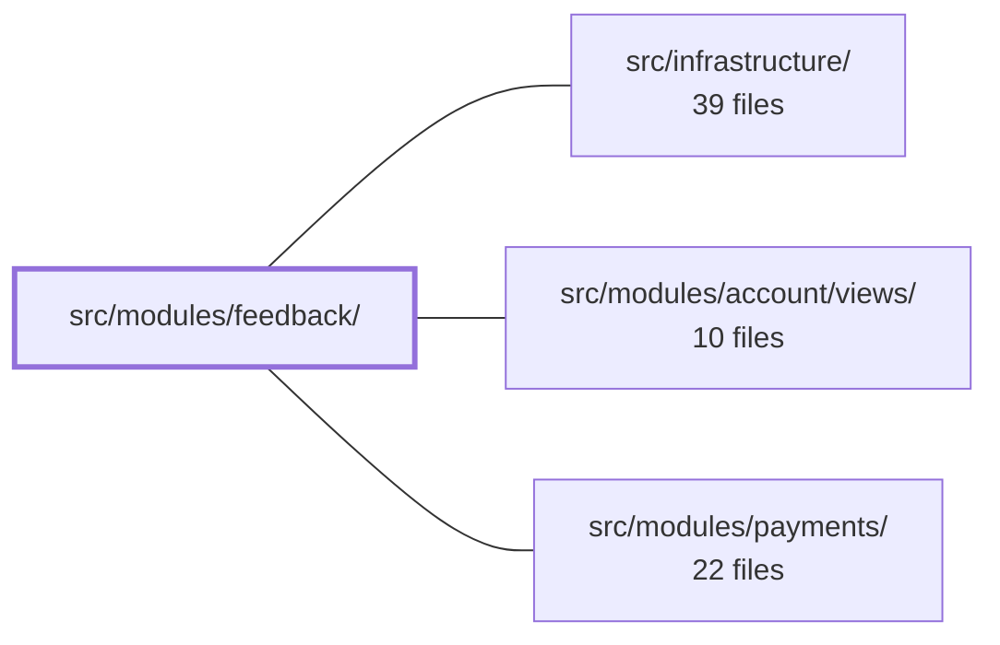

---
tags:
  - 2brain
  - 2brain/module
  - project/boilerplate-vue-frontend
type: module
module: src/modules/feedback/
files: 11
updated: 2026-10-02T19:28:08.637962+00:00
---

# src/modules/feedback/

## Purpose

This module owns the end-to-end feedback flow: a public contact form for visitors to submit a ticket, and an admin inbox where operators triage, annotate, and (under GDPR) erase those submissions. It encapsulates the API contract, client-side state, routing, and both user-facing views in a single self-contained directory.

## Key parts

- **Core plumbing** — `module.ts` (entry/registration), `routes.ts` (path definitions for both the public and admin surfaces), `response-schemas.ts` (Zod schemas that type the API payloads), and `store.ts` (the `useFeedbackStore` Pinia store handling inbox search, page-total tracking, and per-row write/evict operations).
- **Views** — `views/Contact.vue` (unauthenticated contact form with Zod validation, a honeypot field, and a `HumanCheck` token on every submit) and `views/FeedbackInbox.vue` (authenticated admin view: paginated, filterable, sortable list of `FeedbackRequest` records with status transitions, internal-note editing, and a GDPR erasure path).
- **Tests** — `tests/store.spec.ts` and `tests/routes.spec.ts` cover the store and routing in isolation (store tested against a transport-mocked `orvalMutator`). `tests/e2e/` holds the Cypress functional suite (`feedback.cy.ts`), a visual-regression pass (`feedback.visual.cy.ts`), and an accessibility sweep (`a11y.cy.ts`) that feeds the module's routes to the shared `sweepA11y` helper.

## How it connects

- **`src/infrastructure/`** — supplies the cross-cutting pieces the module consumes: the generated HTTP client (`orvalMutator`) that the store calls, the `HumanCheck` anti-bot component used by the contact form, and the shared `sweepA11y` e2e helper. The module's tests rely on this infrastructure being available rather than re-implementing transport or a11y tooling.
- **`src/modules/account/views/`** — the admin inbox (`FeedbackInbox.vue`) sits behind authentication; the account module provides the login/session shell and route guards that gate access to the operator surface.
- **`src/modules/payments/`** — peer feature module that follows the same internal structure (store + views + schemas) and shares the same infrastructure utilities; no direct import relationship is implied beyond that common pattern.

## Where to start

Read `store.ts` first — it is the single source of truth for how feedback data flows in and out of the client, and its spec (`tests/store.spec.ts`) documents the exact API calls and caching semantics. Then open `views/FeedbackInbox.vue` to see how the admin consumes that store, which makes the data model, status transitions, and the GDPR erasure sequence concrete before you touch the public form.

## Connected modules

[[boilerplate-vue-frontend_ROOT|/ (repository root)]] · [[boilerplate-vue-frontend_src_infrastructure|src/infrastructure/]] · [[boilerplate-vue-frontend_src_modules_account_views|src/modules/account/views/]] · [[boilerplate-vue-frontend_src_modules_payments|src/modules/payments/]]

## Files
- `src/modules/feedback/module.ts`
- `src/modules/feedback/response-schemas.ts`
- `src/modules/feedback/routes.ts`
- `src/modules/feedback/store.ts`
- `src/modules/feedback/tests/e2e/a11y.cy.ts` — Cypress a11y sweep route list for the feedback module. It hands the module's routable pages to the shared `sweepA11y` helper so accessibility checks run against both the public and admin surfaces. The file is co-located with the module so that deleting the module automatically removes its a11y coverage.
- `src/modules/feedback/tests/e2e/feedback.cy.ts`
- `src/modules/feedback/tests/e2e/feedback.visual.cy.ts`
- `src/modules/feedback/tests/routes.spec.ts`
- `src/modules/feedback/tests/store.spec.ts` — Vitest spec for `useFeedbackStore`. It exercises the store against a transport-mocked `orvalMutator` (router keyed on `METHOD /url`) so the generated HTTP client and the Pinia store remain real. It pins the inbox reading path (`POST /feedback/search`, never the browser-cached GET), server-sourced `pageTotal`, and write/evict semantics on the cached row.
- `src/modules/feedback/views/Contact.vue` — Public contact form available without authentication. It collects name, email, subject, and message from a visitor, validates them client-side against a Zod schema, and submits the payload through the feedback store. Anti-bot protection is layered via a hidden honeypot field and a `HumanCheck` challenge token attached to every request.
- `src/modules/feedback/views/FeedbackInbox.vue` — Admin-facing inbox for public feedback tickets. Renders a paginated, filterable, sortable list of `FeedbackRequest` records and exposes per-row actions (status transition, internal-notes edit, delete). It is the operator view for triaging contact-form submissions, including the GDPR erasure path (search → confirm → delete).

---
[[boilerplate-vue-frontend_INDEX|← boilerplate-vue-frontend index]]
