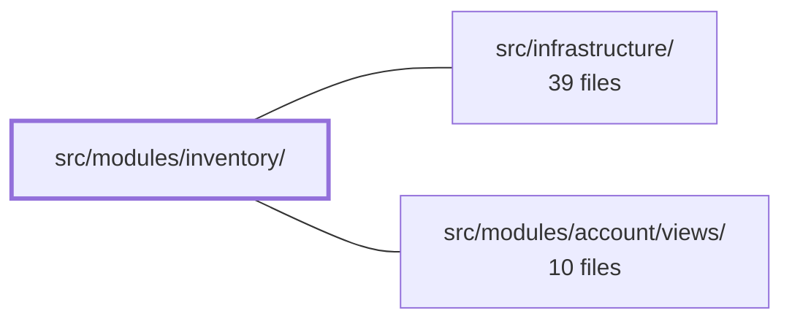

---
tags:
  - 2brain
  - 2brain/module
  - project/boilerplate-vue-frontend
type: module
module: src/modules/inventory/
files: 16
updated: 2026-10-02T19:28:28.916457+00:00
---

# src/modules/inventory/

## Purpose

The inventory module manages stock levels and records every stock transition—receipts, adjustments (including shrinkage), and reservation sweeps—as an auditable ledger. It exposes the write operations (receive, adjust, sweep), the read/audit surface (paginated movement history, current on-hand and reserved levels), and the shared product-picking UX that other parts of the inventory UI consume.

## Key parts

- **Module wiring** — `module.ts`, `routes.ts`, `response-schemas.ts`: route declarations, lazy-loaded view registration, and Zod schemas that shape every API response before it reaches the store.
- **State & data layer** — `store.ts`: a Pinia store (`useInventoryStore`) that owns all fetch/write actions (`fetchMovements`, `fetchLevels`, `receive`, `adjust`, `sweep`), manages query parameters, reload ordering, and idempotency keys.
- **UI components** — `MovementLedger.vue` (paginated, filterable audit table + sweep trigger), `StockBoard.vue` (current stock-level view), `StockMovementForm.vue` (dual-mode form: receipt vs. adjust, instantiated separately per mode to prevent accidental sign flips).
- **Shared composable** — `use-product-picker.ts`: debounced search-as-you-type product list and a `pin()` helper used by both `StockMovementForm` and `MovementLedger` (replacing former per-form caches, FE_PARITY_0924 B2).
- **Views** — `views/InventoryLedger.vue`: the page-level container that composes the components above.
- **Tests** — unit suites (`store.spec.ts`, `stock-movement-form.spec.ts`, `use-product-picker.spec.ts`, `routes.spec.ts`, `reason-labels-i18n.spec.ts`), e2e visual snapshots, and a co-located a11y registration file (`a11y.cy.ts`) that plugs into the cross-cutting a11y coverage guard.

## How it connects

- **`src/infrastructure/`** — provides the HTTP transport layer (the `orvalMutator` seam) that the store's actions call through. All outbound requests and response parsing in this module flow via that shared infrastructure.
- **`/` (repository root)** — supplies project-wide tooling (Vitest, Cypress, build config) and the shared a11y utility that `tests/e2e/a11y.cy.ts` delegates its route sweeping to.
- **`src/modules/account/views/`** — appears as a downstream consumer in the dependency graph; inventory data surfaced here likely feeds account-level dashboards or permission-gated views (no further detail is documented in this module).

## Where to start

1. **`store.ts`** — reading the five action methods and their response shaping gives you the complete API surface and data flow in one file.
2. **`components/StockMovementForm.vue`** — shows the primary write interaction and the deliberate receipt/adjust mode split, which clarifies the validation rules and the "why" behind the dual-instantiation pattern that the tests encode.

## Connected modules

[[boilerplate-vue-frontend_ROOT|/ (repository root)]] · [[boilerplate-vue-frontend_src_infrastructure|src/infrastructure/]] · [[boilerplate-vue-frontend_src_modules_account_views|src/modules/account/views/]]

## Files
- `src/modules/inventory/components/MovementLedger.vue` — Renders the inventory movement ledger: a paginated, filterable table of stock transitions (newest-first) showing on-hand and reserved deltas per event, plus the "sweep" action that expires stale reservation holds. It exists as the read/audit surface for the inventory module's write history.
- `src/modules/inventory/components/StockBoard.vue`
- `src/modules/inventory/components/StockMovementForm.vue` — A reusable stock-movement form that handles both receipts (adding units) and adjustments (signed deltas, including shrinkage). It is instantiated **twice** — once per mode — rather than as a single form with a runtime sign toggle, so a mis-click cannot silently convert a delivery into a correction (or vice versa).
- `src/modules/inventory/composables/use-product-picker.ts`
- `src/modules/inventory/module.ts`
- `src/modules/inventory/response-schemas.ts`
- `src/modules/inventory/routes.ts`
- `src/modules/inventory/store.ts`
- `src/modules/inventory/tests/e2e/a11y.cy.ts` — Co-located accessibility (a11y) route registration for the inventory module. It declares *which* routes to audit and delegates the actual sweeping to a shared utility. Co-location is intentional: deleting the module removes its a11y coverage atomically, and `tests/cross-cutting/a11y-coverage.spec.ts` guards that no routed module loses its entry.
- `src/modules/inventory/tests/e2e/inventory.visual.cy.ts`
- `src/modules/inventory/tests/reason-labels-i18n.spec.ts` — Guarantees that every value in the `StockMovementReason` enum has a corresponding `inventory-page.reason-*` i18n label in both supported locales. Without this, `MovementLedger.vue`'s filter dropdown and ledger rows would render the raw enum key instead of a human-readable word (a regression that previously shipped with `restock`).
- `src/modules/inventory/tests/routes.spec.ts`
- `src/modules/inventory/tests/stock-movement-form.spec.ts` — Vitest suite that mounts the real `StockMovementForm` component twice — once per `mode` prop (`receipt`, `adjust`) — to prove the two validation branches diverge as designed: receipt rejects non-positive and fractional quantities, adjust rejects zero and fractional deltas but passes a negative delta through signed.
- `src/modules/inventory/tests/store.spec.ts` — Unit test suite for the inventory Pinia store (`useInventoryStore`). It mocks the HTTP transport at the `orvalMutator` seam, feeds canned API envelopes back through the real response-parsing pipeline, and asserts the store's data-shaping, query-passing, reload-order, and idempotency-key behaviour for every action (`fetchMovements`, `fetchLevels`, `receive`, `adjust`, `sweep`).
- `src/modules/inventory/tests/use-product-picker.spec.ts` — Unit tests for the `useProductPicker` composable (and its `useProductPickerPin` helper), covering the shared search-as-you-type list and `pin()` behaviour that `StockMovementForm` and `MovementLedger` now use in place of their former per-form product caches (FE_PARITY_0924 B2). Only `orvalMutator` is mocked so the actual request body shape built by `searchProducts` is exercised.
- `src/modules/inventory/views/InventoryLedger.vue`

---
[[boilerplate-vue-frontend_INDEX|← boilerplate-vue-frontend index]]
