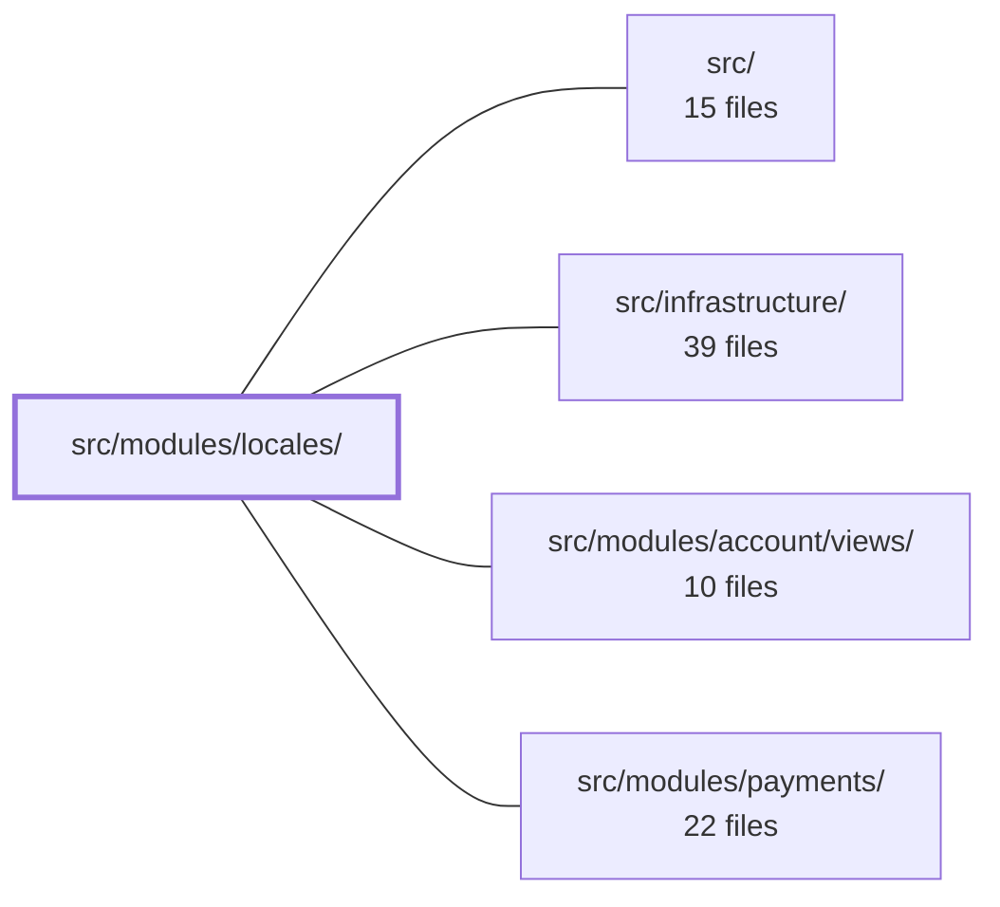

---
tags:
  - 2brain
  - 2brain/module
  - project/boilerplate-vue-frontend
type: module
module: src/modules/locales/
files: 28
updated: 2026-10-02T19:28:55.992811+00:00
---

# src/modules/locales/

## Purpose

The locales module is the application's translation-management surface: it lets admins maintain the language manifest, edit individual translation entries per language, browse a full i18n dictionary board (every key × every language), import/export locale data, and edit translations attached to specific entities (e.g. products). It encapsulates the two-shape data model (flat dotted-key rows for the API vs. nested objects for vue-i18n) behind a Pinia store and a pair of composables so that views never touch raw transport directly.

## Key parts

- **Views** — Four route-level screens:
  - `views/LocalesList.vue` — the "languages board"; thin CRUD over the `LocaleCapability` manifest.
  - `views/LocaleEntries.vue` — per-language entry list with search, pagination, inline edit, and bulk import.
  - `views/LocalesDictionary.vue` — the full dictionary grid (keys × languages) with add-key and create-language flows.
  - `views/EntityTranslations.vue` — tabbed editor for entity-scoped translations (currently products).

- **Composables** — `composables/use-dictionary-aggregation.ts` builds the board's unified read model from three sources (stored entries, API baseline, bundled baseline) plus pending keys; `composables/use-dictionary-cell-editor.ts` owns the per-cell draft/save/clear lifecycle and transient feedback.

- **Dialog components** — `components/EntryFormDialog.vue` (single-entry create), `components/LanguageFormDialog.vue` (language create/edit with dual Zod schemas), and `components/EntriesImportDialog.vue` (file-upload or paste import that flattens nested JSON into `LocaleEntryInput` rows). All three emit results upward; the parent owns persistence and error display.

- **Store & domain** — `store.ts` (Pinia store for the language manifest and paginated entries, delegating HTTP to `useStructureCrudApi`); `dictionaries.ts` (pure flat↔nested conversion functions); `domain/deactivate-then-delete.ts` (delete-after-deactivate workflow); `schemas.ts` / `response-schemas.ts` (Zod validation and API response typing).

- **Tests** — Co-located unit specs (`tests/*.spec.ts`) for the store, composables, dialogs, and conversion helpers, plus Cypress E2E suites (`tests/e2e/`) covering entity translations, visual regression, and an accessibility sweep hook.

## How it connects

- **`src/infrastructure/`** — The store and dialogs rely on shared infrastructure: the `useStructureCrudApi` toolkit for HTTP CRUD, the `orvalMutator` transport layer, and the global `useDialogStore` for confirmation flows. Permission gates (`translations.read`, `translations.update`) reference the same authorization primitives used across the app.
- **`src/modules/account/views/`** — The locales views are gated on account-level permissions, meaning the account module's authorization state determines whether a user can read or write translations.
- **Repository root / `src/`** — Standard project layout; `routes.ts` and `module.ts` register this module's navigation entries and plugin wiring into the broader app shell.

## Where to start

1. **`store.ts`** — Reading the Pinia store first gives you the data model (language manifest + entry rows), the HTTP verbs the module issues, and the `refreshRunningLocale` side-effect that ties writes to live updates. Everything else in the module is a presentation or validation layer around this store.
2. **`dictionaries.ts`** — A short, side-effect-free file that shows the exact shape translation between the API's flat rows and vue-i18n's nested objects. Understanding this round-trip makes the composables and the import dialog much easier to follow.

## Connected modules

[[boilerplate-vue-frontend_ROOT|/ (repository root)]] · [[boilerplate-vue-frontend_src|src/]] · [[boilerplate-vue-frontend_src_infrastructure|src/infrastructure/]] · [[boilerplate-vue-frontend_src_modules_account_views|src/modules/account/views/]] · [[boilerplate-vue-frontend_src_modules_payments|src/modules/payments/]]

## Files
- `src/modules/locales/components/EntriesImportDialog.vue` — A self-contained dialog that accepts a locale-entry dictionary (as nested JSON via file upload or paste), parses and flattens it into flat `LocaleEntryInput` rows, and emits the result upward on submit. It owns no persistence or API calls — the parent handles the actual write and renders transport/batch errors through the `error` slot.
- `src/modules/locales/components/EntryFormDialog.vue` — A modal dialog for **adding** a single locale entry (tenant + key + value). It collects and schema-validates the three fields, then emits the clean result upward; all persistence, error display, and store access live in the parent. Editing existing entries happens inline in the table and never passes through this component.
- `src/modules/locales/components/LanguageFormDialog.vue` — A create-or-edit dialog for a single language entry in the locales module. It swaps between two Zod schemas (create vs. edit) based on whether a `language` prop is supplied, validates the form via `useStructureFormValidation`, and emits the saved fields upward. All open/close state and server-side save logic are owned by the parent.
- `src/modules/locales/composables/use-dictionary-aggregation.ts` — Provides the dictionary board's single read model for per-cell state. It merges three sources — stored locale entries, the API's deployed baseline, and this build's bundled baseline — plus page-local pending keys, into a unified set of lookups (`entryAt`, `baselineAt`, `cellState`) so that the board and the cell editor never read the raw sources directly.
- `src/modules/locales/composables/use-dictionary-cell-editor.ts` — Composable that owns the editing lifecycle of a single cell on the dictionary board. It keeps a local draft per cell (so a blur can distinguish "user typed something" from "user just clicked through"), routes save/clear/enter actions into the locales store, and exposes transient per-cell feedback (saved check-mark, inline error) without touching global toast state for routine failures.
- `src/modules/locales/dictionaries.ts` — Pure conversion functions that translate between the two shapes a dictionary travels in: the flat dotted-key rows the entries API persists, and the nested object/array structure vue-i18n consumes. The file is side-effect-free by design so the round-trip logic can be unit-tested without a browser.
- `src/modules/locales/domain/deactivate-then-delete.ts`
- `src/modules/locales/module.ts`
- `src/modules/locales/response-schemas.ts`
- `src/modules/locales/routes.ts`
- `src/modules/locales/schemas.ts`
- `src/modules/locales/store.ts` — Pinia store that powers the translation-admin screen. It manages two distinct resources behind one `defineStore`: the language **capabilities manifest** (which languages exist, their names, direction, visibility, default/fallback) and one language's **translation entries** (paginated CRUD rows). The manifest half always refetches after a write because the API returns differently-shaped records for reads (`LocaleCapability`) vs. writes (`Language`); the entries half delegates to the shared `useStructureCrudApi` toolkit.
- `src/modules/locales/tests/deactivate-then-delete.spec.ts`
- `src/modules/locales/tests/dictionaries.spec.ts`
- `src/modules/locales/tests/e2e/a11y.cy.ts` — Declares the locales module's routes (and one dialog state) to the shared `sweepA11y` runner, which visits each and asserts against axe-core. This is the module-level hook that plugs locales into the cross-cutting accessibility sweep.
- `src/modules/locales/tests/e2e/entity-translations.cy.ts`
- `src/modules/locales/tests/e2e/locales.visual.cy.ts`
- `src/modules/locales/tests/entries-import-dialog.spec.ts` — Vitest spec for `EntriesImportDialog.vue`. Verifies the two import paths (merge vs. replace) by exercising the component's own confirmation gate — `useDialogStore().answer()` — rather than Vuetify's overlay. The dialog shell is stubbed so the component's script runs synchronously in the test DOM.
- `src/modules/locales/tests/form-dialogs.spec.ts` — Unit tests verifying two behavioral contracts of the locale form dialogs (`EntryFormDialog`, `LanguageFormDialog`): the submit button is disabled while the parent's write is in flight (preventing duplicate submits), and a server 422 refusal that names a specific field is surfaced on that field via the dialog's `applyServerErrors` method.
- `src/modules/locales/tests/routes.spec.ts`
- `src/modules/locales/tests/schemas.spec.ts`
- `src/modules/locales/tests/store.spec.ts` — Unit tests for the locales Pinia store. Rather than asserting on rendered UI, the suite mocks the `orvalMutator` HTTP transport and asserts on the exact `METHOD path` sequence the store issues plus the shape of bodies it sends. This pins transport-level contracts (URLs, HTTP verbs, body fields) without a network layer.
- `src/modules/locales/tests/use-dictionary-aggregation.spec.ts`
- `src/modules/locales/tests/use-dictionary-cell-editor.spec.ts`
- `src/modules/locales/views/EntityTranslations.vue` — Generic translation editing screen for any entity registered in the `translatables` registry (currently only `product`). Renders one tab per language the entity has a row for, lets the visitor add/remove language tabs, and submits all open and removed locales in a single merging `PATCH` write. Gated on `translations.read` (route entry) and `translations.update` (save button).
- `src/modules/locales/views/LocaleEntries.vue` — Route view for `/locales/:tag` that lists, searches, and edits one language's translation entries with pagination. Every successful write (add, inline edit, delete, import) triggers `refreshRunningLocale` so the currently-running app picks up the change without a reload.
- `src/modules/locales/views/LocalesDictionary.vue` — Route view (`LocalesDictionaryPage`) that renders the full dictionary board: every i18n key as a row, every language as a column. It owns client-side text filtering, pagination, and the "add key" / "create language" flows, delegating the three-source data model (entries, API baseline, bundled baseline) to `useDictionaryAggregation` and per-cell editing to `useDictionaryCellEditor`.
- `src/modules/locales/views/LocalesList.vue` — Route view for the "languages board" — a thin CRUD screen over the `LocaleCapability` manifest. It lists every language a deployment offers (both static and dynamic tiers), lets an admin create, edit, and delete languages, and toggles their active state. The component itself holds no data; all state and writes flow through the Pinia locales store.

---
[[boilerplate-vue-frontend_INDEX|← boilerplate-vue-frontend index]]
