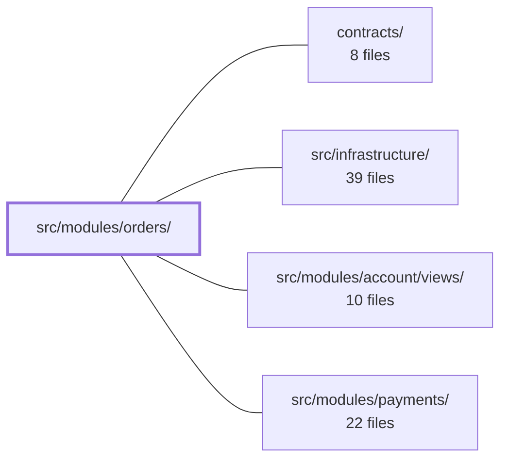

---
tags:
  - 2brain
  - 2brain/module
  - project/boilerplate-vue-frontend
type: module
module: src/modules/orders/
files: 25
updated: 2026-10-02T19:29:30.840281+00:00
---

# src/modules/orders/

## Purpose

The orders module owns every screen and state transition around a placed purchase: the paginated list, the shared detail page (customer + operator), the operator edit page with status actions (cancel, refund, status-override), and the pure domain rule that detects products silently dropped during a reorder. It is role-gated throughout—customers see their own orders and invoices, operators see the full ledger and correction endpoints.

## Key parts

- **Views** — `OrdersList.vue` (paginated list with per-row actions and the payments `OrderReferenceSearch` widget), `Order.vue` (shared detail page with payment/shipment/returns panels and cancel/reorder/invoice actions), `OrderEdit.vue` (operator edit form + status actions).
- **Domain layer** (`domain/`) — Pure, framework-free rules. `reorder.ts` exports `leftOutByReorder`, which diffs a past order's lines against the re-created cart to report what the server silently dropped. `index.ts` is the single import entry point and states the layer's no-Vue/Pinia/axios contract.
- **Store & composable** — `store.ts` (Pinia store: fetch, cancel, override-status, restore, delete) and `use-order-actions-refetch.ts` (forces a re-fetch when a cached order lacks the server-provided `actions` array).
- **Schemas & routes** — `schemas.ts` / `response-schemas.ts` (Zod validation), `routes.ts` (route table consumed by the global router), `module.ts` (registration hook so the shared router and a11y/resilience sweeps discover this module's routes).
- **Tests** — Unit specs for the store, domain function, and composables; page-level integration specs for each view; E2E specs for visual regression, resilience, and accessibility.

## How it connects

- **`src/modules/payments/`** — `OrdersList.vue` embeds the payments module's `OrderReferenceSearch` widget so an operator can jump to an order by reference; `Order.vue` renders payment, transfer-instruction, and credit-note panels that originate in the payments module.
- **`src/infrastructure/`** — Provides the shared API client (orval), global router, Pinia, Vuetify, vue-i18n, and the `sweepA11y` / resilience-sweep helpers that the module's test files consume.
- **`contracts/`** — Supplies the generated API client and Zod response types that `store.ts` and `response-schemas.ts` depend on at the transport boundary.
- **`src/modules/account/views/`** — The signed-in user (role, identity) that gates which actions and columns are visible in the orders views.
- **Repository root** — Project-wide configuration (Vitest, Cypress, orval codegen) that the module's test and build files rely on.

## Where to start

1. **`views/OrdersList.vue`** — Reading this single file shows the store API surface, the role-based action gating, the DataTable wiring, and the cross-module `OrderReferenceSearch` integration in one pass.
2. **`domain/reorder.ts`** (≈ 40 lines) — A compact, pure function that makes the module's domain-layer contract (no framework imports, plain in/out) immediately concrete, and its spec (`tests/reorder-domain.spec.ts`) demonstrates the testing style for that layer.

## Connected modules

[[boilerplate-vue-frontend_ROOT|/ (repository root)]] · [[boilerplate-vue-frontend_contracts|contracts/]] · [[boilerplate-vue-frontend_src_infrastructure|src/infrastructure/]] · [[boilerplate-vue-frontend_src_modules_account_views|src/modules/account/views/]] · [[boilerplate-vue-frontend_src_modules_payments|src/modules/payments/]]

## Files
- `src/modules/orders/composables/use-order-actions-refetch.ts`
- `src/modules/orders/domain/index.ts` — Barrel file that re-exports the public surface of the orders domain layer. It exists so consumers import from a single entry point (`./domain`) rather than reaching into individual files, and so the module's doc comment can state the layer's contract (pure rules, no Vue/Pinia/axios) in one place.
- `src/modules/orders/domain/reorder.ts` — Pure domain rule that determines which products a past order contained but the re-created cart does not. The server silently drops any line whose product has left the catalogue during a reorder; this module reads the order lines and the resulting cart back and reports what went missing. No Vue, no store, no side effects.
- `src/modules/orders/module.ts`
- `src/modules/orders/response-schemas.ts`
- `src/modules/orders/routes.ts`
- `src/modules/orders/schemas.ts`
- `src/modules/orders/store.ts`
- `src/modules/orders/tests/cancel.spec.ts` — Vitest spec for the `cancelOrder` action in the orders store. It mocks `orvalMutator` directly so assertions can inspect the raw request body (not just the URL) and verify the store's single customer-facing write: that the cached order record is replaced by the cancelled one, and that the refund flag is forwarded exactly as the caller expressed it.
- `src/modules/orders/tests/e2e/a11y.cy.ts` — Declares which orders-module routes must be accessibility-audited and under which role, by feeding them to the shared `sweepA11y` helper. It is co-located with the module so that deleting the module deletes its a11y coverage automatically; a cross-cutting spec asserts every routed module ships one of these files to prevent silent gaps.
- `src/modules/orders/tests/e2e/orders.cy.ts`
- `src/modules/orders/tests/e2e/orders.visual.cy.ts`
- `src/modules/orders/tests/e2e/resilience.cy.ts` — Contributes the orders module's pages to the project-wide resilience sweep. Verifies that the customer's order list, a single paid order, the admin's ledger, and an order edit page all render without unexpected console output and within the viewport. It is one slice of the central resilience spec (`tests/e2e/specs/resilience.cy.ts`).
- `src/modules/orders/tests/order-edit-view.spec.ts` — Verifies that `OrderEdit.vue` gains its `actions` payload the same way `Order.vue` does: when a list-cache arrival seeds the store with a summary row (no `actions`), the page must still surface its cancel/refund/override controls once the forced re-fetch (`useOrderActionsRefetch`) resolves. Mounts the real component against a real memory-history router built from `collectModuleRoutes(enabledModules)`, exercising the re-fetch path rather than pre-seeding the answer.
- `src/modules/orders/tests/order-view.spec.ts` — Vitest spec that mounts the real `Order.vue` detail page (with a memory-history router, Pinia, Vuetify, i18n) and asserts UI behavior around invoice buttons, credit-note listing/download, order-number display, payment-deadline prop passing, and the VAT summary block. It exists to lock down the order-detail view's contract against the catalogue and API layer without hitting a live server.
- `src/modules/orders/tests/orders-list-view.spec.ts` — Page-level integration test for the `OrdersList` view. It verifies the *mount decisions* the page makes (what is rendered and for whom) and a small set of page-owned behaviors (soft-delete restore action, filter visibility by role, server-side header sorting, order-number display). It deliberately does **not** test the internals of `OrderReferenceSearch` or the store's fetch logic, which are covered in their own suites.
- `src/modules/orders/tests/override-status.spec.ts` — Vitest spec that verifies the `overrideStatus` store action (the operator's manual correction endpoint, `POST /orders/:id/status-override`) sends the correct request body and replaces the cached order record. It mocks `orvalMutator` at the transport level so assertions can inspect the raw body rather than relying on side-effects.
- `src/modules/orders/tests/reorder-domain.spec.ts` — Unit tests for the pure function `leftOutByReorder`, which reports which product lines from a past order were **not** picked up by the current cart. Because the function is pure (plain array in, plain array out), the tests use inline literal data with no fixtures or mocks.
- `src/modules/orders/tests/routes.spec.ts`
- `src/modules/orders/tests/schemas-i18n.spec.ts` — Validates that the orders module's Zod schemas and its Italian locale dictionary actually agree: every error key the schemas look up exists in `it.json`, and the Italian strings are genuinely translated (not a copy of the English). Runs against the real vue-i18n instance rather than a mocked `t`, so a regression that freezes a message in the wrong language would be caught.
- `src/modules/orders/tests/store.spec.ts` — Unit tests for the `useOrdersStore` Pinia store. The `@api` client module is mocked at the module level so every store action is exercised against canned, schema-validated responses. The file intentionally excludes checkout (`POST /cart/checkout`), which belongs to `useCartStore` and is covered in `src/modules/cart/tests/store.spec.ts`.
- `src/modules/orders/tests/use-order-actions-refetch.spec.ts`
- `src/modules/orders/views/Order.vue` — Order detail page shared by both customer and operator roles. Loads a single order by route id, force-re-fetches the record when the cached copy is missing the server-provided `actions` object, and renders the payment, transfer-instructions, shipment, and returns panels as self-contained cross-module components. It also exposes the cancel, reorder, and invoice (download/view) actions directly in the UI.
- `src/modules/orders/views/OrderEdit.vue` — Operator-facing page for viewing and editing a single order. It loads the order by route `id`, exposes a minimal email-only edit form, and provides the operator's status actions (cancel, refund, status-override) — each gated on the `actions` array the server attaches to the order record.
- `src/modules/orders/views/OrdersList.vue` — The paginated order list page. It wires the orders Pinia store's server-side search, filter, sort, and pagination state to a `DataTable` with per-row actions (view, edit, soft-delete, hard-delete, restore), gated on the signed-in role. It also hosts the payments module's `OrderReferenceSearch` widget so an operator can jump to a specific order by reference without leaving the list.

---
[[boilerplate-vue-frontend_INDEX|← boilerplate-vue-frontend index]]
