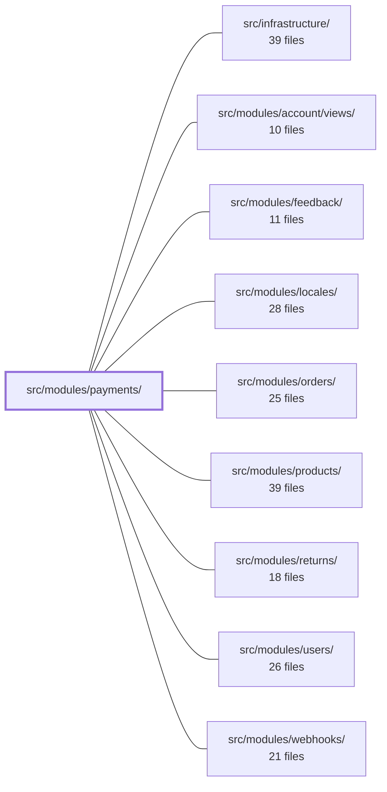

---
tags:
  - 2brain
  - 2brain/module
  - project/boilerplate-vue-frontend
type: module
module: src/modules/payments/
files: 22
updated: 2026-10-02T19:29:56.763196+00:00
---

# src/modules/payments/

## Purpose

The payments module owns the full card-and-offline payment lifecycle for an order: selecting a method, driving the PSP intent → confirm → sync sequence, recording out-of-band payments (cash, transfer), classifying payment errors into view-ready verdicts, and exposing a refund trigger. It also provides a bank-statement reference lookup so operators can resolve an RF creditor reference back to a specific order.

## Key parts

- **`store.ts`** — Pinia setup store that centralises all server interaction for payments. It mirrors the payment record locally, sequences the PSP calls (intent → confirm → sync), and applies the "404 means no payment yet" convention so components never interpret raw HTTP statuses.
- **`components/`** — Mountable UI pieces:
  - `PaymentPanel.vue` — the order-page panel that shows a method picker + submit form (or the current payment state) and emits `paid` for the parent to reload.
  - `OrderReferenceSearch.vue` — host-agnostic RF-reference lookup form; emits the resolved `Order` and never navigates.
  - `RecordOfflinePaymentForm.vue` — operator form for non-card receipts; delegates the write to a composable and emits `recorded`.
  - `PaymentMethodSelector.vue`, `TransferInstructionsPanel.vue` — supporting display components.
- **`domain/`** — Pure, framework-free rules (lint-enforced). `payment-errors.ts` maps a rejected API envelope to a discriminated union the view can branch on without side-effects.
- **`composables/`** — Thin adapters (`use-order-refund`, `use-record-offline-payment`) that let components call store actions without importing the store directly and keep `orderId` reactive.
- **`index.ts`** — Public barrel exposing the five UI components plus `useOrderRefund`; the store and `useRecordOfflinePayment` remain internal.
- **`tests/`** — Unit specs for the store (mocked transport, real API client), each component (spied store), each composable, plus a Cypress e2e that walks the full RF-reference checkout-then-lookup loop.

## How it connects

- **`src/modules/orders/`** — The orders module's pages (order detail, operator order-edit, orders list) mount the payment components and listen for `paid` / `recorded` events to re-fetch the order. The orders module also imports `useOrderRefund` directly from this barrel.
- **`src/infrastructure/`** — The store's transport layer (`orvalMutator` / generated API client) is provided by the shared infrastructure; the payments module consumes it but does not own HTTP configuration.

## Where to start

1. **`store.ts`** — Reading the store first gives you the vocabulary (intent, confirm, sync, `fetchPaymentForOrder`, `payForOrder`, `recordOfflinePayment`) and the one place where server status codes are translated into domain semantics. Every component and composable builds on these actions.
2. **`components/PaymentPanel.vue`** — The richest component in the module; it shows how the store's return values drive the UI, how `payment-errors` classification feeds error banners, and how the `paid` event hands control back to the parent order page.

## Connected modules

[[boilerplate-vue-frontend_ROOT|/ (repository root)]] · [[boilerplate-vue-frontend_src_infrastructure|src/infrastructure/]] · [[boilerplate-vue-frontend_src_modules_account_views|src/modules/account/views/]] · [[boilerplate-vue-frontend_src_modules_feedback|src/modules/feedback/]] · [[boilerplate-vue-frontend_src_modules_locales|src/modules/locales/]] · [[boilerplate-vue-frontend_src_modules_orders|src/modules/orders/]] · [[boilerplate-vue-frontend_src_modules_products|src/modules/products/]] · [[boilerplate-vue-frontend_src_modules_returns|src/modules/returns/]] · [[boilerplate-vue-frontend_src_modules_users|src/modules/users/]] · [[boilerplate-vue-frontend_src_modules_webhooks|src/modules/webhooks/]]

## Files
- `src/modules/payments/components/OrderReferenceSearch.vue` — A self-contained search form that lets an operator paste a bank-statement RF creditor reference and resolve it to the corresponding order. It lives in the `payments` module because the lookup lives in the payments store, but it is deliberately host-agnostic: it emits the found `Order` and never navigates, so any parent that can act on the result can mount it.
- `src/modules/payments/components/PaymentMethodSelector.vue`
- `src/modules/payments/components/PaymentPanel.vue` — Order-page payment panel that renders a method picker and submit form while an order is payable, or the payment's current state (in-flight, processing, succeeded, refund-pending) once a payment record exists. All payment lifecycle logic (intent, confirm, sync) is delegated to the payments Pinia store; the component handles presentation, error classification, anti-bot challenge, and emits `paid` so the parent can re-read the order.
- `src/modules/payments/components/RecordOfflinePaymentForm.vue` — A Vuetify form that lets an operator record a payment received outside the card checkout (cash at the counter, phone transfer, etc.). It owns field state and client-side validation only; the actual API write is delegated to the `useRecordOfflinePayment` composable. On success it emits `recorded` so the parent page can reload the order.
- `src/modules/payments/components/TransferInstructionsPanel.vue`
- `src/modules/payments/composables/use-order-refund.ts`
- `src/modules/payments/composables/use-record-offline-payment.ts` — Thin composable that exposes a single `recordOfflinePayment` call for one order, delegating the actual API request and state mutation to the payments store. It exists so view components (e.g. the offline-payment form) can invoke the store action without importing the store directly, and so the `orderId` can be kept reactive across route changes.
- `src/modules/payments/domain/index.ts` — Barrel (index) file for the payments domain layer. It re-exports the public surface of the domain so that consumers import from a single entry point (`./index`) rather than reaching into individual sibling files. The module doc comment asserts that this tier contains pure rules and is lint-guaranteed free of Vue, Pinia, axios, and other framework dependencies.
- `src/modules/payments/domain/payment-errors.ts` — Classifies a rejected "start paying" API response into a narrow, view-ready verdict. It is a pure module: it inspects the error envelope's `errors[0]`, maps it to a discriminated union, and delegates all user-facing copy and side-effects to the calling view.
- `src/modules/payments/index.ts` — Public barrel for the payments module. It re-exports the five UI components that sibling pages mount (order page, cart checkout, operator order-edit, orders list) plus one composable (`useOrderRefund`) that the orders module calls directly. The internal store and `useRecordOfflinePayment` are deliberately kept private to this module.
- `src/modules/payments/module.ts`
- `src/modules/payments/response-schemas.ts`
- `src/modules/payments/store.ts` — Pinia setup store that centralises the payments module's server interaction: it mirrors the API's payment record locally, owns the PSP intent → confirm → (sync) sequence, and applies the "404 means no payment yet" convention in one place so components never interpret raw HTTP statuses.
- `src/modules/payments/tests/e2e/order-reference-search.cy.ts` — Cypress e2e spec that walks the full RF-reference lookup loop: a customer checks out via bank transfer (the only method that freezes an RF reference onto the order), then an admin pastes that reference into the orders-list search box and is taken directly to the order's edit page. A second case verifies that an unmatched reference produces an inline error rather than a navigation or toast.
- `src/modules/payments/tests/order-reference-search.spec.ts`
- `src/modules/payments/tests/payment-errors.spec.ts`
- `src/modules/payments/tests/payment-panel.spec.ts` — Unit tests for the `PaymentPanel.vue` component, verifying its UI behavior around payment deadlines, product-unavailable refusals, hand-paid refund states, cross-order state hygiene, and partial refunds. The file mounts the real component with a mocked store (spying `fetchPaymentForOrder` and `payForOrder`) rather than testing store logic, which is covered elsewhere.
- `src/modules/payments/tests/record-offline-payment-form.spec.ts` — Vitest spec for the `RecordOfflinePaymentForm` component. It mounts the real form, spies on `usePaymentsStore().recordOfflinePayment`, and verifies that the component correctly captures user input (method, reference, received-at date), emits `recorded` only on success, and routes API refusals to either a specific field or a form-level banner. It follows the same "component owns field state, store owns the write" pattern established in `stock-movement-form.spec.ts`.
- `src/modules/payments/tests/store.spec.ts` — Unit tests for the payments Pinia store (`usePaymentsStore`). The transport (`orvalMutator`) is mocked as a key-based router while the generated API client and the store under test remain real. The suite pins the PSP call sequence (intent → confirm → sync), the semantic split between "404 = no payment yet" and "any other failure = reject to caller", and the exact request-body shapes the store sends to each endpoint.
- `src/modules/payments/tests/transfer-instructions-panel.spec.ts`
- `src/modules/payments/tests/use-order-refund.spec.ts` — Vitest spec for the `useOrderRefund` composable. It pins the contract that the composable makes **no client-side refund decision**: `canRefund` is a pure read-back of the server's `actions.refund` flag, so the control state follows whatever the API returns without any local status comparison.
- `src/modules/payments/tests/use-record-offline-payment.spec.ts` — Vitest spec for the `useRecordOfflinePayment` composable. It pins the contract that the composable is a thin "perform the call and mirror the answer" layer: it performs the `POST /payments/order/:id/offline` request, mirrors a success into the payments store, and passes a rejection envelope through untouched. Business-rule decisions (e.g. "a card charge is in flight") are the server's 409, not the composable's.

---
[[boilerplate-vue-frontend_INDEX|← boilerplate-vue-frontend index]]
