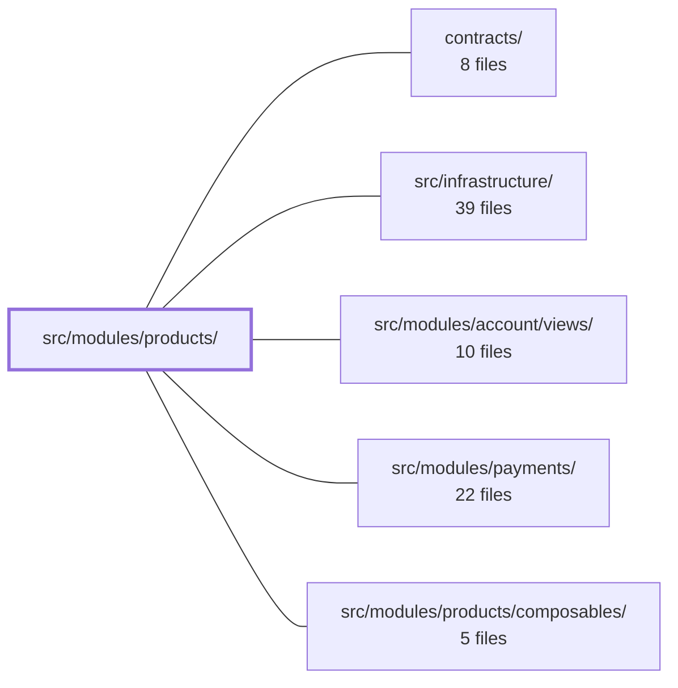

---
tags:
  - 2brain
  - 2brain/module
  - project/boilerplate-vue-frontend
type: module
module: src/modules/products/
files: 39
updated: 2026-10-02T19:30:22.029281+00:00
---

# src/modules/products/

## Purpose

The products module owns the full product catalogue lifecycle: browsing the storefront grid, viewing product detail, and the admin create/edit workflows. It defines the module's routes, Pinia store, Zod validation schemas, and a single reusable card component, with an extensive layer of unit and e2e tests that guard the shopper-facing contract, staff permissions, multi-locale behaviour, and resilience edge-cases.

## Key parts

- **`module.ts` / `index.ts` / `routes.ts`** — Module registration, public exports, and the route table (list, detail, create, edit) that plugs into the app router.
- **`store.ts`** — Pinia store that wraps `@guebbit/vue-toolkit` CRUD with products-specific logic: JSON-vs-multipart branching on create/update, locale-scoped caching, and batched `fetchProductsByIds`.
- **`schemas.ts` / `response-schemas.ts`** — Zod schemas for form validation and API response shaping; their i18n message keys are cross-checked against the locale dictionaries.
- **`views/`** — The four page components: `ProductsList` (dual guest-grid / staff-table), `Product` (public detail), `ProductCreate` (multi-locale form + multipart upload), `ProductEdit` (merge-semantics PATCH with stale-record and locale-race handling).
- **`components/ProductCard.vue`** — The single card rendered in the storefront grid; exposes a `product-actions` slot so other modules inject write buttons without this module knowing their identity.
- **`tests/`** — Two tiers: Vitest unit specs (component contracts, store branching, schema/i18n consistency, regression guards) and Cypress e2e specs (a11y sweep, keyboard, locale, write flows, visual, resilience, image uploads).

## How it connects

- **`contracts/`** — API contract definitions (e.g. `UpdateProductByIdBody`) that the edit form's PATCH payload is validated against, ensuring the client never drifts from the server contract.
- **`src/infrastructure/`** — Shared infrastructure the module builds on: the HTTP client, `vue-i18n` instance, Vuetify theme/viewport setup, and the `sweepA11y` e2e runner used by the a11y spec.
- **`src/modules/products/composables/`** — Internal composables (`useProductLines`, `useActiveLocales`, `useTranslatedEntityForm`) that views and the store consume for batched lookups, locale-tab management, and translated-form hydration.
- **`src/modules/account/views/`** — Auth and permission state that drives the guest-vs-staff split in `ProductsList` and the sign-in prompt in `ProductCard`.
- **`src/modules/payments/`** — Consumes the `product-actions` slot exposed by `Product.vue` to inject add-to-cart / purchase flows without the products module referencing payment code directly.

## Where to start

1. **`views/ProductsList.vue`** — The first page a user (or admin) sees. Reading it reveals the permission-based dual rendering, the shared search/filter/sort/pagination pattern, and how it talks to the store.
2. **`store.ts`** — The single data-access layer every view depends on. Understanding its JSON/multipart branch and locale-scoped cache demystifies both the create and edit flows.

## Connected modules

[[boilerplate-vue-frontend_ROOT|/ (repository root)]] · [[boilerplate-vue-frontend_contracts|contracts/]] · [[boilerplate-vue-frontend_src_infrastructure|src/infrastructure/]] · [[boilerplate-vue-frontend_src_modules_account_views|src/modules/account/views/]] · [[boilerplate-vue-frontend_src_modules_payments|src/modules/payments/]] · [[boilerplate-vue-frontend_src_modules_products_composables|src/modules/products/composables/]]

## Files
- `src/modules/products/components/ProductCard.vue`
- `src/modules/products/index.ts`
- `src/modules/products/module.ts`
- `src/modules/products/response-schemas.ts`
- `src/modules/products/routes.ts`
- `src/modules/products/schemas.ts`
- `src/modules/products/store.ts`
- `src/modules/products/tests/e2e/a11y.cy.ts` — Declares the route list that drives the products module's automated accessibility (axe) sweep. It does not implement any test logic itself; it hands a structured list of routes, viewports, themes, and prep steps to the shared `sweepA11y` runner.
- `src/modules/products/tests/e2e/keyboard.cy.ts`
- `src/modules/products/tests/e2e/locale.cy.ts`
- `src/modules/products/tests/e2e/product-write.cy.ts`
- `src/modules/products/tests/e2e/products.cy.ts`
- `src/modules/products/tests/e2e/products.visual.cy.ts`
- `src/modules/products/tests/e2e/resilience.cy.ts` — Product-catalogue share of the application's resilience e2e sweep. Validates that the list, detail, empty-state, and pagination UIs degrade gracefully (no overflow, no blank renders) regardless of what the dataset actually contains, including the intentionally sparse `barebones` record. Extracted from the central `tests/e2e/specs/resilience.cy.ts` under ticket FA122.
- `src/modules/products/tests/e2e/uploads.cy.ts` — Cypress e2e spec that exercises the product image-upload path (shared `FormImageUpload.vue` → `multer` → digest/thumbnail worker) through the product create and edit forms specifically. Extracted from the central `tests/e2e/specs/uploads.cy.ts` under FA122 so the catalogue module owns its upload coverage; the central file retains only the generic "User create"/"Signup" cases.
- `src/modules/products/tests/product-card.spec.ts` — Vitest spec for `ProductCard.vue`, verifying the shopper-facing contract: correct price and availability rendering, the title as the sole product-page link, contributed `product-actions` slot wiring, guest sign-in prompting, and the absence of staff controls.
- `src/modules/products/tests/product-create-currency.spec.ts` — Verifies that the **ProductCreate** form sizes its price input's decimal precision from the shop's currency setting (`GET /products/settings`) rather than from a product payload, since a create form has no existing product to read `currency` from (business rule D11). It also confirms the currency code is displayed beside the amount field.
- `src/modules/products/tests/product-create-locales-fallback.spec.ts` — Verifies that the `ProductCreate` form still renders (on a single fallback-language tab) when `GET /locales` fails, rather than hanging on the skeleton loader that appears while locale data is unresolved. Part of the LOCALES_OPTIONAL_0925 epic (step 6b).
- `src/modules/products/tests/product-create-tax-class.spec.ts` — Vitest unit test for the `ProductCreate` form verifying the PL-72 behavior: when `taxClass` is left at the shop default, the key must be **omitted** from the POST payload (value is `undefined`) rather than sent as an explicit `null` (which is the edit-form convention). Also asserts the field is rendered on screen.
- `src/modules/products/tests/product-edit-locale-race.spec.ts` — Regression test for a render-crash race in `ProductEdit.vue`: when `GET /locales` resolves before `GET /products/{id}/admin`, the component's `openTags` logic previously opened the fallback tab while `form.translations` was still empty, causing a `Cannot read properties of undefined (reading 'title')` error inside Vue's reactivity flush. The test drives the two HTTP responses on independent schedules to verify the tab stays closed until the admin record actually arrives.
- `src/modules/products/tests/product-edit-no-withdrawal.spec.ts` — Verifies that the `noWithdrawal` field (EU Art. 16) round-trips through the `ProductEdit` form: it hydrates from the admin record and is always present in the PATCH body (as `true` or `false`, never omitted). The PATCH payload is validated against the generated contract schema (`UpdateProductByIdBody`) so that a drift between what the form sends and what the API contract expects is caught here.
- `src/modules/products/tests/product-edit-stale-record.spec.ts` — Verifies the ProductEdit form's UX when a PATCH save is rejected with HTTP 412 (the product was modified after the form loaded). Confirms the form surfaces a **warning** (not an error), exposes a "reload latest" action that re-fetches the admin record, and never silently resubmits the stale edit.
- `src/modules/products/tests/product-edit-tax-class.spec.ts` — Verifies that the `ProductEdit` view round-trips the `taxClass` field correctly: it hydrates the value from the admin record (including the explicit `null` "shop default" case) and resends it unchanged on form submit via PATCH. This is a single-field regression guard for PL-72.
- `src/modules/products/tests/product-edit-translations-link.spec.ts` — Regression test for the LOCALES_OPTIONAL_0925 scenario: when the `locales` module is absent from the enabled module set, `ProductEdit.vue` must still render without throwing on the named-route lookup for `EntityTranslations`, and must simply omit the translations link. The test also confirms the link reappears when the route is present and the viewer has `read Translation` permission.
- `src/modules/products/tests/product-lines.spec.ts` — Vitest unit tests for the product-lines feature: the `fetchProductsByIds` store action (batched, id-only product lookup) and the `useProductLines` composable (mapping loaded product records to display titles). The file exists to lock in the batching contract, the "no longer available" fallback, and the guarantee that a raw id never reaches the UI.
- `src/modules/products/tests/product-view.spec.ts` — Unit-test spec for the `Product` detail view. It mounts the real component against a real (memory-history) router built from `collectModuleRoutes`, then exercises every product shape the API can return—out-of-stock, in-stock, minimal, rich, ability-gated—without a network fetch or database. The pattern mirrors `wishlist-view.spec.ts`.
- `src/modules/products/tests/products-list-view.spec.ts` — Vitest component test for `ProductsList.vue`. Verifies that the catalogue page renders a storefront card grid for guests/read-only shoppers and a Vuetify data table (with row edit/delete actions) for staff, and that sorting is always delegated to the server via `searchProducts` rather than reordering rows client-side. Only the API client call is mocked; the real Pinia store, router, i18n, and Vuetify all run together.
- `src/modules/products/tests/routes.spec.ts`
- `src/modules/products/tests/schemas-i18n.spec.ts` — Verifies that the products module's Zod schemas and its locale dictionaries actually agree: every message key a schema references exists in both `en.json` and `it.json` and resolves to different text. It runs against the real `vue-i18n` instance (not a mocked `t`) so a wrong-language freeze would be caught. The *mechanism* (thunked messages re-resolving at parse time) is proven separately in `tests/cross-cutting/schemas-i18n.spec.ts`; this file proves *this module's* schemas and dictionaries are consistent.
- `src/modules/products/tests/schemas.spec.ts`
- `src/modules/products/tests/store.spec.ts` — Unit tests for the products Pinia store's own decision logic — specifically the JSON-vs-multipart branch on create/update, how `translations` is encoded in each mode, and how the cache scopes by active language. The CRUD wrappers around `@guebbit/vue-toolkit` are intentionally untested; only the repo-specific encoding and branching is covered.
- `src/modules/products/tests/translation-tab-errors.spec.ts`
- `src/modules/products/tests/translations-body.spec.ts`
- `src/modules/products/tests/use-active-locales.spec.ts`
- `src/modules/products/tests/use-translated-entity-form.spec.ts`
- `src/modules/products/views/Product.vue` — Public product detail page component. It fetches a product by route-provided `id` via the products store, renders the full record (hero image, price, stock, status, timestamps, description), and exposes a `product-actions` slot so other modules can inject visitor-write buttons (add-to-cart, wishlist) without this page knowing their identity.
- `src/modules/products/views/ProductCreate.vue` — The create-product page. It renders a multi-locale form (one tab per active locale, fallback locale always open), validates input against a subset of `productsSchema`, and submits a `POST /products` request through the products store's multipart-aware `createProduct` action. On success it toasts and navigates to the new product's detail route.
- `src/modules/products/views/ProductEdit.vue` — Admin edit form for a single product. Fetches the full multi-language admin record (`GET /products/{id}/admin`), renders one tab per existing locale plus scalar fields (price, stock, shipping, tax class, image), and submits a merge-semantics PATCH through the products store. Exists as a dedicated view so that route-level `id` changes can re-hydrate the form without a full remount.
- `src/modules/products/views/ProductsList.vue` — The main products list page. It renders two distinct experiences from one component: a public storefront grid (image cards with price, availability, add-to-cart) for any visitor, and a staff admin table with row actions (edit, soft-delete, restore, hard-delete) for users holding at least one Product write permission. Both views share a search/filter form, facet chips (category, tag), server-side sorting, and URL-synced pagination.

---
[[boilerplate-vue-frontend_INDEX|← boilerplate-vue-frontend index]]
