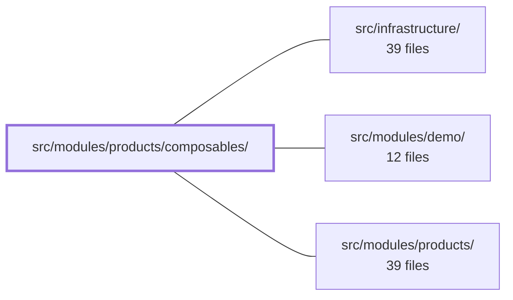

---
tags:
  - 2brain
  - 2brain/module
  - project/boilerplate-vue-frontend
type: module
module: src/modules/products/composables/
files: 5
updated: 2026-10-02T19:30:42.426767+00:00
---

# src/modules/products/composables/

## Purpose

This module holds Vue composables that encapsulate the product-translation form logic: state wiring for multi-locale editing, per-tab validation, error surfacing, and the mapping from form fields to the JSON payloads the product API expects. It lets `ProductCreate.vue` and `ProductEdit.vue` stay thin by offloading all shared translation-form behaviour here.

## Key parts

- **`use-translated-entity-form.ts`** — The central shared composable. It manages `@guebbit/vue-toolkit` validation state, the language-tab open/close lifecycle, per-tab error badges, and the post-submit failure pipeline (including 412 handling). Both create and edit views delegate to it, supplying only their differing fields, the request function, and a flag for whether a 412 is possible.
- **`translations-body.ts`** — Pure mapping layer that converts the per-locale form fields into the exact JSON body each endpoint (POST create / PATCH update) expects. Encodes the asymmetry where "no description" is treated differently between the two verbs, so callers never hand-roll the transformation.
- **`translation-tab-errors.ts`** — Per-tab error aggregation consumed by the error-badge UI in the translation form.
- **`use-active-locales.ts`** / **`use-product-lines.ts`** — Data-access composables that fetch the active locale list and the product-line catalogue respectively, providing the reactive state the form tabs and line selector depend on.

## How it connects

- **`src/modules/products/`** — `ProductCreate.vue` and `ProductEdit.vue` are the primary consumers of `use-translated-entity-form` and the body-mapping helpers; the remaining composables feed data into those views' forms.
- **`src/infrastructure/`** — The composables rely on the shared API client and any form-validation utilities that live there; `use-active-locales` and `use-product-lines` issue their network calls through this layer.
- **`src/modules/demo/`** — Demo product fixtures exercise the same translation endpoints, so the body-mapping in `translations-body.ts` must remain compatible with the shapes the demo module produces.

## Where to start

1. **`use-translated-entity-form.ts`** — Reading this first shows the overall contract: what the two views pass in, what lifecycle hooks it manages, and how validation/errors flow through the tabs.
2. **`translations-body.ts`** — Once the form shape is clear, this file shows how that shape becomes the wire payload and highlights the POST/PATCH asymmetry that is easy to trip over when extending the API.

## Connected modules

[[boilerplate-vue-frontend_src_infrastructure|src/infrastructure/]] · [[boilerplate-vue-frontend_src_modules_demo|src/modules/demo/]] · [[boilerplate-vue-frontend_src_modules_products|src/modules/products/]]

## Files
- `src/modules/products/composables/translation-tab-errors.ts`
- `src/modules/products/composables/translations-body.ts` — Transforms the product form's per-locale translation fields into the exact JSON body each API endpoint accepts. The two endpoints (POST create, PATCH update) treat "no description" differently — this file encodes that asymmetry so callers pass form state through without hand-rolling the mapping.
- `src/modules/products/composables/use-active-locales.ts`
- `src/modules/products/composables/use-product-lines.ts`
- `src/modules/products/composables/use-translated-entity-form.ts` — Shared composable that powers the multi-language translation form used by both `ProductCreate.vue` and `ProductEdit.vue`. It wires the `@guebbit/vue-toolkit` form-validation state, the language-tab open/close lifecycle, per-tab error badges, and the post-submit failure pipeline, so the two views only supply their differing fields, request, and whether a 412 is possible.

---
[[boilerplate-vue-frontend_INDEX|← boilerplate-vue-frontend index]]
