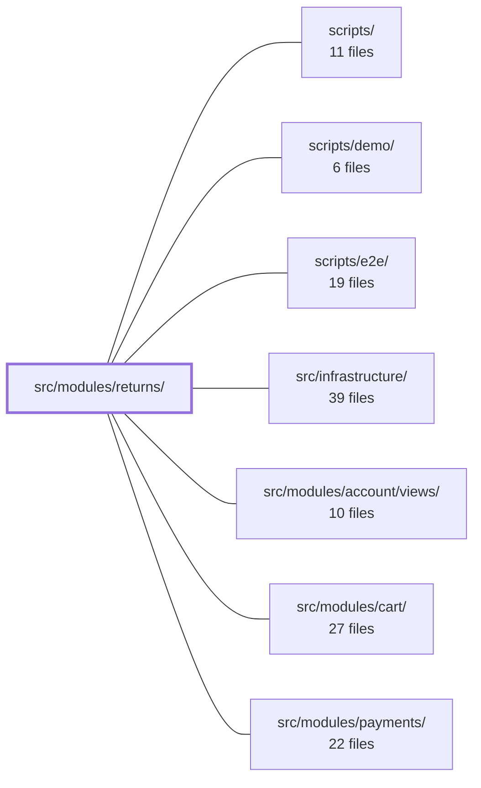

---
tags:
  - 2brain
  - 2brain/module
  - project/boilerplate-vue-frontend
type: module
module: src/modules/returns/
files: 18
updated: 2026-10-02T19:31:13.819018+00:00
---

# src/modules/returns/

## Purpose

The Returns module implements the full product-returns and EU withdrawal flow: the customer-facing experience of opening a partial or full return (including the Art. 11a right-of-withdrawal), the staff-facing workflow of approving, declining, or receiving a returned shipment, and the domain logic that determines which order lines are still returnable. It encapsulates all of this behind a single public component so the order page never touches return internals.

## Key parts

- **Public surface** — `index.ts` re-exports only `WithdrawalPanel`, which composes the withdrawal button, the nested `ReturnRequestForm`, and the list of already-opened returns into one drop-in component for the order page.
- **Components** — `ReturnRequestForm.vue` (line selection, quantity, reason, note → `POST /returns`), `ReturnStaffActions.vue` (server-driven approve / decline / receive panel), and `WithdrawalPanel.vue` (the parent that gates the withdrawal button via a `canWithdraw` prop and nests the form and history).
- **Domain logic** — `returnable-lines.ts` is a pure, side-effect-free helper that computes which lines and how many units remain returnable on a given order; the server re-validates on submission.
- **Store** — `store.ts` (Pinia) wires paginated search and by-id reads onto the shared `useStructureCrudApi` primitive and hand-implements the four lifecycle calls (`openReturn`, `approve`, `decline`, `receive`). All return UI reads and writes go through this single reactive store.
- **Views** — `ReturnsList.vue` (paginated list) and `Return.vue` (single-return detail with status, lines, postage info, and staff actions).
- **Routing & schemas** — `routes.ts`, `module.ts`, and `response-schemas.ts` define the module's route table, module registration, and typed response contracts.
- **Tests** — Per-component Vitest specs (`return-request-form.spec.ts`, `return-staff-actions.spec.ts`, `withdrawal-panel.spec.ts`), a domain spec (`returnable-lines.spec.ts`), a store spec (`store.spec.ts`) that validates request bodies against API schemas, a routes spec, and an e2e accessibility sweep (`tests/e2e/a11y.cy.ts`).

## How it connects

- **`src/infrastructure/`** — The Pinia store builds on the shared `useStructureCrudApi` primitive for list/search and by-id reads. The e2e a11y test registers its routes through the shared `sweepA11y` helper, plugging into the project's common accessibility-audit tooling.
- **`scripts/e2e/`** — The `a11y.cy.ts` spec is picked up by the e2e runner scripts, so the returns pages are included in the project-wide accessibility sweep as part of CI.
- **`/` (repository root)** — Standard project-level configuration (package scripts, Vitest/Cypress config, orval codegen for `response-schemas.ts`) that the module's test and build tooling depends on.

## Where to start

1. **`index.ts`** — one file, one export. It tells you exactly what the rest of the codebase sees and forces you to read `WithdrawalPanel.vue` next.
2. **`store.ts`** — once you know the public shape, the store shows every API call the module makes, what it caches, and how the four lifecycle mutations flow. Reading it alongside `returnable-lines.spec.ts` gives you both the data contract and the domain rules in about five minutes.

## Connected modules

[[boilerplate-vue-frontend_ROOT|/ (repository root)]] · [[boilerplate-vue-frontend_scripts|scripts/]] · [[boilerplate-vue-frontend_scripts_demo|scripts/demo/]] · [[boilerplate-vue-frontend_scripts_e2e|scripts/e2e/]] · [[boilerplate-vue-frontend_src_infrastructure|src/infrastructure/]] · [[boilerplate-vue-frontend_src_modules_account_views|src/modules/account/views/]] · [[boilerplate-vue-frontend_src_modules_cart|src/modules/cart/]] · [[boilerplate-vue-frontend_src_modules_payments|src/modules/payments/]]

## Files
- `src/modules/returns/components/ReturnRequestForm.vue` — Customer-facing form for opening a partial or full return with a reason other than withdrawal (defective, wrong item, other). It lets the customer pick which order lines to send back, set quantities, choose a reason, and attach an optional note, then dispatches `POST /returns` via the returns store.
- `src/modules/returns/components/ReturnStaffActions.vue` — Renders the staff-facing action panel for a single return record (approve, decline, receive). Which of the three controls appear is driven entirely by the server-provided `item.actions` array; this component does not implement or mutate the return lifecycle itself — it collects optional form inputs, delegates the mutation to the returns store, and reports the outcome.
- `src/modules/returns/components/WithdrawalPanel.vue` — Renders the returns section of an order page: the EU right-of-withdrawal button (Consumer Rights Directive Art. 11a), a return-request form for faulty/wrong goods or part-orders, and a list of withdrawals/returns already opened on the order. The withdrawal button's visibility is entirely server-driven (`canWithdraw` prop); this component never computes the withdrawal window itself.
- `src/modules/returns/domain/returnable-lines.ts` — Pure domain logic that computes which order lines a customer can still return from a given order. It produces the "offer" shown in the returns form (which products, how many left), with no side effects. All results are re-validated server-side on `POST /returns`; this file only shapes what the UI presents.
- `src/modules/returns/index.ts` — Public barrel for the Returns module. It exposes the single public entry point (`WithdrawalPanel`) so the order page can import one component that encapsulates the entire returns flow (trigger button, confirmation step, and the list of previously opened returns) without leaking internal store or sub-component details to the outside.
- `src/modules/returns/module.ts`
- `src/modules/returns/response-schemas.ts`
- `src/modules/returns/routes.ts`
- `src/modules/returns/store.ts` — Pinia store for the returns module. It wires the module's paginated search and by-id reads onto the shared `useStructureCrudApi` primitive, and hand-writes the four lifecycle moves (`openReturn`, `approve`, `decline`, `receive`) that are endpoint calls rather than record edits. It exists so every return-related UI component talks to one reactive state with consistent caching and idempotency behavior.
- `src/modules/returns/tests/e2e/a11y.cy.ts` — Registers the accessibility-audit routes for the returns module with the shared `sweepA11y` helper. It sweeps the returns list and one seeded return detail page under the **admin** (signed-in) role, ensuring both pages are checked for a11y issues as part of the e2e suite.
- `src/modules/returns/tests/return-request-form.spec.ts` — Vitest spec for the `ReturnRequestForm` component. It verifies the form's UI contract: it stays collapsed until opened, lists only returnable lines with their remaining quantities, validates that at least one line is ticked with a valid reason and in-range quantity, submits only the ticked lines to the store, and handles server rejection. The store's `openReturn` is spied; real transport is covered by `store.spec.ts`.
- `src/modules/returns/tests/return-staff-actions.spec.ts` — Unit tests for the `ReturnStaffActions.vue` component. Verifies that the approve / decline / receive controls render only when `Return.actions` allows them, and that each interaction dispatches the correct store method with the expected arguments. Store methods are spied on; network transport is explicitly out of scope (delegated to `store.spec.ts`).
- `src/modules/returns/tests/returnable-lines.spec.ts` — Unit tests for the returns-domain helpers `returnableLines` and `isReturnableOrderStatus`. They verify the arithmetic that determines which order lines (and how many units) a customer can still return, given prior return requests, and that only shipped/delivered orders qualify.
- `src/modules/returns/tests/routes.spec.ts`
- `src/modules/returns/tests/store.spec.ts` — Unit tests for the returns Pinia store (`useReturnsStore`) run against a mocked `orvalMutator` transport. They verify what each store action sends (body, headers, params), which outcome it reports to the caller, and that a server response **replaces** the cached record. Request bodies are additionally validated against the API contract's own schemas (`contractRequest`) so drift surfaces here instead of as a 422 in production.
- `src/modules/returns/tests/withdrawal-panel.spec.ts` — Vitest unit tests for the `WithdrawalPanel` Vue component. Verifies the server-gated withdrawal button, its confirmation dialog flow, error reporting, and the nested `ReturnRequestForm` offering rules. Deliberately mocks the Pinia store's actions (transport is `store.spec.ts`'s responsibility) and the dialog store's `confirm` to isolate component logic.
- `src/modules/returns/views/Return.vue` — Renders the single-return detail page (`ReturnTargetPage`), showing what came back, who pays postage, the current status, line items, and — for staff — the open actions. It is cache-first by route id but forces one re-read on arrival when the list-seeded cache row lacks an `actions` array.
- `src/modules/returns/views/ReturnsList.vue`

---
[[boilerplate-vue-frontend_INDEX|← boilerplate-vue-frontend index]]
