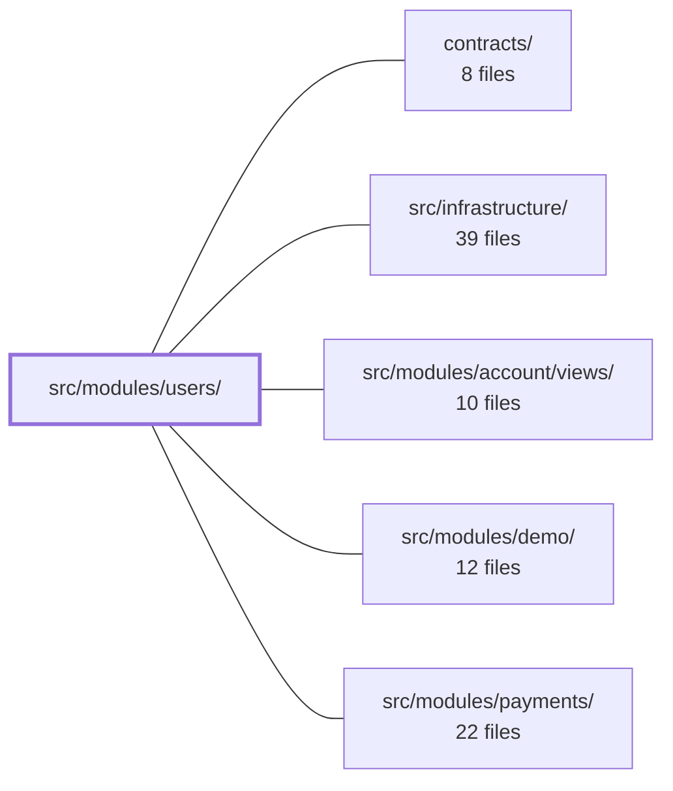

---
tags:
  - 2brain
  - 2brain/module
  - project/boilerplate-vue-frontend
type: module
module: src/modules/users/
files: 26
updated: 2026-10-02T19:31:43.293837+00:00
---

# src/modules/users/

## Purpose

The users module is the admin-facing surface for managing other user accounts: creating, listing, viewing, editing, soft-deleting, and restoring users, as well as changing a user's role or active status. It encapsulates the domain model (roles, identity fields), validation schemas, a Pinia store that talks to the API, the route tree, and all associated views and tests.

## Key parts

- **Domain & schemas** — `domain/roles.ts`, `domain/index.ts` define the role set and domain helpers; `schemas.ts` and `response-schemas.ts` hold Zod schemas (with i18n-thunked messages) that validate form payloads and API responses.
- **State & transport** — `store.ts` is the Pinia store exposing CRUD actions (`createUser`, `updateUser`, soft/hard delete, restore, paginated search) over the shared `orvalMutator` HTTP transport.
- **Views** — `UsersList.vue` (primary list/search/filter page with URL-driven state), `UserCreate.vue` (creation form), `UserEdit.vue` (single-user edit with change-diffing and access-dialog gating), `User.vue` (read-only detail page with 2FA-recovery and access-management shortcuts).
- **Access dialog** — `UserAccessDialog.vue` + `composables/use-user-access-dialog.ts` implement the two-step pick → confirm flow for role/active changes, including a `skipPicker` mode reused by `UserEdit.vue`.
- **Routing & module wiring** — `routes.ts`, `module.ts`, `index.ts` register the module's routes and export its public API.
- **Tests** — Unit specs for schemas, store, and each view; e2e specs for full user flows, visual regression, and a11y sweep (declared per-module so coverage is deleted with the module).

## How it connects

- **contracts/** — Provides the shared API type contracts (e.g. `UpdateUserByIdBody` strictObject) and the Zod + i18n thunk pattern that this module's schemas consume; the cross-cutting schema-i18n test verifies the mechanism, while this module's `tests/schemas-i18n.spec.ts` proves its own schemas and locale dictionaries agree.
- **src/infrastructure/** — Supplies the `orvalMutator` HTTP client the store's actions call, the `useStructureFormValidation` composable used by `UserEdit.vue`, and shared UI primitives (DataTable, form-field components).
- **src/modules/account/views/** — The self-service counterpart: that module lets a user manage *their own* profile, while this module lets an admin manage *any* user. They share the same domain role definitions and user identity fields but operate on different actors.
- **src/modules/demo/** — Seeds or references demo user records that populate this module's list and detail pages during development.
- **src/modules/payments/** — User roles and the active/inactive flag defined here gate which users can access payment features; deactivating a user in this module has downstream effects on their payment permissions.

## Where to start

Read **`store.ts`** first — it is short, shows the full CRUD surface, the exact API endpoints and payload shapes, and the one critical invariant (passwords and Blobs never persist into store state). Then open **`views/UsersList.vue`** to see how the store, filter form, paginated `DataTable`, and per-row actions compose into the module's primary screen. Together they give you the data flow and the dominant UI pattern before you branch into the individual create/edit/detail pages.

## Connected modules

[[boilerplate-vue-frontend_ROOT|/ (repository root)]] · [[boilerplate-vue-frontend_contracts|contracts/]] · [[boilerplate-vue-frontend_src_infrastructure|src/infrastructure/]] · [[boilerplate-vue-frontend_src_modules_account_views|src/modules/account/views/]] · [[boilerplate-vue-frontend_src_modules_demo|src/modules/demo/]] · [[boilerplate-vue-frontend_src_modules_payments|src/modules/payments/]]

## Files
- `src/modules/users/components/UserAccessDialog.vue` — A two-step admin dialog (pick → confirm) for changing another user's role and/or active status. It exists to force an explicit, named confirmation—especially when deactivating—before the caller's promise in `useUserAccessDialog()` resolves. It supports a `skipPicker` mode where the values were already chosen elsewhere (`UserEdit.vue`) and only the confirm step runs.
- `src/modules/users/composables/use-user-access-dialog.ts`
- `src/modules/users/domain/index.ts`
- `src/modules/users/domain/roles.ts`
- `src/modules/users/index.ts`
- `src/modules/users/module.ts`
- `src/modules/users/response-schemas.ts`
- `src/modules/users/routes.ts`
- `src/modules/users/schemas.ts`
- `src/modules/users/store.ts`
- `src/modules/users/tests/e2e/a11y.cy.ts` — Declares the list of users-module routes to be exercised by the shared a11y sweep, and calls `sweepA11y` to run them as the admin. Co-located with the module so that deleting the module removes its a11y coverage in one step; a cross-cutting spec asserts every routed module ships one of these files, preventing silent loss of a domain.
- `src/modules/users/tests/e2e/users.cy.ts`
- `src/modules/users/tests/e2e/users.visual.cy.ts`
- `src/modules/users/tests/routes.spec.ts`
- `src/modules/users/tests/schemas-i18n.spec.ts` — Verifies that the users module's Zod schemas produce validation messages in the active locale (English and Italian) by running `safeParse` against the real `vue-i18n` instance. Complements the cross-cutting mechanism test (`tests/cross-cutting/schemas-i18n.spec.ts`) by proving *this* module's schemas and its own locale dictionaries actually agree, rather than demonstrating the thunked-message re-resolution mechanism in isolation.
- `src/modules/users/tests/schemas.spec.ts`
- `src/modules/users/tests/store.spec.ts` — Unit tests for the users Pinia store. The HTTP transport (`orvalMutator`) is mocked so that tests can inspect the raw axios configs the store's actions produce (URL, method, body encoding). The file mirrors the products store spec in structure, with one additional concern: verifying that `updateUser` never persists a submitted password or an uploaded `Blob` into client-side store state.
- `src/modules/users/tests/user-access-dialog.spec.ts` — Vitest spec for `UserAccessDialog.vue`. Validates the two-step picker → confirm flow, the `skipPicker` shortcut mode used by `UserEdit.vue`, the self-deactivation warning, and that the emitted `confirm` payload contains only the fields that actually changed (unchanged fields are `undefined`), ready to serve as a `PATCH` body.
- `src/modules/users/tests/user-create-view.spec.ts` — Integration-level test suite for the `UserCreate` admin page. It mounts the real component against a real (memory-history) router and verifies: client-side validation refusal, the exact payload dispatched to the store, post-creation navigation, in-place blocking on API rejection, submit-button locking during in-flight requests, and field-level error placement vs. the banner. `createUser` is spied at the Pinia store so no network call is made.
- `src/modules/users/tests/user-edit-view.spec.ts` — Mounts the real `UserEdit` view against a memory-history router and a mocked `orvalMutator` transport to verify two contract-level behaviours: (1) a PATCH body contains **only** the fields that actually changed (no unchanged `role`/`active` riding along to re-trigger the backend's grant check), and (2) role or active changes are gated behind the `UserAccessDialog` confirmation before any request is sent. The spec also validates PATCH bodies against the real `UpdateUserByIdBody` strictObject schema to catch stray keys or invalid empty-string defaults (regression FA123).
- `src/modules/users/tests/user-target-view.spec.ts` — Vitest spec for the admin user-detail page (`User.vue`). It mounts the real page against a real memory-history router and verifies two behaviours: (1) the "strip 2FA" button is gated on `twoFactorEnabledAt` and disappears after a forced refetch following the DELETE, and (2) the "Manage access" shortcut passes the loaded user to `UserAccessDialog` and issues a PATCH only when the dialog confirms. The dialog's own picker/confirm logic is out of scope here.
- `src/modules/users/tests/user-view.spec.ts` — Verifies a single UI concern on the User detail page: the **"History" link** renders only when the current viewer holds the `audit.any.read` ability (CASL subject `AuditLog`), per FE_PARITY_0924 G2. It mounts the real `User.vue` against a memory-history router and a real Pinia store, with `watchUser` stubbed out so no network fetch occurs.
- `src/modules/users/views/User.vue` — Read-only user detail page (`UserTargetPage`). Resolves a single user from the route `id`, renders their identity fields, role chip, and status chip, and exposes two admin actions: a 2FA recovery button (no-proof path) and a `UserAccessDialog` shortcut for changing role/active status without the full edit form.
- `src/modules/users/views/UserCreate.vue` — Renders the user-creation form. It collects email, username, password (or a "send setup email" checkbox in its place), role, locale, active flag, and an optional avatar, validates the submission client-side via a Zod schema, and delegates the actual `POST` (multipart or JSON) to the users store.
- `src/modules/users/views/UserEdit.vue` — Admin-facing page for editing a single user record (email, username, password, role, active status, locale, phone, website, avatar). Built on the shared `useStructureFormValidation` composable, it diffs the form against the loaded record so the `PATCH` only carries changed fields, and gates role/active changes behind a `UserAccessDialog` confirmation step.
- `src/modules/users/views/UsersList.vue` — The primary list/search page for the Users module. It wires the Pinia users store's paginated search to a filter form, a `DataTable`, and per-row actions (view, edit, soft-delete, hard-delete, restore, manage access). It keeps filters, page, and sort state in the URL so the view is deep-linkable and survives reload.

---
[[boilerplate-vue-frontend_INDEX|← boilerplate-vue-frontend index]]
