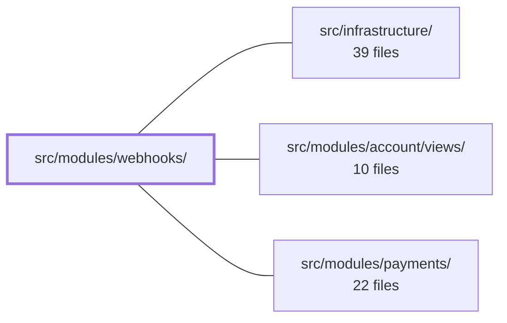

---
tags:
  - 2brain
  - 2brain/module
  - project/boilerplate-vue-frontend
type: module
module: src/modules/webhooks/
files: 21
updated: 2026-10-02T19:32:05.569280+00:00
---

# src/modules/webhooks/

## Purpose

The webhooks module lets administrators manage inbound webhook subscriptions (create, edit, view, delete) and inspect the delivery log—filtering by subscription, status, and page, with the ability to replay a failed delivery. It owns the one-time API-secret reveal flow, secret rotation, and all client-side validation for webhook configuration.

## Key parts

- **Views** (`views/`) — Route-level pages: `WebhooksList` (subscription index), `WebhookCreate` (form + one-time secret reveal modal), `WebhookEdit` (field edits only), `WebhookTarget` (read-only detail + secret-ring actions), `WebhookDeliveries` (delivery log with URL-synced filters and per-row replay).
- **Component** (`components/WebhookDeliveriesFilters.vue`) — Presentational filter bar, results table, and pager. Owns local filter state and emits `search`/`replay` events; makes no network calls itself.
- **State** (`store.ts`) — Pinia store (`useWebhooksStore`) that performs all HTTP calls via the shared transport and caches subscription data. Secret values are passed to callers but never retained in store state.
- **Schemas & types** (`schemas.ts`, `response-schemas.ts`, `types.ts`) — Zod validation schemas (with locale-aware error messages) and shared TypeScript interfaces for the module's domain objects.
- **Routing & module registration** (`routes.ts`, `module.ts`) — Defines the module's routes and plugs them into the application shell.
- **Tests** (`tests/`) — Unit tests for the store, schemas (including i18n message agreement), and each view/component; E2E Cypress specs for full flows and an a11y sweep co-located so module deletion removes its coverage automatically.

## How it connects

- **`src/infrastructure/`** — Provides the HTTP transport (`orvalMutator`) the store uses for every request, the `useStructureFormValidation` composable that powers client-side form checks in the create/edit views, the shared routing helpers consumed by `routes.ts`, and the `sweepA11y` helper that the co-located a11y spec calls for its axe scan.
- **`/` (repository root)** — Cross-cutting specs at the root (`tests/cross-cutting/a11y-coverage.spec.ts`, `tests/cross-cutting/schemas-i18n.spec.ts`) enforce that this module ships an a11y file and that its Zod schemas follow the shared thunked-message convention.
- **`src/modules/account/views/`, `src/modules/payments/`** — Listed as dependencies in the graph (likely shared auth guards or billing-related webhook event types), but no direct import or interaction is visible from the module's own file documentation.

## Where to start

1. **`store.ts`** — Reading the Pinia store first gives you the full API surface (actions, state shape, which fields are ephemeral vs. cached) that every view consumes.
2. **`views/WebhookCreate.vue`** — The create flow is the most self-contained end-to-end path: form validation → store action → secret-reveal modal → navigation. It touches the store, the schema, and the route in one file, making it a good reference for how the pieces fit together.

## Connected modules

[[boilerplate-vue-frontend_ROOT|/ (repository root)]] · [[boilerplate-vue-frontend_src_infrastructure|src/infrastructure/]] · [[boilerplate-vue-frontend_src_modules_account_views|src/modules/account/views/]] · [[boilerplate-vue-frontend_src_modules_payments|src/modules/payments/]]

## Files
- `src/modules/webhooks/components/WebhookDeliveriesFilters.vue` — Presents the webhook delivery log's filter bar, results table, and pager in a single presentational component. It owns the filter form's local state (subscription, status, page) and emits `search` / `replay` events to the parent view, which is responsible for all data fetching, URL query sync, and the in-flight replay set. No network calls are made here.
- `src/modules/webhooks/module.ts`
- `src/modules/webhooks/response-schemas.ts`
- `src/modules/webhooks/routes.ts`
- `src/modules/webhooks/schemas.ts`
- `src/modules/webhooks/store.ts`
- `src/modules/webhooks/tests/e2e/a11y.cy.ts` — Cypress a11y (accessibility) sweep route list for the webhooks module. It registers every routable page—including phone-viewport and form-error variants—through the shared `sweepA11y` helper so that an automated axe scan runs as the admin role. The file is co-located with the module so that deleting the module also deletes its a11y coverage; a cross-cutting spec (`tests/cross-cutting/a11y-coverage.spec.ts`) enforces that every routed module ships one of these files.
- `src/modules/webhooks/tests/e2e/webhooks.cy.ts`
- `src/modules/webhooks/tests/routes.spec.ts`
- `src/modules/webhooks/tests/schemas-i18n.spec.ts` — Domain-level i18n test proving that the webhooks module's Zod validation schemas produce locale-correct error messages at parse time. Unlike the cross-cutting test in `tests/cross-cutting/schemas-i18n.spec.ts` (which proves the *mechanism* of thunked Zod messages with an invented schema), this file asserts that *this module's* schemas and locale dictionaries actually agree.
- `src/modules/webhooks/tests/schemas.spec.ts`
- `src/modules/webhooks/tests/store.spec.ts` — Unit tests for the `useWebhooksStore` Pinia store. It mocks `orvalMutator` (the HTTP transport) to assert the exact requests each store action emits, and — uniquely in this file — verifies that the plaintext `secret` / `newSecret` fields returned by `createSubscription` and `rotateSecret` are handed to the caller but **never** retained in the store's cached state.
- `src/modules/webhooks/tests/webhook-create-view.spec.ts` — Component test suite for the `WebhookCreate` view. It verifies the form's client-side validation (rejecting non-URL values), the exact payload passed to the store on submit, the one-time secret-reveal modal flow before the visitor leaves the page, navigation to the new subscription detail on "Done", and in-place error display when the store rejects. Store actions are spied directly on the Pinia store; the HTTP layer beneath them has its own dedicated suite.
- `src/modules/webhooks/tests/webhook-deliveries-rows.spec.ts` — Unit test for the `WebhookDeliveriesFilters` component's table rows. It verifies that every rendered row carries the `data-test="webhook-delivery-row"` hook and displays its event type, so higher-level specs can locate a delivery by type without asserting on its (always-`pending` in unit scope) status.
- `src/modules/webhooks/tests/webhook-edit-view.spec.ts` — Verifies the `description`-field contract on the WebhookEdit page: clearing the field must produce `null` in the update payload (per the "empty string is invalid, `null` clears" rule), and leaving it untouched must omit the key entirely. Mounts the real Vue component against a real memory-history router and Pinia store rather than a shallow stub.
- `src/modules/webhooks/types.ts`
- `src/modules/webhooks/views/WebhookCreate.vue` — The Webhook subscription creation page. It presents a form (URL, description, event-type multiselect) built on `useStructureFormValidation`, submits a new subscription via the webhooks store, and—uniquely—intercepts the one-time API secret in component-local state to display it in a reveal modal before the visitor is ever navigated to the new subscription's detail page. The store never caches the secret.
- `src/modules/webhooks/views/WebhookDeliveries.vue` — Route-level page component that renders the webhook delivery log. It binds the webhooks store's paginated search to the `WebhookDeliveriesFilters` child component, mirrors the active filter state (subscription, status, page) into the URL query string so filtered views are bookmarkable and shareable with support, and exposes a per-row "replay delivery" action.
- `src/modules/webhooks/views/WebhookEdit.vue` — Edit form page for a webhook subscription. It hydrates a URL / description / event-types / enabled form from the webhooks store (keyed by the route `id` param) and persists changes via `updateSubscription`. Deliberately scoped to plain field edits — secret-ring and destructive actions are kept on the separate detail page, mirroring the split used in the `users` module.
- `src/modules/webhooks/views/WebhookTarget.vue` — Read-only webhook subscription detail page. It hydrates the current subscription from the webhooks store's in-memory cache (there is no dedicated `GET …/subscriptions/{id}` endpoint) and exposes the secret-ring management actions (rotate, remove) plus subscription deletion.
- `src/modules/webhooks/views/WebhooksList.vue`

---
[[boilerplate-vue-frontend_INDEX|← boilerplate-vue-frontend index]]
