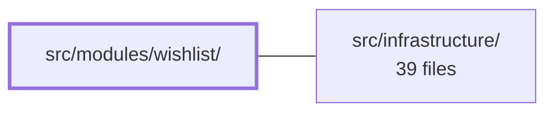

---
tags:
  - 2brain
  - 2brain/module
  - project/boilerplate-vue-frontend
type: module
module: src/modules/wishlist/
files: 13
updated: 2026-10-02T19:32:18.016880+00:00
---

# src/modules/wishlist/

## Purpose

The wishlist module handles the user's saved-items list: defining its route, maintaining its local state, rendering the list view and the per-item toggle control, and describing the shape of API responses that feed it.

## Key parts

- **Module wiring** – `module.ts` registers the module; `routes.ts` declares the URL path(s) the wishlist view is reachable at.
- **State** – `store.ts` holds the wishlist items and actions (add/remove/toggle) in a reactive store.
- **UI** – `views/Wishlist.vue` is the main page component; `components/WishlistToggle.vue` is the reusable button/indicator for marking an item as wishlisted or not.
- **API contract** – `response-schemas.ts` defines typed response schemas used when fetching wishlist data.
- **Tests** – `tests/e2e/` covers functional, visual-regression, and accessibility flows (Cypress); `tests/*.spec.ts` unit-test the store, routes, toggle component, and view in isolation.

## How it connects

- **`src/infrastructure/`** – Provides the shared HTTP client / service layer and any common utilities that `store.ts` and `response-schemas.ts` rely on when communicating with the backend.
- **Repository root (`/`)** – The application shell mounts this module's route so the wishlist view is reachable from the rest of the app's navigation.

## Where to start

1. **`src/modules/wishlist/store.ts`** – Reading the store first gives you the vocabulary (actions, state shape) that the view and toggle component build on.
2. **`src/modules/wishlist/views/Wishlist.vue`** – This is the user-facing entry point; seeing how it composes the store and `WishlistToggle.vue` makes the rest of the module click into place.

## Connected modules

[[boilerplate-vue-frontend_ROOT|/ (repository root)]] · [[boilerplate-vue-frontend_src_infrastructure|src/infrastructure/]]

## Files
- `src/modules/wishlist/components/WishlistToggle.vue`
- `src/modules/wishlist/module.ts`
- `src/modules/wishlist/response-schemas.ts`
- `src/modules/wishlist/routes.ts`
- `src/modules/wishlist/store.ts`
- `src/modules/wishlist/tests/e2e/a11y.cy.ts`
- `src/modules/wishlist/tests/e2e/wishlist.cy.ts`
- `src/modules/wishlist/tests/e2e/wishlist.visual.cy.ts`
- `src/modules/wishlist/tests/routes.spec.ts`
- `src/modules/wishlist/tests/store.spec.ts`
- `src/modules/wishlist/tests/wishlist-toggle.spec.ts`
- `src/modules/wishlist/tests/wishlist-view.spec.ts`
- `src/modules/wishlist/views/Wishlist.vue`

---
[[boilerplate-vue-frontend_INDEX|← boilerplate-vue-frontend index]]
