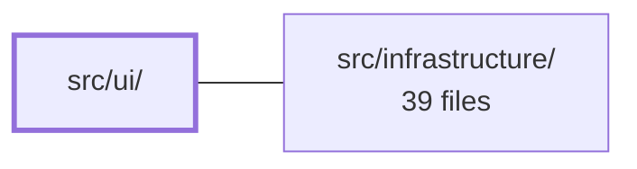

---
tags:
  - 2brain
  - 2brain/module
  - project/boilerplate-vue-frontend
type: module
module: src/ui/
files: 40
updated: 2026-10-02T19:32:32.224448+00:00
---

# src/ui/

## Purpose

`src/ui/` provides the application's presentational layer built on Vuetify. It contains reusable composables (filters, pagination, sorting, search, upload progress, focus management), small **molecule** components (inputs, alerts, pagination controls, image loaders), larger **organism** components (data tables, cards, dialogs, detail layouts, forms), and the Vuetify framework configuration that ties them together.

## Key parts

- **`composables/`** – Reusable Vue composables that encapsulate UI state logic: list search, server-side sorting, query-synced filters, deleted-filter options, URL state persistence, upload progress tracking, fullscreen dialogs, touch-friendly sizing, and return-focus handling.
- **`molecules/`** – Small, single-responsibility components: `FormImageUpload`, `FormCounterInput`, `ListPagination`, `PageSizeSelect`, `SortSelect`, `TableLoadingBar`, `InlineErrorAlert`, `LazyImage`, `PageHeader`, `DefinitionRow`, `ItemDetailField`. `page-size-options.ts` holds the shared size constants.
- **`organisms/`** – Compound components built from molecules: `DataTable`, `DialogHost`, `FormCard`, `ItemDetailHero`, `ItemDetailLayout`, `CardDetail` / `CardInfo` / `CardMaterialStat`, `TranslationTabs`, `HumanCheck`, `SecretRevealModal`. `data-table-headers.ts` defines the column configuration shared across data tables.
- **`vuetify/`** – Framework setup: component registration (`index.ts`), icon definitions (`icons.ts`), and theme/design-token selectors (`selectors.ts`).
- **`dialog.ts`** – Central dialog-state management used by `DialogHost` and any component that needs to open/close a dialog.
- **`types.ts`** – Shared TypeScript types (e.g., sort direction, filter shapes) consumed across the module.

## How it connects

- **`src/infrastructure/`** – The composables that talk to the server (`use-server-sort`, `use-list-url-state`, `use-axios-upload-progress`, `use-query-synced-filters`) depend on infrastructure-provided HTTP clients and request helpers to issue API calls for listing, filtering, sorting, and file uploads. Infrastructure in turn receives the serialized query/filter parameters this module produces.

## Where to start

1. **`src/ui/organisms/DataTable.vue`** – The most frequently used component in the app; reading it shows how molecules, composables (pagination, sorting, loading bar), and Vuetify selectors come together in a real feature.
2. **`src/ui/composables/use-query-synced-filters.ts`** – Demonstrates the composable pattern the module follows: reactive state, URL synchronisation, and integration with the infrastructure layer, all in one focused file.

## Connected modules

[[boilerplate-vue-frontend_src_infrastructure|src/infrastructure/]]

## Files
- `src/ui/composables/use-any-filter-choice.ts`
- `src/ui/composables/use-axios-upload-progress.ts`
- `src/ui/composables/use-deleted-filter-options.ts`
- `src/ui/composables/use-fullscreen-dialog.ts`
- `src/ui/composables/use-list-search.ts`
- `src/ui/composables/use-list-url-state.ts`
- `src/ui/composables/use-query-synced-filters.ts`
- `src/ui/composables/use-return-focus.ts`
- `src/ui/composables/use-server-sort.ts`
- `src/ui/composables/use-touch-friendly-size.ts`
- `src/ui/composables/use-translation-tab-order.ts`
- `src/ui/dialog.ts`
- `src/ui/molecules/DefinitionRow.vue`
- `src/ui/molecules/FormCounterInput.vue`
- `src/ui/molecules/FormImageUpload.vue`
- `src/ui/molecules/InlineErrorAlert.vue`
- `src/ui/molecules/ItemDetailField.vue`
- `src/ui/molecules/LazyImage.vue`
- `src/ui/molecules/ListPagination.vue`
- `src/ui/molecules/PageHeader.vue`
- `src/ui/molecules/PageSizeSelect.vue`
- `src/ui/molecules/SortSelect.vue`
- `src/ui/molecules/TableLoadingBar.vue`
- `src/ui/molecules/page-size-options.ts`
- `src/ui/organisms/CardDetail.vue`
- `src/ui/organisms/CardInfo.vue`
- `src/ui/organisms/CardMaterialStat.vue`
- `src/ui/organisms/DataTable.vue`
- `src/ui/organisms/DialogHost.vue`
- `src/ui/organisms/FormCard.vue`
- `src/ui/organisms/HumanCheck.vue`
- `src/ui/organisms/ItemDetailHero.vue`
- `src/ui/organisms/ItemDetailLayout.vue`
- `src/ui/organisms/SecretRevealModal.vue`
- `src/ui/organisms/TranslationTabs.vue`
- `src/ui/organisms/data-table-headers.ts`
- `src/ui/types.ts`
- `src/ui/vuetify/icons.ts`
- `src/ui/vuetify/index.ts`
- `src/ui/vuetify/selectors.ts`

---
[[boilerplate-vue-frontend_INDEX|← boilerplate-vue-frontend index]]
