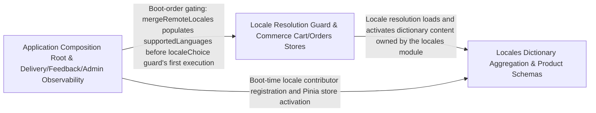

---
tags:
  - 2repo
  - 2repo/arch
  - project/boilerplate-vue-frontend
type: architecture
component: Application_Bootstrap_Domain_Stores
---

## Details

The composition root (main.ts bootstrapApplication) that wires pinia/router/i18n/vuetify to module-contributed data and boots the app as a sequenced promise chain, together with the domain module stores (cart, delivery, feedback, admin observability) that own data fetching and caching.

### Locales Dictionary Aggregation & Product Schemas
This sub-component encapsulates the locales bounded context's data layer and the products module's Zod schema definitions. It owns the full dictionary lifecycle: fetching from the API (fetchApiDictionary) or bundled fallback (fetchBundledDictionary), normalising nested locale trees via flattenDictionary / foldNumericNodes, and exposing reactive filter state (LocaleEntriesFilters) through useLocalesStore. The useDictionaryCellEditor composable provides inline-edit semantics (blur/clear handlers) for the admin dictionary editor UI. Product schemas (productsPriceSchema, productsTitleSchema) define the Zod validation contracts that the generated client and stores rely on for type-safe payload handling. Architecturally, this is the data-ownership node for the i18n domain and the schema anchor for product entities.

**Related Classes/Methods**:

- `src.modules.locales.store.useLocalesStore`:108-395
- `src.modules.locales.dictionaries.flattenDictionary`:31-39
- `src.modules.locales.composables.use-dictionary-cell-editor.useDictionaryCellEditor`:38-243
- `src.modules.products.schemas.productsPriceSchema`:25-27
- `src.modules.locales.dictionaries.foldNumericNodes`:95-111

**Source Files:**

- `src/modules/locales/composables/use-dictionary-aggregation.ts`
  - `src.modules.locales.composables.use-dictionary-aggregation.useDictionaryAggregation.entriesIndex` (L99-L108) - Class
  - `src.modules.locales.composables.use-dictionary-aggregation.useDictionaryAggregation.entriesIndex.computed() callback` (L99-L108) - Function
  - `src.modules.locales.composables.use-dictionary-aggregation.useDictionaryAggregation.entriesIndex.computed() callback.filter() callback` (L104-L104) - Function
  - `src.modules.locales.composables.use-dictionary-aggregation.useDictionaryAggregation.entriesIndex.computed() callback.map() callback` (L105-L105) - Function
  - `src.modules.locales.composables.use-dictionary-aggregation.useDictionaryAggregation.baselines` (L113-L117) - Class
  - `src.modules.locales.composables.use-dictionary-aggregation.useDictionaryAggregation.baselines.computed() callback` (L113-L117) - Function
- `src/modules/locales/composables/use-dictionary-cell-editor.ts`
  - `src.modules.locales.composables.use-dictionary-cell-editor.useDictionaryCellEditor` (L38-L243) - Function
  - `src.modules.locales.composables.use-dictionary-cell-editor.useDictionaryCellEditor.markSaved` (L86-L91) - Class
  - `src.modules.locales.composables.use-dictionary-cell-editor.useDictionaryCellEditor.markSaved.setTimeout() callback` (L88-L90) - Function
  - `src.modules.locales.composables.use-dictionary-cell-editor.useDictionaryCellEditor.settleWrite` (L102-L115) - Class
  - `src.modules.locales.composables.use-dictionary-cell-editor.useDictionaryCellEditor.settleWrite.request.then() callback` (L104-L107) - Function
  - `src.modules.locales.composables.use-dictionary-cell-editor.useDictionaryCellEditor.settleWrite.catch() callback` (L108-L115) - Function
  - `src.modules.locales.composables.use-dictionary-cell-editor.handleCellBlur` (L131-L148) - Class
  - `src.modules.locales.composables.use-dictionary-cell-editor.useDictionaryCellEditor.handleCellBlur.request.then() callback` (L146-L146) - Function
  - `src.modules.locales.composables.use-dictionary-cell-editor.handleCellClear` (L162-L197) - Class
  - `src.modules.locales.composables.use-dictionary-cell-editor.useDictionaryCellEditor.handleCellClear.then() callback` (L178-L196) - Function
  - `src.modules.locales.composables.use-dictionary-cell-editor.useDictionaryCellEditor.handleCellClear.then() callback.then() callback` (L187-L193) - Function
- `src/modules/locales/dictionaries.ts`
  - `src.modules.locales.dictionaries.flattenDictionary` (L31-L39) - Class
  - `src.modules.locales.dictionaries.flattenDictionary.flatMap() callback` (L35-L39) - Function
  - `src.modules.locales.dictionaries.foldNumericNodes` (L95-L111) - Class
  - `src.modules.locales.dictionaries.foldNumericNodes.folded` (L99-L104) - Class
  - `src.modules.locales.dictionaries.foldNumericNodes.folded.map() callback` (L100-L103) - Function
  - `src.modules.locales.dictionaries.foldNumericNodes.keys.every() callback` (L106-L106) - Function
  - `src.modules.locales.dictionaries.foldNumericNodes.keys.toSorted() callback` (L108-L108) - Function
  - `src.modules.locales.dictionaries.foldNumericNodes.map() callback` (L109-L109) - Function
- `src/modules/locales/store.ts`
  - `src.modules.locales.store.LocaleEntriesFilters` (L48-L52) - Interface
  - `src.modules.locales.store.fetchApiDictionary` (L68-L77) - Class
  - `src.modules.locales.store.fetchApiDictionary.then() callback` (L70-L75) - Function
  - `src.modules.locales.store.fetchApiDictionary.then() callback.map() callback` (L73-L73) - Function
  - `src.modules.locales.store.fetchApiDictionary.catch() callback` (L77-L77) - Function
  - `src.modules.locales.store.fetchBundledDictionary` (L86-L89) - Class
  - `src.modules.locales.store.fetchBundledDictionary.then() callback` (L87-L88) - Function
  - `src.modules.locales.store.fetchBundledDictionary.then() callback.map() callback` (L88-L88) - Function
  - `src.modules.locales.store.useLocalesStore` (L108-L395) - Class
  - `src.modules.locales.store.useLocalesStore.defineStore('locales') callback` (L108-L395) - Function
  - `src.modules.locales.store.useLocalesStore.defineStore('locales') callback.backendTenant.computed() callback` (L172-L172) - Function
  - `src.modules.locales.store.useLocalesStore.defineStore('locales') callback.backendTenant.computed() callback.tenants.value.find() callback` (L172-L172) - Function
  - `src.modules.locales.store.useLocalesStore.defineStore('locales') callback.tenantLabel.tenants.value.find() callback` (L183-L183) - Function
  - `src.modules.locales.store.useLocalesStore.defineStore('locales') callback.fetchTenants.fetchAny() callback` (L191-L195) - Function
  - `src.modules.locales.store.useLocalesStore.defineStore('locales') callback.fetchTenants.fetchAny() callback.then() callback` (L192-L195) - Function
  - `src.modules.locales.store.useLocalesStore.defineStore('locales') callback.fetchLanguages.fetchAny() callback` (L214-L220) - Function
  - `src.modules.locales.store.useLocalesStore.defineStore('locales') callback.fetchLanguages.fetchAny() callback.then() callback` (L215-L220) - Function
  - `src.modules.locales.store.useLocalesStore.defineStore('locales') callback.createLanguage.fetchAny() callback` (L230-L231) - Function
  - `src.modules.locales.store.useLocalesStore.defineStore('locales') callback.createLanguage.fetchAny() callback.then() callback.then() callback` (L231-L231) - Function
  - `src.modules.locales.store.useLocalesStore.defineStore('locales') callback.editLanguage.fetchAny() callback` (L244-L247) - Function
  - `src.modules.locales.store.useLocalesStore.defineStore('locales') callback.editLanguage.fetchAny() callback.then() callback` (L245-L246) - Function
  - `src.modules.locales.store.useLocalesStore.defineStore('locales') callback.editLanguage.fetchAny() callback.then() callback.then() callback` (L246-L246) - Function
  - `src.modules.locales.store.useLocalesStore.defineStore('locales') callback.removeLanguage.fetchAny() callback` (L260-L263) - Function
  - `src.modules.locales.store.useLocalesStore.defineStore('locales') callback.removeLanguage.fetchAny() callback.then() callback` (L263-L263) - Function
  - `src.modules.locales.store.useLocalesStore.defineStore('locales') callback.addEntry.fetchAny() callback` (L277-L283) - Function
  - `src.modules.locales.store.useLocalesStore.defineStore('locales') callback.addEntry.fetchAny() callback.then() callback` (L278-L283) - Function
  - `src.modules.locales.store.useLocalesStore.defineStore('locales') callback.editEntry.fetchAny() callback` (L295-L299) - Function
  - `src.modules.locales.store.useLocalesStore.defineStore('locales') callback.editEntry.fetchAny() callback.then() callback` (L296-L299) - Function
  - `src.modules.locales.store.useLocalesStore.defineStore('locales') callback.removeEntry.deleteTarget() callback` (L310-L310) - Function
  - `src.modules.locales.store.useLocalesStore.defineStore('locales') callback.importEntries.fetchAny() callback` (L331-L339) - Function
  - `src.modules.locales.store.useLocalesStore.defineStore('locales') callback.importEntries.fetchAny() callback.then() callback` (L335-L339) - Function
  - `src.modules.locales.store.useLocalesStore.defineStore('locales') callback.fetchAllEntries.fetchAny() callback` (L355-L364) - Function
  - `src.modules.locales.store.useLocalesStore.defineStore('locales') callback.fetchAllEntries.fetchAny() callback.collect` (L357-L362) - Class
  - `src.modules.locales.store.useLocalesStore.defineStore('locales') callback.fetchAllEntries.fetchAny() callback.collect.then() callback` (L358-L362) - Function
- `src/modules/products/schemas.ts`
  - `src.modules.products.schemas.productsTitleSchema` (L18-L20) - Class
  - `src.modules.products.schemas.productsTitleSchema.error` (L20-L20) - Method
  - `src.modules.products.schemas.productsPriceSchema` (L25-L27) - Class
  - `src.modules.products.schemas.productsPriceSchema.error` (L27-L27) - Method
- `src/modules/wishlist/store.ts`
  - `src.modules.wishlist.store.useWishlistStore.defineStore('wishlist') callback.savedProductIds` (L37-L37) - Class
  - `src.modules.wishlist.store.useWishlistStore.defineStore('wishlist') callback.savedProductIds.computed() callback` (L37-L37) - Function
  - `src.modules.wishlist.store.useWishlistStore.defineStore('wishlist') callback.savedProductIds.computed() callback.items.value.map() callback` (L37-L37) - Function
- `src/ui/dialog.ts`
  - `src.ui.dialog.useDialogStore` (L69-L102) - Class
  - `src.ui.dialog.useDialogStore.defineStore('dialog') callback` (L69-L102) - Function
  - `src.ui.dialog.useDialogStore.defineStore('dialog') callback.confirm.<function>` (L87-L89) - Function

### Locale Resolution Guard & Commerce Cart/Orders Stores
This sub-component bridges the app-shell guard layer and the commerce domain stores. The localeChoice guard (in src/app/guards/locale-choice.ts) performs language detection: it calls fetchLanguageApi to resolve the user's preferred locale, falls back on failure, and gates route access until a locale is confirmed—making it the entry-point gate for all locale-dependent rendering. The useCartStore (in src/modules/cart/store.ts) is the primary commerce store: it owns cartItems, badgeQuantity, line-item CRUD, and total computation, fetching via the generated HTTP client. The useOrdersStore (in src/modules/orders/store.ts) manages order history and status. The CoreDataTableFieldHeader / CoreDataTableSyntheticHeader components (in src/ui/organisms/data-table-headers.ts) provide the shared presentational header contract consumed by cart and orders tables. Together these form the commerce data-flow spine: guard → store fetch → reactive state → table rendering.

**Related Classes/Methods**:

- `src.app.guards.locale-choice.localeChoice`:66-96
- `src.modules.cart.store.useCartStore`:33-274
- `src.modules.orders.store.useOrdersStore`:44-210
- `src.ui.organisms.data-table-headers.CoreDataTableFieldHeader`:17-24
- `src.app.guards.locale-choice.fetchLanguageApi`:35-52

**Source Files:**

- `src/app/guards/locale-choice.ts`
  - `src.app.guards.locale-choice.fetchLanguageApi` (L35-L52) - Class
  - `src.app.guards.locale-choice.then() callback` (L45-L45) - Function
  - `src.app.guards.locale-choice.fetchLanguageApi.catch() callback` (L48-L48) - Function
  - `src.app.guards.locale-choice.fetchLanguageApi.then() callback` (L50-L50) - Function
  - `src.app.guards.locale-choice.localeChoice` (L66-L96) - Class
  - `src.app.guards.locale-choice.localeChoice.then() callback.then() callback` (L80-L80) - Function
  - `src.app.guards.locale-choice.localeChoice.then() callback` (L82-L82) - Function
- `src/infrastructure/session.ts`
  - `src.infrastructure.session.defineStore('session') callback.refreshToken` (L136-L139) - Class
  - `src.infrastructure.session.defineStore('session') callback.loadViewer` (L146-L167) - Class
- `src/modules/admin/composables/use-admin-observability.ts`
  - `src.modules.admin.composables.use-admin-observability.useAdminObservability.clearExpiredTokens.then() callback` (L228-L228) - Function
  - `src.modules.admin.composables.use-admin-observability.useAdminObservability.clearExpiredTokens.finally() callback` (L229-L231) - Function
- `src/modules/cart/store.ts`
  - `src.modules.cart.store.useCartStore` (L33-L274) - Class
  - `src.modules.cart.store.useCartStore.defineStore('cart') callback` (L33-L274) - Function
  - `src.modules.cart.store.defineStore('cart') callback.cartItems` (L54-L54) - Class
  - `src.modules.cart.store.useCartStore.defineStore('cart') callback.cartItems.computed() callback` (L54-L54) - Function
  - `src.modules.cart.store.defineStore('cart') callback.cartSummary` (L59-L59) - Class
  - `src.modules.cart.store.useCartStore.defineStore('cart') callback.cartSummary.computed() callback` (L59-L59) - Function
  - `src.modules.cart.store.defineStore('cart') callback.badgeQuantity` (L77-L77) - Class
  - `src.modules.cart.store.useCartStore.defineStore('cart') callback.badgeQuantity.computed() callback` (L77-L77) - Function
  - `src.modules.cart.store.defineStore('cart') callback.fetchSummary` (L95-L107) - Class
  - `src.modules.cart.store.useCartStore.defineStore('cart') callback.fetchSummary.then() callback` (L97-L100) - Function
  - `src.modules.cart.store.useCartStore.defineStore('cart') callback.fetchSummary.catch() callback` (L101-L107) - Function
  - `src.modules.cart.store.defineStore('cart') callback.fetchCart` (L114-L120) - Class
  - `src.modules.cart.store.useCartStore.defineStore('cart') callback.fetchCart.fetchAny() callback` (L115-L119) - Function
  - `src.modules.cart.store.useCartStore.defineStore('cart') callback.fetchCart.fetchAny() callback.then() callback` (L116-L119) - Function
  - `src.modules.cart.store.useCartStore.defineStore('cart') callback.upsertCartItemAction` (L129-L135) - Class
  - `src.modules.cart.store.useCartStore.defineStore('cart') callback.upsertCartItemAction.fetchAny() callback` (L130-L134) - Function
  - `src.modules.cart.store.useCartStore.defineStore('cart') callback.upsertCartItemAction.fetchAny() callback.then() callback` (L131-L134) - Function
  - `src.modules.cart.store.defineStore('cart') callback.updateCartItem` (L144-L150) - Class
  - `src.modules.cart.store.useCartStore.defineStore('cart') callback.updateCartItem.fetchAny() callback` (L145-L149) - Function
  - `src.modules.cart.store.useCartStore.defineStore('cart') callback.updateCartItem.fetchAny() callback.then() callback` (L146-L149) - Function
  - `src.modules.cart.store.useCartStore.defineStore('cart') callback.removeCartItemAction` (L158-L164) - Class
  - `src.modules.cart.store.useCartStore.defineStore('cart') callback.removeCartItemAction.fetchAny() callback` (L159-L163) - Function
  - `src.modules.cart.store.useCartStore.defineStore('cart') callback.removeCartItemAction.fetchAny() callback.then() callback` (L160-L163) - Function
  - `src.modules.cart.store.useCartStore.defineStore('cart') callback.clearCartAction` (L172-L178) - Class
  - `src.modules.cart.store.useCartStore.defineStore('cart') callback.clearCartAction.fetchAny() callback` (L173-L177) - Function
  - `src.modules.cart.store.useCartStore.defineStore('cart') callback.clearCartAction.fetchAny() callback.then() callback` (L174-L177) - Function
  - `src.modules.cart.store.defineStore('cart') callback.checkout` (L189-L198) - Class
  - `src.modules.cart.store.useCartStore.defineStore('cart') callback.checkout.fetchAny() callback` (L190-L197) - Function
  - `src.modules.cart.store.useCartStore.defineStore('cart') callback.checkout.fetchAny() callback.then() callback` (L191-L197) - Function
  - `src.modules.cart.store.defineStore('cart') callback.reorder` (L208-L214) - Class
  - `src.modules.cart.store.useCartStore.defineStore('cart') callback.reorder.fetchAny() callback` (L209-L213) - Function
  - `src.modules.cart.store.useCartStore.defineStore('cart') callback.reorder.fetchAny() callback.then() callback` (L210-L213) - Function
  - `src.modules.cart.store.defineStore('cart') callback.resolveTitles` (L242-L251) - Class
  - `src.modules.cart.store.useCartStore.defineStore('cart') callback.resolveTitles.filter() callback` (L245-L245) - Function
  - `src.modules.cart.store.useCartStore.defineStore('cart') callback.resolveTitles.map() callback` (L246-L249) - Function
  - `src.modules.cart.store.useCartStore.defineStore('cart') callback.resolveTitles.map() callback.then() callback` (L247-L249) - Function
  - `src.modules.cart.store.useCartStore.defineStore('cart') callback.resolveTitles.then() callback` (L251-L251) - Function
- `src/modules/orders/store.ts`
  - `src.modules.orders.store.useOrdersStore` (L44-L210) - Class
  - `src.modules.orders.store.useOrdersStore.defineStore('orders') callback` (L44-L210) - Function
  - `src.modules.orders.store.useOrdersStore.defineStore('orders') callback.hardDeleteOrder.deleteTarget() callback` (L152-L152) - Function
  - `src.modules.orders.store.useOrdersStore.defineStore('orders') callback.cancelOrder.fetchAny() callback` (L167-L173) - Function
  - `src.modules.orders.store.useOrdersStore.defineStore('orders') callback.cancelOrder.fetchAny() callback.then() callback` (L169-L172) - Function
  - `src.modules.orders.store.useOrdersStore.defineStore('orders') callback.downloadInvoice.fetchAny() callback` (L182-L182) - Function
- `src/modules/payments/store.ts`
  - `src.modules.payments.store.defineStore('payments') callback.fetchPaymentForOrder` (L40-L54) - Class
  - `src.modules.payments.store.defineStore('payments') callback.payForOrder` (L65-L73) - Class
  - `src.modules.payments.store.defineStore('payments') callback.payForOrder.fetchAny() callback.then() callback` (L68-L68) - Function
  - `src.modules.payments.store.defineStore('payments') callback.refundForOrder` (L85-L91) - Class
- `src/modules/products/store.ts`
  - `src.modules.products.store.defineStore('products') callback.hardDeleteProduct` (L169-L170) - Class
  - `src.modules.products.store.defineStore('products') callback.fetchFacets` (L187-L193) - Class
- `src/modules/wishlist/store.ts`
  - `src.modules.wishlist.store.defineStore('wishlist') callback.fetchWishlist` (L52-L58) - Class
  - `src.modules.wishlist.store.defineStore('wishlist') callback.addToWishlist` (L66-L72) - Class
  - `src.modules.wishlist.store.defineStore('wishlist') callback.removeFromWishlist` (L80-L86) - Class
  - `src.modules.wishlist.store.defineStore('wishlist') callback.moveToCart` (L96-L104) - Class
- `src/ui/organisms/data-table-headers.ts`
  - `src.ui.organisms.data-table-headers.CoreDataTableFieldHeader` (L17-L24) - Interface
  - `src.ui.organisms.data-table-headers.CoreDataTableSyntheticHeader` (L33-L41) - Interface

### Application Composition Root & Delivery/Feedback/Admin Observability
This is the composition root of the entire SPA. bootstrapApplication (in src/main.ts, lines 56–115) executes a sequenced promise chain: it initialises Pinia, Vue Router, vue-i18n, and Vuetify, registers module-contributed routes and stores, and only then mounts the application—ensuring all providers are ready before the first render. The useDeliveryStore (in src/modules/delivery/store.ts) owns delivery-slot fetching and selection state for the checkout flow. The useFeedbackStore (in src/modules/feedback/store.ts) manages user feedback submission and status. The useAdminObservability composable (in src/modules/admin/composables/use-admin-observability.ts) exposes auditEvents, auditPages, and auditTotal as reactive audit-trail data for the admin panel. Architecturally, this sub-component is the boot sequence anchor and the observability/delivery data owners—the two concerns that must be initialised before or alongside the commerce stores.

**Related Classes/Methods**:

- `src.main.bootstrapApplication`:54-105
- `src.modules.delivery.store.useDeliveryStore`:22-109
- `src.modules.feedback.store.useFeedbackStore`:24-110

**Source Files:**

- `src/infrastructure/i18n/index.ts`
  - `src.infrastructure.i18n.index.applyHtmlLocaleAttributes` (L303-L307) - Function
- `src/infrastructure/session.ts`
  - `src.infrastructure.session.defineStore('session') callback.isAdmin` (L82-L82) - Class
  - `src.infrastructure.session.defineStore('session') callback.logoutAll` (L222-L222) - Class
- `src/main.ts`
  - `src.main.bootstrapApplication` (L54-L105) - Class
  - `src.main.then() callback` (L56-L85) - Function
  - `src.main.then() callback.then() callback` (L84-L84) - Function
  - `src.main.bootstrapApplication.then() callback` (L86-L105) - Function
  - `src.main.bootstrapApplication.then() callback.then() callback` (L100-L104) - Function
  - `src.main.catch() callback` (L107-L109) - Function
- `src/modules/admin/composables/use-admin-observability.ts`
  - `src.modules.admin.composables.use-admin-observability.UseAdminObservabilityReturn` (L24-L93) - Interface
  - `src.modules.admin.composables.use-admin-observability.auditEvents` (L161-L161) - Class
  - `src.modules.admin.composables.use-admin-observability.useAdminObservability.auditEvents.computed() callback` (L161-L161) - Function
  - `src.modules.admin.composables.use-admin-observability.auditTotal` (L166-L166) - Class
  - `src.modules.admin.composables.use-admin-observability.useAdminObservability.auditTotal.computed() callback` (L166-L166) - Function
  - `src.modules.admin.composables.use-admin-observability.auditPages` (L171-L171) - Class
  - `src.modules.admin.composables.use-admin-observability.useAdminObservability.auditPages.computed() callback` (L171-L171) - Function
  - `src.modules.admin.composables.use-admin-observability.fetchHealth` (L179-L179) - Class
  - `src.modules.admin.composables.use-admin-observability.useAdminObservability.fetchHealth.then() callback` (L179-L179) - Function
  - `src.modules.admin.composables.use-admin-observability.fetchMetrics` (L184-L184) - Class
  - `src.modules.admin.composables.use-admin-observability.useAdminObservability.fetchMetrics.then() callback` (L184-L184) - Function
  - `src.modules.admin.composables.use-admin-observability.fetchAuditLogs` (L193-L194) - Class
  - `src.modules.admin.composables.use-admin-observability.useAdminObservability.fetchAuditLogs.then() callback` (L194-L194) - Function
  - `src.modules.admin.composables.use-admin-observability.fetchAll` (L201-L202) - Class
  - `src.modules.admin.composables.use-admin-observability.useAdminObservability.fetchAll.then() callback` (L202-L202) - Function
  - `src.modules.admin.composables.use-admin-observability.clearExpiredTokens` (L225-L232) - Class
- `src/modules/delivery/store.ts`
  - `src.modules.delivery.store.useDeliveryStore` (L22-L109) - Class
  - `src.modules.delivery.store.useDeliveryStore.defineStore('delivery') callback` (L22-L109) - Function
  - `src.modules.delivery.store.useDeliveryStore.defineStore('delivery') callback.fetchMethods.fetchAny() callback` (L52-L56) - Function
  - `src.modules.delivery.store.useDeliveryStore.defineStore('delivery') callback.fetchMethods.fetchAny() callback.then() callback` (L53-L56) - Function
  - `src.modules.delivery.store.useDeliveryStore.defineStore('delivery') callback.fetchShipmentForOrder.fetchAny() callback` (L77-L89) - Function
  - `src.modules.delivery.store.useDeliveryStore.defineStore('delivery') callback.fetchShipmentForOrder.fetchAny() callback.then() callback` (L79-L82) - Function
  - `src.modules.delivery.store.useDeliveryStore.defineStore('delivery') callback.fetchShipmentForOrder.fetchAny() callback.catch() callback` (L83-L89) - Function
  - `src.modules.delivery.store.useDeliveryStore.defineStore('delivery') callback.advance.fetchAny() callback` (L98-L98) - Function
  - `src.modules.delivery.store.useDeliveryStore.defineStore('delivery') callback.advance.fetchAny() callback.then() callback` (L98-L98) - Function
- `src/modules/feedback/store.ts`
  - `src.modules.feedback.store.useFeedbackStore` (L24-L110) - Class
  - `src.modules.feedback.store.useFeedbackStore.defineStore('feedback') callback` (L24-L110) - Function
  - `src.modules.feedback.store.defineStore('feedback') callback.submitContact` (L49-L50) - Class
  - `src.modules.feedback.store.useFeedbackStore.defineStore('feedback') callback.submitContact.fetchAny() callback` (L50-L50) - Function
  - `src.modules.feedback.store.defineStore('feedback') callback.fetchRequests` (L68-L76) - Class
  - `src.modules.feedback.store.useFeedbackStore.defineStore('feedback') callback.fetchRequests.fetchAny() callback` (L69-L75) - Function
  - `src.modules.feedback.store.useFeedbackStore.defineStore('feedback') callback.fetchRequests.fetchAny() callback.then() callback` (L71-L74) - Function
  - `src.modules.feedback.store.defineStore('feedback') callback.updateStatus` (L86-L89) - Class
  - `src.modules.feedback.store.useFeedbackStore.defineStore('feedback') callback.updateStatus.fetchAny() callback` (L87-L88) - Function
  - `src.modules.feedback.store.useFeedbackStore.defineStore('feedback') callback.updateStatus.fetchAny() callback.then() callback` (L88-L88) - Function
- `src/modules/locales/composables/use-dictionary-aggregation.ts`
  - `src.modules.locales.composables.use-dictionary-aggregation.applyLiveOverrides` (L23-L26) - Class
  - `src.modules.locales.composables.use-dictionary-aggregation.applyLiveOverrides.then() callback` (L25-L25) - Function
  - `src.modules.locales.composables.use-dictionary-aggregation.applyLiveOverrides.catch() callback` (L26-L26) - Function
  - `src.modules.locales.composables.use-dictionary-aggregation.useDictionaryAggregation` (L39-L231) - Function
  - `src.modules.locales.composables.use-dictionary-aggregation.tenantKind` (L47-L49) - Class
  - `src.modules.locales.composables.use-dictionary-aggregation.useDictionaryAggregation.tenantKind.computed() callback` (L48-L48) - Function
  - `src.modules.locales.composables.use-dictionary-aggregation.useDictionaryAggregation.tenantKind.computed() callback.tenants.value.find() callback` (L48-L48) - Function
  - `src.modules.locales.composables.use-dictionary-aggregation.hasBaseline` (L54-L57) - Class
  - `src.modules.locales.composables.use-dictionary-aggregation.useDictionaryAggregation.hasBaseline.computed() callback` (L55-L56) - Function
  - `src.modules.locales.composables.use-dictionary-aggregation.useDictionaryAggregation.languages.computed() callback` (L65-L66) - Function
  - `src.modules.locales.composables.use-dictionary-aggregation.languages` (L65-L67) - Class
  - `src.modules.locales.composables.use-dictionary-aggregation.useDictionaryAggregation.languages.computed() callback.capabilities.value.filter() callback` (L66-L66) - Function
  - `src.modules.locales.composables.use-dictionary-aggregation.useDictionaryAggregation.tenantOptions.computed() callback` (L72-L73) - Function
  - `src.modules.locales.composables.use-dictionary-aggregation.tenantOptions` (L72-L74) - Class
  - `src.modules.locales.composables.use-dictionary-aggregation.useDictionaryAggregation.tenantOptions.computed() callback.tenants.value.map() callback` (L73-L73) - Function
  - `src.modules.locales.composables.use-dictionary-aggregation.allKeys` (L150-L157) - Class
  - `src.modules.locales.composables.use-dictionary-aggregation.useDictionaryAggregation.allKeys.computed() callback` (L150-L157) - Function
  - `src.modules.locales.composables.use-dictionary-aggregation.useDictionaryAggregation.missingByTag.computed() callback` (L162-L168) - Function
  - `src.modules.locales.composables.use-dictionary-aggregation.missingByTag` (L162-L169) - Class
  - `src.modules.locales.composables.use-dictionary-aggregation.useDictionaryAggregation.missingByTag.computed() callback.languages.value.map() callback` (L164-L167) - Function
  - `src.modules.locales.composables.use-dictionary-aggregation.useDictionaryAggregation.missingByTag.computed() callback.languages.value.map() callback.allKeys.value.filter() callback` (L166-L166) - Function
  - `src.modules.locales.composables.use-dictionary-aggregation.loadLanguage` (L174-L183) - Class
  - `src.modules.locales.composables.use-dictionary-aggregation.useDictionaryAggregation.loadLanguage.then() callback` (L179-L183) - Function
  - `src.modules.locales.composables.use-dictionary-aggregation.loadBoard` (L188-L191) - Class
  - `src.modules.locales.composables.use-dictionary-aggregation.useDictionaryAggregation.loadBoard.then() callback` (L190-L190) - Function
  - `src.modules.locales.composables.use-dictionary-aggregation.useDictionaryAggregation.loadBoard.then() callback.languages.value.map() callback` (L190-L190) - Function
  - `src.modules.locales.composables.use-dictionary-aggregation.useDictionaryAggregation.loadBoard.catch() callback` (L191-L191) - Function
- `src/modules/locales/store.ts`
  - `src.modules.locales.store.defineStore('locales') callback.backendTenant` (L171-L173) - Class
  - `src.modules.locales.store.defineStore('locales') callback.tenantLabel` (L182-L183) - Class
  - `src.modules.locales.store.defineStore('locales') callback.fetchTenants` (L190-L196) - Class
  - `src.modules.locales.store.defineStore('locales') callback.fetchLanguages` (L213-L221) - Class
  - `src.modules.locales.store.defineStore('locales') callback.createLanguage` (L229-L232) - Class
  - `src.modules.locales.store.defineStore('locales') callback.editLanguage` (L243-L248) - Class
  - `src.modules.locales.store.defineStore('locales') callback.removeLanguage` (L259-L264) - Class
  - `src.modules.locales.store.defineStore('locales') callback.removeLanguage.fetchAny() callback.then() callback` (L262-L262) - Function
  - `src.modules.locales.store.defineStore('locales') callback.addEntry` (L276-L284) - Class
  - `src.modules.locales.store.defineStore('locales') callback.editEntry` (L294-L300) - Class
  - `src.modules.locales.store.defineStore('locales') callback.removeEntry` (L309-L310) - Class
  - `src.modules.locales.store.defineStore('locales') callback.importEntries` (L325-L340) - Class
  - `src.modules.locales.store.defineStore('locales') callback.fetchAllEntries` (L354-L364) - Class
- `src/modules/orders/store.ts`
  - `src.modules.orders.store.defineStore('orders') callback.hardDeleteOrder` (L151-L152) - Class
  - `src.modules.orders.store.defineStore('orders') callback.cancelOrder` (L166-L174) - Class
  - `src.modules.orders.store.defineStore('orders') callback.downloadInvoice` (L182-L182) - Class
