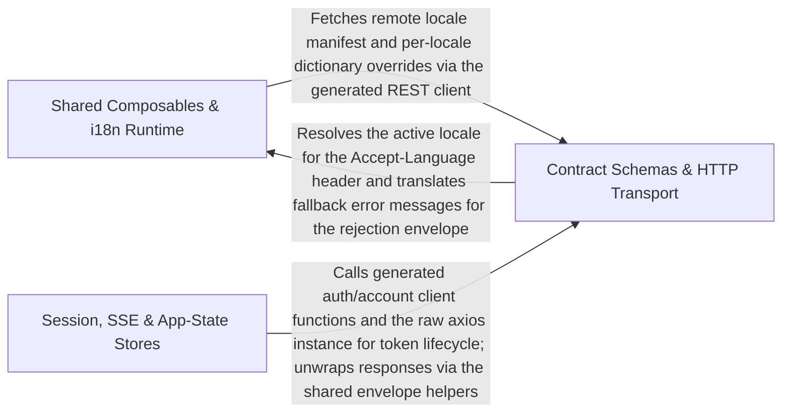

---
tags:
  - 2repo
  - 2repo/arch
  - project/boilerplate-vue-frontend
type: architecture
component: Contract_HTTP_Infrastructure
---

## Details

The contract-first layer: generated REST request/response Zod schemas (contracts.rest) and the HTTP infrastructure that consumes them — the axios client, response-schema map, token refresh, validation, SSE client, and shared composables.

### Shared Composables & i18n Runtime
The cross-cutting Vue composable and internationalization layer that every domain module reuses. Provides useApiHealth (polls the health endpoint and exposes a reactive status), useAppForm (shared form-state composable with validation settings), the full i18n engine (changeLanguage, _loadLocale, _ensureFallbackLoaded, loadBundledDictionary, getDefaultLocale) that loads locale dictionaries, applies overrides, and updates the DOM language, plus utility helpers for file uploads, structured logging, and a router-link wrapper. This group is the glue tier: it has no domain knowledge, no API schemas, and no store ownership — it provides reusable Vue reactivity and i18n plumbing.

**Related Classes/Methods**:

- `src.infrastructure.i18n.index.changeLanguage`:335-337
- `src.infrastructure.i18n.index._loadLocale`:141-161

**Source Files:**

- `src/infrastructure/i18n/index.ts`
  - `src.infrastructure.i18n.index.TranslationDictionaries` (L17-L24) - Interface
  - `src.infrastructure.i18n.index.bundledLocales.map() callback` (L42-L43) - Function
  - `src.infrastructure.i18n.index.bundledLocales` (L42-L44) - Class
  - `src.infrastructure.i18n.index.i18n.modifiers.customSnakeCase` (L112-L112) - Method
  - `src.infrastructure.i18n.index._loadLocale` (L141-L161) - Function
  - `src.infrastructure.i18n.index._loadLocale.then() callback` (L151-L155) - Function
  - `src.infrastructure.i18n.index._loadLocale.then() callback.then() callback` (L153-L154) - Function
  - `src.infrastructure.i18n.index._loadLocale.catch() callback` (L157-L157) - Function
  - `src.infrastructure.i18n.index.mergeDictionaries` (L173-L179) - Class
  - `src.infrastructure.i18n.index.mergeDictionaries.mergeWith() callback` (L177-L178) - Function
  - `src.infrastructure.i18n.index.loadBundledDictionary` (L195-L208) - Function
  - `src.infrastructure.i18n.index.loadBundledDictionary.catch() callback` (L201-L201) - Function
  - `src.infrastructure.i18n.index.loadBundledDictionary.map() callback` (L202-L202) - Function
  - `src.infrastructure.i18n.index.loadBundledDictionary.then() callback` (L203-L207) - Function
  - `src.infrastructure.i18n.index.loadLocale` (L216-L218) - Function
  - `src.infrastructure.i18n.index._updateLocale` (L228-L250) - Function
  - `src.infrastructure.i18n.index._updateLocale.map() callback` (L244-L244) - Function
  - `src.infrastructure.i18n.index._updateLocale.then() callback` (L249-L249) - Function
  - `src.infrastructure.i18n.index.updateLocale` (L259-L261) - Function
  - `src.infrastructure.i18n.index._ensureFallbackLoaded` (L275-L292) - Function
  - `src.infrastructure.i18n.index._ensureFallbackLoaded.then() callback` (L286-L287) - Function
  - `src.infrastructure.i18n.index._ensureFallbackLoaded.catch() callback` (L290-L290) - Function
  - `src.infrastructure.i18n.index._changeLanguage` (L317-L327) - Function
  - `src.infrastructure.i18n.index.then() callback` (L323-L323) - Function
  - `src.infrastructure.i18n.index._changeLanguage.then() callback` (L326-L326) - Function
  - `src.infrastructure.i18n.index.changeLanguage` (L335-L337) - Function
  - `src.infrastructure.i18n.index.getDefaultLocale` (L345-L354) - Function
- `src/infrastructure/i18n/locale-overrides.ts`
  - `src.infrastructure.i18n.locale-overrides.fetchRemoteLocales` (L74-L88) - Class
  - `src.infrastructure.i18n.locale-overrides.fetchRemoteLocales.then() callback` (L76-L86) - Function
  - `src.infrastructure.i18n.locale-overrides.fetchRemoteLocales.then() callback.response.data.locales.filter() callback` (L79-L81) - Function
  - `src.infrastructure.i18n.locale-overrides.fetchRemoteLocales.then() callback.map() callback` (L83-L86) - Function
  - `src.infrastructure.i18n.locale-overrides.fetchRemoteLocales.catch() callback` (L88-L88) - Function
  - `src.infrastructure.i18n.locale-overrides.fetchLocaleOverrides` (L99-L102) - Class
  - `src.infrastructure.i18n.locale-overrides.fetchLocaleOverrides.then() callback` (L101-L101) - Function
  - `src.infrastructure.i18n.locale-overrides.fetchLocaleOverrides.catch() callback` (L102-L102) - Function
  - `src.infrastructure.i18n.locale-overrides.mergeRemoteLocales` (L116-L123) - Class
  - `src.infrastructure.i18n.locale-overrides.mergeRemoteLocales.then() callback` (L117-L123) - Function
  - `src.infrastructure.i18n.locale-overrides.mergeRemoteLocales.then() callback.added` (L118-L118) - Class
  - `src.infrastructure.i18n.locale-overrides.mergeRemoteLocales.then() callback.added.discovered.filter() callback` (L118-L118) - Function
  - `src.infrastructure.i18n.locale-overrides.withLocaleOverrides` (L132-L136) - Class
  - `src.infrastructure.i18n.locale-overrides.withLocaleOverrides.then() callback` (L136-L136) - Function
- `src/infrastructure/i18n/router-link.ts`
  - `src.infrastructure.i18n.router-link.prefixLocalePath` (L24-L28) - Function
  - `src.infrastructure.i18n.router-link.routerLinkI18n` (L41-L57) - Function
- `src/infrastructure/utils/logger.ts`
  - `src.infrastructure.utils.logger.LogScopes` (L45-L49) - Interface
  - `src.infrastructure.utils.logger.resolveScopes` (L76-L86) - Class
  - `src.infrastructure.utils.logger.resolveScopes.map() callback` (L83-L83) - Function
- `src/infrastructure/utils/uploads.ts`
  - `src.infrastructure.utils.uploads.imageUploadSchema` (L80-L86) - Class
  - `src.infrastructure.utils.uploads.error` (L81-L81) - Method
  - `src.infrastructure.utils.uploads.imageUploadSchema.error` (L84-L84) - Method

### Contract Schemas & HTTP Transport
The architectural anchor of the subsystem. Contains the generated Zod request/response schemas that encode the OpenAPI contract in TypeScript, and the HTTP composition root that wires the shared axios instance, the orvalMutator (the single function every generated client call passes through), the 401 token-refresh-and-retry interceptor, the route→schema map that modules extend at boot, and the Zod validation gate that turns a malformed 200 into a loud rejection at the one unwrap point. This is where contract-first becomes enforceable at runtime.

**Related Classes/Methods**:

- `contracts.rest.index.AddressesResponse`:926-928
- `src.infrastructure.http.index.orvalMutator`:39-53
- `src.infrastructure.http.refresh.onResponseRejectWithRefresh`:51-79

**Source Files:**

- `contracts/rest/index.ts`
  - `contracts.rest.index.PaginationMeta` (L77-L84) - Interface
  - `contracts.rest.index.MessageResponse` (L92-L96) - Interface
  - `contracts.rest.index.ErrorItem` (L103-L110) - Interface
  - `contracts.rest.index.ErrorResponse` (L112-L122) - Interface
  - `contracts.rest.index.ValidationErrorResponse` (L124-L134) - Interface
  - `contracts.rest.index.User` (L136-L153) - Interface
  - `contracts.rest.index.UserEnvelope` (L155-L160) - Interface
  - `contracts.rest.index.Product` (L162-L192) - Interface
  - `contracts.rest.index.CartItem` (L194-L198) - Interface
  - `contracts.rest.index.OrderAddress` (L200-L207) - Interface
  - `contracts.rest.index.OrderItem` (L209-L213) - Interface
  - `contracts.rest.index.OrderActions` (L232-L239) - Interface
  - `contracts.rest.index.Order` (L241-L276) - Interface
  - `contracts.rest.index.HardDeleteRequest` (L278-L280) - Interface
  - `contracts.rest.index.HealthPing` (L291-L294) - Interface
  - `contracts.rest.index.HealthPingEnvelope` (L296-L301) - Interface
  - `contracts.rest.index.LocaleCapability` (L345-L361) - Interface
  - `contracts.rest.index.LocaleCapabilities` (L366-L371) - Interface
  - `contracts.rest.index.LocaleCapabilitiesEnvelope` (L373-L378) - Interface
  - `contracts.rest.index.CreateLocaleRequest` (L380-L388) - Interface
  - `contracts.rest.index.Language` (L393-L412) - Interface
  - `contracts.rest.index.LanguageEnvelope` (L414-L419) - Interface
  - `contracts.rest.index.LocaleTenantDescriptor` (L434-L439) - Interface
  - `contracts.rest.index.LocaleTenants` (L441-L444) - Interface
  - `contracts.rest.index.LocaleTenantsEnvelope` (L446-L451) - Interface
  - `contracts.rest.index.LocaleDictionary` (L461-L465) - Interface
  - `contracts.rest.index.LocaleDictionaryEnvelope` (L467-L472) - Interface
  - `contracts.rest.index.UpdateLocaleRequest` (L477-L484) - Interface
  - `contracts.rest.index.LocaleMessages` (L494-L500) - Interface
  - `contracts.rest.index.LocaleMessagesEnvelope` (L502-L507) - Interface
  - `contracts.rest.index.LocaleEntry` (L513-L522) - Interface
  - `contracts.rest.index.LocaleEntriesResponse` (L524-L527) - Interface
  - `contracts.rest.index.LocaleEntriesResponseEnvelope` (L529-L534) - Interface
  - `contracts.rest.index.LocaleEntryInput` (L541-L545) - Interface
  - `contracts.rest.index.ReplaceLocaleEntriesRequest` (L551-L554) - Interface
  - `contracts.rest.index.LocaleImportResult` (L559-L568) - Interface
  - `contracts.rest.index.LocaleImportResultEnvelope` (L570-L575) - Interface
  - `contracts.rest.index.CreateLocaleEntryRequest` (L577-L582) - Interface
  - `contracts.rest.index.LocaleEntryEnvelope` (L584-L589) - Interface
  - `contracts.rest.index.MergeLocaleEntriesRequest` (L594-L598) - Interface
  - `contracts.rest.index.UpdateLocaleEntryRequest` (L600-L602) - Interface
  - `contracts.rest.index.ObservabilityDependency` (L617-L619) - Interface
  - `contracts.rest.index.ObservabilityHealthDependencies` (L624-L628) - Interface
  - `contracts.rest.index.ObservabilityHealthTelemetry` (L649-L655) - Interface
  - `contracts.rest.index.ProcessMemory` (L661-L670) - Interface
  - `contracts.rest.index.ObservabilityHealthSystem` (L672-L676) - Interface
  - `contracts.rest.index.ObservabilityHealth` (L690-L707) - Interface
  - `contracts.rest.index.ObservabilityHealthResponseEnvelope` (L709-L714) - Interface
  - `contracts.rest.index.ObservabilityMetricsLatency` (L716-L721) - Interface
  - `contracts.rest.index.ObservabilityMetricsSummary` (L772-L779) - Interface
  - `contracts.rest.index.ObservabilityMetricsSummaryResponseEnvelope` (L781-L786) - Interface
  - `contracts.rest.index.AuditEventItem` (L814-L829) - Interface
  - `contracts.rest.index.AuditLogsPage` (L831-L834) - Interface
  - `contracts.rest.index.AuditLogsResponseEnvelope` (L836-L841) - Interface
  - `contracts.rest.index.UpdateAccountRequest` (L843-L852) - Interface
  - `contracts.rest.index.UpdateAccountRequestMultipart` (L854-L864) - Interface
  - `contracts.rest.index.ChangePasswordRequest` (L866-L870) - Interface
  - `contracts.rest.index.AuthTokens` (L872-L879) - Interface
  - `contracts.rest.index.AuthTokensEnvelope` (L881-L886) - Interface
  - `contracts.rest.index.ReauthRequest` (L888-L890) - Interface
  - `contracts.rest.index.Session` (L892-L900) - Interface
  - `contracts.rest.index.SessionsResponse` (L902-L904) - Interface
  - `contracts.rest.index.SessionsEnvelope` (L906-L911) - Interface
  - `contracts.rest.index.Address` (L913-L924) - Interface
  - `contracts.rest.index.AddressesResponse` (L926-L928) - Interface
  - `contracts.rest.index.AddressesEnvelope` (L930-L935) - Interface
  - `contracts.rest.index.AddressInput` (L937-L951) - Interface
  - `contracts.rest.index.UpdateAddressRequest` (L953-L967) - Interface
  - `contracts.rest.index.VerifyEmailConfirmRequest` (L969-L972) - Interface
  - `contracts.rest.index.AccountDeleteConfirmRequest` (L974-L977) - Interface
  - `contracts.rest.index.LoginRequest` (L990-L995) - Interface
  - `contracts.rest.index.MfaChallenge` (L997-L1002) - Interface
  - `contracts.rest.index.LoginResponseEnvelope` (L1009-L1014) - Interface
  - `contracts.rest.index.SignupRequest` (L1016-L1023) - Interface
  - `contracts.rest.index.SignupRequestMultipart` (L1025-L1033) - Interface
  - `contracts.rest.index.PasswordResetRequest` (L1035-L1037) - Interface
  - `contracts.rest.index.PasswordResetConfirmRequest` (L1039-L1044) - Interface
  - `contracts.rest.index.RefreshTokenResponse` (L1046-L1053) - Interface
  - `contracts.rest.index.RefreshTokenEnvelope` (L1055-L1060) - Interface
  - `contracts.rest.index.ExportPayment` (L1071-L1082) - Interface
  - `contracts.rest.index.ExportShipment` (L1091-L1099) - Interface
  - `contracts.rest.index.ExportSession` (L1107-L1112) - Interface
  - `contracts.rest.index.ExportAuditEntry` (L1141-L1156) - Interface
  - `contracts.rest.index.ExportFeedbackTicket` (L1158-L1167) - Interface
  - `contracts.rest.index.AccountExportResponse` (L1173-L1186) - Interface
  - `contracts.rest.index.AccountExportEnvelope` (L1188-L1193) - Interface
  - `contracts.rest.index.LoginTwoFactorRequest` (L1195-L1200) - Interface
  - `contracts.rest.index.TwoFactorSetup` (L1202-L1207) - Interface
  - `contracts.rest.index.TwoFactorSetupEnvelope` (L1209-L1214) - Interface
  - `contracts.rest.index.TwoFactorConfirmRequest` (L1216-L1219) - Interface
  - `contracts.rest.index.TwoFactorConfirmed` (L1221-L1224) - Interface
  - `contracts.rest.index.TwoFactorConfirmEnvelope` (L1226-L1231) - Interface
  - `contracts.rest.index.TwoFactorDisableRequest` (L1233-L1236) - Interface
  - `contracts.rest.index.OAuthProviders` (L1238-L1241) - Interface
  - `contracts.rest.index.OAuthProvidersEnvelope` (L1243-L1248) - Interface
  - `contracts.rest.index.UsersResponse` (L1250-L1253) - Interface
  - `contracts.rest.index.UsersResponseEnvelope` (L1255-L1260) - Interface
  - `contracts.rest.index.UpdateUserRequest` (L1262-L1273) - Interface
  - `contracts.rest.index.UpdateUserRequestMultipart` (L1275-L1287) - Interface
  - `contracts.rest.index.CreateUserRequest` (L1289-L1298) - Interface
  - `contracts.rest.index.CreateUserRequestMultipart` (L1300-L1310) - Interface
  - `contracts.rest.index.DeleteUserRequest` (L1312-L1315) - Interface
  - `contracts.rest.index.UpdateUserByIdRequest` (L1317-L1327) - Interface
  - `contracts.rest.index.UpdateUserByIdRequestMultipart` (L1329-L1340) - Interface
  - `contracts.rest.index.SearchUsersRequest` (L1342-L1352) - Interface
  - `contracts.rest.index.CreateFeedbackRequest` (L1354-L1364) - Interface
  - `contracts.rest.index.FeedbackRequest` (L1376-L1387) - Interface
  - `contracts.rest.index.FeedbackRequestEnvelope` (L1389-L1394) - Interface
  - `contracts.rest.index.FeedbackRequestsResponse` (L1396-L1399) - Interface
  - `contracts.rest.index.FeedbackRequestsResponseEnvelope` (L1401-L1406) - Interface
  - `contracts.rest.index.SearchFeedbackRequestsRequest` (L1408-L1414) - Interface
  - `contracts.rest.index.UpdateFeedbackRequestStatusRequest` (L1416-L1419) - Interface
  - `contracts.rest.index.ProductsResponse` (L1421-L1424) - Interface
  - `contracts.rest.index.ProductsResponseEnvelope` (L1426-L1431) - Interface
  - `contracts.rest.index.UpdateProductRequest` (L1433-L1444) - Interface
  - `contracts.rest.index.UpdateProductRequestMultipart` (L1446-L1458) - Interface
  - `contracts.rest.index.ProductEnvelope` (L1460-L1465) - Interface
  - `contracts.rest.index.CreateProductRequest` (L1467-L1479) - Interface
  - `contracts.rest.index.CreateProductRequestMultipart` (L1481-L1494) - Interface
  - `contracts.rest.index.DeleteProductRequest` (L1496-L1499) - Interface
  - `contracts.rest.index.FacetCount` (L1501-L1505) - Interface
  - `contracts.rest.index.CatalogueFacetsResponse` (L1507-L1510) - Interface
  - `contracts.rest.index.CatalogueFacetsEnvelope` (L1512-L1517) - Interface
  - `contracts.rest.index.UpdateProductByIdRequest` (L1519-L1529) - Interface
  - `contracts.rest.index.UpdateProductByIdRequestMultipart` (L1531-L1542) - Interface
  - `contracts.rest.index.SearchProductsRequest` (L1544-L1557) - Interface
  - `contracts.rest.index.CartSummaryResponse` (L1559-L1577) - Interface
  - `contracts.rest.index.CartResponse` (L1579-L1582) - Interface
  - `contracts.rest.index.CartResponseEnvelope` (L1584-L1589) - Interface
  - `contracts.rest.index.UpsertCartItemRequest` (L1591-L1595) - Interface
  - `contracts.rest.index.RemoveCartItemRequest` (L1597-L1599) - Interface
  - `contracts.rest.index.UpdateCartItemByIdRequest` (L1601-L1605) - Interface
  - `contracts.rest.index.CartSummaryResponseEnvelope` (L1607-L1612) - Interface
  - `contracts.rest.index.CheckoutRequest` (L1614-L1622) - Interface
  - `contracts.rest.index.CheckoutResponse` (L1624-L1627) - Interface
  - `contracts.rest.index.CheckoutResponseEnvelope` (L1629-L1634) - Interface
  - `contracts.rest.index.WishlistItem` (L1636-L1638) - Interface
  - `contracts.rest.index.WishlistResponse` (L1640-L1642) - Interface
  - `contracts.rest.index.WishlistResponseEnvelope` (L1644-L1649) - Interface
  - `contracts.rest.index.AddWishlistItemRequest` (L1651-L1653) - Interface
  - `contracts.rest.index.OrdersResponse` (L1655-L1658) - Interface
  - `contracts.rest.index.OrdersResponseEnvelope` (L1660-L1665) - Interface
  - `contracts.rest.index.UpdateOrderRequest` (L1682-L1690) - Interface
  - `contracts.rest.index.OrderEnvelope` (L1692-L1697) - Interface
  - `contracts.rest.index.CreateOrderRequest` (L1702-L1707) - Interface
  - `contracts.rest.index.DeleteOrderRequest` (L1709-L1712) - Interface
  - `contracts.rest.index.SearchOrdersRequest` (L1714-L1723) - Interface
  - `contracts.rest.index.UpdateOrderByIdRequest` (L1740-L1747) - Interface
  - `contracts.rest.index.CancelOrderRequest` (L1752-L1755) - Interface
  - `contracts.rest.index.CreatePaymentIntentRequest` (L1757-L1759) - Interface
  - `contracts.rest.index.PaymentActions` (L1764-L1769) - Interface
  - `contracts.rest.index.Payment` (L1783-L1803) - Interface
  - `contracts.rest.index.PaymentEnvelope` (L1805-L1810) - Interface
  - `contracts.rest.index.ConfirmPaymentRequest` (L1812-L1820) - Interface
  - `contracts.rest.index.ShippingMethod` (L1822-L1835) - Interface
  - `contracts.rest.index.ShippingMethodsResponse` (L1837-L1839) - Interface
  - `contracts.rest.index.ShippingMethodsResponseEnvelope` (L1841-L1846) - Interface
  - `contracts.rest.index.Shipment` (L1858-L1868) - Interface
  - `contracts.rest.index.ShipmentEnvelope` (L1870-L1875) - Interface
  - `contracts.rest.index.CourierAdvanceResponse` (L1877-L1883) - Interface
  - `contracts.rest.index.CourierAdvanceResponseEnvelope` (L1885-L1890) - Interface
  - `contracts.rest.index.InventoryLevel` (L1892-L1902) - Interface
  - `contracts.rest.index.InventoryLevelsResponse` (L1904-L1907) - Interface
  - `contracts.rest.index.InventoryLevelsResponseEnvelope` (L1909-L1914) - Interface
  - `contracts.rest.index.StockMovement` (L1935-L1947) - Interface
  - `contracts.rest.index.StockMovementsResponse` (L1949-L1952) - Interface
  - `contracts.rest.index.StockMovementsResponseEnvelope` (L1954-L1959) - Interface
  - `contracts.rest.index.ReceiptRequest` (L1961-L1970) - Interface
  - `contracts.rest.index.InventoryLevelEnvelope` (L1972-L1977) - Interface
  - `contracts.rest.index.AdjustmentRequest` (L1979-L1985) - Interface
  - `contracts.rest.index.ReservationSweepResponse` (L1987-L1993) - Interface
  - `contracts.rest.index.ReservationSweepEnvelope` (L1995-L2000) - Interface
  - `contracts.rest.index.createProductWithMultipart` (L3674-L3717) - Class
  - `contracts.rest.index.createProductWithMultipart.createProductRequestMultipart.categories.forEach() callback` (L3700-L3701) - Function
  - `contracts.rest.index.createProductWithMultipart.createProductRequestMultipart.tags.forEach() callback` (L3705-L3705) - Function
  - `contracts.rest.index.updateProductWithMultipart` (L3742-L3783) - Class
  - `contracts.rest.index.updateProductWithMultipart.updateProductRequestMultipart.categories.forEach() callback` (L3766-L3767) - Function
  - `contracts.rest.index.updateProductWithMultipart.updateProductRequestMultipart.tags.forEach() callback` (L3771-L3771) - Function
  - `contracts.rest.index.updateProductByIdWithMultipart` (L3854-L3895) - Class
  - `contracts.rest.index.updateProductByIdWithMultipart.updateProductByIdRequestMultipart.categories.forEach() callback` (L3878-L3879) - Function
  - `contracts.rest.index.updateProductByIdWithMultipart.updateProductByIdRequestMultipart.tags.forEach() callback` (L3883-L3883) - Function
- `src/infrastructure/http/index.ts`
  - `src.infrastructure.http.index.orvalMutator` (L39-L53) - Class
  - `src.infrastructure.http.index.orvalMutator.then() callback` (L49-L52) - Function
- `src/infrastructure/http/refresh.ts`
  - `src.infrastructure.http.refresh.onResponseRejectWithRefresh` (L51-L79) - Class
  - `src.infrastructure.http.refresh.onResponseRejectWithRefresh.then() callback` (L66-L76) - Function
  - `src.infrastructure.http.refresh.onResponseRejectWithRefresh.catch() callback` (L77-L77) - Function
- `src/infrastructure/http/response-schema-map.ts`
  - `src.infrastructure.http.response-schema-map.ResponseSchemaRoute` (L43-L47) - Interface
  - `src.infrastructure.http.response-schema-map.resolveResponseSchema` (L120-L129) - Class
  - `src.infrastructure.http.response-schema-map.resolveResponseSchema.routeSchemas.find() callback` (L127-L127) - Function
- `src/infrastructure/http/validate.ts`
  - `src.infrastructure.http.validate.validateResponseAgainstContract.issues` (L62-L64) - Class
  - `src.infrastructure.http.validate.validateResponseAgainstContract.issues.result.error.issues.map() callback` (L63-L63) - Function
- `src/infrastructure/session.ts`
  - `src.infrastructure.session.useSessionStore` (L64-L238) - Class
  - `src.infrastructure.session.useSessionStore.defineStore('session') callback` (L64-L238) - Function
  - `src.infrastructure.session.useSessionStore.defineStore('session') callback.isAuth.computed() callback` (L81-L81) - Function
  - `src.infrastructure.session.useSessionStore.defineStore('session') callback.isAdmin.computed() callback` (L82-L82) - Function
  - `src.infrastructure.session.useSessionStore.defineStore('session') callback.refreshToken.then() callback` (L137-L139) - Function
  - `src.infrastructure.session.useSessionStore.defineStore('session') callback.loadViewer.then() callback` (L147-L167) - Function
  - `src.infrastructure.session.useSessionStore.defineStore('session') callback.persistLocalePreference.then() callback` (L190-L190) - Function
  - `src.infrastructure.session.useSessionStore.defineStore('session') callback.persistLocalePreference.catch() callback` (L191-L191) - Function
  - `src.infrastructure.session.useSessionStore.defineStore('session') callback.logout.then() callback` (L215-L215) - Function
  - `src.infrastructure.session.useSessionStore.defineStore('session') callback.logoutAll.then() callback` (L222-L222) - Function

### Session, SSE & App-State Stores
The app-level state and real-time infrastructure that the HTTP transport depends on. The session store owns the in-memory access token and a minimal viewer projection, deriving isAuth/isAdmin from both together; it is the token source the refresh interceptor reads and writes. The SSE client wraps EventSource with typed AsyncAPI event names, JSON-parses each frame, and drops malformed frames. The dialog store replaces window.confirm with an async, queued, themeable promise. The observability config reads Faro/Umami settings from the environment. These stores are the state half of the infrastructure tier, consumed by both the HTTP layer and the app shell.

**Related Classes/Methods**:

- `src.infrastructure.create-sse-client.createSseClient`:67-95
- `src.infrastructure.observability.config.readFaroConfig`:103-130

**Source Files:**

- `src/app/utils/static-pages.ts`
  - `src.app.utils.static-pages.staticPageParagraphs` (L37-L44) - Class
  - `src.app.utils.static-pages.staticPageParagraphs.messages.map() callback` (L43-L43) - Function
- `src/infrastructure/create-sse-client.ts`
  - `src.infrastructure.create-sse-client.SseClientCallbacks` (L12-L29) - Interface
  - `src.infrastructure.create-sse-client.SseClient` (L34-L36) - Interface
  - `src.infrastructure.create-sse-client.createSseClient` (L67-L95) - Class
  - `src.infrastructure.create-sse-client.createSseClient.eventSource.addEventListener('open') callback` (L74-L74) - Function
  - `src.infrastructure.create-sse-client.createSseClient.eventSource.addEventListener('error') callback` (L75-L75) - Function
  - `src.infrastructure.create-sse-client.createSseClient.eventSource.addEventListener() callback` (L79-L86) - Function
  - `src.infrastructure.create-sse-client.createSseClient.close` (L93-L93) - Method
- `src/infrastructure/observability/config.ts`
  - `src.infrastructure.observability.config.FaroConfig` (L12-L31) - Interface
  - `src.infrastructure.observability.config.UmamiConfig` (L36-L45) - Interface
  - `src.infrastructure.observability.config.originToRegExp` (L53-L56) - Function
  - `src.infrastructure.observability.config.readUmamiConfig` (L64-L79) - Function
  - `src.infrastructure.observability.config.umamiOriginPattern` (L91-L95) - Function
  - `src.infrastructure.observability.config.readFaroConfig` (L103-L130) - Function
