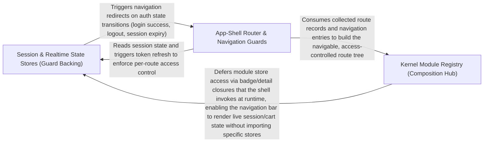

---
tags:
  - 2repo
  - 2repo/arch
  - project/boilerplate-vue-frontend
type: architecture
component: Module_Registry_App_Guards
---

## Details

The kernel module registry that turns the enabled-module list into a running app (collecting routes, navigation, response schemas, locales), plus the app-shell route guards (auth token restore, locale choice) and the account module's stores that the registry wires in.

### Session & Realtime State Stores (Guard Backing)
The reactive state the guards read and write, plus the live SSE state the observability dashboard renders. useAuthStore (account module) owns session lifecycle — login, signup, password reset — and coordinates with useSessionStore (infrastructure) which holds the access token, isAuth/isAdmin flags, and the refreshToken/loadViewer actions that tryRestoreAuth and enforceRouteAccess depend on. useRealtimeObservabilityStore (realtime module) holds the SSE connection status, latest metrics payloads, and a capped event feed, driven by the use-realtime-observability composable. These stores are the wired-in state the registry's modules contribute and the guards consume.

**Related Classes/Methods**:

- `src.modules.account.stores.auth.useAuthStore`:32-165
- `src.modules.realtime.store.useRealtimeObservabilityStore`:15-116

**Source Files:**

- `src/modules/account/stores/addresses.ts`
  - `src.modules.account.stores.addresses.useAddressesStore` (L29-L99) - Class
  - `src.modules.account.stores.addresses.useAddressesStore.defineStore('accountAddresses') callback` (L29-L99) - Function
  - `src.modules.account.stores.addresses.defineStore('accountAddresses') callback.fetchAddresses` (L58-L59) - Class
  - `src.modules.account.stores.addresses.useAddressesStore.defineStore('accountAddresses') callback.fetchAddresses.fetchAny() callback` (L59-L59) - Function
  - `src.modules.account.stores.addresses.useAddressesStore.defineStore('accountAddresses') callback.fetchAddresses.fetchAny() callback.then() callback` (L59-L59) - Function
  - `src.modules.account.stores.addresses.defineStore('accountAddresses') callback.addAddress` (L67-L68) - Class
  - `src.modules.account.stores.addresses.useAddressesStore.defineStore('accountAddresses') callback.addAddress.fetchAny() callback` (L68-L68) - Function
  - `src.modules.account.stores.addresses.useAddressesStore.defineStore('accountAddresses') callback.addAddress.fetchAny() callback.then() callback` (L68-L68) - Function
  - `src.modules.account.stores.addresses.defineStore('accountAddresses') callback.updateAddress` (L77-L80) - Class
  - `src.modules.account.stores.addresses.useAddressesStore.defineStore('accountAddresses') callback.updateAddress.fetchAny() callback` (L78-L79) - Function
  - `src.modules.account.stores.addresses.useAddressesStore.defineStore('accountAddresses') callback.updateAddress.fetchAny() callback.then() callback` (L79-L79) - Function
  - `src.modules.account.stores.addresses.defineStore('accountAddresses') callback.removeAddress` (L88-L89) - Class
  - `src.modules.account.stores.addresses.useAddressesStore.defineStore('accountAddresses') callback.removeAddress.fetchAny() callback` (L89-L89) - Function
  - `src.modules.account.stores.addresses.useAddressesStore.defineStore('accountAddresses') callback.removeAddress.fetchAny() callback.then() callback` (L89-L89) - Function
- `src/modules/account/stores/auth.ts`
  - `src.modules.account.stores.auth.useAuthStore` (L32-L165) - Class
  - `src.modules.account.stores.auth.useAuthStore.defineStore('accountAuth') callback` (L32-L165) - Function
  - `src.modules.account.stores.auth.defineStore('accountAuth') callback.login` (L49-L60) - Class
  - `src.modules.account.stores.auth.useAuthStore.defineStore('accountAuth') callback.login.fetchAny() callback` (L50-L59) - Function
  - `src.modules.account.stores.auth.defineStore('accountAuth') callback.login.fetchAny() callback.then() callback` (L56-L58) - Function
  - `src.modules.account.stores.auth.useAuthStore.defineStore('accountAuth') callback.login.fetchAny() callback.then() callback` (L59-L59) - Function
  - `src.modules.account.stores.auth.defineStore('accountAuth') callback.signup` (L83-L107) - Class
  - `src.modules.account.stores.auth.useAuthStore.defineStore('accountAuth') callback.signup.fetchAny() callback` (L99-L106) - Function
  - `src.modules.account.stores.auth.useAuthStore.defineStore('accountAuth') callback.signup.fetchAny() callback.then() callback` (L106-L106) - Function
  - `src.modules.account.stores.auth.defineStore('accountAuth') callback.requestPasswordReset` (L115-L116) - Class
  - `src.modules.account.stores.auth.useAuthStore.defineStore('accountAuth') callback.requestPasswordReset.fetchAny() callback` (L116-L116) - Function
  - `src.modules.account.stores.auth.defineStore('accountAuth') callback.confirmPasswordReset` (L126-L127) - Class
  - `src.modules.account.stores.auth.useAuthStore.defineStore('accountAuth') callback.confirmPasswordReset.fetchAny() callback` (L127-L127) - Function
  - `src.modules.account.stores.auth.defineStore('accountAuth') callback.logout` (L137-L143) - Class
  - `src.modules.account.stores.auth.useAuthStore.defineStore('accountAuth') callback.logout.then() callback` (L140-L142) - Function
  - `src.modules.account.stores.auth.defineStore('accountAuth') callback.logoutEverywhere` (L150-L155) - Class
  - `src.modules.account.stores.auth.useAuthStore.defineStore('accountAuth') callback.logoutEverywhere.then() callback` (L152-L154) - Function
- `src/modules/account/stores/oauth.ts`
  - `src.modules.account.stores.oauth.useOAuthProvidersStore` (L53-L88) - Class
  - `src.modules.account.stores.oauth.useOAuthProvidersStore.defineStore('accountOAuthProviders') callback` (L53-L88) - Function
  - `src.modules.account.stores.oauth.defineStore('accountOAuthProviders') callback.fetchProviders` (L71-L81) - Class
  - `src.modules.account.stores.oauth.useOAuthProvidersStore.defineStore('accountOAuthProviders') callback.fetchProviders.fetchAny() callback` (L73-L79) - Function
  - `src.modules.account.stores.oauth.useOAuthProvidersStore.defineStore('accountOAuthProviders') callback.fetchProviders.fetchAny() callback.then() callback` (L74-L79) - Function
  - `src.modules.account.stores.oauth.useOAuthProvidersStore.defineStore('accountOAuthProviders') callback.fetchProviders.catch() callback` (L80-L80) - Function
- `src/modules/account/stores/profile.ts`
  - `src.modules.account.stores.profile.useProfileStore` (L35-L267) - Class
  - `src.modules.account.stores.profile.useProfileStore.defineStore('accountProfile') callback` (L35-L267) - Function
  - `src.modules.account.stores.profile.defineStore('accountProfile') callback.fetchProfile` (L78-L96) - Class
  - `src.modules.account.stores.profile.useProfileStore.defineStore('accountProfile') callback.fetchProfile.fetchTarget() callback` (L80-L92) - Function
  - `src.modules.account.stores.profile.useProfileStore.defineStore('accountProfile') callback.fetchProfile.fetchTarget() callback.then() callback` (L81-L92) - Function
  - `src.modules.account.stores.profile.defineStore('accountProfile') callback.updateProfile` (L113-L141) - Class
  - `src.modules.account.stores.profile.useProfileStore.defineStore('accountProfile') callback.updateProfile.updateTarget() callback` (L116-L129) - Function
  - `src.modules.account.stores.profile.useProfileStore.defineStore('accountProfile') callback.updateProfile.updateTarget() callback.then() callback` (L124-L129) - Function
  - `src.modules.account.stores.profile.useProfileStore.defineStore('accountProfile') callback.updateProfile.then() callback` (L132-L139) - Function
  - `src.modules.account.stores.profile.useProfileStore.defineStore('accountProfile') callback.updateProfile.then() callback.then() callback` (L139-L139) - Function
  - `src.modules.account.stores.profile.defineStore('accountProfile') callback.updateOwnRole` (L170-L174) - Class
  - `src.modules.account.stores.profile.useProfileStore.defineStore('accountProfile') callback.updateOwnRole.fetchAny() callback` (L173-L173) - Function
  - `src.modules.account.stores.profile.useProfileStore.defineStore('accountProfile') callback.updateOwnRole.fetchAny() callback.then() callback` (L173-L173) - Function
  - `src.modules.account.stores.profile.defineStore('accountProfile') callback.changePassword` (L190-L195) - Class
  - `src.modules.account.stores.profile.useProfileStore.defineStore('accountProfile') callback.changePassword.fetchAny() callback` (L191-L194) - Function
  - `src.modules.account.stores.profile.useProfileStore.defineStore('accountProfile') callback.changePassword.fetchAny() callback.then() callback` (L192-L194) - Function
  - `src.modules.account.stores.profile.defineStore('accountProfile') callback.requestEmailVerification` (L203-L203) - Class
  - `src.modules.account.stores.profile.useProfileStore.defineStore('accountProfile') callback.requestEmailVerification.fetchAny() callback` (L203-L203) - Function
  - `src.modules.account.stores.profile.defineStore('accountProfile') callback.confirmEmailVerification` (L213-L218) - Class
  - `src.modules.account.stores.profile.useProfileStore.defineStore('accountProfile') callback.confirmEmailVerification.fetchAny() callback` (L214-L217) - Function
  - `src.modules.account.stores.profile.useProfileStore.defineStore('accountProfile') callback.confirmEmailVerification.fetchAny() callback.then() callback` (L215-L216) - Function
  - `src.modules.account.stores.profile.useProfileStore.defineStore('accountProfile') callback.confirmEmailVerification.fetchAny() callback.then() callback.then() callback` (L216-L216) - Function
  - `src.modules.account.stores.profile.defineStore('accountProfile') callback.requestAccountDelete` (L235-L235) - Class
  - `src.modules.account.stores.profile.useProfileStore.defineStore('accountProfile') callback.requestAccountDelete.fetchAny() callback` (L235-L235) - Function
  - `src.modules.account.stores.profile.defineStore('accountProfile') callback.confirmAccountDelete` (L244-L252) - Class
  - `src.modules.account.stores.profile.useProfileStore.defineStore('accountProfile') callback.confirmAccountDelete.fetchAny() callback` (L245-L251) - Function
  - `src.modules.account.stores.profile.useProfileStore.defineStore('accountProfile') callback.confirmAccountDelete.fetchAny() callback.then() callback` (L246-L251) - Function
- `src/modules/account/stores/sessions.ts`
  - `src.modules.account.stores.sessions.useAccountSessionsStore` (L19-L60) - Class
  - `src.modules.account.stores.sessions.useAccountSessionsStore.defineStore('accountSessions') callback` (L19-L60) - Function
  - `src.modules.account.stores.sessions.defineStore('accountSessions') callback.fetchSessions` (L35-L42) - Class
  - `src.modules.account.stores.sessions.useAccountSessionsStore.defineStore('accountSessions') callback.fetchSessions.fetchAny() callback` (L36-L41) - Function
  - `src.modules.account.stores.sessions.useAccountSessionsStore.defineStore('accountSessions') callback.fetchSessions.fetchAny() callback.then() callback` (L37-L41) - Function
  - `src.modules.account.stores.sessions.defineStore('accountSessions') callback.revokeSession` (L51-L52) - Class
  - `src.modules.account.stores.sessions.useAccountSessionsStore.defineStore('accountSessions') callback.revokeSession.fetchAny() callback` (L52-L52) - Function
  - `src.modules.account.stores.sessions.useAccountSessionsStore.defineStore('accountSessions') callback.revokeSession.fetchAny() callback.then() callback` (L52-L52) - Function
- `src/modules/admin/types.ts`
  - `src.modules.admin.types.AdminKpiCard` (L18-L27) - Interface
  - `src.modules.admin.types.AdminAuditFilters` (L32-L45) - Interface
- `src/modules/delivery/store.ts`
  - `src.modules.delivery.store.defineStore('delivery') callback.fetchMethods` (L51-L57) - Class
  - `src.modules.delivery.store.defineStore('delivery') callback.fetchShipmentForOrder` (L76-L90) - Class
  - `src.modules.delivery.store.defineStore('delivery') callback.advance` (L97-L98) - Class
- `src/modules/realtime/store.ts`
  - `src.modules.realtime.store.useRealtimeObservabilityStore` (L15-L116) - Class
  - `src.modules.realtime.store.useRealtimeObservabilityStore.defineStore('realtime-observability') callback` (L15-L116) - Function
- `src/modules/realtime/use-realtime-observability.ts`
  - `src.modules.realtime.use-realtime-observability.connect` (L37-L85) - Class
  - `src.modules.realtime.use-realtime-observability.useRealtimeObservability.connect.onOpen` (L47-L47) - Method
  - `src.modules.realtime.use-realtime-observability.useRealtimeObservability.connect.onError` (L48-L51) - Method
  - `src.modules.realtime.use-realtime-observability.useRealtimeObservability.connect.onEvent` (L52-L82) - Method
- `src/types/asyncapi.generated.ts`
  - `src.types.asyncapi.generated.ObservabilityMetricsPayload` (L8-L14) - Interface
  - `src.types.asyncapi.generated.AnonymousSchema3` (L15-L20) - Interface
  - `src.types.asyncapi.generated.AnonymousSchema8` (L21-L24) - Interface
  - `src.types.asyncapi.generated.AnonymousSchema11` (L25-L27) - Interface
  - `src.types.asyncapi.generated.SseEventPayloadMap` (L49-L53) - Interface
- `src/ui/vuetify/icons.ts`
  - `src.ui.vuetify.icons.lucideIconSet` (L121-L132) - Class
  - `src.ui.vuetify.icons.lucideIconSet.component` (L131-L131) - Method

### Kernel Module Registry (Composition Hub)
The architectural anchor of the subsystem. Defines the AppModule manifest contract (name, routes, navigation, responseSchemas, locales) and the pure collector functions that flatten the enabled-module list into the four artifacts the shell needs: route records, navigation entries (sorted and section-bucketed), response-envelope schemas, and per-locale dictionary loaders. This is the only place the shell learns about domains, and it names no specific module — enabling or dropping a domain is a change to src/modules.ts and its folder, never to the registry.

**Related Classes/Methods**:

- `src.kernel.registry.collectModuleRoutes`:179-180
- `src.kernel.registry.collectModuleNavigation`:194-195

**Source Files:**

- `src/app/guards/authentications.ts`
  - `src.app.guards.authentications.'vue-router'.RouteMeta` (L32-L40) - Interface
  - `src.app.guards.authentications.restoreTokenIfNeeded` (L77-L81) - Class
  - `src.app.guards.authentications.restoreTokenIfNeeded.catch() callback` (L80-L80) - Function
  - `src.app.guards.authentications.tryRestoreAuth` (L92-L105) - Class
  - `src.app.guards.authentications.then() callback` (L96-L100) - Function
  - `src.app.guards.authentications.tryRestoreAuth.then() callback` (L102-L102) - Function
  - `src.app.guards.authentications.tryRestoreAuth.catch() callback` (L103-L103) - Function
- `src/kernel/registry.ts`
  - `src.kernel.registry.AppNavigationEntry` (L52-L123) - Interface
  - `src.kernel.registry.AppModule` (L136-L167) - Interface
  - `src.kernel.registry.collectModuleRoutes` (L179-L180) - Class
  - `src.kernel.registry.collectModuleRoutes.appModules.flatMap() callback` (L180-L180) - Function
  - `src.kernel.registry.collectModuleNavigation` (L194-L195) - Class
  - `src.kernel.registry.collectModuleNavigation.appModules.flatMap() callback` (L195-L195) - Function
- `src/modules/cart/composables/use-line-quantity.ts`
  - `src.modules.cart.composables.use-line-quantity.useLineQuantity.senderFor.send` (L77-L90) - Class
  - `src.modules.cart.composables.use-line-quantity.useLineQuantity.senderFor.send.debounce() callback` (L77-L90) - Function
  - `src.modules.cart.composables.use-line-quantity.useLineQuantity.senderFor.send.debounce() callback.finally() callback` (L82-L89) - Function
- `src/modules/feedback/store.ts`
  - `src.modules.feedback.store.defineStore('feedback') callback.deleteRequest` (L98-L99) - Class
  - `src.modules.feedback.store.useFeedbackStore.defineStore('feedback') callback.deleteRequest.fetchAny() callback` (L99-L99) - Function
  - `src.modules.feedback.store.useFeedbackStore.defineStore('feedback') callback.deleteRequest.fetchAny() callback.then() callback` (L99-L99) - Function
- `src/modules/orders/schemas.ts`
  - `src.modules.orders.schemas.ordersStatusSchema` (L18-L20) - Class
  - `src.modules.orders.schemas.ordersStatusSchema.error` (L19-L19) - Method
  - `src.modules.orders.schemas.ordersSchema.email.error` (L29-L29) - Method
- `src/modules/payments/composables/use-order-refund.ts`
  - `src.modules.payments.composables.use-order-refund.useOrderRefund` (L25-L53) - Class
  - `src.modules.payments.composables.use-order-refund.useOrderRefund.watch() callback` (L31-L33) - Function
  - `src.modules.payments.composables.use-order-refund.useOrderRefund.canRefund.computed() callback` (L41-L41) - Function
  - `src.modules.payments.composables.use-order-refund.useOrderRefund.refund` (L48-L51) - Method
  - `src.modules.payments.composables.use-order-refund.useOrderRefund.refund.then() callback` (L50-L50) - Function
- `src/modules/payments/store.ts`
  - `src.modules.payments.store.usePaymentsStore` (L21-L100) - Class
  - `src.modules.payments.store.usePaymentsStore.defineStore('payments') callback` (L21-L100) - Function
  - `src.modules.payments.store.usePaymentsStore.defineStore('payments') callback.fetchPaymentForOrder.fetchAny() callback` (L41-L53) - Function
  - `src.modules.payments.store.usePaymentsStore.defineStore('payments') callback.fetchPaymentForOrder.fetchAny() callback.then() callback` (L43-L46) - Function
  - `src.modules.payments.store.usePaymentsStore.defineStore('payments') callback.fetchPaymentForOrder.fetchAny() callback.catch() callback` (L47-L53) - Function
  - `src.modules.payments.store.usePaymentsStore.defineStore('payments') callback.payForOrder.fetchAny() callback` (L66-L72) - Function
  - `src.modules.payments.store.usePaymentsStore.defineStore('payments') callback.payForOrder.fetchAny() callback.then() callback` (L69-L72) - Function
  - `src.modules.payments.store.usePaymentsStore.defineStore('payments') callback.refundForOrder.fetchAny() callback` (L86-L90) - Function
  - `src.modules.payments.store.usePaymentsStore.defineStore('payments') callback.refundForOrder.fetchAny() callback.then() callback` (L87-L90) - Function
- `src/modules/products/store.ts`
  - `src.modules.products.store.useProductsStore` (L44-L221) - Class
  - `src.modules.products.store.useProductsStore.defineStore('products') callback` (L44-L221) - Function
  - `src.modules.products.store.useProductsStore.defineStore('products') callback.hardDeleteProduct.deleteTarget() callback` (L170-L170) - Function
  - `src.modules.products.store.useProductsStore.defineStore('products') callback.fetchFacets.fetchAny() callback` (L188-L192) - Function
  - `src.modules.products.store.useProductsStore.defineStore('products') callback.fetchFacets.fetchAny() callback.then() callback` (L189-L192) - Function
- `src/modules/users/schemas.ts`
  - `src.modules.users.schemas.usersEmailSchema` (L13-L13) - Class
  - `src.modules.users.schemas.usersEmailSchema.error` (L13-L13) - Method
  - `src.modules.users.schemas.refine() callback` (L29-L29) - Function
- `src/modules/users/store.ts`
  - `src.modules.users.store.useUsersStore` (L43-L169) - Class
  - `src.modules.users.store.useUsersStore.defineStore('users') callback` (L43-L169) - Function
  - `src.modules.users.store.defineStore('users') callback.hardDeleteUser` (L142-L143) - Class
  - `src.modules.users.store.useUsersStore.defineStore('users') callback.hardDeleteUser.deleteTarget() callback` (L143-L143) - Function
- `src/modules/wishlist/store.ts`
  - `src.modules.wishlist.store.useWishlistStore` (L22-L116) - Class
  - `src.modules.wishlist.store.useWishlistStore.defineStore('wishlist') callback` (L22-L116) - Function
  - `src.modules.wishlist.store.useWishlistStore.defineStore('wishlist') callback.fetchWishlist.fetchAny() callback` (L53-L57) - Function
  - `src.modules.wishlist.store.useWishlistStore.defineStore('wishlist') callback.fetchWishlist.fetchAny() callback.then() callback` (L54-L57) - Function
  - `src.modules.wishlist.store.useWishlistStore.defineStore('wishlist') callback.addToWishlist.fetchAny() callback` (L67-L71) - Function
  - `src.modules.wishlist.store.useWishlistStore.defineStore('wishlist') callback.addToWishlist.fetchAny() callback.then() callback` (L68-L71) - Function
  - `src.modules.wishlist.store.useWishlistStore.defineStore('wishlist') callback.removeFromWishlist.fetchAny() callback` (L81-L85) - Function
  - `src.modules.wishlist.store.useWishlistStore.defineStore('wishlist') callback.removeFromWishlist.fetchAny() callback.then() callback` (L82-L85) - Function
  - `src.modules.wishlist.store.useWishlistStore.defineStore('wishlist') callback.moveToCart.fetchAny() callback` (L97-L103) - Function
  - `src.modules.wishlist.store.useWishlistStore.defineStore('wishlist') callback.moveToCart.fetchAny() callback.then() callback` (L98-L103) - Function
  - `src.modules.wishlist.store.useWishlistStore.defineStore('wishlist') callback.moveToCart.fetchAny() callback.then() callback.then() callback` (L102-L102) - Function

### App-Shell Router & Navigation Guards
The runtime consumer of the registry. Builds the locale-prefixed route tree by splicing collectModuleRoutes(enabledModules) under /:locale, owns the shell-only routes (Home, static pages, Error, 404 catch-all), and installs the ordered guard pipeline: beforeEach runs tryRestoreAuth then enforceRouteAccess, beforeResolve runs localeChoice, and afterEach sets the tab title, a11y announcement, and focus. Also owns the global onError handler that maps 401/403/5xx to meaningful redirects. This is where the registry's output becomes a navigable, access-controlled, localized app.

**Related Classes/Methods**:

- `src.app.router.index.router`:49-169

**Source Files:**

- `src/app/router/index.ts`
  - `src.app.router.index.router` (L49-L169) - Class
  - `src.app.router.index.router.scrollBehavior` (L63-L69) - Method
  - `src.app.router.index.routes.redirect` (L73-L78) - Method
  - `src.app.router.index.routes.children.component` (L102-L102) - Method
  - `src.app.router.index.router.routes.children.component` (L138-L138) - Method
  - `src.app.router.index.router.routes.children.redirect` (L145-L152) - Method
  - `src.app.router.index.router.routes.redirect` (L159-L166) - Method
  - `src.app.router.index.router.onError() callback` (L191-L232) - Function
  - `src.app.router.index.router.beforeEach() callback` (L247-L252) - Function
  - `src.app.router.index.router.beforeEach() callback.then() callback` (L251-L251) - Function
  - `src.app.router.index.router.afterEach() callback` (L275-L288) - Function
- `src/infrastructure/observability/store.ts`
  - `src.infrastructure.observability.store.UmamiTracker` (L27-L29) - Interface
  - `src.infrastructure.observability.store.useObservabilityStore` (L41-L210) - Class
  - `src.infrastructure.observability.store.useObservabilityStore.defineStore('observability') callback` (L41-L210) - Function
  - `src.infrastructure.observability.store.defineStore('observability') callback.initFaro` (L66-L112) - Class
  - `src.infrastructure.observability.store.useObservabilityStore.defineStore('observability') callback.initFaro.then() callback` (L77-L109) - Function
  - `src.infrastructure.observability.store.normalizeContext` (L218-L220) - Function
  - `src.infrastructure.observability.store.normalizeContext.mapValues() callback` (L219-L219) - Function
- `src/infrastructure/session.ts`
  - `src.infrastructure.session.SessionViewer` (L31-L46) - Interface
  - `src.infrastructure.session.defineStore('session') callback.isAuth` (L81-L81) - Class
  - `src.infrastructure.session.defineStore('session') callback.persistLocalePreference` (L187-L192) - Class
  - `src.infrastructure.session.defineStore('session') callback.logout` (L215-L215) - Class
- `src/kernel/registry.ts`
  - `src.kernel.registry.sortNavigation` (L205-L210) - Class
  - `src.kernel.registry.sortNavigation.entries.toSorted() callback` (L208-L209) - Function
  - `src.kernel.registry.collectModuleResponseSchemas` (L241-L242) - Class
  - `src.kernel.registry.collectModuleResponseSchemas.appModules.flatMap() callback` (L242-L242) - Function
- `src/modules/demo/store.ts`
  - `src.modules.demo.store.useDemoStore` (L13-L51) - Class
  - `src.modules.demo.store.useDemoStore.defineStore('counter') callback` (L13-L51) - Function
  - `src.modules.demo.store.defineStore('counter') callback.doubleCount` (L22-L22) - Class
  - `src.modules.demo.store.useDemoStore.defineStore('counter') callback.doubleCount.computed() callback` (L22-L22) - Function
  - `src.modules.demo.store.defineStore('counter') callback.increment` (L27-L29) - Function
  - `src.modules.demo.store.defineStore('counter') callback.incrementDelayed` (L36-L43) - Function
  - `src.modules.demo.store.useDemoStore.defineStore('counter') callback.incrementDelayed.<function>` (L37-L42) - Function
  - `src.modules.demo.store.useDemoStore.defineStore('counter') callback.incrementDelayed.<function>.setTimeout() callback` (L38-L41) - Function
- `src/modules/inventory/store.ts`
  - `src.modules.inventory.store.useInventoryStore` (L46-L195) - Class
  - `src.modules.inventory.store.useInventoryStore.defineStore('inventory') callback` (L46-L195) - Function
  - `src.modules.inventory.store.defineStore('inventory') callback.fetchMovements` (L98-L106) - Class
  - `src.modules.inventory.store.useInventoryStore.defineStore('inventory') callback.fetchMovements.fetchAny() callback` (L99-L106) - Function
  - `src.modules.inventory.store.useInventoryStore.defineStore('inventory') callback.fetchMovements.fetchAny() callback.then() callback` (L101-L105) - Function
  - `src.modules.inventory.store.defineStore('inventory') callback.fetchLevels` (L115-L123) - Class
  - `src.modules.inventory.store.useInventoryStore.defineStore('inventory') callback.fetchLevels.fetchAny() callback` (L116-L123) - Function
  - `src.modules.inventory.store.useInventoryStore.defineStore('inventory') callback.fetchLevels.fetchAny() callback.then() callback` (L118-L122) - Function
  - `src.modules.inventory.store.defineStore('inventory') callback.receive` (L133-L138) - Class
  - `src.modules.inventory.store.useInventoryStore.defineStore('inventory') callback.receive.fetchAny() callback` (L134-L137) - Function
  - `src.modules.inventory.store.useInventoryStore.defineStore('inventory') callback.receive.fetchAny() callback.then() callback` (L135-L136) - Function
  - `src.modules.inventory.store.defineStore('inventory') callback.adjust` (L148-L153) - Class
  - `src.modules.inventory.store.useInventoryStore.defineStore('inventory') callback.adjust.fetchAny() callback` (L149-L152) - Function
  - `src.modules.inventory.store.useInventoryStore.defineStore('inventory') callback.adjust.fetchAny() callback.then() callback` (L150-L151) - Function
  - `src.modules.inventory.store.defineStore('inventory') callback.sweep` (L160-L167) - Class
  - `src.modules.inventory.store.useInventoryStore.defineStore('inventory') callback.sweep.fetchAny() callback` (L161-L166) - Function
  - `src.modules.inventory.store.useInventoryStore.defineStore('inventory') callback.sweep.fetchAny() callback.then() callback` (L162-L165) - Function
  - `src.modules.inventory.store.defineStore('inventory') callback.sweep.fetchAny() callback.then() callback.then() callback` (L164-L164) - Function
  - `src.modules.inventory.store.useInventoryStore.defineStore('inventory') callback.sweep.fetchAny() callback.then() callback.then() callback` (L165-L165) - Function
  - `src.modules.inventory.store.useInventoryStore.defineStore('inventory') callback.reloadAfterWrite` (L178-L181) - Class
  - `src.modules.inventory.store.defineStore('inventory') callback.reloadAfterWrite.then() callback` (L180-L180) - Function
  - `src.modules.inventory.store.useInventoryStore.defineStore('inventory') callback.reloadAfterWrite.then() callback` (L181-L181) - Function
- `src/modules/users/schemas.ts`
  - `src.modules.users.schemas.usersUsernameSchema` (L18-L20) - Class
  - `src.modules.users.schemas.usersUsernameSchema.error` (L20-L20) - Method
  - `src.modules.users.schemas.usersPasswordSchema` (L26-L40) - Class
  - `src.modules.users.schemas.usersPasswordSchema.refine() callback` (L38-L38) - Function
  - `src.modules.users.schemas.usersPasswordSchema.error` (L39-L39) - Method
- `src/types/http.ts`
  - `src.types.http.ResponseNeutral` (L13-L26) - Interface
  - `src.types.http.ResponseSuccess` (L31-L39) - Interface
  - `src.types.http.ResponseReject` (L45-L56) - Interface
