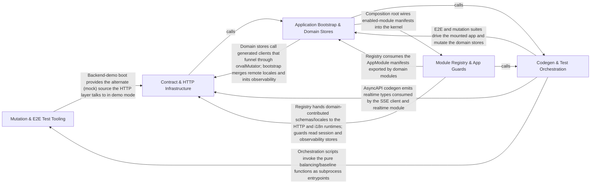

---
tags:
  - 2repo
  - 2repo/arch
  - project/boilerplate-vue-frontend
type: architecture
component: overview
---

## Details

This is a contract-first Vue 3 SPA scaffold whose architecture flows top-down from the OpenAPI/AsyncAPI contract through generated types and schemas into a layered runtime. The Contract & HTTP Infrastructure layer (Group 3) anchors the design: generated REST Zod schemas and the axios client, response-schema map, token refresh, validation, and SSE client form the shared data plane. The Module Registry & App Guards (Group 2) acts as the kernel hub, collecting each domain module's routes, navigation, response schemas, and locales into a single app, while app-shell guards restore auth and locale. The Application Bootstrap & Domain Stores (Group 4) is the composition root that wires pinia/router/i18n/vuetify and boots the app, with domain stores (cart, delivery, feedback, admin) owning data fetching and caching. The two build-time groups — Mutation & E2E Test Tooling (Group 1) and Codegen & Test Orchestration (Group 5) — close the loop by generating the AsyncAPI realtime types from the spec, sharding and balancing the Cypress e2e suite, running and baselining mutation tests, and verifying contract spec identity, making the quality/testing pipeline and mock/demo mode first-class architectural elements.

### Mutation & E2E Test Tooling
Build-time quality-gate scripts that manage the mutation-testing baseline, balance and shard the Cypress e2e suite, boot the paired backend demo, and verify contract spec identity.

**Related Classes/Methods**:

- `scripts.mutation-baseline.MutationBaseline`:61-66
- `scripts.mutation-baseline.compareToBaseline`:139-158
- `scripts.e2e-shard-balancer.weighSpecs`:63-69
- `scripts.run-backend-demo.boot`:33-64

**Source Files:**

- `scripts/check-mutation-baseline.ts`
  - `scripts.check-mutation-baseline.map() callback` (L62-L62) - Function
  - `scripts.check-mutation-baseline.counts.held.comparisons.filter() callback` (L73-L73) - Function
  - `scripts.check-mutation-baseline.counts.improved.comparisons.filter() callback` (L74-L74) - Function
  - `scripts.check-mutation-baseline.counts.added.comparisons.filter() callback` (L75-L75) - Function
  - `scripts.check-mutation-baseline.counts.removed.comparisons.filter() callback` (L76-L76) - Function
  - `scripts.check-mutation-baseline.comparisons.filter() callback` (L93-L93) - Function
- `scripts/e2e-shard-balancer.ts`
  - `scripts.e2e-shard-balancer.Spec` (L9-L12) - Interface
  - `scripts.e2e-shard-balancer.WeightedSpec` (L15-L18) - Interface
  - `scripts.e2e-shard-balancer.Shard` (L21-L24) - Interface
  - `scripts.e2e-shard-balancer.weighSpecs` (L63-L69) - Class
  - `scripts.e2e-shard-balancer.weighSpecs.mean` (L65-L65) - Class
  - `scripts.e2e-shard-balancer.weighSpecs.mean.known.reduce() callback` (L65-L65) - Function
  - `scripts.e2e-shard-balancer.weighSpecs.specs.map() callback` (L67-L67) - Function
  - `scripts.e2e-shard-balancer.weighSpecs.toSorted() callback` (L68-L68) - Function
- `scripts/generate-asyncapi-types.ts`
  - `scripts.generate-asyncapi-types.renderPayloadMap.rows` (L188-L192) - Class
  - `scripts.generate-asyncapi-types.renderPayloadMap.rows.entries.map() callback` (L190-L190) - Function
- `scripts/mutation-baseline.ts`
  - `scripts.mutation-baseline.MutationReport` (L57-L59) - Interface
  - `scripts.mutation-baseline.MutationBaseline` (L61-L66) - Interface
  - `scripts.mutation-baseline.FileComparison` (L70-L75) - Interface
  - `scripts.mutation-baseline.scoresFromReport.scored` (L93-L93) - Class
  - `scripts.mutation-baseline.scoresFromReport.scored.mutants.filter() callback` (L93-L93) - Function
  - `scripts.mutation-baseline.scoresFromReport.killed` (L101-L101) - Class
  - `scripts.mutation-baseline.scoresFromReport.killed.scored.filter() callback` (L101-L101) - Function
  - `scripts.mutation-baseline.compareToBaseline` (L139-L158) - Class
  - `scripts.mutation-baseline.compareToBaseline.files.map() callback` (L146-L157) - Function
  - `scripts.mutation-baseline.missingFromReport` (L172-L178) - Class
  - `scripts.mutation-baseline.missingFromReport.filter() callback` (L177-L177) - Function
- `scripts/run-backend-demo.ts`
  - `scripts.run-backend-demo.boot` (L33-L64) - Class
  - `scripts.run-backend-demo.boot.process.on() callback` (L55-L57) - Function
  - `scripts.run-backend-demo.boot.child.on('close') callback` (L59-L63) - Function
  - `scripts.run-backend-demo.setInterval() callback` (L77-L77) - Function
- `scripts/run-e2e-shards.ts`
  - `scripts.run-e2e-shards.specs` (L80-L85) - Class
  - `scripts.run-e2e-shards.map() callback` (L83-L83) - Function
  - `scripts.run-e2e-shards.specs.map() callback` (L85-L85) - Function
  - `scripts.run-e2e-shards.active` (L90-L90) - Class
  - `scripts.run-e2e-shards.active.shards.filter() callback` (L90-L90) - Function
  - `scripts.run-e2e-shards.active.map() callback` (L94-L94) - Function
  - `scripts.run-e2e-shards.weighted.reduce() callback` (L95-L95) - Function
  - `scripts.run-e2e-shards.bootDemoBackends` (L135-L250) - Class
  - `scripts.run-e2e-shards.children.Array.from() callback.log` (L168-L168) - Method
  - `scripts.run-e2e-shards.bootDemoBackends.process.on() callback` (L223-L226) - Function
  - `scripts.run-e2e-shards.runShard` (L258-L288) - Class
  - `scripts.run-e2e-shards.runShard.<function>` (L259-L288) - Function
  - `scripts.run-e2e-shards.runShard.<function>.setTimeout() callback` (L265-L287) - Function
  - `scripts.run-e2e-shards.runShard.<function>.setTimeout() callback.cypress.stdout.on('data') callback` (L277-L277) - Function
  - `scripts.run-e2e-shards.runShard.<function>.setTimeout() callback.cypress.stderr.on('data') callback` (L278-L278) - Function
  - `scripts.run-e2e-shards.runShard.<function>.setTimeout() callback.cypress.on('close') callback` (L279-L285) - Function
  - `scripts.run-e2e-shards.main.results` (L293-L293) - Class
  - `scripts.run-e2e-shards.main.results.active.map() callback` (L293-L293) - Function
  - `scripts.run-e2e-shards.main.failed` (L317-L317) - Class
  - `scripts.run-e2e-shards.main.failed.results.filter() callback` (L317-L317) - Function
- `scripts/spec-identity.ts`
  - `scripts.spec-identity.SharedFile` (L29-L34) - Interface
  - `scripts.spec-identity.SpecComparison` (L91-L101) - Interface
  - `scripts.spec-identity.normalise` (L122-L134) - Class
  - `scripts.spec-identity.normalise.value.map() callback` (L123-L123) - Function
  - `scripts.spec-identity.compareSharedFiles` (L170-L200) - Class
  - `scripts.spec-identity.compareSharedFiles.SHARED_FILES.map() callback` (L175-L200) - Function
  - `scripts.spec-identity.sharedFileProblems` (L203-L204) - Class
  - `scripts.spec-identity.sharedFileProblems.comparisons.filter() callback` (L204-L204) - Function
  - `scripts.spec-identity.formatSharedFileProblems.lines` (L221-L237) - Class
  - `scripts.spec-identity.formatSharedFileProblems.lines.problems.map() callback` (L221-L237) - Function
- `src/modules/cart/domain/checkout-errors.ts`
  - `src.modules.cart.domain.checkout-errors.CheckoutShortfallLine` (L10-L15) - Interface
  - `src.modules.cart.domain.checkout-errors.lines` (L77-L79) - Class
  - `src.modules.cart.domain.checkout-errors.classifyCheckoutError.lines.filter() callback` (L78-L78) - Function
  - `src.modules.cart.domain.checkout-errors.classifyCheckoutError.lines.rawLines.map() callback` (L78-L78) - Function
- `src/modules/cart/store.ts`
  - `src.modules.cart.store.useCartStore.defineStore('cart') callback.liveSummary` (L71-L71) - Class
  - `src.modules.cart.store.useCartStore.defineStore('cart') callback.liveSummary.computed() callback` (L71-L71) - Function
  - `src.modules.cart.store.defineStore('cart') callback.badgeTotal` (L82-L82) - Class
  - `src.modules.cart.store.useCartStore.defineStore('cart') callback.badgeTotal.computed() callback` (L82-L82) - Function
  - `src.modules.cart.store.defineStore('cart') callback.badgeCurrency` (L87-L87) - Class
  - `src.modules.cart.store.useCartStore.defineStore('cart') callback.badgeCurrency.computed() callback` (L87-L87) - Function
- `src/modules/demo/module.ts`
  - `src.modules.demo.module.'@/infrastructure/utils/logger.ts'.LogScopes` (L17-L19) - Interface
- `src/modules/demo/provided.ts`
  - `src.modules.demo.provided.ProvidedVariableContext` (L31-L34) - Interface
- `src/modules/locales/schemas.ts`
  - `src.modules.locales.schemas.tag.error` (L37-L37) - Method
  - `src.modules.locales.schemas.localesLanguageSchema.tag.error` (L38-L38) - Method
  - `src.modules.locales.schemas.localesLanguageSchema.name.error` (L39-L39) - Method
  - `src.modules.locales.schemas.localesLanguageSchema.nativeName.error` (L40-L40) - Method
  - `src.modules.locales.schemas.localesEntrySchema.tenant.error` (L58-L58) - Method
  - `src.modules.locales.schemas.localesEntrySchema.key.error` (L59-L59) - Method
  - `src.modules.locales.schemas.localesEntrySchema.value.error` (L60-L60) - Method
- `src/types/realtime.ts`
  - `src.types.realtime.RealtimeMetricsEntry` (L13-L30) - Interface

### Module Registry & App Guards [[Expand]](./Module_Registry_App_Guards.md)
The kernel module registry that turns the enabled-module list into a running app (collecting routes, navigation, response schemas, locales), plus the app-shell route guards (auth token restore, locale choice) and the account module's stores that the registry wires in.

**Related Classes/Methods**:

- `src.kernel.registry.AppModule`:136-167
- `src.kernel.registry.collectModuleRoutes`:179-180
- `src.kernel.registry.collectModuleNavigation`:194-195
- `src.app.guards.authentications.tryRestoreAuth`:92-105

**Source Files:**

- `src/app/guards/authentications.ts`
  - `src.app.guards.authentications.'vue-router'.RouteMeta` (L32-L40) - Interface
  - `src.app.guards.authentications.restoreTokenIfNeeded` (L77-L81) - Class
  - `src.app.guards.authentications.restoreTokenIfNeeded.catch() callback` (L80-L80) - Function
  - `src.app.guards.authentications.tryRestoreAuth` (L92-L105) - Class
  - `src.app.guards.authentications.then() callback` (L96-L100) - Function
  - `src.app.guards.authentications.tryRestoreAuth.then() callback` (L102-L102) - Function
  - `src.app.guards.authentications.tryRestoreAuth.catch() callback` (L103-L103) - Function
- `src/app/router/index.ts`
  - `src.app.router.index.router` (L49-L169) - Class
  - `src.app.router.index.router.scrollBehavior` (L63-L69) - Method
  - `src.app.router.index.routes.redirect` (L73-L78) - Method
  - `src.app.router.index.routes.children.component` (L102-L102) - Method
  - `src.app.router.index.router.routes.children.component` (L138-L138) - Method
  - `src.app.router.index.router.routes.children.redirect` (L145-L152) - Method
  - `src.app.router.index.router.routes.redirect` (L159-L166) - Method
  - `src.app.router.index.router.onError() callback` (L191-L232) - Function
  - `src.app.router.index.router.beforeEach() callback` (L247-L252) - Function
  - `src.app.router.index.router.beforeEach() callback.then() callback` (L251-L251) - Function
  - `src.app.router.index.router.afterEach() callback` (L275-L288) - Function
- `src/infrastructure/observability/store.ts`
  - `src.infrastructure.observability.store.UmamiTracker` (L27-L29) - Interface
  - `src.infrastructure.observability.store.useObservabilityStore` (L41-L210) - Class
  - `src.infrastructure.observability.store.useObservabilityStore.defineStore('observability') callback` (L41-L210) - Function
  - `src.infrastructure.observability.store.defineStore('observability') callback.initFaro` (L66-L112) - Class
  - `src.infrastructure.observability.store.useObservabilityStore.defineStore('observability') callback.initFaro.then() callback` (L77-L109) - Function
  - `src.infrastructure.observability.store.normalizeContext` (L218-L220) - Function
  - `src.infrastructure.observability.store.normalizeContext.mapValues() callback` (L219-L219) - Function
- `src/infrastructure/session.ts`
  - `src.infrastructure.session.SessionViewer` (L31-L46) - Interface
  - `src.infrastructure.session.defineStore('session') callback.isAuth` (L81-L81) - Class
  - `src.infrastructure.session.defineStore('session') callback.persistLocalePreference` (L187-L192) - Class
  - `src.infrastructure.session.defineStore('session') callback.logout` (L215-L215) - Class
- `src/kernel/registry.ts`
  - `src.kernel.registry.AppNavigationEntry` (L52-L123) - Interface
  - `src.kernel.registry.AppModule` (L136-L167) - Interface
  - `src.kernel.registry.collectModuleRoutes` (L179-L180) - Class
  - `src.kernel.registry.collectModuleRoutes.appModules.flatMap() callback` (L180-L180) - Function
  - `src.kernel.registry.collectModuleNavigation` (L194-L195) - Class
  - `src.kernel.registry.collectModuleNavigation.appModules.flatMap() callback` (L195-L195) - Function
  - `src.kernel.registry.sortNavigation` (L205-L210) - Class
  - `src.kernel.registry.sortNavigation.entries.toSorted() callback` (L208-L209) - Function
  - `src.kernel.registry.collectModuleResponseSchemas` (L241-L242) - Class
  - `src.kernel.registry.collectModuleResponseSchemas.appModules.flatMap() callback` (L242-L242) - Function
- `src/modules/account/stores/addresses.ts`
  - `src.modules.account.stores.addresses.useAddressesStore` (L29-L99) - Class
  - `src.modules.account.stores.addresses.useAddressesStore.defineStore('accountAddresses') callback` (L29-L99) - Function
  - `src.modules.account.stores.addresses.defineStore('accountAddresses') callback.fetchAddresses` (L58-L59) - Class
  - `src.modules.account.stores.addresses.useAddressesStore.defineStore('accountAddresses') callback.fetchAddresses.fetchAny() callback` (L59-L59) - Function
  - `src.modules.account.stores.addresses.useAddressesStore.defineStore('accountAddresses') callback.fetchAddresses.fetchAny() callback.then() callback` (L59-L59) - Function
  - `src.modules.account.stores.addresses.defineStore('accountAddresses') callback.addAddress` (L67-L68) - Class
  - `src.modules.account.stores.addresses.useAddressesStore.defineStore('accountAddresses') callback.addAddress.fetchAny() callback` (L68-L68) - Function
  - `src.modules.account.stores.addresses.useAddressesStore.defineStore('accountAddresses') callback.addAddress.fetchAny() callback.then() callback` (L68-L68) - Function
  - `src.modules.account.stores.addresses.defineStore('accountAddresses') callback.updateAddress` (L77-L80) - Class
  - `src.modules.account.stores.addresses.useAddressesStore.defineStore('accountAddresses') callback.updateAddress.fetchAny() callback` (L78-L79) - Function
  - `src.modules.account.stores.addresses.useAddressesStore.defineStore('accountAddresses') callback.updateAddress.fetchAny() callback.then() callback` (L79-L79) - Function
  - `src.modules.account.stores.addresses.defineStore('accountAddresses') callback.removeAddress` (L88-L89) - Class
  - `src.modules.account.stores.addresses.useAddressesStore.defineStore('accountAddresses') callback.removeAddress.fetchAny() callback` (L89-L89) - Function
  - `src.modules.account.stores.addresses.useAddressesStore.defineStore('accountAddresses') callback.removeAddress.fetchAny() callback.then() callback` (L89-L89) - Function
- `src/modules/account/stores/auth.ts`
  - `src.modules.account.stores.auth.useAuthStore` (L32-L165) - Class
  - `src.modules.account.stores.auth.useAuthStore.defineStore('accountAuth') callback` (L32-L165) - Function
  - `src.modules.account.stores.auth.defineStore('accountAuth') callback.login` (L49-L60) - Class
  - `src.modules.account.stores.auth.useAuthStore.defineStore('accountAuth') callback.login.fetchAny() callback` (L50-L59) - Function
  - `src.modules.account.stores.auth.defineStore('accountAuth') callback.login.fetchAny() callback.then() callback` (L56-L58) - Function
  - `src.modules.account.stores.auth.useAuthStore.defineStore('accountAuth') callback.login.fetchAny() callback.then() callback` (L59-L59) - Function
  - `src.modules.account.stores.auth.defineStore('accountAuth') callback.signup` (L83-L107) - Class
  - `src.modules.account.stores.auth.useAuthStore.defineStore('accountAuth') callback.signup.fetchAny() callback` (L99-L106) - Function
  - `src.modules.account.stores.auth.useAuthStore.defineStore('accountAuth') callback.signup.fetchAny() callback.then() callback` (L106-L106) - Function
  - `src.modules.account.stores.auth.defineStore('accountAuth') callback.requestPasswordReset` (L115-L116) - Class
  - `src.modules.account.stores.auth.useAuthStore.defineStore('accountAuth') callback.requestPasswordReset.fetchAny() callback` (L116-L116) - Function
  - `src.modules.account.stores.auth.defineStore('accountAuth') callback.confirmPasswordReset` (L126-L127) - Class
  - `src.modules.account.stores.auth.useAuthStore.defineStore('accountAuth') callback.confirmPasswordReset.fetchAny() callback` (L127-L127) - Function
  - `src.modules.account.stores.auth.defineStore('accountAuth') callback.logout` (L137-L143) - Class
  - `src.modules.account.stores.auth.useAuthStore.defineStore('accountAuth') callback.logout.then() callback` (L140-L142) - Function
  - `src.modules.account.stores.auth.defineStore('accountAuth') callback.logoutEverywhere` (L150-L155) - Class
  - `src.modules.account.stores.auth.useAuthStore.defineStore('accountAuth') callback.logoutEverywhere.then() callback` (L152-L154) - Function
- `src/modules/account/stores/oauth.ts`
  - `src.modules.account.stores.oauth.useOAuthProvidersStore` (L53-L88) - Class
  - `src.modules.account.stores.oauth.useOAuthProvidersStore.defineStore('accountOAuthProviders') callback` (L53-L88) - Function
  - `src.modules.account.stores.oauth.defineStore('accountOAuthProviders') callback.fetchProviders` (L71-L81) - Class
  - `src.modules.account.stores.oauth.useOAuthProvidersStore.defineStore('accountOAuthProviders') callback.fetchProviders.fetchAny() callback` (L73-L79) - Function
  - `src.modules.account.stores.oauth.useOAuthProvidersStore.defineStore('accountOAuthProviders') callback.fetchProviders.fetchAny() callback.then() callback` (L74-L79) - Function
  - `src.modules.account.stores.oauth.useOAuthProvidersStore.defineStore('accountOAuthProviders') callback.fetchProviders.catch() callback` (L80-L80) - Function
- `src/modules/account/stores/profile.ts`
  - `src.modules.account.stores.profile.useProfileStore` (L35-L267) - Class
  - `src.modules.account.stores.profile.useProfileStore.defineStore('accountProfile') callback` (L35-L267) - Function
  - `src.modules.account.stores.profile.defineStore('accountProfile') callback.fetchProfile` (L78-L96) - Class
  - `src.modules.account.stores.profile.useProfileStore.defineStore('accountProfile') callback.fetchProfile.fetchTarget() callback` (L80-L92) - Function
  - `src.modules.account.stores.profile.useProfileStore.defineStore('accountProfile') callback.fetchProfile.fetchTarget() callback.then() callback` (L81-L92) - Function
  - `src.modules.account.stores.profile.defineStore('accountProfile') callback.updateProfile` (L113-L141) - Class
  - `src.modules.account.stores.profile.useProfileStore.defineStore('accountProfile') callback.updateProfile.updateTarget() callback` (L116-L129) - Function
  - `src.modules.account.stores.profile.useProfileStore.defineStore('accountProfile') callback.updateProfile.updateTarget() callback.then() callback` (L124-L129) - Function
  - `src.modules.account.stores.profile.useProfileStore.defineStore('accountProfile') callback.updateProfile.then() callback` (L132-L139) - Function
  - `src.modules.account.stores.profile.useProfileStore.defineStore('accountProfile') callback.updateProfile.then() callback.then() callback` (L139-L139) - Function
  - `src.modules.account.stores.profile.defineStore('accountProfile') callback.updateOwnRole` (L170-L174) - Class
  - `src.modules.account.stores.profile.useProfileStore.defineStore('accountProfile') callback.updateOwnRole.fetchAny() callback` (L173-L173) - Function
  - `src.modules.account.stores.profile.useProfileStore.defineStore('accountProfile') callback.updateOwnRole.fetchAny() callback.then() callback` (L173-L173) - Function
  - `src.modules.account.stores.profile.defineStore('accountProfile') callback.changePassword` (L190-L195) - Class
  - `src.modules.account.stores.profile.useProfileStore.defineStore('accountProfile') callback.changePassword.fetchAny() callback` (L191-L194) - Function
  - `src.modules.account.stores.profile.useProfileStore.defineStore('accountProfile') callback.changePassword.fetchAny() callback.then() callback` (L192-L194) - Function
  - `src.modules.account.stores.profile.defineStore('accountProfile') callback.requestEmailVerification` (L203-L203) - Class
  - `src.modules.account.stores.profile.useProfileStore.defineStore('accountProfile') callback.requestEmailVerification.fetchAny() callback` (L203-L203) - Function
  - `src.modules.account.stores.profile.defineStore('accountProfile') callback.confirmEmailVerification` (L213-L218) - Class
  - `src.modules.account.stores.profile.useProfileStore.defineStore('accountProfile') callback.confirmEmailVerification.fetchAny() callback` (L214-L217) - Function
  - `src.modules.account.stores.profile.useProfileStore.defineStore('accountProfile') callback.confirmEmailVerification.fetchAny() callback.then() callback` (L215-L216) - Function
  - `src.modules.account.stores.profile.useProfileStore.defineStore('accountProfile') callback.confirmEmailVerification.fetchAny() callback.then() callback.then() callback` (L216-L216) - Function
  - `src.modules.account.stores.profile.defineStore('accountProfile') callback.requestAccountDelete` (L235-L235) - Class
  - `src.modules.account.stores.profile.useProfileStore.defineStore('accountProfile') callback.requestAccountDelete.fetchAny() callback` (L235-L235) - Function
  - `src.modules.account.stores.profile.defineStore('accountProfile') callback.confirmAccountDelete` (L244-L252) - Class
  - `src.modules.account.stores.profile.useProfileStore.defineStore('accountProfile') callback.confirmAccountDelete.fetchAny() callback` (L245-L251) - Function
  - `src.modules.account.stores.profile.useProfileStore.defineStore('accountProfile') callback.confirmAccountDelete.fetchAny() callback.then() callback` (L246-L251) - Function
- `src/modules/account/stores/sessions.ts`
  - `src.modules.account.stores.sessions.useAccountSessionsStore` (L19-L60) - Class
  - `src.modules.account.stores.sessions.useAccountSessionsStore.defineStore('accountSessions') callback` (L19-L60) - Function
  - `src.modules.account.stores.sessions.defineStore('accountSessions') callback.fetchSessions` (L35-L42) - Class
  - `src.modules.account.stores.sessions.useAccountSessionsStore.defineStore('accountSessions') callback.fetchSessions.fetchAny() callback` (L36-L41) - Function
  - `src.modules.account.stores.sessions.useAccountSessionsStore.defineStore('accountSessions') callback.fetchSessions.fetchAny() callback.then() callback` (L37-L41) - Function
  - `src.modules.account.stores.sessions.defineStore('accountSessions') callback.revokeSession` (L51-L52) - Class
  - `src.modules.account.stores.sessions.useAccountSessionsStore.defineStore('accountSessions') callback.revokeSession.fetchAny() callback` (L52-L52) - Function
  - `src.modules.account.stores.sessions.useAccountSessionsStore.defineStore('accountSessions') callback.revokeSession.fetchAny() callback.then() callback` (L52-L52) - Function
- `src/modules/admin/types.ts`
  - `src.modules.admin.types.AdminKpiCard` (L18-L27) - Interface
  - `src.modules.admin.types.AdminAuditFilters` (L32-L45) - Interface
- `src/modules/cart/composables/use-line-quantity.ts`
  - `src.modules.cart.composables.use-line-quantity.useLineQuantity.senderFor.send` (L77-L90) - Class
  - `src.modules.cart.composables.use-line-quantity.useLineQuantity.senderFor.send.debounce() callback` (L77-L90) - Function
  - `src.modules.cart.composables.use-line-quantity.useLineQuantity.senderFor.send.debounce() callback.finally() callback` (L82-L89) - Function
- `src/modules/delivery/store.ts`
  - `src.modules.delivery.store.defineStore('delivery') callback.fetchMethods` (L51-L57) - Class
  - `src.modules.delivery.store.defineStore('delivery') callback.fetchShipmentForOrder` (L76-L90) - Class
  - `src.modules.delivery.store.defineStore('delivery') callback.advance` (L97-L98) - Class
- `src/modules/demo/store.ts`
  - `src.modules.demo.store.useDemoStore` (L13-L51) - Class
  - `src.modules.demo.store.useDemoStore.defineStore('counter') callback` (L13-L51) - Function
  - `src.modules.demo.store.defineStore('counter') callback.doubleCount` (L22-L22) - Class
  - `src.modules.demo.store.useDemoStore.defineStore('counter') callback.doubleCount.computed() callback` (L22-L22) - Function
  - `src.modules.demo.store.defineStore('counter') callback.increment` (L27-L29) - Function
  - `src.modules.demo.store.defineStore('counter') callback.incrementDelayed` (L36-L43) - Function
  - `src.modules.demo.store.useDemoStore.defineStore('counter') callback.incrementDelayed.<function>` (L37-L42) - Function
  - `src.modules.demo.store.useDemoStore.defineStore('counter') callback.incrementDelayed.<function>.setTimeout() callback` (L38-L41) - Function
- `src/modules/feedback/store.ts`
  - `src.modules.feedback.store.defineStore('feedback') callback.deleteRequest` (L98-L99) - Class
  - `src.modules.feedback.store.useFeedbackStore.defineStore('feedback') callback.deleteRequest.fetchAny() callback` (L99-L99) - Function
  - `src.modules.feedback.store.useFeedbackStore.defineStore('feedback') callback.deleteRequest.fetchAny() callback.then() callback` (L99-L99) - Function
- `src/modules/inventory/store.ts`
  - `src.modules.inventory.store.useInventoryStore` (L46-L195) - Class
  - `src.modules.inventory.store.useInventoryStore.defineStore('inventory') callback` (L46-L195) - Function
  - `src.modules.inventory.store.defineStore('inventory') callback.fetchMovements` (L98-L106) - Class
  - `src.modules.inventory.store.useInventoryStore.defineStore('inventory') callback.fetchMovements.fetchAny() callback` (L99-L106) - Function
  - `src.modules.inventory.store.useInventoryStore.defineStore('inventory') callback.fetchMovements.fetchAny() callback.then() callback` (L101-L105) - Function
  - `src.modules.inventory.store.defineStore('inventory') callback.fetchLevels` (L115-L123) - Class
  - `src.modules.inventory.store.useInventoryStore.defineStore('inventory') callback.fetchLevels.fetchAny() callback` (L116-L123) - Function
  - `src.modules.inventory.store.useInventoryStore.defineStore('inventory') callback.fetchLevels.fetchAny() callback.then() callback` (L118-L122) - Function
  - `src.modules.inventory.store.defineStore('inventory') callback.receive` (L133-L138) - Class
  - `src.modules.inventory.store.useInventoryStore.defineStore('inventory') callback.receive.fetchAny() callback` (L134-L137) - Function
  - `src.modules.inventory.store.useInventoryStore.defineStore('inventory') callback.receive.fetchAny() callback.then() callback` (L135-L136) - Function
  - `src.modules.inventory.store.defineStore('inventory') callback.adjust` (L148-L153) - Class
  - `src.modules.inventory.store.useInventoryStore.defineStore('inventory') callback.adjust.fetchAny() callback` (L149-L152) - Function
  - `src.modules.inventory.store.useInventoryStore.defineStore('inventory') callback.adjust.fetchAny() callback.then() callback` (L150-L151) - Function
  - `src.modules.inventory.store.defineStore('inventory') callback.sweep` (L160-L167) - Class
  - `src.modules.inventory.store.useInventoryStore.defineStore('inventory') callback.sweep.fetchAny() callback` (L161-L166) - Function
  - `src.modules.inventory.store.useInventoryStore.defineStore('inventory') callback.sweep.fetchAny() callback.then() callback` (L162-L165) - Function
  - `src.modules.inventory.store.defineStore('inventory') callback.sweep.fetchAny() callback.then() callback.then() callback` (L164-L164) - Function
  - `src.modules.inventory.store.useInventoryStore.defineStore('inventory') callback.sweep.fetchAny() callback.then() callback.then() callback` (L165-L165) - Function
  - `src.modules.inventory.store.useInventoryStore.defineStore('inventory') callback.reloadAfterWrite` (L178-L181) - Class
  - `src.modules.inventory.store.defineStore('inventory') callback.reloadAfterWrite.then() callback` (L180-L180) - Function
  - `src.modules.inventory.store.useInventoryStore.defineStore('inventory') callback.reloadAfterWrite.then() callback` (L181-L181) - Function
- `src/modules/orders/schemas.ts`
  - `src.modules.orders.schemas.ordersStatusSchema` (L18-L20) - Class
  - `src.modules.orders.schemas.ordersStatusSchema.error` (L19-L19) - Method
  - `src.modules.orders.schemas.ordersSchema.email.error` (L29-L29) - Method
- `src/modules/payments/composables/use-order-refund.ts`
  - `src.modules.payments.composables.use-order-refund.useOrderRefund` (L25-L53) - Class
  - `src.modules.payments.composables.use-order-refund.useOrderRefund.watch() callback` (L31-L33) - Function
  - `src.modules.payments.composables.use-order-refund.useOrderRefund.canRefund.computed() callback` (L41-L41) - Function
  - `src.modules.payments.composables.use-order-refund.useOrderRefund.refund` (L48-L51) - Method
  - `src.modules.payments.composables.use-order-refund.useOrderRefund.refund.then() callback` (L50-L50) - Function
- `src/modules/payments/store.ts`
  - `src.modules.payments.store.usePaymentsStore` (L21-L100) - Class
  - `src.modules.payments.store.usePaymentsStore.defineStore('payments') callback` (L21-L100) - Function
  - `src.modules.payments.store.usePaymentsStore.defineStore('payments') callback.fetchPaymentForOrder.fetchAny() callback` (L41-L53) - Function
  - `src.modules.payments.store.usePaymentsStore.defineStore('payments') callback.fetchPaymentForOrder.fetchAny() callback.then() callback` (L43-L46) - Function
  - `src.modules.payments.store.usePaymentsStore.defineStore('payments') callback.fetchPaymentForOrder.fetchAny() callback.catch() callback` (L47-L53) - Function
  - `src.modules.payments.store.usePaymentsStore.defineStore('payments') callback.payForOrder.fetchAny() callback` (L66-L72) - Function
  - `src.modules.payments.store.usePaymentsStore.defineStore('payments') callback.payForOrder.fetchAny() callback.then() callback` (L69-L72) - Function
  - `src.modules.payments.store.usePaymentsStore.defineStore('payments') callback.refundForOrder.fetchAny() callback` (L86-L90) - Function
  - `src.modules.payments.store.usePaymentsStore.defineStore('payments') callback.refundForOrder.fetchAny() callback.then() callback` (L87-L90) - Function
- `src/modules/products/store.ts`
  - `src.modules.products.store.useProductsStore` (L44-L221) - Class
  - `src.modules.products.store.useProductsStore.defineStore('products') callback` (L44-L221) - Function
  - `src.modules.products.store.useProductsStore.defineStore('products') callback.hardDeleteProduct.deleteTarget() callback` (L170-L170) - Function
  - `src.modules.products.store.useProductsStore.defineStore('products') callback.fetchFacets.fetchAny() callback` (L188-L192) - Function
  - `src.modules.products.store.useProductsStore.defineStore('products') callback.fetchFacets.fetchAny() callback.then() callback` (L189-L192) - Function
- `src/modules/realtime/store.ts`
  - `src.modules.realtime.store.useRealtimeObservabilityStore` (L15-L116) - Class
  - `src.modules.realtime.store.useRealtimeObservabilityStore.defineStore('realtime-observability') callback` (L15-L116) - Function
- `src/modules/realtime/use-realtime-observability.ts`
  - `src.modules.realtime.use-realtime-observability.connect` (L37-L85) - Class
  - `src.modules.realtime.use-realtime-observability.useRealtimeObservability.connect.onOpen` (L47-L47) - Method
  - `src.modules.realtime.use-realtime-observability.useRealtimeObservability.connect.onError` (L48-L51) - Method
  - `src.modules.realtime.use-realtime-observability.useRealtimeObservability.connect.onEvent` (L52-L82) - Method
- `src/modules/users/schemas.ts`
  - `src.modules.users.schemas.usersEmailSchema` (L13-L13) - Class
  - `src.modules.users.schemas.usersEmailSchema.error` (L13-L13) - Method
  - `src.modules.users.schemas.usersUsernameSchema` (L18-L20) - Class
  - `src.modules.users.schemas.usersUsernameSchema.error` (L20-L20) - Method
  - `src.modules.users.schemas.usersPasswordSchema` (L26-L40) - Class
  - `src.modules.users.schemas.refine() callback` (L29-L29) - Function
  - `src.modules.users.schemas.usersPasswordSchema.refine() callback` (L38-L38) - Function
  - `src.modules.users.schemas.usersPasswordSchema.error` (L39-L39) - Method
- `src/modules/users/store.ts`
  - `src.modules.users.store.useUsersStore` (L43-L169) - Class
  - `src.modules.users.store.useUsersStore.defineStore('users') callback` (L43-L169) - Function
  - `src.modules.users.store.defineStore('users') callback.hardDeleteUser` (L142-L143) - Class
  - `src.modules.users.store.useUsersStore.defineStore('users') callback.hardDeleteUser.deleteTarget() callback` (L143-L143) - Function
- `src/modules/wishlist/store.ts`
  - `src.modules.wishlist.store.useWishlistStore` (L22-L116) - Class
  - `src.modules.wishlist.store.useWishlistStore.defineStore('wishlist') callback` (L22-L116) - Function
  - `src.modules.wishlist.store.useWishlistStore.defineStore('wishlist') callback.fetchWishlist.fetchAny() callback` (L53-L57) - Function
  - `src.modules.wishlist.store.useWishlistStore.defineStore('wishlist') callback.fetchWishlist.fetchAny() callback.then() callback` (L54-L57) - Function
  - `src.modules.wishlist.store.useWishlistStore.defineStore('wishlist') callback.addToWishlist.fetchAny() callback` (L67-L71) - Function
  - `src.modules.wishlist.store.useWishlistStore.defineStore('wishlist') callback.addToWishlist.fetchAny() callback.then() callback` (L68-L71) - Function
  - `src.modules.wishlist.store.useWishlistStore.defineStore('wishlist') callback.removeFromWishlist.fetchAny() callback` (L81-L85) - Function
  - `src.modules.wishlist.store.useWishlistStore.defineStore('wishlist') callback.removeFromWishlist.fetchAny() callback.then() callback` (L82-L85) - Function
  - `src.modules.wishlist.store.useWishlistStore.defineStore('wishlist') callback.moveToCart.fetchAny() callback` (L97-L103) - Function
  - `src.modules.wishlist.store.useWishlistStore.defineStore('wishlist') callback.moveToCart.fetchAny() callback.then() callback` (L98-L103) - Function
  - `src.modules.wishlist.store.useWishlistStore.defineStore('wishlist') callback.moveToCart.fetchAny() callback.then() callback.then() callback` (L102-L102) - Function
- `src/types/asyncapi.generated.ts`
  - `src.types.asyncapi.generated.ObservabilityMetricsPayload` (L8-L14) - Interface
  - `src.types.asyncapi.generated.AnonymousSchema3` (L15-L20) - Interface
  - `src.types.asyncapi.generated.AnonymousSchema8` (L21-L24) - Interface
  - `src.types.asyncapi.generated.AnonymousSchema11` (L25-L27) - Interface
  - `src.types.asyncapi.generated.SseEventPayloadMap` (L49-L53) - Interface
- `src/types/http.ts`
  - `src.types.http.ResponseNeutral` (L13-L26) - Interface
  - `src.types.http.ResponseSuccess` (L31-L39) - Interface
  - `src.types.http.ResponseReject` (L45-L56) - Interface
- `src/ui/vuetify/icons.ts`
  - `src.ui.vuetify.icons.lucideIconSet` (L121-L132) - Class
  - `src.ui.vuetify.icons.lucideIconSet.component` (L131-L131) - Method

### Contract & HTTP Infrastructure [[Expand]](./Contract_HTTP_Infrastructure.md)
The contract-first layer: generated REST request/response Zod schemas (contracts.rest) and the HTTP infrastructure that consumes them — the axios client, response-schema map, token refresh, validation, SSE client, and shared composables.

**Related Classes/Methods**:

- `contracts.rest.index.AddressesResponse`:926-928

**Source Files:**

- `contracts/rest/index.ts`
  - `contracts.rest.index.PaginationMeta` (L77-L84) - Interface
  - `contracts.rest.index.MessageResponse` (L92-L96) - Interface
  - `contracts.rest.index.ErrorItem` (L103-L110) - Interface
  - `contracts.rest.index.ErrorResponse` (L112-L122) - Interface
  - `contracts.rest.index.ValidationErrorResponse` (L124-L134) - Interface
  - `contracts.rest.index.User` (L136-L153) - Interface
  - `contracts.rest.index.UserEnvelope` (L155-L160) - Interface
  - `contracts.rest.index.Product` (L162-L192) - Interface
  - `contracts.rest.index.CartItem` (L194-L198) - Interface
  - `contracts.rest.index.OrderAddress` (L200-L207) - Interface
  - `contracts.rest.index.OrderItem` (L209-L213) - Interface
  - `contracts.rest.index.OrderActions` (L232-L239) - Interface
  - `contracts.rest.index.Order` (L241-L276) - Interface
  - `contracts.rest.index.HardDeleteRequest` (L278-L280) - Interface
  - `contracts.rest.index.HealthPing` (L291-L294) - Interface
  - `contracts.rest.index.HealthPingEnvelope` (L296-L301) - Interface
  - `contracts.rest.index.LocaleCapability` (L345-L361) - Interface
  - `contracts.rest.index.LocaleCapabilities` (L366-L371) - Interface
  - `contracts.rest.index.LocaleCapabilitiesEnvelope` (L373-L378) - Interface
  - `contracts.rest.index.CreateLocaleRequest` (L380-L388) - Interface
  - `contracts.rest.index.Language` (L393-L412) - Interface
  - `contracts.rest.index.LanguageEnvelope` (L414-L419) - Interface
  - `contracts.rest.index.LocaleTenantDescriptor` (L434-L439) - Interface
  - `contracts.rest.index.LocaleTenants` (L441-L444) - Interface
  - `contracts.rest.index.LocaleTenantsEnvelope` (L446-L451) - Interface
  - `contracts.rest.index.LocaleDictionary` (L461-L465) - Interface
  - `contracts.rest.index.LocaleDictionaryEnvelope` (L467-L472) - Interface
  - `contracts.rest.index.UpdateLocaleRequest` (L477-L484) - Interface
  - `contracts.rest.index.LocaleMessages` (L494-L500) - Interface
  - `contracts.rest.index.LocaleMessagesEnvelope` (L502-L507) - Interface
  - `contracts.rest.index.LocaleEntry` (L513-L522) - Interface
  - `contracts.rest.index.LocaleEntriesResponse` (L524-L527) - Interface
  - `contracts.rest.index.LocaleEntriesResponseEnvelope` (L529-L534) - Interface
  - `contracts.rest.index.LocaleEntryInput` (L541-L545) - Interface
  - `contracts.rest.index.ReplaceLocaleEntriesRequest` (L551-L554) - Interface
  - `contracts.rest.index.LocaleImportResult` (L559-L568) - Interface
  - `contracts.rest.index.LocaleImportResultEnvelope` (L570-L575) - Interface
  - `contracts.rest.index.CreateLocaleEntryRequest` (L577-L582) - Interface
  - `contracts.rest.index.LocaleEntryEnvelope` (L584-L589) - Interface
  - `contracts.rest.index.MergeLocaleEntriesRequest` (L594-L598) - Interface
  - `contracts.rest.index.UpdateLocaleEntryRequest` (L600-L602) - Interface
  - `contracts.rest.index.ObservabilityDependency` (L617-L619) - Interface
  - `contracts.rest.index.ObservabilityHealthDependencies` (L624-L628) - Interface
  - `contracts.rest.index.ObservabilityHealthTelemetry` (L649-L655) - Interface
  - `contracts.rest.index.ProcessMemory` (L661-L670) - Interface
  - `contracts.rest.index.ObservabilityHealthSystem` (L672-L676) - Interface
  - `contracts.rest.index.ObservabilityHealth` (L690-L707) - Interface
  - `contracts.rest.index.ObservabilityHealthResponseEnvelope` (L709-L714) - Interface
  - `contracts.rest.index.ObservabilityMetricsLatency` (L716-L721) - Interface
  - `contracts.rest.index.ObservabilityMetricsSummary` (L772-L779) - Interface
  - `contracts.rest.index.ObservabilityMetricsSummaryResponseEnvelope` (L781-L786) - Interface
  - `contracts.rest.index.AuditEventItem` (L814-L829) - Interface
  - `contracts.rest.index.AuditLogsPage` (L831-L834) - Interface
  - `contracts.rest.index.AuditLogsResponseEnvelope` (L836-L841) - Interface
  - `contracts.rest.index.UpdateAccountRequest` (L843-L852) - Interface
  - `contracts.rest.index.UpdateAccountRequestMultipart` (L854-L864) - Interface
  - `contracts.rest.index.ChangePasswordRequest` (L866-L870) - Interface
  - `contracts.rest.index.AuthTokens` (L872-L879) - Interface
  - `contracts.rest.index.AuthTokensEnvelope` (L881-L886) - Interface
  - `contracts.rest.index.ReauthRequest` (L888-L890) - Interface
  - `contracts.rest.index.Session` (L892-L900) - Interface
  - `contracts.rest.index.SessionsResponse` (L902-L904) - Interface
  - `contracts.rest.index.SessionsEnvelope` (L906-L911) - Interface
  - `contracts.rest.index.Address` (L913-L924) - Interface
  - `contracts.rest.index.AddressesResponse` (L926-L928) - Interface
  - `contracts.rest.index.AddressesEnvelope` (L930-L935) - Interface
  - `contracts.rest.index.AddressInput` (L937-L951) - Interface
  - `contracts.rest.index.UpdateAddressRequest` (L953-L967) - Interface
  - `contracts.rest.index.VerifyEmailConfirmRequest` (L969-L972) - Interface
  - `contracts.rest.index.AccountDeleteConfirmRequest` (L974-L977) - Interface
  - `contracts.rest.index.LoginRequest` (L990-L995) - Interface
  - `contracts.rest.index.MfaChallenge` (L997-L1002) - Interface
  - `contracts.rest.index.LoginResponseEnvelope` (L1009-L1014) - Interface
  - `contracts.rest.index.SignupRequest` (L1016-L1023) - Interface
  - `contracts.rest.index.SignupRequestMultipart` (L1025-L1033) - Interface
  - `contracts.rest.index.PasswordResetRequest` (L1035-L1037) - Interface
  - `contracts.rest.index.PasswordResetConfirmRequest` (L1039-L1044) - Interface
  - `contracts.rest.index.RefreshTokenResponse` (L1046-L1053) - Interface
  - `contracts.rest.index.RefreshTokenEnvelope` (L1055-L1060) - Interface
  - `contracts.rest.index.ExportPayment` (L1071-L1082) - Interface
  - `contracts.rest.index.ExportShipment` (L1091-L1099) - Interface
  - `contracts.rest.index.ExportSession` (L1107-L1112) - Interface
  - `contracts.rest.index.ExportAuditEntry` (L1141-L1156) - Interface
  - `contracts.rest.index.ExportFeedbackTicket` (L1158-L1167) - Interface
  - `contracts.rest.index.AccountExportResponse` (L1173-L1186) - Interface
  - `contracts.rest.index.AccountExportEnvelope` (L1188-L1193) - Interface
  - `contracts.rest.index.LoginTwoFactorRequest` (L1195-L1200) - Interface
  - `contracts.rest.index.TwoFactorSetup` (L1202-L1207) - Interface
  - `contracts.rest.index.TwoFactorSetupEnvelope` (L1209-L1214) - Interface
  - `contracts.rest.index.TwoFactorConfirmRequest` (L1216-L1219) - Interface
  - `contracts.rest.index.TwoFactorConfirmed` (L1221-L1224) - Interface
  - `contracts.rest.index.TwoFactorConfirmEnvelope` (L1226-L1231) - Interface
  - `contracts.rest.index.TwoFactorDisableRequest` (L1233-L1236) - Interface
  - `contracts.rest.index.OAuthProviders` (L1238-L1241) - Interface
  - `contracts.rest.index.OAuthProvidersEnvelope` (L1243-L1248) - Interface
  - `contracts.rest.index.UsersResponse` (L1250-L1253) - Interface
  - `contracts.rest.index.UsersResponseEnvelope` (L1255-L1260) - Interface
  - `contracts.rest.index.UpdateUserRequest` (L1262-L1273) - Interface
  - `contracts.rest.index.UpdateUserRequestMultipart` (L1275-L1287) - Interface
  - `contracts.rest.index.CreateUserRequest` (L1289-L1298) - Interface
  - `contracts.rest.index.CreateUserRequestMultipart` (L1300-L1310) - Interface
  - `contracts.rest.index.DeleteUserRequest` (L1312-L1315) - Interface
  - `contracts.rest.index.UpdateUserByIdRequest` (L1317-L1327) - Interface
  - `contracts.rest.index.UpdateUserByIdRequestMultipart` (L1329-L1340) - Interface
  - `contracts.rest.index.SearchUsersRequest` (L1342-L1352) - Interface
  - `contracts.rest.index.CreateFeedbackRequest` (L1354-L1364) - Interface
  - `contracts.rest.index.FeedbackRequest` (L1376-L1387) - Interface
  - `contracts.rest.index.FeedbackRequestEnvelope` (L1389-L1394) - Interface
  - `contracts.rest.index.FeedbackRequestsResponse` (L1396-L1399) - Interface
  - `contracts.rest.index.FeedbackRequestsResponseEnvelope` (L1401-L1406) - Interface
  - `contracts.rest.index.SearchFeedbackRequestsRequest` (L1408-L1414) - Interface
  - `contracts.rest.index.UpdateFeedbackRequestStatusRequest` (L1416-L1419) - Interface
  - `contracts.rest.index.ProductsResponse` (L1421-L1424) - Interface
  - `contracts.rest.index.ProductsResponseEnvelope` (L1426-L1431) - Interface
  - `contracts.rest.index.UpdateProductRequest` (L1433-L1444) - Interface
  - `contracts.rest.index.UpdateProductRequestMultipart` (L1446-L1458) - Interface
  - `contracts.rest.index.ProductEnvelope` (L1460-L1465) - Interface
  - `contracts.rest.index.CreateProductRequest` (L1467-L1479) - Interface
  - `contracts.rest.index.CreateProductRequestMultipart` (L1481-L1494) - Interface
  - `contracts.rest.index.DeleteProductRequest` (L1496-L1499) - Interface
  - `contracts.rest.index.FacetCount` (L1501-L1505) - Interface
  - `contracts.rest.index.CatalogueFacetsResponse` (L1507-L1510) - Interface
  - `contracts.rest.index.CatalogueFacetsEnvelope` (L1512-L1517) - Interface
  - `contracts.rest.index.UpdateProductByIdRequest` (L1519-L1529) - Interface
  - `contracts.rest.index.UpdateProductByIdRequestMultipart` (L1531-L1542) - Interface
  - `contracts.rest.index.SearchProductsRequest` (L1544-L1557) - Interface
  - `contracts.rest.index.CartSummaryResponse` (L1559-L1577) - Interface
  - `contracts.rest.index.CartResponse` (L1579-L1582) - Interface
  - `contracts.rest.index.CartResponseEnvelope` (L1584-L1589) - Interface
  - `contracts.rest.index.UpsertCartItemRequest` (L1591-L1595) - Interface
  - `contracts.rest.index.RemoveCartItemRequest` (L1597-L1599) - Interface
  - `contracts.rest.index.UpdateCartItemByIdRequest` (L1601-L1605) - Interface
  - `contracts.rest.index.CartSummaryResponseEnvelope` (L1607-L1612) - Interface
  - `contracts.rest.index.CheckoutRequest` (L1614-L1622) - Interface
  - `contracts.rest.index.CheckoutResponse` (L1624-L1627) - Interface
  - `contracts.rest.index.CheckoutResponseEnvelope` (L1629-L1634) - Interface
  - `contracts.rest.index.WishlistItem` (L1636-L1638) - Interface
  - `contracts.rest.index.WishlistResponse` (L1640-L1642) - Interface
  - `contracts.rest.index.WishlistResponseEnvelope` (L1644-L1649) - Interface
  - `contracts.rest.index.AddWishlistItemRequest` (L1651-L1653) - Interface
  - `contracts.rest.index.OrdersResponse` (L1655-L1658) - Interface
  - `contracts.rest.index.OrdersResponseEnvelope` (L1660-L1665) - Interface
  - `contracts.rest.index.UpdateOrderRequest` (L1682-L1690) - Interface
  - `contracts.rest.index.OrderEnvelope` (L1692-L1697) - Interface
  - `contracts.rest.index.CreateOrderRequest` (L1702-L1707) - Interface
  - `contracts.rest.index.DeleteOrderRequest` (L1709-L1712) - Interface
  - `contracts.rest.index.SearchOrdersRequest` (L1714-L1723) - Interface
  - `contracts.rest.index.UpdateOrderByIdRequest` (L1740-L1747) - Interface
  - `contracts.rest.index.CancelOrderRequest` (L1752-L1755) - Interface
  - `contracts.rest.index.CreatePaymentIntentRequest` (L1757-L1759) - Interface
  - `contracts.rest.index.PaymentActions` (L1764-L1769) - Interface
  - `contracts.rest.index.Payment` (L1783-L1803) - Interface
  - `contracts.rest.index.PaymentEnvelope` (L1805-L1810) - Interface
  - `contracts.rest.index.ConfirmPaymentRequest` (L1812-L1820) - Interface
  - `contracts.rest.index.ShippingMethod` (L1822-L1835) - Interface
  - `contracts.rest.index.ShippingMethodsResponse` (L1837-L1839) - Interface
  - `contracts.rest.index.ShippingMethodsResponseEnvelope` (L1841-L1846) - Interface
  - `contracts.rest.index.Shipment` (L1858-L1868) - Interface
  - `contracts.rest.index.ShipmentEnvelope` (L1870-L1875) - Interface
  - `contracts.rest.index.CourierAdvanceResponse` (L1877-L1883) - Interface
  - `contracts.rest.index.CourierAdvanceResponseEnvelope` (L1885-L1890) - Interface
  - `contracts.rest.index.InventoryLevel` (L1892-L1902) - Interface
  - `contracts.rest.index.InventoryLevelsResponse` (L1904-L1907) - Interface
  - `contracts.rest.index.InventoryLevelsResponseEnvelope` (L1909-L1914) - Interface
  - `contracts.rest.index.StockMovement` (L1935-L1947) - Interface
  - `contracts.rest.index.StockMovementsResponse` (L1949-L1952) - Interface
  - `contracts.rest.index.StockMovementsResponseEnvelope` (L1954-L1959) - Interface
  - `contracts.rest.index.ReceiptRequest` (L1961-L1970) - Interface
  - `contracts.rest.index.InventoryLevelEnvelope` (L1972-L1977) - Interface
  - `contracts.rest.index.AdjustmentRequest` (L1979-L1985) - Interface
  - `contracts.rest.index.ReservationSweepResponse` (L1987-L1993) - Interface
  - `contracts.rest.index.ReservationSweepEnvelope` (L1995-L2000) - Interface
  - `contracts.rest.index.createProductWithMultipart` (L3674-L3717) - Class
  - `contracts.rest.index.createProductWithMultipart.createProductRequestMultipart.categories.forEach() callback` (L3700-L3701) - Function
  - `contracts.rest.index.createProductWithMultipart.createProductRequestMultipart.tags.forEach() callback` (L3705-L3705) - Function
  - `contracts.rest.index.updateProductWithMultipart` (L3742-L3783) - Class
  - `contracts.rest.index.updateProductWithMultipart.updateProductRequestMultipart.categories.forEach() callback` (L3766-L3767) - Function
  - `contracts.rest.index.updateProductWithMultipart.updateProductRequestMultipart.tags.forEach() callback` (L3771-L3771) - Function
  - `contracts.rest.index.updateProductByIdWithMultipart` (L3854-L3895) - Class
  - `contracts.rest.index.updateProductByIdWithMultipart.updateProductByIdRequestMultipart.categories.forEach() callback` (L3878-L3879) - Function
  - `contracts.rest.index.updateProductByIdWithMultipart.updateProductByIdRequestMultipart.tags.forEach() callback` (L3883-L3883) - Function
- `src/app/utils/static-pages.ts`
  - `src.app.utils.static-pages.staticPageParagraphs` (L37-L44) - Class
  - `src.app.utils.static-pages.staticPageParagraphs.messages.map() callback` (L43-L43) - Function
- `src/infrastructure/create-sse-client.ts`
  - `src.infrastructure.create-sse-client.SseClientCallbacks` (L12-L29) - Interface
  - `src.infrastructure.create-sse-client.SseClient` (L34-L36) - Interface
  - `src.infrastructure.create-sse-client.createSseClient` (L67-L95) - Class
  - `src.infrastructure.create-sse-client.createSseClient.eventSource.addEventListener('open') callback` (L74-L74) - Function
  - `src.infrastructure.create-sse-client.createSseClient.eventSource.addEventListener('error') callback` (L75-L75) - Function
  - `src.infrastructure.create-sse-client.createSseClient.eventSource.addEventListener() callback` (L79-L86) - Function
  - `src.infrastructure.create-sse-client.createSseClient.close` (L93-L93) - Method
- `src/infrastructure/http/index.ts`
  - `src.infrastructure.http.index.orvalMutator` (L39-L53) - Class
  - `src.infrastructure.http.index.orvalMutator.then() callback` (L49-L52) - Function
- `src/infrastructure/http/refresh.ts`
  - `src.infrastructure.http.refresh.onResponseRejectWithRefresh` (L51-L79) - Class
  - `src.infrastructure.http.refresh.onResponseRejectWithRefresh.then() callback` (L66-L76) - Function
  - `src.infrastructure.http.refresh.onResponseRejectWithRefresh.catch() callback` (L77-L77) - Function
- `src/infrastructure/http/response-schema-map.ts`
  - `src.infrastructure.http.response-schema-map.ResponseSchemaRoute` (L43-L47) - Interface
  - `src.infrastructure.http.response-schema-map.resolveResponseSchema` (L120-L129) - Class
  - `src.infrastructure.http.response-schema-map.resolveResponseSchema.routeSchemas.find() callback` (L127-L127) - Function
- `src/infrastructure/http/validate.ts`
  - `src.infrastructure.http.validate.validateResponseAgainstContract.issues` (L62-L64) - Class
  - `src.infrastructure.http.validate.validateResponseAgainstContract.issues.result.error.issues.map() callback` (L63-L63) - Function
- `src/infrastructure/i18n/index.ts`
  - `src.infrastructure.i18n.index.TranslationDictionaries` (L17-L24) - Interface
  - `src.infrastructure.i18n.index.bundledLocales.map() callback` (L42-L43) - Function
  - `src.infrastructure.i18n.index.bundledLocales` (L42-L44) - Class
  - `src.infrastructure.i18n.index.i18n.modifiers.customSnakeCase` (L112-L112) - Method
  - `src.infrastructure.i18n.index._loadLocale` (L141-L161) - Function
  - `src.infrastructure.i18n.index._loadLocale.then() callback` (L151-L155) - Function
  - `src.infrastructure.i18n.index._loadLocale.then() callback.then() callback` (L153-L154) - Function
  - `src.infrastructure.i18n.index._loadLocale.catch() callback` (L157-L157) - Function
  - `src.infrastructure.i18n.index.mergeDictionaries` (L173-L179) - Class
  - `src.infrastructure.i18n.index.mergeDictionaries.mergeWith() callback` (L177-L178) - Function
  - `src.infrastructure.i18n.index.loadBundledDictionary` (L195-L208) - Function
  - `src.infrastructure.i18n.index.loadBundledDictionary.catch() callback` (L201-L201) - Function
  - `src.infrastructure.i18n.index.loadBundledDictionary.map() callback` (L202-L202) - Function
  - `src.infrastructure.i18n.index.loadBundledDictionary.then() callback` (L203-L207) - Function
  - `src.infrastructure.i18n.index.loadLocale` (L216-L218) - Function
  - `src.infrastructure.i18n.index._updateLocale` (L228-L250) - Function
  - `src.infrastructure.i18n.index._updateLocale.map() callback` (L244-L244) - Function
  - `src.infrastructure.i18n.index._updateLocale.then() callback` (L249-L249) - Function
  - `src.infrastructure.i18n.index.updateLocale` (L259-L261) - Function
  - `src.infrastructure.i18n.index._ensureFallbackLoaded` (L275-L292) - Function
  - `src.infrastructure.i18n.index._ensureFallbackLoaded.then() callback` (L286-L287) - Function
  - `src.infrastructure.i18n.index._ensureFallbackLoaded.catch() callback` (L290-L290) - Function
  - `src.infrastructure.i18n.index._changeLanguage` (L317-L327) - Function
  - `src.infrastructure.i18n.index.then() callback` (L323-L323) - Function
  - `src.infrastructure.i18n.index._changeLanguage.then() callback` (L326-L326) - Function
  - `src.infrastructure.i18n.index.changeLanguage` (L335-L337) - Function
  - `src.infrastructure.i18n.index.getDefaultLocale` (L345-L354) - Function
- `src/infrastructure/i18n/locale-overrides.ts`
  - `src.infrastructure.i18n.locale-overrides.fetchRemoteLocales` (L74-L88) - Class
  - `src.infrastructure.i18n.locale-overrides.fetchRemoteLocales.then() callback` (L76-L86) - Function
  - `src.infrastructure.i18n.locale-overrides.fetchRemoteLocales.then() callback.response.data.locales.filter() callback` (L79-L81) - Function
  - `src.infrastructure.i18n.locale-overrides.fetchRemoteLocales.then() callback.map() callback` (L83-L86) - Function
  - `src.infrastructure.i18n.locale-overrides.fetchRemoteLocales.catch() callback` (L88-L88) - Function
  - `src.infrastructure.i18n.locale-overrides.fetchLocaleOverrides` (L99-L102) - Class
  - `src.infrastructure.i18n.locale-overrides.fetchLocaleOverrides.then() callback` (L101-L101) - Function
  - `src.infrastructure.i18n.locale-overrides.fetchLocaleOverrides.catch() callback` (L102-L102) - Function
  - `src.infrastructure.i18n.locale-overrides.mergeRemoteLocales` (L116-L123) - Class
  - `src.infrastructure.i18n.locale-overrides.mergeRemoteLocales.then() callback` (L117-L123) - Function
  - `src.infrastructure.i18n.locale-overrides.mergeRemoteLocales.then() callback.added` (L118-L118) - Class
  - `src.infrastructure.i18n.locale-overrides.mergeRemoteLocales.then() callback.added.discovered.filter() callback` (L118-L118) - Function
  - `src.infrastructure.i18n.locale-overrides.withLocaleOverrides` (L132-L136) - Class
  - `src.infrastructure.i18n.locale-overrides.withLocaleOverrides.then() callback` (L136-L136) - Function
- `src/infrastructure/i18n/router-link.ts`
  - `src.infrastructure.i18n.router-link.prefixLocalePath` (L24-L28) - Function
  - `src.infrastructure.i18n.router-link.routerLinkI18n` (L41-L57) - Function
- `src/infrastructure/observability/config.ts`
  - `src.infrastructure.observability.config.FaroConfig` (L12-L31) - Interface
  - `src.infrastructure.observability.config.UmamiConfig` (L36-L45) - Interface
  - `src.infrastructure.observability.config.originToRegExp` (L53-L56) - Function
  - `src.infrastructure.observability.config.readUmamiConfig` (L64-L79) - Function
  - `src.infrastructure.observability.config.umamiOriginPattern` (L91-L95) - Function
  - `src.infrastructure.observability.config.readFaroConfig` (L103-L130) - Function
- `src/infrastructure/session.ts`
  - `src.infrastructure.session.useSessionStore` (L64-L238) - Class
  - `src.infrastructure.session.useSessionStore.defineStore('session') callback` (L64-L238) - Function
  - `src.infrastructure.session.useSessionStore.defineStore('session') callback.isAuth.computed() callback` (L81-L81) - Function
  - `src.infrastructure.session.useSessionStore.defineStore('session') callback.isAdmin.computed() callback` (L82-L82) - Function
  - `src.infrastructure.session.useSessionStore.defineStore('session') callback.refreshToken.then() callback` (L137-L139) - Function
  - `src.infrastructure.session.useSessionStore.defineStore('session') callback.loadViewer.then() callback` (L147-L167) - Function
  - `src.infrastructure.session.useSessionStore.defineStore('session') callback.persistLocalePreference.then() callback` (L190-L190) - Function
  - `src.infrastructure.session.useSessionStore.defineStore('session') callback.persistLocalePreference.catch() callback` (L191-L191) - Function
  - `src.infrastructure.session.useSessionStore.defineStore('session') callback.logout.then() callback` (L215-L215) - Function
  - `src.infrastructure.session.useSessionStore.defineStore('session') callback.logoutAll.then() callback` (L222-L222) - Function
- `src/infrastructure/utils/logger.ts`
  - `src.infrastructure.utils.logger.LogScopes` (L45-L49) - Interface
  - `src.infrastructure.utils.logger.resolveScopes` (L76-L86) - Class
  - `src.infrastructure.utils.logger.resolveScopes.map() callback` (L83-L83) - Function
- `src/infrastructure/utils/uploads.ts`
  - `src.infrastructure.utils.uploads.imageUploadSchema` (L80-L86) - Class
  - `src.infrastructure.utils.uploads.error` (L81-L81) - Method
  - `src.infrastructure.utils.uploads.imageUploadSchema.error` (L84-L84) - Method

### Application Bootstrap & Domain Stores [[Expand]](./Application_Bootstrap_Domain_Stores.md)
The composition root (main.ts bootstrapApplication) that wires pinia/router/i18n/vuetify to module-contributed data and boots the app as a sequenced promise chain, together with the domain module stores (cart, delivery, feedback, admin observability) that own data fetching and caching.

**Related Classes/Methods**:

- `src.main.bootstrapApplication`:54-105
- `src.app.guards.locale-choice.localeChoice`:66-96
- `src.modules.cart.store.useCartStore`:33-274
- `src.modules.delivery.store.useDeliveryStore`:22-109

**Source Files:**

- `src/app/guards/locale-choice.ts`
  - `src.app.guards.locale-choice.fetchLanguageApi` (L35-L52) - Class
  - `src.app.guards.locale-choice.then() callback` (L45-L45) - Function
  - `src.app.guards.locale-choice.fetchLanguageApi.catch() callback` (L48-L48) - Function
  - `src.app.guards.locale-choice.fetchLanguageApi.then() callback` (L50-L50) - Function
  - `src.app.guards.locale-choice.localeChoice` (L66-L96) - Class
  - `src.app.guards.locale-choice.localeChoice.then() callback.then() callback` (L80-L80) - Function
  - `src.app.guards.locale-choice.localeChoice.then() callback` (L82-L82) - Function
- `src/infrastructure/i18n/index.ts`
  - `src.infrastructure.i18n.index.applyHtmlLocaleAttributes` (L303-L307) - Function
- `src/infrastructure/session.ts`
  - `src.infrastructure.session.defineStore('session') callback.isAdmin` (L82-L82) - Class
  - `src.infrastructure.session.defineStore('session') callback.refreshToken` (L136-L139) - Class
  - `src.infrastructure.session.defineStore('session') callback.loadViewer` (L146-L167) - Class
  - `src.infrastructure.session.defineStore('session') callback.logoutAll` (L222-L222) - Class
- `src/main.ts`
  - `src.main.bootstrapApplication` (L54-L105) - Class
  - `src.main.then() callback` (L56-L85) - Function
  - `src.main.then() callback.then() callback` (L84-L84) - Function
  - `src.main.bootstrapApplication.then() callback` (L86-L105) - Function
  - `src.main.bootstrapApplication.then() callback.then() callback` (L100-L104) - Function
  - `src.main.catch() callback` (L107-L109) - Function
- `src/modules/admin/composables/use-admin-observability.ts`
  - `src.modules.admin.composables.use-admin-observability.UseAdminObservabilityReturn` (L24-L93) - Interface
  - `src.modules.admin.composables.use-admin-observability.auditEvents` (L161-L161) - Class
  - `src.modules.admin.composables.use-admin-observability.useAdminObservability.auditEvents.computed() callback` (L161-L161) - Function
  - `src.modules.admin.composables.use-admin-observability.auditTotal` (L166-L166) - Class
  - `src.modules.admin.composables.use-admin-observability.useAdminObservability.auditTotal.computed() callback` (L166-L166) - Function
  - `src.modules.admin.composables.use-admin-observability.auditPages` (L171-L171) - Class
  - `src.modules.admin.composables.use-admin-observability.useAdminObservability.auditPages.computed() callback` (L171-L171) - Function
  - `src.modules.admin.composables.use-admin-observability.fetchHealth` (L179-L179) - Class
  - `src.modules.admin.composables.use-admin-observability.useAdminObservability.fetchHealth.then() callback` (L179-L179) - Function
  - `src.modules.admin.composables.use-admin-observability.fetchMetrics` (L184-L184) - Class
  - `src.modules.admin.composables.use-admin-observability.useAdminObservability.fetchMetrics.then() callback` (L184-L184) - Function
  - `src.modules.admin.composables.use-admin-observability.fetchAuditLogs` (L193-L194) - Class
  - `src.modules.admin.composables.use-admin-observability.useAdminObservability.fetchAuditLogs.then() callback` (L194-L194) - Function
  - `src.modules.admin.composables.use-admin-observability.fetchAll` (L201-L202) - Class
  - `src.modules.admin.composables.use-admin-observability.useAdminObservability.fetchAll.then() callback` (L202-L202) - Function
  - `src.modules.admin.composables.use-admin-observability.clearExpiredTokens` (L225-L232) - Class
  - `src.modules.admin.composables.use-admin-observability.useAdminObservability.clearExpiredTokens.then() callback` (L228-L228) - Function
  - `src.modules.admin.composables.use-admin-observability.useAdminObservability.clearExpiredTokens.finally() callback` (L229-L231) - Function
- `src/modules/cart/store.ts`
  - `src.modules.cart.store.useCartStore` (L33-L274) - Class
  - `src.modules.cart.store.useCartStore.defineStore('cart') callback` (L33-L274) - Function
  - `src.modules.cart.store.defineStore('cart') callback.cartItems` (L54-L54) - Class
  - `src.modules.cart.store.useCartStore.defineStore('cart') callback.cartItems.computed() callback` (L54-L54) - Function
  - `src.modules.cart.store.defineStore('cart') callback.cartSummary` (L59-L59) - Class
  - `src.modules.cart.store.useCartStore.defineStore('cart') callback.cartSummary.computed() callback` (L59-L59) - Function
  - `src.modules.cart.store.defineStore('cart') callback.badgeQuantity` (L77-L77) - Class
  - `src.modules.cart.store.useCartStore.defineStore('cart') callback.badgeQuantity.computed() callback` (L77-L77) - Function
  - `src.modules.cart.store.defineStore('cart') callback.fetchSummary` (L95-L107) - Class
  - `src.modules.cart.store.useCartStore.defineStore('cart') callback.fetchSummary.then() callback` (L97-L100) - Function
  - `src.modules.cart.store.useCartStore.defineStore('cart') callback.fetchSummary.catch() callback` (L101-L107) - Function
  - `src.modules.cart.store.defineStore('cart') callback.fetchCart` (L114-L120) - Class
  - `src.modules.cart.store.useCartStore.defineStore('cart') callback.fetchCart.fetchAny() callback` (L115-L119) - Function
  - `src.modules.cart.store.useCartStore.defineStore('cart') callback.fetchCart.fetchAny() callback.then() callback` (L116-L119) - Function
  - `src.modules.cart.store.useCartStore.defineStore('cart') callback.upsertCartItemAction` (L129-L135) - Class
  - `src.modules.cart.store.useCartStore.defineStore('cart') callback.upsertCartItemAction.fetchAny() callback` (L130-L134) - Function
  - `src.modules.cart.store.useCartStore.defineStore('cart') callback.upsertCartItemAction.fetchAny() callback.then() callback` (L131-L134) - Function
  - `src.modules.cart.store.defineStore('cart') callback.updateCartItem` (L144-L150) - Class
  - `src.modules.cart.store.useCartStore.defineStore('cart') callback.updateCartItem.fetchAny() callback` (L145-L149) - Function
  - `src.modules.cart.store.useCartStore.defineStore('cart') callback.updateCartItem.fetchAny() callback.then() callback` (L146-L149) - Function
  - `src.modules.cart.store.useCartStore.defineStore('cart') callback.removeCartItemAction` (L158-L164) - Class
  - `src.modules.cart.store.useCartStore.defineStore('cart') callback.removeCartItemAction.fetchAny() callback` (L159-L163) - Function
  - `src.modules.cart.store.useCartStore.defineStore('cart') callback.removeCartItemAction.fetchAny() callback.then() callback` (L160-L163) - Function
  - `src.modules.cart.store.useCartStore.defineStore('cart') callback.clearCartAction` (L172-L178) - Class
  - `src.modules.cart.store.useCartStore.defineStore('cart') callback.clearCartAction.fetchAny() callback` (L173-L177) - Function
  - `src.modules.cart.store.useCartStore.defineStore('cart') callback.clearCartAction.fetchAny() callback.then() callback` (L174-L177) - Function
  - `src.modules.cart.store.defineStore('cart') callback.checkout` (L189-L198) - Class
  - `src.modules.cart.store.useCartStore.defineStore('cart') callback.checkout.fetchAny() callback` (L190-L197) - Function
  - `src.modules.cart.store.useCartStore.defineStore('cart') callback.checkout.fetchAny() callback.then() callback` (L191-L197) - Function
  - `src.modules.cart.store.defineStore('cart') callback.reorder` (L208-L214) - Class
  - `src.modules.cart.store.useCartStore.defineStore('cart') callback.reorder.fetchAny() callback` (L209-L213) - Function
  - `src.modules.cart.store.useCartStore.defineStore('cart') callback.reorder.fetchAny() callback.then() callback` (L210-L213) - Function
  - `src.modules.cart.store.defineStore('cart') callback.resolveTitles` (L242-L251) - Class
  - `src.modules.cart.store.useCartStore.defineStore('cart') callback.resolveTitles.filter() callback` (L245-L245) - Function
  - `src.modules.cart.store.useCartStore.defineStore('cart') callback.resolveTitles.map() callback` (L246-L249) - Function
  - `src.modules.cart.store.useCartStore.defineStore('cart') callback.resolveTitles.map() callback.then() callback` (L247-L249) - Function
  - `src.modules.cart.store.useCartStore.defineStore('cart') callback.resolveTitles.then() callback` (L251-L251) - Function
- `src/modules/delivery/store.ts`
  - `src.modules.delivery.store.useDeliveryStore` (L22-L109) - Class
  - `src.modules.delivery.store.useDeliveryStore.defineStore('delivery') callback` (L22-L109) - Function
  - `src.modules.delivery.store.useDeliveryStore.defineStore('delivery') callback.fetchMethods.fetchAny() callback` (L52-L56) - Function
  - `src.modules.delivery.store.useDeliveryStore.defineStore('delivery') callback.fetchMethods.fetchAny() callback.then() callback` (L53-L56) - Function
  - `src.modules.delivery.store.useDeliveryStore.defineStore('delivery') callback.fetchShipmentForOrder.fetchAny() callback` (L77-L89) - Function
  - `src.modules.delivery.store.useDeliveryStore.defineStore('delivery') callback.fetchShipmentForOrder.fetchAny() callback.then() callback` (L79-L82) - Function
  - `src.modules.delivery.store.useDeliveryStore.defineStore('delivery') callback.fetchShipmentForOrder.fetchAny() callback.catch() callback` (L83-L89) - Function
  - `src.modules.delivery.store.useDeliveryStore.defineStore('delivery') callback.advance.fetchAny() callback` (L98-L98) - Function
  - `src.modules.delivery.store.useDeliveryStore.defineStore('delivery') callback.advance.fetchAny() callback.then() callback` (L98-L98) - Function
- `src/modules/feedback/store.ts`
  - `src.modules.feedback.store.useFeedbackStore` (L24-L110) - Class
  - `src.modules.feedback.store.useFeedbackStore.defineStore('feedback') callback` (L24-L110) - Function
  - `src.modules.feedback.store.defineStore('feedback') callback.submitContact` (L49-L50) - Class
  - `src.modules.feedback.store.useFeedbackStore.defineStore('feedback') callback.submitContact.fetchAny() callback` (L50-L50) - Function
  - `src.modules.feedback.store.defineStore('feedback') callback.fetchRequests` (L68-L76) - Class
  - `src.modules.feedback.store.useFeedbackStore.defineStore('feedback') callback.fetchRequests.fetchAny() callback` (L69-L75) - Function
  - `src.modules.feedback.store.useFeedbackStore.defineStore('feedback') callback.fetchRequests.fetchAny() callback.then() callback` (L71-L74) - Function
  - `src.modules.feedback.store.defineStore('feedback') callback.updateStatus` (L86-L89) - Class
  - `src.modules.feedback.store.useFeedbackStore.defineStore('feedback') callback.updateStatus.fetchAny() callback` (L87-L88) - Function
  - `src.modules.feedback.store.useFeedbackStore.defineStore('feedback') callback.updateStatus.fetchAny() callback.then() callback` (L88-L88) - Function
- `src/modules/locales/composables/use-dictionary-aggregation.ts`
  - `src.modules.locales.composables.use-dictionary-aggregation.applyLiveOverrides` (L23-L26) - Class
  - `src.modules.locales.composables.use-dictionary-aggregation.applyLiveOverrides.then() callback` (L25-L25) - Function
  - `src.modules.locales.composables.use-dictionary-aggregation.applyLiveOverrides.catch() callback` (L26-L26) - Function
  - `src.modules.locales.composables.use-dictionary-aggregation.useDictionaryAggregation` (L39-L231) - Function
  - `src.modules.locales.composables.use-dictionary-aggregation.tenantKind` (L47-L49) - Class
  - `src.modules.locales.composables.use-dictionary-aggregation.useDictionaryAggregation.tenantKind.computed() callback` (L48-L48) - Function
  - `src.modules.locales.composables.use-dictionary-aggregation.useDictionaryAggregation.tenantKind.computed() callback.tenants.value.find() callback` (L48-L48) - Function
  - `src.modules.locales.composables.use-dictionary-aggregation.hasBaseline` (L54-L57) - Class
  - `src.modules.locales.composables.use-dictionary-aggregation.useDictionaryAggregation.hasBaseline.computed() callback` (L55-L56) - Function
  - `src.modules.locales.composables.use-dictionary-aggregation.useDictionaryAggregation.languages.computed() callback` (L65-L66) - Function
  - `src.modules.locales.composables.use-dictionary-aggregation.languages` (L65-L67) - Class
  - `src.modules.locales.composables.use-dictionary-aggregation.useDictionaryAggregation.languages.computed() callback.capabilities.value.filter() callback` (L66-L66) - Function
  - `src.modules.locales.composables.use-dictionary-aggregation.useDictionaryAggregation.tenantOptions.computed() callback` (L72-L73) - Function
  - `src.modules.locales.composables.use-dictionary-aggregation.tenantOptions` (L72-L74) - Class
  - `src.modules.locales.composables.use-dictionary-aggregation.useDictionaryAggregation.tenantOptions.computed() callback.tenants.value.map() callback` (L73-L73) - Function
  - `src.modules.locales.composables.use-dictionary-aggregation.useDictionaryAggregation.entriesIndex` (L99-L108) - Class
  - `src.modules.locales.composables.use-dictionary-aggregation.useDictionaryAggregation.entriesIndex.computed() callback` (L99-L108) - Function
  - `src.modules.locales.composables.use-dictionary-aggregation.useDictionaryAggregation.entriesIndex.computed() callback.filter() callback` (L104-L104) - Function
  - `src.modules.locales.composables.use-dictionary-aggregation.useDictionaryAggregation.entriesIndex.computed() callback.map() callback` (L105-L105) - Function
  - `src.modules.locales.composables.use-dictionary-aggregation.useDictionaryAggregation.baselines` (L113-L117) - Class
  - `src.modules.locales.composables.use-dictionary-aggregation.useDictionaryAggregation.baselines.computed() callback` (L113-L117) - Function
  - `src.modules.locales.composables.use-dictionary-aggregation.allKeys` (L150-L157) - Class
  - `src.modules.locales.composables.use-dictionary-aggregation.useDictionaryAggregation.allKeys.computed() callback` (L150-L157) - Function
  - `src.modules.locales.composables.use-dictionary-aggregation.useDictionaryAggregation.missingByTag.computed() callback` (L162-L168) - Function
  - `src.modules.locales.composables.use-dictionary-aggregation.missingByTag` (L162-L169) - Class
  - `src.modules.locales.composables.use-dictionary-aggregation.useDictionaryAggregation.missingByTag.computed() callback.languages.value.map() callback` (L164-L167) - Function
  - `src.modules.locales.composables.use-dictionary-aggregation.useDictionaryAggregation.missingByTag.computed() callback.languages.value.map() callback.allKeys.value.filter() callback` (L166-L166) - Function
  - `src.modules.locales.composables.use-dictionary-aggregation.loadLanguage` (L174-L183) - Class
  - `src.modules.locales.composables.use-dictionary-aggregation.useDictionaryAggregation.loadLanguage.then() callback` (L179-L183) - Function
  - `src.modules.locales.composables.use-dictionary-aggregation.loadBoard` (L188-L191) - Class
  - `src.modules.locales.composables.use-dictionary-aggregation.useDictionaryAggregation.loadBoard.then() callback` (L190-L190) - Function
  - `src.modules.locales.composables.use-dictionary-aggregation.useDictionaryAggregation.loadBoard.then() callback.languages.value.map() callback` (L190-L190) - Function
  - `src.modules.locales.composables.use-dictionary-aggregation.useDictionaryAggregation.loadBoard.catch() callback` (L191-L191) - Function
- `src/modules/locales/composables/use-dictionary-cell-editor.ts`
  - `src.modules.locales.composables.use-dictionary-cell-editor.useDictionaryCellEditor` (L38-L243) - Function
  - `src.modules.locales.composables.use-dictionary-cell-editor.useDictionaryCellEditor.markSaved` (L86-L91) - Class
  - `src.modules.locales.composables.use-dictionary-cell-editor.useDictionaryCellEditor.markSaved.setTimeout() callback` (L88-L90) - Function
  - `src.modules.locales.composables.use-dictionary-cell-editor.useDictionaryCellEditor.settleWrite` (L102-L115) - Class
  - `src.modules.locales.composables.use-dictionary-cell-editor.useDictionaryCellEditor.settleWrite.request.then() callback` (L104-L107) - Function
  - `src.modules.locales.composables.use-dictionary-cell-editor.useDictionaryCellEditor.settleWrite.catch() callback` (L108-L115) - Function
  - `src.modules.locales.composables.use-dictionary-cell-editor.handleCellBlur` (L131-L148) - Class
  - `src.modules.locales.composables.use-dictionary-cell-editor.useDictionaryCellEditor.handleCellBlur.request.then() callback` (L146-L146) - Function
  - `src.modules.locales.composables.use-dictionary-cell-editor.handleCellClear` (L162-L197) - Class
  - `src.modules.locales.composables.use-dictionary-cell-editor.useDictionaryCellEditor.handleCellClear.then() callback` (L178-L196) - Function
  - `src.modules.locales.composables.use-dictionary-cell-editor.useDictionaryCellEditor.handleCellClear.then() callback.then() callback` (L187-L193) - Function
- `src/modules/locales/dictionaries.ts`
  - `src.modules.locales.dictionaries.flattenDictionary` (L31-L39) - Class
  - `src.modules.locales.dictionaries.flattenDictionary.flatMap() callback` (L35-L39) - Function
  - `src.modules.locales.dictionaries.foldNumericNodes` (L95-L111) - Class
  - `src.modules.locales.dictionaries.foldNumericNodes.folded` (L99-L104) - Class
  - `src.modules.locales.dictionaries.foldNumericNodes.folded.map() callback` (L100-L103) - Function
  - `src.modules.locales.dictionaries.foldNumericNodes.keys.every() callback` (L106-L106) - Function
  - `src.modules.locales.dictionaries.foldNumericNodes.keys.toSorted() callback` (L108-L108) - Function
  - `src.modules.locales.dictionaries.foldNumericNodes.map() callback` (L109-L109) - Function
- `src/modules/locales/store.ts`
  - `src.modules.locales.store.LocaleEntriesFilters` (L48-L52) - Interface
  - `src.modules.locales.store.fetchApiDictionary` (L68-L77) - Class
  - `src.modules.locales.store.fetchApiDictionary.then() callback` (L70-L75) - Function
  - `src.modules.locales.store.fetchApiDictionary.then() callback.map() callback` (L73-L73) - Function
  - `src.modules.locales.store.fetchApiDictionary.catch() callback` (L77-L77) - Function
  - `src.modules.locales.store.fetchBundledDictionary` (L86-L89) - Class
  - `src.modules.locales.store.fetchBundledDictionary.then() callback` (L87-L88) - Function
  - `src.modules.locales.store.fetchBundledDictionary.then() callback.map() callback` (L88-L88) - Function
  - `src.modules.locales.store.useLocalesStore` (L108-L395) - Class
  - `src.modules.locales.store.useLocalesStore.defineStore('locales') callback` (L108-L395) - Function
  - `src.modules.locales.store.defineStore('locales') callback.backendTenant` (L171-L173) - Class
  - `src.modules.locales.store.useLocalesStore.defineStore('locales') callback.backendTenant.computed() callback` (L172-L172) - Function
  - `src.modules.locales.store.useLocalesStore.defineStore('locales') callback.backendTenant.computed() callback.tenants.value.find() callback` (L172-L172) - Function
  - `src.modules.locales.store.defineStore('locales') callback.tenantLabel` (L182-L183) - Class
  - `src.modules.locales.store.useLocalesStore.defineStore('locales') callback.tenantLabel.tenants.value.find() callback` (L183-L183) - Function
  - `src.modules.locales.store.defineStore('locales') callback.fetchTenants` (L190-L196) - Class
  - `src.modules.locales.store.useLocalesStore.defineStore('locales') callback.fetchTenants.fetchAny() callback` (L191-L195) - Function
  - `src.modules.locales.store.useLocalesStore.defineStore('locales') callback.fetchTenants.fetchAny() callback.then() callback` (L192-L195) - Function
  - `src.modules.locales.store.defineStore('locales') callback.fetchLanguages` (L213-L221) - Class
  - `src.modules.locales.store.useLocalesStore.defineStore('locales') callback.fetchLanguages.fetchAny() callback` (L214-L220) - Function
  - `src.modules.locales.store.useLocalesStore.defineStore('locales') callback.fetchLanguages.fetchAny() callback.then() callback` (L215-L220) - Function
  - `src.modules.locales.store.defineStore('locales') callback.createLanguage` (L229-L232) - Class
  - `src.modules.locales.store.useLocalesStore.defineStore('locales') callback.createLanguage.fetchAny() callback` (L230-L231) - Function
  - `src.modules.locales.store.useLocalesStore.defineStore('locales') callback.createLanguage.fetchAny() callback.then() callback.then() callback` (L231-L231) - Function
  - `src.modules.locales.store.defineStore('locales') callback.editLanguage` (L243-L248) - Class
  - `src.modules.locales.store.useLocalesStore.defineStore('locales') callback.editLanguage.fetchAny() callback` (L244-L247) - Function
  - `src.modules.locales.store.useLocalesStore.defineStore('locales') callback.editLanguage.fetchAny() callback.then() callback` (L245-L246) - Function
  - `src.modules.locales.store.useLocalesStore.defineStore('locales') callback.editLanguage.fetchAny() callback.then() callback.then() callback` (L246-L246) - Function
  - `src.modules.locales.store.defineStore('locales') callback.removeLanguage` (L259-L264) - Class
  - `src.modules.locales.store.useLocalesStore.defineStore('locales') callback.removeLanguage.fetchAny() callback` (L260-L263) - Function
  - `src.modules.locales.store.defineStore('locales') callback.removeLanguage.fetchAny() callback.then() callback` (L262-L262) - Function
  - `src.modules.locales.store.useLocalesStore.defineStore('locales') callback.removeLanguage.fetchAny() callback.then() callback` (L263-L263) - Function
  - `src.modules.locales.store.defineStore('locales') callback.addEntry` (L276-L284) - Class
  - `src.modules.locales.store.useLocalesStore.defineStore('locales') callback.addEntry.fetchAny() callback` (L277-L283) - Function
  - `src.modules.locales.store.useLocalesStore.defineStore('locales') callback.addEntry.fetchAny() callback.then() callback` (L278-L283) - Function
  - `src.modules.locales.store.defineStore('locales') callback.editEntry` (L294-L300) - Class
  - `src.modules.locales.store.useLocalesStore.defineStore('locales') callback.editEntry.fetchAny() callback` (L295-L299) - Function
  - `src.modules.locales.store.useLocalesStore.defineStore('locales') callback.editEntry.fetchAny() callback.then() callback` (L296-L299) - Function
  - `src.modules.locales.store.defineStore('locales') callback.removeEntry` (L309-L310) - Class
  - `src.modules.locales.store.useLocalesStore.defineStore('locales') callback.removeEntry.deleteTarget() callback` (L310-L310) - Function
  - `src.modules.locales.store.defineStore('locales') callback.importEntries` (L325-L340) - Class
  - `src.modules.locales.store.useLocalesStore.defineStore('locales') callback.importEntries.fetchAny() callback` (L331-L339) - Function
  - `src.modules.locales.store.useLocalesStore.defineStore('locales') callback.importEntries.fetchAny() callback.then() callback` (L335-L339) - Function
  - `src.modules.locales.store.defineStore('locales') callback.fetchAllEntries` (L354-L364) - Class
  - `src.modules.locales.store.useLocalesStore.defineStore('locales') callback.fetchAllEntries.fetchAny() callback` (L355-L364) - Function
  - `src.modules.locales.store.useLocalesStore.defineStore('locales') callback.fetchAllEntries.fetchAny() callback.collect` (L357-L362) - Class
  - `src.modules.locales.store.useLocalesStore.defineStore('locales') callback.fetchAllEntries.fetchAny() callback.collect.then() callback` (L358-L362) - Function
- `src/modules/orders/store.ts`
  - `src.modules.orders.store.useOrdersStore` (L44-L210) - Class
  - `src.modules.orders.store.useOrdersStore.defineStore('orders') callback` (L44-L210) - Function
  - `src.modules.orders.store.defineStore('orders') callback.hardDeleteOrder` (L151-L152) - Class
  - `src.modules.orders.store.useOrdersStore.defineStore('orders') callback.hardDeleteOrder.deleteTarget() callback` (L152-L152) - Function
  - `src.modules.orders.store.defineStore('orders') callback.cancelOrder` (L166-L174) - Class
  - `src.modules.orders.store.useOrdersStore.defineStore('orders') callback.cancelOrder.fetchAny() callback` (L167-L173) - Function
  - `src.modules.orders.store.useOrdersStore.defineStore('orders') callback.cancelOrder.fetchAny() callback.then() callback` (L169-L172) - Function
  - `src.modules.orders.store.defineStore('orders') callback.downloadInvoice` (L182-L182) - Class
  - `src.modules.orders.store.useOrdersStore.defineStore('orders') callback.downloadInvoice.fetchAny() callback` (L182-L182) - Function
- `src/modules/payments/store.ts`
  - `src.modules.payments.store.defineStore('payments') callback.fetchPaymentForOrder` (L40-L54) - Class
  - `src.modules.payments.store.defineStore('payments') callback.payForOrder` (L65-L73) - Class
  - `src.modules.payments.store.defineStore('payments') callback.payForOrder.fetchAny() callback.then() callback` (L68-L68) - Function
  - `src.modules.payments.store.defineStore('payments') callback.refundForOrder` (L85-L91) - Class
- `src/modules/products/schemas.ts`
  - `src.modules.products.schemas.productsTitleSchema` (L18-L20) - Class
  - `src.modules.products.schemas.productsTitleSchema.error` (L20-L20) - Method
  - `src.modules.products.schemas.productsPriceSchema` (L25-L27) - Class
  - `src.modules.products.schemas.productsPriceSchema.error` (L27-L27) - Method
- `src/modules/products/store.ts`
  - `src.modules.products.store.defineStore('products') callback.hardDeleteProduct` (L169-L170) - Class
  - `src.modules.products.store.defineStore('products') callback.fetchFacets` (L187-L193) - Class
- `src/modules/wishlist/store.ts`
  - `src.modules.wishlist.store.useWishlistStore.defineStore('wishlist') callback.savedProductIds` (L37-L37) - Class
  - `src.modules.wishlist.store.useWishlistStore.defineStore('wishlist') callback.savedProductIds.computed() callback` (L37-L37) - Function
  - `src.modules.wishlist.store.useWishlistStore.defineStore('wishlist') callback.savedProductIds.computed() callback.items.value.map() callback` (L37-L37) - Function
  - `src.modules.wishlist.store.defineStore('wishlist') callback.fetchWishlist` (L52-L58) - Class
  - `src.modules.wishlist.store.defineStore('wishlist') callback.addToWishlist` (L66-L72) - Class
  - `src.modules.wishlist.store.defineStore('wishlist') callback.removeFromWishlist` (L80-L86) - Class
  - `src.modules.wishlist.store.defineStore('wishlist') callback.moveToCart` (L96-L104) - Class
- `src/ui/dialog.ts`
  - `src.ui.dialog.useDialogStore` (L69-L102) - Class
  - `src.ui.dialog.useDialogStore.defineStore('dialog') callback` (L69-L102) - Function
  - `src.ui.dialog.useDialogStore.defineStore('dialog') callback.confirm.<function>` (L87-L89) - Function
- `src/ui/organisms/data-table-headers.ts`
  - `src.ui.organisms.data-table-headers.CoreDataTableFieldHeader` (L17-L24) - Interface
  - `src.ui.organisms.data-table-headers.CoreDataTableSyntheticHeader` (L33-L41) - Interface

### Codegen & Test Orchestration
Build-time code generation and test orchestration scripts: generating AsyncAPI realtime types from the spec, running the sharded e2e suite, executing mutation tests, and reporting test results.

**Related Classes/Methods**:

- `scripts.generate-asyncapi-types.collectChannelMessageEntries`:146-163
- `scripts.generate-asyncapi-types.toPascalCase`:90-97
- `scripts.run-mutation-tests.main`:95-140

**Source Files:**

- `scripts/e2e-shard-balancer.ts`
  - `scripts.e2e-shard-balancer.balanceShards.shards` (L82-L82) - Class
  - `scripts.e2e-shard-balancer.balanceShards.shards.Array.from() callback` (L82-L82) - Function
- `scripts/generate-asyncapi-types.ts`
  - `scripts.generate-asyncapi-types.AsyncApiOperation` (L27-L31) - Interface
  - `scripts.generate-asyncapi-types.AsyncApiChannel` (L33-L35) - Interface
  - `scripts.generate-asyncapi-types.AsyncApiMessage` (L37-L39) - Interface
  - `scripts.generate-asyncapi-types.JsonSchema` (L41-L52) - Interface
  - `scripts.generate-asyncapi-types.AsyncApiDocument` (L54-L59) - Interface
  - `scripts.generate-asyncapi-types.toPascalCase` (L90-L97) - Class
  - `scripts.generate-asyncapi-types.toPascalCase.map() callback` (L96-L96) - Function
  - `scripts.generate-asyncapi-types.collectChannelMessageEntries` (L146-L163) - Class
  - `scripts.generate-asyncapi-types.collectChannelMessageEntries.filter() callback` (L152-L152) - Function
  - `scripts.generate-asyncapi-types.collectChannelMessageEntries.map() callback` (L153-L162) - Function
  - `scripts.generate-asyncapi-types.collectChannelMessageEntries.toSorted() callback` (L163-L163) - Function
  - `scripts.generate-asyncapi-types.renderLiteralArray.lines` (L173-L173) - Class
  - `scripts.generate-asyncapi-types.renderLiteralArray.lines.values.map() callback` (L173-L173) - Function
  - `scripts.generate-asyncapi-types.renderChannelNamespace.entries` (L223-L225) - Class
  - `scripts.generate-asyncapi-types.renderChannelNamespace.entries.channelNames.map() callback` (L224-L224) - Function
  - `scripts.generate-asyncapi-types.modelNameConstraints` (L255-L257) - Class
  - `scripts.generate-asyncapi-types.modelNameConstraints.NAMING_FORMATTER` (L256-L256) - Method
  - `scripts.generate-asyncapi-types.channelNamespaceBlocks` (L276-L278) - Class
  - `scripts.generate-asyncapi-types.channelNamespaceBlocks.map() callback` (L277-L277) - Function
  - `scripts.generate-asyncapi-types.messageTypeBlocks` (L296-L306) - Class
  - `scripts.generate-asyncapi-types.messageTypeBlocks.map() callback` (L297-L305) - Function
  - `scripts.generate-asyncapi-types.buildOutput.sections` (L315-L338) - Class
  - `scripts.generate-asyncapi-types.buildOutput.sections.sseEntries.map() callback` (L332-L332) - Function
  - `scripts.generate-asyncapi-types.then() callback` (L348-L373) - Function
  - `scripts.generate-asyncapi-types.then() callback.modelBlocks` (L349-L352) - Class
  - `scripts.generate-asyncapi-types.then() callback.modelBlocks.models.map() callback` (L350-L351) - Function
  - `scripts.generate-asyncapi-types.catch() callback` (L374-L377) - Function
- `scripts/mutation-baseline.ts`
  - `scripts.mutation-baseline.formatRegressions.regressed` (L204-L204) - Class
  - `scripts.mutation-baseline.formatRegressions.regressed.comparisons.filter() callback` (L204-L204) - Function
  - `scripts.mutation-baseline.formatRegressions.lines` (L207-L210) - Class
  - `scripts.mutation-baseline.formatRegressions.lines.regressed.map() callback` (L208-L209) - Function
- `scripts/report-test-results.ts`
  - `scripts.report-test-results.SuiteResult` (L51-L62) - Interface
  - `scripts.report-test-results.Report` (L64-L70) - Interface
  - `scripts.report-test-results.Bucket` (L123-L128) - Interface
  - `scripts.report-test-results.suite.assertionResults.filter() callback` (L138-L138) - Function
  - `scripts.report-test-results.rows.toSorted() callback` (L151-L152) - Function
  - `scripts.report-test-results.rows` (L151-L153) - Class
  - `scripts.report-test-results.wall` (L157-L160) - Class
  - `scripts.report-test-results.wall.report.testResults.reduce() callback` (L158-L158) - Function
  - `scripts.report-test-results.width` (L169-L169) - Class
  - `scripts.report-test-results.width.rows.map() callback` (L169-L169) - Function
  - `scripts.report-test-results.slowestSuites` (L180-L186) - Class
  - `scripts.report-test-results.slowestSuites.report.testResults.map() callback` (L181-L184) - Function
  - `scripts.report-test-results.slowestSuites.toSorted() callback` (L185-L185) - Function
  - `scripts.report-test-results.slowestTests` (L192-L201) - Class
  - `scripts.report-test-results.slowestTests.report.testResults.flatMap() callback` (L193-L198) - Function
  - `scripts.report-test-results.slowestTests.report.testResults.flatMap() callback.suite.assertionResults.map() callback` (L194-L198) - Function
  - `scripts.report-test-results.slowestTests.toSorted() callback` (L200-L200) - Function
  - `scripts.report-test-results.failures.report.testResults.flatMap() callback` (L209-L218) - Function
  - `scripts.report-test-results.failures` (L209-L219) - Class
  - `scripts.report-test-results.failures.report.testResults.flatMap() callback.suite.assertionResults.filter() callback` (L211-L211) - Function
  - `scripts.report-test-results.failures.report.testResults.flatMap() callback.map() callback` (L212-L218) - Function
  - `scripts.report-test-results.covered.toSorted() callback` (L270-L271) - Function
  - `scripts.report-test-results.covered` (L270-L272) - Class
  - `scripts.report-test-results.labelWidth` (L273-L273) - Class
  - `scripts.report-test-results.labelWidth.covered.map() callback` (L273-L273) - Function
- `scripts/run-e2e-shards.ts`
  - `scripts.run-e2e-shards.bootDemoBackends.children` (L162-L201) - Class
  - `scripts.run-e2e-shards.bootDemoBackends.children.Array.from() callback` (L162-L201) - Function
  - `scripts.run-e2e-shards.bootDemoBackends.children.Array.from() callback.child.stdout.on('data') callback` (L198-L198) - Function
  - `scripts.run-e2e-shards.bootDemoBackends.children.Array.from() callback.child.stderr.on('data') callback` (L199-L199) - Function
  - `scripts.run-e2e-shards.bootDemoBackends.children.Array.from() callback.log` (L200-L200) - Method
  - `scripts.run-e2e-shards.bootDemoBackends.children.map() callback` (L245-L245) - Function
- `scripts/run-mutation-tests.ts`
  - `scripts.run-mutation-tests.strykerArguments` (L71-L77) - Class
  - `scripts.run-mutation-tests.strykerArguments.passthrough.some() callback` (L73-L73) - Function
  - `scripts.run-mutation-tests.main` (L95-L140) - Class
  - `scripts.run-mutation-tests.main.stryker.stdout.on('data') callback` (L115-L135) - Function
  - `scripts.run-mutation-tests.main.stryker.on('exit') callback` (L137-L139) - Function
- `src/modules/orders/composables/use-order-actions-refetch.ts`
  - `src.modules.orders.composables.use-order-actions-refetch.useOrderActionsRefetch` (L23-L44) - Class
  - `src.modules.orders.composables.use-order-actions-refetch.useOrderActionsRefetch.watch() callback` (L31-L41) - Function
- `src/ui/composables/use-server-page-total.ts`
  - `src.ui.composables.use-server-page-total.useServerPageTotal` (L19-L31) - Class
  - `src.ui.composables.use-server-page-total.useServerPageTotal.captureTotal` (L27-L29) - Method
- `src/ui/composables/use-touch-friendly-size.ts`
  - `src.ui.composables.use-touch-friendly-size.useTouchFriendlySize` (L17-L20) - Class
  - `src.ui.composables.use-touch-friendly-size.useTouchFriendlySize.computed() callback` (L19-L19) - Function
- `src/ui/dialog.ts`
  - `src.ui.dialog.DialogRequest` (L16-L37) - Interface
  - `src.ui.dialog.DialogEntry` (L42-L51) - Interface
  - `src.ui.dialog.defineStore('dialog') callback.confirm` (L86-L89) - Class
