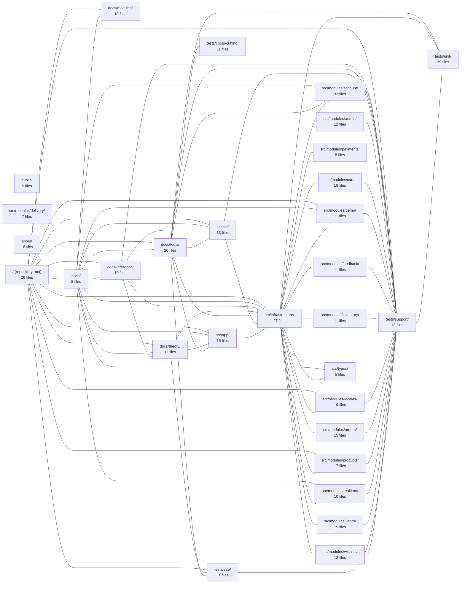

---
tags:
  - 2repo
  - 2repo/index
  - project/boilerplate-vue-frontend
type: index
modules: 30
updated: 2026-08-30T17:13:32.814445+00:00
---

# boilerplate-vue-frontend

boilerplate-vue-frontend is a Vue.js e-commerce frontend starter whose application code is organized around domain feature modules—account, cart, orders, payments, products, wishlist, inventory, delivery, and others—under `src/modules/`, with shared concerns separated into `src/infrastructure/`, `src/ui/`, and `src/types/`. The repository pairs this source tree with a structured documentation set (`docs/` covering module guides, API reference, architecture theory, and tooling notes), build and utility `scripts/`, and a multi-layer test suite spanning unit, cross-cutting, and end-to-end tests.

## Module map

_16 lower-traffic connection(s) hidden to keep the diagram readable._

## Modules
- [[boilerplate-vue-frontend_docs|docs/]] — 8 files, 12 connected modules
- [[boilerplate-vue-frontend_docs_modules|docs/modules/]] — 18 files, 4 connected modules
- [[boilerplate-vue-frontend_docs_reference|docs/reference/]] — 10 files, 9 connected modules
- [[boilerplate-vue-frontend_docs_theory|docs/theory/]] — 11 files, 9 connected modules
- [[boilerplate-vue-frontend_docs_tools|docs/tools/]] — 20 files, 11 connected modules
- [[boilerplate-vue-frontend_public|public/]] — 5 files, 0 connected modules
- [[boilerplate-vue-frontend_scripts|scripts/]] — 13 files, 9 connected modules
- [[boilerplate-vue-frontend_src_app|src/app/]] — 15 files, 7 connected modules
- [[boilerplate-vue-frontend_src_infrastructure|src/infrastructure/]] — 27 files, 21 connected modules
- [[boilerplate-vue-frontend_src_modules_account|src/modules/account/]] — 33 files, 4 connected modules
- [[boilerplate-vue-frontend_src_modules_admin|src/modules/admin/]] — 12 files, 3 connected modules
- [[boilerplate-vue-frontend_src_modules_cart|src/modules/cart/]] — 18 files, 3 connected modules
- [[boilerplate-vue-frontend_src_modules_delivery|src/modules/delivery/]] — 7 files, 0 connected modules
- [[boilerplate-vue-frontend_src_modules_demo|src/modules/demo/]] — 11 files, 4 connected modules
- [[boilerplate-vue-frontend_src_modules_feedback|src/modules/feedback/]] — 11 files, 2 connected modules
- [[boilerplate-vue-frontend_src_modules_inventory|src/modules/inventory/]] — 11 files, 2 connected modules
- [[boilerplate-vue-frontend_src_modules_locales|src/modules/locales/]] — 19 files, 5 connected modules
- [[boilerplate-vue-frontend_src_modules_orders|src/modules/orders/]] — 15 files, 2 connected modules
- [[boilerplate-vue-frontend_src_modules_payments|src/modules/payments/]] — 8 files, 1 connected module
- [[boilerplate-vue-frontend_src_modules_products|src/modules/products/]] — 17 files, 4 connected modules
- [[boilerplate-vue-frontend_src_modules_realtime|src/modules/realtime/]] — 10 files, 3 connected modules
- [[boilerplate-vue-frontend_src_modules_users|src/modules/users/]] — 15 files, 2 connected modules
- [[boilerplate-vue-frontend_src_modules_wishlist|src/modules/wishlist/]] — 12 files, 2 connected modules
- [[boilerplate-vue-frontend_src_types|src/types/]] — 5 files, 3 connected modules
- [[boilerplate-vue-frontend_src_ui|src/ui/]] — 18 files, 2 connected modules
- [[boilerplate-vue-frontend_tests_cross-cutting|tests/cross-cutting/]] — 11 files, 5 connected modules
- [[boilerplate-vue-frontend_tests_e2e|tests/e2e/]] — 11 files, 6 connected modules
- [[boilerplate-vue-frontend_tests_support|tests/support/]] — 13 files, 18 connected modules
- [[boilerplate-vue-frontend_tests_unit|tests/unit/]] — 39 files, 6 connected modules
- [[boilerplate-vue-frontend_ROOT|/ (repository root)]] — 29 files, 13 connected modules
