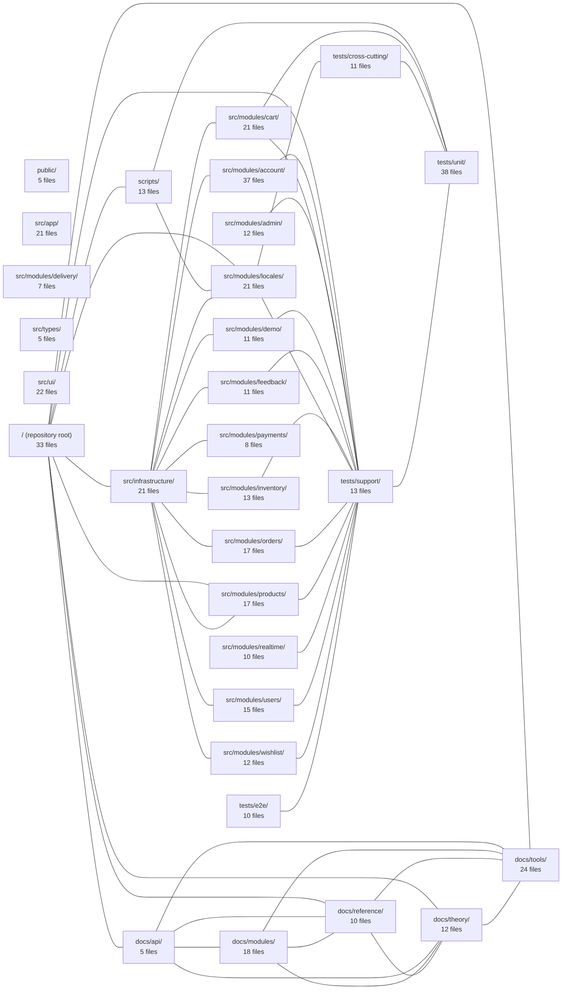

---
tags:
  - 2repo
  - 2repo/index
  - project/boilerplate-vue-frontend
type: index
modules: 30
updated: 2026-09-03T11:01:27.485763+00:00
---

# boilerplate-vue-frontend

`boilerplate-vue-frontend` is a Vue.js frontend boilerplate structured around an e-commerce domain, providing a ready-made foundation for features such as cart, orders, payments, products, inventory, and user accounts. Its source follows a layered layout: `src/app/`, `src/infrastructure/`, `src/ui/`, and `src/types/` hold cross-cutting concerns, while each business feature is isolated as a self-contained directory under `src/modules/`. Supporting material lives in `docs/` (split into api, modules, reference, theory, and tools guides) and `tests/` (unit, e2e, and cross-cutting suites), with build automation in `scripts/` and static assets in `public/`.

## Module map

## Modules
- [[boilerplate-vue-frontend_docs_api|docs/api/]] — 5 files, 5 connected modules
- [[boilerplate-vue-frontend_docs_modules|docs/modules/]] — 18 files, 4 connected modules
- [[boilerplate-vue-frontend_docs_reference|docs/reference/]] — 10 files, 5 connected modules
- [[boilerplate-vue-frontend_docs_theory|docs/theory/]] — 12 files, 5 connected modules
- [[boilerplate-vue-frontend_docs_tools|docs/tools/]] — 24 files, 5 connected modules
- [[boilerplate-vue-frontend_public|public/]] — 5 files, 0 connected modules
- [[boilerplate-vue-frontend_scripts|scripts/]] — 13 files, 3 connected modules
- [[boilerplate-vue-frontend_src_app|src/app/]] — 21 files, 0 connected modules
- [[boilerplate-vue-frontend_src_infrastructure|src/infrastructure/]] — 21 files, 12 connected modules
- [[boilerplate-vue-frontend_src_modules_account|src/modules/account/]] — 37 files, 2 connected modules
- [[boilerplate-vue-frontend_src_modules_admin|src/modules/admin/]] — 12 files, 1 connected module
- [[boilerplate-vue-frontend_src_modules_cart|src/modules/cart/]] — 21 files, 3 connected modules
- [[boilerplate-vue-frontend_src_modules_delivery|src/modules/delivery/]] — 7 files, 0 connected modules
- [[boilerplate-vue-frontend_src_modules_demo|src/modules/demo/]] — 11 files, 2 connected modules
- [[boilerplate-vue-frontend_src_modules_feedback|src/modules/feedback/]] — 11 files, 2 connected modules
- [[boilerplate-vue-frontend_src_modules_inventory|src/modules/inventory/]] — 13 files, 2 connected modules
- [[boilerplate-vue-frontend_src_modules_locales|src/modules/locales/]] — 21 files, 5 connected modules
- [[boilerplate-vue-frontend_src_modules_orders|src/modules/orders/]] — 17 files, 2 connected modules
- [[boilerplate-vue-frontend_src_modules_payments|src/modules/payments/]] — 8 files, 1 connected module
- [[boilerplate-vue-frontend_src_modules_products|src/modules/products/]] — 17 files, 3 connected modules
- [[boilerplate-vue-frontend_src_modules_realtime|src/modules/realtime/]] — 10 files, 1 connected module
- [[boilerplate-vue-frontend_src_modules_users|src/modules/users/]] — 15 files, 2 connected modules
- [[boilerplate-vue-frontend_src_modules_wishlist|src/modules/wishlist/]] — 12 files, 2 connected modules
- [[boilerplate-vue-frontend_src_types|src/types/]] — 5 files, 0 connected modules
- [[boilerplate-vue-frontend_src_ui|src/ui/]] — 22 files, 0 connected modules
- [[boilerplate-vue-frontend_tests_cross-cutting|tests/cross-cutting/]] — 11 files, 2 connected modules
- [[boilerplate-vue-frontend_tests_e2e|tests/e2e/]] — 10 files, 1 connected module
- [[boilerplate-vue-frontend_tests_support|tests/support/]] — 13 files, 15 connected modules
- [[boilerplate-vue-frontend_tests_unit|tests/unit/]] — 38 files, 4 connected modules
- [[boilerplate-vue-frontend_ROOT|/ (repository root)]] — 33 files, 9 connected modules
