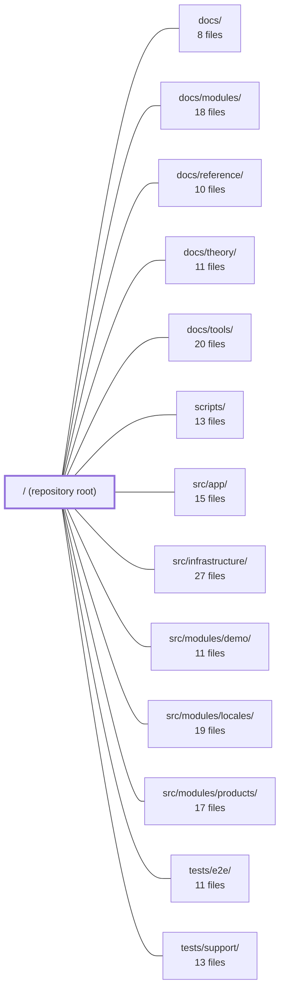

---
tags:
  - 2repo
  - 2repo/module
  - project/boilerplate-vue-frontend
type: module
module: / (repository root)
files: 29
updated: 2026-08-30T17:07:05.973339+00:00
---

# / (repository root)

## Purpose

The repository root is the orchestration layer for **boilerplate-vue-frontend**. It declares the build system (Vite, TypeScript, ESLint, Vitest, Cypress, Stryker), the API contract surface (OpenAPI / AsyncAPI specs and their generated TypeScript & Zod artifacts), project-wide conventions (coding standards, changelog, Docker stacks), and the minimal application shell that boots the Vue 3 + Vuetify storefront. Every domain module, test suite, and documentation set plugs into the infrastructure defined here.

## Key parts

- **Project identity & orientation** — `README.md` (one-minute quick-start and pointer into `docs/`), `CLAUDE.md` (non-negotiable style/typing rules for human and AI contributors), `CHANGELOG.md` (version history), `package.json` (scripts, dependencies, ESM declaration).
- **Build & tooling configuration** — `vite.config.ts` (dev server, plugins, aliases, chunk strategy), the `tsconfig.*` family (project-references split across app, Node, Vitest, and Cypress), `eslint.config.ts` (module-boundary and tier-directionality rules enforced as build errors), `vitest.config.ts` / `vitest.config.mutation.ts` (unit-test and Stryker sandbox configs), `cypress.config.ts` (E2E browser + Node-task setup), `stryker.config.json` + `mutation-baseline.json` (mutation-test thresholds), `index.html` (SPA mount point).
- **API contracts & code-gen** — `openapi.yaml` (bundled REST spec), `asyncapi.yaml` (bundled SSE/observability spec), `orval.config.ts` (codegen driver), `spectral.yaml` (spec linting rules), `contracts/rest/index.ts` + `contracts/rest/schemas.zod.ts` (generated typed client and runtime schemas—do not edit manually).
- **Application shell** — `src/main.ts` (wires Pinia, router, i18n, Vuetify; sequential boot chain), `src/App.vue` (composition root: `<RouterView/>` + a11y live region, no domain logic), `src/modules.ts` (one-line-per-module active list), `src/kernel/registry.ts` (collects routes, nav items, response schemas, and locale contributions from the module array).
- **Containerisation** — `docker-compose.yml` (dev server with hot-reload + VitePress), `docker-compose.production.yml` (static Vite build behind nginx).

## How it connects

- **`scripts/`** — supplies the npm-script implementations (`sync:frontend`, `contracts:bundle`) that *produce* `openapi.yaml`, `asyncapi.yaml`, and the `contracts/rest/*` artifacts declared at the root.
- **`src/modules/demo/`, `src/modules/products/`, `src/modules/locales/`** — the domain modules listed in `src/modules.ts`; `src/kernel/registry.ts` reads them and feeds their routes, navigation entries, response schemas, and i18n dictionaries into the shell.
- **`src/infrastructure/`** — provides the framework plugins (Pinia store factory, router, i18n, Vuetify theme) that `src/main.ts` installs before mounting.
- **`src/app/`** — shell-level components (layout, navigation bar) consumed by `App.vue` and the router assembled from the registry.
- **`tests/e2e/` / `tests/support/`** — the Cypress spec and helper directories that `cypress.config.ts` discovers and `tsconfig.cypress.json` type-checks in isolation.
- **`docs/` (and its sub-sections `modules/`, `reference/`, `theory/`, `tools/`)** — the authoritative documentation that `README.md` explicitly defers to; the VitePress site in `docker-compose.yml` renders it.

## Where to start

1. **`README.md`** — gives the quick-start commands, a one-diagram architecture sketch, and a table of contents into `docs/`, so you know what exists before you read it.
2. **`src/main.ts`** — the single file that shows the exact order in which plugins, module contributions, i18n, observability, and the readiness signal are wired together; reading it top-to-bottom tells you how every other part of the app gets activated.

## Connected modules

[[boilerplate-vue-frontend_docs|docs/]] · [[boilerplate-vue-frontend_docs_modules|docs/modules/]] · [[boilerplate-vue-frontend_docs_reference|docs/reference/]] · [[boilerplate-vue-frontend_docs_theory|docs/theory/]] · [[boilerplate-vue-frontend_docs_tools|docs/tools/]] · [[boilerplate-vue-frontend_scripts|scripts/]] · [[boilerplate-vue-frontend_src_app|src/app/]] · [[boilerplate-vue-frontend_src_infrastructure|src/infrastructure/]] · [[boilerplate-vue-frontend_src_modules_demo|src/modules/demo/]] · [[boilerplate-vue-frontend_src_modules_locales|src/modules/locales/]] · [[boilerplate-vue-frontend_src_modules_products|src/modules/products/]] · [[boilerplate-vue-frontend_tests_e2e|tests/e2e/]] · [[boilerplate-vue-frontend_tests_support|tests/support/]]

## Files
- `CHANGELOG.md` — Records all notable changes to the frontend in Keep a Changelog format. Contract changes do not originate here—they arrive from the paired API via `npm run sync:frontend` and are listed under the release that adopts them. The file doubles as the authoritative log of breaking behavioural and tooling shifts so contributors (human or AI) can reason about what changed between versions.
- `CLAUDE.md` — Mandatory coding-standards and style guide for the project, written as AI-assistant instructions (the name "CLAUDE" signals it is consumed by Claude/LLM agents). It codifies non-negotiable rules for TypeScript, function design, async handling, commenting, and file layout so that generated and human-written code follow a single convention set.
- `README.md` — Entry-point document for the `boilerplate-vue-frontend` repository. It orients a new reader in under a minute—quick-start commands, a one-diagram architecture sketch, and a table of contents into `docs/`—and explicitly defers to that documentation as the authoritative reference. It exists so that neither humans nor AI assistants need to guess where to look first.
- `asyncapi.yaml` — Auto-generated AsyncAPI 2.6.0 specification that defines the real-time (SSE) event contracts for the backend's observability stream. It exists as a single bundled output of `npm run contracts:bundle`, merging the root asyncapi contract with the observability module's contract into one machine- and human-readable document.
- `contracts/rest/index.ts` — Generated TypeScript type definitions and const enums for the Ecommerce Demo REST API (OpenAPI spec v2.0.0), produced by orval v8.20.0. It exists so that any client or server in the monorepo can import stable, codegen-aligned DTOs without hand-maintaining them. The file is **not meant to be edited manually**; the source of truth is the OpenAPI specification.
- `contracts/rest/schemas.zod.ts` — Auto-generated Zod schema definitions for the Ecommerce Demo API REST contract, produced by orval v8.20.0 from the OpenAPI spec (v2.0.0). It provides runtime-validated TypeScript types for every response and request body the API exposes, intended for multi-project, multi-language use (client/server stubs, DTOs, SDKs).
- `cypress.config.ts` — Cypress configuration for all E2E specs that require a real browser. It defines a single set of specs run under two profiles (demo backend by default, live API when `CYPRESS_liveProfile=true`), pins the viewport to keep visual baselines stable, and registers every Node-side task that the browser cannot perform (image diffing, a11y report writing, admin API calls, session creation).
- `docker-compose.production.yml` — Defines the production Docker Compose stack for the frontend: it builds the Vite static bundle (baking all `VITE_*` values in at compile time) and serves it behind nginx. It exists as the deploy counterpart to `docker-compose.yml`, which runs the Vite dev server with bind-mounted sources.
- `docker-compose.yml` — Defines the local development environment for the frontend (Vue/Vite) as a Docker Compose stack. It gives contributors a reproducible, platform-isolated dev server and a VitePress docs site without requiring a host-side Node install, while keeping hot-reload and `.env` editing workflow intact.
- `eslint.config.ts` — ESLint flat-config that encodes this codebase's architecture as lint-time rules. Beyond standard syntax/style enforcement, it uses `no-restricted-imports` to mechanically enforce module boundaries, tier directionality, domain-layer purity, and a ban on double-casts — turning "don't import this" from a convention into a build-blocking error.
- `index.html` — HTML shell and Vite entry point for the Guebbit Vue 3 storefront. It provides the minimal document structure the SPA mounts into, sets browser/PWA metadata, and kicks off the JavaScript bundle.
- `mutation-baseline.json` — Records the per-file mutation-testing kill score (as a percentage) captured at a point in time. It serves as a regression baseline: subsequent mutation-test runs can be diffed against these scores to flag files whose test effectiveness has dropped (or improved) without needing to re-derive expectations manually.
- `openapi.yaml` — The bundled, codegen-oriented OpenAPI 3.0.3 contract for the Ecommerce Demo API (v2.0.0). It is generated by `npm run contracts:bundle` from `shared/contracts/openapi.root.yaml` and per-module `src/modules/*/openapi.yaml` files, and is the single source of truth for client/server stubs, DTOs, and SDK generation across projects and languages.
- `orval.config.ts` — Orval configuration that generates two artifacts from `./openapi.yaml`: a typed axios API client (`contracts/rest/index.ts`) and Zod schemas (`contracts/rest/schemas.zod.ts`). It also applies a custom transformer to normalise operation names when `splitByContentType` is enabled.
- `package.json` — Project manifest for **boilerplate-vue-frontend** (v2.0.0, private, AGPLv3.0). Defines all npm scripts (dev server, builds, testing, linting, code generation, docs, container management), runtime dependencies (Vue 3 ecosystem + Vuetify + Tailwind CSS + TanStack Query), and dev dependencies (Vite, Vitest, Cypress, Stryker, ESLint, Prettier, VitePress, code-gen tooling). The `"type": "module"` field makes the project an ES module package.
- `spectral.yaml` — Spectral linting configuration for the project's OpenAPI specification. It extends the `spectral:oas` rule set and layers custom rules on top to enforce quality gates, naming conventions (camelCase operationIds, PascalCase schemas), and codegen-friendly schema design. The file exists so that spec violations are caught early—by developers locally and in CI—rather than surfacing as broken codegen or inconsistent API surfaces later.
- `src/App.vue` — The composition root of the application. It intentionally contains no domain logic or state—only the `<RouterView />` outlet and a single accessibility live region. All global installs (Pinia, router, i18n, Vuetify) and cross-cutting concerns are handled elsewhere, keeping this file minimal so it stays safe as the first file any derived project inherits.
- `src/kernel/registry.ts` — The module registry that turns the explicit module list in `src/modules.ts` into the running application's routes, navigation, response-schema registrations, and i18n locale contributions. It defines the `AppModule` manifest contract and provides pure collector/sorter/grouping functions so the shell (router, navigation bar, i18n setup) can assemble itself from a flat array of modules without any filesystem discovery.
- `src/main.ts` — Composition root and entry point. Wires infrastructure plugins (Pinia, router, i18n, Vuetify) to the enabled modules' contributed data (response schemas, locale dictionaries), then boots the Vue app as a single promise chain so that remote-locale merge, mount, observability init, and the readiness signal execute strictly in sequence.
- `src/modules.ts` — Central registry that declares which domain modules are included in this build. Adding or removing a domain is a one-line change here (plus the corresponding folder), making the set of active modules the single source of truth the rest of the app boots from.
- `stryker.config.json` — Configuration file for Stryker mutator, defining which source files are mutated, how tests are run (via Vitest), where reports are written, and what score thresholds must be met. It exists so that mutation testing runs consistently across local development and CI without ad-hoc CLI flags.
- `tsconfig.app.json` — TypeScript project configuration for the application source and the generated REST client. It scopes type-checking to `src/` and `contracts/rest` while explicitly excluding per-module test directories, which belong to their own composite projects (Cypress / Vitest). It is a `composite` project, meaning it participates in the solution-level project-references build orchestrated by `tsconfig.json`.
- `tsconfig.cypress.json` — A TypeScript project-references config dedicated to compiling Cypress end-to-end specs. It isolates the `tests/e2e` and per-module `tests/e2e` directories from the main app build so they receive Cypress' ambient types instead of the application's, and so the app's `exclude` globs don't accidentally leave them untyped.
- `tsconfig.json` — This is the root TypeScript project-references configuration. It does not compile any source files itself (`"files": []`) but acts as the top-level entry point that ties together the project's constituent TypeScript configurations (Node, app, and Vitest) via project references.
- `tsconfig.node.json` — A Node.js-scoped TypeScript configuration that type-checks the project's infrastructure and tooling files (Vite, Vitest, Orval, Cypress configs, build scripts, and E2E helper tasks) against the Node 22 type environment. It exists to isolate "server-side" file compilation from the browser-targeted app source, using TS project references.
- `tsconfig.vitest.json` — TypeScript project configuration for the Vitest test environment. It extends `tsconfig.app.json` to add test-specific file inclusions, type declarations (jsdom, node), and exclusions so that running `tsc` against this config type-checks all unit tests, their imports, and the source they exercise—while deliberately excluding Cypress e2e specs that would otherwise produce `cy.*` errors.
- `vite.config.ts` — Vite configuration for a Vue 3 + Vuetify + Tailwind CSS application. Defines dev-server behavior, plugin stack, path aliases, SCSS options, and a manual-chunk rule for the build. Exported as a single default function so it can react to the current Vite `mode`.
- `vitest.config.mutation.ts` — A thin Vitest override consumed only by Stryker's mutation-testing dry run (`npm run test:mutation`). It layers two small changes on top of the shared base config so that Stryker's sandboxed copy of the project can execute tests without a `root`-resolution crash or a false failure from a meta-spec.
- `vitest.config.ts` — Configures the Vitest unit and component test suite: environment, file inclusion, CSS handling, and—most critically—per-file coverage thresholds. It merges the resolved `vite.config.ts` with Vitest-specific `test` options and exports a plain object so `vitest.config.mutation.ts` can layer overrides on top.

---
[[boilerplate-vue-frontend_INDEX|← boilerplate-vue-frontend index]]
