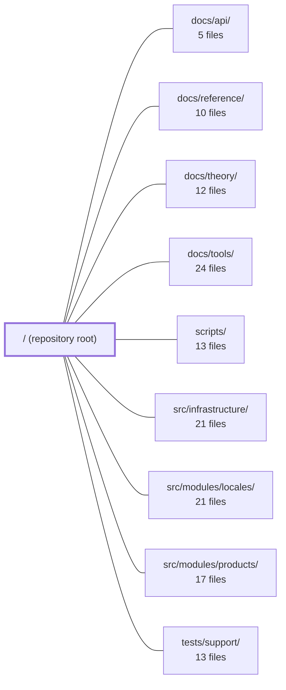

---
tags:
  - 2repo
  - 2repo/module
  - project/boilerplate-vue-frontend
type: module
module: / (repository root)
files: 33
updated: 2026-09-03T10:55:37.204543+00:00
---

# / (repository root)

## Purpose

The repository root of **boilerplate-vue-frontend** (v2.0.0) is the project-level orchestration layer: it declares all build, test, lint, and codegen tooling; houses the generated API contracts that every consumer imports; defines the application's composition root; and provides the Docker, documentation-site, and quality-gate configurations that tie a Vue 3 + Vuetify + Tailwind CSS storefront together. It is designed to be forked as a starting point, so its top-level files are intentionally the "seams" a derived project touches most.

## Key parts

- **API contracts & codegen pipeline** — `openapi.yaml` (REST spec, v2.0.0), `asyncapi.yaml` (SSE/observability stream), `orval.config.ts` (codegen driver), `contracts/rest/index.ts` (typed client + DTOs for 33 endpoints), `contracts/rest/schemas.zod.ts` (runtime Zod validation), and `spectral.yaml` (spec linting rules). Together they form a single pipeline: `openapi.yaml` → orval → typed artifacts, with Spectral guarding spec quality upstream.
- **Application composition root** — `index.html` (Vite entry shell), `src/main.ts` (sequential boot: locale merge → mount → observability → readiness), `src/modules.ts` (one-line domain-module registry), `src/App.vue` (minimal router render + live region), and `src/kernel/registry.ts` (typed manifest + collectors that turn the module list into routes, nav entries, schemas, and locale loaders).
- **Build, type-check & lint tooling** — `vite.config.ts`, `package.json` (all npm scripts), `tsconfig.json` (project-references root) with satellite configs (`tsconfig.app.json`, `tsconfig.node.json`, `tsconfig.cypress.json`, `tsconfig.vitest.json`), and `eslint.config.ts` (flat config with `no-restricted-imports` enforcing module boundaries and tier directionality at build time).
- **Testing & quality gates** — `vitest.config.ts` (per-file coverage thresholds), `vitest.config.mutation.ts` (Stryker override), `stryker.config.json`, `mutation-baseline.json`, and `cypress.config.ts` (two backend profiles, `cy.task` handlers, sharding tuning).
- **Docker & deployment** — `docker-compose.yml` (dev: Vite HMR + VitePress, no host Node needed) and `docker-compose.production.yml` (nginx-served static build with `VITE_*` baked in).
- **Documentation site & project docs** — `docs/.vitepress/config.mts` (sidebar, nav, search, Mermaid theme), `docs/.vitepress/theme/index.ts` (click-to-zoom for Mermaid SVGs), `docs/index.md`, `docs/getting-started.md`, plus `README.md`, `CLAUDE.md` (AI-assistant coding standards), and `CHANGELOG.md`.

## How it connects

- **`src/infrastructure/`** — `src/main.ts` hands domain data (response schemas, locale dictionaries) down to the infrastructure tier before mounting; the infrastructure tier then owns HTTP, i18n runtime, and observability plumbing.
- **`src/modules/locales/` and `src/modules/products/`** — These are the domain modules listed in `src/modules.ts`. The kernel registry (`src/kernel/registry.ts`) reads their exports to build route records, nav entries, and locale loaders. `main.ts` specifically merges the locales module's remote dictionaries before app mount.
- **`docs/api/`, `docs/reference/`, `docs/theory/`, `docs/tools/`** — These are the four content sections that the VitePress sidebar in `docs/.vitepress/config.mts` links to. The root README and `docs/index.md` both point readers into these directories as the authoritative reference.
- **`scripts/`** — Consumed by the npm scripts declared in `package.json` (e.g., `sync:frontend`, `contracts:bundle`, codegen, and mutation-testing runners).
- **`tests/support/`** — Shared E2E helpers and fixtures that `cypress.config.ts` wires in via its `cy.task` registrations and that the per-module `tests/e2e` directories (typed by `tsconfig.cypress.json`) import.

## Where to start

1. **`README.md`** — It orients you in under a minute: quick-start commands, a one-diagram architecture sketch, and a table of contents into `docs/`. It is explicitly written so no one (human or AI) has to guess where to look next.
2. **`src/modules.ts`** — A two-line file that names every active domain module. Reading it alongside `src/kernel/registry.ts` gives you the full "what does this build contain?" answer and the pattern every new domain must follow, making the rest of `src/` navigable by reference.

## Connected modules

[[boilerplate-vue-frontend_docs_api|docs/api/]] · [[boilerplate-vue-frontend_docs_reference|docs/reference/]] · [[boilerplate-vue-frontend_docs_theory|docs/theory/]] · [[boilerplate-vue-frontend_docs_tools|docs/tools/]] · [[boilerplate-vue-frontend_scripts|scripts/]] · [[boilerplate-vue-frontend_src_infrastructure|src/infrastructure/]] · [[boilerplate-vue-frontend_src_modules_locales|src/modules/locales/]] · [[boilerplate-vue-frontend_src_modules_products|src/modules/products/]] · [[boilerplate-vue-frontend_tests_support|tests/support/]]

## Files
- `CHANGELOG.md` — Records all notable changes to the frontend in Keep a Changelog format. Contract changes do not originate here—they arrive from the paired API via `npm run sync:frontend` and are listed under the release that adopts them. The file doubles as the authoritative log of breaking behavioural and tooling shifts so contributors (human or AI) can reason about what changed between versions.
- `CLAUDE.md` — Mandatory coding-standards and style guide for the project, written as AI-assistant instructions (the name "CLAUDE" signals it is consumed by Claude/LLM agents). It codifies non-negotiable rules for TypeScript, function design, async handling, commenting, and file layout so that generated and human-written code follow a single convention set.
- `README.md` — Entry-point document for the `boilerplate-vue-frontend` repository. It orients a new reader in under a minute—quick-start commands, a one-diagram architecture sketch, and a table of contents into `docs/`—and explicitly defers to that documentation as the authoritative reference. It exists so that neither humans nor AI assistants need to guess where to look first.
- `asyncapi.yaml` — Auto-generated AsyncAPI 2.6.0 specification that defines the real-time (SSE) event contracts for the backend's observability stream. It exists as a single bundled output of `npm run contracts:bundle`, merging the root asyncapi contract with the observability module's contract into one machine- and human-readable document.
- `contracts/rest/index.ts` — Auto-generated Orval v8.20.0 TypeScript client for the Ecommerce Demo API (OpenAPI 2.0.0). It defines the shared DTO types, request/response interfaces, and enum constants that every consumer (frontend, SDK, test suite) imports to speak the REST contract. The file is the single source of typed shape knowledge for all 33 endpoints and is regenerated whenever the OpenAPI spec changes.
- `contracts/rest/schemas.zod.ts` — Auto-generated (by orval v8.20.0 from OpenAPI spec v2.0.0) Zod validation schemas for the Ecommerce Demo API's REST endpoints. It defines the shape of request bodies and response envelopes so that server-side handlers and client SDKs can validate payloads at runtime without duplicating the contract.
- `cypress.config.ts` — Cypress configuration for all browser-based E2E tests. It defines the two runtime profiles (demo backend vs. live API), pins the viewport for visual-diff stability, registers Node-side `cy.task` handlers that the browser cannot perform (filesystem reads, second-session auth, a11y report writing), and sets execution-tuning options (retries, memory management, timeouts) appropriate for sharded headless runs.
- `docker-compose.production.yml` — Defines the production Docker Compose stack for the frontend: it builds the Vite static bundle (baking all `VITE_*` values in at compile time) and serves it behind nginx. It exists as the deploy counterpart to `docker-compose.yml`, which runs the Vite dev server with bind-mounted sources.
- `docker-compose.yml` — Defines the local development environment for the frontend (Vue/Vite) as a Docker Compose stack. It gives contributors a reproducible, platform-isolated dev server and a VitePress docs site without requiring a host-side Node install, while keeping hot-reload and `.env` editing workflow intact.
- `docs/.vitepress/config.mts` — VitePress site configuration for the project documentation. It defines the site metadata, top-level navigation, the full sidebar tree for every doc section, local search, a GitHub social link, and the Mermaid diagram theme used throughout the docs.
- `docs/.vitepress/theme/index.ts` — VitePress custom theme entry point that extends the default theme to add a click-to-zoom overlay for Mermaid SVG diagrams. It also imports project-specific stylesheet (`./custom.css`). The file exists so that dynamically-rendered Mermaid charts (which appear after hydration) still receive a zoom interaction without requiring a per-component hook.
- `docs/getting-started.md` — Onboarding guide that takes a developer from a fresh clone to a running storefront in three commands. It exists to eliminate the most common "it does not work" scenario — the app pointing at the wrong backend — by front-loading the demo-vs-full-stack distinction before any setup steps.
- `docs/index.md` — This is the VitePress home page (`layout: home`) for the boilerplate's docs site. It orients a reader in under a minute: what the repo is, how the five docs sections (Theory, Modules, Tools, API, Files) divide the work, and where to start depending on the question you're trying to answer.
- `eslint.config.ts` — ESLint flat-config that encodes this codebase's architecture as lint-time rules. Beyond standard syntax/style enforcement, it uses `no-restricted-imports` to mechanically enforce module boundaries, tier directionality, domain-layer purity, and a ban on double-casts — turning "don't import this" from a convention into a build-blocking error.
- `index.html` — HTML shell and Vite entry point for the Guebbit Vue 3 storefront. It provides the minimal document structure the SPA mounts into, sets browser/PWA metadata, and kicks off the JavaScript bundle.
- `mutation-baseline.json` — A generated snapshot of per-file mutation testing scores for the project's source tree. It records the mutation score (0–100) achieved for each tracked file at a single point in time, serving as a baseline against which future runs can be compared to detect regressions or improvements in test effectiveness.
- `openapi.yaml` — A generated OpenAPI 3.0.3 contract that defines the REST API surface for the Ecommerce Demo (v2.0.0). It is the single, codegen-oriented spec from which client/server stubs, DTOs, and SDKs are produced across projects and languages. Developers never edit it directly; it is produced by bundling module-level specs.
- `orval.config.ts` — Orval configuration that generates two artifacts from `./openapi.yaml`: a typed axios API client (`contracts/rest/index.ts`) and Zod schemas (`contracts/rest/schemas.zod.ts`). It also applies a custom transformer to normalise operation names when `splitByContentType` is enabled.
- `package.json` — Project manifest for **boilerplate-vue-frontend** (v2.0.0, AGPL-3.0, ES modules). Defines all runtime/dev dependencies, npm scripts (dev, build, test, lint, docs, codegen), and tooling configuration that drive the Vite + Vue 3 frontend and its surrounding quality gates.
- `spectral.yaml` — Spectral linting configuration for the project's OpenAPI specification. It extends the `spectral:oas` rule set and layers custom rules on top to enforce quality gates, naming conventions (camelCase operationIds, PascalCase schemas), and codegen-friendly schema design. The file exists so that spec violations are caught early—by developers locally and in CI—rather than surfacing as broken codegen or inconsistent API surfaces later.
- `src/App.vue` — The composition root of the application. It renders the active route and a single persistent screen-reader live region. By design it holds no domain state, no layout chrome, and no business logic — everything else is installed by `src/main.ts` or contributed via the kernel registry. It exists so derived projects have one trivially small file to open first without inheriting stale state from a previous domain folder.
- `src/kernel/registry.ts` — Defines the typed manifest that each domain module contributes to the application and provides the collector/utility functions that turn the flat list in `src/modules.ts` into runnable artifacts (route records, navigation entries, response schemas, locale loaders). It exists so that "what does this build contain?" is answerable from one explicit, statically-typed list rather than filesystem discovery.
- `src/main.ts` — The composition root and entry point for the Vue application. It hands module-contributed domain data (response schemas, locale dictionaries) down to the infrastructure tier, then boots the app as a single sequential promise chain—remote-locale merge → mount → observability init → readiness signal—so no step can race the next.
- `src/modules.ts` — The build-level registry of domain modules. It is the single place that declares which `src/modules/<name>/` folders are active in this build, and exports them as an ordered array consumed by the kernel's route-splicing logic. Adding or removing a domain is intentionally a one-line change here plus a folder on disk—no code generation or indirection.
- `stryker.config.json` — Stryker Mutator configuration that defines which source files are subject to mutation testing, how tests are executed (via Vitest), where reports are written, and what quality thresholds gate the build. It exists to make mutation coverage a reproducible, configurable part of the project's quality pipeline.
- `tsconfig.app.json` — TypeScript project configuration for the application source and the generated REST client. It scopes type-checking to `src/` and `contracts/rest` while explicitly excluding per-module test directories, which belong to their own composite projects (Cypress / Vitest). It is a `composite` project, meaning it participates in the solution-level project-references build orchestrated by `tsconfig.json`.
- `tsconfig.cypress.json` — A TypeScript project-references config dedicated to compiling Cypress end-to-end specs. It isolates the `tests/e2e` and per-module `tests/e2e` directories from the main app build so they receive Cypress' ambient types instead of the application's, and so the app's `exclude` globs don't accidentally leave them untyped.
- `tsconfig.json` — This is the root TypeScript project-references configuration. It does not compile any source files itself (`"files": []`) but acts as the top-level entry point that ties together the project's constituent TypeScript configurations (Node, app, and Vitest) via project references.
- `tsconfig.node.json` — A Node.js-scoped TypeScript configuration that type-checks the project's infrastructure and tooling files (Vite, Vitest, Orval, Cypress configs, build scripts, and E2E helper tasks) against the Node 22 type environment. It exists to isolate "server-side" file compilation from the browser-targeted app source, using TS project references.
- `tsconfig.vitest.json` — TypeScript project configuration for the Vitest test environment. It extends `tsconfig.app.json` to add test-specific file inclusions, type declarations (jsdom, node), and exclusions so that running `tsc` against this config type-checks all unit tests, their imports, and the source they exercise—while deliberately excluding Cypress e2e specs that would otherwise produce `cy.*` errors.
- `vite.config.ts` — Vite configuration for a Vue 3 + Vuetify + Tailwind CSS application. Defines dev-server behavior, plugin stack, path aliases, SCSS options, and a manual-chunk rule for the build. Exported as a single default function so it can react to the current Vite `mode`.
- `vitest.config.mutation.ts` — A thin Vitest override consumed only by Stryker's mutation-testing dry run (`npm run test:mutation`). It layers two small changes on top of the shared base config so that Stryker's sandboxed copy of the project can execute tests without a `root`-resolution crash or a false failure from a meta-spec.
- `vitest.config.ts` — Vitest configuration for the unit and component test suite (jsdom-based). It merges the Vite config, points Vitest at the correct spec globs, and enforces **per-file** coverage thresholds so no untested file can hide inside a pooled average.

---
[[boilerplate-vue-frontend_INDEX|← boilerplate-vue-frontend index]]
